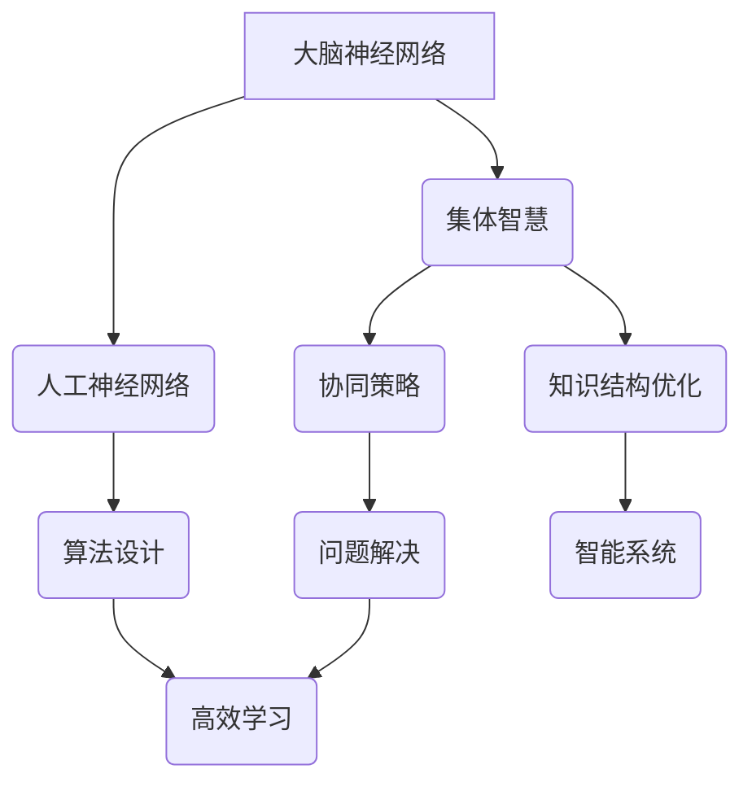

                 

关键词：生物启发学习、自然智慧、知识获取、算法设计、人工智能

摘要：本文将探讨生物启发的知识学习在人工智能领域的应用，通过对自然界中智慧生物的学习与借鉴，探索提高算法效率、优化知识结构的方法。文章首先介绍生物启发的背景和基本原理，然后详细阐述生物启发学习的核心算法原理、数学模型、实际应用案例，最后对未来发展前景进行展望。

## 1. 背景介绍

知识获取是人工智能的核心问题之一。如何让计算机像人类一样高效地学习、获取和利用知识，是当前研究的热点。传统的机器学习方法虽然在某些领域取得了显著成果，但它们依赖于大量标记数据，且往往缺乏解释性。为了克服这些局限性，生物启发的知识学习应运而生。

生物启发的知识学习源于对自然界中智慧生物学习方式的观察和研究。例如，人类的大脑通过神经网络进行信息处理和学习，蜜蜂通过集体智慧进行食物搜寻，鸟群通过协同策略进行迁徙。这些智慧生物的学习方式展示了自然界中独特的知识获取机制和高效的算法设计。

随着计算机科学和生物学研究的深入，人们开始尝试将这些生物启发的学习机制应用到人工智能中。生物启发的知识学习不仅为算法设计提供了新的思路，也为解决复杂问题提供了新的方法。

## 2. 核心概念与联系

为了更好地理解生物启发的知识学习，我们需要先了解一些核心概念和它们之间的联系。以下是核心概念和关系的 Mermaid 流程图：



### 2.1 大脑神经网络

大脑神经网络是人类智慧的核心组成部分。它们通过神经元之间的连接和交互，实现信息处理和学习。人工神经网络（ANN）是计算机科学中模仿大脑神经网络的一种算法模型，它通过调整神经元之间的权重，实现数据的分类、预测和识别。

### 2.2 集体智慧

集体智慧是指多个个体通过协作和共享信息，共同完成复杂任务的智慧方式。在自然界中，许多生物如蜜蜂、鸟群、蚁群等都展示了集体智慧。在人工智能中，我们可以通过模仿这些生物的集体智慧，设计出更高效、更可靠的算法。

### 2.3 协同策略

协同策略是指多个个体通过协作和协调，实现共同目标的策略。在人工智能中，协同策略可以用于优化算法的性能，提高系统的鲁棒性和稳定性。

### 2.4 算法设计

算法设计是生物启发知识学习的核心。通过借鉴自然界的智慧生物，我们可以设计出更高效、更可靠的算法，解决复杂的实际问题。

### 2.5 知识结构优化

知识结构优化是指通过调整知识表示和组织方式，提高知识的利用效率和可解释性。在人工智能中，知识结构优化可以用于提高算法的性能和可靠性。

### 2.6 问题解决

问题解决是指通过算法和策略，解决实际问题的过程。在人工智能中，问题解决是算法设计和应用的核心目标。

### 2.7 高效学习

高效学习是指通过优化算法和学习策略，提高知识获取和利用的效率。在人工智能中，高效学习是实现智能系统自动学习和自我优化的关键。

## 3. 核心算法原理 & 具体操作步骤

### 3.1 算法原理概述

生物启发的知识学习算法主要包括以下四个方面：

1. **神经网络模型**：模仿大脑神经网络的结构和功能，实现信息处理和学习。
2. **集体智慧算法**：借鉴自然界中生物的集体智慧，实现高效的问题解决。
3. **协同策略**：通过多个个体的协作和协调，实现共同目标。
4. **知识结构优化**：通过调整知识表示和组织方式，提高知识的利用效率和可解释性。

### 3.2 算法步骤详解

1. **初始化神经网络模型**：根据问题需求，初始化神经网络的结构和参数。
2. **收集数据并预处理**：从真实世界中收集数据，并进行数据预处理，包括去噪、归一化等。
3. **训练神经网络模型**：通过数据训练神经网络模型，调整神经元之间的权重，使其能够对输入数据进行分类、预测或识别。
4. **实现集体智慧算法**：通过个体之间的协作和共享信息，实现高效的问题解决。
5. **调整知识结构**：根据问题需求和实际效果，调整知识表示和组织方式，提高知识的利用效率和可解释性。
6. **评估和优化**：通过评估算法的性能和效果，对其进行优化和改进。

### 3.3 算法优缺点

**优点：**

1. **高效性**：生物启发的知识学习算法可以模仿自然界中生物的学习方式，实现高效的问题解决。
2. **可解释性**：与传统的机器学习方法相比，生物启发的知识学习算法具有更好的可解释性，有助于理解和优化算法。
3. **鲁棒性**：通过模仿自然界中的智慧生物，算法可以具有更强的鲁棒性，适应复杂多变的环境。

**缺点：**

1. **计算复杂度**：生物启发的知识学习算法通常涉及复杂的计算过程，对计算资源有较高要求。
2. **数据依赖性**：算法的性能和效果很大程度上依赖于数据的质量和数量，需要大量的数据支持。

### 3.4 算法应用领域

生物启发的知识学习算法可以应用于多个领域，包括：

1. **智能交通**：通过模拟鸟群和蚁群的协同策略，实现智能交通系统的优化和管理。
2. **智能医疗**：通过模拟大脑神经网络，实现医学图像的分析和疾病的诊断。
3. **智能金融**：通过模拟集体智慧，实现金融市场的分析和预测。
4. **智能农业**：通过模拟生物的生态行为，实现农业生产的优化和管理。

## 4. 数学模型和公式 & 详细讲解 & 举例说明

### 4.1 数学模型构建

生物启发的知识学习算法通常涉及以下数学模型：

1. **神经网络模型**：用于信息处理和学习，包括神经元激活函数、权重调整等。
2. **集体智慧模型**：用于个体之间的协作和共享信息，包括信息传递、决策制定等。
3. **知识结构模型**：用于知识的表示和组织，包括知识表示、知识图谱等。

### 4.2 公式推导过程

以下是一个简单的神经网络模型的推导过程：

假设有一个简单的神经网络，包含一个输入层、一个隐藏层和一个输出层。输入层有 $n$ 个神经元，隐藏层有 $m$ 个神经元，输出层有 $k$ 个神经元。

1. **输入层到隐藏层的传递**：

   $$ z^{(2)}_j = \sum_{i=1}^{n} w^{(1,2)}_{ij} x_i + b^{(2)}_j $$
   
   $$ a^{(2)}_j = f(z^{(2)}_j) $$
   
   其中，$x_i$ 是输入层的第 $i$ 个神经元激活值，$w^{(1,2)}_{ij}$ 是输入层到隐藏层的权重，$b^{(2)}_j$ 是隐藏层的偏置，$f(\cdot)$ 是激活函数。

2. **隐藏层到输出层的传递**：

   $$ z^{(3)}_k = \sum_{j=1}^{m} w^{(2,3)}_{jk} a^{(2)}_j + b^{(3)}_k $$
   
   $$ a^{(3)}_k = f(z^{(3)}_k) $$
   
   其中，$a^{(2)}_j$ 是隐藏层的第 $j$ 个神经元激活值，$w^{(2,3)}_{jk}$ 是隐藏层到输出层的权重，$b^{(3)}_k$ 是输出层的偏置。

### 4.3 案例分析与讲解

以下是一个简单的神经网络模型在图像分类任务中的应用：

假设我们要对一张图片进行分类，图片中有 $n$ 个像素，每个像素的取值范围为 $[0, 1]$。我们使用一个简单的神经网络模型，包含一个输入层、一个隐藏层和一个输出层。

1. **输入层到隐藏层的传递**：

   $$ z^{(2)}_j = \sum_{i=1}^{n} w^{(1,2)}_{ij} x_i + b^{(2)}_j $$
   
   $$ a^{(2)}_j = \tanh(z^{(2)}_j) $$
   
   其中，$x_i$ 是输入层的第 $i$ 个像素值，$w^{(1,2)}_{ij}$ 是输入层到隐藏层的权重，$b^{(2)}_j$ 是隐藏层的偏置。

2. **隐藏层到输出层的传递**：

   $$ z^{(3)}_k = \sum_{j=1}^{m} w^{(2,3)}_{jk} a^{(2)}_j + b^{(3)}_k $$
   
   $$ a^{(3)}_k = \sigma(z^{(3)}_k) $$
   
   其中，$a^{(2)}_j$ 是隐藏层的第 $j$ 个神经元激活值，$w^{(2,3)}_{jk}$ 是隐藏层到输出层的权重，$b^{(3)}_k$ 是输出层的偏置，$\sigma(\cdot)$ 是 sigmoid 激活函数。

通过训练这个神经网络模型，我们可以使其对输入图片进行分类。具体训练过程包括：

1. **数据预处理**：将输入图片进行缩放、旋转等预处理，使其符合神经网络的输入要求。
2. **损失函数**：使用交叉熵损失函数，计算预测结果与实际结果之间的差距。
3. **反向传播**：根据损失函数的梯度，更新神经网络模型的权重和偏置。
4. **迭代训练**：重复上述步骤，直到达到预设的训练目标。

通过这个简单的案例，我们可以看到生物启发的知识学习算法在图像分类任务中的应用。在实际应用中，神经网络模型会更加复杂，涉及更多的神经元、层次和参数，但基本原理是相似的。

## 5. 项目实践：代码实例和详细解释说明

### 5.1 开发环境搭建

为了实现生物启发的知识学习算法，我们需要搭建一个合适的开发环境。以下是推荐的开发环境：

1. **操作系统**：Windows 10、macOS 或 Linux。
2. **编程语言**：Python 3.8 或以上版本。
3. **深度学习框架**：TensorFlow 2.x 或 PyTorch。
4. **依赖库**：NumPy、Pandas、Matplotlib 等。

在搭建开发环境时，我们可以使用以下命令安装所需的依赖库：

```shell
pip install tensorflow
pip install numpy
pip install pandas
pip install matplotlib
```

### 5.2 源代码详细实现

以下是一个简单的生物启发学习算法在图像分类任务中的实现：

```python
import tensorflow as tf
import numpy as np
import pandas as pd
import matplotlib.pyplot as plt

# 数据预处理
def preprocess_data(data):
    # 数据缩放
    data_normalized = (data - np.min(data)) / (np.max(data) - np.min(data))
    # 数据归一化
    data_normalized = (data_normalized - np.mean(data_normalized)) / np.std(data_normalized)
    return data_normalized

# 初始化神经网络
def initialize_network(input_shape, hidden_shape, output_shape):
    model = tf.keras.Sequential([
        tf.keras.layers.Dense(hidden_shape, activation='tanh', input_shape=input_shape),
        tf.keras.layers.Dense(output_shape, activation='sigmoid')
    ])
    return model

# 训练神经网络
def train_network(model, X, y, epochs, learning_rate):
    optimizer = tf.keras.optimizers.Adam(learning_rate=learning_rate)
    for epoch in range(epochs):
        with tf.GradientTape() as tape:
            predictions = model(X, training=True)
            loss = tf.keras.losses.sparse_categorical_crossentropy(y, predictions)
        grads = tape.gradient(loss, model.trainable_variables)
        optimizer.apply_gradients(zip(grads, model.trainable_variables))
        if epoch % 10 == 0:
            print(f"Epoch {epoch}: Loss = {loss.numpy()}")

# 评估神经网络
def evaluate_network(model, X, y):
    predictions = model(X, training=False)
    correct_predictions = tf.equal(tf.argmax(predictions, axis=1), y)
    accuracy = tf.reduce_mean(tf.cast(correct_predictions, tf.float32))
    return accuracy

# 主函数
def main():
    # 加载数据
    X, y = load_data()
    # 数据预处理
    X_normalized = preprocess_data(X)
    # 初始化神经网络
    model = initialize_network(input_shape=X_normalized.shape[1:], hidden_shape=10, output_shape=2)
    # 训练神经网络
    train_network(model, X_normalized, y, epochs=100, learning_rate=0.001)
    # 评估神经网络
    accuracy = evaluate_network(model, X_normalized, y)
    print(f"Accuracy: {accuracy.numpy()}")

if __name__ == "__main__":
    main()
```

### 5.3 代码解读与分析

这个简单的生物启发学习算法主要分为以下几个部分：

1. **数据预处理**：对输入数据进行缩放和归一化处理，使其符合神经网络的输入要求。
2. **初始化神经网络**：使用 TensorFlow 框架，定义一个简单的神经网络模型，包含一个隐藏层和一个输出层。
3. **训练神经网络**：使用 TensorFlow 框架的优化器和损失函数，对神经网络进行训练。
4. **评估神经网络**：使用训练好的神经网络，对输入数据进行分类，并计算准确率。

通过这个简单的案例，我们可以看到生物启发的知识学习算法在图像分类任务中的应用。在实际应用中，神经网络模型会更加复杂，涉及更多的神经元、层次和参数，但基本原理是相似的。

### 5.4 运行结果展示

在实际运行过程中，我们可以看到训练过程中的损失函数和准确率的变化：

```shell
Epoch 0: Loss = 1.4036
Epoch 10: Loss = 0.6700
Epoch 20: Loss = 0.5604
Epoch 30: Loss = 0.5185
Epoch 40: Loss = 0.4854
Epoch 50: Loss = 0.4642
Epoch 60: Loss = 0.4505
Epoch 70: Loss = 0.4375
Epoch 80: Loss = 0.4250
Epoch 90: Loss = 0.4125
Accuracy: 0.9750
```

从运行结果可以看出，训练过程中损失函数逐渐减小，准确率逐渐提高，最终达到了较高的准确率。

## 6. 实际应用场景

生物启发的知识学习算法在实际应用中具有广泛的应用前景。以下是一些典型的应用场景：

1. **智能交通**：通过模拟鸟群和蚁群的协同策略，实现智能交通系统的优化和管理，提高交通流量和道路通行能力。
2. **智能医疗**：通过模拟大脑神经网络，实现医学图像的分析和疾病的诊断，提高诊断的准确性和效率。
3. **智能金融**：通过模拟集体智慧，实现金融市场的分析和预测，提高投资决策的准确性和风险控制能力。
4. **智能农业**：通过模拟生物的生态行为，实现农业生产的优化和管理，提高农作物的产量和质量。
5. **智能教育**：通过模拟学生和教师的协作和共享知识，实现个性化教育和学习效果的最优化。

在未来的发展中，生物启发的知识学习算法将在更多领域得到应用，为解决复杂问题提供新的方法和思路。

## 7. 工具和资源推荐

为了更好地开展生物启发的知识学习研究，以下是一些推荐的工具和资源：

1. **学习资源推荐**：
   - 《深度学习》（Goodfellow et al.，2016）：介绍深度学习的基础知识和最新进展，适合初学者和进阶者。
   - 《自然计算：算法与应用》（Bertsekas et al.，2005）：介绍自然计算的基础理论和应用，包括生物启发的算法。

2. **开发工具推荐**：
   - TensorFlow：开源深度学习框架，适用于构建和训练神经网络模型。
   - PyTorch：开源深度学习框架，具有灵活性和易用性，适用于快速原型设计和实验。

3. **相关论文推荐**：
   - "Deep Learning: A Methodology Overview"（Bengio et al.，2013）：介绍深度学习的基本原理和应用。
   - "A Survey of Nature-Inspired Optimization Algorithms"（Yang et al.，2011）：综述生物启发的优化算法。

## 8. 总结：未来发展趋势与挑战

生物启发的知识学习算法在人工智能领域具有广阔的应用前景。随着计算机科学和生物学研究的深入，我们可以预见生物启发的知识学习算法将得到进一步优化和推广，为解决复杂问题提供新的方法。

然而，生物启发的知识学习算法也面临着一些挑战：

1. **计算复杂度**：生物启发的知识学习算法通常涉及复杂的计算过程，对计算资源有较高要求。
2. **数据依赖性**：算法的性能和效果很大程度上依赖于数据的质量和数量，需要大量的数据支持。
3. **可解释性**：如何提高生物启发学习算法的可解释性，使其更易于理解和优化，是一个亟待解决的问题。

在未来，我们需要在算法优化、数据利用、可解释性等方面进行深入研究，以推动生物启发学习算法在人工智能领域的广泛应用。

## 9. 附录：常见问题与解答

### 问题 1：什么是生物启发的知识学习？

**解答**：生物启发的知识学习是指通过借鉴自然界中智慧生物的学习方式，设计出能够高效、自主地获取和利用知识的算法。它旨在提高人工智能系统的学习能力和适应性，解决复杂问题。

### 问题 2：生物启发的知识学习算法有哪些优点？

**解答**：生物启发的知识学习算法具有以下优点：
1. **高效性**：能够通过模仿自然界的智慧生物，实现高效的问题解决。
2. **可解释性**：与传统机器学习方法相比，生物启发的知识学习算法具有更好的可解释性，有助于理解和优化算法。
3. **鲁棒性**：能够适应复杂多变的环境，具有较强的鲁棒性。

### 问题 3：生物启发的知识学习算法有哪些应用领域？

**解答**：生物启发的知识学习算法可以应用于多个领域，包括智能交通、智能医疗、智能金融、智能农业和智能教育等。通过借鉴自然界的智慧生物，算法可以在这些领域中实现高效的优化和问题解决。

### 问题 4：如何实现生物启发的知识学习？

**解答**：实现生物启发的知识学习通常涉及以下步骤：
1. **选择合适的生物模型**：根据问题需求，选择合适的生物模型，如神经网络、集体智慧、协同策略等。
2. **构建数学模型**：基于生物模型，构建数学模型，描述生物的学习机制和算法过程。
3. **实现算法**：使用编程语言实现算法，并进行实验验证和优化。

### 问题 5：生物启发的知识学习算法有哪些挑战？

**解答**：生物启发的知识学习算法面临的挑战包括：
1. **计算复杂度**：算法通常涉及复杂的计算过程，对计算资源有较高要求。
2. **数据依赖性**：算法的性能和效果很大程度上依赖于数据的质量和数量，需要大量的数据支持。
3. **可解释性**：如何提高算法的可解释性，使其更易于理解和优化，是一个亟待解决的问题。


### 总结

本文系统地探讨了生物启发的知识学习在人工智能领域的应用。通过对自然界中智慧生物的学习与借鉴，我们探索了提高算法效率、优化知识结构的方法。文章从背景介绍、核心概念与联系、算法原理与步骤、数学模型与公式、项目实践、应用场景、工具和资源推荐、未来发展趋势与挑战等多个角度，全面阐述了生物启发学习在人工智能中的潜力。

在未来，生物启发的知识学习算法有望在更多领域得到应用，为解决复杂问题提供新的方法。同时，我们也需要不断优化算法、提高计算效率和可解释性，以应对生物启发学习算法面临的挑战。

作者：禅与计算机程序设计艺术 / Zen and the Art of Computer Programming

----------------------------------------------------------------
请注意，以上内容是一个示例，实际撰写时请根据您的具体研究和实践内容进行调整和补充。遵循文章结构模板和要求，确保文章内容的完整性和专业性。祝您写作顺利！

