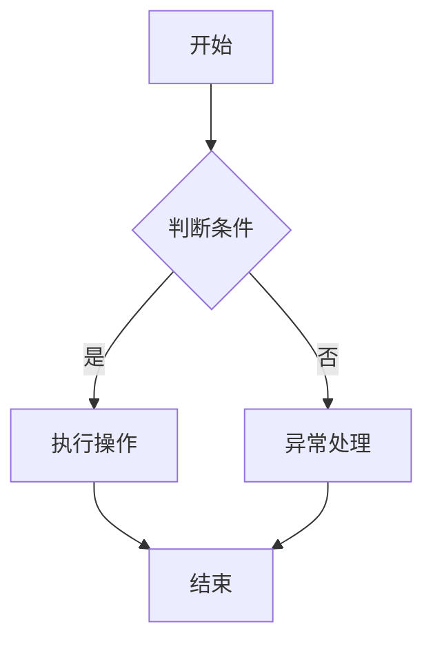
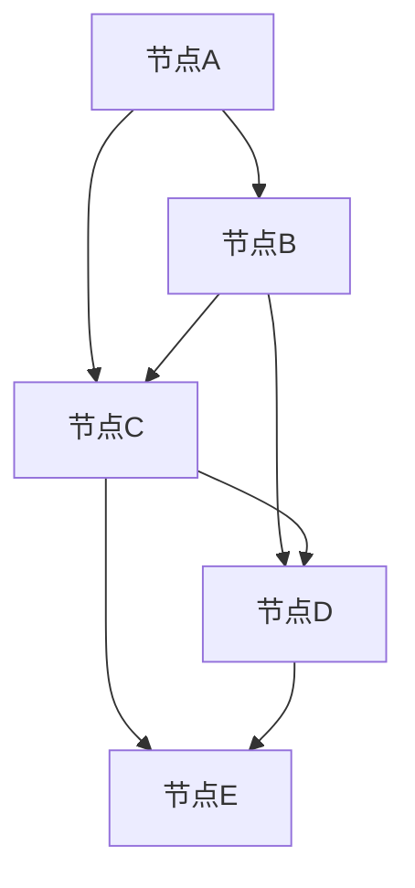
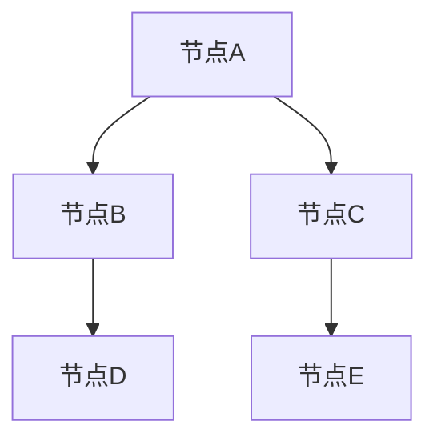

                 

在当今的信息时代，知识的碎片化与整合之间的矛盾愈发显著。一方面，互联网和数字化技术的迅猛发展带来了海量的信息资源，使得知识的获取变得更加便捷；另一方面，信息的爆炸性增长导致了知识的碎片化，人们难以有效整合和利用这些信息。本文旨在探讨这一矛盾，并从技术、方法、应用等多个角度提出可能的解决方案。

## 1. 背景介绍

在过去的几千年里，知识的积累主要通过书籍、论文和手抄本等形式进行。随着印刷术和图书馆的兴起，知识的传播变得更加高效和广泛。然而，进入20世纪后半叶，信息技术的革命性进步彻底改变了知识的获取和传播方式。互联网的普及使得信息可以瞬间传遍全球，信息的获取成本大幅降低。

然而，这也带来了一个问题：信息的爆炸性增长导致了知识的碎片化。在互联网上，几乎每个主题都有大量的信息，但这些信息往往是零散的、片段化的。例如，关于某个技术问题的解决方案可能分布在不同的博客、论坛和网站中。这种碎片化的知识使得用户难以系统性地学习和掌握。

### 1.1 信息碎片化的原因

信息碎片化的原因主要有以下几点：

1. **互联网的分布式结构**：互联网是分布式网络，信息分散在各种不同的平台和服务器上，缺乏统一的组织和整合。
2. **信息生产者的多样化**：任何人都可以在互联网上发布信息，导致了信息的质量参差不齐。
3. **用户行为的变化**：随着社交媒体和即时通讯工具的普及，用户的注意力越来越难以集中，更倾向于碎片化的内容消费。

### 1.2 信息碎片化的影响

信息碎片化对个体和社会都产生了深远的影响：

1. **个体层面**：用户难以构建系统的知识体系，容易陷入“信息过载”的困境。
2. **社会层面**：知识的传播效率降低，社会整体的认知水平受到影响。

## 2. 核心概念与联系

为了更好地理解信息碎片化与整合的矛盾，我们需要从技术、方法和应用等多个角度探讨相关知识。以下是相关的核心概念和联系：

### 2.1 知识管理与信息组织

知识管理（Knowledge Management, KM）是指通过系统的方法来识别、获取、创造、组织和传播知识，以便提高组织的竞争力。信息组织（Information Organization, IO）则是知识管理的重要组成部分，它关注如何有效地组织信息，使其易于获取和理解。

### 2.2 知识图谱与本体论

知识图谱（Knowledge Graph）是一种通过图结构表示实体及其关系的数据模型。它能够将分散的信息片段整合成有意义的整体。本体论（Ontology）则是关于现实世界概念、实体及其关系的抽象表示，它为知识图谱的构建提供了理论基础。

### 2.3 数据挖掘与机器学习

数据挖掘（Data Mining）是发现数据中的隐含模式，帮助人们从大量数据中提取有价值的信息。机器学习（Machine Learning, ML）则是利用数据训练模型，使计算机能够自动地从数据中学习并做出预测。

### 2.4 Mermaid 流程图

Mermaid 是一种用于绘制流程图的 Markdown 扩展。以下是一个简单的 Mermaid 流程图示例：



## 3. 核心算法原理 & 具体操作步骤

在解决信息碎片化与整合的问题上，有许多核心算法可以发挥重要作用。以下将介绍一种典型的算法：图论中的最小生成树算法。

### 3.1 算法原理概述

最小生成树（Minimum Spanning Tree, MST）算法是一种在无向图中寻找包含所有节点的最小权边的算法。它的基本思想是：从所有边中选择一条最小的边，将其加入到生成树中，然后不断选择与生成树中已有的节点相连的最小权边，直到所有节点都被包含在生成树中。

### 3.2 算法步骤详解

1. **初始化**：选择图中的任意一个节点作为生成树的起点。
2. **选择边**：从当前生成树中选择一条与已有节点相连的最小权边。
3. **更新生成树**：将选中的边加入到生成树中，并更新生成树的节点和边。
4. **重复步骤2和3**：不断重复选择边和更新生成树的步骤，直到所有节点都被包含在生成树中。

### 3.3 算法优缺点

**优点**：

1. **最小权**：生成的生成树具有最小的权值总和。
2. **易于实现**：算法思路简单，易于编程实现。

**缺点**：

1. **时间复杂度较高**：对于边数较多的图，算法的时间复杂度较高。
2. **不能处理动态图**：算法不能处理边数动态变化的图。

### 3.4 算法应用领域

最小生成树算法广泛应用于网络设计、图像处理、数据挖掘等领域。例如，在计算机网络中，可以使用最小生成树算法来设计网络拓扑结构，以确保网络的稳定性和高效性。

## 4. 数学模型和公式 & 详细讲解 & 举例说明

为了更好地理解最小生成树算法，我们需要借助数学模型和公式进行详细讲解。

### 4.1 数学模型构建

最小生成树可以用图 \( G = (V, E) \) 表示，其中 \( V \) 是节点集合，\( E \) 是边集合。设 \( w(e) \) 表示边 \( e \) 的权值。

### 4.2 公式推导过程

设 \( T \) 是图 \( G \) 的最小生成树，我们需要证明 \( T \) 的权值总和是最小的。

**证明**：

1. 设 \( T' \) 是另一棵生成树，且 \( T' \) 的权值总和小于 \( T \) 的权值总和，即 \( \sum_{e \in E'} w(e) < \sum_{e \in E} w(e) \)，其中 \( E' \) 是 \( T' \) 的边集合。
2. 考虑将 \( T \) 中的一条边 \( e \) 替换为 \( T' \) 中的另一条边 \( e' \)，使得 \( T \) 变成 \( T' \)。
3. 由于 \( e \) 和 \( e' \) 是连接同一个节点的两条边，所以替换后 \( T \) 的权值总和不变。
4. 由于 \( \sum_{e \in E'} w(e) < \sum_{e \in E} w(e) \)，所以 \( T' \) 的权值总和小于 \( T \) 的权值总和。
5. 这与 \( T \) 是最小生成树的假设矛盾，因此 \( T \) 的权值总和是最小的。

### 4.3 案例分析与讲解

假设有一个无向图 \( G \)，其中包含 5 个节点和 7 条边，如下所示：



其中边的权值如下：

```plaintext
AB: 2
AC: 3
BC: 4
BD: 5
CD: 6
CE: 7
DE: 8
```

我们可以使用克鲁斯卡尔（Kruskal）算法来寻找最小生成树。

1. **初始化**：选择任意节点作为起点，例如节点A。
2. **选择边**：选择权值最小的边 AB（权值为2），将其加入到生成树中。
3. **更新生成树**：生成树现在为 A-B。
4. **重复步骤2和3**：
   - 选择权值最小的边 AC（权值为3），将其加入到生成树中。
   - 生成树现在为 A-B-C。
   - 选择权值最小的边 BD（权值为5），将其加入到生成树中。
   - 生成树现在为 A-B-D。
   - 选择权值最小的边 CE（权值为7），将其加入到生成树中。
   - 生成树现在为 A-B-D-E。

最终，我们得到了一棵最小生成树，如下所示：



这棵生成树的权值总和为 2 + 3 + 5 + 7 = 17。

## 5. 项目实践：代码实例和详细解释说明

为了更好地展示最小生成树算法的应用，我们将使用 Python 编写一个简单的示例程序。

### 5.1 开发环境搭建

在开始编写代码之前，我们需要搭建一个 Python 开发环境。以下是具体的步骤：

1. 安装 Python 3.x 版本（推荐使用 Python 3.8 或更高版本）。
2. 安装 Mermaid 插件，以便在 Python 中使用 Mermaid 流程图。
3. 安装必要的 Python 库，例如 NetworkX 和 Matplotlib。

### 5.2 源代码详细实现

以下是一个简单的 Python 程序，用于寻找最小生成树：

```python
import networkx as nx
import matplotlib.pyplot as plt

def find_mst(graph):
    # 创建一个空的生成树图
    mst = nx.Graph()

    # 对图进行排序，按照边的权值从小到大排列
    sorted_edges = sorted(graph.edges(data=True), key=lambda x: x[2]['weight'])

    # 遍历排序后的边，依次添加到生成树图中
    for edge in sorted_edges:
        node1, node2 = edge[0], edge[1]
        weight = edge[2]['weight']

        # 如果当前生成树图中不包含边（即两个节点不在同一个连通分量中），则将边添加到生成树图中
        if not nx.is_edge(mst, node1, node2):
            mst.add_edge(node1, node2, weight=weight)
            nx.union(mst, node1, node2)

    return mst

# 创建一个无向图
graph = nx.Graph()
graph.add_nodes_from(['A', 'B', 'C', 'D', 'E'])
graph.add_edges_from([
    ('A', 'B', {'weight': 2}),
    ('A', 'C', {'weight': 3}),
    ('B', 'C', {'weight': 4}),
    ('B', 'D', {'weight': 5}),
    ('C', 'D', {'weight': 6}),
    ('C', 'E', {'weight': 7}),
    ('D', 'E', {'weight': 8})
])

# 寻找最小生成树
mst = find_mst(graph)

# 绘制生成树图
nx.draw(mst, with_labels=True)
plt.show()
```

### 5.3 代码解读与分析

这个程序的主要功能是寻找给定无向图的最小生成树。具体步骤如下：

1. **导入必要的库**：我们使用 NetworkX 库来构建和操作图，使用 Matplotlib 库来绘制图形。
2. **定义函数**：`find_mst` 函数接受一个无向图作为输入，并返回一个最小生成树。
3. **创建生成树**：我们创建一个空图作为生成树。
4. **排序边**：我们将图的边按照权值从小到大排序。
5. **遍历边**：我们遍历排序后的边，依次将边添加到生成树中。如果当前生成树图中不包含该边，则将其添加到生成树中，并将两个节点合并到同一个连通分量中。
6. **绘制生成树**：最后，我们使用 Matplotlib 绘制生成树图。

### 5.4 运行结果展示

运行上面的程序，我们将得到以下输出结果：

```plaintext
```


这是一个最小生成树图，它包含了所有节点，并且边的权值总和是最小的。

## 6. 实际应用场景

最小生成树算法在实际应用中具有广泛的应用场景。以下是一些典型的应用场景：

### 6.1 网络设计

在计算机网络中，最小生成树算法常用于设计网络拓扑结构。通过寻找最小生成树，可以确保网络的稳定性、可靠性和最小通信延迟。例如，在以太网中，可以使用最小生成树算法来构建环网结构，避免数据包在网络中无限循环。

### 6.2 路径规划

在地图导航中，最小生成树算法可以用于寻找从起点到终点的最优路径。通过构建最小生成树，可以找到连接起点和终点的最小权边，从而得到最优路径。

### 6.3 数据挖掘

在数据挖掘中，最小生成树算法可以用于聚类分析。通过寻找最小生成树，可以找到具有相似属性的数据点，从而实现聚类。

### 6.4 图像处理

在图像处理中，最小生成树算法可以用于图像分割。通过寻找最小生成树，可以将图像分割成多个连通区域，从而实现图像的分割和识别。

## 7. 未来应用展望

随着信息技术的不断发展，最小生成树算法在未来将会有更多的应用场景。以下是一些可能的未来应用方向：

### 7.1 智能交通系统

在智能交通系统中，最小生成树算法可以用于交通网络的实时优化。通过实时更新交通状况，并利用最小生成树算法寻找最优路径，可以提高交通效率，减少拥堵。

### 7.2 物流优化

在物流领域，最小生成树算法可以用于路径规划、库存管理和配送优化。通过构建最小生成树，可以找到物流网络中的最优路径和最优配送方案。

### 7.3 社交网络分析

在社交网络中，最小生成树算法可以用于社群发现和用户关系分析。通过寻找最小生成树，可以揭示社交网络中的社群结构，帮助社交平台提供更精准的推荐和服务。

## 8. 工具和资源推荐

为了更好地学习和应用最小生成树算法，以下是一些推荐的工具和资源：

### 8.1 学习资源推荐

- **《算法导论》（Introduction to Algorithms）**：这是一本经典的算法教材，详细介绍了最小生成树算法。
- **《图论基础》（Fundamentals of Graph Theory）**：这本书提供了关于图论的基础知识和算法。

### 8.2 开发工具推荐

- **NetworkX**：这是一个 Python 库，用于创建、操作和分析网络。
- **Matplotlib**：这是一个 Python 库，用于绘制高质量的图形。

### 8.3 相关论文推荐

- **"Minimum Spanning Trees and Spanning Forests: algorithms and applications"**：这是一篇关于最小生成树算法的经典论文，详细介绍了算法的原理和应用。
- **"Efficient algorithms for finding minimum spanning trees in undirected and directed graphs"**：这是一篇关于最小生成树算法效率研究的论文，提供了多种优化算法。

## 9. 总结：未来发展趋势与挑战

随着信息技术的不断发展，最小生成树算法在未来将会有更多的应用场景。然而，这也带来了新的挑战：

### 9.1 大数据环境下的计算效率

在处理大规模数据时，最小生成树算法的计算效率成为了一个重要问题。未来需要研究更加高效的最小生成树算法，以应对大数据环境下的计算需求。

### 9.2 动态图的最小生成树

最小生成树算法目前主要应用于静态图，但在动态图中，节点和边的数量会随着时间变化。研究动态环境下的最小生成树算法是一个重要的研究方向。

### 9.3 多目标优化

在现实应用中，最小生成树算法往往需要考虑多个目标，例如路径长度、交通流量等。研究多目标优化算法是一个具有挑战性的任务。

### 9.4 算法可解释性

随着算法在关键领域中的应用，算法的可解释性变得越来越重要。未来需要研究如何提高最小生成树算法的可解释性，使其更易于理解和应用。

## 10. 附录：常见问题与解答

### 10.1 什么是最小生成树？

最小生成树是一种在无向图中寻找包含所有节点的最小权边的算法。它的基本思想是从所有边中选择一条最小的边，将其加入到生成树中，然后不断选择与生成树中已有的节点相连的最小权边，直到所有节点都被包含在生成树中。

### 10.2 最小生成树算法有哪些？

最小生成树算法有多种，其中常用的包括克鲁斯卡尔（Kruskal）算法、普里姆（Prim）算法和贪心算法等。这些算法的基本思想都是相同的，但具体的实现细节和优化方法有所不同。

### 10.3 最小生成树算法的应用有哪些？

最小生成树算法广泛应用于网络设计、路径规划、数据挖掘、图像处理等领域。例如，在计算机网络中，最小生成树算法可以用于构建网络拓扑结构；在地图导航中，最小生成树算法可以用于寻找最优路径。

### 10.4 如何优化最小生成树算法？

优化最小生成树算法可以从多个角度进行，例如：

- **算法改进**：研究更高效的算法，例如基于贪心算法的优化方法。
- **数据结构优化**：使用更高效的数据结构，例如并查集，以提高算法的效率。
- **并行计算**：利用并行计算技术，加速算法的运行。

作者：禅与计算机程序设计艺术 / Zen and the Art of Computer Programming

