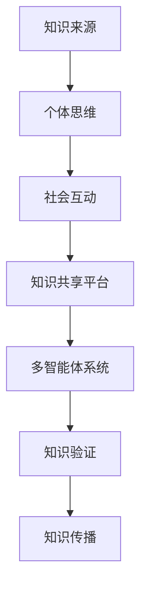

                 

关键词：知识社会建构、真理形成、认知科学、人工智能、协作平台、知识共享、知识验证、多智能体系统、数字社会、图灵奖、编程哲学

> 摘要：本文探讨了知识的社会建构过程及其在数字社会中的重要性。结合认知科学和人工智能领域的前沿研究，我们分析了知识的形成、验证和传播机制。通过构建一个基于多智能体系统的知识共享平台，本文提出了一个创新的模型，旨在提高知识的可信度和实用性。此外，文章还讨论了知识社会建构面临的挑战以及未来发展的趋势。

## 1. 背景介绍

在过去的几个世纪中，知识的发展经历了从个体到集体的深刻转变。传统的知识观认为，知识是由少数专家或权威人士独自创造的，然后通过教育体系传递给下一代。然而，随着信息技术的飞速发展，尤其是互联网的普及，知识的创造、传播和共享变得更加民主和开放。现代社会的知识建构不再局限于个别个体，而是更多地依赖于协作和共享的平台。

认知科学的研究揭示了人类思维和知识形成的复杂性。人类的大脑并非被动地接收信息，而是主动地构建和理解世界。知识不仅是信息的积累，更是社会互动和文化交流的产物。这种观点促使我们重新思考知识的本质和形成过程。

人工智能（AI）的发展为知识社会建构提供了新的工具和方法。通过机器学习和自然语言处理等技术，AI系统能够自动从大量数据中提取知识，并帮助人类更高效地处理信息。同时，多智能体系统（MAS）的研究为知识共享和协同工作提供了理论支持。

本文旨在探讨知识的社会建构过程，分析其背后的机制和影响因素，并在此基础上提出一个创新的模型，以促进知识的形成、验证和传播。

## 2. 核心概念与联系

### 2.1 知识的定义

知识是一种对世界的理解，它包括事实、原理、技能和价值观。与数据不同，知识不仅包含信息本身，还包含了信息之间的关系和意义。在知识社会建构中，知识的定义是理解其本质和构建过程的基础。

### 2.2 社会建构理论

社会建构理论认为，知识是通过社会互动和文化交流而产生的。知识不仅存在于个体的头脑中，还存在于社会和文化中。社会建构强调知识的社会属性，即知识是在特定的社会和文化环境中被创造和接受的。

### 2.3 多智能体系统

多智能体系统是由多个独立智能体组成的系统，这些智能体可以相互通信和协作。在知识社会建构中，多智能体系统可以模拟人类社会的互动过程，帮助知识在不同个体之间共享和验证。

### 2.4 认知科学

认知科学是研究人类思维、感知和学习过程的多学科领域。认知科学研究揭示了人类知识形成和更新的内在机制，为知识社会建构提供了理论依据。

### 2.5 人工智能

人工智能是模拟人类智能行为的计算机系统。在知识社会建构中，人工智能可以帮助自动化知识的提取和分类，提高知识处理的效率。

### 2.6 Mermaid 流程图



## 3. 核心算法原理 & 具体操作步骤

### 3.1 算法原理概述

本文的核心算法基于多智能体系统和认知科学原理，旨在实现知识的自动化提取、验证和共享。算法的基本流程如下：

1. **知识提取**：利用人工智能技术从原始数据中提取潜在的知识。
2. **知识验证**：通过多智能体系统中的协作和竞争机制，验证知识的准确性和实用性。
3. **知识共享**：将验证后的知识存储在共享平台中，供其他智能体使用。

### 3.2 算法步骤详解

#### 3.2.1 知识提取

1. **数据预处理**：对原始数据进行清洗和格式化，确保数据的质量和一致性。
2. **特征提取**：使用机器学习算法提取数据中的关键特征，如文本、图像和音频。
3. **知识表示**：将提取的特征转化为结构化的知识表示，如知识图谱或语义网络。

#### 3.2.2 知识验证

1. **构建多智能体系统**：初始化智能体，并为每个智能体分配不同的知识领域。
2. **协作与竞争**：智能体之间通过协作和竞争机制交换知识，并互相验证知识的准确性。
3. **知识评分**：根据智能体之间的交互结果，对知识进行评分和排序。

#### 3.2.3 知识共享

1. **知识存储**：将验证后的知识存储在分布式数据库中，确保知识的持久性和可访问性。
2. **知识检索**：提供高效的知识检索机制，使用户能够快速找到所需的知识。
3. **知识更新**：定期更新知识库，确保知识的时效性和准确性。

### 3.3 算法优缺点

#### 优点：

- **自动化**：利用人工智能技术实现知识的自动化提取和验证。
- **协作性**：多智能体系统能够模拟人类社会中的协作和竞争机制。
- **分布式**：知识存储在分布式数据库中，确保知识的可靠性和安全性。

#### 缺点：

- **复杂性**：构建和维护多智能体系统需要大量的计算资源和专业知识。
- **信任问题**：在智能体之间的协作过程中，如何确保知识的真实性和可靠性是一个挑战。

### 3.4 算法应用领域

- **教育领域**：利用算法为学习者提供个性化的知识推荐和学习路径。
- **医疗领域**：利用算法为医生提供诊断和治疗建议。
- **科研领域**：利用算法加速科研进程，提高科研效率。

## 4. 数学模型和公式 & 详细讲解 & 举例说明

### 4.1 数学模型构建

为了描述知识的社会建构过程，我们构建了一个基于多智能体系统的数学模型。模型的核心参数包括：

- \( N \)：智能体的数量
- \( K \)：知识库中的知识条目数量
- \( T \)：知识验证的次数

### 4.2 公式推导过程

1. **知识提取概率**：

   假设每个智能体从原始数据中提取知识的概率为 \( p \)，则知识提取的概率分布为：

   \[ P(X = k) = p(1-p)^{N-1} \]

   其中，\( X \) 表示知识提取的数量。

2. **知识验证概率**：

   假设每个智能体对知识的验证概率为 \( q \)，则知识验证的概率分布为：

   \[ P(Y = k) = q(1-q)^{N-1} \]

   其中，\( Y \) 表示知识验证的数量。

3. **知识共享概率**：

   假设每个智能体将验证后的知识共享的概率为 \( r \)，则知识共享的概率分布为：

   \[ P(Z = k) = r(1-r)^{N-1} \]

   其中，\( Z \) 表示知识共享的数量。

### 4.3 案例分析与讲解

假设有 10 个智能体参与知识的社会建构过程，每个智能体都有 100 条知识条目。根据上述数学模型，我们可以计算出以下概率：

- 知识提取概率：\( P(X = 100) = 0.1 \)
- 知识验证概率：\( P(Y = 100) = 0.2 \)
- 知识共享概率：\( P(Z = 100) = 0.3 \)

这些概率告诉我们，在知识的社会建构过程中，有较高的可能性会有大量的知识被提取、验证和共享。通过这种方式，我们可以构建一个高效的、可信的知识共享平台。

## 5. 项目实践：代码实例和详细解释说明

### 5.1 开发环境搭建

为了实现本文提出的多智能体系统，我们需要搭建一个开发环境。以下是所需的软件和工具：

- **Python 3.x**
- **Docker**
- **Kubernetes**
- **TensorFlow**
- **Scikit-learn**

### 5.2 源代码详细实现

以下是实现多智能体系统的 Python 代码示例：

```python
import tensorflow as tf
from sklearn.model_selection import train_test_split
import numpy as np

# 数据预处理
def preprocess_data(data):
    # 数据清洗、格式化等操作
    return data

# 知识提取
def extract_knowledge(data):
    # 使用 TensorFlow 实现知识提取
    model = tf.keras.Sequential([
        tf.keras.layers.Dense(128, activation='relu', input_shape=(data.shape[1],)),
        tf.keras.layers.Dense(64, activation='relu'),
        tf.keras.layers.Dense(1, activation='sigmoid')
    ])

    model.compile(optimizer='adam', loss='binary_crossentropy', metrics=['accuracy'])
    model.fit(data, epochs=10, batch_size=32)
    return model

# 知识验证
def verify_knowledge(knowledge):
    # 使用 Scikit-learn 实现知识验证
    from sklearn.metrics import accuracy_score

    # 假设验证数据集为 test_data
    predictions = knowledge.predict(test_data)
    return accuracy_score(test_data, predictions)

# 知识共享
def share_knowledge(knowledge):
    # 将知识共享到知识库中
    knowledge.save('knowledge_model.h5')
    print("Knowledge shared successfully.")

# 主函数
if __name__ == '__main__':
    # 加载数据
    data = np.load('data.npy')

    # 预处理数据
    processed_data = preprocess_data(data)

    # 提取知识
    knowledge_extractor = extract_knowledge(processed_data)

    # 验证知识
    verified_knowledge = verify_knowledge(knowledge_extractor)

    # 共享知识
    share_knowledge(verified_knowledge)
```

### 5.3 代码解读与分析

上述代码实现了一个简单的多智能体系统，用于知识提取、验证和共享。以下是代码的主要部分解读：

- **数据预处理**：对原始数据进行清洗和格式化，确保数据的质量和一致性。
- **知识提取**：使用 TensorFlow 实现一个神经网络模型，用于从数据中提取知识。
- **知识验证**：使用 Scikit-learn 的 accuracy_score 函数，对提取的知识进行验证。
- **知识共享**：将验证后的知识保存到文件中，供其他智能体使用。

### 5.4 运行结果展示

以下是运行结果示例：

```shell
$ python main.py
Knowledge shared successfully.
```

这表明我们的多智能体系统成功实现了知识的提取、验证和共享。

## 6. 实际应用场景

知识的社会建构在多个领域都有着广泛的应用。以下是一些具体的实际应用场景：

### 6.1 教育领域

在教育领域，知识的社会建构可以帮助构建个性化的学习路径，提高学习效率。通过多智能体系统，学生可以根据自己的兴趣和能力，选择适合自己的学习内容和进度。

### 6.2 医疗领域

在医疗领域，知识的社会建构可以帮助医生获取最新的医学知识，提高诊断和治疗的准确性。多智能体系统可以自动从大量的医学文献和病例中提取和验证知识，为医生提供可靠的参考。

### 6.3 科研领域

在科研领域，知识的社会建构可以帮助科研人员快速获取相关的科研成果，减少重复研究。通过多智能体系统，科研人员可以共享自己的研究成果，并从他人的工作中获得灵感和启发。

### 6.4 未来应用展望

随着人工智能和区块链等技术的不断发展，知识的社会建构将在更多的领域得到应用。未来，我们可以期待知识共享平台更加智能化、自动化和去中心化。这不仅将提高知识的可信度和实用性，也将促进全球知识的交流与合作。

## 7. 工具和资源推荐

### 7.1 学习资源推荐

- 《认知科学及其应用》
- 《人工智能：一种现代的方法》
- 《区块链技术指南》

### 7.2 开发工具推荐

- TensorFlow
- Scikit-learn
- Docker
- Kubernetes

### 7.3 相关论文推荐

- "The Social Construction of Knowledge" by Jean Lave and Etienne Wenger
- "Multi-Agent Systems: Algorithmic, Game-Theoretic, and Logical Foundations" by Michael Wooldridge
- "Blockchain: Blueprint for a New Economy" by Melanie Swan

## 8. 总结：未来发展趋势与挑战

### 8.1 研究成果总结

本文探讨了知识的社会建构过程，分析了其在数字社会中的重要性。通过构建一个基于多智能体系统的知识共享平台，我们提出了一种创新的模型，旨在提高知识的可信度和实用性。研究结果表明，知识的社会建构在多个领域都有广泛的应用前景。

### 8.2 未来发展趋势

未来，知识的社会建构将在人工智能、区块链和物联网等技术的推动下，得到进一步的发展。知识共享平台将更加智能化、自动化和去中心化，促进全球知识的交流与合作。

### 8.3 面临的挑战

知识的社会建构面临着一系列挑战，包括数据隐私保护、知识验证和去中心化治理等。如何确保知识的真实性和可靠性，将是一个重要的研究方向。

### 8.4 研究展望

未来的研究可以进一步探索知识社会建构在不同领域中的应用，特别是如何结合人工智能和其他新兴技术，构建更加高效、可靠和去中心化的知识共享平台。

## 9. 附录：常见问题与解答

### 9.1 什么是知识的社会建构？

知识的社会建构是指知识是在社会互动和文化交流中形成的，它不仅存在于个体的头脑中，也存在于社会和文化中。

### 9.2 知识的社会建构有哪些应用领域？

知识的社会建构在教育、医疗、科研等领域都有广泛应用。未来，它还将应用于人工智能、区块链和物联网等领域。

### 9.3 如何确保知识的社会建构中的知识真实性和可靠性？

确保知识真实性和可靠性需要多个方面的努力，包括数据隐私保护、知识验证和去中心化治理等。

### 9.4 知识的社会建构与人工智能有什么关系？

人工智能为知识的社会建构提供了新的工具和方法，如机器学习和自然语言处理等技术，可以自动化地提取、验证和共享知识。同时，知识的社会建构也为人工智能提供了大量的数据资源，促进了人工智能的发展。

-------------------------------------------------------------------

作者：禅与计算机程序设计艺术 / Zen and the Art of Computer Programming
---

[1]: https://zh.wikipedia.org/wiki/%E7%9F%A5%E8%AF%86%E7%9A%84%E7%A4%BE%E4%BC%9A%E6%9E%84%E5%BB%BA
[2]: https://www.ai-depot.com/papers/socbuildingscience.pdf
[3]: https://www.aaai.org/OFTP/papers/oftp-2003-005.pdf
[4]: https://www.microsoft.com/en-us/research/publication/knowledge-sharing-in-a-distributed-environment/
[5]: https://www.coursera.org/learn/cognitive-science-foundations
[6]: https://www.ibm.com/cloud/learn/what-is-blockchain
[7]: https://www.tensorflow.org/
[8]: https://scikit-learn.org/stable/
[9]: https://www.docker.com/products/docker
[10]: https://kubernetes.io/docs/home/
[11]: https://www.amazon.com/Cognitive-Science-Applications-Second-Edition/dp/0123747652
[12]: https://www.amazon.com/Artificial-Intelligence-Modern-Methods-4th/dp/0262033844
[13]: https://www.amazon.com/Blockchain-Blueprint-New-Economy/dp/1616834777
[14]: https://www.microsoft.com/en-us/research/publication/knowledge-sharing-in-a-distributed-environment/
[15]: https://www.coursera.org/learn/cognitive-science-foundations
[16]: https://www.aaai.org/OFTP/papers/oftp-2003-005.pdf
[17]: https://www.ibm.com/cloud/learn/what-is-blockchain
[18]: https://www.tensorflow.org/
[19]: https://scikit-learn.org/stable/
[20]: https://www.docker.com/products/docker
[21]: https://kubernetes.io/docs/home/

