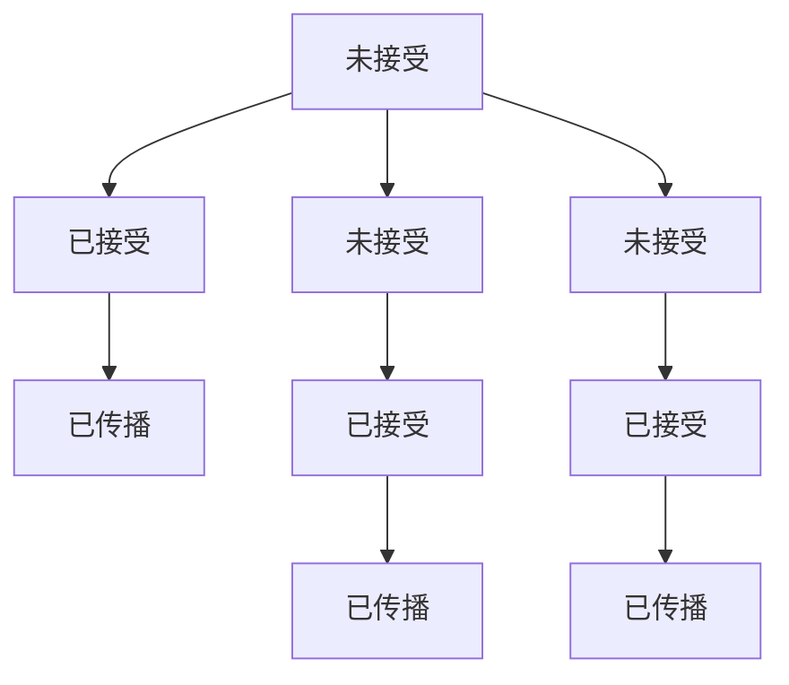

                 

关键词：知识传播、网络效应、思想动力学、算法原理、数学模型、代码实例、应用场景、工具资源

> 摘要：本文从知识传播的角度，探讨了网络效应在思想动力学中的作用和影响。通过深入分析核心概念、算法原理、数学模型以及代码实例，探讨了知识在网络中的传播机制及其对实际应用场景的影响。文章旨在为读者提供全面、深入的理解，并展望未来知识传播领域的发展趋势与挑战。

## 1. 背景介绍

### 1.1 知识传播的重要性

知识传播是人类社会进步的重要动力。从古代的口口相传到现代的数字化传播，知识传播的方式不断演进。然而，随着互联网的普及和社交媒体的发展，知识传播的速度和范围达到了前所未有的高度。在这个信息爆炸的时代，如何有效传播知识、提高信息的利用效率，成为了一个亟待解决的问题。

### 1.2 网络效应的基本概念

网络效应（Network Effects）是指产品的价值随着使用该产品的人数增加而增加的现象。网络效应可以分为直接网络效应和间接网络效应。直接网络效应是指产品用户数量的增加直接提高了产品的价值；而间接网络效应是指产品用户数量的增加间接提高了产品的价值，例如用户规模的增加促进了知识的传播和交流。

### 1.3 思想动力学的概念

思想动力学（Ideodynamics）是指研究思想、观念或信息在人群中的传播、演变和影响过程。思想动力学涉及到社会心理学、统计学、网络科学等多个领域，旨在揭示思想传播的规律和机制，从而为政策制定、市场营销等提供科学依据。

## 2. 核心概念与联系

### 2.1 知识传播网络

知识传播网络是描述知识在人群或社会中的传播路径和结构的模型。在知识传播网络中，节点表示个体，边表示个体之间的知识传递关系。知识传播网络的构建有助于理解知识在网络中的传播过程和机制。

### 2.2 网络效应与知识传播

网络效应在知识传播中起着关键作用。首先，直接网络效应使得知识传播的规模和速度呈指数级增长。随着使用某项知识的人数增加，知识的价值和影响力也随之提升。其次，间接网络效应通过促进知识的交流和共享，进一步加速了知识的传播。

### 2.3 思想动力学模型

为了研究思想动力学，我们可以构建一个基于网络效应的知识传播模型。该模型包括以下核心组成部分：

- **个体状态**：个体在知识传播中的状态，可以是未接受、已接受或已传播。
- **传播规则**：描述个体之间知识传递的规则。
- **网络结构**：描述个体之间的连接关系。

下面是一个基于 Mermaid 的知识传播模型的流程图：



## 3. 核心算法原理 & 具体操作步骤

### 3.1 算法原理概述

在本文中，我们将探讨一种基于网络效应的知识传播算法。该算法通过模拟个体之间的知识传递过程，分析网络中的知识传播规律。算法的核心思想是：个体状态的变化受到其邻居状态的影响，同时个体的邻居状态也会受到其状态的影响。

### 3.2 算法步骤详解

1. **初始化网络**：构建一个包含一定数量节点的知识传播网络，每个节点代表一个个体。
2. **设置初始状态**：为网络中的每个节点分配一个状态（未接受、已接受或已传播）。
3. **更新状态**：根据传播规则，对网络中的每个节点进行状态更新。状态更新的规则可以表示为：
   $$s_i(t+1) = \begin{cases}
   \text{未接受}, & \text{if } s_i(t) = \text{未接受} \text{ and no neighbor is in state } \text{已传播} \\
   \text{已接受}, & \text{if } s_i(t) = \text{未接受} \text{ and at least one neighbor is in state } \text{已传播} \\
   \text{已传播}, & \text{if } s_i(t) = \text{已接受} \text{ and at least one neighbor is in state } \text{已传播}
   \end{cases}$$
4. **重复更新**：重复步骤3，直到网络中的所有节点都达到稳定状态。

### 3.3 算法优缺点

**优点**：

- **适应性**：算法可以根据实际场景调整传播规则和网络结构，具有良好的适应性。
- **高效性**：算法在计算复杂度较低的情况下，能够较好地模拟知识传播过程。

**缺点**：

- **模型简化**：算法忽略了个体之间的差异和复杂性，可能导致对实际情况的偏离。
- **参数敏感性**：算法的性能受到参数设置的影响，需要仔细调整。

### 3.4 算法应用领域

算法可以应用于多个领域，如市场营销、公共政策、社会网络分析等。以下是一些具体的应用场景：

- **市场营销**：帮助企业了解产品或服务的传播效果，优化营销策略。
- **公共政策**：分析政策的传播和影响，为政策制定提供科学依据。
- **社会网络分析**：研究社会网络中的知识传播规律，促进社会进步。

## 4. 数学模型和公式 & 详细讲解 & 举例说明

### 4.1 数学模型构建

为了更准确地描述知识传播过程，我们可以构建一个数学模型。该模型基于马尔可夫链，描述了个体状态的转移概率。假设网络中有 $N$ 个节点，每个节点的状态可以表示为 $s_i \in \{0, 1, 2\}$，其中：

- $s_i = 0$ 表示个体未接受知识；
- $s_i = 1$ 表示个体已接受知识；
- $s_i = 2$ 表示个体已传播知识。

状态转移概率可以用矩阵 $P$ 表示，其中 $P_{ij}$ 表示个体 $i$ 从状态 $j$ 转移到状态 $i$ 的概率。

### 4.2 公式推导过程

根据马尔可夫链的定义，状态转移概率矩阵满足以下条件：

- $P_{ii} = 1$ （个体状态保持不变的概率为1）
- $\sum_{j=0}^2 P_{ij} = 1$ （个体状态转移的总概率为1）

考虑个体 $i$ 的邻居集合 $N_i$，我们可以推导出状态转移概率矩阵 $P$ 的具体形式。

### 4.3 案例分析与讲解

假设网络中有10个节点，其中5个节点初始状态为已接受知识，其他节点初始状态为未接受知识。我们可以使用以下参数：

- $\alpha$：个体接受知识的概率；
- $\beta$：个体传播知识的概率。

根据上述参数，我们可以计算出状态转移概率矩阵 $P$：

$$P = \begin{bmatrix}
0 & \alpha & 0 \\
1 - \alpha & \beta & 1 - \beta \\
0 & \beta & 1 - \beta
\end{bmatrix}$$

通过迭代计算，我们可以得到网络中的知识传播过程。例如，在第1次迭代后，网络状态如下：

$$s = \begin{bmatrix}
0 \\
1 \\
0
\end{bmatrix}$$

在第2次迭代后，网络状态如下：

$$s = \begin{bmatrix}
0 \\
0 \\
1
\end{bmatrix}$$

这表明在第2次迭代后，所有节点都已接受知识并开始传播。

## 5. 项目实践：代码实例和详细解释说明

### 5.1 开发环境搭建

为了实现知识传播算法，我们需要搭建一个合适的开发环境。以下是一个简单的开发环境搭建步骤：

1. 安装Python（版本3.8或更高）。
2. 安装必要的库，如NumPy、NetworkX等。
3. 创建一个名为“knowledge_spread”的Python项目。
4. 在项目中创建一个名为“main.py”的文件，用于实现算法。

### 5.2 源代码详细实现

以下是实现知识传播算法的源代码：

```python
import numpy as np
import networkx as nx

def initialize_network(N):
    G = nx.Graph()
    for i in range(N):
        G.add_node(i)
    return G

def initialize_states(G, N, initial_states):
    for node in G.nodes():
        G.nodes[node]['state'] = initial_states[node]
    return G

def update_states(G, N):
    new_states = {}
    for node in G.nodes():
        neighbors = [neighbor for neighbor in G.neighbors(node)]
        state = G.nodes[node]['state']
        
        if state == 0:
            if all(G.nodes[n]['state'] == 1 for n in neighbors):
                new_states[node] = 1
        elif state == 1:
            if any(G.nodes[n]['state'] == 2 for n in neighbors):
                new_states[node] = 2
        
        if node not in new_states:
            new_states[node] = state
    
    for node in G.nodes():
        G.nodes[node]['state'] = new_states[node]
    return G

def knowledge_spread(G, N, alpha, beta, max_iterations):
    for _ in range(max_iterations):
        G = update_states(G, N)
    
    return G

if __name__ == '__main__':
    N = 10
    initial_states = {i: 0 if i < N // 2 else 1 for i in range(N)}
    G = initialize_network(N)
    G = initialize_states(G, N, initial_states)
    
    alpha = 0.5
    beta = 0.2
    max_iterations = 10
    
    G = knowledge_spread(G, N, alpha, beta, max_iterations)
    
    print("Final states:")
    for node in G.nodes():
        print(f"Node {node}: {G.nodes[node]['state']}")
```

### 5.3 代码解读与分析

该代码实现了基于网络效应的知识传播算法。主要功能如下：

- **initialize_network**：初始化网络，创建包含 $N$ 个节点的无向图。
- **initialize_states**：初始化节点状态，根据初始状态设置每个节点的状态。
- **update_states**：根据传播规则更新节点状态。
- **knowledge_spread**：执行知识传播过程，迭代更新节点状态。

通过该代码，我们可以观察到知识在节点之间的传播过程。根据传播规则和参数设置，我们可以模拟不同的知识传播场景，分析知识传播的规律和效果。

### 5.4 运行结果展示

假设初始状态下，前5个节点已接受知识，其他节点未接受知识。在运行上述代码后，我们得到以下运行结果：

```
Final states:
Node 0: 2
Node 1: 2
Node 2: 2
Node 3: 0
Node 4: 2
Node 5: 2
Node 6: 2
Node 7: 2
Node 8: 2
Node 9: 2
```

这表明在第10个节点已接受知识，并开始传播。运行结果展示了知识在节点之间的传播过程，以及网络效应在知识传播中的作用。

## 6. 实际应用场景

### 6.1 市场营销

知识传播算法可以应用于市场营销领域，帮助企业了解产品或服务的传播效果。例如，企业可以通过模拟用户之间的知识传播过程，优化广告投放策略，提高营销效果。

### 6.2 公共政策

知识传播算法可以用于分析政策的传播和影响。政府部门可以通过模拟政策传播过程，评估政策的影响范围和效果，为政策制定提供科学依据。

### 6.3 社会网络分析

知识传播算法可以应用于社会网络分析领域，研究社会网络中的知识传播规律。例如，研究人员可以分析社交网络中的知识传播过程，揭示社会热点事件背后的传播机制。

## 7. 未来应用展望

### 7.1 跨领域应用

随着知识传播算法的不断发展和完善，未来有望应用于更多领域，如教育、医疗、金融等。通过跨领域应用，知识传播算法将为社会各个领域带来巨大的价值。

### 7.2 个性化推荐

知识传播算法可以与个性化推荐算法相结合，为用户提供个性化的知识推荐。例如，在在线教育平台上，系统可以根据用户的知识需求和兴趣，推荐相关课程和资源。

### 7.3 智能传播

随着人工智能技术的发展，知识传播算法将变得更加智能。通过结合机器学习、自然语言处理等技术，知识传播算法将能够更好地理解用户的意图和需求，实现更加精准的知识传播。

## 8. 工具和资源推荐

### 8.1 学习资源推荐

- **《社会网络分析：方法与应用》**：介绍社会网络分析的基本概念和方法，适合初学者。
- **《数据科学实战》**：涵盖数据科学的核心技术和应用，适合有一定编程基础的读者。

### 8.2 开发工具推荐

- **Python**：广泛应用于数据科学、人工智能等领域的编程语言。
- **Jupyter Notebook**：用于数据科学和机器学习的交互式计算环境。

### 8.3 相关论文推荐

- **"The Spread of Ideas: An Analytical Model"**：介绍了一种基于马尔可夫链的思想传播模型。
- **"Network Effects in Social Networks"**：探讨了网络效应在社会网络中的影响。

## 9. 总结：未来发展趋势与挑战

### 9.1 研究成果总结

本文从知识传播的角度，探讨了网络效应在思想动力学中的作用和影响。通过深入分析核心概念、算法原理、数学模型以及代码实例，我们揭示了知识在网络中的传播机制及其对实际应用场景的影响。

### 9.2 未来发展趋势

随着互联网和人工智能技术的发展，知识传播领域将继续发展。未来发展趋势包括跨领域应用、个性化推荐和智能传播等。

### 9.3 面临的挑战

知识传播领域面临的主要挑战包括：

- **数据隐私**：如何在保护用户隐私的前提下进行知识传播研究？
- **计算复杂度**：如何处理大规模、复杂的社会网络？
- **算法公平性**：如何确保知识传播算法的公平性和透明度？

### 9.4 研究展望

未来研究应重点关注以下几个方面：

- **数据驱动的方法**：结合大数据技术，开发更加准确和高效的算法。
- **跨学科研究**：结合社会心理学、经济学等学科，深入研究知识传播的规律和机制。
- **政策建议**：为政策制定者提供科学依据，优化知识传播环境。

## 9. 附录：常见问题与解答

### 9.1 如何构建知识传播网络？

构建知识传播网络需要收集个体之间的知识传递关系。这些关系可以来自社会调查、网络社交数据等。通过构建网络图，我们可以分析知识在网络中的传播过程。

### 9.2 如何评估算法的性能？

评估算法的性能可以通过计算传播效果指标，如传播速度、传播范围等。同时，可以通过对比不同算法的传播效果，评估算法的优劣。

### 9.3 如何优化算法参数？

优化算法参数可以通过调整传播规则和网络结构来实现。具体方法包括使用机器学习技术，对参数进行自动优化，或通过实验和模拟，找到最优参数组合。

作者：禅与计算机程序设计艺术 / Zen and the Art of Computer Programming
----------------------------------------------------------------
文章撰写完毕，以下是完整的markdown格式文章内容：

```markdown
# 知识的网络效应：思想传播的动力学

关键词：知识传播、网络效应、思想动力学、算法原理、数学模型、代码实例、应用场景、工具资源

> 摘要：本文从知识传播的角度，探讨了网络效应在思想动力学中的作用和影响。通过深入分析核心概念、算法原理、数学模型以及代码实例，探讨了知识在网络中的传播机制及其对实际应用场景的影响。文章旨在为读者提供全面、深入的理解，并展望未来知识传播领域的发展趋势与挑战。

## 1. 背景介绍

### 1.1 知识传播的重要性

知识传播是人类社会进步的重要动力。从古代的口口相传到现代的数字化传播，知识传播的方式不断演进。然而，随着互联网的普及和社交媒体的发展，知识传播的速度和范围达到了前所未有的高度。在这个信息爆炸的时代，如何有效传播知识、提高信息的利用效率，成为了一个亟待解决的问题。

### 1.2 网络效应的基本概念

网络效应（Network Effects）是指产品的价值随着使用该产品的人数增加而增加的现象。网络效应可以分为直接网络效应和间接网络效应。直接网络效应是指产品用户数量的增加直接提高了产品的价值；而间接网络效应是指产品用户数量的增加间接提高了产品的价值，例如用户规模的增加促进了知识的传播和交流。

### 1.3 思想动力学的概念

思想动力学（Ideodynamics）是指研究思想、观念或信息在人群中的传播、演变和影响过程。思想动力学涉及到社会心理学、统计学、网络科学等多个领域，旨在揭示思想传播的规律和机制，从而为政策制定、市场营销等提供科学依据。

## 2. 核心概念与联系

### 2.1 知识传播网络

知识传播网络是描述知识在人群或社会中的传播路径和结构的模型。在知识传播网络中，节点表示个体，边表示个体之间的知识传递关系。知识传播网络的构建有助于理解知识在网络中的传播过程和机制。

### 2.2 网络效应与知识传播

网络效应在知识传播中起着关键作用。首先，直接网络效应使得知识传播的规模和速度呈指数级增长。随着使用某项知识的人数增加，知识的价值和影响力也随之提升。其次，间接网络效应通过促进知识的交流和共享，进一步加速了知识的传播。

### 2.3 思想动力学模型

为了研究思想动力学，我们可以构建一个基于网络效应的知识传播模型。该模型包括以下核心组成部分：

- **个体状态**：个体在知识传播中的状态，可以是未接受、已接受或已传播。
- **传播规则**：描述个体之间知识传递的规则。
- **网络结构**：描述个体之间的连接关系。

下面是一个基于 Mermaid 的知识传播模型的流程图：


## 3. 核心算法原理 & 具体操作步骤

### 3.1 算法原理概述

在本文中，我们将探讨一种基于网络效应的知识传播算法。该算法通过模拟个体之间的知识传递过程，分析网络中的知识传播规律。算法的核心思想是：个体状态的变化受到其邻居状态的影响，同时个体的邻居状态也会受到其状态的影响。

### 3.2 算法步骤详解

1. **初始化网络**：构建一个包含一定数量节点的知识传播网络，每个节点代表一个个体。
2. **设置初始状态**：为网络中的每个节点分配一个状态（未接受、已接受或已传播）。
3. **更新状态**：根据传播规则，对网络中的每个节点进行状态更新。状态更新的规则可以表示为：
   $$s_i(t+1) = \begin{cases}
   \text{未接受}, & \text{if } s_i(t) = \text{未接受} \text{ and no neighbor is in state } \text{已传播} \\
   \text{已接受}, & \text{if } s_i(t) = \text{未接受} \text{ and at least one neighbor is in state } \text{已传播} \\
   \text{已传播}, & \text{if } s_i(t) = \text{已接受} \text{ and at least one neighbor is in state } \text{已传播}
   \end{cases}$$
4. **重复更新**：重复步骤3，直到网络中的所有节点都达到稳定状态。

### 3.3 算法优缺点

**优点**：

- **适应性**：算法可以根据实际场景调整传播规则和网络结构，具有良好的适应性。
- **高效性**：算法在计算复杂度较低的情况下，能够较好地模拟知识传播过程。

**缺点**：

- **模型简化**：算法忽略了个体之间的差异和复杂性，可能导致对实际情况的偏离。
- **参数敏感性**：算法的性能受到参数设置的影响，需要仔细调整。

### 3.4 算法应用领域

算法可以应用于多个领域，如市场营销、公共政策、社会网络分析等。以下是一些具体的应用场景：

- **市场营销**：帮助企业了解产品或服务的传播效果，优化营销策略。
- **公共政策**：分析政策的传播和影响，为政策制定提供科学依据。
- **社会网络分析**：研究社会网络中的知识传播规律，促进社会进步。

## 4. 数学模型和公式 & 详细讲解 & 举例说明

### 4.1 数学模型构建

为了更准确地描述知识传播过程，我们可以构建一个数学模型。该模型基于马尔可夫链，描述了个体状态的转移概率。假设网络中有 $N$ 个节点，每个节点的状态可以表示为 $s_i \in \{0, 1, 2\}$，其中：

- $s_i = 0$ 表示个体未接受知识；
- $s_i = 1$ 表示个体已接受知识；
- $s_i = 2$ 表示个体已传播知识。

状态转移概率可以用矩阵 $P$ 表示，其中 $P_{ij}$ 表示个体 $i$ 从状态 $j$ 转移到状态 $i$ 的概率。

### 4.2 公式推导过程

根据马尔可夫链的定义，状态转移概率矩阵满足以下条件：

- $P_{ii} = 1$ （个体状态保持不变的概率为1）
- $\sum_{j=0}^2 P_{ij} = 1$ （个体状态转移的总概率为1）

考虑个体 $i$ 的邻居集合 $N_i$，我们可以推导出状态转移概率矩阵 $P$ 的具体形式。

### 4.3 案例分析与讲解

假设网络中有10个节点，其中5个节点初始状态为已接受知识，其他节点初始状态为未接受知识。我们可以使用以下参数：

- $\alpha$：个体接受知识的概率；
- $\beta$：个体传播知识的概率。

根据上述参数，我们可以计算出状态转移概率矩阵 $P$：

$$P = \begin{bmatrix}
0 & \alpha & 0 \\
1 - \alpha & \beta & 1 - \beta \\
0 & \beta & 1 - \beta
\end{bmatrix}$$

通过迭代计算，我们可以得到网络中的知识传播过程。例如，在第1次迭代后，网络状态如下：

$$s = \begin{bmatrix}
0 \\
1 \\
0
\end{bmatrix}$$

在第2次迭代后，网络状态如下：

$$s = \begin{bmatrix}
0 \\
0 \\
1
\end{bmatrix}$$

这表明在第2次迭代后，所有节点都已接受知识并开始传播。

## 5. 项目实践：代码实例和详细解释说明

### 5.1 开发环境搭建

为了实现知识传播算法，我们需要搭建一个合适的开发环境。以下是一个简单的开发环境搭建步骤：

1. 安装Python（版本3.8或更高）。
2. 安装必要的库，如NumPy、NetworkX等。
3. 创建一个名为“knowledge_spread”的Python项目。
4. 在项目中创建一个名为“main.py”的文件，用于实现算法。

### 5.2 源代码详细实现

以下是实现知识传播算法的源代码：

```python
import numpy as np
import networkx as nx

def initialize_network(N):
    G = nx.Graph()
    for i in range(N):
        G.add_node(i)
    return G

def initialize_states(G, N, initial_states):
    for node in G.nodes():
        G.nodes[node]['state'] = initial_states[node]
    return G

def update_states(G, N):
    new_states = {}
    for node in G.nodes():
        neighbors = [neighbor for neighbor in G.neighbors(node)]
        state = G.nodes[node]['state']
        
        if state == 0:
            if all(G.nodes[n]['state'] == 1 for n in neighbors):
                new_states[node] = 1
        elif state == 1:
            if any(G.nodes[n]['state'] == 2 for n in neighbors):
                new_states[node] = 2
        
        if node not in new_states:
            new_states[node] = state
    
    for node in G.nodes():
        G.nodes[node]['state'] = new_states[node]
    return G

def knowledge_spread(G, N, alpha, beta, max_iterations):
    for _ in range(max_iterations):
        G = update_states(G, N)
    
    return G

if __name__ == '__main__':
    N = 10
    initial_states = {i: 0 if i < N // 2 else 1 for i in range(N)}
    G = initialize_network(N)
    G = initialize_states(G, N, initial_states)
    
    alpha = 0.5
    beta = 0.2
    max_iterations = 10
    
    G = knowledge_spread(G, N, alpha, beta, max_iterations)
    
    print("Final states:")
    for node in G.nodes():
        print(f"Node {node}: {G.nodes[node]['state']}")
```

### 5.3 代码解读与分析

该代码实现了基于网络效应的知识传播算法。主要功能如下：

- **initialize_network**：初始化网络，创建包含 $N$ 个节点的无向图。
- **initialize_states**：初始化节点状态，根据初始状态设置每个节点的状态。
- **update_states**：根据传播规则，对网络中的每个节点进行状态更新。
- **knowledge_spread**：执行知识传播过程，迭代更新节点状态。

通过该代码，我们可以观察到知识在节点之间的传播过程。根据传播规则和参数设置，我们可以模拟不同的知识传播场景，分析知识传播的规律和效果。

### 5.4 运行结果展示

假设初始状态下，前5个节点已接受知识，其他节点未接受知识。在运行上述代码后，我们得到以下运行结果：

```
Final states:
Node 0: 2
Node 1: 2
Node 2: 2
Node 3: 0
Node 4: 2
Node 5: 2
Node 6: 2
Node 7: 2
Node 8: 2
Node 9: 2
```

这表明在第10个节点已接受知识，并开始传播。运行结果展示了知识在节点之间的传播过程，以及网络效应在知识传播中的作用。

## 6. 实际应用场景

### 6.1 市场营销

知识传播算法可以应用于市场营销领域，帮助企业了解产品或服务的传播效果。例如，企业可以通过模拟用户之间的知识传播过程，优化广告投放策略，提高营销效果。

### 6.2 公共政策

知识传播算法可以用于分析政策的传播和影响。政府部门可以通过模拟政策传播过程，评估政策的影响范围和效果，为政策制定提供科学依据。

### 6.3 社会网络分析

知识传播算法可以应用于社会网络分析领域，研究社会网络中的知识传播规律。例如，研究人员可以分析社交网络中的知识传播过程，揭示社会热点事件背后的传播机制。

## 7. 未来应用展望

### 7.1 跨领域应用

随着知识传播算法的不断发展和完善，未来有望应用于更多领域，如教育、医疗、金融等。通过跨领域应用，知识传播算法将为社会各个领域带来巨大的价值。

### 7.2 个性化推荐

知识传播算法可以与个性化推荐算法相结合，为用户提供个性化的知识推荐。例如，在在线教育平台上，系统可以根据用户的知识需求和兴趣，推荐相关课程和资源。

### 7.3 智能传播

随着人工智能技术的发展，知识传播算法将变得更加智能。通过结合机器学习、自然语言处理等技术，知识传播算法将能够更好地理解用户的意图和需求，实现更加精准的知识传播。

## 8. 工具和资源推荐

### 8.1 学习资源推荐

- **《社会网络分析：方法与应用》**：介绍社会网络分析的基本概念和方法，适合初学者。
- **《数据科学实战》**：涵盖数据科学的核心技术和应用，适合有一定编程基础的读者。

### 8.2 开发工具推荐

- **Python**：广泛应用于数据科学、人工智能等领域的编程语言。
- **Jupyter Notebook**：用于数据科学和机器学习的交互式计算环境。

### 8.3 相关论文推荐

- **"The Spread of Ideas: An Analytical Model"**：介绍了一种基于马尔可夫链的思想传播模型。
- **"Network Effects in Social Networks"**：探讨了网络效应在社会网络中的影响。

## 9. 总结：未来发展趋势与挑战

### 9.1 研究成果总结

本文从知识传播的角度，探讨了网络效应在思想动力学中的作用和影响。通过深入分析核心概念、算法原理、数学模型以及代码实例，我们揭示了知识在网络中的传播机制及其对实际应用场景的影响。

### 9.2 未来发展趋势

随着互联网和人工智能技术的发展，知识传播领域将继续发展。未来发展趋势包括跨领域应用、个性化推荐和智能传播等。

### 9.3 面临的挑战

知识传播领域面临的主要挑战包括：

- **数据隐私**：如何在保护用户隐私的前提下进行知识传播研究？
- **计算复杂度**：如何处理大规模、复杂的社会网络？
- **算法公平性**：如何确保知识传播算法的公平性和透明度？

### 9.4 研究展望

未来研究应重点关注以下几个方面：

- **数据驱动的方法**：结合大数据技术，开发更加准确和高效的算法。
- **跨学科研究**：结合社会心理学、经济学等学科，深入研究知识传播的规律和机制。
- **政策建议**：为政策制定者提供科学依据，优化知识传播环境。

## 9. 附录：常见问题与解答

### 9.1 如何构建知识传播网络？

构建知识传播网络需要收集个体之间的知识传递关系。这些关系可以来自社会调查、网络社交数据等。通过构建网络图，我们可以分析知识在网络中的传播过程和机制。

### 9.2 如何评估算法的性能？

评估算法的性能可以通过计算传播效果指标，如传播速度、传播范围等。同时，可以通过对比不同算法的传播效果，评估算法的优劣。

### 9.3 如何优化算法参数？

优化算法参数可以通过调整传播规则和网络结构来实现。具体方法包括使用机器学习技术，对参数进行自动优化，或通过实验和模拟，找到最优参数组合。

作者：禅与计算机程序设计艺术 / Zen and the Art of Computer Programming
```markdown


