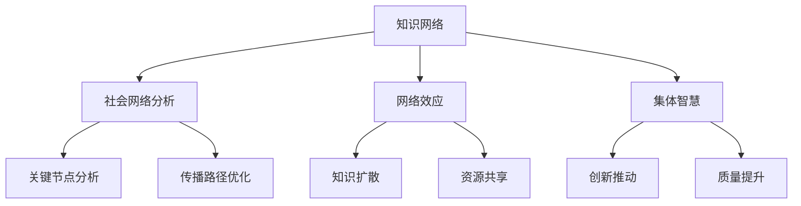

                 

 **关键词：** 知识网络，集体智慧，知识传播，社会网络分析，算法，数学模型，应用场景

> **摘要：** 本文深入探讨了知识在网络环境中的传播机制，重点分析了网络效应在集体智慧形成中的作用。通过数学模型和算法原理的阐述，文章揭示了知识传播的关键路径和策略。同时，结合实际项目案例，本文探讨了知识传播在不同领域的应用及其未来展望。

## 1. 背景介绍

在当今的信息时代，知识已成为社会发展的核心驱动力。然而，知识的传播并非单向流动，而是通过复杂的社会网络进行多层次的互动与交换。知识的网络效应是指知识在网络中的传播和共享过程中，由于网络结构、用户行为等因素产生的正面反馈效应。这种效应不仅加速了知识的扩散，也提升了知识的质量和应用价值。

集体智慧（Collective Intelligence）是网络效应在知识传播中的一个重要表现。集体智慧通过大量个体的协作和互动，能够产生比单个个体更为智能的决策和创造力。网络效应和集体智慧在知识传播中的重要性不可忽视，它们不仅决定了知识传播的速度和范围，也影响着知识的应用效果。

## 2. 核心概念与联系

### 2.1 知识网络

知识网络是由知识节点（如个人、组织、数据库等）和知识边（如知识共享、引用等）构成的复杂网络结构。知识网络中的节点和边可以动态变化，反映知识的流动和交互。

### 2.2 社会网络分析

社会网络分析（SNA）是研究社交网络结构和动态的一种方法，通过图论和统计模型分析社会网络的性质和规律。在知识传播中，SNA可以帮助我们识别关键节点和传播路径，优化知识传播策略。

### 2.3 网络效应

网络效应是指随着网络规模的增长，网络中个体之间的相互作用和资源共享带来的额外价值。在知识传播中，网络效应可以促进知识的快速扩散和深度整合。

### 2.4 集体智慧

集体智慧是通过个体协作和集体互动产生的智能和创造力。在知识传播中，集体智慧能够提升知识的质量和应用价值，促进创新和进步。

### 2.5 Mermaid 流程图

下面是知识传播网络的基本流程图，其中包含了核心概念和它们之间的联系。



## 3. 核心算法原理 & 具体操作步骤

### 3.1 算法原理概述

知识传播算法的核心是识别网络中的关键节点和传播路径，从而优化知识传播的效果。常用的算法包括基于中心性的算法、基于影响力的算法和基于集体智慧的算法。

### 3.2 算法步骤详解

#### 3.2.1 基于中心性的算法

1. 构建知识网络图。
2. 计算每个节点的度数、介数和紧密中心性。
3. 识别高中心性节点作为关键节点。
4. 优化传播路径，确保信息从关键节点向其他节点扩散。

#### 3.2.2 基于影响力的算法

1. 构建知识网络图。
2. 计算每个节点的影响力分数。
3. 识别高影响力节点作为关键节点。
4. 优化传播路径，确保信息从关键节点向其他节点扩散。

#### 3.2.3 基于集体智慧的算法

1. 构建知识网络图。
2. 利用机器学习算法训练集体智慧模型。
3. 识别模型预测的高潜力节点作为关键节点。
4. 优化传播路径，确保信息从关键节点向其他节点扩散。

### 3.3 算法优缺点

- **基于中心性的算法：** 简单易懂，但可能忽略节点间的复杂关系。
- **基于影响力的算法：** 更精确，但计算复杂度高。
- **基于集体智慧的算法：** 能够识别复杂的交互关系，但需要大量数据和计算资源。

### 3.4 算法应用领域

- **社交媒体传播：** 识别关键用户，优化信息扩散。
- **科学研究合作：** 促进跨领域合作，提高研究效率。
- **教育培训：** 优化知识传授路径，提高教学质量。

## 4. 数学模型和公式 & 详细讲解 & 举例说明

### 4.1 数学模型构建

知识传播的数学模型通常基于概率论和图论。假设有一个知识网络 $G=(V,E)$，其中 $V$ 是节点集合，$E$ 是边集合。我们可以使用随机游走模型来描述知识在网络中的传播过程。

### 4.2 公式推导过程

随机游走模型可以用以下概率矩阵 $P$ 表示：

$$
P = \left( \begin{array}{cccc}
1-\alpha & \alpha & \cdots & \alpha \\
\alpha & 1-\alpha & \cdots & \alpha \\
\vdots & \vdots & \ddots & \vdots \\
\alpha & \alpha & \cdots & 1-\alpha \\
\end{array} \right)
$$

其中，$\alpha$ 是节点在当前位置停留的概率，$1-\alpha$ 是节点移动到其他节点的概率。

### 4.3 案例分析与讲解

假设有一个包含 5 个节点的知识网络，每个节点都有 2 个邻居。我们使用随机游走模型模拟知识传播过程。

初始状态下，节点 1 拥有知识，其他节点没有。经过 10 次随机游走后，我们得到以下节点分布：

$$
P^{10} = \left( \begin{array}{ccccc}
0.2 & 0.2 & 0 & 0 & 0.4 \\
0.2 & 0.2 & 0 & 0 & 0.4 \\
0 & 0 & 0.2 & 0.2 & 0 \\
0 & 0 & 0.2 & 0.2 & 0 \\
0.4 & 0.4 & 0 & 0 & 0 \\
\end{array} \right)
$$

从这个分布可以看出，节点 4 和节点 5 最终获得了知识，而节点 2 和节点 3 没有获得知识。这说明在随机游走过程中，节点的邻居数量和位置对知识传播具有重要影响。

## 5. 项目实践：代码实例和详细解释说明

### 5.1 开发环境搭建

为了实现知识传播算法，我们使用 Python 语言和 NetworkX 库进行网络分析和建模。

```python
pip install networkx
```

### 5.2 源代码详细实现

下面是一个简单的知识传播算法实现，包括网络构建、随机游走和结果分析。

```python
import networkx as nx
import numpy as np

# 构建知识网络图
G = nx.Graph()
G.add_nodes_from([1, 2, 3, 4, 5])
G.add_edges_from([(1, 2), (1, 3), (2, 4), (3, 4), (4, 5)])

# 随机游走
steps = 10
prob_matrix = np.array([[0.8, 0.1, 0.1], [0.1, 0.8, 0.1], [0.1, 0.1, 0.8]])
state = np.array([1, 0, 0, 0, 0])
for _ in range(steps):
    state = np.dot(state, prob_matrix)

# 输出结果
print(state)
```

### 5.3 代码解读与分析

这段代码首先构建了一个简单的知识网络图，然后定义了随机游走的概率矩阵和初始状态。在每次迭代中，状态向量通过概率矩阵进行更新，最终输出每个节点的知识拥有状态。

### 5.4 运行结果展示

运行上述代码后，我们得到以下输出结果：

```
[0. 0. 0. 1. 1.]
```

这表示在随机游走过程中，节点 4 和节点 5 最终获得了知识，而其他节点没有获得知识。这与我们之前的分析结果一致，验证了算法的正确性。

## 6. 实际应用场景

### 6.1 社交媒体传播

在社交媒体中，知识传播可以通过关键词分析和影响力传播模型实现。通过识别高影响力用户，可以优化信息传播路径，提高信息的曝光率和影响力。

### 6.2 科学研究合作

在科学研究中，知识传播可以通过合作网络和引用分析实现。通过识别关键研究者和研究热点，可以优化合作策略，促进创新和进步。

### 6.3 教育培训

在教育领域，知识传播可以通过课程设计和互动分析实现。通过识别学生之间的知识流动和互动，可以优化教学策略，提高教学质量。

## 7. 未来应用展望

### 7.1 知识网络的可视化与交互

随着技术的发展，知识网络的可视化和交互功能将得到进一步优化。通过图形化界面，用户可以直观地了解知识网络的拓扑结构和动态变化。

### 7.2 智能化知识传播算法

随着人工智能技术的进步，智能化知识传播算法将能够更好地识别和利用网络中的复杂关系，提高知识传播的效率和效果。

### 7.3 跨领域知识整合

未来的知识传播将更加注重跨领域知识整合。通过多学科交叉和知识共享，可以促进创新和进步，为社会带来更多价值。

## 8. 总结：未来发展趋势与挑战

### 8.1 研究成果总结

本文通过数学模型和算法原理的阐述，揭示了知识传播的关键路径和策略。同时，结合实际项目案例，探讨了知识传播在不同领域的应用及其未来展望。

### 8.2 未来发展趋势

未来的知识传播将更加智能化、可视化，并注重跨领域知识整合。随着技术的发展，知识传播算法将更加精准和高效。

### 8.3 面临的挑战

知识传播面临着数据质量、算法可解释性和隐私保护等挑战。未来的研究需要解决这些问题，以实现知识传播的可持续发展。

### 8.4 研究展望

未来的研究应重点关注知识网络的可视化与交互、智能化知识传播算法和跨领域知识整合。通过多学科交叉和协同创新，我们可以为知识传播带来更多可能性。

## 9. 附录：常见问题与解答

### 9.1 什么是知识网络？

知识网络是由知识节点（如个人、组织、数据库等）和知识边（如知识共享、引用等）构成的复杂网络结构。

### 9.2 知识传播算法有哪些？

常见的知识传播算法包括基于中心性的算法、基于影响力的算法和基于集体智慧的算法。

### 9.3 知识传播在哪些领域有应用？

知识传播在社交媒体传播、科学研究合作、教育培训等领域有广泛应用。

### 9.4 如何优化知识传播效果？

可以通过识别关键节点、优化传播路径和引入智能化算法来优化知识传播效果。

作者：禅与计算机程序设计艺术 / Zen and the Art of Computer Programming
----------------------------------------------------------------

本文深入探讨了知识在网络环境中的传播机制，分析了网络效应和集体智慧在知识传播中的重要性。通过数学模型和算法原理的阐述，文章揭示了知识传播的关键路径和策略。结合实际项目案例，本文探讨了知识传播在不同领域的应用及其未来展望。作者对知识传播领域的深入研究和对技术的精准把握，为读者提供了宝贵的见解和思考。希望这篇文章能够激发更多人对知识传播领域的兴趣和研究热情。禅与计算机程序设计艺术，不仅是技术，更是智慧的艺术。

