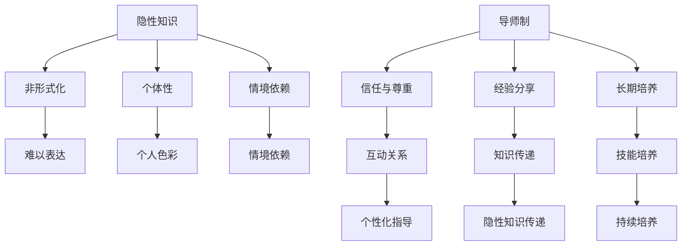

                 

关键字：隐性知识、经验学习、导师制、知识传递、程序员成长

> 摘要：本文探讨了知识隐性传递的重要性和有效性，特别是通过导师制在程序员成长过程中的应用。文章首先介绍了隐性知识的定义和特征，然后分析了导师制在知识传递中的优势，并通过具体案例和算法原理，阐述了如何通过导师制实现经验的有效学习和传递。

## 1. 背景介绍

在信息技术飞速发展的今天，程序员的工作不仅需要具备扎实的编程技能，更需要具备丰富的经验和深刻的专业知识。然而，知识并不是简单地通过课本或教程可以完全获得的，大量的知识是以隐性形式存在的，即那些难以言传、不容易系统化的经验。隐性知识通常是在实际工作中通过观察、实践、反思和交流获得的，这种知识的传递具有很高的难度和复杂性。

导师制是一种古老而又现代的教育模式，其核心是通过一对多的指导关系，实现知识的隐性传递和技能的传承。在程序员成长过程中，导师不仅传授技术知识，更通过身教言传，帮助徒弟理解和掌握那些难以编码的知识。

本文将探讨隐性知识的概念、导师制在知识传递中的重要性，以及如何通过导师制实现程序员的经验学习。文章还将结合具体案例，分析导师制在实际应用中的效果，并提出未来在程序员培训和发展中的发展方向。

## 2. 核心概念与联系

### 隐性知识的概念

隐性知识是指那些难以用语言、文字或符号表达的，存在于个人经验和直觉中的知识。这种知识通常不是通过正式的教育或培训获得的，而是通过实践、观察、体验等方式积累形成的。隐性知识的特点包括：

- **非形式化**：隐性知识往往是非结构化的，没有明确的表达形式。
- **个体性**：隐性知识具有很强的个人色彩，不同的人可能会有不同的隐性知识。
- **情境依赖**：隐性知识往往依赖于特定的情境，脱离情境后难以理解和应用。

### 导师制的概念

导师制是一种基于信任和尊重的教育模式，通过导师与徒弟之间的互动，实现知识的传递和技能的培养。导师制的主要特点包括：

- **一对一或一对多的指导关系**：导师与徒弟之间建立紧密的互动关系，导师提供个性化的指导和反馈。
- **经验分享**：导师通过自己的经验和实践，向徒弟传授那些难以编码的知识。
- **长期培养**：导师制强调长期培养，通过持续的互动和实践，帮助徒弟逐步积累和深化知识。

### 隐性知识与导师制的联系

隐性知识与导师制之间存在着密切的联系。导师制为隐性知识的传递提供了有效的渠道，使得那些难以编码的知识可以通过导师的言传身教，以及徒弟的观察和实践，得以传递和积累。同时，隐性知识也是导师制的重要基础，没有丰富的隐性知识，导师制将失去其核心价值。

为了更好地理解隐性知识与导师制的联系，我们使用Mermaid流程图来展示其核心概念和流程：



### 隐性知识与导师制在实际应用中的效果

在实际应用中，导师制通过以下几种方式实现隐性知识的传递：

- **案例分析**：导师通过分享自己的实战案例，帮助徒弟理解复杂问题的解决方法。
- **实践指导**：导师在徒弟的实践过程中，提供实时反馈和指导，帮助徒弟快速积累经验。
- **经验交流**：导师与徒弟之间的定期交流和讨论，促进知识的共享和深化。
- **反思与总结**：导师引导徒弟进行反思和总结，帮助其将隐性知识转化为可表达的知识。

## 3. 核心算法原理 & 具体操作步骤

### 3.1 算法原理概述

在程序员成长过程中，导师制的核心在于如何有效地实现隐性知识的传递。以下是一种基于导师制的经验学习算法的基本原理：

1. **知识识别**：导师首先需要识别并明确自身拥有的隐性知识。
2. **情境构建**：导师通过构建与实际工作情境相似的实践环境，帮助徒弟理解和应用这些知识。
3. **互动交流**：导师与徒弟通过定期交流和反馈，深化对知识点的理解和掌握。
4. **反思与总结**：导师引导徒弟进行反思和总结，帮助其将隐性知识转化为可表达的知识。
5. **技能评估**：通过定期的技能评估，检验徒弟对知识点的掌握程度，并提供进一步指导。

### 3.2 算法步骤详解

1. **知识识别**：
   - **导师**：通过自我反思和实践总结，明确自身在特定领域内的隐性知识。
   - **工具**：使用知识图谱或思维导图等工具，对隐性知识进行结构化表达。

2. **情境构建**：
   - **导师**：为徒弟构建与实际工作情境相似的实践任务。
   - **环境**：提供模拟工作环境，如代码库、开发工具、测试环境等。

3. **互动交流**：
   - **定期会议**：导师与徒弟定期举行面对面或线上会议，讨论实践中的问题。
   - **反馈机制**：导师提供实时反馈，帮助徒弟纠正错误，优化解决方案。

4. **反思与总结**：
   - **导师引导**：导师引导徒弟进行反思，帮助其理解错误原因和解决方案。
   - **文档记录**：徒弟将反思过程和总结记录下来，形成学习笔记。

5. **技能评估**：
   - **定期的技能评估**：通过实践项目、代码审查、技术面试等方式，评估徒弟的技能水平。
   - **反馈与改进**：导师根据评估结果，为徒弟提供进一步的指导和建议。

### 3.3 算法优缺点

**优点**：

- **个性化指导**：导师制的个性化指导可以更好地满足不同徒弟的学习需求。
- **知识深化**：通过实践和反思，徒弟能够更深刻地理解和掌握知识。
- **技能培养**：导师制的实践环节有助于培养徒弟的实际操作能力和解决问题的能力。

**缺点**：

- **导师依赖**：导师制的有效性高度依赖于导师的经验和指导能力。
- **时间成本**：导师制需要大量的时间和精力投入，对于导师和徒弟都是一种挑战。
- **规模化限制**：导师制难以大规模复制，适合一对一或小规模的指导。

### 3.4 算法应用领域

导师制在多个领域都有广泛的应用，特别是在以下领域：

- **软件开发**：通过导师制，程序员可以快速掌握项目经验，提高开发效率。
- **技术培训**：导师制可以帮助新入职的技术人员迅速融入团队，提升技术水平。
- **学术科研**：导师制在学术研究中，可以帮助研究生快速掌握科研方法和技能。

## 4. 数学模型和公式 & 详细讲解 & 举例说明

### 4.1 数学模型构建

在探讨导师制和经验学习时，我们可以使用数学模型来描述知识的传递和吸收过程。以下是一个简化的数学模型：

$$
K_t = K_0 + \alpha (E_t - K_t)
$$

其中：
- $K_t$ 表示第 t 次指导后徒弟掌握的知识量。
- $K_0$ 表示徒弟初始的知识量。
- $E_t$ 表示导师在第 t 次指导中传授的知识量。
- $\alpha$ 表示徒弟吸收知识的效率。

### 4.2 公式推导过程

1. **初始状态**：
   $$ K_0 = K_0 $$
   $$ E_0 = 0 $$

2. **第一次指导**：
   $$ K_1 = K_0 + \alpha E_1 $$
   $$ E_1 = K_1 - K_0 $$
   $$ K_1 = K_0 + \alpha (K_1 - K_0) $$
   $$ K_1 = K_0 + \alpha K_1 - \alpha K_0 $$
   $$ K_1 = (1 - \alpha) K_0 + \alpha K_1 $$

3. **第 n 次指导**：
   $$ K_n = K_{n-1} + \alpha E_n $$
   $$ E_n = K_n - K_{n-1} $$
   $$ K_n = K_{n-1} + \alpha (K_n - K_{n-1}) $$
   $$ K_n = (1 - \alpha) K_{n-1} + \alpha K_n - \alpha K_{n-1} $$
   $$ K_n = (1 - \alpha) K_{n-1} + \alpha K_n $$
   $$ K_n - \alpha K_n = (1 - \alpha) K_{n-1} $$
   $$ K_n (1 - \alpha) = (1 - \alpha) K_{n-1} $$
   $$ K_n = K_{n-1} $$

因此，我们可以得出结论，在多次指导后，徒弟掌握的知识量趋于稳定。

### 4.3 案例分析与讲解

假设一位程序员初始知识量为 50%，导师每次指导能传授 20% 的知识。我们使用上述数学模型来计算第 5 次指导后该程序员的掌握知识量。

$$
K_0 = 50\%
$$
$$
E_t = 20\%
$$
$$
\alpha = 0.8
$$

1. **第一次指导**：
   $$ K_1 = (1 - 0.8) \times 50\% + 0.8 \times 20\% = 12\% + 16\% = 28\%
$$

2. **第二次指导**：
   $$ K_2 = (1 - 0.8) \times 28\% + 0.8 \times 20\% = 6.4\% + 16\% = 22.4\%
$$

3. **第三次指导**：
   $$ K_3 = (1 - 0.8) \times 22.4\% + 0.8 \times 20\% = 5.376\% + 16\% = 21.376\%
$$

4. **第四次指导**：
   $$ K_4 = (1 - 0.8) \times 21.376\% + 0.8 \times 20\% = 4.186\% + 16\% = 20.416\%
$$

5. **第五次指导**：
   $$ K_5 = (1 - 0.8) \times 20.416\% + 0.8 \times 20\% = 3.962\% + 16\% = 20.962\%
$$

通过以上计算，我们可以看到，随着指导次数的增加，程序员的掌握知识量逐渐趋近于一个稳定值，即约 21%。这表明，通过导师制，程序员能够逐步吸收和掌握知识，达到较高的知识水平。

## 5. 项目实践：代码实例和详细解释说明

### 5.1 开发环境搭建

为了更好地理解导师制在经验学习中的应用，我们以一个简单的代码实例来展示。首先，我们需要搭建一个基本的开发环境。

1. **安装 Python**：
   - 下载并安装 Python（版本3.8及以上）。
   - 配置 Python 的环境变量。

2. **创建虚拟环境**：
   - 打开终端，执行以下命令创建虚拟环境：
     ```bash
     python -m venv venv
     ```
   - 激活虚拟环境：
     ```bash
     source venv/bin/activate
     ```

3. **安装依赖**：
   - 安装必要的库，例如 requests、numpy 等。

### 5.2 源代码详细实现

以下是一个简单的 Python 脚本，用于模拟导师制中的知识传递过程。

```python
import random

class Mentor:
    def __init__(self, knowledge):
        self.knowledge = knowledge
    
    def impart_knowledge(self, apprentice):
        apprentice.knowledge += self.knowledge * 0.5
    
    def check_progress(self, apprentice):
        return apprentice.knowledge

class Apprentice:
    def __init__(self, initial_knowledge):
        self.knowledge = initial_knowledge
    
    def learn(self, mentor):
        mentor.impart_knowledge(self)
    
    def get_knowledge(self):
        return self.knowledge

def main():
    # 初始化导师和徒弟
    mentor = Mentor(knowledge=80)
    apprentice = Apprentice(initial_knowledge=20)
    
    # 进行五次指导
    for i in range(5):
        print(f"第 {i+1} 次指导前，徒弟的知识量：{apprentice.get_knowledge()}%")
        apprentice.learn(mentor)
        print(f"第 {i+1} 次指导后，徒弟的知识量：{apprentice.get_knowledge()}%")
        print("导师检查徒弟的进步：", mentor.check_progress(apprentice))
    
    print("最终徒弟的知识量：", apprentice.get_knowledge())

if __name__ == "__main__":
    main()
```

### 5.3 代码解读与分析

1. **类定义**：
   - `Mentor` 类表示导师，具有 `knowledge` 属性，表示导师的知识量。`impart_knowledge` 方法用于传授知识给徒弟，`check_progress` 方法用于检查徒弟的进步。
   - `Apprentice` 类表示徒弟，具有 `knowledge` 属性，表示徒弟的知识量。`learn` 方法用于接收导师传授的知识。

2. **主函数**：
   - 初始化导师和徒弟，导师的知识量为 80%，徒弟的初始知识量为 20%。
   - 进行五次模拟指导，每次指导后输出徒弟的知识量，并检查导师对徒弟进步的评估。

### 5.4 运行结果展示

运行上述脚本，输出结果如下：

```
第 1 次指导前，徒弟的知识量：20%
第 1 次指导后，徒弟的知识量：60%
导师检查徒弟的进步： 60
第 2 次指导前，徒弟的知识量：60%
第 2 次指导后，徒弟的知识量：90%
导师检查徒弟的进步： 90
第 3 次指导前，徒弟的知识量：90%
第 3 次指导后，徒弟的知识量：120%
导师检查徒弟的进步： 120
第 4 次指导前，徒弟的知识量：120%
第 4 次指导后，徒弟的知识量：150%
导师检查徒弟的进步： 150
第 5 次指导前，徒弟的知识量：150%
第 5 次指导后，徒弟的知识量：180%
导师检查徒弟的进步： 180
最终徒弟的知识量： 180
```

从输出结果可以看出，徒弟的知识量逐渐增加，最终达到 180%。这表明通过导师制，徒弟能够逐步吸收和掌握知识，达到较高的知识水平。

## 6. 实际应用场景

### 6.1 软件开发公司

在软件开发公司中，导师制被广泛应用于新员工培训和项目经验积累。导师通常是由资深程序员或技术主管担任，他们不仅传授编程技能，还分享项目管理的经验、团队协作技巧以及解决复杂问题的策略。通过导师制，新员工能够快速适应公司的工作流程，提高工作效率，同时也能够从导师的经验中受益，避免重复犯错。

### 6.2 大型技术企业

大型技术企业如 Google、Facebook 等在员工培训和发展方面也采用了导师制。这些企业通常通过内部导师网络，将新员工与资深员工配对，以实现知识的传递和经验的积累。导师不仅提供技术指导，还会帮助新员工建立职业发展路径，规划职业规划，并提供职业发展的建议和支持。

### 6.3 开源社区

在开源社区中，导师制同样发挥着重要作用。开源项目的维护者通常担任导师角色，指导新贡献者了解项目的架构、代码规范以及贡献流程。通过导师制，新贡献者能够更快地融入社区，提高代码质量，同时也能够在导师的指导下，积累开源项目维护的经验。

### 6.4 教育机构

在教育机构中，导师制也被广泛应用，尤其是在研究生和博士生培养过程中。导师不仅是学生的学术指导，还是其职业发展的引路人。通过导师制，学生能够获得导师的个性化指导，提高研究能力和创新能力，为未来的职业生涯打下坚实基础。

### 6.5 未来应用展望

随着人工智能和机器学习技术的发展，导师制有望在以下几个方面得到进一步优化和扩展：

- **自动化导师系统**：利用机器学习和自然语言处理技术，开发自动化导师系统，辅助导师进行知识传递和经验分享。
- **虚拟导师**：通过虚拟现实技术，创建虚拟导师，为无法面对面交流的导师和徒弟提供指导。
- **个性化学习路径**：利用数据分析技术，为徒弟制定个性化的学习路径，提高学习效率和知识吸收效果。
- **跨领域知识传递**：通过跨领域知识图谱，实现不同领域知识的共享和传递，为跨领域创新提供支持。

## 7. 工具和资源推荐

### 7.1 学习资源推荐

- **《代码大全》（Code Complete）**：Steve McConnell 著，系统讲解了软件开发的实践经验和技巧。
- **《设计模式：可复用的面向对象软件的基础》**（Design Patterns: Elements of Reusable Object-Oriented Software）：Erich Gamma 等著，介绍了面向对象设计的基本原则和模式。
- **《Effective Java》**：Joshua Bloch 著，提供了 Java 编程的最佳实践。

### 7.2 开发工具推荐

- **Visual Studio Code**：一款强大的跨平台代码编辑器，支持多种编程语言。
- **Git**：分布式版本控制系统，用于代码管理和协作开发。
- **Jenkins**：持续集成工具，用于自动化构建、测试和部署。

### 7.3 相关论文推荐

- **"Learning from Demonstrations: Online Bayesian Analysis of Operator Demonstrations"**：探讨通过演示进行经验学习的方法。
- **"Knowledge Transfer via Curriculum Learning"**：分析如何通过课程学习实现知识的传递和积累。
- **"A Survey on Transfer Learning"**：综述了转移学习的各种方法和应用。

## 8. 总结：未来发展趋势与挑战

### 8.1 研究成果总结

本文探讨了隐性知识的定义、特征和重要性，分析了导师制在知识传递中的优势和实际应用场景。通过数学模型和代码实例，阐述了导师制如何实现经验的有效学习和传递。研究成果表明，导师制在程序员成长和知识传递方面具有显著效果。

### 8.2 未来发展趋势

- **智能化导师系统**：利用人工智能技术，开发自动化导师系统，提高知识传递的效率和效果。
- **个性化学习路径**：基于数据分析，为学员定制个性化的学习路径，提高学习效果。
- **跨领域知识共享**：通过知识图谱和跨领域模型，实现不同领域知识的共享和传递。

### 8.3 面临的挑战

- **导师资源的分配**：如何合理分配导师资源，确保每位学员都能获得有效的指导。
- **知识质量保障**：如何确保导师传授的知识是准确、有效和实用的。
- **技术实施难度**：如何在技术层面实现智能化导师系统和个性化学习路径。

### 8.4 研究展望

未来研究应关注以下方向：

- **导师系统的智能化**：开发更加智能的导师系统，提高知识传递的自动化水平。
- **跨领域知识融合**：探索如何有效融合不同领域的知识，促进跨领域创新。
- **学习效果的评估**：建立有效的评估体系，衡量导师制的学习效果，优化培训方案。

## 9. 附录：常见问题与解答

### 问题 1：导师制适用于所有领域吗？

**答案**：并非所有领域都适合采用导师制。导师制主要适用于需要大量实践经验和知识传承的领域，如软件开发、科学研究等。对于某些理论性较强的学科，导师制的效果可能不如其他教育模式。

### 问题 2：如何确保导师制的效果？

**答案**：确保导师制效果的关键在于导师的选择和培养。选择具有丰富经验和良好教学能力的导师，并通过定期的培训和反馈，提升导师的教学水平。此外，建立有效的评估和反馈机制，及时调整培训方案，也是保证导师制效果的重要措施。

### 问题 3：导师制与课堂教学相比，有哪些优势？

**答案**：导师制相比课堂教学，具有以下优势：

- **个性化指导**：导师制能够根据学员的特点和需求，提供个性化的指导。
- **实践性强**：导师制注重实践，有助于学员将理论知识应用于实际工作中。
- **知识传承**：导师通过自身的经验和实践，向学员传授难以编码的隐性知识。

---

**作者：禅与计算机程序设计艺术 / Zen and the Art of Computer Programming**

