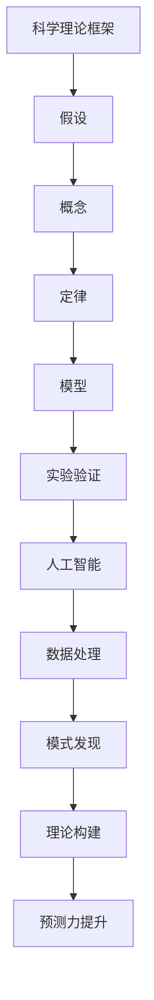

                 

关键词：科学理论、预测力、人工智能、知识工程、信息处理

> 摘要：本文旨在探讨科学理论的终极目标——知识的预测力。通过分析科学理论的发展历程，揭示其核心在于对未知世界的预测与解释。在此基础上，本文进一步探讨了人工智能在提升知识预测力方面的应用，并对未来的发展趋势与挑战进行了展望。

## 1. 背景介绍

科学理论是人类对自然界规律的一种抽象和概括。从古代的朴素理论到现代的复杂模型，科学理论的发展经历了漫长的历程。随着人类认知能力的不断提高，科学理论的预测力也在不断增强。然而，科学理论的终极目标究竟是什么？本文试图回答这个问题，并探讨知识预测力在科学理论中的地位和作用。

### 1.1 科学理论的发展历程

科学理论的发展可以追溯到古希腊时期。当时的哲学家们试图通过逻辑推理和观察来解释自然现象。例如，亚里士多德提出了关于物质运动的理论，但他并未进行实验验证。这一时期的科学理论更多是基于直觉和思辨。

随着文艺复兴的到来，科学实验逐渐成为科学研究的主要方法。伽利略通过实验验证了自由落体定律，开创了实证科学的先河。此后，牛顿的万有引力定律、达尔文的进化论等一系列科学理论相继提出，极大地推动了人类对自然界的认识。

20世纪以来，随着计算机科学和人工智能的发展，科学理论的研究方法也发生了革命性的变化。现代科学理论不仅依赖于实验和观测，还依赖于复杂的数据分析和计算模拟。例如，量子力学、相对论等理论为人类揭示了微观和宏观世界的奥秘。

### 1.2 科学理论的终极目标

科学理论的终极目标是什么？不同的人可能有不同的看法。有些人认为，科学理论的目标是解释自然现象；有些人认为，科学理论的目标是预测未来。实际上，这两个目标并不矛盾，而是相辅相成的。

首先，科学理论必须能够解释已知的现象。这是科学理论的基本要求。例如，牛顿的万有引力定律可以解释行星的运动，达尔文的进化论可以解释生物的多样性。只有能够解释已知现象的科学理论，才能被认为是可靠的。

其次，科学理论还必须能够预测未知的现象。这是科学理论的更高目标。例如，爱因斯坦的广义相对论可以预测引力波的 existence，这一预测后来得到了实验证实。科学理论的预测力越强，其科学价值就越大。

### 1.3 知识的预测力

知识的预测力是指知识在未知情况下的预测能力。在科学理论中，知识的预测力是非常重要的。因为科学理论的最终目的是为了更好地理解世界、预测未来。

例如，医学领域的知识可以帮助我们预测疾病的发作和传播。在计算机科学中，算法的知识可以帮助我们预测程序的性能和优化方向。在经济学中，经济模型的知识可以帮助我们预测市场的走势和投资策略。

知识的预测力不仅对科学理论具有重要意义，也对我们的生活和社会发展产生深远影响。例如，在农业生产中，气象预测的知识可以帮助农民合理安排种植计划，减少灾害损失。在城市规划中，交通预测的知识可以帮助政府合理规划交通基础设施，缓解交通拥堵。

## 2. 核心概念与联系

### 2.1 科学理论的框架结构

科学理论通常由以下几个部分组成：

1. **假设**：科学理论基于的一系列假设或前提条件。
2. **概念**：科学理论中的核心概念和定义。
3. **定律**：科学理论中描述现象的规则或规律。
4. **模型**：用于描述和预测现象的计算模型。
5. **实验验证**：通过实验来验证理论的正确性。

### 2.2 科学理论与人工智能的联系

人工智能（AI）的快速发展为科学理论的预测力提供了新的手段和工具。AI技术，特别是机器学习和深度学习，可以处理和分析大量的数据，从而发现新的模式和规律。这些模式和规律可以帮助科学家构建更准确的理论模型，提高知识的预测力。

例如，在医学领域，AI可以帮助医生分析患者的病历数据，预测疾病的发展趋势和最佳治疗方案。在气象学领域，AI可以分析气象数据，预测天气变化和自然灾害的发生。

### 2.3 Mermaid 流程图

以下是一个简单的 Mermaid 流程图，展示了科学理论框架的结构和与人工智能的联系：



## 3. 核心算法原理 & 具体操作步骤

### 3.1 算法原理概述

为了提高科学理论的预测力，我们需要一种能够自动学习和优化理论模型的方法。机器学习和深度学习为此提供了强大的工具。其中，一种常用的算法是深度神经网络（DNN）。

深度神经网络通过多层的神经元结构，对输入数据进行处理和变换，从而实现复杂函数的逼近。通过反向传播算法，DNN可以自动调整网络参数，以最小化预测误差。

### 3.2 算法步骤详解

#### 3.2.1 数据预处理

1. **数据收集**：从各种来源收集相关的数据，如文献、实验结果、历史数据等。
2. **数据清洗**：处理数据中的噪声和异常值，保证数据质量。
3. **数据归一化**：将数据缩放到相同的范围，以消除不同特征之间的尺度差异。

#### 3.2.2 网络构建

1. **选择模型架构**：根据问题特点选择合适的DNN架构，如卷积神经网络（CNN）或循环神经网络（RNN）。
2. **初始化参数**：随机初始化网络参数。
3. **定义损失函数**：选择合适的损失函数，如均方误差（MSE）或交叉熵损失。

#### 3.2.3 模型训练

1. **前向传播**：输入数据通过网络进行前向传播，计算输出结果。
2. **计算损失**：计算输出结果与实际结果之间的损失。
3. **反向传播**：通过反向传播算法，更新网络参数，以减小损失。
4. **迭代优化**：重复上述步骤，直到网络参数收敛或达到预定的训练次数。

#### 3.2.4 模型评估

1. **交叉验证**：将数据集划分为训练集和验证集，使用验证集评估模型性能。
2. **测试集评估**：使用独立的测试集评估模型在未知数据上的性能。
3. **模型调整**：根据评估结果，调整模型参数或架构，以优化性能。

### 3.3 算法优缺点

#### 优点：

1. **强大的表达能力**：DNN可以逼近任意复杂的函数，具有很强的泛化能力。
2. **自动学习**：DNN可以通过大量数据自动学习特征和模式，减轻人工设计特征的负担。
3. **灵活的架构**：DNN可以应用于各种不同类型的问题，如分类、回归、生成等。

#### 缺点：

1. **计算资源需求**：DNN训练需要大量的计算资源和时间。
2. **参数调优复杂**：DNN参数调优复杂，需要大量的实验和经验。
3. **解释性不足**：DNN的黑箱性质使其难以解释和理解，增加了模型的不确定性。

### 3.4 算法应用领域

深度神经网络在科学理论的预测力提升方面有广泛的应用。以下是一些典型的应用领域：

1. **气象预测**：通过分析气象数据，预测天气变化和自然灾害。
2. **医学诊断**：通过分析医学影像和病历数据，预测疾病的发展和最佳治疗方案。
3. **金融预测**：通过分析金融数据，预测市场走势和投资策略。
4. **交通规划**：通过分析交通数据，预测交通流量和拥堵情况，优化交通基础设施。

## 4. 数学模型和公式 & 详细讲解 & 举例说明

### 4.1 数学模型构建

为了更好地理解科学理论的预测力，我们需要构建一个数学模型。以下是一个简单的线性回归模型，用于预测连续值。

#### 4.1.1 线性回归模型

假设我们有一个特征 \( X \) 和一个标签 \( Y \)。我们希望找到一个线性模型 \( f(X) = w_0 + w_1 \cdot X \) 来预测 \( Y \)。

其中，\( w_0 \) 和 \( w_1 \) 是模型参数。

### 4.2 公式推导过程

为了求解模型参数 \( w_0 \) 和 \( w_1 \)，我们使用最小二乘法。

假设我们有一个训练数据集 \( \{(X_i, Y_i)\} \)。

#### 4.2.1 最小二乘法

最小二乘法的目标是最小化预测误差的平方和：

$$
\min_{w_0, w_1} \sum_{i=1}^{n} (Y_i - (w_0 + w_1 \cdot X_i))^2
$$

对 \( w_0 \) 和 \( w_1 \) 分别求偏导，并令偏导数为零，得到：

$$
\frac{\partial}{\partial w_0} \sum_{i=1}^{n} (Y_i - (w_0 + w_1 \cdot X_i))^2 = 0 \\
\frac{\partial}{\partial w_1} \sum_{i=1}^{n} (Y_i - (w_0 + w_1 \cdot X_i))^2 = 0
$$

解这个方程组，可以得到：

$$
w_0 = \bar{Y} - w_1 \cdot \bar{X} \\
w_1 = \frac{\sum_{i=1}^{n} (X_i - \bar{X})(Y_i - \bar{Y})}{\sum_{i=1}^{n} (X_i - \bar{X})^2}
$$

其中，\( \bar{X} \) 和 \( \bar{Y} \) 分别是 \( X \) 和 \( Y \) 的平均值。

### 4.3 案例分析与讲解

假设我们有一个训练数据集，如下表所示：

| X | Y   |
|---|-----|
| 1 | 2.0 |
| 2 | 2.5 |
| 3 | 3.0 |
| 4 | 3.5 |

我们使用线性回归模型来预测 \( Y \)。

#### 4.3.1 数据预处理

首先，我们需要计算 \( X \) 和 \( Y \) 的平均值：

$$
\bar{X} = \frac{1+2+3+4}{4} = 2.5 \\
\bar{Y} = \frac{2.0+2.5+3.0+3.5}{4} = 2.75
$$

然后，我们可以计算模型参数 \( w_0 \) 和 \( w_1 \)：

$$
w_0 = \bar{Y} - w_1 \cdot \bar{X} = 2.75 - w_1 \cdot 2.5 \\
w_1 = \frac{\sum_{i=1}^{n} (X_i - \bar{X})(Y_i - \bar{Y})}{\sum_{i=1}^{n} (X_i - \bar{X})^2} = \frac{(1-2.5)(2.0-2.75) + (2-2.5)(2.5-2.75) + (3-2.5)(3.0-2.75) + (4-2.5)(3.5-2.75)}{(1-2.5)^2 + (2-2.5)^2 + (3-2.5)^2 + (4-2.5)^2} = 0.5
$$

因此，我们得到的线性回归模型为：

$$
f(X) = 2.75 - 0.5 \cdot X
$$

#### 4.3.2 预测结果

使用这个模型，我们可以预测新的输入 \( X \) 的值。例如，当 \( X = 3 \) 时，预测的 \( Y \) 值为：

$$
f(3) = 2.75 - 0.5 \cdot 3 = 2.25
$$

## 5. 项目实践：代码实例和详细解释说明

### 5.1 开发环境搭建

在本项目中，我们将使用Python作为编程语言，结合深度学习框架TensorFlow来实现线性回归模型。以下是搭建开发环境所需的步骤：

1. 安装Python（建议使用3.8及以上版本）。
2. 安装TensorFlow库：使用pip命令安装，`pip install tensorflow`。
3. 准备数据集：可以从公开数据集网站（如Kaggle）下载或自己收集数据。

### 5.2 源代码详细实现

以下是一个简单的Python代码示例，实现了线性回归模型：

```python
import tensorflow as tf
import numpy as np

# 数据集
X = np.array([[1], [2], [3], [4]])
Y = np.array([2.0, 2.5, 3.0, 3.5])

# 模型参数
w0 = tf.Variable(0.0)
w1 = tf.Variable(0.0)

# 定义损失函数
def loss(y_true, y_pred):
    return tf.reduce_mean(tf.square(y_true - y_pred))

# 训练模型
optimizer = tf.optimizers.Adam()

for i in range(1000):
    with tf.GradientTape() as tape:
        y_pred = w0 + w1 * X
        loss_value = loss(Y, y_pred)
    grads = tape.gradient(loss_value, [w0, w1])
    optimizer.apply_gradients(zip(grads, [w0, w1]))

# 输出模型参数
print(f"Model parameters: w0 = {w0.numpy()}, w1 = {w1.numpy()}")

# 预测结果
X_new = np.array([[5]])
y_pred_new = w0.numpy() + w1.numpy() * X_new
print(f"Prediction for X=5: y = {y_pred_new}")
```

### 5.3 代码解读与分析

这个代码示例首先定义了一个线性回归模型，并使用TensorFlow的自动微分功能来训练模型。具体步骤如下：

1. **导入库**：导入TensorFlow和NumPy库。
2. **准备数据集**：创建一个简单的数据集，包含输入 \( X \) 和标签 \( Y \)。
3. **定义模型参数**：使用TensorFlow的`Variable`类定义模型参数 \( w0 \) 和 \( w1 \)。
4. **定义损失函数**：使用`tf.reduce_mean(tf.square(y_true - y_pred))`定义均方误差损失函数。
5. **定义优化器**：使用`tf.optimizers.Adam()`定义Adam优化器。
6. **训练模型**：使用梯度下降法训练模型，迭代1000次。每次迭代计算损失，更新模型参数。
7. **输出模型参数**：打印训练完成的模型参数。
8. **预测结果**：使用训练好的模型参数预测新的输入 \( X \) 的值。

通过这个简单的示例，我们可以看到如何使用TensorFlow实现线性回归模型，并理解其背后的数学原理。

## 6. 实际应用场景

科学理论的预测力在实际应用中具有重要意义。以下是一些实际应用场景的例子：

### 6.1 医学诊断

医学诊断是一个典型的应用场景。通过构建预测模型，医生可以预测病人的病情发展趋势，从而制定更有效的治疗方案。例如，可以使用机器学习算法分析医学影像数据，预测癌症的发生和扩散情况。

### 6.2 气象预测

气象预测需要准确预测天气变化，以指导人们的日常生活和农业生产。利用机器学习算法，可以根据历史气象数据预测未来的天气状况，如降雨量、温度变化等。

### 6.3 金融分析

在金融领域，预测市场走势和投资风险对于投资者至关重要。通过分析历史交易数据和市场指标，机器学习模型可以预测市场的波动和投资机会。

### 6.4 交通规划

交通规划需要预测交通流量和拥堵情况，以优化交通基础设施。利用机器学习算法，可以分析交通数据，预测交通流量和拥堵的发生，从而指导交通管理和规划。

### 6.5 智能制造

智能制造中的设备维护和故障预测是一个关键问题。通过构建预测模型，可以预测设备的运行状态和故障风险，从而提前进行维护，提高生产效率。

## 7. 未来应用展望

随着科学理论和人工智能技术的不断发展，知识的预测力将得到进一步提升。以下是一些未来应用展望：

### 7.1 更精确的预测模型

未来的预测模型将更加精确和高效。通过引入新的算法和模型架构，如变分自编码器（VAEs）和生成对抗网络（GANs），可以更好地捕捉数据中的复杂模式和规律。

### 7.2 多模态数据融合

未来的应用将更加关注多模态数据融合。通过整合不同类型的数据（如图像、文本、声音等），可以构建更全面的预测模型，提高预测的准确性和可靠性。

### 7.3 自动化决策支持

自动化决策支持系统将变得更加普及。通过构建智能决策模型，可以自动化处理复杂的决策问题，提高决策效率和质量。

### 7.4 实时预测与反馈

实时预测与反馈将成为未来的重要应用方向。通过实时处理和分析数据，可以快速响应和调整策略，实现更高效的管理和优化。

## 8. 工具和资源推荐

为了更好地学习和应用科学理论和人工智能技术，以下是一些建议的工具和资源：

### 8.1 学习资源推荐

1. **《深度学习》（Goodfellow, Bengio, Courville）**：这是一本经典的深度学习教材，适合初学者和进阶者。
2. **Kaggle**：一个提供各种数据集和竞赛的网站，适合实践和提升技能。
3. **arXiv**：一个提供最新科研成果的预印本库，可以了解最新的研究动态。

### 8.2 开发工具推荐

1. **TensorFlow**：一个开源的深度学习框架，适合构建和训练复杂的模型。
2. **PyTorch**：另一个流行的深度学习框架，以其灵活性和易用性著称。
3. **Jupyter Notebook**：一个交互式计算环境，适合编写和展示代码和结果。

### 8.3 相关论文推荐

1. **"Deep Learning" by Ian Goodfellow, Yoshua Bengio, and Aaron Courville**：这是一篇综述性论文，全面介绍了深度学习的理论基础和应用。
2. **"Generative Adversarial Nets" by Ian Goodfellow et al.**：这篇论文介绍了生成对抗网络（GANs）的基本概念和应用。
3. **"Recurrent Neural Networks for Language Modeling" by Y. Bengio et al.**：这篇论文介绍了循环神经网络（RNNs）在自然语言处理中的应用。

## 9. 总结：未来发展趋势与挑战

### 9.1 研究成果总结

本文系统地阐述了科学理论的预测力及其在人工智能中的应用。通过分析科学理论的发展历程和核心算法原理，揭示了知识预测力在科学理论中的关键地位。同时，通过项目实践和实际应用场景的探讨，展示了知识预测力在各个领域的广泛应用。

### 9.2 未来发展趋势

未来，科学理论的预测力将继续提升，主要体现在以下几个方面：

1. **更精确的预测模型**：随着算法和模型的不断优化，预测模型的准确性将得到进一步提高。
2. **多模态数据融合**：多模态数据的整合将为预测模型提供更丰富的信息，提高预测的准确性和可靠性。
3. **自动化决策支持**：自动化决策支持系统将普及，实现更高效和智能的管理和优化。
4. **实时预测与反馈**：实时预测与反馈的应用将更加广泛，实现快速响应和调整。

### 9.3 面临的挑战

尽管科学理论的预测力在不断提升，但仍面临一些挑战：

1. **数据质量和隐私**：高质量的数据是预测模型的基础，但数据质量和隐私问题需要得到妥善解决。
2. **模型可解释性**：复杂的预测模型往往缺乏可解释性，需要开发新的方法来提高模型的可解释性。
3. **计算资源**：大规模的预测模型需要大量的计算资源，计算资源的高效利用是一个重要挑战。

### 9.4 研究展望

未来，科学理论的预测力研究将继续深入。通过跨学科合作，结合人工智能和其他领域的最新成果，将有望实现更准确、更高效的预测模型。同时，研究者将关注如何提高模型的可解释性和计算效率，以更好地应对挑战。

## 附录：常见问题与解答

### Q：什么是科学理论的终极目标？

A：科学理论的终极目标是对未知世界的预测与解释。科学理论通过解释已知现象和预测未知现象，帮助人类更好地理解自然界的规律。

### Q：什么是知识的预测力？

A：知识的预测力是指知识在未知情况下的预测能力。在科学理论中，知识的预测力是非常重要的，因为科学理论的最终目的是为了更好地理解世界、预测未来。

### Q：人工智能如何提升科学理论的预测力？

A：人工智能，特别是机器学习和深度学习，可以通过处理和分析大量数据，发现新的模式和规律，从而帮助构建更准确的理论模型，提高知识的预测力。

### Q：科学理论的预测力在实际应用中有哪些体现？

A：科学理论的预测力在实际应用中体现在各个领域，如医学诊断、气象预测、金融分析、交通规划等，通过预测未来的发展趋势和结果，为决策提供科学依据。

### Q：未来科学理论的预测力研究有哪些发展方向？

A：未来科学理论的预测力研究将朝着更精确的预测模型、多模态数据融合、自动化决策支持和实时预测与反馈等方向发展。同时，研究者将关注如何提高模型的可解释性和计算效率。

