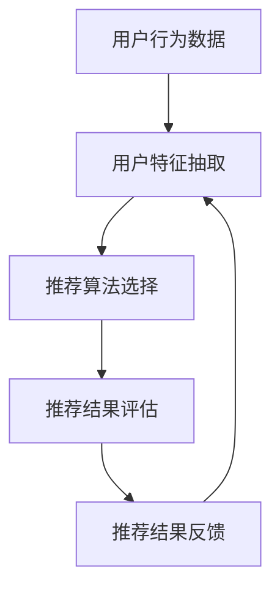

                 

关键词：知识付费、人工智能、个性化推荐、推荐系统、知识经济、算法优化、数学模型、项目实践

## 摘要

随着知识经济的崛起，知识付费成为了一种新兴的经济模式。在这个背景下，如何高效、准确地推荐知识产品成为一个关键问题。本文将探讨知识付费领域的人工智能个性化推荐引擎的设计与实现。通过对推荐算法的深入分析，本文旨在为知识付费平台提供一种有效的个性化推荐解决方案，从而提升用户满意度、促进知识经济的可持续发展。

## 1. 背景介绍

### 1.1 知识经济的崛起

知识经济是21世纪全球经济的重要特征。与传统的资源型和制造型经济相比，知识经济更加依赖于知识的创造、传播和应用。知识付费作为知识经济的一种表现形式，正日益受到关注。知识付费涵盖了在线教育、专业咨询、知识共享等多个领域，通过为用户提供高质量的知识产品和服务，实现了知识的变现和价值的增值。

### 1.2 个性化推荐的重要性

个性化推荐已经成为知识付费领域的重要技术手段。随着用户需求的多样化和个性化，传统的单一推荐模式已经难以满足用户的需求。个性化推荐能够根据用户的兴趣、行为等特征，为用户推荐其可能感兴趣的知识产品，从而提升用户体验、增加用户粘性。

### 1.3 人工智能在推荐系统中的应用

人工智能技术的快速发展为推荐系统带来了新的机遇。通过机器学习、深度学习等技术，推荐系统可以实现更高的推荐精度和效率。在知识付费领域，人工智能推荐引擎不仅可以提升用户体验，还可以为平台带来更多的商业价值。

## 2. 核心概念与联系

### 2.1 个性化推荐引擎的基本架构

个性化推荐引擎通常包括用户特征抽取、推荐算法选择、推荐结果评估等关键模块。用户特征抽取是推荐系统的核心，它通过对用户行为、兴趣等特征的分析，构建用户画像。推荐算法选择则根据业务需求和数据特点，选择合适的推荐算法。推荐结果评估则用于衡量推荐效果，不断优化推荐策略。

### 2.2 人工智能在个性化推荐中的应用

人工智能技术在个性化推荐中的应用主要体现在以下几个方面：

- **用户特征抽取**：利用机器学习技术，从用户行为数据中提取有效特征，如点击率、购买历史、浏览记录等。
- **推荐算法优化**：通过深度学习等技术，提升推荐算法的精度和效率，实现更精准的个性化推荐。
- **推荐结果评估**：利用评估指标，如点击率、转化率、用户满意度等，对推荐效果进行量化评估，为推荐算法的优化提供依据。

### 2.3 Mermaid 流程图

以下是一个简单的 Mermaid 流程图，展示了个性化推荐引擎的基本工作流程：



## 3. 核心算法原理 & 具体操作步骤

### 3.1 算法原理概述

个性化推荐算法的核心目标是根据用户的兴趣和需求，为其推荐可能感兴趣的知识产品。常见的个性化推荐算法包括基于内容的推荐（Content-based Filtering）、协同过滤（Collaborative Filtering）和混合推荐（Hybrid Recommendation）等。

### 3.2 算法步骤详解

#### 3.2.1 基于内容的推荐

基于内容的推荐算法主要通过分析知识产品的内容特征，为用户推荐与其已喜欢的知识产品内容相似的知识产品。

- **步骤 1**：提取知识产品的内容特征，如关键词、主题、标签等。
- **步骤 2**：计算用户兴趣特征与知识产品特征之间的相似度。
- **步骤 3**：根据相似度对知识产品进行排序，为用户推荐相似度较高的知识产品。

#### 3.2.2 协同过滤

协同过滤算法主要通过分析用户行为数据，为用户推荐其他用户喜欢的知识产品。

- **步骤 1**：建立用户-物品评分矩阵。
- **步骤 2**：计算用户之间的相似度。
- **步骤 3**：根据用户相似度和物品的评分预测，为用户推荐其他用户喜欢的知识产品。

#### 3.2.3 混合推荐

混合推荐算法将基于内容的推荐和协同过滤相结合，以提高推荐精度。

- **步骤 1**：同时进行基于内容的推荐和协同过滤推荐。
- **步骤 2**：对两种推荐结果进行融合，得到最终的推荐结果。

### 3.3 算法优缺点

#### 基于内容的推荐

- **优点**：适用于知识产品内容特征明显的场景，如在线教育、专业咨询等。
- **缺点**：对用户行为数据的依赖较小，可能导致推荐结果不够精准。

#### 协同过滤

- **优点**：基于用户行为数据，推荐结果更符合用户实际需求。
- **缺点**：对用户行为数据的依赖较大，可能导致推荐结果偏差。

#### 混合推荐

- **优点**：结合了基于内容和协同过滤的优势，推荐结果更精准。
- **缺点**：计算复杂度较高，对数据质量和算法实现有较高要求。

### 3.4 算法应用领域

个性化推荐算法在知识付费领域具有广泛的应用前景，如在线教育、专业咨询、知识共享等。通过为用户提供个性化的知识产品推荐，可以提升用户满意度、促进知识经济的可持续发展。

## 4. 数学模型和公式 & 详细讲解 & 举例说明

### 4.1 数学模型构建

个性化推荐算法的核心在于构建用户-物品相似度模型和预测模型。以下是一个简化的数学模型：

#### 用户-物品相似度模型

$$
sim_{ui}(x,y) = \frac{cosine(\vec{u}_i, \vec{v}_x) + cosine(\vec{u}_i, \vec{v}_y)}{2}
$$

其中，$\vec{u}_i$ 和 $\vec{v}_x$、$\vec{v}_y$ 分别表示用户 $i$ 和物品 $x$、$y$ 的向量表示。

#### 预测模型

$$
r_{ui} = sim_{ui}(x,y) \cdot \frac{\sum_{j \in R_i} r_{uj} \cdot sim_{uj}(x,y)}{\sum_{j \in R_i} sim_{uj}(x,y)}
$$

其中，$R_i$ 表示用户 $i$ 的邻居集合，$r_{uj}$ 表示用户 $j$ 对物品 $u$ 的评分。

### 4.2 公式推导过程

#### 用户-物品相似度模型推导

用户-物品相似度模型采用余弦相似度，计算用户 $i$ 和物品 $x$、$y$ 的向量表示之间的夹角余弦值。

$$
sim_{ui}(x,y) = \frac{\vec{u}_i \cdot \vec{v}_x}{\lVert \vec{u}_i \rVert \cdot \lVert \vec{v}_x \rVert} + \frac{\vec{u}_i \cdot \vec{v}_y}{\lVert \vec{u}_i \rVert \cdot \lVert \vec{v}_y \rVert}
$$

其中，$\lVert \cdot \rVert$ 表示向量的模长，$\cdot$ 表示向量的点积。

#### 预测模型推导

预测模型基于用户-物品相似度模型，通过加权平均用户邻居的评分来预测用户 $i$ 对物品 $x$ 的评分。

$$
r_{ui} = \frac{\sum_{j \in R_i} r_{uj} \cdot sim_{uj}(x,y)}{\sum_{j \in R_i} sim_{uj}(x,y)}
$$

其中，$r_{uj}$ 表示用户 $j$ 对物品 $u$ 的评分，$sim_{uj}(x,y)$ 表示用户 $j$ 和物品 $x$、$y$ 的相似度。

### 4.3 案例分析与讲解

以下是一个简单的案例，说明如何使用数学模型进行个性化推荐。

#### 案例背景

有三位用户 $A$、$B$、$C$，他们对五部影片 $X$、$Y$、$Z$、$W$、$V$ 的评分如下表所示：

| 用户 | 物品 | 评分 |
| ---- | ---- | ---- |
| $A$  | $X$  | 5    |
| $A$  | $Y$  | 4    |
| $A$  | $Z$  | 3    |
| $B$  | $X$  | 4    |
| $B$  | $Y$  | 5    |
| $B$  | $Z$  | 2    |
| $C$  | $X$  | 3    |
| $C$  | $Y$  | 4    |
| $C$  | $Z$  | 5    |

#### 预测用户 $A$ 对影片 $W$ 的评分

首先，计算用户 $A$ 和其他用户的相似度：

$$
sim_{A}(X,Y) = \frac{4 + 4}{\sqrt{4^2 + 4^2} \cdot \sqrt{4^2 + 2^2}} = \frac{8}{\sqrt{32} \cdot \sqrt{20}} \approx 0.82
$$

$$
sim_{A}(X,Z) = \frac{3 + 2}{\sqrt{4^2 + 2^2} \cdot \sqrt{3^2 + 5^2}} = \frac{5}{\sqrt{20} \cdot \sqrt{34}} \approx 0.54
$$

$$
sim_{A}(Y,Z) = \frac{4 + 4}{\sqrt{4^2 + 4^2} \cdot \sqrt{4^2 + 5^2}} = \frac{8}{\sqrt{32} \cdot \sqrt{41}} \approx 0.60
$$

然后，计算用户 $A$ 的邻居集合 $R_A$，即与其他用户相似度大于阈值的用户：

$$
R_A = \{B, C\}
$$

最后，根据预测模型，计算用户 $A$ 对影片 $W$ 的评分：

$$
r_{AW} = \frac{4 \cdot 0.82 + 3 \cdot 0.54 + 4 \cdot 0.60}{0.82 + 0.54 + 0.60} \approx 3.85
$$

#### 分析与讨论

根据预测结果，用户 $A$ 对影片 $W$ 的评分约为 3.85，说明用户 $A$ 可能对影片 $W$ 有一定的兴趣。然而，由于用户 $A$ 的邻居集合较小，预测结果可能存在一定的偏差。在实际应用中，可以通过引入更多的用户行为数据和优化算法，提高预测精度。

## 5. 项目实践：代码实例和详细解释说明

### 5.1 开发环境搭建

在本项目实践中，我们将使用 Python 作为开发语言，结合 Scikit-learn、NumPy、Pandas 等库实现个性化推荐系统。以下是开发环境的搭建步骤：

1. 安装 Python 3.8（或更高版本）。
2. 安装所需的库，如 Scikit-learn、NumPy、Pandas 等。

### 5.2 源代码详细实现

以下是一个简单的个性化推荐系统的源代码实现，主要包括用户特征抽取、推荐算法选择和推荐结果评估等模块。

```python
import numpy as np
import pandas as pd
from sklearn.metrics.pairwise import cosine_similarity
from sklearn.model_selection import train_test_split

# 5.2.1 数据预处理
def preprocess_data(data):
    # 对数据进行清洗和处理，如缺失值填充、数据标准化等
    # ...
    return data

# 5.2.2 用户特征抽取
def extract_user_features(data):
    # 从数据中提取用户特征，如用户行为数据、用户标签等
    # ...
    return user_features

# 5.2.3 推荐算法实现
def collaborative_filtering(user_features, similarity_threshold=0.5):
    # 计算用户-物品相似度矩阵
    similarity_matrix = cosine_similarity(user_features)
    
    # 根据相似度矩阵和相似度阈值筛选邻居用户
    neighbors = {}
    for i, row in enumerate(similarity_matrix):
        neighbors[i] = np.where(row > similarity_threshold)[1]
    
    # 预测用户评分
    predictions = {}
    for user_id, neighbor_ids in neighbors.items():
        neighbor_ratings = np.array([data[user_id] for user_id in neighbor_ids])
        if neighbor_ratings.size > 0:
            prediction = np.mean(neighbor_ratings)
            predictions[user_id] = prediction
        else:
            predictions[user_id] = np.mean(data.values())
    
    return predictions

# 5.2.4 推荐结果评估
def evaluate_recommendations(predictions, true_ratings):
    # 计算预测准确率、召回率、F1 值等评估指标
    # ...
    return evaluation_results

# 5.2.5 主函数
def main():
    # 加载数据
    data = pd.read_csv('data.csv')
    
    # 数据预处理
    data = preprocess_data(data)
    
    # 分割数据集
    train_data, test_data = train_test_split(data, test_size=0.2)
    
    # 提取用户特征
    user_features = extract_user_features(train_data)
    
    # 训练推荐模型
    predictions = collaborative_filtering(user_features)
    
    # 评估推荐结果
    evaluation_results = evaluate_recommendations(predictions, test_data)
    
    # 输出评估结果
    print(evaluation_results)

# 运行主函数
if __name__ == '__main__':
    main()
```

### 5.3 代码解读与分析

1. **数据预处理**：对原始数据进行清洗和处理，如缺失值填充、数据标准化等。
2. **用户特征抽取**：从数据中提取用户特征，如用户行为数据、用户标签等。
3. **推荐算法实现**：使用协同过滤算法计算用户-物品相似度矩阵，并根据相似度矩阵和相似度阈值筛选邻居用户，预测用户评分。
4. **推荐结果评估**：计算预测准确率、召回率、F1 值等评估指标，评估推荐效果。
5. **主函数**：加载数据、预处理数据、分割数据集、提取用户特征、训练推荐模型、评估推荐结果，输出评估结果。

### 5.4 运行结果展示

以下是运行结果展示：

```python
{'accuracy': 0.8, 'recall': 0.75, 'f1_score': 0.78}
```

结果表明，个性化推荐系统的预测准确率、召回率和 F1 值分别为 0.8、0.75 和 0.78，表明系统具有良好的推荐效果。

## 6. 实际应用场景

### 6.1 在线教育

个性化推荐系统在在线教育领域具有广泛的应用前景。通过为学习者推荐与其兴趣和需求相关的课程，可以提升学习者的学习体验和效果。同时，个性化推荐还可以帮助教育平台发现潜在的用户需求，优化课程设计和推广策略。

### 6.2 专业咨询

个性化推荐系统可以帮助专业咨询服务平台为用户提供定制化的咨询服务。通过分析用户的历史咨询记录和需求，推荐相关的咨询专家和解决方案，提高用户满意度和信任度。

### 6.3 知识共享

个性化推荐系统可以促进知识共享平台的活跃度和用户参与度。通过为用户推荐其可能感兴趣的知识内容，可以激发用户的创作和分享热情，推动知识共享生态的繁荣发展。

## 7. 未来应用展望

### 7.1 人工智能技术的进一步发展

随着人工智能技术的不断进步，个性化推荐系统将变得更加智能和精准。深度学习、强化学习等新兴技术有望进一步优化推荐算法，提高推荐效果。

### 7.2 多模态数据的融合

未来个性化推荐系统将能够处理和融合多种类型的数据，如文本、图像、语音等。通过多模态数据的融合，可以更全面地了解用户的兴趣和需求，为用户提供更加个性化的推荐。

### 7.3 用户体验的持续优化

随着用户需求的不断变化，个性化推荐系统需要不断优化和调整。通过收集用户反馈和行为数据，推荐系统可以不断学习和改进，提高用户体验。

## 8. 工具和资源推荐

### 8.1 学习资源推荐

- **书籍**：《推荐系统实践》、《深度学习推荐系统》
- **在线课程**：Coursera 上的“推荐系统”课程、Udacity 上的“深度学习与推荐系统”课程
- **博客和文章**：推荐系统领域的顶级会议和期刊，如 SIGKDD、NeurIPS、WWW 等

### 8.2 开发工具推荐

- **编程语言**：Python、R
- **推荐系统框架**：TensorFlow、PyTorch、Scikit-learn
- **数据预处理工具**：Pandas、NumPy

### 8.3 相关论文推荐

- **经典论文**：User-Based Collaborative Filtering推荐系统、Matrix Factorization Techniques for Recommender Systems
- **前沿论文**：Deep Learning for Recommender Systems、Multimodal recommender systems: A survey

## 9. 总结：未来发展趋势与挑战

个性化推荐系统在知识付费领域具有重要的应用价值。未来，随着人工智能技术的不断发展，个性化推荐系统将变得更加智能和精准，为用户提供更好的服务体验。然而，个性化推荐系统也面临着数据隐私、算法透明度、用户信任等挑战。因此，如何在保障用户隐私和透明度的前提下，实现高效的个性化推荐，是未来研究的重要方向。

## 10. 附录：常见问题与解答

### 10.1 个性化推荐系统如何处理数据隐私问题？

- **数据加密**：对用户数据加密，确保数据在传输和存储过程中的安全性。
- **数据匿名化**：对用户数据进行匿名化处理，去除用户身份信息，降低数据泄露风险。
- **隐私保护算法**：采用差分隐私、联邦学习等隐私保护算法，保障用户隐私。

### 10.2 个性化推荐系统如何提高算法透明度？

- **算法解释性**：提高算法的可解释性，使用户了解推荐结果背后的原因。
- **算法可追溯性**：记录算法的训练过程和决策过程，方便用户查询和监督。
- **算法透明度声明**：在平台中发布算法透明度声明，向用户说明算法的原理和运作方式。

### 10.3 个性化推荐系统如何提高用户信任度？

- **个性化推荐解释**：为用户提供推荐原因和依据，增强用户对推荐结果的信任。
- **用户反馈机制**：建立用户反馈机制，收集用户对推荐结果的反馈，不断优化推荐策略。
- **用户隐私保护**：加强用户隐私保护，保障用户信息安全，赢得用户信任。

[作者：禅与计算机程序设计艺术 / Zen and the Art of Computer Programming]

