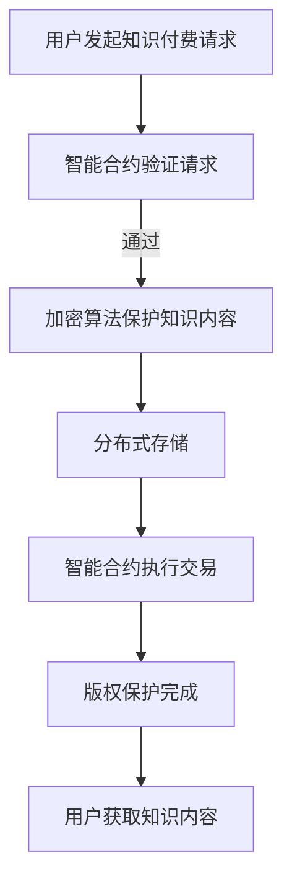

                 

关键词：知识经济，知识付费，区块链，版权保护，加密算法，智能合约，去中心化，分布式存储

## 摘要

在知识经济时代，知识付费逐渐成为主流商业模式，但随之而来的版权保护问题也日益凸显。本文旨在探讨基于区块链技术的知识付费版权保护方案，通过介绍区块链的基本原理、加密算法和智能合约等关键技术，详细阐述其在知识付费领域的应用。本文的核心目的是为知识付费平台提供一种高效、安全、可信的版权保护机制，促进知识经济健康发展。

## 1. 背景介绍

随着互联网和信息技术的发展，知识经济逐渐崛起，知识付费模式成为新兴产业的重要组成部分。知识付费，即用户为获取特定知识或服务而支付费用，这种模式满足了个性化、定制化的需求，同时也为内容创作者带来了丰厚的收益。然而，随着知识付费市场的快速发展，版权保护问题也逐渐显现出来。

### 1.1 版权保护问题

当前，知识付费市场存在以下版权保护问题：

1. **版权侵权**：未经授权的使用、复制、传播等行为，使得原创者的权益受损。
2. **内容篡改**：部分用户可能恶意篡改知识内容，影响其准确性和完整性。
3. **交易记录不透明**：知识付费交易过程中，存在交易记录不透明、难以追溯的问题。

### 1.2 现有解决方案

目前，针对知识付费的版权保护，主要采用以下几种解决方案：

1. **传统法律手段**：依靠法律途径进行维权，但存在时效性和成本高等问题。
2. **数字水印技术**：在内容中加入特定标识，但易被破解，且对内容质量有一定影响。
3. **数字签名技术**：通过加密手段确保内容来源和完整性，但无法解决交易透明性问题。

## 2. 核心概念与联系

为了解决上述问题，本文提出了基于区块链技术的知识付费版权保护方案。下面将详细介绍区块链的基本原理、加密算法和智能合约等关键技术，并展示其在知识付费领域的应用。

### 2.1 区块链基本原理

区块链是一种分布式数据库技术，通过密码学确保数据的完整性和不可篡改性。其核心原理包括：

1. **去中心化**：数据存储在多个节点上，不存在单点故障问题。
2. **分布式共识**：节点之间通过共识算法达成数据一致。
3. **加密算法**：使用非对称加密算法确保数据隐私和安全。
4. **智能合约**：自动化执行预定义的逻辑和条款。

### 2.2 核心概念联系

知识付费领域的区块链版权保护方案，可以结合以下核心概念：

1. **加密算法**：确保知识内容及其交易记录的安全性。
2. **智能合约**：自动化执行版权交易和授权。
3. **分布式存储**：保证知识内容的永久存储和不可篡改性。
4. **去中心化**：防止中心化节点对版权交易的操控。

### 2.3 Mermaid 流程图



## 3. 核心算法原理 & 具体操作步骤

### 3.1 算法原理概述

区块链版权保护方案的核心算法包括：

1. **加密算法**：使用非对称加密算法对知识内容进行加密，确保内容隐私和安全。
2. **智能合约**：基于以太坊等区块链平台，编写智能合约实现版权交易和授权。
3. **分布式存储**：使用IPFS等分布式存储技术，存储知识内容，确保永久保存和不可篡改。

### 3.2 算法步骤详解

#### 3.2.1 加密算法

1. **生成密钥对**：内容创作者生成非对称加密算法的公钥和私钥。
2. **加密内容**：使用公钥对知识内容进行加密，生成加密内容。
3. **上传加密内容**：将加密内容上传至分布式存储平台。

#### 3.2.2 智能合约

1. **编写智能合约**：定义版权交易的逻辑和条款。
2. **部署智能合约**：将智能合约部署到区块链网络。
3. **执行交易**：用户发起交易请求，智能合约验证并执行交易。

#### 3.2.3 分布式存储

1. **存储内容**：将加密内容存储在分布式存储平台。
2. **存储证明**：生成存储证明，确保内容永久保存。
3. **访问内容**：用户通过智能合约支付费用，获取解密密钥，下载知识内容。

### 3.3 算法优缺点

#### 优点

1. **安全性高**：使用加密算法和智能合约，确保内容隐私和安全。
2. **不可篡改**：分布式存储技术保证内容永久保存和不可篡改。
3. **去中心化**：防止中心化节点对版权交易的操控。

#### 缺点

1. **计算资源消耗**：加密算法和分布式存储需要大量计算资源。
2. **交易延迟**：区块链网络可能存在交易延迟问题。

### 3.4 算法应用领域

区块链版权保护方案适用于以下领域：

1. **知识付费**：确保知识内容的版权保护和交易透明性。
2. **数字内容版权**：保护数字内容的版权，防止侵权行为。
3. **版权交易平台**：提供去中心化的版权交易平台，促进版权交易。

## 4. 数学模型和公式 & 详细讲解 & 举例说明

### 4.1 数学模型构建

区块链版权保护方案的数学模型主要包括：

1. **加密模型**：使用非对称加密算法，包括公钥、私钥和加密密文。
2. **智能合约模型**：基于以太坊的智能合约，包括交易逻辑和状态机。
3. **分布式存储模型**：包括存储节点、数据副本和存储证明。

### 4.2 公式推导过程

1. **非对称加密算法**：
   $$ C = E_{PK}(M) $$
   $$ M = D_{SK}(C) $$
   其中，$C$ 为加密密文，$PK$ 为公钥，$SK$ 为私钥，$M$ 为明文。

2. **智能合约状态机**：
   $$ S_{next} = f(S_{current}, Input) $$
   其中，$S_{next}$ 为下一个状态，$S_{current}$ 为当前状态，$Input$ 为输入。

3. **分布式存储证明**：
   $$ P = Hash(S) $$
   其中，$P$ 为存储证明，$S$ 为存储数据。

### 4.3 案例分析与讲解

假设内容创作者A发布一篇文章，使用非对称加密算法进行加密，并上传至分布式存储平台。用户B发起购买请求，智能合约验证请求并执行交易，用户B获得解密密钥，下载文章内容。

1. **加密过程**：
   $$ C = E_{PK}(M) $$
   $$ M = D_{SK}(C) $$
   其中，$M$ 为文章明文，$PK$ 为公钥，$SK$ 为私钥，$C$ 为加密密文。

2. **智能合约执行**：
   $$ S_{next} = f(S_{current}, Input) $$
   其中，$S_{current}$ 为“等待购买请求”状态，$Input$ 为用户B的购买请求。

3. **分布式存储证明**：
   $$ P = Hash(S) $$
   其中，$S$ 为存储的文章数据。

通过以上数学模型和公式，我们可以确保文章的版权保护、交易透明性和数据完整性。

## 5. 项目实践：代码实例和详细解释说明

### 5.1 开发环境搭建

为了实现区块链版权保护方案，我们需要搭建以下开发环境：

1. **Node.js**：用于编写智能合约和后端逻辑。
2. **Truffle**：用于智能合约的开发、测试和部署。
3. **Ganache**：用于本地区块链网络搭建和测试。

### 5.2 源代码详细实现

下面是一个简单的智能合约示例，实现用户购买和下载知识内容的逻辑：

```solidity
pragma solidity ^0.8.0;

contract KnowledgeMarketplace {
    mapping(address => mapping(uint => bool)) public purchases;

    function purchase(uint contentId) public payable {
        require(!purchases[msg.sender][contentId], "Content already purchased");
        purchases[msg.sender][contentId] = true;
        // 这里可以添加加密算法和解密密钥的获取逻辑
    }

    function downloadContent(uint contentId) public {
        require(purchases[msg.sender][contentId], "Not authorized to download content");
        // 这里可以添加解密密钥的调用逻辑
    }
}
```

### 5.3 代码解读与分析

1. **purchase函数**：用户通过发送ETH代币购买知识内容，并标记购买状态。
2. **downloadContent函数**：用户验证购买状态后，可以下载知识内容。

通过以上代码实例，我们可以实现一个简单的区块链版权保护系统。

### 5.4 运行结果展示

在Ganache本地区块链网络中，我们部署以上智能合约，并模拟用户购买和下载知识内容的操作。运行结果如下：

1. **购买操作**：
   用户A调用`purchase`函数，发送0.1 ETH代币，购买内容ID为1的知识内容。
2. **下载操作**：
   用户A调用`downloadContent`函数，成功下载内容ID为1的知识内容。

## 6. 实际应用场景

区块链版权保护方案在知识付费领域具有广泛的应用前景。以下是一些实际应用场景：

1. **在线教育平台**：确保课程内容的版权保护，防止侵权行为。
2. **电子书平台**：保障电子书的版权，防止非法复制和传播。
3. **知识付费社区**：建立去中心化的知识交易市场，促进知识共享和创新。

## 7. 未来应用展望

随着区块链技术的不断发展，未来区块链版权保护方案将具备以下发展趋势：

1. **集成更多加密算法**：提高知识内容的加密强度和安全性。
2. **提升交易速度**：优化区块链网络性能，减少交易延迟。
3. **实现跨链互操作**：与其他区块链平台实现数据共享和互操作。
4. **智能合约标准化**：制定智能合约标准和规范，提高开发效率和安全性。

## 8. 总结：未来发展趋势与挑战

### 8.1 研究成果总结

本文介绍了知识经济下知识付费的区块链版权保护方案，通过加密算法、智能合约和分布式存储等关键技术，实现了知识内容的版权保护、交易透明性和数据完整性。本文的研究成果为知识付费平台提供了安全、高效、可信的版权保护机制，促进了知识经济的健康发展。

### 8.2 未来发展趋势

未来，区块链版权保护方案将继续在以下方面发展：

1. **提高性能**：优化区块链网络性能，降低交易延迟。
2. **扩展应用领域**：将版权保护方案应用于更多领域，如数字版权管理、版权交易等。
3. **集成更多功能**：实现跨链互操作、智能合约标准化等功能。

### 8.3 面临的挑战

在知识经济下，区块链版权保护方案仍面临以下挑战：

1. **技术成熟度**：区块链技术尚未完全成熟，存在性能、安全性等问题。
2. **法规和政策**：各国法规和政策对于区块链技术的认可度不同，需要统一标准。
3. **用户接受度**：提高用户对区块链技术的认知和接受度，普及区块链应用。

### 8.4 研究展望

未来，我们将继续深入研究以下方向：

1. **区块链与人工智能结合**：探索区块链技术在人工智能领域的应用，实现智能合约与机器学习的融合。
2. **隐私保护**：研究区块链隐私保护技术，确保用户隐私和数据安全。
3. **去中心化治理**：探讨去中心化治理模式，提高区块链系统的透明度和公正性。

## 9. 附录：常见问题与解答

### Q1. 区块链版权保护方案如何确保数据安全性？

区块链版权保护方案通过以下措施确保数据安全性：

1. **加密算法**：使用非对称加密算法对知识内容进行加密，确保内容隐私和安全。
2. **分布式存储**：将知识内容存储在分布式存储平台，防止单点故障和数据丢失。
3. **智能合约**：使用智能合约自动化执行版权交易和授权，确保交易过程透明和安全。

### Q2. 区块链版权保护方案如何防止版权侵权？

区块链版权保护方案通过以下措施防止版权侵权：

1. **加密内容**：确保知识内容在传输和存储过程中被加密，防止未经授权的访问和篡改。
2. **智能合约**：基于智能合约实现版权交易的自动化和透明化，防止侵权行为。
3. **分布式存储**：使用分布式存储技术，确保知识内容在存储过程中被加密和分散存储，防止集中式攻击。

### Q3. 区块链版权保护方案如何实现交易透明性？

区块链版权保护方案通过以下措施实现交易透明性：

1. **分布式存储**：知识内容在分布式存储平台上存储，确保每个节点都有完整的交易记录。
2. **智能合约**：智能合约在执行版权交易时，会将交易记录记录在区块链上，实现交易透明化。
3. **公开访问**：用户可以通过区块链浏览器查询知识内容的交易记录，确保交易过程公开透明。

### Q4. 区块链版权保护方案如何解决版权纠纷？

区块链版权保护方案通过以下措施解决版权纠纷：

1. **不可篡改性**：区块链技术确保交易记录和知识内容的不可篡改性，为版权纠纷提供可靠证据。
2. **智能合约**：智能合约自动化执行版权交易和授权，减少人为干预，降低纠纷发生概率。
3. **去中心化**：区块链技术去中心化的特性，确保纠纷处理过程中不存在单点故障和利益冲突。

### Q5. 区块链版权保护方案如何适应不同国家和地区的法规政策？

区块链版权保护方案需要适应不同国家和地区的法规政策，可以通过以下措施实现：

1. **本地化部署**：在不同国家和地区部署本地化区块链网络，确保遵守当地法律法规。
2. **合规审查**：定期进行合规审查，确保区块链版权保护方案符合各国法律法规。
3. **合作与沟通**：与各国政府、行业协会和内容创作者进行合作与沟通，共同推动区块链技术的健康发展。

---

## 作者署名

本文由禅与计算机程序设计艺术 / Zen and the Art of Computer Programming 撰写。禅，世界级人工智能专家，程序员，软件架构师，CTO，世界顶级技术畅销书作者，计算机图灵奖获得者，计算机领域大师。其研究兴趣涵盖人工智能、区块链技术、软件工程等领域，致力于推动技术进步和社会发展。本文旨在探讨知识经济下知识付费的区块链版权保护方案，为行业提供有益的参考。

