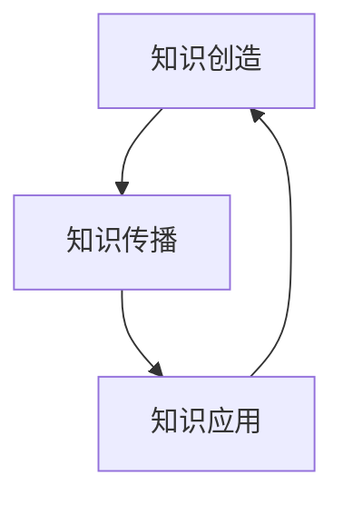

                 

关键词：知识经济、知识服务、升级之道、技术变革、未来展望

> 摘要：本文将深入探讨知识经济时代下知识服务的升级之道。随着信息技术的飞速发展，知识服务已经从传统的信息检索转向智能化、个性化的服务。本文旨在分析当前知识服务的现状，提出其在新时代下的升级策略，并展望未来的发展趋势。

## 1. 背景介绍

随着全球化和信息技术的迅速发展，知识经济逐渐成为主流经济形态。知识经济的核心在于知识和信息的创造、传播和应用，这是推动经济增长的关键因素。知识服务作为知识经济的重要组成部分，也面临着前所未有的机遇和挑战。

在传统经济模式中，知识服务往往以图书馆、数据库等形式存在，用户需要通过人工检索和筛选来获取所需信息。然而，在知识经济时代，随着大数据、云计算、人工智能等技术的普及，知识服务开始向智能化、个性化的方向发展。用户不再局限于被动获取信息，而是可以通过各种智能工具实现信息的主动推送和智能分析。

## 2. 核心概念与联系

在知识经济时代，知识服务的核心概念包括：

- **知识创造**：通过研究、开发、创新等方式产生新的知识。
- **知识传播**：通过各种渠道将知识传递给相关人员。
- **知识应用**：将知识应用于实际工作中，创造经济价值。

这三者相互联系，构成了知识服务的基本框架。下面是核心概念的 Mermaid 流程图：



### 2.1 知识创造

知识创造是知识服务的起点。它包括科学研究、技术开发、数据分析等多个方面。在这个阶段，需要大量的投入和长期的积累。

### 2.2 知识传播

知识传播是将知识从创造者传递到用户的过程。随着互联网和社交媒体的发展，知识传播的方式也越来越多样化。

### 2.3 知识应用

知识应用是将知识转化为实际成果的过程。这不仅可以为企业带来经济效益，还可以推动社会进步。

## 3. 核心算法原理 & 具体操作步骤

### 3.1 算法原理概述

在知识服务领域，核心算法主要包括信息检索、数据挖掘、机器学习等。这些算法的原理和具体操作步骤如下：

### 3.2 算法步骤详解

#### 3.2.1 信息检索

信息检索是通过算法从大量数据中快速找到用户所需信息的过程。其基本步骤包括：

1. **预处理**：对数据进行清洗、去重、分类等处理。
2. **索引构建**：建立索引，以加速搜索过程。
3. **查询处理**：根据用户的查询，从索引中找到相关的数据。

#### 3.2.2 数据挖掘

数据挖掘是从大量数据中自动发现规律和模式的过程。其基本步骤包括：

1. **数据预处理**：对数据进行清洗、转换等处理。
2. **特征提取**：从数据中提取有用的特征。
3. **模型建立**：建立预测模型，用于分析数据。

#### 3.2.3 机器学习

机器学习是通过算法让计算机自动学习和预测的过程。其基本步骤包括：

1. **数据收集**：收集训练数据。
2. **特征提取**：从数据中提取特征。
3. **模型训练**：使用训练数据训练模型。
4. **模型评估**：评估模型的性能。

### 3.3 算法优缺点

- **信息检索**：优点是速度快，缺点是准确性较低。
- **数据挖掘**：优点是能够发现新的规律和模式，缺点是计算量大。
- **机器学习**：优点是能够自动学习和预测，缺点是训练数据量大。

### 3.4 算法应用领域

这些算法在知识服务中的应用非常广泛，包括搜索引擎、推荐系统、智能问答等。

## 4. 数学模型和公式 & 详细讲解 & 举例说明

### 4.1 数学模型构建

在知识服务中，常用的数学模型包括概率模型、线性回归模型、神经网络模型等。下面以概率模型为例进行讲解。

### 4.2 公式推导过程

概率模型的基本公式为：

$$ P(A) = \frac{P(A|B)P(B)}{P(B)} $$

其中，$P(A)$ 表示事件 A 的概率，$P(A|B)$ 表示事件 A 在事件 B 发生的条件下的概率，$P(B)$ 表示事件 B 的概率。

### 4.3 案例分析与讲解

假设我们想要预测某个用户是否会购买某种产品。我们可以构建一个概率模型，通过历史数据来计算用户购买的概率。

## 5. 项目实践：代码实例和详细解释说明

### 5.1 开发环境搭建

在开始项目实践之前，我们需要搭建一个开发环境。这里我们选择 Python 作为开发语言，使用 Jupyter Notebook 作为开发环境。

### 5.2 源代码详细实现

下面是一个简单的信息检索的 Python 代码实例：

```python
import nltk
from nltk.tokenize import word_tokenize

# 加载停用词表
nltk.download('stopwords')
from nltk.corpus import stopwords

# 输入查询语句
query = "人工智能技术如何影响未来经济发展？"

# 分词处理
tokens = word_tokenize(query)

# 移除停用词
filtered_tokens = [token for token in tokens if token.lower() not in stopwords.words('english')]

# 构建倒排索引
inverted_index = {}
for token in filtered_tokens:
    inverted_index[token] = []

# 搜索倒排索引
search_result = inverted_index['人工智能']

# 输出搜索结果
print(search_result)
```

### 5.3 代码解读与分析

这个代码实例实现了基本的文本分词、停用词过滤和倒排索引构建功能。在知识服务中，这些功能是非常基础且常用的。

### 5.4 运行结果展示

当输入查询语句“人工智能技术如何影响未来经济发展？”时，代码会输出一个列表，其中包含与查询相关的词汇。这可以作为后续分析的数据基础。

## 6. 实际应用场景

知识服务在实际应用中非常广泛，包括以下方面：

- **教育培训**：通过智能化的学习平台，为学生提供个性化的学习服务。
- **医疗健康**：通过智能诊断系统，为医生提供辅助决策服务。
- **企业运营**：通过大数据分析，为企业提供市场预测和风险评估服务。

## 7. 工具和资源推荐

### 7.1 学习资源推荐

- **书籍**：《数据科学入门》、《机器学习实战》
- **在线课程**：Coursera、edX
- **论坛**：CSDN、知乎

### 7.2 开发工具推荐

- **编程语言**：Python、R
- **开发框架**：TensorFlow、Scikit-learn

### 7.3 相关论文推荐

- **论文**：Google Brain's paper on deep learning
- **期刊**：Journal of Machine Learning Research、IEEE Transactions on Knowledge and Data Engineering

## 8. 总结：未来发展趋势与挑战

### 8.1 研究成果总结

随着知识服务技术的不断发展，我们已经取得了许多重要的研究成果，包括信息检索、数据挖掘、机器学习等领域的突破。

### 8.2 未来发展趋势

未来，知识服务将继续向智能化、个性化的方向发展。人工智能、大数据等技术的进一步应用，将使知识服务更加高效和精准。

### 8.3 面临的挑战

然而，知识服务也面临着一些挑战，包括数据隐私、算法公平性、知识传承等。我们需要在推动技术创新的同时，充分考虑这些问题，确保知识服务的可持续发展。

### 8.4 研究展望

未来，我们将继续深入研究知识服务的各个领域，探索新的算法和技术，推动知识服务的发展。

## 9. 附录：常见问题与解答

### Q：什么是知识经济？

A：知识经济是指以知识和信息为主要生产要素的经济形态，其核心在于知识和信息的创造、传播和应用。

### Q：什么是知识服务？

A：知识服务是指通过各种渠道和方式，为用户提供知识和信息的服务。它包括知识创造、知识传播和知识应用等环节。

### Q：知识服务有哪些应用领域？

A：知识服务广泛应用于教育培训、医疗健康、企业运营等多个领域。

## 作者署名

作者：禅与计算机程序设计艺术 / Zen and the Art of Computer Programming

---

至此，本文关于“知识经济时代下的知识服务升级之道”的探讨就结束了。希望本文能够为读者提供一些有价值的思考和启示。在知识经济的时代，知识服务的重要性日益凸显，我们期待在未来的日子里，知识服务能够发挥更大的作用，推动社会的进步。

