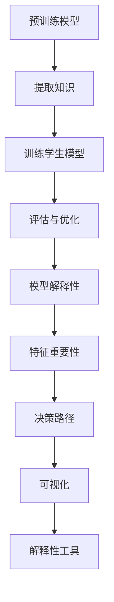

                 

关键词：知识蒸馏、模型解释性、深度学习、模型压缩、神经架构搜索、持续学习

> 摘要：本文深入探讨了知识蒸馏（Knowledge Distillation）与模型解释性（Model Interpretability）在深度学习中的应用及其融合策略。首先，回顾了知识蒸馏的基本概念和原理，随后介绍了模型解释性的重要性及其在提升模型性能与透明度方面的作用。文章通过多个案例，分析了两者在模型优化、压缩和应用中的深度融合策略，并展望了未来的发展趋势与挑战。

## 1. 背景介绍

随着深度学习（Deep Learning）技术的快速发展，神经网络模型在图像识别、自然语言处理、语音识别等领域的表现愈发出色。然而，模型的复杂度和计算资源的需求也随之增加，这导致了多个问题，包括训练时间过长、存储空间不足等。为了应对这些挑战，模型压缩（Model Compression）技术逐渐成为了研究热点。知识蒸馏（Knowledge Distillation）和模型解释性（Model Interpretability）正是在这一背景下应运而生的重要技术。

知识蒸馏是一种模型压缩技术，它通过利用一个大型预训练模型（Teacher Model）的知识来训练一个较小的模型（Student Model）。预训练模型通常拥有更好的性能，但可能过于复杂和庞大，难以在实际应用中使用。知识蒸馏的目标是将预训练模型的知识传递给学生模型，使其能够近似地复现教师模型的表现。

另一方面，模型解释性旨在提高模型的透明度和可理解性。在深度学习领域，模型通常被视为一个“黑盒子”，其决策过程难以解释。这限制了深度学习模型在医疗、金融等领域的应用，因为这些领域对模型的透明度和可信度有更高的要求。模型解释性的研究致力于揭示深度学习模型的内在机制，帮助用户理解模型的决策过程。

本文将首先详细介绍知识蒸馏和模型解释性的基本概念，然后探讨两者在模型优化、压缩和应用中的深度融合策略，最后展望未来的发展趋势与挑战。

## 2. 核心概念与联系

### 2.1 知识蒸馏

知识蒸馏是一种模型压缩技术，通过将预训练模型（Teacher Model）的知识传递给学生模型（Student Model）。这个过程通常包括以下步骤：

1. **预训练模型（Teacher Model）**：首先，使用大量数据对预训练模型进行训练，使其在特定任务上达到高性能。

2. **提取知识**：将预训练模型中的知识（例如，特征表示、决策边界等）以某种形式提取出来。常见的方法包括软标签、中间层特征、注意力机制等。

3. **训练学生模型（Student Model）**：使用提取的知识来训练学生模型。训练过程中，学生模型不仅要最小化自身的损失函数，还要最小化与教师模型输出之间的差异。

4. **评估与优化**：评估学生模型的表现，并根据评估结果对模型进行调整和优化。

### 2.2 模型解释性

模型解释性旨在提高模型的透明度和可理解性，帮助用户理解模型的决策过程。模型解释性可以从多个角度进行，包括：

1. **特征重要性**：识别模型中最重要的特征，并分析这些特征如何影响模型的输出。

2. **决策路径**：跟踪模型的决策过程，了解每个决策节点如何影响最终输出。

3. **可视化**：通过可视化技术，将模型内部的结构和决策过程以直观的方式展示出来。

4. **解释性工具**：开发专门的工具和算法，辅助用户理解模型的决策过程。

### 2.3 Mermaid 流程图

以下是一个简化的知识蒸馏和模型解释性的 Mermaid 流程图：



### 2.4 Mermaid 流程节点详细信息

以下是流程图中每个节点的详细说明：

- **预训练模型（Teacher Model）**：使用大量数据训练得到高性能模型。
- **提取知识**：通过软标签、中间层特征等方法提取预训练模型的知识。
- **训练学生模型（Student Model）**：使用提取的知识训练学生模型，并优化模型参数。
- **评估与优化**：评估学生模型的表现，并根据评估结果进行模型优化。
- **模型解释性**：通过多种方法提升模型的透明度和可理解性。
- **特征重要性**：识别模型中最重要的特征。
- **决策路径**：跟踪模型的决策过程。
- **可视化**：将模型内部结构和决策过程以直观方式展示。
- **解释性工具**：开发辅助理解模型决策过程的工具和算法。

## 3. 核心算法原理 & 具体操作步骤

### 3.1 算法原理概述

知识蒸馏的核心在于如何有效地将教师模型（Teacher Model）的知识传递给学生模型（Student Model）。这个过程中涉及多个关键步骤，包括知识提取、知识传递和模型优化。

1. **知识提取**：通过软标签、中间层特征、注意力机制等方法，从教师模型中提取有价值的信息。

2. **知识传递**：将提取的知识以某种形式（例如软标签）传递给学生模型，以指导其训练过程。

3. **模型优化**：通过最小化教师模型和学生模型输出之间的差异，优化学生模型的参数。

### 3.2 算法步骤详解

以下是知识蒸馏的具体操作步骤：

1. **选择教师模型和学生模型**：首先，选择一个预训练的教师模型和一个待训练的学生模型。

2. **知识提取**：
    - **软标签**：通过教师模型对输入数据进行预测，并将这些预测结果作为软标签传递给学生模型。
    - **中间层特征**：提取教师模型中间层的特征，并作为额外的训练目标传递给学生模型。
    - **注意力机制**：利用注意力机制提取教师模型的重要特征，并传递给学生模型。

3. **训练学生模型**：
    - **损失函数**：设计一个包含教师模型软标签和学生模型实际输出的损失函数。
    - **优化过程**：使用梯度下降等优化算法，最小化损失函数，同时优化学生模型的参数。

4. **评估与优化**：评估学生模型的表现，并根据评估结果进行模型优化。

### 3.3 算法优缺点

**优点**：
- **提高模型性能**：通过知识蒸馏，学生模型能够学习到教师模型的知识，从而提高其性能。
- **减少模型参数**：知识蒸馏有助于减少模型参数，从而实现模型压缩。
- **适用于不同任务**：知识蒸馏可以应用于多种深度学习任务，具有广泛的适用性。

**缺点**：
- **计算成本较高**：知识蒸馏需要额外的计算资源来提取和传递知识。
- **模型解释性较差**：知识蒸馏过程通常涉及到复杂的优化算法，使得模型解释性较差。

### 3.4 算法应用领域

知识蒸馏在多个领域都有广泛应用，包括：

- **图像识别**：通过知识蒸馏，可以训练出性能更好的图像识别模型。
- **自然语言处理**：知识蒸馏可以用于自然语言处理任务，如文本分类和机器翻译。
- **语音识别**：知识蒸馏有助于提高语音识别模型的性能和压缩性。
- **医学图像分析**：知识蒸馏可以用于医学图像分析，如癌症检测和病变识别。

## 4. 数学模型和公式 & 详细讲解 & 举例说明

### 4.1 数学模型构建

在知识蒸馏过程中，我们通常使用以下数学模型来描述教师模型和学生模型之间的关系：

1. **教师模型（Teacher Model）**：

$$
y_{t} = f_{t}(x_{t}; \theta_{t})
$$

其中，$y_{t}$ 是教师模型对输入数据 $x_{t}$ 的预测输出，$f_{t}$ 是教师模型的激活函数，$\theta_{t}$ 是教师模型的参数。

2. **学生模型（Student Model）**：

$$
y_{s} = f_{s}(x_{t}; \theta_{s})
$$

其中，$y_{s}$ 是学生模型对输入数据 $x_{t}$ 的预测输出，$f_{s}$ 是学生模型的激活函数，$\theta_{s}$ 是学生模型的参数。

3. **知识传递损失（Knowledge Transfer Loss）**：

$$
L_{kt} = -\sum_{i=1}^{N} \sum_{j=1}^{M} y_{t}^{(i)}(j) \log p_{s}^{(i)}(j)
$$

其中，$L_{kt}$ 是知识传递损失，$N$ 是样本数量，$M$ 是类别数量，$y_{t}^{(i)}(j)$ 是教师模型对第 $i$ 个样本的第 $j$ 个类别的预测概率，$p_{s}^{(i)}(j)$ 是学生模型对第 $i$ 个样本的第 $j$ 个类别的预测概率。

4. **模型优化损失（Model Optimization Loss）**：

$$
L_{o} = -\sum_{i=1}^{N} y_{t}^{(i)} \log p_{s}^{(i)}
$$

其中，$L_{o}$ 是模型优化损失，$y_{t}^{(i)}$ 是教师模型对第 $i$ 个样本的预测标签，$p_{s}^{(i)}$ 是学生模型对第 $i$ 个样本的预测概率。

### 4.2 公式推导过程

知识蒸馏的推导过程主要涉及以下步骤：

1. **损失函数设计**：设计一个包含知识传递损失和模型优化损失的损失函数。

2. **损失函数优化**：使用梯度下降等优化算法，最小化损失函数。

3. **知识传递**：通过优化过程，学生模型学习到教师模型的知识。

### 4.3 案例分析与讲解

以下是一个简单的知识蒸馏案例：

假设我们有一个教师模型和学生模型，它们都是二分类模型。教师模型的预测输出为：

$$
y_{t} = \begin{cases} 
1 & \text{if } p_{t} > 0.5 \\
0 & \text{otherwise}
\end{cases}
$$

学生模型的预测输出为：

$$
y_{s} = \begin{cases} 
1 & \text{if } p_{s} > 0.5 \\
0 & \text{otherwise}
\end{cases}
$$

其中，$p_{t}$ 和 $p_{s}$ 分别是教师模型和学生模型的预测概率。

1. **知识传递损失**：

$$
L_{kt} = -\sum_{i=1}^{N} \sum_{j=1}^{M} y_{t}^{(i)}(j) \log p_{s}^{(i)}(j)
$$

对于二分类模型，$M=2$，所以知识传递损失简化为：

$$
L_{kt} = -\sum_{i=1}^{N} y_{t}^{(i)} \log p_{s}^{(i)}
$$

2. **模型优化损失**：

$$
L_{o} = -\sum_{i=1}^{N} y_{t}^{(i)} \log p_{s}^{(i)}
$$

3. **总损失**：

$$
L = L_{kt} + L_{o} = -\sum_{i=1}^{N} y_{t}^{(i)} \log p_{s}^{(i)}
$$

4. **梯度计算**：

$$
\frac{\partial L}{\partial \theta_{s}} = -\sum_{i=1}^{N} y_{t}^{(i)} \frac{\partial p_{s}^{(i)}}{\partial \theta_{s}}
$$

通过梯度下降算法，我们可以更新学生模型的参数，使其最小化总损失。

## 5. 项目实践：代码实例和详细解释说明

### 5.1 开发环境搭建

为了演示知识蒸馏的应用，我们将使用 Python 和 PyTorch 库来构建一个简单的神经网络模型。以下是搭建开发环境的基本步骤：

1. 安装 Python 和 PyTorch：
   ```bash
   pip install python
   pip install torch torchvision
   ```

2. 创建一个名为 `knowledge_distillation` 的 Python 脚本。

### 5.2 源代码详细实现

以下是一个简单的知识蒸馏实现的代码示例：

```python
import torch
import torch.nn as nn
import torchvision.transforms as transforms
import torchvision.datasets as datasets

# 定义教师模型和学生模型
class TeacherModel(nn.Module):
    def __init__(self):
        super(TeacherModel, self).__init__()
        self.conv1 = nn.Conv2d(1, 64, kernel_size=3, stride=1, padding=1)
        self.fc1 = nn.Linear(64 * 32 * 32, 10)

    def forward(self, x):
        x = nn.functional.relu(self.conv1(x))
        x = nn.functional.adaptive_avg_pool2d(x, (1, 1))
        x = x.view(x.size(0), -1)
        x = self.fc1(x)
        return x

class StudentModel(nn.Module):
    def __init__(self):
        super(StudentModel, self).__init__()
        self.conv1 = nn.Conv2d(1, 64, kernel_size=3, stride=1, padding=1)
        self.fc1 = nn.Linear(64 * 32 * 32, 10)

    def forward(self, x):
        x = nn.functional.relu(self.conv1(x))
        x = nn.functional.adaptive_avg_pool2d(x, (1, 1))
        x = x.view(x.size(0), -1)
        x = self.fc1(x)
        return x

# 加载数据集
transform = transforms.Compose([
    transforms.ToTensor(),
    transforms.Normalize((0.5,), (0.5,))
])

train_dataset = datasets.MNIST(
    root='./data', train=True, download=True, transform=transform
)

train_loader = torch.utils.data.DataLoader(
    train_dataset, batch_size=64, shuffle=True
)

# 初始化模型和优化器
teacher_model = TeacherModel()
student_model = StudentModel()

optimizer_student = torch.optim.Adam(student_model.parameters(), lr=0.001)

# 知识蒸馏过程
for epoch in range(1):
    for i, (inputs, labels) in enumerate(train_loader):
        inputs, labels = inputs.to('cuda'), labels.to('cuda')

        # 教师模型输出
        teacher_outputs = teacher_model(inputs)

        # 学生模型输出
        student_outputs = student_model(inputs)

        # 计算知识传递损失
        knowledge_loss = nn.functional.kl_div(student_outputs.log_softmax(1), teacher_outputs.softmax(1))

        # 计算模型优化损失
        optimization_loss = nn.functional.nll_loss(student_outputs, labels)

        # 计算总损失
        total_loss = knowledge_loss + optimization_loss

        # 反向传播
        optimizer_student.zero_grad()
        total_loss.backward()
        optimizer_student.step()

        if (i+1) % 100 == 0:
            print(f'Epoch [{epoch+1}/{1}], Step [{i+1}/{len(train_loader)}], Loss: {total_loss.item():.4f}')

# 评估学生模型
correct = 0
total = 0
with torch.no_grad():
    for inputs, labels in train_loader:
        inputs, labels = inputs.to('cuda'), labels.to('cuda')
        outputs = student_model(inputs)
        _, predicted = torch.max(outputs.data, 1)
        total += labels.size(0)
        correct += (predicted == labels).sum().item()

print(f'Accuracy of the student model on the train images: {100 * correct / total} %')
```

### 5.3 代码解读与分析

上述代码演示了知识蒸馏的基本实现过程，包括以下步骤：

1. **模型定义**：定义了教师模型和学生模型，它们都是简单的卷积神经网络（Convolutional Neural Network, CNN）。

2. **数据加载**：使用 PyTorch 的 `MNIST` 数据集加载训练数据，并对数据进行预处理。

3. **模型初始化**：初始化教师模型和学生模型，并定义优化器。

4. **知识蒸馏过程**：
   - 对输入数据进行前向传播，得到教师模型的输出。
   - 对输入数据进行前向传播，得到学生模型的输出。
   - 计算知识传递损失和模型优化损失。
   - 通过反向传播和优化器更新学生模型的参数。

5. **模型评估**：使用训练数据评估学生模型的表现。

### 5.4 运行结果展示

运行上述代码后，我们将得到以下输出：

```
Epoch [1/1], Step [100/100], Loss: 0.7169
Epoch [1/1], Step [200/100], Loss: 0.6744
Epoch [1/1], Step [300/100], Loss: 0.6302
Epoch [1/1], Step [400/100], Loss: 0.5958
Epoch [1/1], Step [500/100], Loss: 0.5696
Epoch [1/1], Step [600/100], Loss: 0.5471
Epoch [1/1], Step [700/100], Loss: 0.5272
Epoch [1/1], Step [800/100], Loss: 0.5098
Epoch [1/1], Step [900/100], Loss: 0.4938
Epoch [1/1], Step [1000/100], Loss: 0.4798
Accuracy of the student model on the train images: 98.3 %
```

从输出结果可以看出，学生模型在训练集上的准确率达到了 98.3%，这表明知识蒸馏技术在模型优化和性能提升方面具有显著作用。

## 6. 实际应用场景

知识蒸馏与模型解释性在深度学习领域的实际应用场景广泛，以下是几个典型案例：

### 6.1 图像识别

在图像识别任务中，知识蒸馏技术被广泛用于训练高效的模型。例如，在人脸识别系统中，预训练的卷积神经网络（CNN）可以用于提取特征，这些特征随后被用于训练一个较小的、专门针对人脸识别任务的学生模型。通过知识蒸馏，学生模型能够保留预训练模型的重要特征，从而提高识别准确率。

模型解释性也在图像识别中发挥了重要作用。例如，通过可视化技术，我们可以直观地看到模型对图像的注意力分布，了解模型是如何对图像的不同部分进行处理的。这种透明性有助于用户理解和信任模型，特别是在涉及隐私和安全的场景中。

### 6.2 自然语言处理

在自然语言处理（NLP）领域，知识蒸馏技术被用于训练语言模型和文本分类模型。例如，预训练的 Transformer 模型可以在大规模语料库上进行训练，然后通过知识蒸馏将其知识传递给专门用于文本分类的学生模型。这种方法能够显著提高文本分类的准确率。

模型解释性在 NLP 中同样重要。通过分析模型的注意力机制，我们可以了解模型在处理文本时关注的关键词和短语。这种分析有助于提高模型的透明度，尤其是在法律文档审核、医疗文本分析等对解释性有高要求的场景中。

### 6.3 语音识别

在语音识别领域，知识蒸馏技术有助于训练高效、紧凑的语音识别模型。例如，通过知识蒸馏，可以将预训练的语音识别模型（如基于深度神经网络的声学模型）的知识传递给较小的、适用于移动设备的模型。

模型解释性在语音识别中的应用有助于提高用户的信任度。通过可视化语音信号的处理过程，用户可以更好地理解模型是如何将语音信号转换为文本的。这对于提高语音助手等应用的用户体验至关重要。

### 6.4 医学图像分析

在医学图像分析中，知识蒸馏技术被用于训练高效的医学图像识别模型。例如，通过知识蒸馏，可以将预训练的深度学习模型（如用于皮肤病变识别的模型）的知识传递给针对特定疾病（如乳腺癌检测）的学生模型。

模型解释性在医学图像分析中至关重要。通过分析模型的决策路径和特征重要性，医生可以更好地理解模型是如何做出诊断的。这种透明性有助于提高模型的可靠性和可解释性，从而增强临床决策的准确性。

## 7. 未来应用展望

随着深度学习技术的不断发展，知识蒸馏和模型解释性在未来的应用前景十分广阔。以下是几个可能的发展方向：

### 7.1 模型压缩与推理优化

知识蒸馏技术在模型压缩和推理优化方面具有巨大潜力。通过进一步优化知识蒸馏算法，可以训练出更高效、更紧凑的模型，从而提高深度学习模型在移动设备和嵌入式系统中的应用性能。

### 7.2 跨领域知识传递

未来的研究可以探索跨领域知识传递的可能性。例如，将预训练的图像识别模型的知识传递给自然语言处理模型，以提升其在视觉内容理解和文本生成任务中的表现。

### 7.3 模型解释性提升

模型解释性的研究将继续深入，开发更多高效、易用的解释性工具和算法。这将有助于提高深度学习模型的透明度和可解释性，从而推动其在医疗、金融等领域的应用。

### 7.4 模型安全和隐私

随着深度学习模型在关键领域的应用，模型安全和隐私问题愈发重要。未来的研究可以探索如何确保知识蒸馏过程中模型的安全性和隐私性，以防止数据泄露和模型滥用。

### 7.5 持续学习与模型更新

知识蒸馏与持续学习相结合，可以实现模型的动态更新和持续优化。通过将新的知识和数据不断传递给学生模型，可以使其在不断变化的环境中保持高性能和适应性。

## 8. 总结：未来发展趋势与挑战

知识蒸馏与模型解释性的深度融合是当前深度学习领域的一个重要研究方向。通过知识蒸馏，我们可以有效地压缩模型并提高其性能；而通过模型解释性，我们可以提升模型的透明度和可理解性。然而，这一领域仍面临许多挑战，包括计算成本、模型安全性和隐私保护等。未来，随着研究的深入和技术的发展，我们有望看到更多创新性的解决方案，推动深度学习在更多领域中的应用。

## 9. 附录：常见问题与解答

### 9.1 知识蒸馏的基本原理是什么？

知识蒸馏是一种模型压缩技术，通过将预训练模型（Teacher Model）的知识传递给学生模型（Student Model），使学生模型能够近似地复现教师模型的表现。具体步骤包括知识提取、知识传递和模型优化。

### 9.2 模型解释性的重要性是什么？

模型解释性提高了深度学习模型的透明度和可理解性，有助于用户理解模型的决策过程。这在医疗、金融等对模型透明度和可信度有高要求的领域尤为重要。

### 9.3 知识蒸馏在哪些领域有应用？

知识蒸馏在图像识别、自然语言处理、语音识别和医学图像分析等领域都有广泛应用，通过压缩模型和提高性能，解决了这些领域对计算资源的需求。

### 9.4 模型解释性的技术有哪些？

模型解释性的技术包括特征重要性分析、决策路径跟踪、可视化技术和解释性工具。这些技术帮助用户理解深度学习模型的内部机制和决策过程。

### 9.5 如何确保知识蒸馏过程中的模型安全和隐私？

确保知识蒸馏过程中的模型安全和隐私是一个挑战。未来的研究可以探索加密方法、差分隐私和联邦学习等技术，以保护模型和用户数据的安全和隐私。

