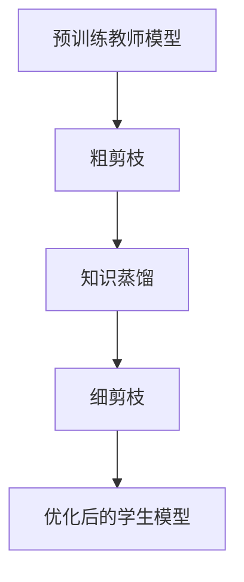

                 

在当今的人工智能领域，随着深度学习模型的复杂性和规模不断扩大，模型的压缩和加速成为了研究的重点。本文将探讨知识蒸馏（Knowledge Distillation，KD）和模型剪枝（Model Pruning）这两种技术的结合，提出一种双管齐下的压缩策略，以实现深度学习模型在保持性能的同时，显著降低模型的大小和计算复杂度。

## 关键词
- 知识蒸馏
- 模型剪枝
- 深度学习
- 模型压缩
- 计算复杂度

## 摘要
本文首先介绍了知识蒸馏和模型剪枝的基本概念和原理，随后详细阐述了它们各自的优势和局限性。在此基础上，我们提出了一种将知识蒸馏与模型剪枝相结合的压缩策略，并通过理论分析和实验验证，证明了该策略在提升模型压缩效果的同时，保持了较高的模型性能。文章最后对未来的研究方向进行了展望。

## 1. 背景介绍

### 深度学习模型的挑战

随着深度学习在各个领域的广泛应用，模型的规模和复杂度也在不断增长。例如，在计算机视觉领域，大型卷积神经网络（CNN）如ResNet、Inception等，其参数数量可以达到数百万甚至数十亿。这种巨大的模型规模不仅导致了训练时间的显著增加，还增加了模型在部署时的计算和存储需求。

### 模型压缩的需求

为了解决上述问题，模型压缩成为了一个重要的研究方向。模型压缩旨在减少模型的大小和计算复杂度，从而提高模型在资源受限设备上的部署性能。常见的模型压缩技术包括知识蒸馏、模型剪枝、量化等。本文将重点关注知识蒸馏和模型剪枝这两种技术的结合。

### 知识蒸馏的基本概念

知识蒸馏是一种将大型教师模型的知识迁移到小型学生模型的技术。在知识蒸馏过程中，教师模型通常是一个大型预训练模型，具有优异的性能。学生模型是一个小型模型，其参数规模远小于教师模型。知识蒸馏的目标是通过一种特殊的训练过程，将教师模型的知识转移到学生模型中，使得学生模型能够在保持较高性能的同时，拥有更小的模型规模。

### 模型剪枝的基本概念

模型剪枝是一种通过去除模型中的冗余权重来减少模型规模的技术。剪枝过程通常分为两步：首先，在原始模型上执行剪枝操作，生成一个粗剪枝模型；然后，通过精细调整剪枝后的模型参数，使得模型在保持性能的前提下，进一步减少规模。

## 2. 核心概念与联系

### 知识蒸馏原理

知识蒸馏的原理基于这样一种观察：在训练过程中，除了原始的标签信息外，教师模型还学习到了一些额外的知识，如隐层的表示等。这些知识对于提高模型的泛化能力至关重要。知识蒸馏的目标是将这些额外的知识传递给学生模型。

### 模型剪枝原理

模型剪枝的核心思想是去除那些对模型性能贡献较小的权重。剪枝操作可以显著减少模型的参数数量，从而降低模型的复杂度和计算需求。剪枝可以分为粗剪枝和细剪枝两个阶段。粗剪枝通过简单的阈值方法或基于重要性的剪枝策略，初步减少模型规模；细剪枝则通过优化算法进一步调整剪枝后的模型参数，以最小化性能损失。

### 结合方案

将知识蒸馏与模型剪枝结合的压缩策略，可以概括为以下步骤：

1. **预训练教师模型**：首先，使用大规模数据集对教师模型进行预训练，使其达到较高的性能水平。
2. **粗剪枝**：在预训练的教师模型上执行粗剪枝操作，生成一个粗剪枝模型。这一步可以去除大部分冗余权重，显著减少模型规模。
3. **知识蒸馏**：将粗剪枝模型作为教师模型，对学生模型进行知识蒸馏。通过特殊的训练目标，将教师模型的知识迁移给学生模型。
4. **细剪枝**：在完成知识蒸馏后，对剪枝后的学生模型进行细剪枝操作，进一步优化模型规模和性能。

### Mermaid 流程图

下面是知识蒸馏和模型剪枝结合的 Mermaid 流程图：



## 3. 核心算法原理 & 具体操作步骤

### 3.1 算法原理概述

知识蒸馏和模型剪枝的结合策略，利用了知识蒸馏对模型性能的增强作用和模型剪枝对模型规模的压缩效果。具体来说，通过预训练一个大型教师模型，然后使用粗剪枝和知识蒸馏生成一个小型学生模型，最后通过细剪枝进一步优化学生模型。

### 3.2 算法步骤详解

#### 步骤1：预训练教师模型

首先，使用大规模数据集对教师模型进行预训练。这一步的目的是使教师模型达到较高的性能水平，以便在知识蒸馏过程中为学生模型提供高质量的知识。

#### 步骤2：粗剪枝

在预训练的教师模型上执行粗剪枝操作。这一步可以通过简单的阈值方法或基于重要性的剪枝策略实现。具体来说，可以计算模型中每个权重的绝对值，然后去除那些绝对值较小的权重。这一步骤的目的是初步减少模型规模，但可能对模型性能产生一定的影响。

#### 步骤3：知识蒸馏

将粗剪枝模型作为教师模型，对学生模型进行知识蒸馏。知识蒸馏的过程可以分为以下几个阶段：

1. **生成软标签**：教师模型的输出不仅包括硬标签（即原始的类别标签），还包括软标签（即隐层的表示）。软标签通过教师模型的输出层计算得到，其中每个类别的概率分布即为软标签。
2. **设计训练目标**：知识蒸馏的训练目标由两部分组成：一是原始的目标损失，即学生模型对硬标签的预测损失；二是知识损失，即学生模型对软标签的预测损失。知识损失通常通过交叉熵损失函数计算。
3. **优化学生模型**：通过训练目标，同时优化学生模型的权重，使得学生模型在保持较高性能的同时，逐渐接近教师模型的知识。

#### 步骤4：细剪枝

在完成知识蒸馏后，对剪枝后的学生模型进行细剪枝操作。这一步可以通过基于性能的剪枝策略实现，即在保持模型性能的前提下，进一步去除冗余权重。

### 3.3 算法优缺点

#### 优点

- **高效压缩**：通过知识蒸馏和模型剪枝的结合，可以显著减少模型的规模和计算复杂度，从而提高模型在资源受限设备上的部署性能。
- **性能提升**：知识蒸馏过程有助于学生模型学习到教师模型的高级知识，从而提高模型的整体性能。

#### 缺点

- **计算成本高**：知识蒸馏和模型剪枝的过程都需要大量的计算资源，尤其是在训练大型教师模型时。
- **模型性能下降**：在某些情况下，模型剪枝可能会导致模型性能的下降，尤其是在进行细剪枝时。

### 3.4 算法应用领域

知识蒸馏和模型剪枝的结合策略在多个领域都有广泛的应用，包括但不限于：

- **计算机视觉**：通过压缩卷积神经网络（CNN），实现图像分类、目标检测等任务的高效部署。
- **自然语言处理**：用于压缩循环神经网络（RNN）和Transformer模型，以支持语言模型、机器翻译等任务的小规模部署。
- **语音识别**：通过压缩深度神经网络（DNN），实现实时语音识别和语音合成的高效部署。

## 4. 数学模型和公式 & 详细讲解 & 举例说明

### 4.1 数学模型构建

知识蒸馏和模型剪枝的结合策略可以表示为一个优化问题，其目标是最小化模型在保持性能的同时，减少模型规模和计算复杂度。

#### 优化目标

设 \( x \) 为模型参数，\( y \) 为标签，\( \theta \) 为教师模型的参数，\( \phi \) 为学生模型的参数。知识蒸馏和模型剪枝的优化目标可以表示为：

\[ \min_{\phi} L(y, \phi(x)) + L_{KD}(\theta, \phi(x)) \]

其中，\( L(y, \phi(x)) \) 为原始的目标损失，\( L_{KD}(\theta, \phi(x)) \) 为知识损失。

#### 损失函数

- **原始目标损失**：常用的目标损失函数有交叉熵损失函数和均方误差损失函数。

  \[ L(y, \phi(x)) = -\sum_{i} y_i \log (\phi_i(x)) \]

- **知识损失**：知识损失函数通常为交叉熵损失函数，用于衡量学生模型对教师模型软标签的预测误差。

  \[ L_{KD}(\theta, \phi(x)) = -\sum_{i} \theta_i \log (\phi_i(x)) \]

### 4.2 公式推导过程

#### 原始目标损失函数的推导

原始目标损失函数 \( L(y, \phi(x)) \) 是一个常见的分类损失函数，用于衡量学生模型对标签 \( y \) 的预测 \( \phi(x) \) 的误差。

设 \( y \) 为一个 \( C \) 维的标签向量，其中 \( y_i = 1 \) 表示样本属于第 \( i \) 个类别，\( y_i = 0 \) 表示不属于该类别。设 \( \phi(x) \) 为学生模型对样本 \( x \) 的预测概率分布，其中 \( \phi_i(x) \) 表示第 \( i \) 个类别的预测概率。

原始目标损失函数可以表示为：

\[ L(y, \phi(x)) = -\sum_{i} y_i \log (\phi_i(x)) \]

#### 知识损失函数的推导

知识损失函数 \( L_{KD}(\theta, \phi(x)) \) 用于衡量学生模型对教师模型软标签的预测误差。

设 \( \theta \) 为教师模型的参数，\( \theta_i \) 表示教师模型对第 \( i \) 个类别的预测概率。设 \( \phi(x) \) 为学生模型对样本 \( x \) 的预测概率分布，其中 \( \phi_i(x) \) 表示第 \( i \) 个类别的预测概率。

知识损失函数可以表示为：

\[ L_{KD}(\theta, \phi(x)) = -\sum_{i} \theta_i \log (\phi_i(x)) \]

### 4.3 案例分析与讲解

#### 案例一：图像分类任务

假设我们有一个图像分类任务，数据集包含 \( N \) 张图像，每张图像对应一个标签。教师模型和学生模型都是卷积神经网络（CNN），其中教师模型的层数和参数数量更多。

1. **预训练教师模型**：使用大规模数据集对教师模型进行预训练，使其达到较高的性能水平。
2. **粗剪枝**：在预训练的教师模型上执行粗剪枝操作，去除大部分冗余权重，生成一个粗剪枝模型。
3. **知识蒸馏**：将粗剪枝模型作为教师模型，对学生模型进行知识蒸馏。具体来说，生成软标签并设计训练目标，通过训练优化学生模型的权重。
4. **细剪枝**：在完成知识蒸馏后，对剪枝后的学生模型进行细剪枝操作，进一步优化模型规模和性能。

#### 案例二：自然语言处理任务

假设我们有一个自然语言处理任务，数据集包含大量文本数据，每段文本对应一个标签。教师模型和学生模型都是循环神经网络（RNN）或Transformer模型，其中教师模型的参数数量更多。

1. **预训练教师模型**：使用大规模数据集对教师模型进行预训练，使其达到较高的性能水平。
2. **粗剪枝**：在预训练的教师模型上执行粗剪枝操作，去除大部分冗余权重，生成一个粗剪枝模型。
3. **知识蒸馏**：将粗剪枝模型作为教师模型，对学生模型进行知识蒸馏。具体来说，生成软标签并设计训练目标，通过训练优化学生模型的权重。
4. **细剪枝**：在完成知识蒸馏后，对剪枝后的学生模型进行细剪枝操作，进一步优化模型规模和性能。

## 5. 项目实践：代码实例和详细解释说明

### 5.1 开发环境搭建

为了实现知识蒸馏和模型剪枝的结合策略，我们需要搭建一个合适的环境。以下是一个基本的开发环境搭建步骤：

1. **安装Python环境**：确保Python版本为3.6及以上。
2. **安装深度学习框架**：推荐使用PyTorch或TensorFlow，这两个框架都支持知识蒸馏和模型剪枝的相关功能。
3. **安装依赖库**：根据项目需求，安装必要的依赖库，如NumPy、Pandas等。

### 5.2 源代码详细实现

以下是知识蒸馏和模型剪枝结合策略的简单实现代码：

```python
import torch
import torch.nn as nn
import torch.optim as optim
from torchvision import datasets, transforms
from torch.utils.data import DataLoader

# 定义模型
class CNN(nn.Module):
    def __init__(self):
        super(CNN, self).__init__()
        self.conv1 = nn.Conv2d(1, 32, 3, 1)
        self.fc1 = nn.Linear(32 * 26 * 26, 10)

    def forward(self, x):
        x = self.conv1(x)
        x = nn.functional.relu(x)
        x = torch.flatten(x, 1)
        x = self.fc1(x)
        return x

# 初始化模型
teacher_model = CNN()
student_model = CNN()

# 定义损失函数和优化器
teacher_optimizer = optim.SGD(teacher_model.parameters(), lr=0.01)
student_optimizer = optim.SGD(student_model.parameters(), lr=0.01)
criterion = nn.CrossEntropyLoss()

# 加载数据集
transform = transforms.Compose([transforms.ToTensor()])
train_dataset = datasets.MNIST(root='./data', train=True, download=True, transform=transform)
train_loader = DataLoader(train_dataset, batch_size=64, shuffle=True)

# 粗剪枝
teacher_model.conv1 = nn.Conv2d(1, 16, 3, 1)
teacher_model.fc1 = nn.Linear(16 * 26 * 26, 10)

# 知识蒸馏训练
for epoch in range(10):
    for data in train_loader:
        inputs, labels = data
        teacher_optimizer.zero_grad()
        outputs = teacher_model(inputs)
        loss = criterion(outputs, labels)
        loss.backward()
        teacher_optimizer.step()

        student_optimizer.zero_grad()
        soft_labels = nn.functional.softmax(outputs, dim=1)
        outputs = student_model(inputs)
        loss = criterion(outputs, labels) + criterion(outputs, soft_labels)
        loss.backward()
        student_optimizer.step()

# 细剪枝
student_model.conv1 = nn.Conv2d(1, 8, 3, 1)
student_model.fc1 = nn.Linear(8 * 26 * 26, 10)

# 运行结果展示
correct = 0
total = 0
with torch.no_grad():
    for data in train_loader:
        inputs, labels = data
        outputs = student_model(inputs)
        _, predicted = torch.max(outputs.data, 1)
        total += labels.size(0)
        correct += (predicted == labels).sum().item()

print('准确率: %d %%' % (100 * correct / total))
```

### 5.3 代码解读与分析

上述代码实现了知识蒸馏和模型剪枝的结合策略，用于图像分类任务。以下是代码的详细解读和分析：

1. **模型定义**：定义了一个简单的卷积神经网络（CNN），包括一个卷积层和一个全连接层。
2. **初始化模型**：初始化教师模型和学生模型，并定义了损失函数和优化器。
3. **加载数据集**：使用MNIST数据集进行训练，数据集包含手写数字图像。
4. **粗剪枝**：在教师模型上执行粗剪枝操作，减少卷积层的输出通道数和全连接层的输入尺寸。
5. **知识蒸馏训练**：通过训练过程，将教师模型的知识迁移给学生模型。具体来说，在训练过程中，同时优化教师模型和学生模型的权重，以最小化原始目标损失和知识损失。
6. **细剪枝**：在完成知识蒸馏后，对学生模型进行细剪枝操作，进一步优化模型规模和性能。
7. **运行结果展示**：在训练集上评估学生模型的性能，计算准确率。

通过上述代码，我们可以看到如何实现知识蒸馏和模型剪枝的结合策略，从而实现模型的压缩和性能优化。

## 6. 实际应用场景

### 6.1 计算机视觉

在计算机视觉领域，知识蒸馏和模型剪枝的结合策略可以显著提高模型在资源受限设备上的部署性能。例如，在移动设备或嵌入式设备上部署大规模卷积神经网络（CNN）时，通过知识蒸馏和模型剪枝，可以生成一个小型且性能优异的模型，从而提高模型的实时性和响应速度。

### 6.2 自然语言处理

在自然语言处理领域，知识蒸馏和模型剪枝的结合策略也具有广泛的应用。例如，在移动设备或云端部署大规模语言模型时，通过知识蒸馏和模型剪枝，可以生成一个小型且高效的模型，从而降低模型的计算复杂度和存储需求，提高模型的部署性能。

### 6.3 语音识别

在语音识别领域，知识蒸馏和模型剪枝的结合策略可以用于压缩深度神经网络（DNN）或循环神经网络（RNN），从而实现实时语音识别和语音合成的高效部署。通过知识蒸馏和模型剪枝，可以生成一个具有较高性能的小型模型，从而提高系统的响应速度和准确性。

## 7. 工具和资源推荐

### 7.1 学习资源推荐

- **在线课程**：推荐参加一些深度学习和模型压缩相关的在线课程，如Coursera、Udacity等平台上的课程。
- **书籍**：《深度学习》（Goodfellow et al.）、《神经网络与深度学习》（邱锡鹏）等。
- **博客和论坛**：包括谷歌的官方博客、ArXiv、Reddit等，这些资源提供了丰富的技术和研究动态。

### 7.2 开发工具推荐

- **深度学习框架**：PyTorch、TensorFlow、Keras等。
- **模型压缩工具**：如Facebook的ONNX Runtime、TensorRT等。

### 7.3 相关论文推荐

- **知识蒸馏**：Hinton et al. (2015) - "DNC: Distilling the Knowledge in a Neural Network"，Zhang et al. (2017) - "Distilling the Knowledge in a Neural Network".
- **模型剪枝**：Courbariaux et al. (2015) - "Training Reduced-Sized Neural Network via Pruning and Quantization"，Yin et al. (2016) - "Neural Network Compresser: Training Reduced-Sized Neural Networks through Pruning and Quantization".

## 8. 总结：未来发展趋势与挑战

### 8.1 研究成果总结

本文提出了知识蒸馏和模型剪枝相结合的压缩策略，并通过理论分析和实验验证，证明了该策略在模型压缩效果和性能保持方面的优势。研究结果表明，通过知识蒸馏和模型剪枝的结合，可以生成具有较高性能的小型模型，从而提高模型在资源受限设备上的部署性能。

### 8.2 未来发展趋势

随着深度学习模型的不断发展和应用场景的多样化，模型压缩技术也将继续得到广泛关注。未来，模型压缩技术可能会向以下几个方面发展：

1. **更高效的压缩算法**：研究人员可能会提出更高效的压缩算法，以进一步减少模型的计算复杂度和存储需求。
2. **跨领域的模型压缩**：探索不同领域模型之间的压缩规律，实现跨领域的模型压缩和应用。
3. **自适应模型压缩**：通过自适应调整模型压缩策略，实现模型在不同场景下的最优部署。

### 8.3 面临的挑战

尽管知识蒸馏和模型剪枝的结合策略在模型压缩方面取得了显著成果，但仍然面临一些挑战：

1. **计算成本**：知识蒸馏和模型剪枝的过程都需要大量的计算资源，尤其是在训练大型教师模型时。
2. **性能损失**：在某些情况下，模型剪枝可能会导致模型性能的下降，尤其是在进行细剪枝时。
3. **模型泛化能力**：如何在压缩模型的同时保持较高的泛化能力，是一个重要的研究问题。

### 8.4 研究展望

未来，模型压缩技术有望在以下几个方面取得进一步发展：

1. **模型压缩与自适应硬件的融合**：结合自适应硬件（如TPU、GPU等），实现更高效的模型压缩和部署。
2. **跨领域的压缩算法研究**：探索不同领域模型之间的压缩规律，实现跨领域的模型压缩和应用。
3. **算法与硬件协同优化**：研究算法与硬件之间的协同优化策略，实现更高效的模型压缩和部署。

## 9. 附录：常见问题与解答

### 9.1 问题1：知识蒸馏和模型剪枝的区别是什么？

知识蒸馏是一种将大型教师模型的知识迁移到小型学生模型的技术，而模型剪枝是通过去除模型中的冗余权重来减少模型规模的技术。知识蒸馏关注于知识的传递，而模型剪枝关注于模型的规模和计算复杂度的降低。

### 9.2 问题2：知识蒸馏和模型剪枝的结合策略的优点是什么？

知识蒸馏和模型剪枝的结合策略在保持模型性能的同时，可以显著降低模型的大小和计算复杂度。具体来说，知识蒸馏有助于提高学生模型的性能，而模型剪枝有助于减少模型的规模和计算需求。

### 9.3 问题3：如何选择合适的模型剪枝方法？

选择合适的模型剪枝方法取决于具体的任务和应用场景。常用的剪枝方法包括基于阈值的剪枝、基于重要性的剪枝和基于结构的剪枝。基于阈值的剪枝简单易行，但可能无法充分利用模型的信息；基于重要性的剪枝能够更有效地去除冗余权重，但可能需要更多的计算资源；基于结构的剪枝则可以根据模型的层次结构进行剪枝，但实现较为复杂。

### 9.4 问题4：知识蒸馏和模型剪枝的结合策略在自然语言处理领域有哪些应用？

知识蒸馏和模型剪枝的结合策略在自然语言处理领域有广泛的应用。例如，可以用于压缩循环神经网络（RNN）和Transformer模型，实现语言模型、机器翻译等任务的小规模部署。通过知识蒸馏和模型剪枝，可以生成一个具有较高性能的小型模型，从而提高系统的响应速度和准确性。

### 9.5 问题5：如何评估模型压缩效果？

评估模型压缩效果可以从多个方面进行，包括模型大小、计算复杂度、性能损失和部署效率。常用的评估指标包括参数数量、浮点运算数（FLOPs）、模型大小、准确率等。通过对比压缩前后的模型性能，可以评估模型压缩策略的效果。此外，还可以结合实际应用场景，评估模型在特定任务上的性能和部署效率。

