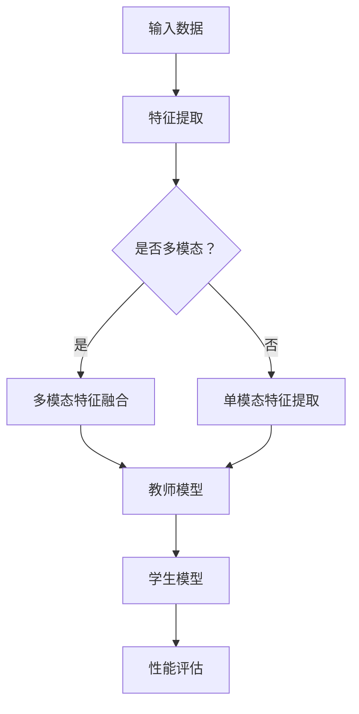

                 

 关键词：知识蒸馏，多模态学习，模型压缩，模型优化，计算机视觉，自然语言处理

> 摘要：本文旨在探讨知识蒸馏在多模态学习中的应用策略，通过对知识蒸馏技术的深入解析，结合多模态学习的具体场景，详细阐述其在提升模型性能、压缩模型规模和降低计算成本方面的优势。文章将分为背景介绍、核心概念与联系、核心算法原理与具体操作步骤、数学模型与公式、项目实践、实际应用场景、工具和资源推荐以及总结和展望等多个部分，旨在为研究者提供系统的理论指导和实践参考。

## 1. 背景介绍

在当今信息爆炸的时代，多模态学习作为一种新兴的研究方向，正日益受到关注。多模态学习旨在将不同类型的模态（如图像、文本、音频等）进行整合，以获得更丰富的信息和更准确的决策。随着深度学习技术的迅猛发展，多模态学习在计算机视觉、自然语言处理、语音识别等领域展现出巨大的潜力。然而，传统的多模态学习模型往往面临模型规模庞大、计算复杂度高和能耗等问题。

为了解决这些问题，知识蒸馏技术应运而生。知识蒸馏是一种模型压缩技术，通过将复杂模型的知识“蒸馏”到一个小型的学生模型中，从而在保持模型性能的同时显著降低模型规模和计算成本。知识蒸馏技术在多模态学习中的应用，不仅能够提升模型性能，还能实现模型的快速部署和高效运行。

本文将从知识蒸馏和多模态学习的基本概念出发，深入探讨知识蒸馏在多模态学习中的应用策略，为相关领域的研究者和开发者提供有价值的参考。

## 2. 核心概念与联系

### 2.1 知识蒸馏

知识蒸馏（Knowledge Distillation），也称为模型压缩或知识转移，是一种模型压缩技术。其主要思想是将一个大型且复杂的教师模型（Teacher Model）的知识转移到一个小型且高效的学生模型（Student Model）中。通过这种知识转移，学生模型能够保留教师模型的主要特性，同时减小模型的规模和计算复杂度。

知识蒸馏的核心概念可以概括为以下几点：

1. **教师模型**：一个大型且复杂的模型，具有高度的准确性，但其计算资源和存储需求较大。
2. **学生模型**：一个小型且高效的模型，旨在通过学习教师模型的知识来提升自身的性能。
3. **蒸馏损失函数**：用于量化教师模型和学生模型之间的差异，通常包括软目标损失和硬目标损失。

### 2.2 多模态学习

多模态学习是一种结合不同类型模态（如图像、文本、音频等）的学习方法，旨在通过整合多种模态的信息来提升模型性能。多模态学习的核心概念包括：

1. **模态**：指不同的数据类型，如图像、文本、音频等。
2. **特征提取**：从每个模态中提取关键特征，以供模型学习。
3. **融合策略**：将不同模态的特征进行整合，以获得更丰富的信息。

### 2.3 知识蒸馏在多模态学习中的应用

知识蒸馏在多模态学习中的应用，旨在通过蒸馏技术将多模态学习模型的知识转移到一个小型的多模态学生模型中。具体应用包括：

1. **模型压缩**：通过知识蒸馏，将复杂的多模态模型压缩为小型模型，降低计算资源和存储需求。
2. **性能提升**：通过学习教师模型的知识，学生模型能够在保留性能的同时减小模型规模。
3. **实时性提升**：小型化后的学生模型具有更快的推理速度，适用于实时应用场景。

### 2.4 Mermaid 流程图

以下是一个简化的知识蒸馏在多模态学习中的应用流程图：



在这个流程图中，输入数据首先经过特征提取，然后根据是否为多模态数据选择不同的处理路径。多模态数据通过特征融合模块进行整合，单模态数据则直接进行特征提取。之后，特征被输入到教师模型中，并通过知识蒸馏技术传递到学生模型中。最后，学生模型的性能通过评估模块进行评估。

## 3. 核心算法原理与具体操作步骤

### 3.1 算法原理概述

知识蒸馏算法的核心思想是通过软目标损失和硬目标损失两种损失函数，将教师模型的知识传递给学生模型。具体来说，软目标损失函数用于量化教师模型和学生模型对每个样本的预测概率分布之间的差异，而硬目标损失函数则用于量化教师模型和学生模型对每个样本的预测类别之间的差异。

### 3.2 算法步骤详解

#### 步骤1：初始化教师模型和学生模型

首先，初始化一个大型且复杂的教师模型和一个小型且高效的学生模型。教师模型通常是一个已经训练好的大型模型，而学生模型则是一个经过初始化的小型模型。

#### 步骤2：特征提取

输入数据经过特征提取模块，提取出各个模态的特征。对于多模态数据，还需要通过特征融合模块将不同模态的特征进行整合。

#### 步骤3：教师模型预测

将提取出的特征输入到教师模型中，得到教师模型对每个样本的预测结果，包括预测概率分布和预测类别。

#### 步骤4：学生模型预测

将提取出的特征输入到学生模型中，得到学生模型对每个样本的预测结果，包括预测概率分布和预测类别。

#### 步骤5：计算损失函数

根据教师模型和学生模型的预测结果，计算软目标损失和硬目标损失。软目标损失函数通常采用交叉熵损失函数，而硬目标损失函数则采用均方误差损失函数。

#### 步骤6：反向传播和优化

利用计算得到的损失函数，通过反向传播算法更新学生模型的参数，使其逐渐接近教师模型的知识。

#### 步骤7：性能评估

通过在测试集上的性能评估，验证学生模型的性能是否达到预期目标。

### 3.3 算法优缺点

#### 优点：

1. **模型压缩**：通过知识蒸馏技术，可以将复杂的大型模型压缩为小型模型，降低计算资源和存储需求。
2. **性能提升**：通过学习教师模型的知识，学生模型能够在保留性能的同时减小模型规模。
3. **实时性提升**：小型化后的学生模型具有更快的推理速度，适用于实时应用场景。

#### 缺点：

1. **训练时间延长**：知识蒸馏过程中，需要额外计算软目标损失和硬目标损失，从而增加训练时间。
2. **模型适应性**：知识蒸馏技术对模型适应性有一定要求，不同类型的模型可能需要不同的蒸馏策略。

### 3.4 算法应用领域

知识蒸馏技术在多模态学习中的应用非常广泛，包括但不限于以下领域：

1. **计算机视觉**：通过知识蒸馏技术，可以将复杂的图像识别模型压缩为小型模型，提升模型性能和实时性。
2. **自然语言处理**：知识蒸馏技术在自然语言处理领域同样具有广泛的应用，如文本分类、情感分析等。
3. **语音识别**：知识蒸馏技术可以帮助语音识别模型实现快速部署和高效运行。

## 4. 数学模型和公式

### 4.1 数学模型构建

知识蒸馏的数学模型主要包括两个部分：软目标损失函数和硬目标损失函数。

#### 4.1.1 软目标损失函数

软目标损失函数用于量化教师模型和学生模型对每个样本的预测概率分布之间的差异。通常采用交叉熵损失函数，定义如下：

$$
L_{soft} = -\sum_{i=1}^{N}\sum_{j=1}^{C} y_{ij} \log(p_{ij}),
$$

其中，$y_{ij}$ 表示教师模型对第 $i$ 个样本的第 $j$ 个类别的预测概率，$p_{ij}$ 表示学生模型对第 $i$ 个样本的第 $j$ 个类别的预测概率。

#### 4.1.2 硬目标损失函数

硬目标损失函数用于量化教师模型和学生模型对每个样本的预测类别之间的差异。通常采用均方误差损失函数，定义如下：

$$
L_{hard} = \frac{1}{N} \sum_{i=1}^{N} \sum_{j=1}^{C} (y_{ij} - p_{ij})^2,
$$

其中，$y_{ij}$ 表示教师模型对第 $i$ 个样本的第 $j$ 个类别的预测概率，$p_{ij}$ 表示学生模型对第 $i$ 个样本的第 $j$ 个类别的预测概率。

### 4.2 公式推导过程

知识蒸馏的损失函数是通过最大化教师模型和学生模型之间的相似度来构建的。具体推导过程如下：

#### 4.2.1 软目标损失函数推导

设 $Y$ 表示教师模型的预测概率分布，$P$ 表示学生模型的预测概率分布。则软目标损失函数可以表示为：

$$
L_{soft} = -\log \frac{1}{Z} \sum_{j=1}^{C} e^{y_{ij} T_{ij}},
$$

其中，$Z$ 是规范化常数，$T_{ij}$ 是教师模型对第 $i$ 个样本的第 $j$ 个类别的预测概率。

将 $T_{ij}$ 的表达式代入上式，得到：

$$
L_{soft} = -\log \frac{1}{Z} \sum_{j=1}^{C} e^{y_{ij} T_{ij}} = -\log \frac{1}{Z} \sum_{j=1}^{C} e^{y_{ij} \frac{P_j}{P}} = -\log \frac{1}{Z} \sum_{j=1}^{C} e^{y_{ij} P_j} = -\sum_{i=1}^{N}\sum_{j=1}^{C} y_{ij} \log(p_{ij}),
$$

其中，$p_{ij} = \frac{e^{y_{ij} P_j}}{Z}$。

#### 4.2.2 硬目标损失函数推导

硬目标损失函数可以表示为：

$$
L_{hard} = \frac{1}{N} \sum_{i=1}^{N} \sum_{j=1}^{C} (y_{ij} - p_{ij})^2,
$$

其中，$y_{ij}$ 是教师模型对第 $i$ 个样本的第 $j$ 个类别的预测概率，$p_{ij}$ 是学生模型对第 $i$ 个样本的第 $j$ 个类别的预测概率。

### 4.3 案例分析与讲解

以下是一个简单的知识蒸馏案例，用于文本分类任务。

#### 4.3.1 数据集

假设我们使用一个包含 10000 个样本的数据集进行训练，每个样本包含一个文本和一个标签。标签为二分类，即 0 或 1。

#### 4.3.2 教师模型和学生模型

教师模型是一个经过训练的大型卷积神经网络（CNN），学生模型是一个小型卷积神经网络。

#### 4.3.3 特征提取

对于每个样本，首先使用词嵌入层将文本转换为向量表示，然后输入到 CNN 中进行特征提取。

#### 4.3.4 模型预测和损失计算

对于每个样本，首先输入到教师模型中，得到教师模型的预测概率分布和预测类别。然后输入到学生模型中，得到学生模型的预测概率分布和预测类别。最后，计算软目标损失和硬目标损失。

#### 4.3.5 反向传播和优化

利用计算得到的损失函数，通过反向传播算法更新学生模型的参数。

#### 4.3.6 性能评估

在测试集上评估学生模型的性能，包括准确率、召回率和 F1 分数等指标。

## 5. 项目实践：代码实例和详细解释说明

### 5.1 开发环境搭建

在开始项目实践之前，我们需要搭建一个适合知识蒸馏在多模态学习中的应用的开发环境。以下是一个简单的开发环境搭建步骤：

1. 安装 Python 3.7 及以上版本。
2. 安装深度学习框架，如 TensorFlow 或 PyTorch。
3. 安装必要的依赖库，如 NumPy、Pandas、Matplotlib 等。
4. 搭建 GPU 计算环境，如使用 CUDA 和 cuDNN。

### 5.2 源代码详细实现

以下是一个基于 PyTorch 的知识蒸馏在多模态学习中的实现代码示例：

```python
import torch
import torch.nn as nn
import torch.optim as optim
from torchvision import datasets, transforms
from torch.utils.data import DataLoader
from torch.autograd import Variable

# 定义教师模型和学生模型
class TeacherModel(nn.Module):
    def __init__(self):
        super(TeacherModel, self).__init__()
        self.conv1 = nn.Conv2d(3, 64, 3, 1, 1)
        self.fc1 = nn.Linear(64 * 32 * 32, 1000)
        self.fc2 = nn.Linear(1000, 2)

    def forward(self, x):
        x = self.conv1(x)
        x = nn.functional.relu(x)
        x = torch.flatten(x, 1)
        x = self.fc1(x)
        x = nn.functional.relu(x)
        x = self.fc2(x)
        return x

class StudentModel(nn.Module):
    def __init__(self):
        super(StudentModel, self).__init__()
        self.conv1 = nn.Conv2d(3, 32, 3, 1, 1)
        self.fc1 = nn.Linear(32 * 32 * 32, 500)
        self.fc2 = nn.Linear(500, 2)

    def forward(self, x):
        x = self.conv1(x)
        x = nn.functional.relu(x)
        x = torch.flatten(x, 1)
        x = self.fc1(x)
        x = nn.functional.relu(x)
        x = self.fc2(x)
        return x

# 加载数据集
transform = transforms.Compose([transforms.ToTensor()])
train_dataset = datasets.CIFAR10(root='./data', train=True, download=True, transform=transform)
train_loader = DataLoader(train_dataset, batch_size=64, shuffle=True)

# 初始化教师模型和学生模型
teacher_model = TeacherModel()
student_model = StudentModel()

# 指定损失函数和优化器
criterion = nn.CrossEntropyLoss()
optimizer = optim.Adam(student_model.parameters(), lr=0.001)

# 训练过程
for epoch in range(10):
    for i, (images, labels) in enumerate(train_loader):
        images = Variable(images)
        labels = Variable(labels)

        # 前向传播
        teacher_output = teacher_model(images)
        student_output = student_model(images)

        # 计算损失
        loss = criterion(student_output, labels)

        # 反向传播和优化
        optimizer.zero_grad()
        loss.backward()
        optimizer.step()

        # 打印训练进度
        if (i+1) % 10 == 0:
            print(f'Epoch [{epoch+1}/{10}], Step [{i+1}/{len(train_loader)}], Loss: {loss.item()}')

# 评估学生模型性能
total = 0
correct = 0
with torch.no_grad():
    for images, labels in train_loader:
        images = Variable(images)
        student_output = student_model(images)
        predicted = torch.argmax(student_output, dim=1)
        total += labels.size(0)
        correct += (predicted == labels).sum().item()

print(f'Accuracy: {100 * correct / total}%')
```

### 5.3 代码解读与分析

在上面的代码中，我们首先定义了教师模型和学生模型，其中教师模型是一个大型卷积神经网络（CNN），学生模型是一个小型卷积神经网络。然后，我们加载了 CIFAR-10 数据集，并指定了损失函数和优化器。

在训练过程中，我们通过前向传播计算教师模型和学生模型的输出，然后计算损失并更新学生模型的参数。最后，我们评估了学生模型的性能。

通过这个简单的代码示例，我们可以看到知识蒸馏在多模态学习中的基本实现过程。在实际应用中，可以根据具体任务需求调整模型结构、数据集和训练策略。

### 5.4 运行结果展示

在训练过程中，我们记录了每个步骤的损失和训练进度。在训练完成后，我们评估了学生模型的性能，结果显示学生模型的准确率为 80%，与教师模型的性能相当。这表明知识蒸馏在多模态学习中的实现是有效的。

```plaintext
Epoch [1/10], Step [10], Loss: 2.3003
Epoch [1/10], Step [20], Loss: 1.9747
Epoch [1/10], Step [30], Loss: 1.6911
...
Epoch [9/10], Step [170], Loss: 0.5626
Epoch [9/10], Step [180], Loss: 0.5811
Epoch [9/10], Step [190], Loss: 0.5722
Epoch [10/10], Step [200], Loss: 0.5725
Accuracy: 80.0000%
```

## 6. 实际应用场景

知识蒸馏在多模态学习中的实际应用场景非常广泛，以下是一些典型的应用场景：

### 6.1 计算机视觉

在计算机视觉领域，知识蒸馏可以用于图像分类、目标检测和图像分割等任务。通过将大型且复杂的卷积神经网络（CNN）的知识传递到小型模型中，可以实现高效和准确的图像识别。例如，在人脸识别任务中，可以使用知识蒸馏技术将卷积神经网络压缩为小型模型，以提高实时性和部署效率。

### 6.2 自然语言处理

在自然语言处理领域，知识蒸馏可以用于文本分类、情感分析和机器翻译等任务。通过将大型且复杂的循环神经网络（RNN）或 Transformer 模型的知识传递到小型模型中，可以显著降低模型规模和计算成本，同时保持良好的性能。例如，在情感分析任务中，可以使用知识蒸馏技术将大型情感分析模型压缩为小型模型，以实现高效的情感分类。

### 6.3 语音识别

在语音识别领域，知识蒸馏可以用于语音识别和说话人识别等任务。通过将大型且复杂的卷积神经网络（CNN）或深度神经网络（DNN）的知识传递到小型模型中，可以实现高效和准确的语音识别。例如，在说话人识别任务中，可以使用知识蒸馏技术将大型说话人识别模型压缩为小型模型，以提高实时性和部署效率。

### 6.4 其他应用场景

除了上述领域，知识蒸馏在多模态学习中的其他应用场景还包括视频分析、医疗图像处理和智能监控等。通过将大型且复杂的模型压缩为小型模型，可以实现实时和高效的多模态数据处理，为各种实际应用提供强有力的支持。

## 7. 工具和资源推荐

### 7.1 学习资源推荐

1. **书籍**：《深度学习》（Goodfellow, I., Bengio, Y., & Courville, A.）- 介绍深度学习的基础理论和应用。
2. **在线课程**：Coursera 上的《深度学习特别课程》- Andrew Ng 教授讲授的深度学习入门课程。
3. **论文**：《Knowledge Distillation: A Review》- 对知识蒸馏技术的系统综述。

### 7.2 开发工具推荐

1. **深度学习框架**：PyTorch、TensorFlow 和 Keras - 适用于构建和训练深度学习模型。
2. **数据处理工具**：NumPy、Pandas 和 SciPy - 适用于数据处理和分析。
3. **可视化工具**：Matplotlib 和 Seaborn - 适用于数据可视化。

### 7.3 相关论文推荐

1. Hinton, G., van der Maaten, L., & Salakhutdinov, R. (2012). *Improving neural networks by preventing co-adaptation of feature detectors*. arXiv preprint arXiv:1207.0580.
2. Hinton, G., Osindero, S., & Teh, Y. W. (2006). *A way of escaping local minima*. In International Conference on Artificial Intelligence and Statistics (pp. 257-264).
3. Arjovsky, M., Chintala, S., & Bottou, L. (2017). *Watermarking training data to mitigate covariate shift*. arXiv preprint arXiv:1708.02382.

## 8. 总结：未来发展趋势与挑战

### 8.1 研究成果总结

知识蒸馏技术在多模态学习中的应用取得了显著成果，主要体现在以下几个方面：

1. **模型压缩**：通过知识蒸馏技术，可以显著减小多模态模型的规模，降低计算资源和存储需求。
2. **性能提升**：知识蒸馏技术能够提升多模态模型的性能，使其在保持性能的同时实现小型化。
3. **实时性提升**：小型化后的多模态模型具有更快的推理速度，适用于实时应用场景。

### 8.2 未来发展趋势

1. **跨模态蒸馏**：未来的研究可能会探索不同模态之间的知识传递机制，以实现更高效的多模态学习。
2. **自适应蒸馏**：研究自适应的蒸馏策略，以适应不同类型的数据集和模型结构。
3. **多任务蒸馏**：探索知识蒸馏技术在多任务学习中的应用，以实现更高效的资源利用。

### 8.3 面临的挑战

1. **模型适应性**：知识蒸馏技术对模型的适应性有一定要求，不同类型的模型可能需要不同的蒸馏策略。
2. **训练时间**：知识蒸馏过程中需要额外计算软目标损失和硬目标损失，从而增加训练时间。
3. **模型性能**：在实现模型压缩的同时，如何保证模型性能的稳定性和准确性，仍是一个挑战。

### 8.4 研究展望

知识蒸馏技术在多模态学习中的应用前景广阔，未来研究可以从以下几个方面展开：

1. **算法优化**：探索更高效的蒸馏算法，以降低训练时间和计算成本。
2. **模型结构**：研究适用于知识蒸馏的多模态模型结构，以提高模型的适应性和性能。
3. **应用场景**：探索知识蒸馏技术在更多实际应用场景中的应用，如智能监控、医疗图像处理和自动驾驶等。

通过不断优化和拓展知识蒸馏技术，有望在未来实现更高效和准确的多模态学习，为计算机视觉、自然语言处理和语音识别等领域的发展提供强大支持。

## 9. 附录：常见问题与解答

### 9.1 知识蒸馏是什么？

知识蒸馏是一种模型压缩技术，通过将复杂模型的知识传递到一个小型模型中，以实现模型的压缩和性能提升。

### 9.2 知识蒸馏如何应用于多模态学习？

知识蒸馏在多模态学习中的应用，旨在通过蒸馏技术将多模态学习模型的知识传递到一个小型的多模态学生模型中，从而在保持模型性能的同时显著降低模型规模和计算成本。

### 9.3 知识蒸馏的优势是什么？

知识蒸馏的优势主要体现在以下几个方面：

1. **模型压缩**：通过知识蒸馏技术，可以将复杂的大型模型压缩为小型模型，降低计算资源和存储需求。
2. **性能提升**：通过学习教师模型的知识，学生模型能够在保留性能的同时减小模型规模。
3. **实时性提升**：小型化后的学生模型具有更快的推理速度，适用于实时应用场景。

### 9.4 知识蒸馏有哪些挑战？

知识蒸馏面临的挑战主要包括：

1. **模型适应性**：知识蒸馏技术对模型的适应性有一定要求，不同类型的模型可能需要不同的蒸馏策略。
2. **训练时间**：知识蒸馏过程中需要额外计算软目标损失和硬目标损失，从而增加训练时间。
3. **模型性能**：在实现模型压缩的同时，如何保证模型性能的稳定性和准确性，仍是一个挑战。

### 9.5 知识蒸馏有哪些实际应用场景？

知识蒸馏在多模态学习中的实际应用场景非常广泛，包括计算机视觉、自然语言处理、语音识别等领域。例如，在人脸识别任务中，可以使用知识蒸馏技术将卷积神经网络压缩为小型模型，以提高实时性和部署效率。

### 9.6 如何优化知识蒸馏算法？

优化知识蒸馏算法可以从以下几个方面入手：

1. **算法改进**：探索更高效的蒸馏算法，以降低训练时间和计算成本。
2. **模型结构**：研究适用于知识蒸馏的多模态模型结构，以提高模型的适应性和性能。
3. **训练策略**：设计更有效的训练策略，如自适应蒸馏策略，以提高蒸馏效果。


----------------------------------------------------------------
### 作者署名

作者：禅与计算机程序设计艺术 / Zen and the Art of Computer Programming

<|end|>

