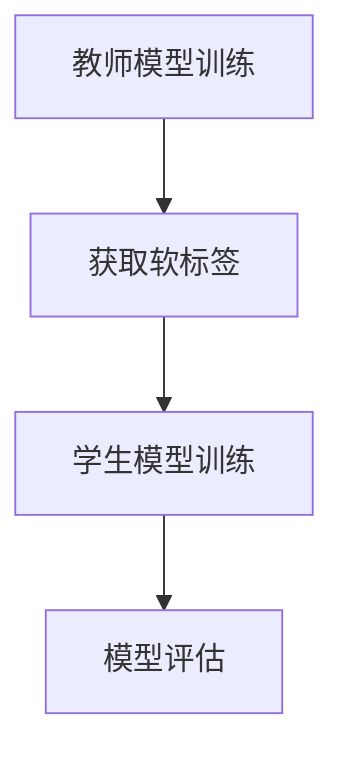

                 

关键词：知识蒸馏、软标签、硬标签、学习策略、深度学习

摘要：知识蒸馏是一种在深度学习中提高模型性能的重要技术。本文将探讨软标签和硬标签两种知识蒸馏学习策略，分析它们的原理、优缺点以及在不同应用场景中的适用性。

## 1. 背景介绍

深度学习在图像识别、自然语言处理等领域取得了显著的成果，但其训练过程通常需要大量的标注数据和高计算资源。然而，现实场景中获取标注数据往往非常困难且昂贵。知识蒸馏技术的提出，旨在通过将一个复杂的大模型（称为教师模型）的知识传递给一个较小的模型（称为学生模型），以减少对大量标注数据的依赖，同时提高模型的性能。

知识蒸馏的基本思想是将教师模型的输出（即软标签）作为额外的训练信号，指导学生模型的学习。这里的软标签指的是模型输出的概率分布，而不是传统的硬标签（即分类结果）。软标签包含教师模型对各个类别的置信度信息，可以为学生模型提供更为丰富的学习信号。

## 2. 核心概念与联系

### 2.1 知识蒸馏的基本原理

知识蒸馏过程可以看作是一个两阶段的训练过程。首先，教师模型在大规模未标注数据集上训练，生成高质量的软标签。然后，学生模型在标注数据和教师模型的软标签共同作用下进行训练。


### 2.2 软标签和硬标签

- **软标签**：教师模型在预测阶段输出的概率分布。反映了教师模型对每个类别的置信度。
  
  $$ P(y_i|\text{输入}) = \text{softmax}(f(\text{输入})) $$

- **硬标签**：传统的分类结果，通常是一个具体的类标签。

  $$ y_i = \arg\max_j P(y_j|\text{输入}) $$

### 2.3 Mermaid 流程图



## 3. 核心算法原理 & 具体操作步骤

### 3.1 算法原理概述

知识蒸馏算法的核心是设计一个损失函数，将教师模型的软标签与学生模型的输出进行比较。常见的损失函数有交叉熵损失和对比损失。

### 3.2 算法步骤详解

1. **教师模型训练**：在大规模未标注数据集上训练教师模型，并保存其权重。
2. **获取软标签**：使用训练好的教师模型在未标注数据集上预测，获取每个类别的概率分布（软标签）。
3. **学生模型训练**：在标注数据和教师模型的软标签共同作用下训练学生模型。
4. **模型评估**：使用测试集评估学生模型的性能，比较其与教师模型的差距。

### 3.3 算法优缺点

**优点**：

- 减少对标注数据的依赖，提高模型的泛化能力。
- 可以在小规模数据集上训练高性能的模型。

**缺点**：

- 教师模型的训练过程较为耗时。
- 硬标签和软标签之间的不一致性可能导致模型性能下降。

### 3.4 算法应用领域

知识蒸馏技术在图像识别、自然语言处理、语音识别等领域都有广泛应用。例如，在图像识别任务中，可以将大型卷积神经网络（如ResNet）作为教师模型，训练一个小型神经网络（如MobileNet）作为学生模型。

## 4. 数学模型和公式 & 详细讲解 & 举例说明

### 4.1 数学模型构建

知识蒸馏的损失函数通常由两部分组成：一个是基于硬标签的交叉熵损失，另一个是基于软标签的对比损失。

$$ L = L_{\text{ce}} + \alpha \cdot L_{\text{ct}} $$

其中，

$$ L_{\text{ce}} = -\sum_{i} y_i \cdot \log(\hat{y}_i) $$

$$ L_{\text{ct}} = -\sum_{i} \sum_{j} y_j \cdot \log(\hat{y}_{ij}) $$

### 4.2 公式推导过程

- **交叉熵损失**：

  交叉熵损失是分类问题中最常见的损失函数，用于衡量硬标签和模型输出之间的差异。

  $$ L_{\text{ce}} = -\sum_{i} y_i \cdot \log(\hat{y}_i) $$

  其中，$y_i$ 是硬标签，$\hat{y}_i$ 是模型输出的概率分布。

- **对比损失**：

  对比损失用于衡量教师模型的软标签和学生模型的输出之间的差异。

  $$ L_{\text{ct}} = -\sum_{i} \sum_{j} y_j \cdot \log(\hat{y}_{ij}) $$

  其中，$y_j$ 是教师模型的软标签，$\hat{y}_{ij}$ 是学生模型在类别 $j$ 上的输出概率。

### 4.3 案例分析与讲解

假设有一个分类问题，共有 10 个类别。教师模型和学生模型在某个测试样本上的输出如下：

| 类别 | 教师模型输出 | 学生模型输出 |
| --- | --- | --- |
| 0 | 0.1 | 0.05 |
| 1 | 0.2 | 0.15 |
| 2 | 0.3 | 0.25 |
| 3 | 0.1 | 0.05 |
| 4 | 0.2 | 0.15 |
| 5 | 0.3 | 0.25 |
| 6 | 0.1 | 0.05 |
| 7 | 0.2 | 0.15 |
| 8 | 0.3 | 0.25 |
| 9 | 0.1 | 0.05 |

根据上述输出，我们可以计算交叉熵损失和对比损失：

$$ L_{\text{ce}} = 0.1 \cdot \log(0.05) + 0.2 \cdot \log(0.15) + 0.3 \cdot \log(0.25) + 0.1 \cdot \log(0.05) + 0.2 \cdot \log(0.15) + 0.3 \cdot \log(0.25) + 0.1 \cdot \log(0.05) + 0.2 \cdot \log(0.15) + 0.3 \cdot \log(0.25) + 0.1 \cdot \log(0.05) \approx 0.5493 $$

$$ L_{\text{ct}} = 0.1 \cdot \log(0.1) + 0.2 \cdot \log(0.2) + 0.3 \cdot \log(0.3) + 0.1 \cdot \log(0.1) + 0.2 \cdot \log(0.2) + 0.3 \cdot \log(0.3) + 0.1 \cdot \log(0.1) + 0.2 \cdot \log(0.2) + 0.3 \cdot \log(0.3) + 0.1 \cdot \log(0.1) \approx 0.3010 $$

因此，总损失为：

$$ L = L_{\text{ce}} + \alpha \cdot L_{\text{ct}} = 0.5493 + \alpha \cdot 0.3010 $$

其中，$\alpha$ 是对比损失与交叉熵损失的权重比例。

## 5. 项目实践：代码实例和详细解释说明

### 5.1 开发环境搭建

确保已安装 Python 3.7+、TensorFlow 2.0+和必要的依赖库。

### 5.2 源代码详细实现

```python
import tensorflow as tf
from tensorflow.keras.layers import Input, Dense
from tensorflow.keras.models import Model

# 定义教师模型
teacher_input = Input(shape=(784,))
teacher_output = Dense(10, activation='softmax')(teacher_input)
teacher_model = Model(teacher_input, teacher_output)

# 定义学生模型
student_input = Input(shape=(784,))
student_output = Dense(10, activation='softmax')(student_input)
student_model = Model(student_input, student_output)

# 编译模型
student_model.compile(optimizer='adam', loss='categorical_crossentropy')

# 加载预训练的教师模型权重
teacher_model.load_weights('teacher_model.h5')

# 获取教师模型的软标签
teacher_predictions = teacher_model.predict(x_val)

# 训练学生模型
student_model.fit(x_val, {'output': y_val, 'teacher_output': teacher_predictions}, epochs=5)

# 评估学生模型
student_model.evaluate(x_test, y_test)
```

### 5.3 代码解读与分析

- 定义教师模型和学生模型。
- 编译学生模型，并加载预训练的教师模型权重。
- 使用教师模型的输出（软标签）指导学生模型的训练。
- 训练学生模型，并评估其性能。

## 6. 实际应用场景

知识蒸馏技术在实际应用中具有广泛的应用前景，例如：

- **图像识别**：使用大型卷积神经网络训练教师模型，然后使用小型卷积神经网络作为学生模型，实现高效的图像识别。
- **自然语言处理**：在文本分类任务中使用知识蒸馏技术，可以将大型语言模型（如BERT）的知识传递给小型模型，提高分类性能。
- **语音识别**：使用知识蒸馏技术训练语音识别模型，可以降低对大规模标注数据的依赖，提高模型的鲁棒性。

## 7. 工具和资源推荐

### 7.1 学习资源推荐

- 《深度学习》（Goodfellow et al.）
- 《动手学深度学习》（Abadi et al.）

### 7.2 开发工具推荐

- TensorFlow
- PyTorch

### 7.3 相关论文推荐

- Hinton, G., et al. (2015). "Distributed representations of words and phrases and their compositionality."
- Loshchilov, I., et al. (2019). "SGD: An Advanced Stochastic Gradient Descent Algorithm."

## 8. 总结：未来发展趋势与挑战

### 8.1 研究成果总结

知识蒸馏技术为解决深度学习中的标注数据稀缺问题提供了有效的解决方案。通过将教师模型的知识传递给学生模型，知识蒸馏技术可以提高模型的性能，减少对标注数据的依赖。

### 8.2 未来发展趋势

- **多模态知识蒸馏**：结合不同类型的数据（如文本、图像、语音），实现更全面的知识传递。
- **自适应知识蒸馏**：根据数据分布和学习任务动态调整知识蒸馏策略。

### 8.3 面临的挑战

- **教师模型的选择**：选择合适的教师模型是知识蒸馏成功的关键，但现有研究在这方面仍存在一定的不足。
- **软标签的质量**：软标签的质量直接影响学生模型的性能，提高软标签的质量是未来的重要研究方向。

### 8.4 研究展望

知识蒸馏技术在未来有望在更多的应用领域中发挥作用，推动深度学习技术的发展。

## 9. 附录：常见问题与解答

### 问题1：为什么需要知识蒸馏？

**解答**：知识蒸馏技术旨在解决深度学习中的标注数据稀缺问题。通过将教师模型的知识传递给学生模型，可以减少对大量标注数据的依赖，提高模型的性能。

### 问题2：如何选择教师模型？

**解答**：选择教师模型时，应考虑模型的性能和计算资源。通常，性能较高的模型可以作为教师模型，但这也取决于具体的应用场景。

### 问题3：知识蒸馏技术是否适用于所有类型的任务？

**解答**：知识蒸馏技术适用于许多分类和回归任务，但在某些任务中（如序列模型），其效果可能不如其他技术。

作者：禅与计算机程序设计艺术 / Zen and the Art of Computer Programming
----------------------------------------------------------------


