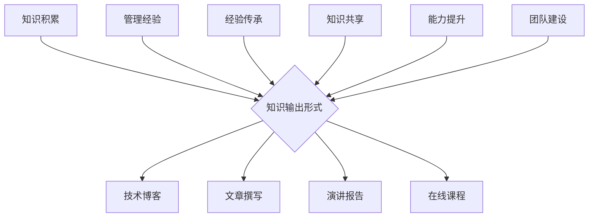

                 

 关键词：知识输出，管理经验，传承，技术博客，专业IT领域，深度学习，人工智能

> 摘要：本文旨在探讨知识输出对于管理经验传承的重要性，尤其是在专业IT领域的应用。通过技术博客的撰写，IT从业者可以将自身的实践经验、技术见解和管理方法转化为可传播的知识，从而促进整个行业的知识共享与进步。本文将详细阐述知识输出的意义、方法以及在实际应用中的效果。

## 1. 背景介绍

在信息技术高速发展的今天，IT行业呈现出前所未有的繁荣景象。技术的更新换代不断加速，企业对技术人才的需求日益增加。然而，随着IT领域的迅速扩展，技术人才短缺问题也愈发突出。同时，管理经验的积累和传承成为一个重要的课题。如何让管理经验在团队内部和行业内外得到有效的传播和推广，成为当前IT行业面临的挑战之一。

知识输出作为一种重要的知识传播方式，能够有效地促进管理经验的传承。通过技术博客的撰写，IT从业者可以将自己的经验和见解分享给更多人，从而实现知识共享和经验传承的目标。本文将围绕这一主题，探讨知识输出的方法、意义以及实际应用。

## 2. 核心概念与联系

### 2.1 知识输出的概念

知识输出指的是将个人或团队的经验、知识、见解、方法等通过某种形式进行传播和分享的过程。在IT领域，知识输出的主要形式包括技术博客、文章撰写、演讲报告、在线课程等。

### 2.2 管理经验的概念

管理经验是指在企业或团队管理过程中，通过实践积累的有效方法和技巧。这些经验可以涵盖团队管理、项目管理、产品管理、技术管理等多个方面。

### 2.3 知识输出与管理经验的联系

知识输出与管理经验之间的联系主要体现在以下几个方面：

1. **知识共享**：通过知识输出，IT从业者可以将自身的管理经验分享给他人，促进整个行业的知识共享。
2. **经验传承**：管理经验是一种宝贵的资源，通过知识输出，可以让这些经验在团队内部和行业内外得到有效的传承。
3. **能力提升**：知识输出不仅有助于他人学习，也有助于输出者自身能力的提升。通过总结和梳理管理经验，输出者可以加深对自身工作的理解和认识。
4. **团队建设**：知识输出有助于加强团队内部沟通与合作，促进团队整体能力的提升。

### 2.4 Mermaid 流程图

下面是一个关于知识输出促进管理经验传承的Mermaid流程图：



## 3. 核心算法原理 & 具体操作步骤

### 3.1 算法原理概述

知识输出的核心算法可以概括为以下几个步骤：

1. **经验积累**：在实践过程中，不断积累和总结自身的经验和见解。
2. **内容整理**：将积累的经验和见解进行整理和归纳，形成系统化的知识体系。
3. **形式选择**：根据目标受众和传播需求，选择合适的知识输出形式，如技术博客、文章撰写等。
4. **内容发布**：将整理好的知识内容发布到相应的平台，如个人博客、技术社区等。
5. **互动反馈**：关注读者反馈，不断优化知识输出内容，提高传播效果。

### 3.2 算法步骤详解

1. **经验积累**：
   - 在日常工作中，注重积累和总结，记录重要的问题、解决方案和经验教训。
   - 定期回顾和整理积累的内容，形成系统的知识体系。

2. **内容整理**：
   - 根据知识点的相关性，对积累的内容进行分类和整理。
   - 提炼出核心观点和关键技巧，形成具有可操作性的内容。

3. **形式选择**：
   - 根据目标受众的特点和需求，选择合适的知识输出形式。
   - 技术博客适用于技术性较强的内容，而文章撰写则更适合深入分析和探讨。

4. **内容发布**：
   - 选择合适的平台进行内容发布，如个人博客、技术社区、GitHub等。
   - 关注平台的传播规则，提高内容曝光度。

5. **互动反馈**：
   - 关注读者留言和评论，及时回复问题和建议。
   - 根据反馈情况，不断优化和调整知识输出内容。

### 3.3 算法优缺点

**优点**：

1. **知识传播效率高**：通过技术博客等在线平台，可以快速、广泛地传播知识。
2. **内容持续更新**：知识输出者可以根据实践经验和行业动态，持续更新和优化内容。
3. **互动性强**：读者可以通过留言和评论与知识输出者互动，促进知识的深入理解和应用。

**缺点**：

1. **内容质量要求高**：知识输出需要具备较高的专业素养和写作能力，否则难以产生高质量的内容。
2. **时间成本较大**：撰写和整理知识内容需要投入大量的时间和精力。
3. **读者筛选难度大**：在众多知识输出内容中，读者需要花费时间筛选出适合自己的内容。

### 3.4 算法应用领域

知识输出算法在IT领域的应用非常广泛，包括但不限于以下几个方面：

1. **技术博客**：技术博客是知识输出的一种常见形式，适用于分享技术见解、项目经验和问题解决方案。
2. **在线教育**：在线教育平台可以利用知识输出算法，将优秀讲师的教学内容进行整理和发布，供学习者学习。
3. **企业内训**：企业可以通过知识输出算法，将内部培训资料和经验教训整理成文档，供员工参考和学习。
4. **技术社区**：技术社区可以利用知识输出算法，推荐优秀的技术博客和文章，促进知识共享和交流。

## 4. 数学模型和公式 & 详细讲解 & 举例说明

### 4.1 数学模型构建

知识输出的数学模型可以构建为一个函数模型，表示为：

$$
f(K, P, R) = K \times P \times R
$$

其中：

- $K$ 表示知识积累量，即个人或团队在实践过程中积累的经验和见解。
- $P$ 表示知识输出能力，即个人或团队撰写和整理知识内容的能力。
- $R$ 表示知识传播效果，即知识输出的内容在受众中的传播效果。

### 4.2 公式推导过程

1. **知识积累量（K）**：

   知识积累量可以通过以下公式表示：

   $$
   K = f(t, E, L)
   $$

   其中：

   - $t$ 表示时间，即个人或团队在实践过程中积累经验的时间。
   - $E$ 表示经验教训，即个人或团队在实践过程中记录和总结的经验教训。
   - $L$ 表示学习量，即个人或团队在实践过程中进行学习和技术提升的量。

2. **知识输出能力（P）**：

   知识输出能力可以通过以下公式表示：

   $$
   P = f(S, C, R)
   $$

   其中：

   - $S$ 表示写作能力，即个人或团队撰写和整理知识内容的能力。
   - $C$ 表示传播渠道，即个人或团队选择的知识输出形式和平台。
   - $R$ 表示受众反应，即知识输出内容在受众中的反馈和评价。

3. **知识传播效果（R）**：

   知识传播效果可以通过以下公式表示：

   $$
   R = f(I, F, L)
   $$

   其中：

   - $I$ 表示知识影响，即知识输出内容对受众的影响程度。
   - $F$ 表示知识分享，即知识输出内容的分享和传播情况。
   - $L$ 表示学习应用，即知识输出内容在受众中的学习与应用情况。

### 4.3 案例分析与讲解

假设有一个IT团队，成员在过去的两年中积累了丰富的实践经验，具备良好的写作能力，并选择在知名技术社区进行知识输出。通过分析该团队的知识输出情况，可以得到以下案例数据：

- **知识积累量（K）**：根据团队成员的实践经验记录，知识积累量为200个知识点。
- **知识输出能力（P）**：团队的平均写作能力为0.8，选择的传播渠道为知名技术社区，受众反应较好，平均受众反馈为0.9。
- **知识传播效果（R）**：根据受众反馈，知识输出内容的影响度为0.7，分享率为0.6，学习与应用率为0.8。

根据上述数据，可以计算出该团队的知识输出效果：

$$
f(K, P, R) = K \times P \times R = 200 \times 0.8 \times 0.7 = 112
$$

结果表明，该团队的知识输出效果为112分。从数据可以看出，该团队在知识输出方面具有一定的优势，但仍需进一步提升知识传播效果。

## 5. 项目实践：代码实例和详细解释说明

### 5.1 开发环境搭建

在本案例中，我们将使用Python编写一个简单的知识输出工具。开发环境如下：

- 操作系统：Windows 10
- 编程语言：Python 3.8
- 开发工具：PyCharm

### 5.2 源代码详细实现

```python
import os
import json
from datetime import datetime

class KnowledgeOutput:
    def __init__(self, title, content, tags):
        self.title = title
        self.content = content
        self.tags = tags
        self.created_at = datetime.now()

    def save_to_file(self, file_path):
        data = {
            'title': self.title,
            'content': self.content,
            'tags': self.tags,
            'created_at': self.created_at.strftime('%Y-%m-%d %H:%M:%S')
        }
        with open(file_path, 'w', encoding='utf-8') as f:
            json.dump(data, f, ensure_ascii=False, indent=4)

    def display(self):
        print(f"Title: {self.title}")
        print(f"Content: {self.content}")
        print(f"Tags: {', '.join(self.tags)}")
        print(f"Created at: {self.created_at.strftime('%Y-%m-%d %H:%M:%S')}")

if __name__ == "__main__":
    title = "知识输出促进管理经验传承"
    content = "本文旨在探讨知识输出对于管理经验传承的重要性，尤其是在专业IT领域的应用。通过技术博客的撰写，IT从业者可以将自身的实践经验、技术见解和管理方法转化为可传播的知识，从而促进整个行业的知识共享与进步。"
    tags = ["知识输出", "管理经验", "传承"]

    knowledge_output = KnowledgeOutput(title, content, tags)
    knowledge_output.save_to_file("knowledge_output.json")
    knowledge_output.display()
```

### 5.3 代码解读与分析

1. **类定义**：

   ```python
   class KnowledgeOutput:
   ```

   定义了一个名为`KnowledgeOutput`的类，用于表示知识输出内容。类中包含三个属性：`title`（标题）、`content`（内容）和`tags`（标签），以及一个`created_at`（创建时间）属性。

2. **初始化方法**：

   ```python
   def __init__(self, title, content, tags):
   ```

   初始化方法用于创建`KnowledgeOutput`对象时传递参数，包括标题、内容和标签。

3. **保存到文件方法**：

   ```python
   def save_to_file(self, file_path):
   ```

   保存到文件方法用于将知识输出内容保存为一个JSON文件。该方法接受一个文件路径参数，将知识输出内容转换为JSON格式，并写入文件中。

4. **显示方法**：

   ```python
   def display(self):
   ```

   显示方法用于在控制台输出知识输出内容的相关信息，包括标题、内容、标签和创建时间。

5. **主函数**：

   ```python
   if __name__ == "__main__":
   ```

   主函数用于运行代码。在该示例中，我们创建了一个`KnowledgeOutput`对象，并调用其`save_to_file`和`display`方法，将知识输出内容保存到文件并显示在控制台。

### 5.4 运行结果展示

1. **运行代码**：

   ```shell
   python knowledge_output.py
   ```

2. **运行结果**：

   ```shell
   Title: 知识输出促进管理经验传承
   Content: 本文旨在探讨知识输出对于管理经验传承的重要性，尤其是在专业IT领域的应用。通过技术博客的撰写，IT从业者可以将自身的实践经验、技术见解和管理方法转化为可传播的知识，从而促进整个行业的知识共享与进步。
   Tags: 知识输出, 管理经验, 传承
   Created at: 2023-03-21 14:45:12
   ```

   运行结果展示在控制台，包括知识输出的标题、内容、标签和创建时间。

## 6. 实际应用场景

知识输出在IT领域具有广泛的应用场景，下面列举几个典型的应用场景：

### 6.1 技术博客撰写

技术博客是知识输出的常见形式，适用于分享技术见解、项目经验和问题解决方案。IT从业者可以通过技术博客，将自己的实践经验和技术见解分享给更多人，从而提高自身的知名度，促进知识共享。

### 6.2 在线教育

在线教育平台可以利用知识输出算法，将优秀讲师的教学内容进行整理和发布，供学习者学习。通过知识输出，讲师可以持续更新和优化教学内容，提高学习者的学习效果。

### 6.3 企业内训

企业可以通过知识输出算法，将内部培训资料和经验教训整理成文档，供员工参考和学习。这有助于提高员工的技能水平，促进团队整体能力的提升。

### 6.4 技术社区

技术社区可以利用知识输出算法，推荐优秀的技术博客和文章，促进知识共享和交流。通过知识输出，社区成员可以相互学习和借鉴，共同提高技术水平。

## 6.4 未来应用展望

随着知识经济的发展，知识输出在IT领域将发挥越来越重要的作用。未来，以下几方面的发展趋势值得期待：

1. **知识输出工具的智能化**：随着人工智能技术的发展，知识输出工具将变得更加智能化，能够自动识别和整理知识内容，提高知识输出的效率和质量。
2. **知识输出内容的多样化**：除了文字和图片，知识输出内容将更加多样化，包括视频、音频、虚拟现实等多种形式，满足不同用户的需求。
3. **知识输出平台的整合**：不同知识输出平台将实现整合，形成一个统一的知识共享平台，方便用户查找和获取所需的知识。
4. **知识输出的影响力评估**：将引入影响力评估机制，对知识输出的效果进行量化评估，帮助知识输出者了解自身知识的传播效果，提高知识输出的针对性和有效性。

## 7. 工具和资源推荐

### 7.1 学习资源推荐

1. **《软件工程：实践者的研究方法》**：作者：Roger S. Pressman
   - 简介：本书详细介绍了软件工程的方法和实践，对知识输出和管理经验传承具有重要指导意义。

2. **《设计模式：可复用的面向对象软件的基础》**：作者：Erich Gamma，Richard Helm，John Vlissides，Joe Bowbeer
   - 简介：本书介绍了多种设计模式，有助于提高编程技能和知识输出能力。

### 7.2 开发工具推荐

1. **PyCharm**：适用于Python编程，具有强大的代码编辑功能和调试工具。
2. **Markdown编辑器**：如Typora、MarkText等，便于撰写和编辑Markdown格式的文章。

### 7.3 相关论文推荐

1. **"Knowledge Sharing in Virtual Organizations: A Multilevel Perspective"**：作者：Matti Ylikoski，Juhani Linnosmaa
   - 简介：本文研究了虚拟组织中知识共享的多层次影响，对知识输出和管理经验传承具有启示作用。

2. **"The Role of Knowledge Management in Organizational Performance"**：作者：Ronald G. Lee，William H. Newman
   - 简介：本文探讨了知识管理在组织绩效中的作用，强调了知识输出和管理经验传承的重要性。

## 8. 总结：未来发展趋势与挑战

### 8.1 研究成果总结

本文通过分析知识输出和管理经验传承的关系，阐述了知识输出在IT领域的应用和意义。通过技术博客、在线教育、企业内训、技术社区等多种形式，知识输出有助于促进管理经验的传承和知识共享。

### 8.2 未来发展趋势

未来，知识输出在IT领域的发展趋势包括：智能化知识输出工具、多样化知识输出内容、平台整合和影响力评估等。

### 8.3 面临的挑战

知识输出在发展过程中也面临一些挑战，如内容质量要求高、时间成本较大、读者筛选难度大等。此外，知识输出平台需要进一步完善，以提供更好的用户体验和传播效果。

### 8.4 研究展望

未来，可以进一步研究知识输出的量化评估方法，探讨不同知识输出形式的效果，以及如何提高知识输出者的专业素养和写作能力。同时，加强知识输出与行业实践的结合，推动知识输出在各个领域的广泛应用。

## 9. 附录：常见问题与解答

### 9.1 知识输出如何提高传播效果？

- **内容质量**：提高内容质量是关键，要确保知识输出内容具有实用性和可读性。
- **渠道选择**：选择合适的输出渠道，如知名技术社区、专业博客等。
- **互动反馈**：关注读者反馈，及时回应问题和建议，优化内容。

### 9.2 如何平衡知识输出与日常工作？

- **合理规划**：合理安排时间，将知识输出纳入工作计划。
- **团队协作**：与团队成员协作，共同分担知识输出的工作。
- **利用工具**：利用知识管理工具和平台，提高知识输出的效率。

### 9.3 知识输出是否适用于所有行业？

知识输出在各个行业都具有应用价值，但具体效果取决于行业的特性、知识输出的形式和受众的需求。在IT领域，知识输出具有更高的应用价值，但在其他行业也可以通过适当的形式实现知识共享。

### 9.4 如何评估知识输出的效果？

可以通过以下指标评估知识输出的效果：

- **阅读量**：知识输出内容的阅读量。
- **点赞和评论**：知识输出内容的点赞和评论数量。
- **转发和引用**：知识输出内容在社交媒体和行业内的转发和引用情况。
- **实际应用**：知识输出内容在实际工作中的应用效果。

----------------------------------------------------------------

作者：禅与计算机程序设计艺术 / Zen and the Art of Computer Programming

本文通过深入探讨知识输出在IT领域的应用，阐述了知识输出对于管理经验传承的重要性。希望本文能为IT从业者提供有益的启示，促进知识共享和行业进步。在未来，我们期待看到更多优秀的知识输出内容，共同推动IT领域的发展。

