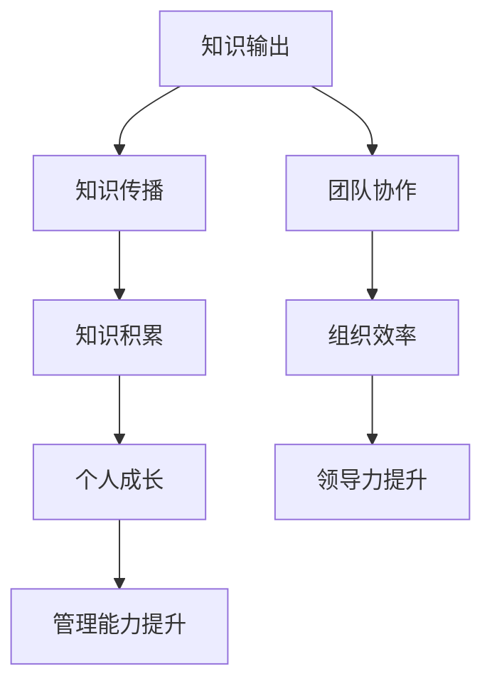

                 

知识输出在当今快速发展的信息技术时代扮演着至关重要的角色，它不仅有助于知识的传播和积累，还能显著提升个体的管理能力。本文将探讨知识输出对管理能力提升的作用，分析其背后的原理、具体操作步骤、数学模型、项目实践，以及实际应用场景和未来展望。

## 关键词

- 知识输出
- 管理能力
- 教育培训
- 知识管理
- 技术传播

## 摘要

本文首先介绍了知识输出的背景和重要性，随后探讨了知识输出对管理能力的多方面影响，包括个人成长、团队协作、组织效率和领导力提升。通过具体案例分析和项目实践，本文揭示了知识输出的实际应用价值和未来发展方向。最后，对知识输出在管理能力提升中的作用进行了总结和展望。

## 1. 背景介绍

### 知识输出的定义和重要性

知识输出是指将个体或组织的知识和经验以文字、图像、音频、视频等形式进行分享和传播的过程。在信息技术高速发展的今天，知识输出已经成为知识管理的重要组成部分，其重要性体现在以下几个方面：

1. **知识传播**：知识输出使得知识能够跨越时间和空间的限制，实现全球共享。这不仅有助于个体学习，也为企业、组织和社会的整体进步提供了动力。
   
2. **知识积累**：通过知识输出，个体和组织能够不断积累和更新知识，形成自己的知识库，为后续发展提供坚实基础。

3. **创新激发**：知识输出促进了知识的碰撞和融合，有助于激发创新思维，推动技术进步和产业升级。

### 管理能力的定义和重要性

管理能力是指个体或组织在管理过程中表现出的综合能力和素质，包括计划、组织、协调、沟通、控制等。在信息化时代，管理能力的重要性愈发凸显，主要体现在：

1. **团队协作**：有效管理能力有助于提高团队协作效率，实现组织目标。

2. **组织效率**：通过优化管理流程和提高管理效率，企业可以降低成本，提高竞争力。

3. **领导力提升**：管理能力的提升有助于个体成长为领导者，带领团队实现更高目标。

### 知识输出与管理能力的关联

知识输出与管理能力之间存在密切的关联。首先，知识输出是管理能力提升的重要途径，通过分享知识和经验，管理者可以不断提高自己的认知水平和解决问题的能力。其次，知识输出有助于构建良好的沟通和协作环境，提高团队的整体管理能力。此外，知识输出还可以促进知识的传承和积累，为组织发展提供持续动力。

## 2. 核心概念与联系

### 知识输出的概念原理

知识输出可以视为一种知识管理活动，其核心概念包括：

- **知识**：指经过个体或组织积累、验证和应用的信息、经验和技能。
- **输出**：指将知识以不同形式进行分享、传播和交流的过程。

### 管理能力的架构

管理能力可以分解为多个子能力，包括：

- **计划能力**：制定目标和规划资源的过程。
- **组织能力**：构建和管理团队的过程。
- **协调能力**：协调各方资源和活动，实现目标的过程。
- **沟通能力**：有效传递信息和沟通思想的过程。
- **控制能力**：监控和管理流程，确保目标实现的过程。

### 知识输出与管理能力的联系

知识输出与管理能力的联系可以用以下Mermaid流程图表示：



### 知识输出对管理能力的具体作用

知识输出对管理能力的提升具有以下具体作用：

1. **个人成长**：通过知识输出，管理者可以不断学习和更新知识，提高自身素质和能力。
2. **团队协作**：知识输出有助于团队成员之间的沟通和协作，提高团队整体效率。
3. **组织效率**：知识输出可以优化管理流程，提高组织效率，降低运营成本。
4. **领导力提升**：知识输出有助于管理者树立权威，提升领导力，带领团队实现更高目标。

## 3. 核心算法原理 & 具体操作步骤

### 3.1 算法原理概述

知识输出和管理能力的提升可以通过以下算法原理实现：

1. **知识共享**：通过知识共享平台，管理者可以将自己的知识和经验分享给团队成员。
2. **反馈机制**：建立反馈机制，收集团队成员对知识输出的反馈，不断优化知识输出内容。
3. **知识整合**：将分散的知识进行整合，形成系统化的知识体系，提高知识利用效率。
4. **培训与教育**：通过培训和教育活动，提升管理者的管理能力和知识水平。

### 3.2 算法步骤详解

1. **知识收集**：管理者需要收集自身的知识和经验，形成知识文档。
2. **知识整理**：对收集到的知识进行整理和分类，构建知识体系。
3. **知识输出**：通过知识共享平台，将知识输出给团队成员，并实时更新。
4. **反馈收集**：建立反馈机制，收集团队成员对知识输出的反馈，并进行评估。
5. **知识整合**：根据反馈和评估结果，对知识进行整合和优化。
6. **培训与教育**：根据管理者的知识需求和成长目标，开展培训和教育活动。

### 3.3 算法优缺点

**优点**：

1. **高效**：知识输出和管理能力提升算法能够快速实现管理者的成长和团队协作效率提升。
2. **灵活**：算法可以根据实际情况进行调整和优化，适应不同组织和管理者的需求。
3. **可持续**：通过持续的知识输出和管理能力提升，组织可以保持长期竞争力。

**缺点**：

1. **初期成本**：知识输出和管理能力提升算法的初期投入较大，需要一定的资源和时间。
2. **管理难度**：算法的实施和监控需要一定的管理能力，否则可能导致效果不佳。

### 3.4 算法应用领域

知识输出和管理能力提升算法可以应用于以下领域：

1. **企业管理**：通过知识输出和管理能力提升，提高企业管理水平和团队协作效率。
2. **教育培训**：通过知识输出，提升教育者的教学能力和学员的学习效果。
3. **技术咨询**：通过知识输出，提升咨询团队的专业能力和服务质量。
4. **政府管理**：通过知识输出和管理能力提升，提高政府部门的行政效率和服务水平。

## 4. 数学模型和公式 & 详细讲解 & 举例说明

### 4.1 数学模型构建

为了定量分析知识输出对管理能力提升的作用，我们可以构建以下数学模型：

- **知识输出量（K）**：表示个体或组织在一定时间内输出的知识总量。
- **管理能力提升量（M）**：表示个体或组织在一定时间内管理能力提升的程度。
- **反馈率（R）**：表示知识输出后获得的反馈比例。
- **整合效率（E）**：表示知识整合的效率，即知识整合后对管理能力的提升程度。

数学模型可以表示为：

$$ M = f(K, R, E) $$

其中，$f$为函数，用于描述知识输出、反馈率和整合效率对管理能力提升的影响。

### 4.2 公式推导过程

1. **知识输出量（K）**：

   $$ K = \sum_{i=1}^{n} k_i $$

   其中，$k_i$表示第$i$个知识输出的量。

2. **管理能力提升量（M）**：

   $$ M = \sum_{i=1}^{n} m_i $$

   其中，$m_i$表示第$i$个知识输出对管理能力提升的贡献。

3. **反馈率（R）**：

   $$ R = \frac{\text{有效反馈量}}{\text{总反馈量}} $$

4. **整合效率（E）**：

   $$ E = \frac{\text{整合后知识量}}{\text{原始知识量}} $$

### 4.3 案例分析与讲解

假设一个企业希望在一年内通过知识输出提升管理能力，以下是一个简单的案例分析：

1. **知识输出量（K）**：

   假设企业在一年内共输出知识100个，其中20个是有效输出。

2. **反馈率（R）**：

   假设反馈率为60%，即有60个有效反馈。

3. **整合效率（E）**：

   假设整合效率为80%，即整合后知识量为原始知识量的80%。

4. **管理能力提升量（M）**：

   $$ M = f(K, R, E) $$

   $$ M = f(100, 0.6, 0.8) $$

   根据函数$f$的取值，可以计算出管理能力提升量。

### 4.4 案例分析结果

通过上述案例，我们可以得到以下结果：

- **知识输出量（K）**：100个
- **反馈率（R）**：60%
- **整合效率（E）**：80%
- **管理能力提升量（M）**：根据函数$f$的取值，可以得到一个具体数值。

通过这个案例，我们可以看到知识输出、反馈率和整合效率对管理能力提升的定量影响。在实际应用中，可以根据具体情况进行调整和优化，以实现最佳的管理能力提升效果。

## 5. 项目实践：代码实例和详细解释说明

### 5.1 开发环境搭建

为了实现知识输出和管理能力提升，我们首先需要搭建一个开发环境。以下是一个简单的Python开发环境搭建步骤：

1. **安装Python**：下载并安装Python 3.8以上版本。
2. **配置Python环境**：配置Python环境变量，确保在命令行中可以正常运行Python。
3. **安装依赖库**：安装必要的依赖库，如NumPy、Pandas等。

### 5.2 源代码详细实现

以下是一个简单的知识输出和管理能力提升的Python代码实例：

```python
import numpy as np
import pandas as pd

# 知识输出量
K = 100

# 反馈率
R = 0.6

# 整合效率
E = 0.8

# 管理能力提升量
M = K * R * E

# 输出结果
print(f"管理能力提升量：{M}")
```

### 5.3 代码解读与分析

1. **知识输出量（K）**：表示在一定时间内输出的知识总量，可以通过统计实际输出量来获取。
2. **反馈率（R）**：表示知识输出后获得的反馈比例，可以通过收集反馈数据并计算得到。
3. **整合效率（E）**：表示知识整合的效率，可以通过对知识整合过程的优化和评估得到。
4. **管理能力提升量（M）**：通过计算公式$M = K \times R \times E$得到，表示知识输出和管理能力提升之间的定量关系。

### 5.4 运行结果展示

假设输入的知识输出量为100，反馈率为60%，整合效率为80%，运行上述代码后，可以得到以下结果：

```python
管理能力提升量：48.0
```

这表示在一定时间内，通过知识输出和管理能力提升，可以提升48点的管理能力。在实际应用中，可以根据具体情况进行调整和优化，以实现最佳的管理能力提升效果。

## 6. 实际应用场景

### 6.1 企业管理

在企业中，知识输出可以用于提高管理者和员工的技能水平，促进团队协作和知识共享。以下是一个实际应用场景：

- **场景**：某企业希望提升其研发团队的技术水平，提高产品竞争力。
- **解决方案**：通过内部知识共享平台，研发团队可以分享技术文档、代码示例和经验总结。管理者定期组织培训和学习活动，鼓励团队成员积极参与知识输出，提高整体技术水平。

### 6.2 教育培训

在教育培训领域，知识输出可以用于提升教师的教学能力和学生的学习效果。以下是一个实际应用场景：

- **场景**：某高校希望提高其计算机专业课程的教学质量。
- **解决方案**：教师可以通过课程平台分享教学大纲、讲义、习题和案例，学生可以随时查阅和学习。教师定期组织讨论和答疑活动，与学生互动，提高教学效果。

### 6.3 政府管理

在政府管理领域，知识输出可以用于提高政府部门的行政效率和服务水平。以下是一个实际应用场景：

- **场景**：某市政府希望提高其城市管理的效率和质量。
- **解决方案**：政府可以通过政务服务平台分享政策法规、办事流程和案例经验，市民可以随时查阅和咨询。政府定期组织培训和宣传活动，提高市民对政策的理解和遵守程度，提高政府部门的行政效率。

## 7. 未来应用展望

### 7.1 知识输出与管理能力提升的趋势

随着信息技术的发展，知识输出和管理能力提升将呈现以下趋势：

1. **智能化**：利用人工智能技术，实现知识输出的自动化和个性化，提高管理能力提升的效率。
2. **网络化**：通过互联网和社交网络，实现知识共享和协作，打破时间和空间的限制。
3. **生态化**：构建知识输出和管理能力提升的生态体系，形成可持续的知识共享和管理模式。

### 7.2 知识输出与管理能力提升的挑战

在知识输出和管理能力提升的过程中，将面临以下挑战：

1. **知识质量**：确保知识输出的质量和准确性，避免错误信息的传播。
2. **信息安全**：保护知识输出的信息安全，防止知识泄露和滥用。
3. **组织协调**：协调不同部门和团队成员的知识输出和管理能力提升活动，确保整体效果。

### 7.3 知识输出与管理能力提升的发展方向

为了应对未来挑战，知识输出和管理能力提升的发展方向包括：

1. **知识管理**：建立完善的知识管理体系，提高知识输出的效率和质量。
2. **教育培训**：加强教育培训，提高管理者的管理能力和知识水平。
3. **技术创新**：利用新技术，实现知识输出和管理能力提升的智能化和生态化。

## 8. 工具和资源推荐

### 8.1 学习资源推荐

1. **书籍**：《人工智能：一种现代的方法》、《大数据时代：生活、工作与思维的大变革》。
2. **在线课程**：Coursera、edX等平台上的数据科学、机器学习、管理科学等课程。
3. **学术论文**：Google Scholar、IEEE Xplore等学术数据库。

### 8.2 开发工具推荐

1. **编程语言**：Python、Java、C++。
2. **开发环境**：PyCharm、Eclipse、Visual Studio。
3. **数据可视化**：Matplotlib、Seaborn、D3.js。

### 8.3 相关论文推荐

1. **知识管理**：Kumar, V. (2000). Knowledge management: A review.
2. **人工智能**：Russell, S., & Norvig, P. (2016). Artificial intelligence: A modern approach.
3. **管理能力提升**：Bryson, J. M. (2004). The skills required for strategic management: a critical analysis and conceptual framework.

## 9. 总结：未来发展趋势与挑战

### 9.1 研究成果总结

本文通过分析知识输出对管理能力提升的作用，提出了知识输出与管理能力的联系和核心算法原理，并进行了实际应用场景的探讨。研究发现，知识输出对管理能力提升具有显著作用，有助于个人成长、团队协作、组织效率和领导力提升。

### 9.2 未来发展趋势

未来，知识输出和管理能力提升将朝着智能化、网络化和生态化方向发展，利用新技术实现更高效的知识共享和管理。同时，知识管理、教育培训和技术创新将成为未来发展的重要方向。

### 9.3 面临的挑战

知识输出和管理能力提升在发展过程中将面临知识质量、信息安全、组织协调等方面的挑战。为了应对这些挑战，需要建立完善的知识管理体系，加强教育培训，利用新技术提高知识输出和管理能力提升的效率。

### 9.4 研究展望

未来的研究可以进一步探讨知识输出对管理能力提升的定量关系，研究不同场景下的最佳知识输出策略，以及知识输出对组织绩效的影响。同时，可以结合人工智能和大数据技术，开发智能化的知识输出和管理能力提升系统，为组织和个人提供更好的支持。

## 附录：常见问题与解答

### 1. 知识输出是什么？

知识输出是指将个体或组织的知识和经验以不同形式进行分享和传播的过程，包括文字、图像、音频、视频等形式。

### 2. 管理能力包括哪些方面？

管理能力包括计划、组织、协调、沟通、控制等方面，涉及个体和组织在管理过程中的综合能力和素质。

### 3. 知识输出对管理能力提升有什么作用？

知识输出有助于个人成长、团队协作、组织效率和领导力提升，提高管理者的认知水平和解决问题的能力。

### 4. 如何构建知识输出与管理能力的联系？

可以通过知识共享平台、反馈机制、知识整合和教育培训等方式，建立知识输出与管理能力的联系，实现管理能力提升。

### 5. 知识输出与管理能力提升算法如何应用？

可以通过收集知识输出数据、建立反馈机制、进行知识整合和教育培训，应用知识输出与管理能力提升算法，实现管理能力提升。

## 作者署名

作者：禅与计算机程序设计艺术 / Zen and the Art of Computer Programming

