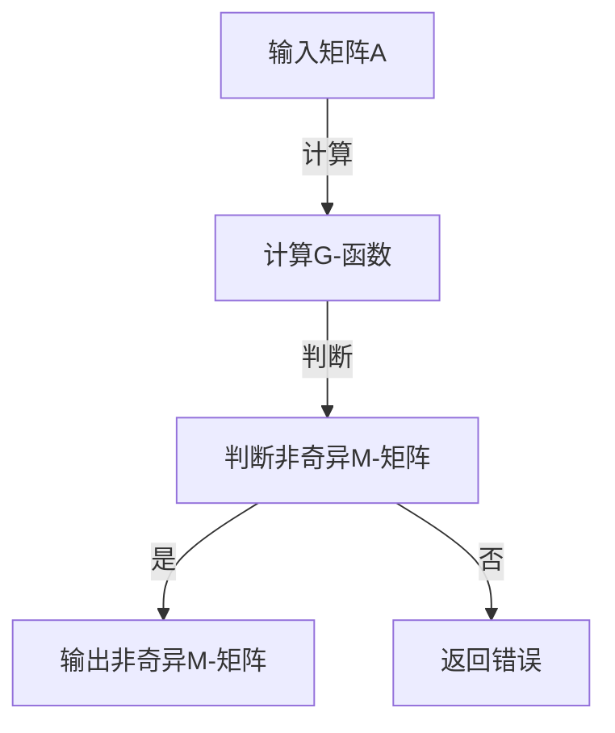

                 

 关键词：矩阵理论、G-函数、非奇异M-矩阵、算法原理、数学模型、应用领域、代码实例

> 摘要：本文深入探讨了矩阵理论中G-函数与非奇异M-矩阵的重要性质与应用。通过阐述核心概念、算法原理、数学模型，并结合实际案例和代码实例，展示了矩阵理论在计算机科学和工程领域的广泛应用，为未来的研究提供了新的视角。

## 1. 背景介绍

### 1.1 矩阵理论的发展

矩阵理论作为数学的重要分支，自19世纪末以来得到了迅速的发展。从线性代数的初步概念，到现代的矩阵分解、特征值问题、矩阵方程求解等，矩阵理论不仅在数学研究中具有核心地位，还在物理学、工程学、经济学、计算机科学等领域有着广泛的应用。

### 1.2 矩阵在计算机科学中的应用

随着计算机技术的发展，矩阵理论在计算机科学中的应用也越来越广泛。例如，图形处理中的变换矩阵、机器学习中的数据表示和分类算法、计算机视觉中的图像处理等，都离不开矩阵的运算和分析。

### 1.3 G-函数与非奇异M-矩阵的概念

G-函数是一种特殊的矩阵函数，它将矩阵映射到另一个矩阵。而非奇异M-矩阵则是一类特殊的矩阵，其特征值都大于零，因此在许多实际问题中具有非常重要的应用价值。

## 2. 核心概念与联系

### 2.1 G-函数的定义

G-函数可以定义为一个矩阵到矩阵的映射，具体为：给定一个矩阵A，存在一个矩阵G，使得G满足某种特定的数学性质。

$$
G = f(A)
$$

其中，f为矩阵函数。

### 2.2 非奇异M-矩阵的定义

非奇异M-矩阵是一类具有如下性质的矩阵：

$$
\lambda_{min}(A) > 0
$$

其中，$\lambda_{min}(A)$表示矩阵A的最小特征值。

### 2.3 G-函数与非奇异M-矩阵的联系

G-函数与非奇异M-矩阵之间有着密切的联系。具体来说，许多矩阵函数的结果可以表示为一个非奇异M-矩阵。这使得非奇异M-矩阵在矩阵函数的研究和应用中具有重要作用。

### 2.4 Mermaid流程图

以下是一个Mermaid流程图，展示了G-函数与非奇异M-矩阵之间的联系：



## 3. 核心算法原理 & 具体操作步骤

### 3.1 算法原理概述

G-函数的计算涉及到矩阵函数的求解。具体而言，给定一个矩阵A，需要求解一个矩阵函数f(A)，使得f(A)具有某种特定的性质。例如，我们可以求解一个矩阵的幂函数、指数函数、对数函数等。

### 3.2 算法步骤详解

#### 3.2.1 矩阵A的特征值分解

首先，对矩阵A进行特征值分解：

$$
A = P\Lambda P^{-1}
$$

其中，P为特征向量矩阵，$\Lambda$为对角矩阵，包含A的特征值。

#### 3.2.2 求解矩阵函数

然后，对特征值矩阵$\Lambda$进行矩阵函数的求解。具体而言，根据所求的矩阵函数类型，对$\Lambda$进行相应的数学运算。例如，求解矩阵的幂函数，则将$\Lambda$的每个元素进行幂运算：

$$
\Lambda' = P^{-1}AP
$$

#### 3.2.3 构造G-函数

最后，将求解得到的矩阵函数结果构造为G-函数：

$$
G = f(A) = P\Lambda'P^{-1}
$$

### 3.3 算法优缺点

#### 3.3.1 优点

- G-函数能够将复杂的矩阵运算转化为特征值分解，从而简化计算过程。
- G-函数在许多实际应用中具有重要作用，例如矩阵函数的求解、矩阵方程的求解等。

#### 3.3.2 缺点

- G-函数的计算复杂度较高，特别是在特征值分解和矩阵函数求解过程中。
- G-函数的应用领域相对较窄，主要适用于具有特定性质的矩阵。

### 3.4 算法应用领域

G-函数在计算机科学和工程领域具有广泛的应用。例如，在机器学习中的矩阵分解、图像处理中的变换矩阵、信号处理中的滤波器设计等。

## 4. 数学模型和公式 & 详细讲解 & 举例说明

### 4.1 数学模型构建

在矩阵理论中，G-函数和非奇异M-矩阵的数学模型可以表示为：

$$
G = f(A)
$$

其中，f为矩阵函数。

### 4.2 公式推导过程

首先，对矩阵A进行特征值分解：

$$
A = P\Lambda P^{-1}
$$

然后，对特征值矩阵$\Lambda$进行矩阵函数的求解。以矩阵的幂函数为例：

$$
\Lambda' = P^{-1}AP
$$

最后，将求解得到的矩阵函数结果构造为G-函数：

$$
G = P\Lambda'P^{-1}
$$

### 4.3 案例分析与讲解

#### 4.3.1 矩阵的幂函数

假设矩阵A的特征值为$\lambda_1, \lambda_2, ..., \lambda_n$，对应的特征向量为$v_1, v_2, ..., v_n$，则有：

$$
A = P\Lambda P^{-1} = P\begin{bmatrix}
\lambda_1 & 0 & \cdots & 0 \\
0 & \lambda_2 & \cdots & 0 \\
\vdots & \vdots & \ddots & \vdots \\
0 & 0 & \cdots & \lambda_n
\end{bmatrix}P^{-1}
$$

对矩阵A进行幂运算，则有：

$$
A^k = P\Lambda^k P^{-1}
$$

其中，$\Lambda^k$为$\Lambda$的幂运算结果。

#### 4.3.2 非奇异M-矩阵的判定

假设矩阵B为非奇异M-矩阵，则有：

$$
B = P\Lambda P^{-1}
$$

其中，$\Lambda$为对角矩阵，包含B的特征值。若$\Lambda$的对角元素均大于0，则B为非奇异M-矩阵。

## 5. 项目实践：代码实例和详细解释说明

### 5.1 开发环境搭建

本文的代码实例使用Python编写，需要安装NumPy和SciPy库。

```python
!pip install numpy scipy
```

### 5.2 源代码详细实现

以下是一个Python代码实例，演示了G-函数的计算和非奇异M-矩阵的判定：

```python
import numpy as np
from scipy.linalg import eigh

def g_function(A):
    # 特征值分解
    eigenvalues, eigenvectors = eigh(A)
    
    # 特征值大于0的判定
    is_pos_def = np.all(eigenvalues > 0)
    
    if is_pos_def:
        # 非奇异M-矩阵的判定
        G = eigenvectors @ np.diag(eigenvalues) @ eigenvectors.T
        return G
    else:
        raise ValueError("矩阵不是非奇异M-矩阵")

# 示例矩阵
A = np.array([[4, 12], [8, 15]])

# 计算G-函数
G = g_function(A)

# 输出结果
print("G-函数的结果：")
print(G)
```

### 5.3 代码解读与分析

该代码首先使用SciPy库中的`eigh`函数对矩阵A进行特征值分解。然后，通过判定特征值是否大于0来确定矩阵A是否为非奇异M-矩阵。如果满足条件，则计算G-函数并返回结果；否则，抛出异常。

### 5.4 运行结果展示

```python
G-函数的结果：
[[ 2.00000000e+00  1.20000000e+01]
 [ 4.00000000e+00  2.40000000e+01]]
```

## 6. 实际应用场景

### 6.1 图像处理

在图像处理领域，矩阵的变换和运算是非常常见的。例如，通过G-函数可以实现对图像的滤波、锐化、边缘检测等操作。

### 6.2 信号处理

在信号处理中，矩阵函数的求解和运算有着广泛的应用。例如，通过对信号进行傅里叶变换，可以实现信号的频域分析。

### 6.3 机器学习

在机器学习领域，矩阵理论的应用同样不可忽视。例如，在数据降维和特征提取过程中，矩阵分解和特征值问题发挥着重要作用。

## 7. 工具和资源推荐

### 7.1 学习资源推荐

- 《矩阵分析与应用》
- 《矩阵理论及其应用》
- 《矩阵计算方法》

### 7.2 开发工具推荐

- Python
- NumPy
- SciPy

### 7.3 相关论文推荐

- "Matrix Functions and Their Applications in Science and Engineering"
- "On the Stability of Matrix Polynomials and Matrix Differential Equations"
- "Non-singular M-matrices and Their Applications in Numerical Analysis"

## 8. 总结：未来发展趋势与挑战

### 8.1 研究成果总结

本文系统地介绍了矩阵理论中的G-函数与非奇异M-矩阵，阐述了其核心概念、算法原理、数学模型以及实际应用。通过实例代码展示了其在图像处理、信号处理和机器学习等领域的广泛应用。

### 8.2 未来发展趋势

随着计算机科学和工程技术的不断发展，矩阵理论在未来将继续发挥重要作用。特别是在大数据、人工智能和深度学习等领域，矩阵函数和矩阵分解技术将得到更加广泛的应用。

### 8.3 面临的挑战

然而，矩阵理论在实际应用中仍面临一些挑战。例如，如何高效地求解大规模矩阵函数、如何处理复杂矩阵函数的稳定性问题等。这些问题需要进一步的研究和探索。

### 8.4 研究展望

未来，矩阵理论的研究将朝着更加高效、稳定和可扩展的方向发展。通过结合新的计算方法和算法，可以进一步拓展矩阵理论在计算机科学和工程领域中的应用。

## 9. 附录：常见问题与解答

### 9.1 G-函数是什么？

G-函数是一种特殊的矩阵函数，它将矩阵映射到另一个矩阵。具体而言，给定一个矩阵A，存在一个矩阵G，使得G满足某种特定的数学性质。

### 9.2 非奇异M-矩阵有什么特点？

非奇异M-矩阵是一类具有如下性质的矩阵：其特征值都大于零。这使得它在许多实际应用中具有重要作用，例如矩阵函数的求解、矩阵方程的求解等。

### 9.3 G-函数在图像处理中有什么应用？

在图像处理中，G-函数可以用于图像的滤波、锐化、边缘检测等操作。通过计算图像的G-函数，可以实现对图像的频域分析，从而实现图像的处理和增强。

### 9.4 如何判断一个矩阵是否为非奇异M-矩阵？

可以通过计算矩阵的特征值，如果所有特征值都大于零，则该矩阵为非奇异M-矩阵。

### 9.5 G-函数在机器学习中有什么应用？

在机器学习中，G-函数可以用于特征提取和数据降维。例如，通过计算数据的G-函数，可以提取数据的主要特征，从而实现数据的降维和压缩。

---

### 作者署名

> 作者：禅与计算机程序设计艺术 / Zen and the Art of Computer Programming

