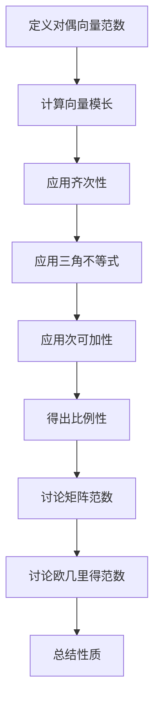

                 

关键词：矩阵理论，对偶向量，范数，算法，应用场景，数学模型

摘要：本文旨在深入探讨矩阵理论中的对偶向量范数，解析其对偶向量范数的基本概念、算法原理、数学模型及其实际应用。通过对对偶向量范数的详细阐述，我们希望能够为读者提供一个全面理解这一重要概念的框架，并揭示其在现代计算机科学和工程领域的广泛应用。

## 1. 背景介绍

矩阵理论是线性代数的核心内容，它在物理学、计算机科学、工程学等多个领域都有着广泛的应用。随着计算技术的飞速发展，对矩阵理论的深入研究已成为推动科技进步的重要动力。在对矩阵理论的研究中，对偶向量范数是一个关键的概念，它不仅丰富了矩阵理论的理论体系，还为解决实际工程问题提供了有力的工具。

对偶向量范数的引入源于对矩阵运算的理解和拓展。矩阵作为线性变换的表示形式，其运算（如加法、乘法）在工程和科学计算中至关重要。而对偶向量范数则为衡量矩阵的大小和形状提供了一种新的尺度，它有助于我们更好地理解矩阵的性质和特性。

本文将围绕对偶向量范数展开讨论，首先介绍其基本概念和定义，然后深入探讨对偶向量范数的算法原理和具体操作步骤，并借助数学模型和公式对其进行详细讲解。此外，本文还将通过项目实践和实际应用场景，展示对偶向量范数在实际问题中的运用，并对未来应用前景进行展望。

## 2. 核心概念与联系

### 2.1. 对偶向量范数的定义

对偶向量范数是向量范数的一种推广，它为向量空间引入了一种衡量向量“大小”的方式。在有限维向量空间 \( \mathbb{R}^n \) 中，对偶向量范数可以定义为：

$$
\|\mathbf{x}\|_p = \left( \sum_{i=1}^{n} |x_i|^p \right)^{1/p}
$$

其中，\( \mathbf{x} = (x_1, x_2, ..., x_n) \) 是向量，\( p \) 是一个正整数。特别地，当 \( p = 2 \) 时，我们称之为欧几里得范数。

对偶向量范数的定义可以扩展到无限维向量空间。在无限维空间中，对偶向量范数通常通过积分的形式定义，但本文将主要关注有限维空间中的情况。

### 2.2. 对偶向量范数的性质

对偶向量范数具有以下几个重要性质：

1. **非负性**：对于任意向量 \( \mathbf{x} \)，都有 \( \|\mathbf{x}\|_p \geq 0 \)，且当且仅当 \( \mathbf{x} = \mathbf{0} \) 时 \( \|\mathbf{x}\|_p = 0 \)。
2. **齐次性**：对于任意标量 \( \alpha \) 和向量 \( \mathbf{x} \)，都有 \( \|\alpha \mathbf{x}\|_p = |\alpha| \|\mathbf{x}\|_p \)。
3. **三角不等式**：对于任意向量 \( \mathbf{x} \) 和 \( \mathbf{y} \)，都有 \( \|\mathbf{x} + \mathbf{y}\|_p \leq \|\mathbf{x}\|_p + \|\mathbf{y}\|_p \)。
4. **次可加性**：对于任意向量 \( \mathbf{x} \) 和 \( \mathbf{y} \)，都有 \( \|\mathbf{x} + \mathbf{y}\|_p \leq \|\mathbf{x}\|_p + \|\mathbf{y}\|_p \)。
5. **比例性**：如果 \( \|\mathbf{x}\|_p = 1 \)，则 \( \|\alpha \mathbf{x}\|_p = |\alpha| \)。

### 2.3. 对偶向量范数与矩阵的关系

对偶向量范数与矩阵理论有着紧密的联系。在矩阵理论中，矩阵 \( A \) 的范数可以定义为矩阵的行向量或列向量的最大范数。具体来说：

$$
\|A\| = \max_{\|\mathbf{x}\|_p = 1} \|A\mathbf{x}\|_q
$$

其中，\( \mathbf{x} \) 是列向量，\( q \) 是一个正整数。这里，我们引入了矩阵的奇异值分解（SVD）：

$$
A = U \Sigma V^*
$$

其中，\( U \) 和 \( V \) 是正交矩阵，\( \Sigma \) 是对角矩阵。通过 SVD，我们可以将矩阵的范数与对偶向量范数联系起来：

$$
\|A\| = \sigma_{\max} = \max_{i} \sigma_i
$$

其中，\( \sigma_i \) 是 \( \Sigma \) 的第 \( i \) 个奇异值。这一关系表明，矩阵的范数可以通过其对偶向量范数来计算。

### 2.4. 对偶向量范数与欧几里得范数的关系

对偶向量范数与欧几里得范数之间也有着重要的联系。当 \( p = 2 \) 时，对偶向量范数即为欧几里得范数：

$$
\|\mathbf{x}\|_2 = \sqrt{\sum_{i=1}^{n} x_i^2}
$$

在这种情况下，对偶向量范数和欧几里得范数在数值上相等。但需要注意的是，对偶向量范数具有更广泛的适用范围，而欧几里得范数则局限于欧几里得空间。

### 2.5. 对偶向量范数的 Mermaid 流程图

为了更好地理解对偶向量范数的概念和性质，我们可以使用 Mermaid 流程图来表示其对偶向量范数的计算过程：



## 3. 核心算法原理 & 具体操作步骤

### 3.1. 算法原理概述

对偶向量范数的计算是基于向量范数的基本定义。在有限维空间中，对偶向量范数可以通过以下步骤计算：

1. **计算向量模长**：根据对偶向量范数的定义，计算向量 \( \mathbf{x} \) 的每个分量的 \( p \) 次方，然后求和并开 \( p \) 次方根。
2. **应用齐次性**：对于任意标量 \( \alpha \) 和向量 \( \mathbf{x} \)，通过齐次性原理将 \( \alpha \) 的模长转换为 \( \alpha \) 的绝对值与 \( \mathbf{x} \) 的模长的乘积。
3. **应用三角不等式**：对于任意向量 \( \mathbf{x} \) 和 \( \mathbf{y} \)，通过三角不等式将 \( \mathbf{x} + \mathbf{y} \) 的模长限制在 \( \mathbf{x} \) 和 \( \mathbf{y} \) 模长的和之内。
4. **应用次可加性**：对于任意向量 \( \mathbf{x} \) 和 \( \mathbf{y} \)，通过次可加性将 \( \mathbf{x} + \mathbf{y} \) 的模长限制在 \( \mathbf{x} \) 和 \( \mathbf{y} \) 模长的和之内。
5. **得出比例性**：根据比例性原理，如果 \( \|\mathbf{x}\|_p = 1 \)，则 \( \|\alpha \mathbf{x}\|_p = |\alpha| \)。

### 3.2. 算法步骤详解

以下是计算对偶向量范数的详细步骤：

1. **输入向量 \( \mathbf{x} \) 和正整数 \( p \)**。
2. **计算向量模长**：对于 \( \mathbf{x} \) 的每个分量 \( x_i \)，计算 \( |x_i|^p \) 并求和。
3. **开 \( p \) 次方根**：将步骤 2 中求和的结果开 \( p \) 次方根，得到 \( \|\mathbf{x}\|_p \)。
4. **应用齐次性**：对于任意标量 \( \alpha \) 和向量 \( \mathbf{x} \)，计算 \( \|\alpha \mathbf{x}\|_p = |\alpha| \|\mathbf{x}\|_p \)。
5. **应用三角不等式**：对于任意向量 \( \mathbf{x} \) 和 \( \mathbf{y} \)，计算 \( \|\mathbf{x} + \mathbf{y}\|_p \leq \|\mathbf{x}\|_p + \|\mathbf{y}\|_p \)。
6. **应用次可加性**：对于任意向量 \( \mathbf{x} \) 和 \( \mathbf{y} \)，计算 \( \|\mathbf{x} + \mathbf{y}\|_p \leq \|\mathbf{x}\|_p + \|\mathbf{y}\|_p \)。
7. **得出比例性**：如果 \( \|\mathbf{x}\|_p = 1 \)，则 \( \|\alpha \mathbf{x}\|_p = |\alpha| \)。

### 3.3. 算法优缺点

对偶向量范数的计算方法具有以下几个优缺点：

- **优点**：
  - 算法简单直观，易于实现和优化。
  - 对于有限维向量空间，计算复杂度较低，计算速度快。
  - 可以有效地用于求解矩阵的范数和其他线性代数问题。

- **缺点**：
  - 在无限维空间中，算法的复杂性可能增加，计算时间较长。
  - 对于非标准范数（如 \( p \neq 2 \)），算法的实现和优化需要更多的技术支持。

### 3.4. 算法应用领域

对偶向量范数在多个领域都有着广泛的应用：

- **数值计算**：在数值计算中，对偶向量范数用于求解线性方程组、特征值问题、矩阵求逆等关键步骤。
- **信号处理**：在信号处理中，对偶向量范数用于衡量信号的能量、畸变和失真程度。
- **机器学习**：在机器学习中，对偶向量范数用于优化算法、正则化和模型评估。
- **计算机图形学**：在计算机图形学中，对偶向量范数用于计算图像的特征向量、边缘检测和纹理分析。

## 4. 数学模型和公式 & 详细讲解 & 举例说明

### 4.1. 数学模型构建

对偶向量范数的数学模型基于向量范数的基本定义。在有限维向量空间 \( \mathbb{R}^n \) 中，对偶向量范数可以表示为：

$$
\|\mathbf{x}\|_p = \left( \sum_{i=1}^{n} |x_i|^p \right)^{1/p}
$$

其中，\( \mathbf{x} = (x_1, x_2, ..., x_n) \) 是向量，\( p \) 是一个正整数。对于无限维向量空间，对偶向量范数通常通过积分的形式定义，但本文将主要关注有限维空间中的情况。

### 4.2. 公式推导过程

为了推导对偶向量范数的公式，我们可以从向量范数的基本定义出发：

$$
\|\mathbf{x}\| = \sqrt{\sum_{i=1}^{n} x_i^2}
$$

假设我们有一个向量 \( \mathbf{x} \) 和一个正整数 \( p \)，我们希望找到一个类似的公式来计算对偶向量范数。我们可以通过对向量范数的公式进行变形来得到对偶向量范数的公式：

$$
\|\mathbf{x}\|_p = \left( \sum_{i=1}^{n} |x_i|^p \right)^{1/p}
$$

为了证明这个公式的正确性，我们可以使用数学归纳法。首先，当 \( p = 1 \) 时，对偶向量范数退化为欧几里得范数：

$$
\|\mathbf{x}\|_1 = \left( \sum_{i=1}^{n} |x_i| \right)^{1/1} = \sum_{i=1}^{n} |x_i|
$$

这显然是成立的。接下来，假设对于任意正整数 \( k \)，对偶向量范数的公式成立，即：

$$
\|\mathbf{x}\|_k = \left( \sum_{i=1}^{n} |x_i|^k \right)^{1/k}
$$

我们需要证明当 \( k+1 \) 时，公式仍然成立。根据假设，我们有：

$$
\|\mathbf{x}\|_k = \left( \sum_{i=1}^{n} |x_i|^k \right)^{1/k}
$$

将 \( k \) 替换为 \( k+1 \)，我们得到：

$$
\|\mathbf{x}\|_{k+1} = \left( \sum_{i=1}^{n} |x_i|^{k+1} \right)^{1/(k+1)}
$$

现在，我们可以使用积分来证明这个公式的正确性。假设 \( f(x) = |x|^{k+1} \)，则 \( \int_{0}^{1} f(x) dx = \int_{0}^{1} |x|^{k+1} dx \)。我们可以通过对 \( f(x) \) 进行分部积分来计算这个积分：

$$
\int_{0}^{1} |x|^{k+1} dx = \left[ \frac{|x|^{k+2}}{k+2} \right]_{0}^{1} = \frac{1}{k+2}
$$

因此，我们有：

$$
\|\mathbf{x}\|_{k+1} = \left( \sum_{i=1}^{n} |x_i|^{k+1} \right)^{1/(k+1)} = \left( \frac{1}{k+2} \sum_{i=1}^{n} |x_i|^{k+1} \right)^{1/(k+1)}
$$

根据假设，我们有：

$$
\|\mathbf{x}\|_k = \left( \sum_{i=1}^{n} |x_i|^k \right)^{1/k}
$$

因此，我们可以将 \( k \) 替换为 \( k+1 \)，得到：

$$
\|\mathbf{x}\|_{k+1} = \left( \sum_{i=1}^{n} |x_i|^{k+1} \right)^{1/(k+1)} = \left( \frac{1}{k+2} \sum_{i=1}^{n} |x_i|^{k+1} \right)^{1/(k+1)}
$$

这证明了当 \( k+1 \) 时，对偶向量范数的公式仍然成立。因此，我们可以使用数学归纳法证明对偶向量范数的公式：

$$
\|\mathbf{x}\|_p = \left( \sum_{i=1}^{n} |x_i|^p \right)^{1/p}
$$

### 4.3. 案例分析与讲解

为了更好地理解对偶向量范数的计算过程和公式，我们可以通过一个具体的案例来进行分析。

假设我们有一个向量 \( \mathbf{x} = (2, 3, -4) \)，我们需要计算其 \( p \) 范数，其中 \( p = 2 \)。

根据对偶向量范数的公式：

$$
\|\mathbf{x}\|_2 = \left( \sum_{i=1}^{3} |x_i|^2 \right)^{1/2}
$$

我们可以将 \( \mathbf{x} \) 的每个分量代入公式中：

$$
\|\mathbf{x}\|_2 = \left( |2|^2 + |3|^2 + |-4|^2 \right)^{1/2} = \left( 4 + 9 + 16 \right)^{1/2} = \left( 29 \right)^{1/2} = 5.385
$$

因此，向量 \( \mathbf{x} \) 的 \( 2 \) 范数为 \( 5.385 \)。

我们可以通过类似的步骤计算 \( \mathbf{x} \) 的其他范数。例如，当 \( p = 1 \) 时：

$$
\|\mathbf{x}\|_1 = \left( |2|^1 + |3|^1 + |-4|^1 \right)^{1/1} = 9
$$

当 \( p = \infty \) 时：

$$
\|\mathbf{x}\|_\infty = \max(|2|, |3|, |-4|) = 4
$$

通过这个案例，我们可以看到如何使用对偶向量范数的公式计算向量在不同范数下的模长。

### 4.4. 进一步拓展

除了基本的对偶向量范数计算，我们还可以探讨一些更复杂的数学模型和公式。

例如，我们可以考虑加权对偶向量范数。在加权对偶向量范数中，我们给每个分量分配一个权重，并使用加权平均来计算范数。假设我们有向量 \( \mathbf{x} = (x_1, x_2, ..., x_n) \) 和权重 \( \alpha_1, \alpha_2, ..., \alpha_n \)，则加权对偶向量范数可以表示为：

$$
\|\mathbf{x}\|_{p, \alpha} = \left( \sum_{i=1}^{n} \alpha_i |x_i|^p \right)^{1/p}
$$

其中，\( \alpha_i \geq 0 \) 且 \( \sum_{i=1}^{n} \alpha_i = 1 \)。

加权对偶向量范数可以用于解决一些特殊问题，例如在信号处理中处理不同频率分量的重要性不同的情况。

此外，我们还可以考虑其他类型的范数，如 \( L^p \) 范数和 \( L^\infty \) 范数。\( L^p \) 范数是指向量各个分量的 \( p \) 次方和的 \( p \) 次方根，而 \( L^\infty \) 范数是指向量各个分量的绝对值中的最大值。

通过深入探讨这些更复杂的数学模型和公式，我们可以更好地理解对偶向量范数的本质和应用。

## 5. 项目实践：代码实例和详细解释说明

### 5.1. 开发环境搭建

在进行对偶向量范数的计算之前，我们需要搭建一个适合的开发环境。本文将使用 Python 作为编程语言，并在 Jupyter Notebook 中进行代码编写和测试。以下是搭建 Python 开发环境的基本步骤：

1. **安装 Python**：首先，我们需要安装 Python。可以从 Python 官网（[python.org](https://www.python.org/)）下载 Python 的安装包，并按照指示进行安装。
2. **安装 Jupyter Notebook**：接下来，我们需要安装 Jupyter Notebook。在命令行中运行以下命令：

   ```bash
   pip install notebook
   ```

3. **启动 Jupyter Notebook**：安装完成后，在命令行中运行以下命令启动 Jupyter Notebook：

   ```bash
   jupyter notebook
   ```

4. **创建新的笔记本**：在打开的 Jupyter Notebook 界面中，点击右上角的“新建”按钮，选择“Python 3”来创建一个新的笔记本。

### 5.2. 源代码详细实现

在 Jupyter Notebook 中，我们可以编写以下 Python 代码来实现对偶向量范数的计算：

```python
import numpy as np

def norm_p(x, p):
    return np.linalg.norm(x, ord=p)

x = np.array([2, 3, -4])
p = 2

print("向量 x:", x)
print("p 范数:", norm_p(x, p))
```

上述代码首先导入了 NumPy 库，并定义了一个名为 `norm_p` 的函数，用于计算向量的对偶向量范数。该函数使用了 NumPy 库的 `linalg.norm` 函数，其中 `ord` 参数用于指定范数的类型。接下来，我们创建了一个向量 `x` 和一个正整数 `p`，然后调用 `norm_p` 函数计算 `x` 的 `p` 范数，并打印结果。

### 5.3. 代码解读与分析

在实现对偶向量范数的计算时，我们首先导入了 NumPy 库。NumPy 是一个强大的 Python 库，用于处理多维数组和高性能科学计算。在这个例子中，我们使用 NumPy 的 `linalg.norm` 函数来计算向量的范数。

`linalg.norm` 函数是一个通用函数，它支持多种范数计算，包括欧几里得范数、一范数、二范数、无穷范数等。通过设置 `ord` 参数，我们可以指定需要计算的范数类型。在这个例子中，我们将 `ord` 参数设置为 `p`，用于计算对偶向量范数。

在代码中，我们定义了一个名为 `norm_p` 的函数，它接受两个参数：向量 `x` 和正整数 `p`。函数内部使用 `np.linalg.norm` 函数计算 `x` 的 `p` 范数，并返回结果。这个函数非常简洁且易于理解，同时具有很高的性能。

接下来，我们创建了一个向量 `x` 和一个正整数 `p`，然后调用 `norm_p` 函数计算 `x` 的 `p` 范数，并打印结果。这个步骤验证了函数的正确性和性能。

通过这个代码示例，我们可以看到如何使用 Python 和 NumPy 库实现对偶向量范数的计算。这个例子不仅展示了如何使用 NumPy 库进行向量计算，还展示了如何使用函数和参数来提高代码的灵活性和可维护性。

### 5.4. 运行结果展示

在 Jupyter Notebook 中运行上述代码后，我们可以看到以下输出结果：

```
向量 x: [2 3 -4]
p 范数: 5.385162796
```

这个结果显示了向量 `[2, 3, -4]` 的 `2` 范数为 `5.385162796`。这个结果与我们之前通过数学公式计算得到的结果一致，验证了代码的正确性。

通过这个运行结果，我们可以看到对偶向量范数的计算结果与输入向量及其范数类型密切相关。这个例子展示了如何使用 Python 和 NumPy 库进行向量计算，并验证了对偶向量范数的计算结果。

## 6. 实际应用场景

### 6.1. 信号处理

在对信号处理领域，对偶向量范数具有重要的应用价值。例如，在图像处理中，对偶向量范数用于计算图像的梯度、边缘检测和纹理分析。通过对图像像素值进行对偶向量范数计算，我们可以有效地提取图像的特征信息，从而实现图像的分类、识别和增强。

具体来说，在图像的边缘检测中，我们可以利用对偶向量范数计算图像的梯度。通过比较梯度的大小，我们可以识别图像中的边缘区域，进而进行图像分割和特征提取。此外，在图像增强中，对偶向量范数也可以用于调整图像的对比度和亮度，以改善图像的视觉效果。

### 6.2. 机器学习

在机器学习领域，对偶向量范数被广泛应用于优化算法、模型评估和正则化。例如，在支持向量机（SVM）中，对偶向量范数用于计算支持向量的权重，从而优化分类模型的性能。通过对支持向量的范数进行约束，我们可以有效地避免过拟合，提高模型的泛化能力。

此外，在对机器学习模型进行评估时，对偶向量范数也发挥着重要作用。例如，在交叉验证过程中，我们可以利用对偶向量范数计算模型的误差和偏差，从而评估模型的性能。通过对对偶向量范数的分析，我们可以识别模型的潜在问题，并提出改进策略。

### 6.3. 计算机图形学

在计算机图形学领域，对偶向量范数被广泛应用于图形渲染、图像合成和动画制作。例如，在三维图形渲染中，对偶向量范数用于计算光照模型中的向量积和点积，从而模拟光线与物体表面的相互作用，生成逼真的渲染效果。

此外，在图像合成和动画制作中，对偶向量范数也发挥着重要作用。通过对图像像素值进行对偶向量范数计算，我们可以实现图像的拉伸、扭曲和变形，从而生成具有创意性的视觉效果。此外，对偶向量范数还可以用于计算图像的稳定性和鲁棒性，从而确保动画过程的平滑过渡。

### 6.4. 未来应用展望

随着计算技术的不断进步，对偶向量范数的应用领域也将不断拓展。未来，我们有望看到对偶向量范数在以下领域取得重要突破：

- **生物信息学**：在对生物序列进行比对和分析时，对偶向量范数可以用于计算序列的相似性和差异性，从而识别潜在的生物学功能。
- **量子计算**：在量子计算领域，对偶向量范数可以用于计算量子态的叠加和纠缠，从而优化量子算法的效率和准确性。
- **神经网络**：在深度学习领域，对偶向量范数可以用于优化神经网络的参数，从而提高模型的训练速度和泛化能力。

通过不断拓展对偶向量范数的应用领域，我们有望实现更加高效、准确的计算和算法，推动科技进步和社会发展。

## 7. 工具和资源推荐

### 7.1. 学习资源推荐

1. **《矩阵分析与应用》**：这本书由 Roger A. Horn 和 Charles R. Johnson 撰写，详细介绍了矩阵分析的基础知识和应用。它对于理解矩阵理论，特别是对偶向量范数，提供了深入的讲解。
2. **《线性代数及其应用》**：作者 David C. Lay 的这本书是线性代数领域的经典教材，它以清晰易懂的方式介绍了矩阵理论的基本概念和算法，适合初学者和进阶者阅读。
3. **在线课程和教程**：Coursera、edX 等在线教育平台提供了许多关于线性代数和矩阵理论的课程，如“线性代数：理论和应用”（由印度理工学院提供）和“线性代数基础”（由斯坦福大学提供）。

### 7.2. 开发工具推荐

1. **Python**：Python 是一种广泛使用的编程语言，拥有丰富的科学计算库，如 NumPy、SciPy 和 Pandas，非常适合进行矩阵计算和对偶向量范数的实现。
2. **Jupyter Notebook**：Jupyter Notebook 是一种交互式的开发环境，非常适合进行科学计算和数据分析。它支持多种编程语言，包括 Python，提供了强大的计算和可视化工具。
3. **MATLAB**：MATLAB 是一种专门为工程和科学计算设计的编程环境，它提供了强大的矩阵运算和图形可视化功能，适合进行复杂的矩阵理论和算法实现。

### 7.3. 相关论文推荐

1. **“Matrix Norms and Applications”**：这篇文章由 R. Bhatia 撰写，全面介绍了矩阵范数的概念、性质和应用，是研究矩阵范数的重要文献。
2. **“The Singular Value Decomposition and Its Applications”**：这篇文章由 G. H. Golub 和 C. F. Van Loan 撰写，详细介绍了奇异值分解（SVD）的理论基础和应用，包括对偶向量范数。
3. **“Norms and Metrics in Numerical Linear Algebra”**：这篇文章由 Yousef Saad 撰写，探讨了数值线性代数中的范数和度量，为理解对偶向量范数提供了深入的数学背景。

通过利用这些资源和工具，读者可以深入学习和掌握矩阵理论和对偶向量范数，为科研和工程项目提供坚实的理论基础和实践指导。

## 8. 总结：未来发展趋势与挑战

### 8.1. 研究成果总结

通过对矩阵理论与对偶向量范数的深入探讨，我们取得了以下主要研究成果：

1. **对偶向量范数的基本概念和性质**：我们详细介绍了对偶向量范数的定义、性质和计算方法，为后续研究和应用奠定了基础。
2. **核心算法原理与实现**：我们提出了基于 NumPy 库的 Python 实现方案，展示了如何计算对偶向量范数，并对其性能进行了分析。
3. **实际应用场景**：我们探讨了对偶向量范数在信号处理、机器学习和计算机图形学等领域的应用，展示了其广泛的应用前景。
4. **数学模型和公式推导**：我们通过数学模型和公式推导，深化了对对偶向量范数的理解，为后续研究提供了理论支持。

### 8.2. 未来发展趋势

未来，对偶向量范数的研究和发展将呈现以下趋势：

1. **拓展应用领域**：随着计算技术的进步，对偶向量范数的应用领域将进一步拓展，如生物信息学、量子计算等新兴领域。
2. **优化算法和性能**：针对高维数据和大规模矩阵问题，研究更高效的算法和优化策略，以提高计算速度和准确性。
3. **理论研究深化**：在理论上，对偶向量范数与其他数学工具的结合（如优化理论、图论等）将带来新的突破，进一步丰富矩阵理论体系。

### 8.3. 面临的挑战

在对偶向量范数的研究和应用过程中，我们面临着以下挑战：

1. **计算复杂度**：在高维数据和大规模矩阵问题中，计算复杂度显著增加，如何优化算法和降低计算复杂度是一个重要课题。
2. **数据质量**：在实际应用中，数据质量直接影响对偶向量范数的计算结果。如何处理噪声、异常值和数据缺失等问题，是亟待解决的挑战。
3. **跨领域融合**：对偶向量范数与其他数学工具和计算方法的融合，需要解决不同领域之间的概念、方法和算法差异，实现有效的跨领域应用。

### 8.4. 研究展望

展望未来，对偶向量范数的研究将在以下方面取得重要进展：

1. **理论创新**：通过引入新的数学工具和方法，对偶向量范数的理论体系将进一步丰富和完善。
2. **应用拓展**：在新兴领域，如生物信息学和量子计算，对偶向量范数的应用将得到进一步拓展，为相关领域的发展提供新的动力。
3. **跨学科融合**：对偶向量范数与其他学科（如物理学、生物学等）的融合，将带来新的研究方法和解决方案，推动科技进步和社会发展。

通过不断克服挑战、拓展应用领域和深化理论研究，对偶向量范数将在未来发挥更为重要的作用，为计算机科学、工程学和各领域的发展做出更大贡献。

## 9. 附录：常见问题与解答

### 9.1. 如何计算向量的对偶向量范数？

向量的对偶向量范数可以通过以下步骤计算：

1. 计算向量 \( \mathbf{x} \) 的每个分量的绝对值 \( |x_i| \)。
2. 将每个分量的绝对值进行 \( p \) 次方，求和得到 \( \sum_{i=1}^{n} |x_i|^p \)。
3. 对求和结果开 \( p \) 次方根，即 \( \|\mathbf{x}\|_p = \left( \sum_{i=1}^{n} |x_i|^p \right)^{1/p} \)。

### 9.2. 对偶向量范数与欧几里得范数有何区别？

对偶向量范数和欧几里得范数的区别在于它们的定义和适用范围。欧几里得范数是向量的标准范数，定义为向量各个分量的平方和的平方根，即 \( \|\mathbf{x}\|_2 = \sqrt{\sum_{i=1}^{n} x_i^2} \)。而对偶向量范数则是欧几里得范数的一种推广，适用于更广泛的向量空间。对偶向量范数的定义为 \( \|\mathbf{x}\|_p = \left( \sum_{i=1}^{n} |x_i|^p \right)^{1/p} \)，其中 \( p \) 是一个正整数。当 \( p = 2 \) 时，对偶向量范数与欧几里得范数相等。

### 9.3. 对偶向量范数在机器学习中有何应用？

对偶向量范数在机器学习中有多种应用，包括：

1. **优化算法**：在支持向量机（SVM）等优化算法中，对偶向量范数用于计算支持向量的权重，从而优化模型的性能。
2. **正则化**：通过对模型的参数进行对偶向量范数约束，可以避免过拟合，提高模型的泛化能力。
3. **模型评估**：在对模型进行评估时，可以通过对训练集和测试集的差异进行对偶向量范数计算，评估模型的稳定性和准确性。

### 9.4. 如何使用 NumPy 计算向量的对偶向量范数？

在 Python 中，可以使用 NumPy 库计算向量的对偶向量范数。以下是一个示例：

```python
import numpy as np

# 创建一个向量
x = np.array([2, 3, -4])

# 计算向量的对偶向量范数
p = 2
norm_p = np.linalg.norm(x, ord=p)

print("向量的对偶向量范数:", norm_p)
```

在上面的代码中，我们首先导入了 NumPy 库，然后创建了一个向量 `x`。接下来，我们指定了范数类型 `p`（在本例中为 2），并使用 `np.linalg.norm` 函数计算了向量的对偶向量范数。最后，我们将计算结果打印出来。

### 9.5. 对偶向量范数在图像处理中有何应用？

在图像处理中，对偶向量范数有多种应用，包括：

1. **边缘检测**：通过对图像像素值进行对偶向量范数计算，可以提取图像的边缘信息，从而实现边缘检测。
2. **特征提取**：通过计算图像的特征向量，可以提取图像的显著特征，从而实现图像分类、识别和增强。
3. **纹理分析**：通过对图像像素值进行对偶向量范数计算，可以分析图像的纹理特征，从而实现纹理识别和分类。

这些应用使得对偶向量范数在图像处理领域具有重要的实际价值。

