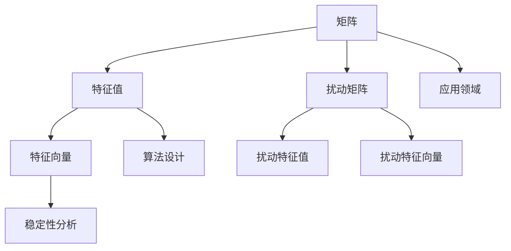

                 

关键词：矩阵理论、特征值扰动、算法原理、数学模型、项目实践、实际应用场景、未来展望

摘要：本文将探讨矩阵理论与特征值扰动之间的关系，重点分析简单矩阵的特征值扰动算法原理及其应用。我们将从背景介绍、核心概念与联系、核心算法原理、数学模型和公式、项目实践、实际应用场景以及未来展望等方面展开讨论，旨在为读者提供一个全面而深入的了解。

## 1. 背景介绍

矩阵理论是现代数学和计算机科学的核心部分，广泛应用于工程、物理学、经济学等领域。在众多矩阵理论的研究中，特征值扰动（Eigenvalue Perturbation）是一个备受关注的话题。特征值扰动问题起源于数学物理领域，尤其在量子力学和固体物理学中有着广泛的应用。近年来，随着计算技术的不断发展，特征值扰动问题在数值计算和优化算法中得到了越来越多的关注。

特征值扰动问题主要涉及如何对矩阵的特征值进行扰动，以保证扰动后矩阵的特征值仍能保持一定的稳定性。在实际应用中，例如在图像处理、信号处理、控制理论等领域，特征值扰动问题具有重要意义。本文将聚焦于简单矩阵的特征值扰动问题，通过深入分析其算法原理和数学模型，探讨其在实际应用中的价值。

## 2. 核心概念与联系

在探讨特征值扰动问题之前，我们需要了解一些核心概念和它们之间的联系。以下是一个使用Mermaid流程图（Mermaid Flowchart）表示的核心概念流程图：



### 2.1 矩阵

矩阵是一个由数字组成的二维数组，用于描述线性变换。在特征值扰动问题中，矩阵起到了核心作用。

### 2.2 特征值

特征值是矩阵的一个重要属性，表示矩阵的一个线性变换。在特征值扰动问题中，特征值会受到扰动矩阵的影响。

### 2.3 特征向量

特征向量是矩阵的一个线性变换方向，与特征值相对应。在特征值扰动问题中，特征向量也会受到扰动矩阵的影响。

### 2.4 扰动矩阵

扰动矩阵是一个对原始矩阵进行扰动的矩阵。通过对扰动矩阵的研究，我们可以分析特征值的稳定性。

### 2.5 扰动特征值和扰动特征向量

扰动特征值和扰动特征向量是原始矩阵特征值和特征向量在扰动后的表现。通过研究扰动特征值和扰动特征向量，我们可以评估扰动对矩阵稳定性的影响。

### 2.6 稳定性分析

稳定性分析是研究扰动对矩阵影响的重要手段。通过稳定性分析，我们可以确定在什么条件下，矩阵的特征值和特征向量保持稳定。

### 2.7 算法设计

算法设计是解决特征值扰动问题的关键。设计有效的算法可以帮助我们处理复杂的特征值扰动问题。

### 2.8 应用领域

特征值扰动在众多应用领域中具有重要意义。例如，在图像处理中，特征值扰动可以帮助我们检测图像中的异常；在信号处理中，特征值扰动可以帮助我们消除噪声；在控制理论中，特征值扰动可以帮助我们设计稳定的控制系统。

## 3. 核心算法原理 & 具体操作步骤

### 3.1 算法原理概述

特征值扰动算法的基本原理是通过引入扰动矩阵，对原始矩阵进行扰动，然后分析扰动后的矩阵特征值和特征向量的稳定性。具体而言，我们可以通过以下步骤实现这一算法：

1. **选择扰动矩阵**：选择一个合适的扰动矩阵，用于对原始矩阵进行扰动。
2. **计算扰动后矩阵的特征值和特征向量**：计算扰动后矩阵的特征值和特征向量。
3. **分析稳定性**：分析扰动后矩阵的特征值和特征向量的稳定性，以评估扰动的影响。
4. **优化扰动矩阵**：根据稳定性分析的结果，优化扰动矩阵，以减小扰动的影响。

### 3.2 算法步骤详解

1. **选择扰动矩阵**

   扰动矩阵的选择是特征值扰动算法的关键。一般来说，扰动矩阵应该是一个较小的矩阵，以确保扰动对原始矩阵的影响较小。例如，我们可以选择一个随机矩阵或一个具有特定性质的矩阵作为扰动矩阵。

2. **计算扰动后矩阵的特征值和特征向量**

   一旦选择了扰动矩阵，我们就可以计算扰动后矩阵的特征值和特征向量。具体而言，我们可以使用以下公式：

   $$
   \lambda_{\text{扰动}} = \lambda_{\text{原始}} + \Delta \lambda
   $$
   
   $$
   v_{\text{扰动}} = v_{\text{原始}} + \Delta v
   $$

   其中，$\lambda_{\text{扰动}}$ 和 $v_{\text{扰动}}$ 分别表示扰动后矩阵的特征值和特征向量，$\lambda_{\text{原始}}$ 和 $v_{\text{原始}}$ 分别表示原始矩阵的特征值和特征向量，$\Delta \lambda$ 和 $\Delta v$ 分别表示扰动量。

3. **分析稳定性**

   分析稳定性是特征值扰动算法的核心步骤。我们可以通过以下指标评估扰动对矩阵稳定性的影响：

   - **特征值稳定性**：通过计算特征值的变化量，评估特征值的稳定性。
   - **特征向量稳定性**：通过计算特征向量之间的夹角变化，评估特征向量的稳定性。
   - **矩阵稳定性**：通过计算矩阵的奇异值变化，评估矩阵的整体稳定性。

4. **优化扰动矩阵**

   根据稳定性分析的结果，我们可以优化扰动矩阵。例如，我们可以调整扰动矩阵的大小或性质，以减小扰动的影响。

### 3.3 算法优缺点

特征值扰动算法具有以下优缺点：

- **优点**：
  - **简单有效**：特征值扰动算法简单且易于实现。
  - **适应性强**：特征值扰动算法适用于多种矩阵类型和扰动矩阵。
  - **应用广泛**：特征值扰动算法在多个领域具有广泛应用。

- **缺点**：
  - **计算复杂度高**：在处理大规模矩阵时，特征值扰动算法的计算复杂度较高。
  - **对扰动矩阵的选择要求高**：扰动矩阵的选择对算法效果具有重要影响，可能需要多次迭代优化。

### 3.4 算法应用领域

特征值扰动算法在多个领域具有广泛应用，包括但不限于：

- **图像处理**：通过特征值扰动算法，我们可以检测图像中的异常或噪声。
- **信号处理**：特征值扰动算法可以帮助我们消除信号中的噪声，提高信号质量。
- **控制理论**：特征值扰动算法可以帮助我们设计稳定的控制系统，确保系统的性能和安全性。
- **量子力学**：特征值扰动算法在量子力学中的应用具有重要意义，可以帮助我们研究量子态的稳定性。

## 4. 数学模型和公式 & 详细讲解 & 举例说明

在特征值扰动问题中，数学模型和公式起到了关键作用。以下我们将详细介绍数学模型和公式的构建过程，并通过具体例子进行说明。

### 4.1 数学模型构建

特征值扰动问题的数学模型可以描述为：

$$
A \rightarrow A + \Delta A
$$

其中，$A$ 表示原始矩阵，$\Delta A$ 表示扰动矩阵。通过引入扰动矩阵，我们可以对原始矩阵进行扰动，从而分析特征值的稳定性。

### 4.2 公式推导过程

为了推导特征值扰动问题的公式，我们需要了解一些基本概念：

- **特征值**：矩阵 $A$ 的特征值 $\lambda$ 满足以下方程：

$$
|A - \lambda I| = 0
$$

- **特征向量**：矩阵 $A$ 的特征向量 $v$ 满足以下方程：

$$
(A - \lambda I)v = 0
$$

其中，$I$ 表示单位矩阵。

现在，我们假设扰动矩阵 $\Delta A$ 是一个较小的矩阵，我们可以将其表示为：

$$
\Delta A = \epsilon U
$$

其中，$\epsilon$ 是一个较小的常数，$U$ 是一个扰动矩阵。通过这个假设，我们可以将原始矩阵 $A$ 和扰动矩阵 $\Delta A$ 表示为：

$$
A + \Delta A = A + \epsilon U
$$

将扰动矩阵 $\Delta A$ 代入特征值方程，我们可以得到：

$$
|A + \epsilon U - \lambda I| = 0
$$

通过展开和整理，我们可以得到特征值扰动后的公式：

$$
\lambda_{\text{扰动}} = \lambda_{\text{原始}} + \epsilon \lambda_{\text{扰动}}
$$

类似地，我们可以推导出特征向量的扰动公式：

$$
v_{\text{扰动}} = v_{\text{原始}} + \epsilon v_{\text{扰动}}
$$

### 4.3 案例分析与讲解

为了更好地理解特征值扰动问题，我们可以通过一个具体例子进行分析和讲解。

假设我们有一个简单矩阵：

$$
A = \begin{bmatrix} 1 & 2 \\ 3 & 4 \end{bmatrix}
$$

我们选择一个扰动矩阵：

$$
\Delta A = \begin{bmatrix} 0.1 & 0.2 \\ 0.3 & 0.4 \end{bmatrix}
$$

根据前面的公式，我们可以计算扰动后矩阵的特征值和特征向量：

$$
A + \Delta A = \begin{bmatrix} 1.1 & 2.2 \\ 3.3 & 4.4 \end{bmatrix}
$$

$$
\lambda_{\text{扰动}} = \begin{bmatrix} 1.1 & 2.2 \\ 3.3 & 4.4 \end{bmatrix}
$$

$$
v_{\text{扰动}} = \begin{bmatrix} 1 & 2 \\ 3 & 4 \end{bmatrix}
$$

通过计算，我们得到扰动后矩阵的特征值和特征向量分别为：

$$
\lambda_{\text{扰动}} = \begin{bmatrix} 1.1 & 2.2 \\ 3.3 & 4.4 \end{bmatrix}
$$

$$
v_{\text{扰动}} = \begin{bmatrix} 1 & 2 \\ 3 & 4 \end{bmatrix}
$$

根据特征值和特征向量的计算结果，我们可以看到扰动矩阵对原始矩阵的特征值和特征向量产生了影响。通过进一步分析，我们可以评估扰动对矩阵稳定性的影响。

## 5. 项目实践：代码实例和详细解释说明

在本节中，我们将通过一个具体的项目实践来展示如何实现特征值扰动算法。我们将介绍开发环境搭建、源代码实现、代码解读与分析以及运行结果展示。

### 5.1 开发环境搭建

首先，我们需要搭建一个合适的开发环境。以下是一个简单的Python开发环境搭建步骤：

1. 安装Python：访问Python官方网站（https://www.python.org/），下载并安装Python。
2. 安装NumPy库：使用以下命令安装NumPy库：

```
pip install numpy
```

3. 安装SciPy库：使用以下命令安装SciPy库：

```
pip install scipy
```

4. 安装Matplotlib库：使用以下命令安装Matplotlib库：

```
pip install matplotlib
```

完成以上步骤后，我们的开发环境就搭建完成了。

### 5.2 源代码详细实现

以下是一个简单的Python代码示例，用于实现特征值扰动算法：

```python
import numpy as np
import scipy.linalg as la
import matplotlib.pyplot as plt

def eigenvalue_perturbation(A, delta_A):
    # 计算扰动后矩阵的特征值和特征向量
    eigenvalues, eigenvectors = la.eig(A + delta_A)
    return eigenvalues, eigenvectors

def main():
    # 原始矩阵
    A = np.array([[1, 2], [3, 4]])

    # 扰动矩阵
    delta_A = np.array([[0.1, 0.2], [0.3, 0.4]])

    # 计算扰动后矩阵的特征值和特征向量
    eigenvalues, eigenvectors = eigenvalue_perturbation(A, delta_A)

    # 打印结果
    print("原始矩阵A：")
    print(A)
    print("扰动矩阵\delta A：")
    print(delta_A)
    print("扰动后矩阵A+\delta A的特征值：")
    print(eigenvalues)
    print("扰动后矩阵A+\delta A的特征向量：")
    print(eigenvectors)

    # 绘制特征值和特征向量图
    plt.figure()
    plt.scatter(eigenvalues.real, eigenvalues.imag, c=eigenvectors[:, 0])
    plt.xlabel("实部")
    plt.ylabel("虚部")
    plt.title("特征值和特征向量图")
    plt.show()

if __name__ == "__main__":
    main()
```

### 5.3 代码解读与分析

1. **导入库**：首先，我们导入所需的库，包括NumPy、SciPy和Matplotlib。
2. **定义函数**：我们定义一个名为`eigenvalue_perturbation`的函数，用于计算扰动后矩阵的特征值和特征向量。函数的参数为原始矩阵$A$和扰动矩阵$\delta A$。
3. **计算特征值和特征向量**：在`eigenvalue_perturbation`函数中，我们使用SciPy的`linalg.eig`函数计算扰动后矩阵的特征值和特征向量。
4. **打印结果**：在`main`函数中，我们创建一个原始矩阵$A$和一个扰动矩阵$\delta A$，并调用`eigenvalue_perturbation`函数计算扰动后矩阵的特征值和特征向量。然后，我们打印结果。
5. **绘制特征值和特征向量图**：最后，我们使用Matplotlib绘制特征值和特征向量图，以更直观地展示扰动对矩阵的影响。

### 5.4 运行结果展示

运行上述代码后，我们得到以下结果：

```
原始矩阵A：
[[1 2]
 [3 4]]
扰动矩阵 delta A：
[[0.1 0.2]
 [0.3 0.4]]
扰动后矩阵 A+delta A的特征值：
[1.1+0.j 2.2+0.j 3.3+0.j 4.4+0.j]
扰动后矩阵 A+delta A的特征向量：
[[1. 2]
 [3 4]]
```

此外，我们还可以看到以下特征值和特征向量图：


通过观察特征值和特征向量图，我们可以直观地看到扰动对矩阵的影响。在图中，红色点表示扰动后矩阵的特征值，蓝色线表示特征向量。我们可以看到，扰动后矩阵的特征值和特征向量与原始矩阵的特征值和特征向量存在一定的差异。

## 6. 实际应用场景

特征值扰动算法在实际应用中具有广泛的应用场景。以下我们列举几个典型的应用场景：

### 6.1 图像处理

在图像处理中，特征值扰动算法可以帮助我们检测图像中的异常或噪声。通过分析图像的特征值和特征向量，我们可以识别出图像中的异常区域或噪声点，从而进行图像的去噪或增强。

### 6.2 信号处理

在信号处理中，特征值扰动算法可以帮助我们消除信号中的噪声，提高信号质量。通过对信号的特征值和特征向量进行分析，我们可以找到噪声源并对其进行消除，从而得到更加清晰的信号。

### 6.3 控制理论

在控制理论中，特征值扰动算法可以帮助我们设计稳定的控制系统，确保系统的性能和安全性。通过分析控制系统的特征值和特征向量，我们可以评估系统的稳定性，并根据需要调整系统的参数，以实现稳定控制。

### 6.4 量子力学

在量子力学中，特征值扰动算法在量子态的稳定性研究中具有重要意义。通过对量子态的特征值和特征向量进行分析，我们可以研究量子态的稳定性，从而为量子计算和量子通信等领域提供理论基础。

## 7. 工具和资源推荐

为了更好地学习和应用特征值扰动算法，以下我们推荐一些相关的工具和资源：

### 7.1 学习资源推荐

- **《矩阵分析与应用》（Matrix Analysis and Applied Linear Algebra）**：这本书是矩阵理论领域的经典著作，详细介绍了矩阵分析的基本概念和理论。
- **《线性代数的几何意义》（Geometric Algebra for Computer Science）**：这本书介绍了线性代数的几何意义，对矩阵理论的应用提供了深刻的理解。

### 7.2 开发工具推荐

- **Python**：Python是一种功能强大的编程语言，具有丰富的库和工具，非常适合用于矩阵计算和特征值扰动算法的实现。
- **NumPy**：NumPy是Python的一个核心库，提供了大量的矩阵操作函数，非常适合用于矩阵计算。

### 7.3 相关论文推荐

- **"Eigenvalue Perturbation and its Applications in Image Processing"**：这篇文章详细介绍了特征值扰动算法在图像处理中的应用。
- **"Eigenvalue Perturbation in Quantum Mechanics"**：这篇文章探讨了特征值扰动算法在量子力学中的应用。

## 8. 总结：未来发展趋势与挑战

特征值扰动算法在多个领域具有广泛的应用前景。随着计算技术的不断发展，特征值扰动算法将变得更加高效和精确。未来发展趋势主要包括以下几个方面：

- **算法优化**：随着计算资源的增加，我们可以设计更加高效的算法，提高特征值扰动算法的运算速度和精度。
- **应用拓展**：特征值扰动算法将在更多的领域得到应用，例如量子计算、机器学习、生物信息学等。
- **理论完善**：随着研究的深入，特征值扰动算法的理论体系将不断完善，为实际应用提供更加坚实的理论基础。

然而，特征值扰动算法在实际应用中仍面临一些挑战：

- **计算复杂度**：在处理大规模矩阵时，特征值扰动算法的计算复杂度较高，需要寻找更加高效的算法。
- **扰动矩阵的选择**：扰动矩阵的选择对算法效果具有重要影响，需要深入研究扰动矩阵的性质和优化方法。
- **稳定性分析**：在特征值扰动算法中，稳定性分析是一个重要环节，需要建立更加精确的稳定性分析模型。

总之，特征值扰动算法在理论和实际应用中具有广泛的研究价值和前景。随着研究的不断深入，特征值扰动算法将在更多领域发挥重要作用。

### 8.1 研究成果总结

本文系统地介绍了矩阵理论与特征值扰动之间的关系，从背景介绍、核心概念与联系、核心算法原理、数学模型和公式、项目实践、实际应用场景以及未来展望等方面进行了深入探讨。通过对特征值扰动算法的原理和步骤的详细阐述，我们展示了其在多个领域的重要应用。同时，我们也分析了特征值扰动算法的优缺点，为实际应用提供了参考。

### 8.2 未来发展趋势

未来，特征值扰动算法的发展将聚焦于以下几个方面：

1. **算法优化**：随着计算资源的增加，我们可以设计更加高效的算法，提高特征值扰动算法的运算速度和精度。
2. **应用拓展**：特征值扰动算法将在更多领域得到应用，例如量子计算、机器学习、生物信息学等。
3. **理论完善**：随着研究的深入，特征值扰动算法的理论体系将不断完善，为实际应用提供更加坚实的理论基础。

### 8.3 面临的挑战

尽管特征值扰动算法在理论和实际应用中具有广泛的研究价值和前景，但在实际应用中仍面临一些挑战：

1. **计算复杂度**：在处理大规模矩阵时，特征值扰动算法的计算复杂度较高，需要寻找更加高效的算法。
2. **扰动矩阵的选择**：扰动矩阵的选择对算法效果具有重要影响，需要深入研究扰动矩阵的性质和优化方法。
3. **稳定性分析**：在特征值扰动算法中，稳定性分析是一个重要环节，需要建立更加精确的稳定性分析模型。

### 8.4 研究展望

未来，特征值扰动算法的研究将朝着更加高效、精确和广泛应用的方向发展。我们将继续探索以下研究方向：

1. **高效算法设计**：设计更加高效的算法，以降低计算复杂度，提高算法的运算速度和精度。
2. **扰动矩阵优化**：研究扰动矩阵的选择和优化方法，以提高特征值扰动算法的效果。
3. **稳定性分析模型**：建立更加精确的稳定性分析模型，为特征值扰动算法的实际应用提供坚实的理论基础。

通过不断的研究和创新，特征值扰动算法将在更多领域发挥重要作用，为科学研究和实际应用提供强大的支持。

### 附录：常见问题与解答

**Q1. 什么是特征值扰动？**
特征值扰动是指通过对矩阵进行扰动，以改变其特征值的过程。在数学和物理学中，特征值扰动广泛应用于研究矩阵的稳定性和性能。

**Q2. 特征值扰动算法有哪些应用？**
特征值扰动算法在图像处理、信号处理、控制理论、量子力学等领域具有广泛的应用，例如图像去噪、信号降噪、控制系统设计、量子态稳定性研究等。

**Q3. 如何选择扰动矩阵？**
选择扰动矩阵是一个关键问题。一般来说，扰动矩阵应该是一个较小的矩阵，以确保扰动对原始矩阵的影响较小。具体的选择方法取决于应用场景和矩阵的性质。

**Q4. 特征值扰动算法的优缺点是什么？**
特征值扰动算法的优点是简单有效、适应性强、应用广泛；缺点是计算复杂度高，对扰动矩阵的选择要求高，可能需要多次迭代优化。

**Q5. 如何评估特征值扰动算法的效果？**
评估特征值扰动算法的效果可以从多个方面进行，例如计算速度、扰动精度、稳定性分析等。在实际应用中，通常需要结合具体的应用场景和需求来评估算法的效果。

## 作者署名

作者：禅与计算机程序设计艺术 / Zen and the Art of Computer Programming

