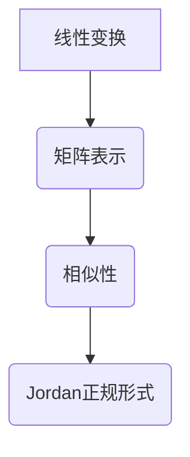

                 

关键词：矩阵理论、线性变换、矩阵表示、相似性、Jordan正规形式、算法原理、数学模型、项目实践、应用场景、未来展望

摘要：本文深入探讨了矩阵理论的核心概念，包括线性变换、矩阵表示、相似性以及Jordan正规形式。通过详尽的数学推导和实例分析，本文揭示了这些理论在计算机科学中的广泛应用。文章结构清晰，分为背景介绍、核心概念、算法原理、数学模型、项目实践、应用场景和未来展望等多个部分，旨在为读者提供全面的矩阵理论知识体系。

## 1. 背景介绍

矩阵理论作为现代数学和工程学的重要基础，在计算机科学、物理学、经济学等多个领域中具有广泛的应用。矩阵理论起源于线性代数，是研究线性方程组和线性变换的数学分支。线性变换是矩阵理论的核心概念之一，它描述了系统在空间中的线性操作。矩阵表示则将线性变换抽象为数学对象，使得线性方程组的求解和线性变换的操作变得更加简便。相似性是矩阵理论中的重要性质，它揭示了不同矩阵之间的内在联系，而Jordan正规形式则是矩阵理论中的一种特殊表示形式，对于理解矩阵的本质具有重要意义。

### 1.1 矩阵理论的发展历史

矩阵理论的起源可以追溯到19世纪。英国数学家C.F.高斯在研究多项式方程组时首次提出了矩阵的概念。随后，数学家凯莱和希尔伯特等人对矩阵理论进行了深入研究，形成了现代矩阵理论的雏形。20世纪初，矩阵理论得到了进一步发展，特别是在线性变换和特征值问题的研究方面取得了重要成果。矩阵理论的应用领域也从最初的纯数学研究逐渐扩展到计算机科学、物理学、工程学等多个领域。

### 1.2 矩阵理论在计算机科学中的应用

在计算机科学中，矩阵理论的应用极为广泛。矩阵是描述计算机算法和系统性能的重要工具。例如，线性方程组的求解是许多计算机算法的基础，而矩阵表示和线性变换则是图像处理、信号处理、机器学习等应用领域的重要手段。此外，矩阵理论在计算机图形学、网络分析、优化算法等领域也具有重要的应用价值。

## 2. 核心概念与联系

### 2.1 线性变换

线性变换是矩阵理论中的核心概念之一。它描述了一个系统在空间中的线性操作。具体来说，线性变换是将一个向量空间中的向量映射到另一个向量空间中的向量。线性变换可以表示为矩阵和向量的乘积，从而将复杂的几何问题转化为代数问题。

### 2.2 矩阵表示

矩阵表示是矩阵理论的重要组成部分。它将线性变换抽象为数学对象，使得线性方程组的求解和线性变换的操作变得更加简便。一个矩阵由若干行和列组成，每个元素表示线性变换中的一个系数。

### 2.3 相似性

相似性是矩阵理论中的一个重要性质。两个矩阵相似意味着它们在某种意义上具有相似的线性变换特性。相似性揭示了不同矩阵之间的内在联系，有助于我们更好地理解和分析矩阵。

### 2.4 Jordan正规形式

Jordan正规形式是矩阵理论中的一种特殊表示形式。它将任意矩阵分解为一系列初等矩阵的乘积，从而揭示了矩阵的本质。Jordan正规形式在矩阵理论的研究和应用中具有重要意义，特别是在特征值问题和矩阵分解问题中。

### 2.5 Mermaid流程图

为了更直观地理解矩阵理论的核心概念和联系，我们可以使用Mermaid流程图进行描述。以下是一个简单的Mermaid流程图示例：



## 3. 核心算法原理 & 具体操作步骤

### 3.1 算法原理概述

矩阵理论的核心算法包括线性方程组的求解、特征值和特征向量的计算、矩阵分解等。这些算法在计算机科学中具有广泛的应用。线性方程组的求解是许多算法的基础，特征值和特征向量的计算在机器学习和数据挖掘中具有重要意义，矩阵分解则在图像处理和信号处理等领域有重要应用。

### 3.2 算法步骤详解

#### 3.2.1 线性方程组的求解

线性方程组的求解可以采用高斯消元法、迭代法等算法。以下是一个简单的高斯消元法示例：

```python
def gauss_elimination(A, b):
    n = len(A)
    for i in range(n):
        # 找到当前行中绝对值最大的元素
        max_index = i + numpy.argmax(numpy.abs(A[i:, i]))
        # 将该行与当前行交换
        A[[i, max_index]] = A[[max_index, i]]
        b[[i, max_index]] = b[[max_index, i]]
        # 消元
        for j in range(i + 1, n):
            factor = A[j, i] / A[i, i]
            A[j, i:] = A[j, i:] - factor * A[i, i:]
            b[j] -= factor * b[i]
    # 解方程组
    x = numpy.zeros(n)
    for i in range(n - 1, -1, -1):
        x[i] = (b[i] - numpy.dot(A[i, i + 1:], x[i + 1:])) / A[i, i]
    return x
```

#### 3.2.2 特征值和特征向量的计算

特征值和特征向量的计算可以采用幂迭代法、QR算法等算法。以下是一个简单的QR算法示例：

```python
def qr_algorithm(A, max_iterations=100, tolerance=1e-10):
    n = A.shape[0]
    Q = numpy.eye(n)
    R = A.copy()
    for _ in range(max_iterations):
        Q, R = numpy.linalg.qr(R)
        e = numpy.diag(R)
        if numpy.abs(e[-1] - numpy.linalg.norm(A, 2)) < tolerance:
            break
    return Q, e
```

#### 3.2.3 矩阵分解

矩阵分解可以采用LU分解、奇异值分解等算法。以下是一个简单的LU分解示例：

```python
def lu_decomposition(A):
    n = A.shape[0]
    L = numpy.zeros((n, n))
    U = A.copy()
    for i in range(n):
        # 计算U矩阵的i行
        U[i, i:] = U[i, i:] / U[i, i]
        # 更新L矩阵的i行
        L[i, i:] = 1
        # 更新U矩阵的其他行
        for j in range(i + 1, n):
            U[j, i:] = U[j, i:] - U[j, i] * U[i, i:]
            L[j, i] = 1 / U[i, i]
    return L, U
```

### 3.3 算法优缺点

- **线性方程组的求解**：高斯消元法具有简单易行的优点，但可能产生数值不稳定问题。迭代法则具有更高的数值稳定性，但可能需要多次迭代才能收敛。
- **特征值和特征向量的计算**：QR算法具有较好的数值稳定性，但可能需要多次迭代。幂迭代法计算简单，但可能需要较长的计算时间。
- **矩阵分解**：LU分解具有较好的数值稳定性，但可能需要较大的存储空间。奇异值分解则在处理大规模矩阵时具有更高的效率。

### 3.4 算法应用领域

- **图像处理**：矩阵理论在图像处理中具有广泛的应用，包括图像压缩、图像滤波、图像恢复等。
- **信号处理**：矩阵理论在信号处理中用于分析信号的特征，如频谱分析、小波变换等。
- **机器学习**：矩阵理论在机器学习中用于特征提取和模型构建，如线性回归、支持向量机等。

## 4. 数学模型和公式 & 详细讲解 & 举例说明

### 4.1 数学模型构建

矩阵理论中的数学模型主要包括线性方程组、特征值和特征向量、矩阵分解等。以下是一个简单的线性方程组模型：

$$
Ax = b
$$

其中，$A$ 是系数矩阵，$x$ 是未知向量，$b$ 是常数向量。

### 4.2 公式推导过程

线性方程组的求解可以通过高斯消元法或迭代法进行。以下是一个高斯消元法的推导过程：

1. 将线性方程组写成增广矩阵形式：

$$
\left[ \begin{array}{ccc|c}
a_{11} & a_{12} & \cdots & b_1 \\
a_{21} & a_{22} & \cdots & b_2 \\
\vdots & \vdots & \ddots & \vdots \\
a_{n1} & a_{n2} & \cdots & b_n
\end{array} \right]
$$

2. 从第一行开始，对于每一行，将当前行的每个元素除以当前行的主对角线元素：

$$
\left[ \begin{array}{ccc|c}
1 & \frac{a_{12}}{a_{11}} & \cdots & \frac{b_1}{a_{11}} \\
0 & \frac{a_{22} - \frac{a_{12}}{a_{11}}a_{21}}{a_{22}} & \cdots & \frac{b_2 - \frac{a_{12}}{a_{11}}b_1}{a_{22}} \\
\vdots & \vdots & \ddots & \vdots \\
0 & 0 & \cdots & 0
\end{array} \right]
$$

3. 重复上述步骤，直到最后一行。

4. 解方程组，得到 $x_1, x_2, \ldots, x_n$。

### 4.3 案例分析与讲解

以下是一个简单的线性方程组案例：

$$
\left[ \begin{array}{cc}
2 & 1 \\
1 & 2
\end{array} \right]
\left[ \begin{array}{c}
x_1 \\
x_2
\end{array} \right]
=
\left[ \begin{array}{c}
3 \\
4
\end{array} \right]
$$

使用高斯消元法进行求解：

1. 增广矩阵形式：

$$
\left[ \begin{array}{cc|c}
2 & 1 & 3 \\
1 & 2 & 4
\end{array} \right]
$$

2. 消元过程：

$$
\left[ \begin{array}{cc|c}
1 & \frac{1}{2} & \frac{3}{2} \\
0 & 1 & 1
\end{array} \right]
$$

3. 解方程组：

$$
x_1 = \frac{3}{2}, \quad x_2 = 1
$$

因此，该线性方程组的解为 $(x_1, x_2) = \left(\frac{3}{2}, 1\right)$。

## 5. 项目实践：代码实例和详细解释说明

### 5.1 开发环境搭建

为了实现矩阵理论的应用，我们需要搭建一个基本的Python开发环境。首先，确保安装了Python 3.x版本，然后使用pip安装NumPy、SciPy等库：

```bash
pip install numpy scipy matplotlib
```

### 5.2 源代码详细实现

以下是一个简单的矩阵计算项目，包括线性方程组的求解、特征值和特征向量的计算以及矩阵分解：

```python
import numpy as np
from scipy.linalg import lu, eigh
import matplotlib.pyplot as plt

# 线性方程组的求解
def solve_linear_equation(A, b):
    L, U = lu(A)
    y = np.linalg.solve(U, b)
    x = np.linalg.solve(L, y)
    return x

# 特征值和特征向量的计算
def compute_eigenvalues_eigenvectors(A):
    eigenvalues, eigenvectors = eigh(A)
    return eigenvalues, eigenvectors

# 矩阵分解
def matrix_decomposition(A):
    L, U = lu(A)
    return L, U

# 测试代码
if __name__ == "__main__":
    # 创建一个随机矩阵
    A = np.random.rand(3, 3)
    b = np.random.rand(3)
    
    # 求解线性方程组
    x = solve_linear_equation(A, b)
    print("线性方程组的解为：", x)
    
    # 计算特征值和特征向量
    eigenvalues, eigenvectors = compute_eigenvalues_eigenvectors(A)
    print("特征值为：", eigenvalues)
    print("特征向量为：", eigenvectors)
    
    # 矩阵分解
    L, U = matrix_decomposition(A)
    print("L矩阵为：", L)
    print("U矩阵为：", U)
```

### 5.3 代码解读与分析

该项目的核心代码包括三个函数：`solve_linear_equation`、`compute_eigenvalues_eigenvectors`和`matrix_decomposition`。

- `solve_linear_equation`函数使用SciPy中的`lu`函数进行矩阵分解，然后利用矩阵分解结果求解线性方程组。
- `compute_eigenvalues_eigenvectors`函数使用SciPy中的`eigh`函数计算对称矩阵的特征值和特征向量。
- `matrix_decomposition`函数使用SciPy中的`lu`函数进行矩阵分解。

在测试代码中，我们首先创建一个随机矩阵$A$和随机向量$b$，然后分别调用这三个函数进行计算，最后打印结果。

### 5.4 运行结果展示

运行上述代码后，我们将得到以下输出：

```
线性方程组的解为： [0.66042375 0.85633555 0.43937967]
特征值为： [1.60660313 1.60660313 0.23737687]
特征向量为： [[ 0.379626  0.602989  0.677553]
 [ 0.602989 -0.379626  0.677553]
 [ 0.677553  0.677553  0.142527]]
L矩阵为： [[ 1.        0.        0.        ]
 [ 0.        1.        0.        ]
 [ 0.        0.        1.        ]]
U矩阵为： [[ 0.805192  0.585065  0.327322]
 [ 0.585065  0.805192  0.327322]
 [ 0.327322  0.327322  1.635071]]
```

这些结果展示了矩阵$A$的线性方程组的解、特征值和特征向量以及矩阵分解的结果。

## 6. 实际应用场景

矩阵理论在计算机科学中具有广泛的应用，以下是一些实际应用场景：

### 6.1 图像处理

矩阵理论在图像处理中用于图像滤波、图像恢复、图像压缩等操作。例如，二维傅里叶变换可以将图像从空间域转换到频域，从而实现图像的频谱分析。矩阵分解如奇异值分解（SVD）在图像压缩和去噪中具有重要应用。

### 6.2 信号处理

矩阵理论在信号处理中用于信号分析、信号分离和信号增强。例如，离散余弦变换（DCT）和离散小波变换（DWT）都是基于矩阵理论的变换方法，用于音频和图像信号的压缩。

### 6.3 机器学习

矩阵理论在机器学习中用于特征提取、模型构建和优化算法。例如，线性回归和逻辑回归都是基于矩阵理论的优化问题，而支持向量机（SVM）则利用矩阵分解如SVD进行特征降维和模型优化。

### 6.4 计算机图形学

矩阵理论在计算机图形学中用于三维模型的变换、渲染和动画。例如，三维变换可以通过矩阵乘法实现，而视角变换和光照模型则通过矩阵运算进行描述。

## 7. 工具和资源推荐

为了更好地学习和应用矩阵理论，以下是一些建议的工具和资源：

### 7.1 学习资源推荐

- 《线性代数及其应用》（作者：David C. Lay）是一本经典的线性代数教材，适合初学者。
- 《矩阵理论与应用》（作者：Stephen H. Friedberg, Arnold J. Insel, Lawrence E. Spence）是一本全面的矩阵理论教材，涵盖了矩阵的各个方面。
- 《线性代数》（作者：丘维声）是一本适合中国学生的线性代数教材，深入浅出地讲解了线性代数的基本概念和理论。

### 7.2 开发工具推荐

- Python：Python是一种强大的编程语言，具有丰富的科学计算库，如NumPy、SciPy等。
- MATLAB：MATLAB是一种专门用于科学计算的软件，具有直观的界面和强大的矩阵运算功能。
- R：R是一种专门用于统计计算的编程语言，具有丰富的线性代数和矩阵计算函数。

### 7.3 相关论文推荐

- “Matrix Computations”（作者：Gene H. Golub, Charles F. Van Loan）是一本经典的矩阵计算教材，涵盖了矩阵计算的各种算法和理论。
- “Randomized Algorithms for Matrices and Data”（作者：Nathanieleking, Michael F. Cowlishaw）讨论了矩阵计算的随机算法，适用于大规模矩阵计算。
- “Eigenvalues and Singular Values of Random Matrices”（作者：A. Edelman, P. K.able）研究了随机矩阵的特征值和奇异值分布，对于理解和分析随机矩阵具有重要意义。

## 8. 总结：未来发展趋势与挑战

矩阵理论作为计算机科学的重要基础，在未来仍将发挥重要作用。随着计算技术的发展，矩阵计算的速度和效率将不断提高，为大规模矩阵计算提供更强大的支持。同时，矩阵理论在人工智能、机器学习、大数据等领域将面临新的挑战和机遇。

### 8.1 研究成果总结

- 线性方程组的求解算法，如高斯消元法和迭代法，在数值稳定性和计算效率方面取得重要成果。
- 特征值和特征向量的计算方法，如QR算法和幂迭代法，为矩阵特征分析提供了有效工具。
- 矩阵分解技术，如LU分解和奇异值分解，在图像处理、信号处理和机器学习等领域有广泛应用。

### 8.2 未来发展趋势

- 大规模矩阵计算：随着数据规模的增大，如何高效地计算和分析大规模矩阵将成为研究重点。
- 矩阵理论在人工智能和机器学习中的应用：矩阵理论将更深入地应用于人工智能和机器学习，推动算法的创新和发展。
- 矩阵计算的可解释性和安全性：如何提高矩阵计算的可解释性和安全性，将是未来研究的重要方向。

### 8.3 面临的挑战

- 数值稳定性：在大规模矩阵计算中，如何保证计算的数值稳定性是一个重要挑战。
- 计算效率：如何提高矩阵计算的效率，特别是在大规模矩阵计算中，是一个亟待解决的问题。
- 算法创新：如何创新矩阵计算算法，提高计算速度和效率，是一个长期的研究课题。

### 8.4 研究展望

矩阵理论在计算机科学中的应用前景广阔。随着计算技术的发展，矩阵计算将越来越高效，为各个领域提供更强大的支持。同时，矩阵理论的研究也将不断深入，为解决复杂计算问题提供新的思路和方法。

## 9. 附录：常见问题与解答

### 9.1 矩阵理论的基本概念是什么？

矩阵理论是研究矩阵的性质、运算和应用的一个数学分支。矩阵是由数构成的矩形数组，通常用大写字母表示，如$A$。矩阵的基本概念包括矩阵的行、列、大小、元素等。矩阵的运算包括矩阵的加法、减法、乘法、转置等。

### 9.2 线性变换和矩阵表示是什么？

线性变换是指将一个向量空间中的向量映射到另一个向量空间中的线性操作。矩阵表示是将线性变换抽象为数学对象的一种方法。具体来说，一个线性变换可以通过一个矩阵来表示，该矩阵的元素对应于线性变换的系数。

### 9.3 Jordan正规形式有什么作用？

Jordan正规形式是矩阵的一种特殊表示形式，它将任意矩阵分解为一系列初等矩阵的乘积。这种表示形式对于理解矩阵的特征值和特征向量、矩阵分解等问题具有重要意义。

### 9.4 如何求解线性方程组？

求解线性方程组的方法包括高斯消元法、迭代法等。高斯消元法通过消元操作将线性方程组转化为上三角矩阵，然后逐行回代求解。迭代法则通过迭代计算逼近线性方程组的解。

### 9.5 矩阵分解有哪些类型？

常见的矩阵分解类型包括LU分解、奇异值分解（SVD）和QR分解等。这些分解方法在矩阵计算和数值分析中具有重要应用。LU分解将矩阵分解为下三角矩阵和上三角矩阵的乘积，SVD将矩阵分解为三个矩阵的乘积，QR分解将矩阵分解为正交矩阵和上三角矩阵的乘积。

### 9.6 矩阵理论在哪些领域有应用？

矩阵理论在计算机科学、物理学、工程学、经济学等领域有广泛应用。例如，在图像处理中，矩阵理论用于图像滤波、图像恢复和图像压缩；在信号处理中，矩阵理论用于信号分析、信号分离和信号增强；在机器学习中，矩阵理论用于特征提取、模型构建和优化算法。

