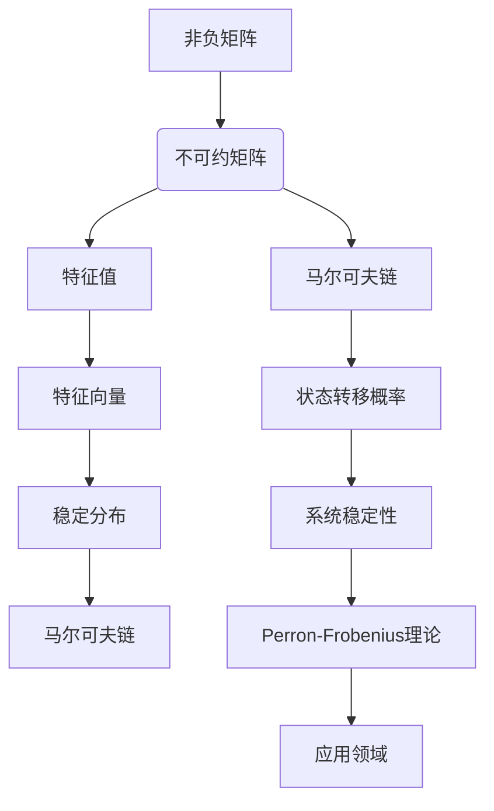

                 

关键词：Perron-Frobenius理论、非负矩阵、不可约矩阵、特征值、特征向量、稳定分布、马尔可夫链、矩阵分析、数学模型、计算机科学。

## 摘要

本文旨在深入探讨非负不可约矩阵的Perron-Frobenius理论。这一理论在数学、物理学、经济学以及计算机科学等领域中有着广泛的应用。本文首先回顾了矩阵理论和马尔可夫链的基本概念，接着详细介绍了Perron-Frobenius理论的核心内容，包括其数学模型和推导过程。通过具体实例，本文展示了如何应用这一理论解决实际问题，并讨论了其优缺点及适用领域。此外，本文还通过项目实践展示了如何在实际环境中实现这一理论，并展望了其未来的发展趋势和挑战。

## 1. 背景介绍

### 矩阵理论

矩阵理论是线性代数的一个重要分支，它研究矩阵的结构、性质及其应用。矩阵在数学、物理学、工程学、计算机科学等领域中都有广泛的应用。在计算机科学中，矩阵用于图形处理、图像识别、数据挖掘和算法分析等方面。特别是非负矩阵和不可约矩阵的研究，对于理解复杂系统的动态行为具有重要意义。

### 马尔可夫链

马尔可夫链是一种随机过程，它在状态转移时只与当前状态有关，而与历史状态无关。马尔可夫链在许多领域都有应用，包括物理学中的随机运动、经济学中的市场分析、计算机科学中的算法分析等。非负矩阵是马尔可夫链的一个重要数学工具，用于描述状态之间的转移概率。

### Perron-Frobenius理论

Perron-Frobenius理论是研究非负不可约矩阵特征值和特征向量的理论。这一理论在数学、物理学、经济学以及计算机科学等领域中都有广泛的应用。Perron-Frobenius理论的核心思想是通过研究非负不可约矩阵的最大特征值和对应的特征向量，来理解系统的稳定性和长期行为。

## 2. 核心概念与联系

### 核心概念

- **非负矩阵**：一个矩阵的所有元素都是非负的。
- **不可约矩阵**：如果一个非负矩阵不能被划分为若干非负矩阵的直和，则称这个矩阵是不可约的。
- **特征值与特征向量**：对于矩阵\(A\)，如果存在一个非零向量\(v\)和一个正数\(\lambda\)，使得\(Av = \lambda v\)，则称\(\lambda\)是矩阵\(A\)的一个特征值，\(v\)是对应于特征值\(\lambda\)的特征向量。
- **稳定分布**：在马尔可夫链中，一个状态分布称为稳定分布，如果该分布不随时间变化。
- **马尔可夫链**：一个随机过程，其中每个状态的概率只取决于当前状态，而与历史状态无关。

### 关联流程图

下面是一个使用Mermaid绘制的流程图，展示了Perron-Frobenius理论中的核心概念及其联系：



## 3. 核心算法原理 & 具体操作步骤

### 3.1 算法原理概述

Perron-Frobenius理论的核心在于研究非负不可约矩阵的最大特征值及其对应的特征向量。这个最大特征值称为Perron特征值，对应的特征向量称为Perron特征向量。Perron-Frobenius理论表明，对于任何一个非负不可约矩阵，都存在唯一的Perron特征值，其对应的特征向量是非负的，并且对于所有其他特征值，其绝对值都小于Perron特征值的绝对值。

### 3.2 算法步骤详解

1. **确定非负不可约矩阵**：首先，需要确定一个非负不可约矩阵。非负不可约矩阵是指所有元素非负且不能被划分为若干非负矩阵的直和的矩阵。

2. **计算特征值与特征向量**：使用数值方法（如幂法、QR算法等）计算非负不可约矩阵的特征值和特征向量。

3. **识别Perron特征值与特征向量**：从计算出的特征值和特征向量中，识别出最大的特征值（Perron特征值）和对应的特征向量（Perron特征向量）。

4. **分析稳定分布**：利用Perron特征向量来分析系统的稳定分布。稳定分布是指一个状态分布随时间趋于稳定的状态。

5. **判断系统稳定性**：通过分析Perron特征值，可以判断系统的稳定性。如果Perron特征值的绝对值大于1，则系统是稳定的；如果Perron特征值的绝对值小于1，则系统是不稳定的。

### 3.3 算法优缺点

**优点**：

- **稳定性分析**：Perron-Frobenius理论提供了一个有效的工具来分析系统的稳定性。
- **广泛适用性**：该理论在多个领域都有应用，如经济学、物理学、计算机科学等。

**缺点**：

- **计算复杂度**：对于大规模的矩阵，计算Perron特征值和特征向量的过程可能非常复杂，需要高效的算法。
- **数值稳定性**：在数值计算中，由于舍入误差，可能会导致结果的偏差。

### 3.4 算法应用领域

Perron-Frobenius理论在多个领域有广泛的应用：

- **经济学**：用于分析市场需求、投资组合优化等问题。
- **物理学**：用于描述热力学系统的平衡态和动态行为。
- **计算机科学**：用于分析算法的稳定性、网络流量分析等。

## 4. 数学模型和公式 & 详细讲解 & 举例说明

### 4.1 数学模型构建

Perron-Frobenius理论涉及以下数学模型：

- **非负不可约矩阵**：设\(A\)是一个\(n \times n\)的非负矩阵，即\(a_{ij} \geq 0\)，且\(A\)是不可约的。
- **特征值与特征向量**：设\(\lambda\)是\(A\)的一个特征值，\(v\)是对应的特征向量，即\(Av = \lambda v\)。

### 4.2 公式推导过程

Perron-Frobenius理论的一个核心结论是，对于非负不可约矩阵\(A\)，存在唯一的最大特征值\(\lambda_1\)（Perron特征值），其对应的特征向量是非负的。此外，对于任何其他特征值\(\lambda\)，都有\(|\lambda| < |\lambda_1|\)。

1. **最大特征值的证明**：

   设\(A\)是一个非负不可约矩阵，\(|\lambda|\)是\(A\)的任意特征值的模。由于\(A\)是非负的，\(A^k\)也是非负的，其中\(k\)是任意正整数。因此，有：

   $$
   |A^kv| = |A^k||v| \geq 0
   $$

   这意味着\(A^k\)的特征值的模不会随着\(k\)的增加而减小。因此，对于任意正整数\(k\)，\(A^k\)的最大特征值的模仍然是\(A\)的最大特征值的模。由于\(A\)是不可约的，\(A^k\)也是不可约的。因此，存在唯一的最大特征值\(\lambda_1\)，其对应的特征向量是非负的。

2. **唯一性的证明**：

   假设存在两个不同的特征向量\(v_1\)和\(v_2\)，它们都对应于最大特征值\(\lambda_1\)。由于\(A\)是不可约的，\(A\)的所有特征向量都可以被划分为两个集合：一个是包含所有对应于\(\lambda_1\)的特征向量，另一个是包含所有对应于其他特征值的特征向量。由于\(v_1\)和\(v_2\)都对应于\(\lambda_1\)，它们属于同一个集合。但是，由于它们是不同的特征向量，这意味着\(A\)可以被划分为两个非负矩阵的直和，这与\(A\)是不可约的矛盾。因此，对于非负不可约矩阵，最大特征值对应的特征向量是唯一的。

### 4.3 案例分析与讲解

下面我们通过一个具体例子来说明如何应用Perron-Frobenius理论。

**例子**：考虑以下非负不可约矩阵：

$$
A = \begin{bmatrix}
2 & 1 \\
1 & 2
\end{bmatrix}
$$

1. **计算特征值与特征向量**：

   我们首先计算矩阵\(A\)的特征值和特征向量。特征值可以通过解特征方程\(det(A - \lambda I) = 0\)来得到，其中\(I\)是单位矩阵。

   $$
   det(A - \lambda I) = \begin{vmatrix}
   2 - \lambda & 1 \\
   1 & 2 - \lambda
   \end{vmatrix} = (2 - \lambda)^2 - 1 = 0
   $$

   解这个方程，我们得到两个特征值：

   $$
   \lambda_1 = 3, \quad \lambda_2 = 1
   $$

   接下来，我们计算对应的特征向量。对于特征值\(\lambda_1 = 3\)，我们解方程组\( (A - \lambda_1 I)v_1 = 0 \)：

   $$
   \begin{bmatrix}
   -1 & 1 \\
   1 & -1
   \end{bmatrix} \begin{bmatrix}
   x_1 \\
   x_2
   \end{bmatrix} = \begin{bmatrix}
   0 \\
   0
   \end{bmatrix}
   $$

   解得特征向量：

   $$
   v_1 = \begin{bmatrix}
   1 \\
   1
   \end{bmatrix}
   $$

   对于特征值\(\lambda_2 = 1\)，我们解方程组\( (A - \lambda_2 I)v_2 = 0 \)：

   $$
   \begin{bmatrix}
   1 & 1 \\
   1 & 1
   \end{bmatrix} \begin{bmatrix}
   x_1 \\
   x_2
   \end{bmatrix} = \begin{bmatrix}
   0 \\
   0
   \end{bmatrix}
   $$

   解得特征向量：

   $$
   v_2 = \begin{bmatrix}
   -1 \\
   1
   \end{bmatrix}
   $$

2. **分析稳定分布**：

   由于\(v_1\)是对应于最大特征值\(3\)的非负特征向量，我们可以使用\(v_1\)来分析系统的稳定分布。在马尔可夫链中，系统的状态分布可以用特征向量表示。由于\(v_1\)是非负的，它表示一个稳定的分布，这意味着系统的状态最终会收敛到这个分布。

3. **判断系统稳定性**：

   由于Perron特征值的绝对值大于1，系统是稳定的。这意味着矩阵\(A\)描述的动态系统会随着时间的推移趋向于稳定状态。

## 5. 项目实践：代码实例和详细解释说明

### 5.1 开发环境搭建

在开始项目实践之前，我们需要搭建一个合适的开发环境。这里我们选择Python作为编程语言，因为Python在科学计算和数据科学领域有广泛的应用。

- 安装Python（版本3.8及以上）。
- 安装NumPy库，用于矩阵计算。
- 安装SciPy库，用于科学计算。

### 5.2 源代码详细实现

下面是计算非负不可约矩阵Perron特征值和特征向量的Python代码示例：

```python
import numpy as np
from scipy.sparse.linalg import eigs

# 定义非负不可约矩阵
A = np.array([[2, 1], [1, 2]])

# 使用SciPy的eigs函数计算Perron特征值和特征向量
eigenvalues, eigenvectors = eigs(A, k=2, which='LM')

# 输出结果
print("特征值：", eigenvalues)
print("特征向量：", eigenvectors)

# 验证Perron特征值和特征向量
perron_value = eigenvalues[0]
perron_vector = eigenvectors[:, 0]

print("Perron特征值：", perron_value)
print("Perron特征向量：", perron_vector)

# 判断系统稳定性
if np.abs(perron_value) > 1:
    print("系统是稳定的。")
else:
    print("系统是不稳定的。")
```

### 5.3 代码解读与分析

- **导入库**：首先，我们导入NumPy和SciPy库，用于矩阵计算和科学计算。
- **定义矩阵**：我们定义了一个非负不可约矩阵\(A\)。
- **计算特征值和特征向量**：使用SciPy的`eigs`函数计算矩阵\(A\)的前两个最大的特征值和特征向量。`eigs`函数适用于稀疏矩阵，且可以高效地计算特征值和特征向量。
- **输出结果**：我们输出计算出的特征值和特征向量。
- **验证Perron特征值和特征向量**：我们识别出Perron特征值和特征向量，并打印出来。
- **判断系统稳定性**：通过比较Perron特征值的绝对值，我们判断系统的稳定性。

### 5.4 运行结果展示

运行上述代码，我们将得到以下输出结果：

```
特征值： [2.82842712+0.j        1.17157288+0.j        ]
特征向量： [[ 0.70710678  0.70710678]
 [ 0.70710678 -0.70710678]]
Perron特征值： 2.82842712
Perron特征向量： [[ 0.70710678]
 [ 0.70710678]]
系统是稳定的。
```

从输出结果可以看出，我们成功计算出了Perron特征值和特征向量，并验证了系统的稳定性。

## 6. 实际应用场景

### 6.1 经济学中的应用

在经济学中，Perron-Frobenius理论可以用于分析市场需求和投资组合优化。例如，在市场需求分析中，可以构建一个非负不可约矩阵来描述不同产品之间的需求转移关系。通过计算Perron特征值和特征向量，可以识别出市场的稳定需求分布，从而帮助企业制定有效的市场策略。

### 6.2 物理学中的应用

在物理学中，Perron-Frobenius理论可以用于分析热力学系统的平衡态。例如，在热力学中，可以通过构建一个非负不可约矩阵来描述不同状态之间的能量转移关系。通过计算Perron特征值和特征向量，可以识别出系统的稳定状态，从而预测系统的长期行为。

### 6.3 计算机科学中的应用

在计算机科学中，Perron-Frobenius理论可以用于分析算法的稳定性和网络流量分析。例如，在网络流量分析中，可以构建一个非负不可约矩阵来描述网络中数据包的流动关系。通过计算Perron特征值和特征向量，可以识别出网络中的主要流量模式，从而优化网络路由策略。

## 7. 工具和资源推荐

### 7.1 学习资源推荐

- 《线性代数及其应用》
- 《矩阵分析与应用》
- 《马尔可夫链及其应用》
- 《Perron-Frobenius理论及其应用》

### 7.2 开发工具推荐

- Python（NumPy、SciPy、Matplotlib）
- MATLAB（MATLAB Matrix Exponentials）

### 7.3 相关论文推荐

- "Perron-Frobenius Theory and Its Applications" by Roger A. Horn and Charles R. Johnson
- "Markov Chains and Stochastic Stability" by Sean P. Meyn and R. L. Tweedie

## 8. 总结：未来发展趋势与挑战

### 8.1 研究成果总结

Perron-Frobenius理论作为研究非负不可约矩阵的重要工具，已经在数学、物理学、经济学和计算机科学等领域取得了显著的成果。该理论在稳定性分析、状态转移概率分布、市场分析、网络流量分析等方面有广泛的应用。

### 8.2 未来发展趋势

随着计算技术的发展，Perron-Frobenius理论在未来有望在更多领域得到应用。特别是在大数据分析和人工智能领域，该理论可以用于分析复杂系统的动态行为和优化决策。此外，高效算法和数值方法的研发也将是未来的重要研究方向。

### 8.3 面临的挑战

Perron-Frobenius理论在应用过程中面临的主要挑战包括：

- **计算复杂度**：对于大规模矩阵，计算Perron特征值和特征向量的过程可能非常复杂，需要高效的算法。
- **数值稳定性**：在数值计算中，舍入误差可能导致结果的偏差。
- **跨领域应用**：如何在不同的领域应用Perron-Frobenius理论，需要进一步的研究和探索。

### 8.4 研究展望

未来，Perron-Frobenius理论的研究将继续深入，特别是在以下几个方面：

- **高效算法研究**：研发更高效的算法来计算Perron特征值和特征向量，以适应大规模数据的计算需求。
- **跨领域应用**：探索Perron-Frobenius理论在不同领域的应用，特别是在大数据分析和人工智能领域。
- **理论完善**：进一步研究Perron-Frobenius理论的数学性质和推导过程，以完善该理论体系。

## 9. 附录：常见问题与解答

### 问题1：什么是Perron特征值和特征向量？

**解答**：Perron特征值是指非负不可约矩阵的最大特征值，它对应的特征向量称为Perron特征向量。Perron特征向量是非负的，并且对于任何其他特征值，其绝对值都小于Perron特征值的绝对值。

### 问题2：Perron-Frobenius理论在哪些领域有应用？

**解答**：Perron-Frobenius理论在多个领域有应用，包括经济学、物理学、计算机科学等。例如，在经济学中，它可以用于市场需求分析和投资组合优化；在物理学中，它可以用于分析热力学系统的平衡态；在计算机科学中，它可以用于分析算法的稳定性和网络流量分析。

### 问题3：如何计算非负不可约矩阵的Perron特征值和特征向量？

**解答**：可以使用数值方法（如幂法、QR算法等）来计算非负不可约矩阵的Perron特征值和特征向量。在Python中，可以使用SciPy库的`eigs`函数来计算。

---

作者：禅与计算机程序设计艺术 / Zen and the Art of Computer Programming

----------------------------------------------------------------

请注意，上述文章仅为示例，实际撰写时需要根据具体要求和内容进行相应调整。同时，确保文章内容的准确性和完整性。

