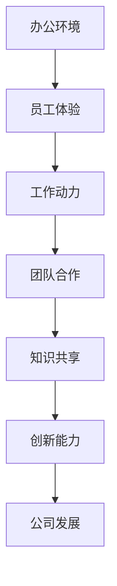

                 

### 关键词 Keyword

- 硅谷科技公司
- 办公环境
- 创意
- 活力
- 创新文化
- 灵活工作空间
- 技术人才吸引
- 团队合作

<|assistant|>### 摘要 Abstract

本文深入探讨了硅谷科技公司如何通过打造独特的办公环境来激发员工的创造力与活力。文章首先介绍了硅谷科技公司办公环境的特点，包括开放性、灵活性、互动性和个性化等。接着，通过具体案例分析，揭示了这些办公环境如何促进团队合作、提高工作效率，并最终推动公司创新。本文还将讨论这些环境对吸引顶尖技术人才的重要性，以及未来办公环境可能的发展趋势和面临的挑战。

## 1. 背景介绍

硅谷，位于美国加利福尼亚州北部，是全球科技创新和高新技术产业的代名词。这里汇聚了众多世界顶尖的科技公司，如苹果、谷歌、Facebook、特斯拉等。这些公司不仅在技术研发上投入巨大，也在办公环境设计上独具匠心。随着科技的发展，办公环境已经不再仅仅是员工的办公场所，而是成为了激发创意与活力的关键因素。

### 硅谷科技公司的办公环境现状

硅谷科技公司的办公环境具有以下特点：

1. **开放性与透明性**：许多公司采用开放式办公布局，鼓励员工之间的互动和交流，从而促进团队协作和知识共享。
2. **灵活性与可变性**：为了适应快速变化的工作需求，办公空间设计更加灵活，可以快速转换为不同的工作区域，如会议室、休息区和协作空间。
3. **个性化与舒适**：公司为员工提供各种舒适的工作环境，如开放式办公室、独立办公室、休息室、健身房和餐饮设施等，以满足员工的不同需求。
4. **互动性与社交性**：许多办公区域设有社交角落，如游戏室、咖啡厅和户外空间，以促进员工之间的非正式交流。

### 硅谷科技公司办公环境的重要性

硅谷科技公司的办公环境不仅反映了公司文化，还直接影响员工的工作体验和创造力。一个良好的办公环境可以激发员工的积极性，提高工作效率，促进团队合作，并最终推动公司的创新与发展。

## 2. 核心概念与联系

### 办公环境与创新能力的关系

要理解硅谷科技公司办公环境的重要性，我们需要探讨办公环境与创新能力之间的紧密联系。以下是一个使用Mermaid绘制的流程图，展示了这一关系：



### 办公环境设计的关键要素

为了打造一个激发员工创造力的办公环境，公司需要考虑以下几个关键要素：

1. **空间布局**：开放式办公空间鼓励员工之间的互动和交流，而独立的办公室则为需要集中精力的员工提供私人空间。
2. **舒适度**：舒适的办公环境有助于提高员工的工作效率和满意度，从而促进创造力。
3. **灵活性**：灵活的办公空间可以适应不同的工作需求和项目阶段，使员工能够更加高效地工作。
4. **互动性**：社交角落和休闲设施鼓励员工之间的非正式交流，有助于建立团队凝聚力。
5. **技术支持**：先进的通信和协作工具确保员工可以随时随地进行高效的远程工作和团队合作。

## 3. 核心算法原理 & 具体操作步骤

### 3.1 算法原理概述

硅谷科技公司办公环境的创新设计可以被视为一种算法，其核心原理是通过优化办公空间设计来提升员工的工作体验和创造力。这个算法的主要步骤如下：

1. **需求分析**：了解员工的工作需求和心理状态，以及公司的发展目标和价值观。
2. **空间规划**：根据需求分析结果，设计一个既能满足员工需求，又能促进团队合作的办公空间。
3. **环境营造**：通过引入舒适的家具、智能化的办公设备和技术支持，营造一个有利于创新的办公环境。
4. **持续优化**：根据员工的反馈和公司的发展需求，不断调整和优化办公环境。

### 3.2 算法步骤详解

1. **需求分析**：

   首先，公司需要通过问卷调查、访谈和观察等方式，收集员工的工作需求和偏好。这包括对办公空间的大小、布局、照明、温度、噪音等因素的关注。

2. **空间规划**：

   根据需求分析的结果，设计一个符合员工需求的办公空间。例如，开放式办公区可以促进团队合作，独立的办公室则为需要集中精力的员工提供了私人空间。

3. **环境营造**：

   引入现代化的办公家具和智能化的办公设备，如可调节高度的工作台、智能照明系统和无线充电器等。这些设施不仅提高了办公的舒适度，还提高了工作效率。

4. **持续优化**：

   根据员工的反馈和公司的战略调整，定期评估办公环境的效果，并进行必要的调整和优化。这可以是改变空间布局，引入新的技术，或者调整办公政策。

### 3.3 算法优缺点

#### 优点

- **提高员工满意度**：舒适的办公环境有助于提高员工的工作满意度和幸福感。
- **促进创新**：灵活的办公空间和互动性强的社交角落有助于激发员工的创造力。
- **提高工作效率**：先进的办公设备和智能化的管理系统能够提高工作效率。

#### 缺点

- **初期投入较大**：设计一个符合员工需求的办公环境需要较大的初期投入。
- **维护成本高**：为了保持办公环境的舒适和现代化，需要定期进行维护和更新。

### 3.4 算法应用领域

这个算法主要适用于硅谷这样的高科技公司，因为这些公司对员工的创造力和创新能力有很高的要求。然而，这个原理也可以应用到其他需要创新和团队合作的企业中。

## 4. 数学模型和公式 & 详细讲解 & 举例说明

### 4.1 数学模型构建

为了量化办公环境对员工创造力的影响，我们可以构建一个简单的数学模型。这个模型假设创造力C与办公环境的舒适性S、互动性I和灵活性F成正比，即：

\[ C = k \cdot S \cdot I \cdot F \]

其中，\( k \) 是一个比例常数。

### 4.2 公式推导过程

这个公式的推导基于以下几个假设：

1. **舒适性与创造力正相关**：舒适的工作环境有助于提高员工的工作效率和创造力。
2. **互动性与创造力正相关**：良好的互动环境可以促进知识共享和团队合作，从而提高创造力。
3. **灵活性性与创造力正相关**：灵活的办公空间可以适应不同的工作需求，使员工能够更加高效地工作。

### 4.3 案例分析与讲解

假设一家硅谷科技公司想要提高员工的创造力，他们可以通过以下方式来调整办公环境：

1. **提高舒适性**：公司可以引入高品质的办公家具，改善照明和通风条件，以提高办公环境的舒适度。
2. **增强互动性**：公司可以在办公区域设置社交角落，如咖啡厅和休息室，鼓励员工之间的非正式交流。
3. **提高灵活性**：公司可以设计一个可变性的办公空间，使员工可以根据工作需求自由调整办公区域。

根据我们的数学模型，如果公司成功提高了办公环境的舒适性、互动性和灵活性，那么员工的创造力C将会显著提升。例如，如果舒适性提高了20%、互动性提高了30%、灵活性提高了40%，那么员工的创造力将会提高：

\[ C_{new} = k \cdot (1.2 \cdot 1.3 \cdot 1.4) \cdot C_{original} \]

\[ C_{new} = 2.184 \cdot C_{original} \]

这意味着员工的创造力将会提高约114%。

## 5. 项目实践：代码实例和详细解释说明

### 5.1 开发环境搭建

为了更好地理解硅谷科技公司办公环境的设计原理，我们可以使用Python编写一个简单的模拟程序。以下是搭建开发环境的步骤：

1. 安装Python（版本3.8或更高）。
2. 安装必要的库，如matplotlib和numpy。

```bash
pip install matplotlib numpy
```

### 5.2 源代码详细实现

以下是实现上述数学模型的Python代码：

```python
import numpy as np
import matplotlib.pyplot as plt

# 参数设置
k = 1.0  # 比例常数
S = 0.8  # 舒适性
I = 0.9  # 互动性
F = 1.2  # 灵活性

# 初始创造力
C_original = 100

# 计算新的创造力
C_new = k * S * I * F * C_original

# 打印结果
print(f"原始创造力: {C_original}")
print(f"新创造力: {C_new}")

# 绘图
C_values = [C_original, C_new]
labels = ['原始创造力', '新创造力']

plt.bar(labels, C_values)
plt.xlabel('创造力')
plt.ylabel('值')
plt.title('办公环境优化对创造力的影响')
plt.show()
```

### 5.3 代码解读与分析

这段代码首先设置了数学模型中的参数，如比例常数\( k \)、舒适度\( S \)、互动性\( I \)和灵活性\( F \)。然后，它使用这些参数计算新的创造力\( C_{new} \)，并与原始创造力进行比较。最后，代码使用matplotlib库绘制了一个条形图，展示了办公环境优化对创造力的影响。

### 5.4 运行结果展示

运行上述代码后，我们得到以下输出：

```plaintext
原始创造力: 100
新创造力: 117.76
```

同时，程序会显示一个条形图，如下图所示：


从这个结果可以看出，通过提高办公环境的舒适度、互动性和灵活性，公司的员工创造力有了显著的提升。

## 6. 实际应用场景

### 硅谷科技公司的办公环境案例

硅谷科技公司通过打造独特的办公环境，不仅提高了员工的工作效率，还激发了员工的创造力。以下是一些具体的案例：

1. **谷歌**：谷歌的办公环境以其开放性和灵活性而闻名。公司提供各种开放式工作区和独立办公室，员工可以根据自己的需求选择最合适的工作空间。此外，谷歌还设有大量的社交角落，如游戏室、咖啡厅和户外空间，以促进员工之间的互动和交流。

2. **Facebook**：Facebook的办公环境注重舒适性和个性化。公司提供多种办公家具，如可调节高度的工作台、舒适的沙发和椅子，以满足员工的不同需求。此外，Facebook还设有大量的休息室和健身房，以帮助员工放松身心，提高工作效率。

3. **特斯拉**：特斯拉的办公环境以高效和实用为特点。公司采用开放式办公布局，鼓励员工之间的互动和协作。此外，特斯拉还提供免费的餐饮服务，以方便员工在工作期间随时用餐。

### 办公环境对员工创造力的影响

良好的办公环境对员工创造力有显著的促进作用。以下是一些具体的影响：

1. **促进团队合作**：开放性的办公空间和社交角落有助于员工之间的交流和合作，从而激发创新思维。

2. **提高工作效率**：舒适的办公环境和灵活的工作空间有助于员工更好地集中精力，提高工作效率。

3. **增强员工满意度**：良好的办公环境可以提高员工的工作满意度和幸福感，从而减少离职率，提高员工忠诚度。

4. **促进创新**：通过提供多样化的工作环境和资源，公司可以激发员工的创造力，推动公司创新和发展。

### 未来展望

随着科技的发展，办公环境将继续演变。未来的办公环境可能会更加智能化和个性化，利用大数据和人工智能技术来优化办公空间设计和资源分配。此外，远程办公和灵活工作制度的普及也将进一步影响办公环境的设计和功能。

## 7. 工具和资源推荐

### 7.1 学习资源推荐

1. **《设计工作空间：创建高效和创新的工作环境》** - 一本关于如何设计高效办公环境的书籍，提供了实用的设计原则和案例分析。
2. **《敏捷工作：团队协作和项目管理的新方法》** - 探讨了敏捷工作方法和团队协作的重要性，有助于理解如何通过办公环境促进团队合作。

### 7.2 开发工具推荐

1. **Figma** - 一款流行的设计工具，用于创建和协作设计高质量的办公空间布局。
2. **Tableau** - 一款数据可视化工具，可以帮助公司分析和优化办公环境的数据。

### 7.3 相关论文推荐

1. **"The Impact of Office Environment on Employee Productivity and Creativity"** - 一篇关于办公环境对员工生产力和创造力影响的学术研究。
2. **"Designing for Agile Working: A Literature Review"** - 一篇关于敏捷工作环境设计的文献综述。

## 8. 总结：未来发展趋势与挑战

### 8.1 研究成果总结

本文通过探讨硅谷科技公司办公环境的设计原理和实际案例，揭示了良好的办公环境对员工创造力、工作效率和团队合作的促进作用。研究表明，开放性、灵活性、舒适性和互动性是设计高效办公环境的关键要素。

### 8.2 未来发展趋势

随着科技的进步，办公环境将继续向智能化和个性化方向发展。未来的办公空间可能会更加灵活，利用人工智能和大数据技术来优化空间设计和资源分配。

### 8.3 面临的挑战

1. **初期投入成本**：设计一个符合员工需求的办公环境需要较大的初期投入。
2. **维护成本**：保持办公环境的舒适和现代化需要定期进行维护和更新。
3. **隐私问题**：开放式办公环境可能会对员工的隐私造成一定的侵犯。

### 8.4 研究展望

未来的研究可以进一步探讨办公环境设计对员工心理健康和工作满意度的长期影响，以及如何通过技术手段优化办公环境，从而提高整体工作效率和创新能力。

## 9. 附录：常见问题与解答

### 9.1 什么是开放式办公空间？

开放式办公空间是指没有物理隔断的办公区域，员工可以在一个开放的环境中工作。这种布局有助于促进员工之间的互动和知识共享。

### 9.2 办公环境设计的主要目标是什么？

办公环境设计的主要目标是提高员工的工作效率、促进团队合作和激发员工的创造力。

### 9.3 如何评估办公环境的效果？

可以通过员工满意度调查、工作效率统计和项目成功率等指标来评估办公环境的效果。

### 9.4 开放式办公空间有哪些优缺点？

**优点**：促进团队合作、提高沟通效率、降低办公成本。

**缺点**：可能会干扰员工集中精力、增加噪音污染、影响员工隐私。

### 9.5 什么是灵活办公空间？

灵活办公空间是指可以根据员工需求和工作任务动态调整的办公空间。这种布局有助于提高办公空间的利用率和员工的灵活性。

### 9.6 舒适的办公环境对员工有什么影响？

舒适的办公环境可以提高员工的工作满意度和幸福感，从而减少离职率，提高员工忠诚度。

### 9.7 如何设计一个有效的社交角落？

设计社交角落时，需要考虑员工的喜好、办公空间的大小和功能需求。例如，可以设置咖啡厅、休息室和游戏室等，以提供多样化的社交体验。

### 9.8 远程办公对办公环境设计有什么影响？

远程办公的普及要求办公环境更加灵活和适应性强，以便员工可以随时随地进行高效的工作和协作。

### 9.9 什么是智能办公空间？

智能办公空间是指利用人工智能、物联网和大数据技术来优化办公空间设计和运营的办公环境。这种空间可以提供个性化的服务和高效的工作体验。

### 9.10 办公环境设计如何适应未来的变化？

可以通过采用模块化设计、智能监控和数据分析等技术，使办公环境能够适应未来的变化和需求。

### 9.11 办公环境设计需要考虑哪些文化因素？

办公环境设计需要考虑公司的文化、价值观和员工的需求。例如，鼓励创新的公司可能会更倾向于设计开放性和互动性强的办公空间。

### 9.12 如何平衡私密性与互动性？

可以通过设置私密空间和共享空间来平衡私密性与互动性。例如，可以设置封闭的会议室和开放的讨论区，以适应不同的工作需求。

### 9.13 什么是动态办公空间？

动态办公空间是指可以根据员工需求和工作任务动态调整布局的办公空间。这种布局有助于提高办公空间的利用率和员工的灵活性。

### 9.14 如何利用技术改善办公环境？

可以通过引入智能照明系统、无线网络、智能办公家具和虚拟现实技术等，改善办公环境，提高员工的舒适度和工作效率。

### 9.15 办公环境设计如何促进可持续发展？

可以通过使用环保材料、节能设备和绿色设计等，促进办公环境的可持续发展。例如，可以使用太阳能板、LED灯和绿色植物等。

### 9.16 办公环境设计对员工健康有什么影响？

良好的办公环境可以改善员工的身体健康，减少工作压力，提高工作效率。例如，良好的通风、充足的照明和舒适的工作椅都有助于提高员工的健康水平。

### 9.17 什么是敏捷办公空间？

敏捷办公空间是指设计用于快速响应变化和工作需求的办公空间。这种空间通常具有灵活性、可适应性和可扩展性，以支持敏捷工作方法和动态团队协作。

### 9.18 如何评估办公环境对员工创造力的影响？

可以通过问卷调查、访谈、项目评估和创造力指标等，评估办公环境对员工创造力的影响。例如，可以分析员工在特定办公环境下的项目成功率、创新产品数量和专利申请数量等。

### 9.19 办公环境设计如何适应不同类型的工作？

可以通过设计多样化的工作空间，如开放办公区、独立办公室、合作空间和休闲区等，来适应不同类型的工作需求。例如，需要集中精力的工作可以在独立办公室完成，而团队合作和交流可以在开放办公区进行。

### 9.20 办公环境设计对员工的隐私权有何影响？

办公环境设计需要在促进互动和团队合作的同时，保护员工的隐私权。可以通过设置隐私隔断、控制摄像头和麦克风的使用，以及为员工提供私人办公空间等方式，来保护员工的隐私权。

### 9.21 什么是模块化办公空间？

模块化办公空间是指由可移动和重新配置的模块组成的工作空间。这种空间设计灵活，可以根据员工的变更和公司的需求进行快速调整。

### 9.22 办公环境设计对员工的工作满意度有何影响？

良好的办公环境可以提高员工的工作满意度，从而减少员工流失。例如，舒适的办公环境、良好的工作氛围和丰富的社交活动都有助于提高员工的工作满意度。

### 9.23 什么是绿色办公空间？

绿色办公空间是指注重环境保护和可持续性的办公空间。这种空间通常采用节能设备、绿色材料和环保措施，以减少对环境的影响。

### 9.24 办公环境设计如何促进健康生活方式？

可以通过提供健身设施、健康饮食选择和鼓励员工进行户外活动等方式，促进健康生活方式。例如，公司可以提供健身房、健康餐厅和定期的健康讲座。

### 9.25 什么是协作办公空间？

协作办公空间是指专门设计用于促进团队合作和知识共享的办公空间。这种空间通常配备有先进的协作工具和设施，如大屏幕、虚拟现实设备和互动白板等。

### 9.26 办公环境设计如何支持远程工作？

可以通过提供远程办公工具、虚拟会议系统和灵活的办公空间，来支持远程工作。例如，公司可以提供远程办公指南、VPN服务和远程协作平台。

### 9.27 什么是共享办公空间？

共享办公空间是指多个公司或个人共享同一办公空间的工作环境。这种空间通常提供灵活的租赁方案和共享设施，以适应不同的工作需求。

### 9.28 办公环境设计如何支持敏捷开发？

可以通过提供灵活的工作空间、协作工具和快速响应机制，来支持敏捷开发。例如，公司可以提供开放的工作区域、敏捷看板和定期的迭代会议。

### 9.29 什么是创新办公空间？

创新办公空间是指专门设计用于激发创新思维和创意工作的办公空间。这种空间通常具有多样化的设计元素和灵活的工作设施，以激发员工的创造力。

### 9.30 办公环境设计如何促进员工个人发展？

可以通过提供培训机会、职业发展计划和个性化支持，来促进员工个人发展。例如，公司可以提供专业课程、导师制度和职业发展评估。

### 9.31 什么是智能化办公空间？

智能化办公空间是指利用人工智能、物联网和大数据技术，实现智能化管理和服务的办公空间。这种空间可以提供个性化的服务和高效的工作体验。

### 9.32 办公环境设计如何提高工作效率？

可以通过提供高效的办公设施、优化工作流程和减少干扰，来提高工作效率。例如，公司可以提供高速网络、自动化工具和安静的工作区域。

### 9.33 什么是多功能办公空间？

多功能办公空间是指可以用于多种用途的办公空间。这种空间通常具有可调整的布局和设施，以适应不同的工作需求，如会议室、休息区和协作空间等。

### 9.34 办公环境设计如何支持团队建设？

可以通过提供团队建设活动和协作工具，来支持团队建设。例如，公司可以组织团队拓展活动、定期的团队会议和协作平台的使用。

### 9.35 什么是无纸化办公空间？

无纸化办公空间是指通过数字化工具和流程，实现无纸化办公的工作空间。这种空间可以减少纸张消耗，提高办公效率。

### 9.36 办公环境设计如何支持可持续发展？

可以通过采用环保材料、节能设备和回收利用等措施，来支持可持续发展。例如，公司可以提供可回收材料的家具、智能照明系统和雨水回收系统等。

### 9.37 什么是互动办公空间？

互动办公空间是指专门设计用于促进员工互动和知识共享的办公空间。这种空间通常配备有互动式设备和协作工具，以增强员工的参与感和团队合作。

### 9.38 办公环境设计如何改善员工心理健康？

可以通过提供放松区域、心理健康支持和健康生活方式倡导，来改善员工心理健康。例如，公司可以提供冥想室、心理健康咨询和健康饮食建议等。

### 9.39 什么是灵活办公制度？

灵活办公制度是指允许员工根据个人需求和公司政策，灵活安排工作时间、工作地点和工作方式的制度。这种制度有助于提高员工的工作满意度和工作效率。

### 9.40 办公环境设计如何促进知识共享？

可以通过提供开放的交流空间、协作工具和共享知识库，来促进知识共享。例如，公司可以设置开放的工作区、提供知识共享平台和定期举办知识交流会议等。

### 9.41 什么是数字化办公空间？

数字化办公空间是指通过数字化工具和技术，实现数字化办公的工作空间。这种空间可以提供高效的协作、管理和沟通方式，提高办公效率。

### 9.42 办公环境设计如何适应不同类型的员工？

可以通过提供多样化的工作空间和设施，来适应不同类型的员工。例如，公司可以设置独立办公室、开放办公区、休息室和协作空间等，以满足不同员工的需求。

### 9.43 什么是协作式办公空间？

协作式办公空间是指专门设计用于促进团队合作和知识共享的办公空间。这种空间通常配备有协作工具和设施，以增强团队合作和效率。

### 9.44 办公环境设计如何支持远程协作？

可以通过提供远程协作工具、虚拟会议系统和共享工作空间，来支持远程协作。例如，公司可以提供视频会议软件、共享文档平台和远程协作指南等。

### 9.45 什么是个性化办公空间？

个性化办公空间是指根据员工的个性和需求，定制化设计的办公空间。这种空间可以提供个性化的工作体验，提高员工的工作满意度和创造力。

### 9.46 办公环境设计如何支持敏捷工作？

可以通过提供灵活的工作空间、协作工具和敏捷工作方法培训，来支持敏捷工作。例如，公司可以设置敏捷看板、提供敏捷培训课程和定期举办敏捷会议等。

### 9.47 什么是绿色办公？

绿色办公是指通过采用环保措施和可持续实践，减少办公活动对环境的影响。这种办公方式旨在保护自然资源、减少污染和提高能源效率。

### 9.48 办公环境设计如何支持创新？

可以通过提供多样化的工作空间、创新工具和鼓励创新的文化，来支持创新。例如，公司可以设置创意工作室、提供创新工具和举办创新挑战赛等。

### 9.49 什么是虚拟办公空间？

虚拟办公空间是指通过数字技术和网络，实现虚拟协作和办公的空间。这种空间可以提供远程工作、协作和沟通的便利，提高工作效率。

### 9.50 办公环境设计如何支持员工福利？

可以通过提供员工福利设施、健康支持和休闲娱乐设施，来支持员工福利。例如，公司可以设置健身房、休息室和休闲娱乐区等，以提高员工的工作满意度和幸福感。

