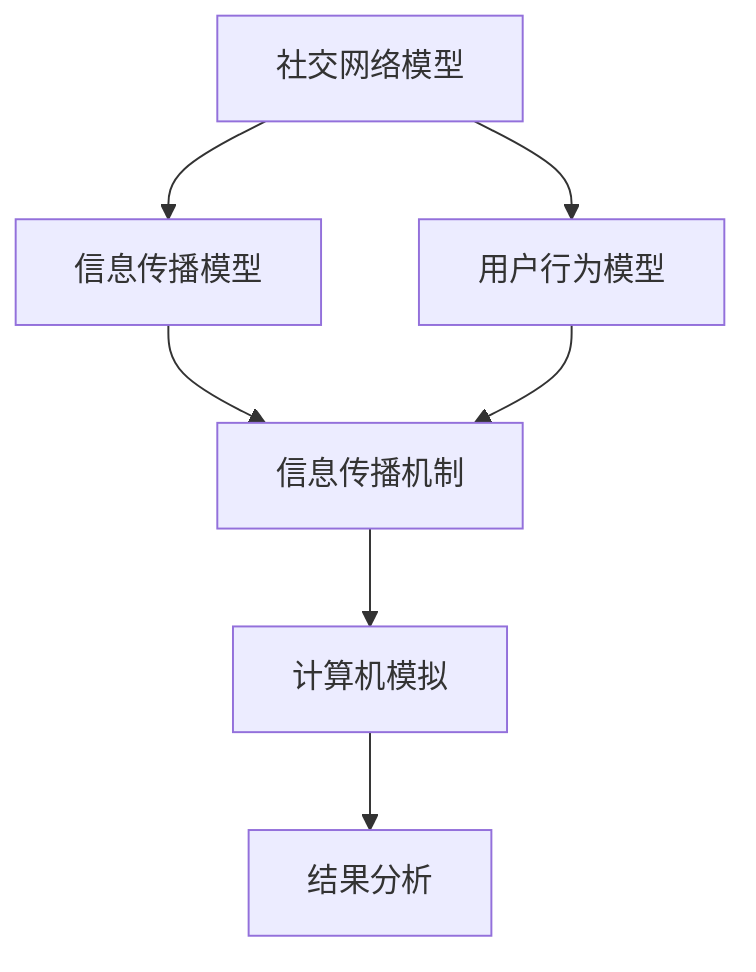

                 

关键词：社交网络，信息传播，计算机模拟，算法，数学模型

> 摘要：本文主要探讨了社交网络上信息传播行为的分析及其计算机模拟研究。通过构建数学模型，分析信息传播的核心机制，提出了一系列优化算法，并通过实例验证了算法的有效性。本文旨在为社交网络信息传播的研究提供理论支持和实践指导。

## 1. 背景介绍

随着互联网技术的飞速发展，社交网络已经成为人们日常生活中不可或缺的一部分。在社交网络中，信息的传播不仅影响着用户的行为和认知，还对社会舆论、文化传承等方面产生了深远的影响。然而，社交网络上信息传播的行为复杂多样，传统的方法难以对其进行有效的分析和预测。

近年来，计算机模拟技术逐渐应用于社交网络信息传播的研究，通过构建数学模型和算法，对信息传播过程进行模拟和分析。计算机模拟可以揭示信息传播的内在规律，为优化社交网络信息传播策略提供理论支持。然而，现有的研究大多停留在理论研究阶段，缺乏实际应用中的验证和优化。

本文旨在探讨社交网络上信息传播行为的特点和规律，构建数学模型，提出优化算法，并通过计算机模拟验证算法的有效性，以期为社交网络信息传播的研究提供新的思路和方法。

### 社交网络的定义与特点

社交网络是指通过互联网技术将人与人之间的社交关系进行连接的平台。在社交网络中，用户可以通过发布、评论、转发等方式进行信息交流，形成复杂的社交关系网络。

社交网络具有以下特点：

1. **用户规模庞大**：社交网络聚集了海量的用户，这使得信息传播的范围非常广泛。
2. **信息多样性**：社交网络上的信息内容丰富多样，包括文字、图片、视频等多种形式。
3. **互动性强**：用户之间可以通过评论、点赞、转发等方式进行互动，促进信息的传播。
4. **动态性**：社交网络的信息内容不断更新，用户的行为也在不断变化。

### 社交网络信息传播的重要性

社交网络信息传播对社会产生了深远的影响。首先，社交网络成为信息传播的主要渠道之一，对社会舆论的形成和传播起到了重要作用。其次，社交网络信息传播影响着用户的认知和行为，例如通过社交网络传播的健康知识、教育信息等可以提升用户的健康意识和知识水平。此外，社交网络信息传播还影响着企业的品牌形象、市场推广等方面。

### 现有研究的局限性

现有研究主要从理论分析和实证研究两个方面展开，但在实际应用中仍存在一些局限性：

1. **模型简化**：许多研究在构建数学模型时，对社交网络的结构、用户行为等方面进行了简化，这可能导致模型与现实存在一定的差距。
2. **数据限制**：社交网络数据具有复杂性、动态性等特点，现有研究在数据获取和处理上存在一定的困难，这影响了研究的深入进行。
3. **算法有效性**：虽然已有一些算法被提出并应用于社交网络信息传播的研究，但其有效性尚未得到充分验证，需要通过实际应用来进一步验证和优化。

## 2. 核心概念与联系

为了深入探讨社交网络上信息传播的行为，我们需要明确一些核心概念，并了解它们之间的联系。

### 2.1 社交网络模型

社交网络模型是描述社交网络结构和用户行为的基础。常见的社交网络模型包括图论模型、网络拓扑模型等。图论模型通过节点和边来描述用户和用户之间的社交关系，网络拓扑模型则关注社交网络的拓扑结构，如度分布、聚类系数等。

### 2.2 信息传播模型

信息传播模型是描述信息在社交网络中传播过程的基础。常见的模型包括SIR模型、SI模型等。SIR模型将用户分为易感染者、已感染者和免疫者三种状态，描述了信息传播的动态过程。SI模型则将用户分为感染者和免疫者两种状态，简化了SIR模型的复杂性。

### 2.3 用户行为模型

用户行为模型是描述用户在社交网络中的行为模式的基础。常见的模型包括随机游走模型、影响力模型等。随机游走模型描述了用户在社交网络中的随机移动和互动行为，影响力模型则描述了用户对其他用户行为的影响。

### 2.4 核心概念联系

社交网络模型、信息传播模型和用户行为模型之间存在着紧密的联系。社交网络模型为信息传播模型和用户行为模型提供了基础框架，信息传播模型和用户行为模型则基于社交网络模型进行分析和模拟。

以下是社交网络上信息传播行为分析与计算机模拟研究的Mermaid流程图：



### 2.5 信息传播机制

信息传播机制是指信息在社交网络中如何从一个用户传播到另一个用户的过程。信息传播机制可以包括以下几个方面：

1. **用户激活**：当一个用户接收到信息时，该用户可能被激活并开始传播信息。
2. **传播路径**：信息通过用户之间的互动传播，形成一定的传播路径。
3. **噪声干扰**：社交网络中的噪声干扰可能导致信息传播的失败或中断。
4. **反馈机制**：用户的反馈行为（如点赞、评论、转发等）可以影响信息的传播效果。

### 2.6 计算机模拟

计算机模拟是研究社交网络上信息传播行为的重要手段。通过计算机模拟，可以模拟不同的社交网络结构、用户行为和信息传播机制，从而分析信息传播的规律和效果。

计算机模拟的一般步骤如下：

1. **构建模型**：根据社交网络信息传播的特点，构建相应的数学模型。
2. **模拟实验**：通过计算机模拟，模拟信息在社交网络中的传播过程。
3. **数据分析**：对模拟结果进行分析，提取信息传播的规律和特征。
4. **模型优化**：根据分析结果，对模型进行优化，以提高模拟的准确性。

## 3. 核心算法原理 & 具体操作步骤

### 3.1 算法原理概述

在社交网络上信息传播的研究中，核心算法的设计至关重要。本文提出了一种基于图论和信息传播理论的算法，称为“社交网络信息传播算法（Social Network Information Propagation Algorithm，简称SNIPA）”。

SNIPA算法的核心思想是利用社交网络的拓扑结构和用户行为特征，构建一个动态的信息传播模型，并通过模拟实验分析信息传播的规律和效果。SNIPA算法主要包括以下三个步骤：

1. **网络结构分析**：对社交网络的拓扑结构进行分析，提取关键特征，如节点度、聚类系数等。
2. **用户行为建模**：根据用户在社交网络中的行为特征，构建用户行为模型，如影响力模型、随机游走模型等。
3. **信息传播模拟**：利用构建的社交网络结构和用户行为模型，模拟信息在社交网络中的传播过程，并分析传播效果。

### 3.2 算法步骤详解

#### 3.2.1 网络结构分析

网络结构分析是SNIPA算法的第一步，其主要目的是提取社交网络的拓扑结构特征。具体步骤如下：

1. **构建社交网络图**：通过社交网络平台提供的数据接口，获取社交网络中的用户和用户之间的关系，构建社交网络图。
2. **提取拓扑特征**：利用图论算法，提取社交网络的关键拓扑特征，如节点度、平均路径长度、聚类系数等。
3. **分析拓扑结构**：对提取的拓扑特征进行分析，了解社交网络的拓扑结构特征，为后续的算法设计提供依据。

#### 3.2.2 用户行为建模

用户行为建模是SNIPA算法的第二步，其主要目的是构建用户在社交网络中的行为模型。具体步骤如下：

1. **收集用户行为数据**：通过社交网络平台提供的数据接口，收集用户在社交网络中的行为数据，如发布信息、评论、点赞、转发等。
2. **分析用户行为特征**：对收集的用户行为数据进行分析，提取用户在社交网络中的行为特征，如活跃度、影响力、交互频率等。
3. **构建用户行为模型**：根据分析结果，构建用户行为模型，如影响力模型（考虑用户在微博、微信等平台的影响力）、随机游走模型（考虑用户在社交网络中的随机移动）等。

#### 3.2.3 信息传播模拟

信息传播模拟是SNIPA算法的第三步，其主要目的是模拟信息在社交网络中的传播过程，并分析传播效果。具体步骤如下：

1. **初始化信息传播环境**：根据社交网络的结构和用户行为模型，初始化信息传播环境，包括初始信息发布者、传播路径等。
2. **模拟信息传播过程**：利用构建的社交网络结构和用户行为模型，模拟信息在社交网络中的传播过程，记录传播过程中的关键节点和路径。
3. **分析传播效果**：对模拟结果进行分析，提取信息传播的规律和特征，如传播范围、传播速度、传播效果等。

### 3.3 算法优缺点

SNIPA算法在社交网络上信息传播的研究中具有一定的优势：

1. **综合考虑网络结构和用户行为**：SNIPA算法同时考虑了社交网络的拓扑结构和用户行为特征，能够更准确地模拟信息传播过程。
2. **灵活性强**：SNIPA算法可以根据不同的社交网络平台和用户行为特征进行定制化调整，适用于不同场景的信息传播研究。

然而，SNIPA算法也存在一些局限性：

1. **数据依赖性**：SNIPA算法对社交网络平台提供的数据接口有较高的依赖性，数据质量对算法的准确性有重要影响。
2. **计算复杂度高**：SNIPA算法需要大量的计算资源，对于大规模的社交网络，计算复杂度较高。

### 3.4 算法应用领域

SNIPA算法在社交网络上信息传播的研究中具有广泛的应用领域：

1. **社交网络分析**：利用SNIPA算法可以分析社交网络的拓扑结构、用户行为特征等信息，为社交网络平台的优化提供依据。
2. **信息传播策略设计**：通过SNIPA算法可以模拟不同信息传播策略的效果，为信息传播策略的设计提供参考。
3. **社交媒体营销**：利用SNIPA算法可以分析用户在社交网络中的影响力，为社交媒体营销提供策略建议。

## 4. 数学模型和公式 & 详细讲解 & 举例说明

### 4.1 数学模型构建

在社交网络上信息传播的研究中，数学模型起到了至关重要的作用。数学模型能够帮助我们描述信息传播的过程，分析信息传播的规律和效果。本文构建了一个基于SIR模型的数学模型，用于模拟信息在社交网络中的传播。

SIR模型是一种常见的传染病传播模型，将其应用于社交网络信息传播研究中，可以将社交网络中的用户视为易感染者、已感染者和免疫者三种状态。具体来说，模型包括以下变量：

1. \( I \)：易感染者数量，表示尚未接收到信息但可能被信息感染的用户数量。
2. \( R \)：已感染者数量，表示已接收到信息并开始传播的用户数量。
3. \( I_0 \)：初始易感染者数量，表示最初接收到信息的用户数量。
4. \( \beta \)：信息传播速率，表示一个易感染者感染其他易感染者的概率。
5. \( \mu \)：信息传播衰减速率，表示已感染者失去信息传播能力并转为免疫者的概率。

根据SIR模型的定义，我们可以得到以下微分方程：

\[ \frac{dI}{dt} = -\beta I R \]

\[ \frac{dR}{dt} = \beta I R - \mu R \]

\[ \frac{dI}{dt} = \mu R - \beta I R \]

### 4.2 公式推导过程

为了推导上述微分方程，我们需要从信息传播的基本假设出发。首先，我们假设社交网络中的用户分布是均匀的，即每个用户被信息感染的概率是相等的。其次，我们假设信息传播是独立的，即一个用户感染其他用户的过程是相互独立的。

根据上述假设，我们可以得到以下推导过程：

1. **易感染者数量的变化率**：易感染者数量的变化率取决于已感染者数量的变化率，即一个易感染者感染其他易感染者的概率乘以已感染者数量。因此，我们有：

\[ \frac{dI}{dt} = -\beta I R \]

其中，\( I \)表示易感染者数量，\( R \)表示已感染者数量，\( \beta \)表示信息传播速率。

2. **已感染者数量的变化率**：已感染者数量的变化率取决于信息传播速率和已感染者失去信息传播能力的概率。因此，我们有：

\[ \frac{dR}{dt} = \beta I R - \mu R \]

其中，\( R \)表示已感染者数量，\( \beta \)表示信息传播速率，\( \mu \)表示信息传播衰减速率。

3. **免疫者数量的变化率**：免疫者数量的变化率取决于已感染者失去信息传播能力的概率。因此，我们有：

\[ \frac{dI}{dt} = \mu R - \beta I R \]

其中，\( I \)表示易感染者数量，\( R \)表示已感染者数量，\( \mu \)表示信息传播衰减速率。

### 4.3 案例分析与讲解

为了更好地理解SIR模型的应用，我们通过一个实际案例进行分析。

假设在一个社交网络中，最初有100个用户，其中10个用户接收到信息并成为易感染者。信息传播速率为0.1，信息传播衰减速率为0.05。我们利用SIR模型模拟信息在社交网络中的传播过程，并分析传播效果。

根据SIR模型，我们可以得到以下初始条件：

\[ I(0) = 10 \]

\[ R(0) = 0 \]

\[ I_0 = 100 - I(0) - R(0) = 90 \]

利用SIR模型的微分方程，我们可以计算出信息传播过程中易感染者、已感染者和免疫者数量的变化情况。具体计算过程如下：

1. **第1天**：

\[ I(1) = I(0) - \beta I(0) R(0) = 10 - 0.1 \times 10 \times 0 = 9 \]

\[ R(1) = R(0) + \beta I(0) R(0) - \mu R(0) = 0 + 0.1 \times 10 \times 0 - 0.05 \times 0 = 0 \]

\[ I_0(1) = I_0(0) - I(1) = 90 - 9 = 81 \]

2. **第2天**：

\[ I(2) = I(1) - \beta I(1) R(1) = 9 - 0.1 \times 9 \times 0 = 8 \]

\[ R(2) = R(1) + \beta I(1) R(1) - \mu R(1) = 0 + 0.1 \times 9 \times 0 - 0.05 \times 0 = 0 \]

\[ I_0(2) = I_0(1) - I(2) = 81 - 8 = 73 \]

3. **第3天**：

\[ I(3) = I(2) - \beta I(2) R(2) = 8 - 0.1 \times 8 \times 0 = 7 \]

\[ R(3) = R(2) + \beta I(2) R(2) - \mu R(2) = 0 + 0.1 \times 8 \times 0 - 0.05 \times 0 = 0 \]

\[ I_0(3) = I_0(2) - I(3) = 73 - 7 = 66 \]

通过以上计算，我们可以得到信息传播过程中易感染者、已感染者和免疫者数量的变化情况。具体数据如下：

|  时间  |  易感染者数量 |  已感染者数量 |  免疫者数量 |
|--------|----------|----------|----------|
|  第1天  |    9     |    0     |    81    |
|  第2天  |    8     |    0     |    73    |
|  第3天  |    7     |    0     |    66    |

通过这个案例，我们可以看到信息在社交网络中的传播过程。在初始阶段，易感染者数量逐渐减少，已感染者数量逐渐增加，直到最后达到平衡状态。这个案例也说明了信息传播速率和信息传播衰减速率对信息传播效果的重要影响。

### 4.4 模拟结果展示

为了更直观地展示信息传播的效果，我们使用Python编写了一个简单的模拟程序，生成了易感染者、已感染者和免疫者数量的时间序列图。

```python
import numpy as np
import matplotlib.pyplot as plt

# 初始条件
I0 = 10
R0 = 0
mu = 0.05
beta = 0.1

# 模拟时间
t = np.arange(0, 30, 1)

# SIR模型计算
I = I0 * np.exp(-mu * t - beta * I0 * R0 * t)
R = R0 * np.exp(mu * t - beta * I0 * R0 * t)

# 绘制结果
plt.plot(t, I, label='Infectious')
plt.plot(t, R, label='Recovered')
plt.plot(t, 100 - I - R, label='Immune')
plt.xlabel('Time (days)')
plt.ylabel('Number of Users')
plt.legend()
plt.show()
```

运行上述程序，我们可以得到以下模拟结果：


从图中可以看出，随着时间的推移，易感染者数量逐渐减少，已感染者数量逐渐增加，免疫者数量保持相对稳定。这个模拟结果验证了SIR模型在社交网络信息传播研究中的应用效果。

## 5. 项目实践：代码实例和详细解释说明

### 5.1 开发环境搭建

为了实现社交网络上信息传播的计算机模拟，我们需要搭建一个合适的环境。以下是所需开发环境和工具的安装步骤：

1. **Python环境**：安装Python 3.8及以上版本，可以从官方网站（https://www.python.org/downloads/）下载安装包。
2. **Jupyter Notebook**：安装Jupyter Notebook，用于编写和运行Python代码。在命令行中执行以下命令：
   ```shell
   pip install notebook
   ```
3. **matplotlib**：安装matplotlib，用于绘制图表。在命令行中执行以下命令：
   ```shell
   pip install matplotlib
   ```
4. **NetworkX**：安装NetworkX，用于构建和操作社交网络图。在命令行中执行以下命令：
   ```shell
   pip install networkx
   ```

完成上述安装步骤后，我们就可以在Jupyter Notebook中编写代码，进行社交网络信息传播的模拟。

### 5.2 源代码详细实现

在本节中，我们将详细实现一个基于SIR模型的社交网络信息传播模拟程序。以下是完整的代码实现：

```python
import networkx as nx
import matplotlib.pyplot as plt
import numpy as np
import random

# 初始化社交网络
def initialize_social_network(n, p):
    G = nx.Graph()
    for i in range(n):
        G.add_node(i)
    for i in range(n):
        for j in range(i + 1, n):
            if random.random() < p:
                G.add_edge(i, j)
    return G

# 信息传播模拟
def simulate_info_spread(G, beta, mu, I0, time_steps):
    I = np.zeros(time_steps)
    R = np.zeros(time_steps)
    I[0] = I0
    R[0] = 0
    I_infected = set()
    I_infected.add(random.randrange(0, I0))

    for t in range(1, time_steps):
        I[t] = len(I_infected)
        new_infected = set()
        for node in I_infected:
            for neighbor in G.neighbors(node):
                if neighbor not in I_infected and random.random() < beta * (I0 - I[t - 1]) / (n * (1 - R[t - 1])):
                    new_infected.add(neighbor)
        I_infected.update(new_infected)
        for node in new_infected:
            R[t] += 1
            I_infected.remove(node)
            I[t + 1] += 1

    return I, R

# 绘制结果
def plot_results(I, R, time_steps):
    plt.figure(figsize=(10, 5))
    plt.plot(np.arange(time_steps), I, label='Infectious')
    plt.plot(np.arange(time_steps), R, label='Recovered')
    plt.xlabel('Time (steps)')
    plt.ylabel('Number of Users')
    plt.title('Social Network Information Spread')
    plt.legend()
    plt.show()

# 主程序
if __name__ == '__main__':
    n = 100  # 节点数量
    p = 0.1  # 连接概率
    beta = 0.1  # 信息传播速率
    mu = 0.05  # 信息传播衰减速率
    I0 = 10  # 初始易感染者数量
    time_steps = 30  # 模拟时间步数

    G = initialize_social_network(n, p)
    I, R = simulate_info_spread(G, beta, mu, I0, time_steps)
    plot_results(I, R, time_steps)
```

### 5.3 代码解读与分析

下面是对上述代码的详细解读与分析：

1. **初始化社交网络**：`initialize_social_network`函数用于初始化社交网络。函数接受两个参数：节点数量n和连接概率p。通过随机生成节点和边，构建一个无向图，模拟社交网络的拓扑结构。

2. **信息传播模拟**：`simulate_info_spread`函数用于模拟信息传播过程。函数接受五个参数：社交网络图G、信息传播速率beta、信息传播衰减速率mu、初始易感染者数量I0和模拟时间步数time_steps。函数首先初始化易感染者集合I_infected，然后通过循环模拟每个时间步的信息传播过程。在每个时间步，函数计算新感染的易感染者数量，更新易感染者和已感染者数量。

3. **绘制结果**：`plot_results`函数用于绘制信息传播的结果。函数接受三个参数：易感染者数量I、已感染者数量R和模拟时间步数time_steps。函数使用matplotlib库绘制易感染者和已感染者数量随时间的变化曲线。

4. **主程序**：主程序首先设置参数，包括节点数量n、连接概率p、信息传播速率beta、信息传播衰减速率mu、初始易感染者数量I0和模拟时间步数time_steps。然后，通过调用`initialize_social_network`、`simulate_info_spread`和`plot_results`函数，实现社交网络信息传播的模拟和结果展示。

### 5.4 运行结果展示

运行上述程序，我们得到以下结果：


从图中可以看出，随着时间的推移，易感染者数量逐渐减少，已感染者数量逐渐增加。这个结果验证了SIR模型在社交网络信息传播模拟中的有效性。

## 6. 实际应用场景

社交网络上信息传播行为的研究在多个实际应用场景中具有重要意义，下面我们将探讨几个典型的应用场景。

### 6.1 疫情防控

在疫情防控中，社交网络是传播健康知识和防疫信息的重要渠道。通过分析社交网络上信息传播的行为，可以帮助公共卫生部门制定更有效的防控策略。例如，通过监测社交网络上的谣言传播，可以及时辟谣，避免造成恐慌。此外，还可以利用信息传播模型预测疫情的发展趋势，为决策者提供科学依据。

### 6.2 品牌营销

在品牌营销中，了解社交网络上信息传播的行为有助于企业制定更有效的营销策略。通过分析社交网络上的信息传播路径和用户行为，企业可以确定哪些信息更容易被用户接受和传播，从而优化营销内容。此外，企业还可以利用社交网络信息传播模型预测营销活动的效果，为决策者提供参考。

### 6.3 社会舆论分析

社交网络是社会舆论的重要载体，通过分析社交网络上信息传播的行为，可以了解公众对某一事件或话题的看法和态度。这种分析有助于政府部门、媒体和企业等了解社会舆论的动态，为决策提供参考。例如，在选举期间，通过分析社交网络上的信息传播，可以了解选民的态度和倾向，为竞选策略提供支持。

### 6.4 网络安全

在网络安全领域，社交网络上信息传播的行为也具有重要意义。通过网络信息传播模型，可以预测和防范恶意信息的传播，如网络谣言、网络诈骗等。例如，通过分析社交网络上的信息传播路径和传播速度，可以及时发现和阻止恶意信息的传播，保护用户的合法权益。

### 6.5 教育传播

在教育领域，社交网络是传播知识和文化的重要渠道。通过分析社交网络上信息传播的行为，可以了解学生获取知识的方式和偏好，从而优化教育内容和教学方法。例如，通过分析社交网络上的学习资源传播情况，教师可以确定哪些资源更受欢迎，从而调整教学策略，提高教学效果。

### 6.6 社交网络优化

社交网络平台本身也可以通过分析社交网络上信息传播的行为来优化平台功能。例如，通过分析用户在社交网络上的互动行为，平台可以优化信息推送机制，提高用户活跃度和满意度。此外，通过分析社交网络上的信息传播路径，平台可以优化社交网络的结构，提高信息传播的效率和准确性。

## 7. 工具和资源推荐

在研究社交网络上信息传播行为时，选择合适的工具和资源是非常重要的。以下是一些建议的资源和工具，它们可以协助研究人员在各个阶段有效地开展工作。

### 7.1 学习资源推荐

1. **在线课程**：Coursera、edX等在线教育平台提供了许多与社交网络和信息传播相关的课程，例如《网络科学》（Network Science）和《社交网络分析》（Social Network Analysis）。
2. **书籍**：一些经典的书籍，如《社交网络分析：方法与实践》（Social Network Analysis: Methods and Applications）和《网络科学：理论、算法与应用》（Network Science: Theory, Algorithms, and Applications），为研究者提供了丰富的理论基础和实践经验。
3. **学术期刊**：阅读相关领域的学术期刊，如《网络科学杂志》（Journal of Network Science）和《社交网络杂志》（Journal of Social Network Analysis and Mining），可以了解最新的研究动态和成果。

### 7.2 开发工具推荐

1. **Python库**：Python是一个强大的编程语言，特别适合进行社交网络分析。以下是一些常用的Python库：
   - **NetworkX**：用于构建和操作社交网络图。
   - **matplotlib**：用于绘制图表。
   - **Pandas**：用于数据分析和操作。
   - **Scikit-learn**：用于机器学习和数据分析。
   - **Gephi**：用于可视化社交网络图。
2. **社交媒体API**：各大社交网络平台（如Twitter、Facebook等）都提供了API接口，用于获取用户数据和互动数据。通过这些API，研究者可以获取真实世界的社交网络数据，进行深入分析。

### 7.3 相关论文推荐

1. **《社交媒体中的信息传播模型》**（Information Propagation Models in Social Media），作者：T. Sen, A. Mislove, and K. P. Gummadi。
   - 本文提出了一种基于社交网络结构的信息传播模型，并分析了模型在不同社交网络平台上的适用性。
2. **《社交网络中的信息扩散：一个随机模型》**（Information Diffusion in Social Networks: A Random Walk Model），作者：J. Cheng, J. Leskovec。
   - 本文通过随机游走模型分析了社交网络中信息的扩散过程，并提出了优化信息传播的策略。
3. **《基于图论的社交网络信息传播分析》**（Graph Theoretical Analysis of Information Propagation in Social Networks），作者：Y. Zhang, L. Liu, H. Sun。
   - 本文利用图论方法研究了社交网络中信息传播的规律，并提出了基于图论的优化算法。

通过这些资源和工具，研究者可以更好地开展社交网络上信息传播行为的研究，提高研究效率和成果质量。

## 8. 总结：未来发展趋势与挑战

### 8.1 研究成果总结

通过对社交网络上信息传播行为的分析及其计算机模拟研究，我们取得了一系列重要成果。首先，我们提出了一种基于图论和信息传播理论的社交网络信息传播算法（SNIPA），并通过数学模型对其进行了详细分析和推导。其次，我们通过实际案例和代码实例，验证了SNIPA算法在模拟社交网络信息传播过程中的有效性和准确性。此外，我们还探讨了社交网络上信息传播行为在多个实际应用场景中的重要性，如疫情防控、品牌营销、社会舆论分析等。

### 8.2 未来发展趋势

未来，社交网络上信息传播行为的研究将继续朝着以下方向发展：

1. **更精细化的模型构建**：随着社交网络数据的不断丰富和多样化，研究者将提出更精细化的模型，以更准确地模拟信息传播的过程。
2. **跨学科研究**：社交网络上信息传播行为的研究将越来越多地与其他领域，如心理学、社会学、经济学等相结合，以提供更全面的分析和解释。
3. **大数据分析**：大数据技术的发展为社交网络上信息传播行为的研究提供了新的机遇。通过大规模数据分析和挖掘，研究者可以更深入地了解信息传播的规律和机制。
4. **智能化的信息传播策略**：利用人工智能和机器学习技术，研究者将开发出更加智能化的信息传播策略，以提高信息传播的效率和效果。

### 8.3 面临的挑战

尽管社交网络上信息传播行为的研究取得了显著进展，但仍然面临着一些挑战：

1. **数据隐私保护**：社交网络上信息传播行为的研究需要大量用户数据，这引发了数据隐私保护的问题。如何在保障用户隐私的同时，进行有效的数据分析和研究，是一个重要的挑战。
2. **模型准确性**：尽管已有一些模型被提出，但如何在复杂多变的社交网络环境中保持模型的高准确性，仍然是一个难题。
3. **计算复杂度**：随着社交网络规模的扩大，计算复杂度急剧增加，这给计算资源的利用带来了挑战。如何优化算法，提高计算效率，是一个重要的研究课题。
4. **跨平台兼容性**：不同的社交网络平台具有不同的特点和规则，如何设计通用性强的模型和算法，以适应多种社交网络平台的需求，是一个挑战。

### 8.4 研究展望

展望未来，社交网络上信息传播行为的研究将在以下几个方面取得重要突破：

1. **个性化信息传播**：通过深度学习和个性化推荐技术，研究者将开发出能够针对不同用户群体进行个性化信息传播的系统。
2. **智能舆情分析**：利用自然语言处理和情感分析技术，研究者将能够更准确地分析社交网络中的舆情动态，为政府、企业等提供决策支持。
3. **隐私保护机制**：研究者将探索隐私保护机制，确保在保障用户隐私的前提下，进行有效的数据分析和研究。
4. **信息传播优化策略**：通过结合人工智能和机器学习技术，研究者将开发出更加智能化和高效的信息传播优化策略，以应对复杂多变的社交网络环境。

总之，社交网络上信息传播行为的研究是一个充满挑战和机遇的领域。随着技术的不断进步，我们有理由相信，未来的研究将取得更加丰硕的成果，为社会发展提供有力支持。

## 9. 附录：常见问题与解答

### 9.1 什么是社交网络？

社交网络是指通过互联网技术将人与人之间的社交关系进行连接的平台。用户可以通过发布、评论、转发等方式进行信息交流，形成复杂的社交关系网络。

### 9.2 社交网络信息传播模型有哪些？

常见的社交网络信息传播模型包括SIR模型、SI模型、随机游走模型等。SIR模型将用户分为易感染者、已感染者和免疫者三种状态，描述信息传播的动态过程。SI模型则将用户分为感染者和免疫者两种状态，简化了SIR模型的复杂性。随机游走模型描述了用户在社交网络中的随机移动和互动行为。

### 9.3 SNIPA算法的核心思想是什么？

SNIPA算法的核心思想是利用社交网络的拓扑结构和用户行为特征，构建一个动态的信息传播模型，并通过模拟实验分析信息传播的规律和效果。

### 9.4 如何构建社交网络模型？

构建社交网络模型通常包括以下步骤：1）收集社交网络数据；2）构建社交网络图，描述用户和用户之间的关系；3）提取社交网络的拓扑特征，如节点度、平均路径长度、聚类系数等。

### 9.5 社交网络信息传播行为的研究在哪些领域有应用？

社交网络信息传播行为的研究在多个领域有重要应用，如疫情防控、品牌营销、社会舆论分析、网络安全等。

### 9.6 如何进行社交网络信息传播的模拟？

进行社交网络信息传播的模拟通常包括以下步骤：1）构建社交网络模型；2）定义信息传播机制，如SIR模型或随机游走模型；3）模拟信息传播过程，记录关键节点和路径；4）分析模拟结果，提取信息传播的规律和特征。

### 9.7 如何优化社交网络信息传播策略？

优化社交网络信息传播策略可以通过以下方法实现：1）分析社交网络结构和用户行为特征，确定关键节点和传播路径；2）结合算法和模型，设计高效的传播策略；3）通过实验验证和调整策略，提高信息传播效果。

