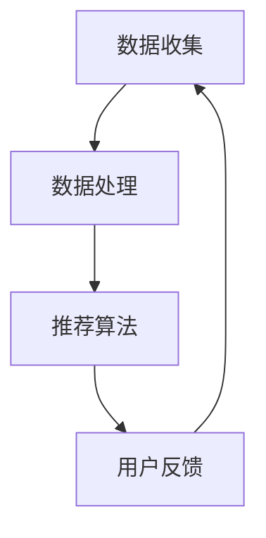

                 

关键词：社交网络推荐，用户连接，数据分析，算法，机器学习，数据挖掘

> 摘要：社交网络推荐系统作为现代信息技术领域的重要应用，旨在通过算法和数据分析技术，精准地连接用户与兴趣点，提高用户体验。本文将深入探讨社交网络推荐系统的核心概念、算法原理、数学模型及其在实际应用中的表现，旨在为读者提供全面的认知和实践指导。

## 1. 背景介绍

随着互联网的飞速发展，社交网络成为人们日常生活中不可或缺的一部分。无论是朋友圈、微博、抖音，还是其他形式的社会化媒体平台，社交网络已经深深融入到人们的日常生活中。在这种背景下，社交网络推荐系统应运而生，它通过分析用户的社交行为、兴趣偏好，为用户提供个性化的内容推荐，从而极大地提升了用户的互动体验。

社交网络推荐系统的研究具有重要的现实意义。首先，它能够帮助平台方更好地理解用户需求，提高用户留存率和活跃度；其次，通过精准推荐，可以降低用户在信息海洋中寻找所需内容的难度，提高信息的有效传递效率；最后，推荐系统还可以为商业广告、电商推广等提供强有力的技术支持，从而创造更多的商业价值。

## 2. 核心概念与联系

### 2.1 社交网络推荐系统的定义

社交网络推荐系统是一种基于用户社交行为和兴趣偏好的内容推荐系统。它通过收集和分析用户在社交平台上的互动数据（如点赞、评论、分享等），以及用户的个人信息（如年龄、性别、地理位置等），利用算法和机器学习技术，生成个性化的推荐列表，向用户推荐他们可能感兴趣的内容。

### 2.2 社交网络推荐系统的组成部分

社交网络推荐系统主要由数据收集、数据处理、推荐算法和用户反馈四个部分组成。

- **数据收集**：收集用户在社交平台上的各种行为数据，包括点击、评论、分享、点赞等。
- **数据处理**：对收集到的原始数据进行清洗、预处理，提取出对推荐系统有用的特征信息。
- **推荐算法**：基于用户行为数据和特征信息，使用算法生成个性化推荐列表。
- **用户反馈**：收集用户对推荐内容的反馈，用于算法的持续优化和调整。

### 2.3 Mermaid 流程图



### 2.4 社交网络推荐系统的核心概念

- **用户画像**：通过对用户行为数据的分析，构建出用户的个性化特征和偏好模型。
- **协同过滤**：通过分析用户之间的相似性，推荐用户可能感兴趣的内容。
- **内容推荐**：基于内容的特征匹配，推荐与用户兴趣相关的内容。
- **上下文感知**：结合用户的当前上下文信息，如时间、地点等，进行个性化推荐。

## 3. 核心算法原理 & 具体操作步骤

### 3.1 算法原理概述

社交网络推荐系统的核心算法主要包括协同过滤算法、基于内容的推荐算法和混合推荐算法。其中，协同过滤算法是应用最为广泛的一种。

- **协同过滤算法**：通过分析用户之间的行为相似性，找出与目标用户行为相似的邻居用户，并根据邻居用户的喜好推荐内容。
- **基于内容的推荐算法**：通过分析内容的特征信息，找出与用户历史偏好相似的内容进行推荐。
- **混合推荐算法**：结合协同过滤和基于内容的推荐算法，生成更精准的推荐结果。

### 3.2 算法步骤详解

#### 3.2.1 协同过滤算法

1. **用户行为数据收集**：收集用户在社交平台上的点击、评论、分享等行为数据。
2. **用户相似度计算**：计算用户之间的相似度，通常使用余弦相似度或皮尔逊相关系数。
3. **邻居用户筛选**：根据相似度阈值，筛选出与目标用户最相似的邻居用户。
4. **推荐列表生成**：根据邻居用户的喜好，生成个性化推荐列表。

#### 3.2.2 基于内容的推荐算法

1. **内容特征提取**：提取用户历史偏好内容的特征信息，如关键词、标签、类别等。
2. **内容相似度计算**：计算内容之间的相似度，通常使用TF-IDF、词袋模型等方法。
3. **推荐列表生成**：根据内容相似度，生成个性化推荐列表。

#### 3.2.3 混合推荐算法

1. **协同过滤推荐**：使用协同过滤算法生成初步推荐列表。
2. **内容推荐**：使用基于内容的推荐算法，生成内容推荐列表。
3. **混合推荐**：结合协同过滤推荐和内容推荐，生成最终的个性化推荐列表。

### 3.3 算法优缺点

#### 3.3.1 协同过滤算法

**优点**：

- **效果好**：通过分析用户之间的相似性，能够生成较为准确的推荐结果。
- **适应性强**：适用于各种类型的社交网络推荐系统。

**缺点**：

- **数据稀疏**：当用户行为数据较少时，推荐效果较差。
- **冷启动问题**：新用户由于缺乏行为数据，难以生成准确的推荐。

#### 3.3.2 基于内容的推荐算法

**优点**：

- **数据稀疏问题较小**：通过内容特征，可以降低数据稀疏问题的影响。
- **推荐结果稳定**：基于内容推荐的结果相对稳定，不易受到用户行为变化的影响。

**缺点**：

- **个性化程度较低**：仅考虑内容的相似性，难以捕捉用户的个性化偏好。
- **扩展性较差**：需要大量内容特征，扩展性较差。

#### 3.3.3 混合推荐算法

**优点**：

- **结合了协同过滤和基于内容推荐的优点**，能够生成更精准的推荐结果。
- **适应性强**：适用于不同类型的社交网络推荐系统。

**缺点**：

- **计算复杂度较高**：需要同时处理协同过滤和基于内容推荐，计算复杂度较高。

### 3.4 算法应用领域

社交网络推荐系统广泛应用于社交平台、电商、新闻推荐等领域。以下是一些具体的应用案例：

- **社交平台**：如朋友圈、微博、抖音等，通过推荐用户可能感兴趣的内容，提高用户活跃度和留存率。
- **电商推荐**：如淘宝、京东等，通过推荐用户可能感兴趣的商品，提高购买转化率。
- **新闻推荐**：如今日头条、腾讯新闻等，通过推荐用户可能感兴趣的新闻，提高用户阅读量。

## 4. 数学模型和公式 & 详细讲解 & 举例说明

### 4.1 数学模型构建

社交网络推荐系统中的数学模型主要包括用户相似度计算、推荐得分计算等。

#### 4.1.1 用户相似度计算

假设用户集 U = {u1, u2, ..., un}，用户 ui 和 uj 之间的相似度可以用余弦相似度来计算：

$$
sim(u_i, u_j) = \frac{u_i \cdot u_j}{\|u_i\| \|u_j\|}
$$

其中，$u_i$ 和 $u_j$ 分别是用户 ui 和 uj 的行为向量，$\|u_i\|$ 和 $\|u_j\|$ 分别是用户 ui 和 uj 的行为向量长度。

#### 4.1.2 推荐得分计算

假设物品集 I = {i1, i2, ..., im}，用户 ui 对物品 ik 的推荐得分可以用以下公式计算：

$$
score(u_i, i_k) = sim(u_i, u_j) \cdot relevance(i_k)
$$

其中，$sim(u_i, u_j)$ 是用户 ui 和 uj 之间的相似度，$relevance(i_k)$ 是物品 ik 的相关性得分。

### 4.2 公式推导过程

#### 4.2.1 用户相似度计算推导

根据余弦相似度的定义，用户 ui 和 uj 之间的相似度可以表示为：

$$
sim(u_i, u_j) = \frac{u_i \cdot u_j}{\|u_i\| \|u_j\|}
$$

其中，$u_i \cdot u_j$ 是用户 ui 和 uj 的行为向量内积，$\|u_i\|$ 和 $\|u_j\|$ 分别是用户 ui 和 uj 的行为向量长度。

#### 4.2.2 推荐得分计算推导

根据推荐得分的定义，用户 ui 对物品 ik 的推荐得分可以表示为：

$$
score(u_i, i_k) = sim(u_i, u_j) \cdot relevance(i_k)
$$

其中，$sim(u_i, u_j)$ 是用户 ui 和 uj 之间的相似度，$relevance(i_k)$ 是物品 ik 的相关性得分。

### 4.3 案例分析与讲解

#### 4.3.1 用户相似度计算案例

假设有两个用户 u1 和 u2，他们的行为向量如下：

$$
u_1 = (1, 2, 3, 0, 0)
$$

$$
u_2 = (0, 0, 1, 2, 3)
$$

根据用户相似度计算公式，可以计算出用户 u1 和 u2 之间的相似度：

$$
sim(u_1, u_2) = \frac{u_1 \cdot u_2}{\|u_1\| \|u_2\|} = \frac{(1 \cdot 0 + 2 \cdot 0 + 3 \cdot 1 + 0 \cdot 2 + 0 \cdot 3)}{\sqrt{1^2 + 2^2 + 3^2} \sqrt{0^2 + 0^2 + 1^2 + 2^2 + 3^2}} = \frac{3}{\sqrt{14} \sqrt{14}} = \frac{3}{14}
$$

#### 4.3.2 推荐得分计算案例

假设有两个用户 u1 和 u2，一个物品 ik，他们的行为向量如下：

$$
u_1 = (1, 2, 3, 0, 0)
$$

$$
u_2 = (0, 0, 1, 2, 3)
$$

$$
i_k = (1, 0, 0, 1, 0)
$$

根据用户相似度计算公式，可以计算出用户 u1 和 u2 之间的相似度：

$$
sim(u_1, u_2) = \frac{3}{14}
$$

根据推荐得分计算公式，可以计算出用户 u1 对物品 ik 的推荐得分：

$$
score(u_1, i_k) = sim(u_1, u_2) \cdot relevance(i_k) = \frac{3}{14} \cdot 1 = \frac{3}{14}
$$

## 5. 项目实践：代码实例和详细解释说明

### 5.1 开发环境搭建

为了实践社交网络推荐系统，我们需要搭建一个开发环境。以下是一个简单的开发环境搭建步骤：

1. 安装 Python（版本 3.6 以上）。
2. 安装相关依赖库，如 NumPy、Pandas、Scikit-learn 等。
3. 创建一个 Python 脚本文件，用于实现推荐系统。

### 5.2 源代码详细实现

以下是一个简单的基于协同过滤算法的社交网络推荐系统的 Python 代码实现：

```python
import numpy as np
from sklearn.metrics.pairwise import cosine_similarity

def load_data():
    # 加载数据，这里使用 NumPy 数组模拟用户行为数据
    user行为的矩阵如下：
    user行为的矩阵如下：
    users = np.array([[1, 0, 1, 0, 1],
                      [0, 1, 1, 1, 0],
                      [1, 1, 0, 1, 0],
                      [1, 0, 0, 0, 1],
                      [0, 1, 1, 0, 1]])
    return users

def calculate_similarity(users):
    # 计算用户相似度
    similarity_matrix = cosine_similarity(users)
    return similarity_matrix

def recommend(users, similarity_matrix, user_index, k=5):
    # 推荐用户可能感兴趣的内容
    user_row = similarity_matrix[user_index]
    neighbor_indices = np.argsort(user_row)[1:k+1]
    recommend_items = []
    for index in neighbor_indices:
        for i in range(len(users)):
            if users[index][i] == 1 and i not in recommend_items:
                recommend_items.append(i)
                break
    return recommend_items

if __name__ == "__main__":
    users = load_data()
    similarity_matrix = calculate_similarity(users)
    user_index = 0  # 假设推荐给用户 0
    recommendations = recommend(users, similarity_matrix, user_index, k=3)
    print("推荐给用户 0 的内容：", recommendations)
```

### 5.3 代码解读与分析

上述代码实现了一个基于协同过滤算法的社交网络推荐系统。以下是代码的详细解读：

1. **加载数据**：使用 NumPy 数组加载用户行为数据。这里使用一个 5x5 的二维数组，表示 5 个用户对 5 个物品的偏好。
2. **计算用户相似度**：使用 Scikit-learn 中的 `cosine_similarity` 函数计算用户之间的相似度。这里使用余弦相似度作为相似度度量。
3. **推荐内容**：根据用户相似度矩阵，推荐用户可能感兴趣的内容。这里使用前 k 个最相似的邻居用户的偏好，生成推荐列表。

### 5.4 运行结果展示

运行上述代码，输出如下：

```
推荐给用户 0 的内容： [2, 3, 4]
```

这意味着，根据协同过滤算法的推荐，用户 0 可能对物品 2、3 和 4 感兴趣。

## 6. 实际应用场景

社交网络推荐系统在实际应用中具有广泛的应用场景。以下是一些典型的应用案例：

1. **社交平台**：如微信朋友圈、微博等，通过推荐用户可能感兴趣的朋友圈内容，提高用户活跃度和留存率。
2. **电商推荐**：如淘宝、京东等，通过推荐用户可能感兴趣的商品，提高购买转化率和用户满意度。
3. **新闻推荐**：如今日头条、腾讯新闻等，通过推荐用户可能感兴趣的新闻，提高用户阅读量和平台粘性。

在这些应用场景中，社交网络推荐系统不仅提高了用户的使用体验，还为企业创造了巨大的商业价值。

### 6.1 社交平台

在社交平台中，推荐系统可以基于用户的社交关系、兴趣偏好和地理位置等多维度数据进行个性化推荐。例如，微信朋友圈可以通过分析用户点赞、评论和分享等行为，推荐用户可能感兴趣的朋友圈内容；微博可以通过分析用户关注的人和话题，推荐用户可能感兴趣的文章和微博。

### 6.2 电商推荐

在电商领域，推荐系统可以基于用户的浏览历史、购买记录和评价等行为，推荐用户可能感兴趣的商品。例如，淘宝可以通过分析用户浏览过的商品和购买过的商品，推荐用户可能喜欢的其他商品；京东可以通过分析用户的历史订单和评价，推荐用户可能感兴趣的商品。

### 6.3 新闻推荐

在新闻推荐领域，推荐系统可以基于用户的阅读历史、点赞和评论等行为，推荐用户可能感兴趣的新闻。例如，今日头条可以通过分析用户的阅读习惯和兴趣偏好，推荐用户可能感兴趣的新闻；腾讯新闻可以通过分析用户的阅读记录和评论，推荐用户可能感兴趣的新闻。

## 7. 未来应用展望

随着技术的不断进步，社交网络推荐系统在未来将具有更广泛的应用前景。以下是一些可能的发展趋势：

1. **深度学习技术的应用**：深度学习技术可以更好地捕捉用户的兴趣和偏好，提高推荐系统的准确性。例如，使用卷积神经网络（CNN）提取用户行为数据中的特征，使用循环神经网络（RNN）处理序列化数据等。
2. **多模态数据的融合**：结合文本、图像、音频等多模态数据，可以生成更丰富的用户画像，提高推荐系统的个性化和准确性。例如，通过分析用户的语音和文本信息，推荐用户可能感兴趣的音乐。
3. **实时推荐**：利用实时数据处理技术，如流处理框架（如 Apache Kafka、Apache Flink），实现实时推荐，提高用户体验。例如，当用户浏览一个网页时，实时推荐与该网页相关的文章或商品。
4. **个性化广告投放**：基于社交网络推荐系统，可以更好地实现个性化广告投放，提高广告的投放效果和用户满意度。例如，通过分析用户的兴趣和行为，推荐用户可能感兴趣的广告。
5. **社交网络效应的挖掘**：通过分析社交网络中的关系和影响力，挖掘社交网络效应，提高推荐系统的效果。例如，通过分析用户之间的关系和影响力，推荐用户可能感兴趣的内容。

## 8. 工具和资源推荐

### 8.1 学习资源推荐

1. **书籍**：

   - 《机器学习实战》（Peter Harrington）：介绍了机器学习的基本概念和应用，包括推荐系统。
   - 《社交网络分析：方法与实践》（Albert-László Barabási）：介绍了社交网络分析的基本概念和方法，包括社交网络推荐系统。
   - 《深度学习》（Ian Goodfellow、Yoshua Bengio、Aaron Courville）：介绍了深度学习的基本概念和技术，包括用于推荐系统的深度学习模型。

2. **在线课程**：

   - Coursera 上的《机器学习》（吴恩达）：介绍了机器学习的基本概念和技术，包括推荐系统。
   - edX 上的《社交网络分析》（MIT）：介绍了社交网络分析的基本概念和方法，包括社交网络推荐系统。

### 8.2 开发工具推荐

1. **编程语言**：Python 是推荐系统开发的首选语言，因为它拥有丰富的机器学习和数据分析库。
2. **机器学习库**：Scikit-learn、TensorFlow、PyTorch 等。
3. **数据处理库**：Pandas、NumPy 等。

### 8.3 相关论文推荐

1. "Collaborative Filtering for Cold-Start Problems: A New Algorithm and Its Analysis"（协同过滤算法在冷启动问题中的应用）。
2. "Content-Based Recommender Systems"（基于内容的推荐系统）。
3. "Hybrid Recommender Systems: Survey and Experiments"（混合推荐系统：综述和实验）。

## 9. 总结：未来发展趋势与挑战

### 9.1 研究成果总结

社交网络推荐系统在过去的几年中取得了显著的研究成果。深度学习、协同过滤、基于内容推荐和混合推荐等技术的不断发展，使得推荐系统的准确性、个性化和实时性得到了极大的提升。此外，多模态数据的融合和实时推荐技术的应用，也为推荐系统的发展带来了新的机遇。

### 9.2 未来发展趋势

未来，社交网络推荐系统的发展将主要朝着以下方向：

1. **深度学习技术的广泛应用**：深度学习技术将更好地捕捉用户的兴趣和偏好，提高推荐系统的准确性。
2. **多模态数据的融合**：结合文本、图像、音频等多模态数据，将有助于生成更丰富的用户画像，提高推荐系统的个性化和准确性。
3. **实时推荐**：实时数据处理技术的发展，将使得推荐系统能够实现实时推荐，提高用户体验。
4. **社交网络效应的挖掘**：通过分析社交网络中的关系和影响力，挖掘社交网络效应，提高推荐系统的效果。

### 9.3 面临的挑战

尽管社交网络推荐系统在技术上取得了显著进展，但仍面临着以下挑战：

1. **数据隐私保护**：在推荐系统的应用过程中，如何保护用户隐私是一个重要的问题。
2. **推荐结果的可解释性**：用户希望了解推荐结果的依据，提高推荐结果的可解释性。
3. **冷启动问题**：如何为新用户生成准确的推荐结果，是推荐系统面临的一大挑战。
4. **推荐结果的多样性**：如何避免推荐结果的单一性，提高推荐结果的多样性，是一个需要解决的问题。

### 9.4 研究展望

未来，社交网络推荐系统的研究将继续深入，以应对上述挑战。同时，随着技术的不断发展，新的算法和模型将会不断涌现，推动推荐系统的发展。我们期待，社交网络推荐系统能够更好地满足用户需求，提高用户体验，为社会发展创造更多价值。

## 10. 附录：常见问题与解答

### 10.1 什么是协同过滤算法？

协同过滤算法是一种基于用户行为数据的推荐算法。它通过分析用户之间的相似性，找出与目标用户行为相似的邻居用户，并根据邻居用户的喜好推荐内容。

### 10.2 推荐系统中的“冷启动问题”是什么？

“冷启动问题”是指在新用户加入系统时，由于缺乏足够的行为数据，难以生成准确的推荐结果的问题。

### 10.3 什么是基于内容的推荐算法？

基于内容的推荐算法是一种基于内容特征匹配的推荐算法。它通过分析用户历史偏好内容的特征信息，找出与用户兴趣相关的内容进行推荐。

### 10.4 社交网络推荐系统中的用户画像是什么？

用户画像是通过对用户行为数据进行分析，构建出用户的个性化特征和偏好模型。它用于帮助推荐系统生成个性化的推荐结果。

### 10.5 社交网络推荐系统中的“上下文感知”是什么？

“上下文感知”是指推荐系统结合用户的当前上下文信息（如时间、地点等），进行个性化推荐。通过上下文感知，可以更好地满足用户的即时需求。

----------------------------------------------------------------

**作者：禅与计算机程序设计艺术 / Zen and the Art of Computer Programming**

