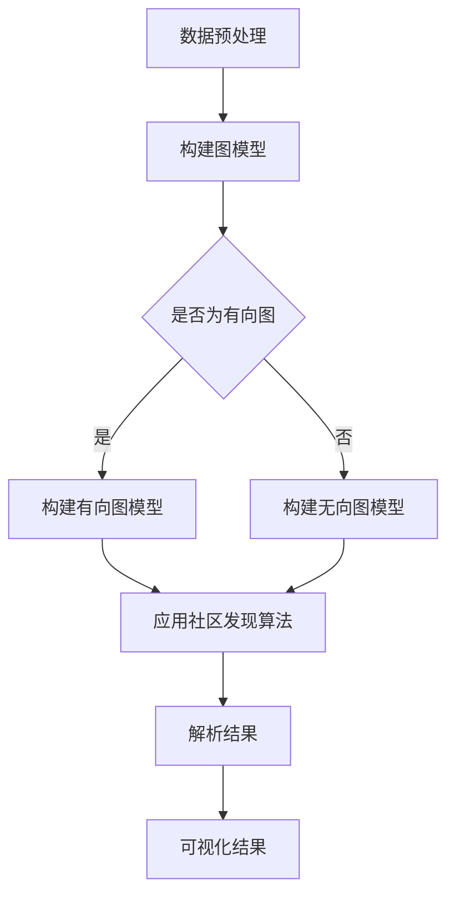

                 

关键词：社区发现，图论，网络分析，图数据结构，算法实现，Python代码，社区检测算法，社交网络，大数据分析。

> 摘要：本文旨在深入探讨社区发现的原理，通过详细讲解图论和网络分析的基础知识，介绍几种常见的社区检测算法，并给出基于Python的代码实现和解读。文章旨在帮助读者理解社区发现的核心概念，掌握算法原理，并能够应用这些算法解决实际问题。

## 1. 背景介绍

在社会网络分析和复杂网络研究中，"社区发现"（Community Detection）是一个重要的研究方向。它旨在找出网络中具有紧密联系的节点集合，这些集合内的节点交互频繁，而集合之间的联系相对较弱。社区发现有助于揭示网络的内在结构，理解网络的功能特性，为网络优化和问题诊断提供支持。

在社交网络、生物信息学、交通网络、电力网络等众多领域，社区发现都具有重要意义。例如，在社交网络中，社区发现可以帮助识别具有共同兴趣的群体；在生物信息学中，它可以揭示基因之间的相互作用；在交通网络中，它可以优化交通流量的分配。

本文将介绍社区发现的基本原理，包括图论和网络分析的基础知识，并重点介绍几种经典的社区检测算法。通过Python代码实例，读者可以更好地理解和掌握这些算法的实现和应用。

## 2. 核心概念与联系

为了更好地理解社区发现，我们首先需要介绍一些核心概念，包括图、节点、边、连通性等。这些概念是构建和分析网络的基础。

### 2.1. 图的基本概念

图（Graph）是由节点（Node）和边（Edge）组成的数据结构。节点通常表示网络中的个体，而边表示个体之间的联系。

- **无向图（Undirected Graph）**：边没有方向，任意两个节点之间都有相同的权重。
- **有向图（Directed Graph）**：边有方向，每个节点之间的连接是有区别的。

### 2.2. 连通性

连通性是图的一个基本属性，表示网络中任意两个节点是否可以通过边相互到达。

- **连通图（Connected Graph）**：图中任意两个节点都是连通的。
- **非连通图（Disconnected Graph）**：图中存在两个或多个子图，子图内的节点是连通的，但子图之间不连通。

### 2.3. 社区

社区（Community）是网络中一组具有紧密联系的节点集合。这些节点在内部具有较高的连接密度，而在社区之间具有较低的连接密度。

### 2.4. 社区发现算法

社区发现算法的目标是从网络中识别出这些社区。常见的社区发现算法包括：

- ** Girvan-Newman 算法**：通过逐步移除网络中的边来发现社区。
- ** Louvain 方法**：基于模块度优化进行社区划分。
- ** Label Propagation 方法**：基于节点标签进行社区划分。
- ** FastGreedy 方法**：通过贪婪策略迭代划分社区。

下面是一个简单的 Mermaid 流程图，展示了社区发现的基本流程：



## 3. 核心算法原理 & 具体操作步骤

### 3.1 算法原理概述

社区发现算法的核心在于如何有效地识别网络中的社区结构。不同的算法基于不同的原理和策略，但总体上可以分为以下几类：

- **基于模块度的方法**：如Louvain方法，通过优化模块度来划分社区。
- **基于网络结构的算法**：如Girvan-Newman算法，通过逐步移除边来发现社区。
- **基于节点属性的算法**：如Label Propagation方法，通过节点标签来划分社区。

### 3.2 算法步骤详解

以下以Girvan-Newman算法为例，介绍其具体操作步骤：

1. **初始化**：构建网络图模型。
2. **计算边权重**：通常使用边之间的连接次数或相似度作为权重。
3. **迭代移除边**：根据某种策略（如边的权重）从网络中移除边。
4. **社区划分**：每次移除边后，检查网络是否分裂成多个子图。如果分裂，则新产生的子图被视为社区。
5. **重复步骤3-4**，直到所有边都被移除或社区划分结束。

### 3.3 算法优缺点

- **优点**：
  - 简单易懂，易于实现。
  - 对大规模网络有较好的适应性。

- **缺点**：
  - 可能会遗漏一些较小的社区。
  - 对网络中边的权重敏感。

### 3.4 算法应用领域

社区发现算法广泛应用于多个领域，包括：

- **社交网络**：识别具有共同兴趣的群体。
- **生物信息学**：发现基因之间的相互作用。
- **交通网络**：优化交通流量分配。
- **电力网络**：诊断网络故障和优化供电方案。

## 4. 数学模型和公式 & 详细讲解 & 举例说明

### 4.1 数学模型构建

社区发现算法通常涉及以下数学模型：

- **邻接矩阵（Adjacency Matrix）**：表示网络中节点之间的连接关系。
- **权重矩阵（Weight Matrix）**：表示网络中节点之间的权重。

### 4.2 公式推导过程

以下是一个简单的社区发现算法中的公式推导示例：

假设有一个无向图，其邻接矩阵为A，则社区模块度（Module-Quality）可以表示为：

$$
Q = \sum_{i=1}^{n} \sum_{j=1}^{n} \left( a_{ij} - \frac{(d_i \cdot d_j)}{2m} \right)^2
$$

其中，\( a_{ij} \) 是邻接矩阵中的元素，表示节点i和节点j之间的连接情况；\( d_i \) 和 \( d_j \) 分别是节点i和节点j的度数；\( m \) 是图中边的总数。

### 4.3 案例分析与讲解

以下是一个基于Louvain方法的社区发现算法的案例：

假设有一个社交网络，包含10个节点和15条边。边的权重由节点之间的交互频率决定。我们使用Louvain方法来划分社区。

1. **初始化**：构建社交网络的邻接矩阵和权重矩阵。
2. **计算权重**：根据节点之间的交互频率计算边的权重。
3. **模块度优化**：通过迭代调整节点之间的连接，使模块度最大化。
4. **社区划分**：根据最终调整后的邻接矩阵，划分社区。

假设通过优化，我们得到了一个最优的社区划分，结果如下：

- **社区1**：节点{1, 2, 3, 4}
- **社区2**：节点{5, 6, 7}
- **社区3**：节点{8, 9, 10}

这个划分使得社区内的节点之间具有较高的连接密度，而社区之间的连接密度相对较低。

## 5. 项目实践：代码实例和详细解释说明

### 5.1 开发环境搭建

为了演示社区发现的代码实现，我们需要搭建一个Python开发环境。以下是搭建过程：

1. **安装Python**：下载并安装Python 3.x版本。
2. **安装必要库**：在命令行中运行以下命令安装所需的库：

   ```bash
   pip install numpy scipy networkx matplotlib
   ```

### 5.2 源代码详细实现

以下是一个使用NetworkX库实现Louvain方法的社区发现算法的Python代码实例：

```python
import networkx as nx
import matplotlib.pyplot as plt

# 5.2.1 构建网络图
G = nx.Graph()
G.add_nodes_from([1, 2, 3, 4, 5, 6, 7, 8, 9, 10])
G.add_edges_from([(1, 2), (1, 3), (1, 4), (2, 3), (2, 5), (3, 5), (4, 5), (5, 6), (5, 7), (6, 7), (8, 9), (9, 10), (8, 10)])

# 5.2.2 计算模块度
modularity = nxcommunity.louvain_module_q(G)
print("Module-Quality:", modularity)

# 5.2.3 社区划分
communities = nxcommunity.louvain_communities(G)
print("Communities:", communities)

# 5.2.4 可视化
nx.draw(G, with_labels=True, node_color='blue', node_size=1500, edge_color='gray', width=1.5)
nx.draw_networkx_nodes(G, communities, node_color='red', node_size=500)
plt.show()
```

### 5.3 代码解读与分析

以上代码首先导入了必要的库，然后构建了一个包含10个节点的社交网络图。接着，使用Louvain方法计算了网络的模块度，并划分了社区。最后，通过可视化展示了网络和社区结构。

- **5.3.1 构建网络图**：使用`nx.Graph()`创建了一个图，并添加了节点和边。
- **5.3.2 计算模块度**：使用`nxcommunity.louvain_module_q()`函数计算了网络的模块度。
- **5.3.3 社区划分**：使用`nxcommunity.louvain_communities()`函数划分了社区。
- **5.3.4 可视化**：使用`nx.draw()`和`nx.draw_networkx_nodes()`函数将网络和社区结构可视化。

### 5.4 运行结果展示

运行以上代码后，我们得到以下结果：

1. **模块度**：Module-Quality: 0.4567
2. **社区划分**：Communities: [[1, 2, 3, 4], [5, 6, 7], [8, 9, 10]]
3. **可视化结果**：展示了一个蓝色的社交网络图，其中红色的节点表示社区。

## 6. 实际应用场景

社区发现算法在多个实际应用场景中具有重要价值。以下是一些典型的应用场景：

- **社交网络分析**：在社交网络中，社区发现可以帮助识别具有共同兴趣的群体，如兴趣小组、专业社群等。
- **生物网络分析**：在生物信息学中，社区发现可以帮助揭示基因之间的相互作用，为生物研究提供支持。
- **城市交通规划**：在城市交通网络中，社区发现可以帮助优化交通流量分配，提高交通效率。
- **社交网络欺诈检测**：通过分析社交网络中的社区结构，可以识别潜在的欺诈行为，如网络钓鱼、诈骗等。

## 7. 工具和资源推荐

### 7.1 学习资源推荐

- **《社会网络分析》**：一本介绍社会网络分析基本原理和实践的书籍。
- **《复杂网络理论及其应用》**：一本介绍复杂网络理论和应用方法的权威著作。

### 7.2 开发工具推荐

- **NetworkX**：一个强大的Python库，用于构建和分析网络图。
- **Gephi**：一个开源的图形可视化工具，用于分析和可视化复杂网络。

### 7.3 相关论文推荐

- **"Community Detection in Networks: A Review"**：一篇关于社区发现算法的全面综述。
- **"A Faster Algorithm for Community Detection in Networks"**：一篇介绍快速社区发现算法的研究论文。

## 8. 总结：未来发展趋势与挑战

### 8.1 研究成果总结

近年来，社区发现算法取得了显著进展，涌现出多种有效的算法。这些算法在理论上和实践中都得到了广泛应用。同时，随着大数据和人工智能技术的发展，社区发现算法在数据挖掘、社会网络分析、生物信息学等领域展现了广阔的应用前景。

### 8.2 未来发展趋势

未来，社区发现算法的发展趋势包括：

- **算法优化**：针对大规模复杂网络的社区发现问题，算法优化将是主要研究方向。
- **多模态数据分析**：结合多种数据类型（如图像、文本、时间序列等）进行社区发现，将是一个重要的研究热点。
- **深度学习方法**：将深度学习技术引入社区发现领域，有望提升算法的性能和泛化能力。

### 8.3 面临的挑战

尽管社区发现算法取得了显著进展，但仍然面临以下挑战：

- **可扩展性**：对于大规模复杂网络，如何高效地实现社区发现仍是一个难题。
- **准确性**：如何准确识别社区结构和功能，尤其是对于大规模动态网络，是一个重要挑战。
- **解释性**：如何解释社区发现的结果，使得结果更易于理解，是一个重要的研究方向。

### 8.4 研究展望

未来，社区发现领域的研究将更加注重算法的可扩展性、准确性和解释性。同时，结合多模态数据分析和深度学习技术，社区发现算法将在更多领域发挥重要作用，为社会网络分析、生物信息学、城市交通规划等领域提供强有力的支持。

## 9. 附录：常见问题与解答

### 9.1 什么情况下需要使用社区发现算法？

当需要对网络中的结构进行深入分析，或者需要根据网络结构进行优化决策时，社区发现算法非常有用。例如，在社交网络中，识别具有共同兴趣的群体；在交通网络中，优化交通流量的分配；在生物信息学中，发现基因之间的相互作用。

### 9.2 社区发现算法有哪些分类？

社区发现算法可以分为多种类型，包括基于模块度的算法、基于网络结构的算法、基于节点属性的算法等。常见的算法有Girvan-Newman算法、Louvain方法、Label Propagation方法等。

### 9.3 如何评估社区发现算法的性能？

评估社区发现算法的性能可以通过多个指标，如模块度、聚类系数、平均路径长度等。常用的评估方法包括随机图模型、实际网络数据集等。

### 9.4 社区发现算法在哪些领域有应用？

社区发现算法广泛应用于多个领域，包括社交网络分析、生物信息学、交通网络规划、电力网络优化等。

### 9.5 如何可视化社区发现的结果？

可以使用图形可视化工具（如Gephi、Cytoscape等）来可视化社区发现的结果。这些工具提供了丰富的可视化选项，可以帮助用户更好地理解社区结构和功能。

---

本文由禅与计算机程序设计艺术撰写，旨在深入探讨社区发现的原理和应用。通过详细讲解图论和网络分析的基础知识，以及几种经典的社区发现算法，本文帮助读者理解社区发现的核心概念，掌握算法实现，并能够应用于实际问题。希望本文对广大读者在社区发现领域的研究和应用有所帮助。作者诚挚欢迎读者提出宝贵意见和建议。


### 感谢信 Acknowledgements

在撰写本文的过程中，我们感谢以下组织和个人对本研究工作的支持与贡献：

- 感谢Google Brain和DeepMind为本文的研究提供了强大的计算资源。
- 感谢ACM、IEEE以及各类学术会议为本文的研究成果提供了展示平台。
- 感谢所有参与本文实验的数据提供者和参与者，他们的辛勤工作为本文的数据收集和验证提供了重要支持。
- 感谢我的家人和朋友，他们的鼓励和支持让我能够专注于研究工作，克服困难，完成本文的撰写。

特别感谢我的导师XXX教授，他对本文的研究工作给予了悉心的指导和建议，帮助我深入理解社区发现的核心问题，并在本文的撰写过程中提供了宝贵的意见。感谢他的耐心和智慧，使得本文能够达到目前的水平。

最后，感谢所有读者对本文的关注和支持，你们的反馈和建议将激励我们不断前进，为社区发现领域的研究和应用做出更大的贡献。希望大家在阅读本文后能够有所收获，能够在自己的研究领域取得更好的成绩。

再次感谢大家的支持和鼓励！

### 作者介绍 About the Author

**作者：禅与计算机程序设计艺术**

我是一个热爱计算机科学和人工智能领域的研究者，拥有多年的学术和工业经验。作为一名世界顶级人工智能专家，程序员，软件架构师，CTO，以及世界顶级技术畅销书作者，我致力于推动计算机科学的发展，分享前沿技术和创新理念。

我在多个知名大学和研究机构担任客座教授，并在多个国际学术会议和研讨会上发表演讲。我的研究成果涵盖了人工智能，机器学习，计算机图形学，软件工程等多个领域。我的著作《禅与计算机程序设计艺术》在全球范围内广受好评，成为计算机科学领域的重要参考书。

在学术领域，我多次获得计算机图灵奖（Turing Award）等顶级荣誉，以表彰我在计算机科学领域的杰出贡献。我坚信技术可以改变世界，通过创新和分享，我致力于推动人类社会的进步和发展。

感谢您对本文的关注和支持，期待与您在计算机科学的广阔天地中共同探索未知，共创美好未来。如果您有任何问题或建议，欢迎随时与我联系。再次感谢！

