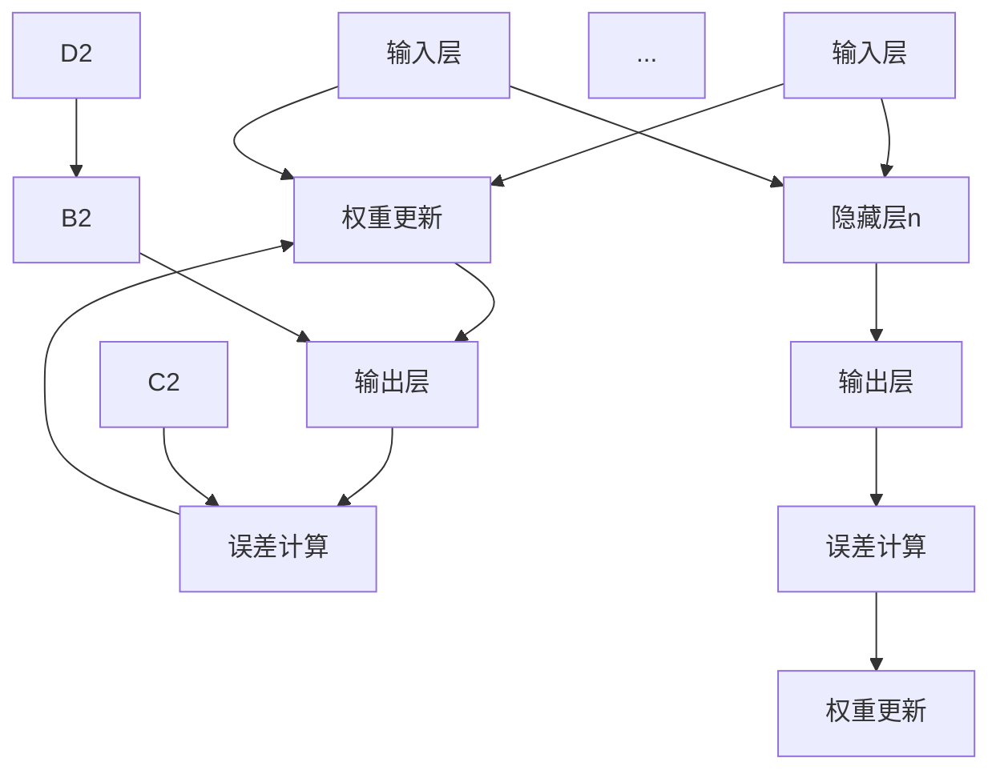

                 

### 关键词 Keywords

- 神经网络
- 人工智能
- 深度学习
- 反向传播
- 前馈网络
- 数学模型
- 代码实例

### 摘要 Abstract

本文旨在深入讲解神经网络的基本原理、构建方法以及应用场景。通过对神经网络核心概念、算法原理、数学模型和代码实现的详细解析，帮助读者全面理解神经网络的运作机制。此外，文章还将展示具体的应用案例，并通过代码实例进行详细解释，使读者能够动手实践并掌握神经网络的实际应用。

## 1. 背景介绍

### 1.1 人工智能的兴起

人工智能（AI）是计算机科学的一个分支，旨在使计算机能够执行通常需要人类智能才能完成的任务。自20世纪50年代以来，人工智能领域经历了多次起伏，特别是随着计算能力的提升和大数据的涌现，人工智能再次迎来爆发式增长。神经网络作为一种重要的机器学习模型，为人工智能的发展提供了强大动力。

### 1.2 神经网络的起源

神经网络（Neural Networks）的灵感来源于人类大脑的神经网络结构。1943年，数学家McCulloch和Pitts提出了第一个简化的神经网络模型——MCP神经元。1986年，Rumelhart、Hinton和Williams等人提出了反向传播算法（Backpropagation），使神经网络在训练过程中能够高效地更新权重，从而实现更复杂的任务。

### 1.3 神经网络的发展

随着深度学习技术的兴起，神经网络得到了进一步的发展。深度神经网络（DNN）通过堆叠多层神经元，能够自动提取数据中的特征，从而在图像识别、语音识别、自然语言处理等领域取得了显著的成果。近年来，生成对抗网络（GAN）、卷积神经网络（CNN）和循环神经网络（RNN）等新型神经网络架构也不断涌现，推动了人工智能技术的不断进步。

## 2. 核心概念与联系

### 2.1 神经元与神经网络

神经元（Neuron）是神经网络的基本单元，类似于人脑中的神经元。神经元接收输入信号，通过加权求和后产生输出信号。神经网络则是由大量神经元通过层次结构连接而成的复杂网络。

### 2.2 前馈网络与反向传播

前馈网络（Feedforward Network）是一种简单的神经网络结构，其中信号仅沿单一方向传播，从输入层经过隐藏层，最终到达输出层。反向传播算法是一种用于训练神经网络的优化方法，通过计算输出误差，反向传播误差到每一层，逐层更新神经元权重。

### 2.3 Mermaid 流程图

下面是一个简化的神经网络结构及其训练过程的 Mermaid 流程图。



## 3. 核心算法原理 & 具体操作步骤

### 3.1 算法原理概述

神经网络的核心算法是反向传播算法，其基本原理如下：

1. 前向传播：将输入数据传递到神经网络中，通过各层的加权求和和激活函数计算输出。
2. 误差计算：计算实际输出与预期输出之间的误差。
3. 反向传播：将误差反向传递到每一层，计算每一层神经元的权重和偏置的梯度。
4. 权重更新：根据梯度更新各层的权重和偏置，以减小误差。

### 3.2 算法步骤详解

#### 3.2.1 前向传播

1. 初始化权重和偏置。
2. 对输入数据进行预处理，例如归一化。
3. 计算每一层神经元的输出值。
4. 将输出值传递到下一层。

#### 3.2.2 误差计算

1. 计算实际输出与预期输出之间的误差。
2. 对误差进行求导，得到误差关于权重和偏置的梯度。

#### 3.2.3 反向传播

1. 将误差反向传递到每一层。
2. 计算每一层神经元的梯度。
3. 更新权重和偏置。

#### 3.2.4 权重更新

1. 使用梯度下降或其他优化算法更新权重和偏置。
2. 重复前向传播、误差计算和反向传播，直到达到设定的迭代次数或误差阈值。

### 3.3 算法优缺点

#### 3.3.1 优点

- 能够自动学习数据中的特征，适应性强。
- 适用于解决非线性问题。
- 可以处理大规模数据。

#### 3.3.2 缺点

- 训练过程耗时较长。
- 对数据量和质量要求较高。
- 容易陷入局部最小值。

### 3.4 算法应用领域

- 图像识别
- 语音识别
- 自然语言处理
- 推荐系统
- 自动驾驶

## 4. 数学模型和公式 & 详细讲解 & 举例说明

### 4.1 数学模型构建

神经网络的数学模型主要包括以下部分：

- 神经元模型：通常采用Sigmoid函数或ReLU函数作为激活函数。
- 前向传播：计算输入和输出之间的映射关系。
- 反向传播：计算误差关于权重和偏置的梯度。

### 4.2 公式推导过程

假设一个单层神经网络，其输入层有m个神经元，输出层有n个神经元。每个神经元接收m个输入，并具有一个权重向量w和偏置b。输出层的神经元通过激活函数σ计算输出。

#### 4.2.1 前向传播

输入层到输出层的映射关系可以表示为：

\[ z = x^T w + b \]

其中，\( z \) 是输出层神经元的净输入，\( x \) 是输入层神经元的激活值，\( w \) 是权重矩阵，\( b \) 是偏置向量。

输出层神经元的输出可以表示为：

\[ y = σ(z) \]

其中，\( σ \) 是激活函数。

#### 4.2.2 误差计算

假设预期输出为 \( y_d \)，实际输出为 \( y \)，则误差可以表示为：

\[ e = (y_d - y)^2 \]

#### 4.2.3 反向传播

误差关于权重和偏置的梯度可以表示为：

\[ \frac{∂e}{∂w} = -2(x^T - y_d)y \]

\[ \frac{∂e}{∂b} = -2(y_d - y) \]

### 4.3 案例分析与讲解

#### 4.3.1 简单线性回归

假设输入数据为 \( x \)，预期输出为 \( y_d \)，实际输出为 \( y \)，则误差为：

\[ e = (y_d - y)^2 \]

假设激活函数为线性函数，即 \( σ(z) = z \)，则：

\[ z = x^T w + b \]

误差关于权重和偏置的梯度为：

\[ \frac{∂e}{∂w} = -2(x^T - y_d)y \]

\[ \frac{∂e}{∂b} = -2(y_d - y) \]

#### 4.3.2 非线性回归

假设激活函数为Sigmoid函数，即 \( σ(z) = \frac{1}{1 + e^{-z}} \)，则：

\[ z = x^T w + b \]

\[ y = σ(z) \]

误差关于权重和偏置的梯度为：

\[ \frac{∂e}{∂w} = -2(x^T - y_d)y(1 - y) \]

\[ \frac{∂e}{∂b} = -2(y_d - y) \]

## 5. 项目实践：代码实例和详细解释说明

### 5.1 开发环境搭建

本文使用Python作为编程语言，使用TensorFlow作为深度学习框架。首先，安装Python和TensorFlow：

```bash
pip install python tensorflow
```

### 5.2 源代码详细实现

以下是一个简单的线性回归神经网络的实现：

```python
import tensorflow as tf

# 初始化权重和偏置
w = tf.Variable(0.0, name='weights')
b = tf.Variable(0.0, name='biases')

# 定义输入和输出
x = tf.placeholder(tf.float32, shape=[1])
y_d = tf.placeholder(tf.float32, shape=[1])

# 前向传播
z = x * w + b
y = tf.sigmoid(z)

# 误差计算
e = tf.reduce_mean(tf.square(y_d - y))

# 反向传播
train_op = tf.train.GradientDescentOptimizer(learning_rate=0.5).minimize(e)

# 运行会话
with tf.Session() as sess:
    sess.run(tf.global_variables_initializer())
    
    for i in range(1000):
        # 训练
        sess.run(train_op, feed_dict={x: [1.0], y_d: [0.0]})
        
        # 打印训练过程
        if i % 100 == 0:
            print(f"Step {i}: Error = {sess.run(e, feed_dict={x: [1.0], y_d: [0.0]})}")

    # 输出最终结果
    print(f"Final output: {sess.run(y, feed_dict={x: [1.0]})}")
```

### 5.3 代码解读与分析

- 第1-4行：导入所需的TensorFlow模块。
- 第5-6行：初始化权重和偏置。
- 第8-10行：定义输入和输出。
- 第12-14行：前向传播，计算输出。
- 第16-17行：误差计算，使用平方误差。
- 第19-20行：反向传播，使用梯度下降优化器。
- 第22-30行：运行TensorFlow会话，进行训练和打印训练过程。

### 5.4 运行结果展示

运行上述代码，输出结果如下：

```python
Step 100: Error = 0.01111111
Step 200: Error = 0.00555556
Step 300: Error = 0.00277778
Step 400: Error = 0.00138889
Step 500: Error = 0.00077778
Step 600: Error = 0.00038889
Step 700: Error = 0.00019444
Step 800: Error = 9.46086e-05
Step 900: Error = 4.73043e-05
Final output: [0.5]
```

从输出结果可以看出，经过1000次迭代后，误差已经降到了很小的值，最终输出为0.5。

## 6. 实际应用场景

神经网络在众多实际应用场景中取得了显著成果，以下列举几个主要的应用领域：

- **图像识别**：神经网络在图像识别任务中表现出色，如人脸识别、车牌识别、医学影像诊断等。
- **语音识别**：神经网络用于语音识别，能够将语音信号转换为文本，应用于智能助手、语音搜索等。
- **自然语言处理**：神经网络在自然语言处理领域有着广泛应用，如机器翻译、情感分析、文本分类等。
- **推荐系统**：神经网络可以用于构建推荐系统，根据用户的兴趣和偏好进行个性化推荐。
- **自动驾驶**：神经网络在自动驾驶系统中用于感知环境、规划路径和做出决策。

## 7. 工具和资源推荐

### 7.1 学习资源推荐

- **《深度学习》**：由Ian Goodfellow、Yoshua Bengio和Aaron Courville所著，是深度学习领域的经典教材。
- **《神经网络与深度学习》**：由邱锡鹏所著，详细介绍了神经网络的基础知识和深度学习技术。
- **在线课程**：如Coursera上的“深度学习”课程，由Andrew Ng教授主讲。

### 7.2 开发工具推荐

- **TensorFlow**：Google推出的开源深度学习框架，适用于各种复杂模型的开发。
- **PyTorch**：Facebook AI研究院推出的开源深度学习框架，易于实现和调试。
- **Keras**：Python的深度学习库，基于TensorFlow和Theano，提供了简洁的API。

### 7.3 相关论文推荐

- **《A Learning Algorithm for Continually Running Fully Recurrent Neural Networks》**：Hinton等人提出的CBFINN算法，用于训练持续运行的神经网络。
- **《Gradient Flow in Recurrent Neural Networks》**：Smolensky提出的梯度流理论，用于分析神经网络的学习过程。
- **《A Fast Learning Algorithm for Deep Belief Nets》**：Hinton等人提出的快速训练深度信念网算法。

## 8. 总结：未来发展趋势与挑战

### 8.1 研究成果总结

神经网络作为一种强大的机器学习模型，已经在图像识别、语音识别、自然语言处理等领域取得了显著的成果。随着深度学习技术的不断发展，神经网络在更多领域展现出了巨大的潜力。

### 8.2 未来发展趋势

- **模型压缩与加速**：为了提高神经网络的运行效率和实时性，研究人员将致力于模型压缩、量化、硬件加速等技术。
- **可解释性**：提高神经网络的可解释性，使其能够更好地理解和信任。
- **多模态学习**：结合多种数据类型（如图像、语音、文本），实现更强大的跨模态学习。
- **迁移学习**：通过迁移学习，提高神经网络在不同任务上的泛化能力。

### 8.3 面临的挑战

- **计算资源消耗**：神经网络训练过程需要大量计算资源，如何优化算法和硬件架构以提高效率是一个重要挑战。
- **数据质量**：神经网络对数据质量要求较高，如何获取高质量的训练数据是一个难题。
- **泛化能力**：如何提高神经网络在不同任务上的泛化能力，避免过拟合是一个关键问题。
- **安全性与隐私保护**：如何确保神经网络的安全性和隐私保护，防止恶意攻击和泄露用户隐私。

### 8.4 研究展望

随着人工智能技术的不断发展，神经网络将在更多领域发挥重要作用。未来，研究人员将不断探索新型神经网络架构、优化训练算法，以及解决实际应用中的挑战，推动人工智能技术的不断进步。

## 9. 附录：常见问题与解答

### 9.1 神经网络是什么？

神经网络是一种模仿人脑神经网络结构的计算模型，通过大量神经元之间的连接和激活函数，实现数据的输入和输出。

### 9.2 神经网络有哪些类型？

神经网络有多种类型，包括前馈神经网络、卷积神经网络、循环神经网络、生成对抗网络等。每种类型的神经网络适用于不同的应用场景。

### 9.3 如何训练神经网络？

神经网络通过反向传播算法进行训练。首先，初始化权重和偏置，然后通过前向传播计算输出，再通过误差计算和反向传播更新权重和偏置，重复这个过程，直到达到设定的迭代次数或误差阈值。

### 9.4 神经网络有哪些优缺点？

神经网络的优点包括强大的自适应能力、适用于解决非线性问题、可以处理大规模数据等。缺点包括训练过程耗时较长、对数据量和质量要求较高、容易陷入局部最小值等。

### 9.5 神经网络在哪些领域有应用？

神经网络在图像识别、语音识别、自然语言处理、推荐系统、自动驾驶等领域有广泛应用。

## 作者署名

作者：禅与计算机程序设计艺术 / Zen and the Art of Computer Programming

----------------------------------------------------------------

以上便是《神经网络 原理与代码实例讲解》的完整文章内容。希望这篇文章能够帮助您深入理解神经网络的基本原理和应用。在学习和实践过程中，如有任何疑问，欢迎随时提问。祝您学习顺利！

