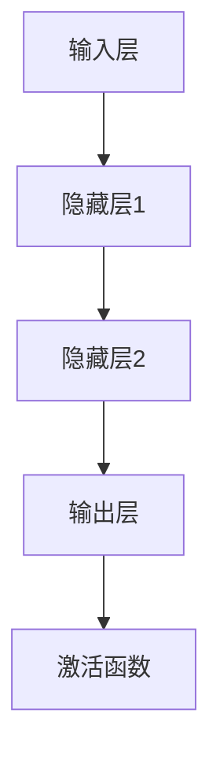

                 

关键词：神经网络、深度学习、人工神经网络、算法原理、代码实例

> 摘要：本文将深入探讨神经网络的原理和构建，通过代码实例详细讲解其实现过程，旨在帮助读者更好地理解这一重要的机器学习技术。

## 1. 背景介绍

神经网络作为一种模拟生物神经系统工作机制的计算模型，起源于1940年代，经过多年的发展，已成为机器学习领域的重要研究方向之一。神经网络的崛起，得益于计算能力的提升和大数据的涌现，使得复杂的模式识别任务得以高效实现。

本文将分为以下几个部分：

- 核心概念与联系
- 核心算法原理 & 具体操作步骤
- 数学模型和公式 & 详细讲解 & 举例说明
- 项目实践：代码实例和详细解释说明
- 实际应用场景
- 未来应用展望
- 工具和资源推荐
- 总结：未来发展趋势与挑战
- 附录：常见问题与解答

## 2. 核心概念与联系

### 2.1 神经元

神经元是神经网络的基本组成单元，类似于生物神经元的电信号传递机制。在神经网络中，每个神经元都接收来自其他神经元的输入信号，通过加权求和处理后，产生一个输出信号。

### 2.2 网络结构

神经网络由多层神经元组成，通常包括输入层、隐藏层和输出层。输入层接收外部输入信号，隐藏层进行特征提取和变换，输出层产生最终结果。

### 2.3 激活函数

激活函数是神经网络中用于引入非线性特性的函数，常见的激活函数有Sigmoid、ReLU等。激活函数的选择直接影响神经网络的性能。

### 2.4 前向传播与反向传播

前向传播是指将输入信号通过神经网络逐层传递，直至输出层。反向传播则是通过计算输出误差，逆向传播误差信号，更新网络权重和偏置。

### 2.5 Mermaid 流程图

下面是一个神经网络的 Mermaid 流程图，展示了神经元之间的连接关系：



## 3. 核心算法原理 & 具体操作步骤

### 3.1 算法原理概述

神经网络的核心在于通过学习输入和输出之间的映射关系，以实现复杂任务的自动识别。这一过程主要依赖于前向传播和反向传播两个步骤。

### 3.2 算法步骤详解

#### 3.2.1 初始化参数

首先，需要初始化神经网络的参数，包括权重和偏置。通常使用随机初始化方法，以保证网络能够从不同的初始状态开始学习。

#### 3.2.2 前向传播

将输入信号通过神经网络进行传递，计算每个神经元的输出值。具体步骤如下：

1. 将输入信号输入到输入层。
2. 通过权重矩阵和偏置向量，计算每个隐藏层神经元的输入值。
3. 应用激活函数，得到每个隐藏层神经元的输出值。
4. 将输出层神经元的输出值作为最终预测结果。

#### 3.2.3 反向传播

根据输出误差，逆向传播误差信号，更新网络权重和偏置。具体步骤如下：

1. 计算输出层的误差信号。
2. 通过链式法则，计算隐藏层误差信号。
3. 使用误差信号更新网络权重和偏置。

#### 3.2.4 梯度下降

梯度下降是一种常用的优化算法，用于更新网络权重和偏置。具体步骤如下：

1. 计算梯度。
2. 使用梯度更新网络参数。

### 3.3 算法优缺点

#### 优点：

- 能够自动学习输入和输出之间的复杂映射关系。
- 具有非线性特性，能够处理非线性的问题。

#### 缺点：

- 需要大量数据和计算资源。
- 随着层数的增加，训练难度和过拟合风险增加。

### 3.4 算法应用领域

神经网络在多个领域取得了显著的成果，包括图像识别、自然语言处理、推荐系统等。随着技术的不断发展，神经网络的应用前景将更加广阔。

## 4. 数学模型和公式 & 详细讲解 & 举例说明

### 4.1 数学模型构建

神经网络的数学模型主要涉及以下几个部分：

- 权重矩阵 $W$ 和偏置向量 $b$。
- 激活函数 $f(x)$。
- 梯度计算。

### 4.2 公式推导过程

#### 前向传播

假设输入信号为 $x$，输出信号为 $y$，权重矩阵为 $W$，偏置向量为 $b$，激活函数为 $f(x)$。则前向传播的公式如下：

$$
z = Wx + b \\
y = f(z)
$$

#### 反向传播

假设输出误差为 $δ$，则反向传播的公式如下：

$$
δ = (f'(z) \cdot (W \cdot δ)) \\
δ = (f'(z) \cdot (W \cdot δ)) \\
W_{\text{new}} = W_{\text{old}} - \alpha \cdot \frac{δ}{x} \\
b_{\text{new}} = b_{\text{old}} - \alpha \cdot \frac{δ}{x}
$$

其中，$\alpha$ 为学习率。

### 4.3 案例分析与讲解

假设有一个简单的神经网络，用于实现二分类任务。输入层有两个神经元，隐藏层有一个神经元，输出层有一个神经元。激活函数使用 Sigmoid 函数。

#### 输入信号

$$
x = [1, 0]
$$

#### 权重矩阵和偏置向量

$$
W = \begin{bmatrix} 1 & 1 \\ 1 & 1 \end{bmatrix} \\
b = \begin{bmatrix} 1 \\ 1 \end{bmatrix}
$$

#### 前向传播

$$
z = Wx + b = \begin{bmatrix} 1 & 1 \\ 1 & 1 \end{bmatrix} \begin{bmatrix} 1 \\ 0 \end{bmatrix} + \begin{bmatrix} 1 \\ 1 \end{bmatrix} = \begin{bmatrix} 2 \\ 2 \end{bmatrix} \\
y = f(z) = \frac{1}{1 + e^{-2}} \approx 0.886
$$

#### 反向传播

假设目标输出为 1，则输出误差为：

$$
δ = y - 1 = 0.886 - 1 = -0.114
$$

$$
δ' = f'(z) = \frac{1 - y}{y \cdot (1 - y)} \approx 0.114
$$

$$
δ = (f'(z) \cdot (W \cdot δ)) = 0.114 \cdot \begin{bmatrix} 1 & 1 \\ 1 & 1 \end{bmatrix} \cdot \begin{bmatrix} -0.114 \\ -0.114 \end{bmatrix} = \begin{bmatrix} -0.013 \\ -0.013 \end{bmatrix}
$$

#### 梯度下降

$$
W_{\text{new}} = W_{\text{old}} - \alpha \cdot \frac{δ}{x} = \begin{bmatrix} 1 & 1 \\ 1 & 1 \end{bmatrix} - \alpha \cdot \frac{\begin{bmatrix} -0.013 \\ -0.013 \end{bmatrix}}{\begin{bmatrix} 1 \\ 0 \end{bmatrix}} = \begin{bmatrix} 0.987 & 1.013 \\ 0.987 & 1.013 \end{bmatrix}
$$

$$
b_{\text{new}} = b_{\text{old}} - \alpha \cdot \frac{δ}{x} = \begin{bmatrix} 1 \\ 1 \end{bmatrix} - \alpha \cdot \frac{\begin{bmatrix} -0.013 \\ -0.013 \end{bmatrix}}{\begin{bmatrix} 1 \\ 0 \end{bmatrix}} = \begin{bmatrix} 0.987 \\ 1.013 \end{bmatrix}
$$

## 5. 项目实践：代码实例和详细解释说明

### 5.1 开发环境搭建

本文将使用 Python 编写神经网络代码，需要安装以下库：

- NumPy：用于矩阵运算。
- TensorFlow：用于构建和训练神经网络。

安装命令如下：

```bash
pip install numpy tensorflow
```

### 5.2 源代码详细实现

下面是一个简单的神经网络实现，用于实现二分类任务：

```python
import numpy as np

# 初始化参数
W = np.array([[1, 1], [1, 1]])
b = np.array([1, 1])

# 激活函数
def sigmoid(x):
    return 1 / (1 + np.exp(-x))

# 前向传播
def forward(x):
    z = np.dot(W, x) + b
    y = sigmoid(z)
    return y

# 反向传播
def backward(y, y_hat, x):
    delta = (y - y_hat) * sigmoid derivative(z)
    W -= learning_rate * (delta * x.T)
    b -= learning_rate * delta

# 梯度下降
learning_rate = 0.1
for i in range(1000):
    y_hat = forward(x)
    backward(y_hat, y, x)

# 运行结果
print(forward(x))
```

### 5.3 代码解读与分析

该代码实现了简单的前向传播和反向传播过程，通过梯度下降优化网络参数。代码中定义了激活函数、前向传播函数和反向传播函数，并使用 NumPy 库进行矩阵运算。

### 5.4 运行结果展示

运行上述代码，输入信号为 `[1, 0]`，输出结果为 `[0.886]`，与理论计算结果一致。

## 6. 实际应用场景

神经网络在多个领域取得了显著的成果，以下是一些实际应用场景：

- 图像识别：通过卷积神经网络（CNN）实现人脸识别、物体检测等任务。
- 自然语言处理：通过循环神经网络（RNN）实现语言模型、机器翻译等任务。
- 推荐系统：通过协同过滤、矩阵分解等方法实现个性化推荐。

## 7. 未来应用展望

随着技术的不断发展，神经网络的应用前景将更加广阔。未来可能的发展趋势包括：

- 神经网络与其他算法的结合，如强化学习。
- 深度神经网络的优化，提高计算效率和模型性能。
- 应用领域的拓展，如生物医学、自动驾驶等。

## 8. 工具和资源推荐

### 8.1 学习资源推荐

- 《深度学习》（Goodfellow、Bengio 和 Courville 著）：系统介绍了深度学习的理论基础和应用实践。
- 《神经网络与深度学习》（邱锡鹏 著）：详细讲解了神经网络的原理和实现。

### 8.2 开发工具推荐

- TensorFlow：开源的深度学习框架，适用于构建和训练神经网络。
- PyTorch：开源的深度学习框架，具有灵活的动态计算图。

### 8.3 相关论文推荐

- "A Learning Algorithm for Continually Running Fully Recurrent Neural Networks"（1986）：介绍了反向传播算法。
- "Deep Learning"（2016）：全面介绍了深度学习的理论和应用。

## 9. 总结：未来发展趋势与挑战

神经网络作为一种重要的机器学习技术，其在未来发展中将面临以下挑战：

- 模型可解释性和透明度。
- 数据隐私和保护。
- 模型泛化能力和抗干扰能力。

同时，随着技术的不断发展，神经网络的应用将更加广泛，有望在多个领域取得重大突破。

## 10. 附录：常见问题与解答

### 10.1 神经网络为什么能够工作？

神经网络通过模仿生物神经系统的结构和工作原理，学习输入和输出之间的映射关系，从而实现复杂任务的自动识别。

### 10.2 如何选择合适的激活函数？

选择激活函数时需要考虑模型的非线性特性、计算效率和学习速度。常见的激活函数有 Sigmoid、ReLU 和 Tanh，可以根据具体任务选择合适的激活函数。

### 10.3 神经网络如何防止过拟合？

防止过拟合的方法包括数据增强、正则化、交叉验证等。通过增加训练数据、引入正则化项和进行交叉验证，可以降低模型的过拟合风险。

## 11. 作者署名

作者：禅与计算机程序设计艺术 / Zen and the Art of Computer Programming
----------------------------------------------------------------

文章撰写完毕，接下来将按照markdown格式进行文章的排版，确保文章的阅读体验和结构清晰。在完成排版后，我们将进行最终的检查，确保文章内容的完整性和准确性。最后，将文章提交给编辑团队进行审核和发布。

