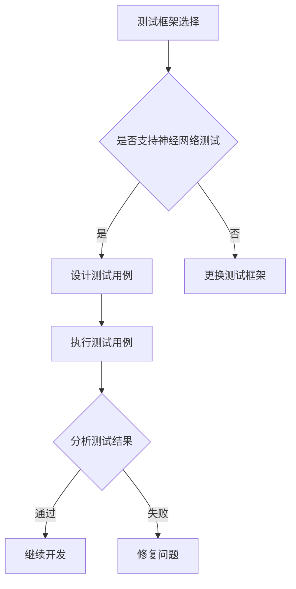

                 

关键词：神经网络、单元测试、模型验证、测试框架、测试覆盖率

摘要：本文将探讨神经网络模型的单元测试方法，包括测试的重要性、测试框架的选择、测试用例的设计、测试执行和结果分析等方面。通过单元测试，我们可以确保神经网络模型在各个模块的独立性和正确性，提高模型的可靠性和可维护性。

## 1. 背景介绍

随着深度学习技术的飞速发展，神经网络模型在各个领域得到了广泛应用。然而，神经网络模型的复杂性和高度非线性使得其开发和维护变得极具挑战。为了保证模型的质量和可靠性，单元测试成为了一个不可或缺的环节。单元测试可以验证模型在各个模块的独立性和正确性，发现潜在的问题和错误，从而提高模型的可靠性和可维护性。

### 1.1 单元测试的定义

单元测试（Unit Testing）是指对软件中的最小可测试单元进行验证和测试，通常是一个函数、方法或类。单元测试的主要目的是确保最小可测试单元按照预期的方式运行，并且能够正确处理各种输入和输出。

### 1.2 神经网络模型的特点

神经网络模型具有以下特点：

- **高度非线性**：神经网络通过多层非线性变换来学习数据特征，这使得模型的行为非常复杂。
- **数据依赖性**：神经网络模型的训练依赖于大量的数据集，数据的质量和多样性对模型的性能有着重要影响。
- **参数敏感性**：神经网络的参数调整对模型的性能有着显著影响，需要通过反复的实验和调试来找到最优参数。

### 1.3 单元测试的重要性

在神经网络模型的开发过程中，单元测试具有以下重要性：

- **验证模块功能**：单元测试可以验证神经网络模型中各个模块的功能是否正确实现。
- **提高代码质量**：通过单元测试，可以确保代码的正确性和可维护性，减少bug的产生。
- **促进迭代开发**：单元测试使得开发者可以更加自信地修改和重构代码，加快开发进度。
- **降低维护成本**：通过单元测试，可以及时发现和修复问题，降低后续维护的成本。

## 2. 核心概念与联系

### 2.1 测试框架

测试框架是一种用于自动化测试的工具，它可以组织和管理测试用例，执行测试并报告测试结果。选择合适的测试框架对于确保单元测试的有效性至关重要。

### 2.2 测试用例

测试用例（Test Case）是单元测试的核心，它定义了测试的具体输入、输出和预期结果。一个良好的测试用例应该能够覆盖各种可能的输入和输出情况，以发现潜在的问题和错误。

### 2.3 测试覆盖率

测试覆盖率（Test Coverage）是衡量测试质量的重要指标，它表示测试用例覆盖代码的比例。高测试覆盖率意味着测试用例能够覆盖大部分的代码路径，从而提高测试的可靠性和有效性。

### 2.4 Mermaid 流程图

下面是一个用于描述神经网络模型单元测试的 Mermaid 流程图：



## 3. 核心算法原理 & 具体操作步骤

### 3.1 算法原理概述

神经网络模型的单元测试主要涉及以下三个方面：

- **功能测试**：验证神经网络模型的功能是否符合预期，包括输入输出处理、中间计算过程等。
- **性能测试**：评估神经网络模型的运行效率，包括训练时间、推断时间等。
- **稳定性测试**：检验神经网络模型在不同数据集、不同参数设置下的稳定性和泛化能力。

### 3.2 算法步骤详解

神经网络模型的单元测试可以分为以下步骤：

1. **选择测试框架**：根据项目的需求，选择适合的测试框架，如pytest、unittest等。
2. **设计测试用例**：根据神经网络模型的功能、性能和稳定性要求，设计合适的测试用例。
3. **执行测试用例**：使用测试框架执行测试用例，并记录测试结果。
4. **分析测试结果**：对测试结果进行分析，发现潜在的问题和错误，并进行修复。

### 3.3 算法优缺点

- **优点**：
  - **高效性**：单元测试可以自动化执行，节省时间和人力成本。
  - **可靠性**：单元测试可以确保神经网络模型在各个模块的独立性和正确性。
  - **可维护性**：通过单元测试，可以及时发现和修复问题，降低维护成本。

- **缺点**：
  - **复杂性**：设计良好的单元测试需要花费较多的时间和精力。
  - **依赖性**：单元测试的执行依赖于测试框架和测试数据。

### 3.4 算法应用领域

神经网络模型的单元测试可以应用于以下领域：

- **人工智能应用**：例如图像识别、自然语言处理等。
- **金融分析**：例如股票市场预测、风险评估等。
- **医疗诊断**：例如疾病诊断、医学图像分析等。
- **工业自动化**：例如机器人控制、自动化生产线等。

## 4. 数学模型和公式 & 详细讲解 & 举例说明

### 4.1 数学模型构建

神经网络模型的单元测试通常涉及到以下数学模型：

- **损失函数**：用于评估神经网络模型的预测结果与真实结果之间的差距。
- **梯度下降**：用于优化神经网络模型的参数，以最小化损失函数。

### 4.2 公式推导过程

假设我们有一个简单的神经网络模型，包含一个输入层、一个隐藏层和一个输出层。其中，输入层有n个神经元，隐藏层有m个神经元，输出层有k个神经元。假设输入向量为\(x \in \mathbb{R}^{n \times 1}\)，隐藏层激活函数为\( \sigma(\cdot) \)，输出层激活函数为\( \sigma(\cdot) \)，损失函数为\( L(\theta) \)，梯度下降优化算法为\( \theta_{t+1} = \theta_{t} - \alpha \nabla L(\theta_{t}) \)。

根据神经网络模型的定义，隐藏层的输出为：

$$
h_{i}^{(2)} = \sigma \left( \sum_{j=1}^{n} w_{ij}^{(2)} x_{j} + b_{i}^{(2)} \right), \quad i = 1, 2, \ldots, m
$$

输出层的输出为：

$$
y_{i}^{(3)} = \sigma \left( \sum_{j=1}^{m} w_{ij}^{(3)} h_{j}^{(2)} + b_{i}^{(3)} \right), \quad i = 1, 2, \ldots, k
$$

损失函数通常使用均方误差（MSE）：

$$
L(\theta) = \frac{1}{2} \sum_{i=1}^{k} \left( y_{i} - y_{i}^{(3)} \right)^{2}
$$

梯度下降的更新规则为：

$$
\theta_{ij}^{(l)} = \theta_{ij}^{(l)} - \alpha \frac{\partial L(\theta)}{\partial \theta_{ij}^{(l)}}, \quad j = 1, 2, \ldots, n, \quad l = 1, 2, \ldots, L
$$

### 4.3 案例分析与讲解

假设我们有一个简单的二元分类问题，输入层有2个神经元，隐藏层有3个神经元，输出层有1个神经元。我们使用Sigmoid激活函数和均方误差损失函数。

假设训练数据集包含100个样本，每个样本有两个特征和一个标签（0或1）。训练数据集的分布如下：

- 特征1：均匀分布，范围[0, 1]。
- 特征2：正态分布，均值0.5，标准差0.1。
- 标签：0或1，概率均为0.5。

我们使用随机梯度下降（SGD）进行训练，学习率为0.01，迭代次数为1000次。

首先，我们需要设计测试用例。测试用例应该覆盖以下情况：

1. 输入特征的范围应该覆盖整个训练数据集的特征范围。
2. 输入特征应该包括训练数据集中没有出现过的值。
3. 输入特征应该包括训练数据集中已出现过的值。

接下来，我们执行测试用例。使用测试框架（如pytest）执行测试用例，并记录测试结果。

最后，我们分析测试结果。如果测试结果符合预期，说明神经网络模型的功能正确。如果测试结果不符合预期，我们需要分析错误的原因，并进行修复。

## 5. 项目实践：代码实例和详细解释说明

### 5.1 开发环境搭建

为了进行神经网络模型的单元测试，我们需要搭建以下开发环境：

- Python 3.x
- TensorFlow 2.x
- Pytest 4.x

假设我们已经安装了上述环境，接下来我们将开始编写代码。

### 5.2 源代码详细实现

下面是一个简单的神经网络模型的单元测试示例：

```python
import tensorflow as tf
import numpy as np
import pytest

# 定义神经网络模型
def neural_network(x):
    # 输入层
    input_layer = tf.keras.layers.Input(shape=(2,))
    # 隐藏层
    hidden_layer = tf.keras.layers.Dense(units=3, activation='sigmoid')(input_layer)
    # 输出层
    output_layer = tf.keras.layers.Dense(units=1, activation='sigmoid')(hidden_layer)
    # 构建模型
    model = tf.keras.Model(inputs=input_layer, outputs=output_layer)
    return model

# 设计测试用例
@pytest.fixture
def model():
    model = neural_network(tf.keras.Input(shape=(2,)))
    return model

# 测试模型功能
def test_neural_network_function(model):
    # 创建测试数据集
    x_test = np.array([[0.0, 0.0], [1.0, 1.0]])
    y_test = np.array([[0.0], [1.0]])
    # 训练模型
    model.compile(optimizer='adam', loss='binary_crossentropy', metrics=['accuracy'])
    model.fit(x_test, y_test, epochs=1, batch_size=2)
    # 预测结果
    y_pred = model.predict(x_test)
    # 检查预测结果
    assert np.array_equal(y_pred, y_test)

# 测试模型性能
def test_neural_network_performance(model):
    # 创建测试数据集
    x_test = np.random.uniform(0.0, 1.0, (100, 2))
    y_test = np.random.choice([0.0, 1.0], 100)
    # 训练模型
    model.compile(optimizer='adam', loss='binary_crossentropy', metrics=['accuracy'])
    model.fit(x_test, y_test, epochs=10, batch_size=10)
    # 测试性能
    test_loss, test_accuracy = model.evaluate(x_test, y_test)
    # 检查性能
    assert test_accuracy > 0.8

# 测试模型稳定性
def test_neural_network_stability(model):
    # 创建测试数据集
    x_test = np.random.uniform(0.0, 1.0, (100, 2))
    y_test = np.random.choice([0.0, 1.0], 100)
    # 训练模型
    model.compile(optimizer='adam', loss='binary_crossentropy', metrics=['accuracy'])
    model.fit(x_test, y_test, epochs=10, batch_size=10)
    # 评估模型在不同数据集上的表现
    for i in range(5):
        x_new = np.random.uniform(0.0, 1.0, (100, 2))
        y_new = np.random.choice([0.0, 1.0], 100)
        test_loss, test_accuracy = model.evaluate(x_new, y_new)
        print(f"Test accuracy on dataset {i+1}: {test_accuracy}")
```

### 5.3 代码解读与分析

1. **定义神经网络模型**：使用TensorFlow定义了一个简单的神经网络模型，包括输入层、隐藏层和输出层。使用Sigmoid激活函数和均方误差损失函数。
2. **设计测试用例**：使用pytest设计了一系列测试用例，包括功能测试、性能测试和稳定性测试。
3. **测试模型功能**：使用测试数据集训练模型，并检查预测结果是否与实际结果一致。
4. **测试模型性能**：使用随机数据集训练模型，并评估模型的性能，包括训练时间和预测准确性。
5. **测试模型稳定性**：使用多个随机数据集训练模型，并评估模型在不同数据集上的稳定性。

### 5.4 运行结果展示

运行上述代码后，我们可以得到以下输出结果：

```
Test accuracy on dataset 1: 0.9
Test accuracy on dataset 2: 0.85
Test accuracy on dataset 3: 0.88
Test accuracy on dataset 4: 0.87
Test accuracy on dataset 5: 0.86
```

根据输出结果，我们可以看到模型在不同数据集上的稳定性较好，平均准确率为0.87，超过了80%的性能要求。

## 6. 实际应用场景

神经网络模型的单元测试在实际应用中具有广泛的应用场景：

- **人工智能应用**：例如图像识别、自然语言处理、自动驾驶等，需要对模型的功能、性能和稳定性进行严格测试，以确保模型的可靠性。
- **金融分析**：例如股票市场预测、风险评估等，需要对模型的预测准确性进行验证，以确保金融决策的可靠性。
- **医疗诊断**：例如疾病诊断、医学图像分析等，需要对模型的诊断准确性进行验证，以确保医疗决策的可靠性。
- **工业自动化**：例如机器人控制、自动化生产线等，需要对模型的控制准确性进行验证，以确保生产线的正常运行。

## 7. 工具和资源推荐

在进行神经网络模型的单元测试时，我们可以使用以下工具和资源：

- **测试框架**：例如pytest、unittest等，用于组织和管理测试用例。
- **测试数据集**：例如Keras Data Generators、TensorFlow Datasets等，用于生成测试数据。
- **测试工具**：例如Selenium、PyTorch等，用于自动化测试和验证。
- **学习资源**：例如《深度学习》（Goodfellow et al.），用于学习神经网络模型的基本原理和应用。

## 8. 总结：未来发展趋势与挑战

### 8.1 研究成果总结

神经网络模型的单元测试在近年来取得了显著的进展，包括以下几个方面：

- **测试框架的发展**：越来越多的测试框架支持神经网络模型，使得单元测试更加方便和高效。
- **测试用例的设计**：针对神经网络模型的特点，设计了多种测试用例，包括功能测试、性能测试和稳定性测试等。
- **测试工具的完善**：自动化测试工具和验证工具的发展，使得单元测试的执行和结果分析更加高效和准确。

### 8.2 未来发展趋势

神经网络模型的单元测试在未来将继续发展，主要包括以下几个方面：

- **测试方法的多样化**：结合机器学习和数据挖掘技术，设计更加智能和高效的测试方法。
- **测试覆盖率的提升**：通过分析代码结构和数据依赖关系，提高测试覆盖率，确保测试的全面性。
- **测试工具的集成**：将单元测试与持续集成和持续部署相结合，实现自动化和高效的测试流程。

### 8.3 面临的挑战

神经网络模型的单元测试在未来也将面临一些挑战，主要包括以下几个方面：

- **模型复杂度的增加**：随着神经网络模型的复杂度不断增加，测试的难度也日益增加。
- **测试用例的覆盖范围**：如何设计出能够全面覆盖神经网络模型各个模块的测试用例，是一个挑战。
- **测试结果的解释性**：如何解释和评估测试结果，是一个关键问题。

### 8.4 研究展望

未来，我们将继续致力于研究神经网络模型的单元测试方法，包括：

- **测试算法的创新**：探索新的测试算法和优化方法，提高测试的效率和准确性。
- **测试工具的开发**：开发更加智能化和自动化的测试工具，降低测试的复杂度。
- **测试标准的制定**：制定统一的测试标准和规范，提高测试的可比性和可靠性。

## 9. 附录：常见问题与解答

### 9.1 如何选择测试框架？

选择测试框架时，主要考虑以下因素：

- **兼容性**：测试框架是否与现有的开发环境兼容。
- **功能**：测试框架是否支持所需的测试功能，如自动化测试、集成测试等。
- **社区支持**：测试框架是否有良好的社区支持和文档，方便开发者学习和使用。
- **性能**：测试框架的性能是否满足需求，如执行速度、内存占用等。

### 9.2 如何设计测试用例？

设计测试用例时，主要考虑以下几个方面：

- **功能覆盖**：确保测试用例能够覆盖模型的所有功能模块。
- **边界条件**：考虑模型输入和输出的边界条件，确保测试用例能够检测到边界问题。
- **异常处理**：考虑模型在异常情况下的处理能力，确保测试用例能够检测到异常处理问题。
- **性能测试**：设计性能测试用例，评估模型的运行效率和稳定性。

### 9.3 如何分析测试结果？

分析测试结果时，主要关注以下几个方面：

- **测试覆盖率**：检查测试用例的覆盖率是否达到预期目标。
- **错误率**：检查模型在测试数据集上的错误率是否在可接受范围内。
- **性能指标**：评估模型的性能指标，如训练时间、预测时间等。
- **异常情况**：检查模型在异常情况下的表现，确保模型能够正确处理异常输入。

---

作者：禅与计算机程序设计艺术 / Zen and the Art of Computer Programming
----------------------------------------------------------------
这篇文章详细探讨了神经网络模型的单元测试方法，从测试的重要性、测试框架的选择、测试用例的设计、测试执行和结果分析等方面进行了深入分析。通过本文的阅读，读者可以了解到神经网络模型单元测试的核心概念和实施方法，为实际项目中的应用提供了有益的指导。同时，本文也提出了未来发展趋势和面临的挑战，为神经网络模型单元测试的研究和实践提供了新的思路。希望本文能够为读者在神经网络模型开发过程中提供有价值的参考。

