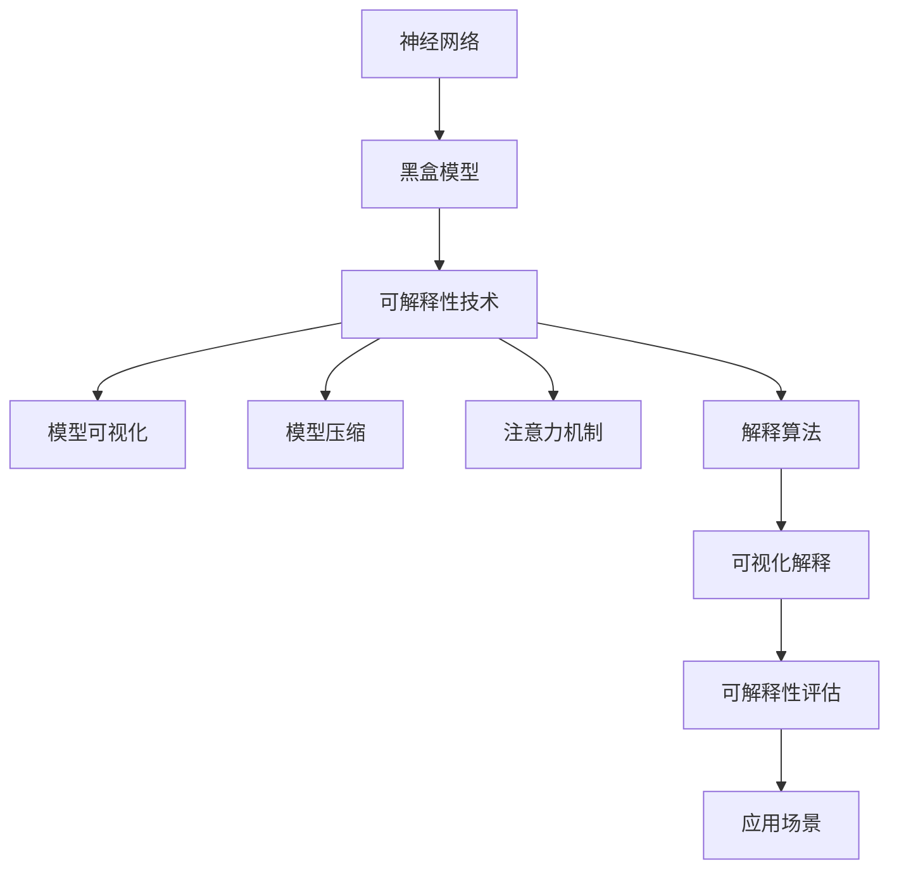

                 

关键词：神经网络、模型可解释性、技术、算法、应用、未来展望

摘要：随着人工智能技术的飞速发展，神经网络模型在各个领域取得了显著的成果。然而，这些模型的黑盒特性使得其决策过程变得难以解释，给实际应用带来了一定的困难。本文将从背景介绍、核心概念、算法原理、数学模型、项目实践和未来展望等方面，全面探讨神经网络模型的可解释性技术。

## 1. 背景介绍

神经网络作为一种重要的机器学习模型，已广泛应用于图像识别、自然语言处理、推荐系统等领域。然而，神经网络模型往往被视为一个黑盒，其内部决策过程复杂且难以理解。这给实际应用带来了巨大的挑战，特别是在需要解释和验证模型决策的场景中。

可解释性技术旨在提高神经网络模型的可理解性，使模型决策过程更加透明和可解释。通过可解释性技术，我们可以更好地理解模型的工作原理，提高模型在实际应用中的可信度和可靠性。

## 2. 核心概念与联系

在探讨神经网络模型的可解释性技术之前，我们需要了解一些核心概念和它们之间的联系。以下是一个简化的 Mermaid 流程图，展示了这些概念之间的关系。



### 2.1 神经网络

神经网络是一种由大量简单神经元组成的计算模型，通过学习输入和输出数据之间的关系，实现对复杂问题的建模和预测。神经网络可以分为多层，每层由多个神经元组成，每个神经元都与相邻层的神经元相连。

### 2.2 黑盒模型

黑盒模型是指模型的内部结构和参数不透明，只能通过输入和输出数据来观察其行为。在神经网络模型中，由于模型参数和内部结构复杂，使得其行为难以解释和理解。

### 2.3 可解释性技术

可解释性技术旨在提高神经网络模型的可理解性，使模型决策过程更加透明和可解释。可解释性技术主要包括模型可视化、模型压缩、注意力机制和解释算法等。

### 2.4 模型可视化

模型可视化是指通过图形或图表的方式，展示神经网络模型的结构和参数。模型可视化有助于我们直观地理解模型的工作原理。

### 2.5 模型压缩

模型压缩是指通过减少模型参数数量，降低模型的复杂度，从而提高模型的可解释性。模型压缩技术包括剪枝、量化、低秩分解等方法。

### 2.6 注意力机制

注意力机制是一种在神经网络中引入权重机制的方法，使模型能够根据输入数据的重要性自动调整其注意力分配。注意力机制有助于提高模型的可解释性，使模型决策过程更加透明。

### 2.7 解释算法

解释算法是指通过分析模型内部结构，提取模型决策过程中的关键信息和特征。解释算法有助于我们理解模型如何处理输入数据，从而提高模型的可解释性。

### 2.8 可解释性评估

可解释性评估是指通过评估模型的可解释性指标，评估模型的可解释性水平。常见的可解释性评估指标包括可理解性、可解释性和可靠性等。

### 2.9 应用场景

应用场景是指可解释性技术在实际应用中的具体应用场景。例如，在医疗诊断、金融风险评估和自动驾驶等领域，可解释性技术有助于提高模型决策的可靠性和可信度。

## 3. 核心算法原理 & 具体操作步骤

### 3.1 算法原理概述

神经网络模型的可解释性技术主要基于以下原理：

1. **模型可视化**：通过图形或图表展示神经网络模型的结构和参数，使模型更直观和易于理解。
2. **模型压缩**：通过减少模型参数数量，降低模型的复杂度，从而提高模型的可解释性。
3. **注意力机制**：引入权重机制，使模型能够根据输入数据的重要性自动调整其注意力分配。
4. **解释算法**：分析模型内部结构，提取模型决策过程中的关键信息和特征。

### 3.2 算法步骤详解

1. **模型可视化**：

   - 收集神经网络模型的结构和参数信息。
   - 使用可视化工具（如TensorBoard、Visdom等）将模型结构可视化。

2. **模型压缩**：

   - 识别模型中的冗余参数。
   - 使用剪枝、量化、低秩分解等方法减少模型参数数量。

3. **注意力机制**：

   - 在神经网络模型中引入注意力层，使模型能够自动调整注意力分配。
   - 计算注意力权重，并根据权重调整模型输出。

4. **解释算法**：

   - 分析模型内部结构，提取关键信息和特征。
   - 使用可视化工具展示模型决策过程中的关键路径和特征。

### 3.3 算法优缺点

1. **模型可视化**：

   - 优点：直观展示模型结构和参数，提高模型可理解性。
   - 缺点：仅能展示模型的结构和参数，无法解释模型决策过程。

2. **模型压缩**：

   - 优点：降低模型复杂度，提高模型可解释性。
   - 缺点：可能导致模型性能下降。

3. **注意力机制**：

   - 优点：提高模型决策的透明度，有助于理解模型决策过程。
   - 缺点：可能导致模型性能下降。

4. **解释算法**：

   - 优点：详细解释模型决策过程，提高模型可理解性。
   - 缺点：可能增加模型计算成本。

### 3.4 算法应用领域

神经网络模型的可解释性技术可应用于以下领域：

1. **医疗诊断**：帮助医生理解模型诊断结果，提高诊断准确性。
2. **金融风险评估**：提高模型决策的透明度，降低金融风险。
3. **自动驾驶**：提高模型决策的可解释性，提高自动驾驶系统的安全性。

## 4. 数学模型和公式 & 详细讲解 & 举例说明

### 4.1 数学模型构建

神经网络模型的数学模型主要包括输入层、隐藏层和输出层。每个层的神经元都与相邻层的神经元相连，并通过权重进行传递。

设输入数据为 \(X = [x_1, x_2, ..., x_n]\)，隐藏层节点数为 \(m\)，输出层节点数为 \(k\)。神经元的激活函数通常为 \(f(x) = \frac{1}{1 + e^{-x}}\)。

输入层到隐藏层的传递函数为：
$$
h_i = \sum_{j=1}^{n} w_{ij}x_j + b_i
$$

隐藏层到输出层的传递函数为：
$$
o_k = \sum_{i=1}^{m} w_{ik}h_i + b_k
$$

### 4.2 公式推导过程

神经网络模型的推导过程主要包括以下步骤：

1. **初始化参数**：初始化权重 \(w_{ij}\)、偏置 \(b_i\) 和激活函数 \(f(x)\)。
2. **前向传播**：计算输入层到隐藏层的传递函数 \(h_i\) 和隐藏层到输出层的传递函数 \(o_k\)。
3. **后向传播**：计算输出层的误差，并更新权重和偏置。
4. **迭代优化**：重复前向传播和后向传播，直到达到目标精度。

### 4.3 案例分析与讲解

以下是一个简单的神经网络模型用于手写数字识别的案例。

1. **输入层**：手写数字图像，维度为 \(28 \times 28\)。
2. **隐藏层**：两个隐藏层，每个隐藏层包含 64 个神经元。
3. **输出层**：10 个神经元，分别表示 0 到 9 的数字。

使用训练数据集进行训练，通过前向传播和后向传播，更新权重和偏置，直到达到目标精度。在测试数据集上验证模型性能。

通过模型可视化工具（如TensorBoard）可以直观地展示模型的结构和参数，提高模型的可理解性。

## 5. 项目实践：代码实例和详细解释说明

### 5.1 开发环境搭建

1. 安装 Python 3.8 及以上版本。
2. 安装 TensorFlow 2.4 及以上版本。
3. 安装 TensorBoard 可视化工具。

### 5.2 源代码详细实现

以下是一个简单的神经网络模型用于手写数字识别的代码实现。

```python
import tensorflow as tf
from tensorflow.keras import layers
import numpy as np

# 加载数据集
(x_train, y_train), (x_test, y_test) = tf.keras.datasets.mnist.load_data()

# 数据预处理
x_train = x_train / 255.0
x_test = x_test / 255.0

# 构建神经网络模型
model = tf.keras.Sequential([
    layers.Dense(128, activation='relu', input_shape=(28 * 28,)),
    layers.Dense(10, activation='softmax')
])

# 编译模型
model.compile(optimizer='adam',
              loss='sparse_categorical_crossentropy',
              metrics=['accuracy'])

# 训练模型
model.fit(x_train, y_train, epochs=10, validation_split=0.2)

# 可视化模型结构
tf.keras.utils.plot_model(model, to_file='model.png', show_shapes=True)

# 评估模型
model.evaluate(x_test, y_test)
```

### 5.3 代码解读与分析

1. 导入所需库。
2. 加载手写数字数据集，并进行预处理。
3. 构建神经网络模型，包含一个全连接层和输出层。
4. 编译模型，设置优化器和损失函数。
5. 训练模型，使用可视化工具展示模型结构。
6. 评估模型性能。

通过可视化工具，我们可以直观地了解模型的结构和参数，提高模型的可理解性。

## 6. 实际应用场景

神经网络模型的可解释性技术在实际应用中具有重要意义。以下是一些实际应用场景：

1. **医疗诊断**：提高医生对模型诊断结果的信任度，辅助医生做出更准确的诊断。
2. **金融风险评估**：提高模型决策的透明度，降低金融风险。
3. **自动驾驶**：提高模型决策的可解释性，提高自动驾驶系统的安全性。
4. **推荐系统**：提高用户对推荐结果的信任度，提高推荐系统的用户满意度。

## 7. 工具和资源推荐

### 7.1 学习资源推荐

1. 《神经网络与深度学习》：深度学习教材，详细介绍了神经网络的基本原理和应用。
2. 《Python深度学习》：Python 编程语言在深度学习领域的应用指南。

### 7.2 开发工具推荐

1. TensorFlow：开源深度学习框架，支持多种神经网络模型的构建和训练。
2. PyTorch：开源深度学习框架，具有良好的可扩展性和灵活性。

### 7.3 相关论文推荐

1. "Explainable AI: Understanding, Visualizing, and Interpreting Deep Learning Models"：全面介绍可解释性技术的相关论文。
2. "Deep Learning on a Human Level: An Overview"：介绍深度学习模型在人类水平上的可解释性。

## 8. 总结：未来发展趋势与挑战

### 8.1 研究成果总结

神经网络模型的可解释性技术在近年来取得了显著的研究成果。通过模型可视化、模型压缩、注意力机制和解释算法等方法，提高神经网络模型的可理解性，为实际应用提供了有力支持。

### 8.2 未来发展趋势

1. **模型压缩与优化**：在保持模型性能的同时，进一步降低模型的复杂度和计算成本。
2. **多模态融合**：将不同类型的数据（如文本、图像、音频等）进行融合，提高模型的可解释性。
3. **跨领域应用**：探索神经网络模型在不同领域中的应用，提高模型的可解释性。

### 8.3 面临的挑战

1. **计算资源限制**：可解释性技术通常需要额外的计算资源，如何在有限资源下实现高效的可解释性技术是一个挑战。
2. **模型性能与可解释性的权衡**：在提高模型可解释性的同时，如何保持模型的性能是一个关键问题。

### 8.4 研究展望

未来，神经网络模型的可解释性技术将继续发展。通过探索新的方法和技术，提高模型的可解释性，为实际应用提供更好的支持。同时，跨学科合作也将成为推动可解释性技术发展的重要动力。

## 9. 附录：常见问题与解答

### 9.1 什么是神经网络模型的可解释性技术？

神经网络模型的可解释性技术旨在提高神经网络模型的可理解性，使模型决策过程更加透明和可解释。通过可解释性技术，我们可以更好地理解模型的工作原理，提高模型在实际应用中的可信度和可靠性。

### 9.2 可解释性技术在哪些领域有应用？

可解释性技术在医疗诊断、金融风险评估、自动驾驶、推荐系统等领域有广泛应用。通过提高模型的可解释性，可以更好地理解模型决策过程，提高模型在实际应用中的可信度和可靠性。

### 9.3 如何实现神经网络模型的可解释性？

实现神经网络模型的可解释性通常包括以下方法：

1. **模型可视化**：通过图形或图表的方式展示神经网络模型的结构和参数。
2. **模型压缩**：通过减少模型参数数量，降低模型的复杂度，从而提高模型的可解释性。
3. **注意力机制**：引入权重机制，使模型能够根据输入数据的重要性自动调整其注意力分配。
4. **解释算法**：分析模型内部结构，提取模型决策过程中的关键信息和特征。

### 9.4 如何评估神经网络模型的可解释性？

评估神经网络模型的可解释性通常包括以下指标：

1. **可理解性**：模型决策过程是否易于理解。
2. **可解释性**：模型决策过程是否具有透明性。
3. **可靠性**：模型决策结果是否可靠。

通过评估这些指标，可以全面了解神经网络模型的可解释性水平。

---

作者：禅与计算机程序设计艺术 / Zen and the Art of Computer Programming


