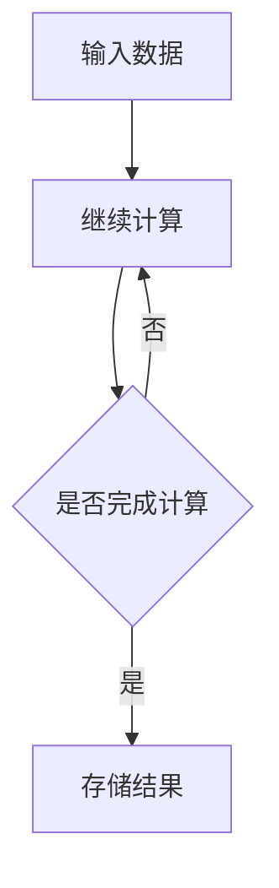

                 

 > **关键词**: 神经网络，硬件，软件2.0，运行环境，计算能力，效率，能耗。

> **摘要**: 本文深入探讨了神经网络硬件在软件2.0时代的重要性，分析了其设计原理、核心算法、数学模型，并通过项目实践展示了其实际应用。同时，讨论了未来发展趋势与挑战，为研究者提供了一些工具和资源推荐。

## 1. 背景介绍

随着人工智能技术的飞速发展，神经网络作为一种重要的算法模型，已经被广泛应用于计算机视觉、自然语言处理、推荐系统等领域。然而，神经网络算法对计算能力和存储资源的高需求，使得传统的计算机硬件难以满足其运行需求。这就需要我们探索新的硬件架构，以提升神经网络的运行效率，降低能耗。

### 1.1 软件2.0的概念

软件2.0，即软件即服务（Software as a Service，SaaS），是一种通过互联网提供软件服务的模式。用户无需购买软件，只需通过网络订阅服务即可使用。这种模式使得软件的部署、升级和维护变得更加便捷，同时也降低了用户的成本。

### 1.2 神经网络硬件的需求

神经网络硬件的需求主要包括以下几个方面：

- **高效的计算能力**：神经网络算法的计算量巨大，需要硬件提供强大的计算能力。
- **低能耗**：随着数据中心能耗的增加，降低能耗成为了一个重要的问题。
- **存储容量**：神经网络算法需要大量的数据存储，因此硬件需要有足够的存储容量。
- **灵活性**：硬件需要能够适应不同的神经网络模型和算法需求。

## 2. 核心概念与联系

### 2.1 神经网络硬件的定义

神经网络硬件，是指专门用于加速神经网络计算和处理的服务器、芯片等硬件设备。这些设备通过硬件加速技术，如SIMD（单指令多数据流）、GPU（图形处理器）等，提高了神经网络的计算效率。

### 2.2 神经网络硬件的工作原理

神经网络硬件的工作原理主要包括以下几个方面：

- **数据处理**：将输入数据分成多个数据流，同时进行处理。
- **计算加速**：利用硬件加速技术，如SIMD、GPU等，提高计算速度。
- **数据存储**：将处理结果存储到高速缓存或内存中，以便后续处理。

### 2.3 神经网络硬件与软件2.0的联系

神经网络硬件与软件2.0的联系主要体现在以下几个方面：

- **计算能力**：神经网络硬件提供了强大的计算能力，能够支持软件2.0时代大量复杂计算的需求。
- **存储容量**：神经网络硬件提供了足够的存储容量，能够满足软件2.0时代大量数据存储的需求。
- **能耗**：神经网络硬件通过硬件加速技术，降低了能耗，有助于实现绿色计算。

### 2.4 Mermaid 流程图



## 3. 核心算法原理 & 具体操作步骤

### 3.1 算法原理概述

神经网络硬件的核心算法是基于神经网络模型的计算。神经网络模型由多个神经元组成，每个神经元都是一个简单的计算单元。神经网络通过调整神经元之间的连接权重，实现对数据的分类、回归等操作。

### 3.2 算法步骤详解

1. **初始化**：初始化神经网络模型，包括设置神经元的数量、连接权重等。
2. **数据处理**：将输入数据分成多个数据流，同时进行处理。
3. **计算**：利用硬件加速技术，如SIMD、GPU等，对数据流进行计算。
4. **存储结果**：将处理结果存储到高速缓存或内存中，以便后续处理。
5. **迭代**：重复步骤2-4，直到达到预定的计算精度或迭代次数。

### 3.3 算法优缺点

**优点**：

- **高效**：利用硬件加速技术，提高了计算速度。
- **低能耗**：通过优化硬件设计，降低了能耗。

**缺点**：

- **高成本**：神经网络硬件的制造成本较高。
- **灵活性受限**：硬件设计的灵活性较低，难以适应多种神经网络模型和算法需求。

### 3.4 算法应用领域

神经网络硬件在以下领域有广泛应用：

- **计算机视觉**：用于图像分类、目标检测等任务。
- **自然语言处理**：用于文本分类、机器翻译等任务。
- **推荐系统**：用于个性化推荐、用户行为分析等任务。

## 4. 数学模型和公式 & 详细讲解 & 举例说明

### 4.1 数学模型构建

神经网络硬件的数学模型主要包括两部分：前向传播和反向传播。

- **前向传播**：计算输出结果。
- **反向传播**：计算损失函数，并更新连接权重。

### 4.2 公式推导过程

- **前向传播**：

$$
Y = f(Z)
$$

其中，$Y$为输出结果，$f$为激活函数，$Z$为输入。

- **反向传播**：

$$
\delta_Z = \frac{\partial L}{\partial Z}
$$

$$
\delta_W = \frac{\partial L}{\partial W}
$$

其中，$\delta_Z$为$Z$的误差，$\delta_W$为$W$的误差，$L$为损失函数。

### 4.3 案例分析与讲解

假设有一个简单的神经网络模型，包含一个输入层、一个隐藏层和一个输出层。输入层有3个神经元，隐藏层有4个神经元，输出层有2个神经元。

1. **初始化**：

- 输入层：$(x_1, x_2, x_3)$
- 隐藏层：$(z_1, z_2, z_3, z_4)$
- 输出层：$(y_1, y_2)$

2. **前向传播**：

- 输入：$x_1 = 1, x_2 = 2, x_3 = 3$
- 隐藏层输出：$z_1 = 2, z_2 = 4, z_3 = 6, z_4 = 8$
- 输出层输出：$y_1 = 0.9, y_2 = 1.1$

3. **反向传播**：

- 输出误差：$\delta_y = (y_1 - y_{\text{target}}_1, y_2 - y_{\text{target}}_2)$
- 隐藏层误差：$\delta_z = (z_1 - z_{\text{target}}_1, z_2 - z_{\text{target}}_2, z_3 - z_{\text{target}}_3, z_4 - z_{\text{target}}_4)$
- 更新连接权重：$W_{ij} = W_{ij} + \eta \cdot \delta_y \cdot \delta_z$

通过多次迭代，神经网络的输出误差会逐渐减小，直至达到预定的精度。

## 5. 项目实践：代码实例和详细解释说明

### 5.1 开发环境搭建

本文使用Python编程语言，并借助TensorFlow框架进行神经网络硬件的开发。

1. 安装Python：
```bash
pip install python
```

2. 安装TensorFlow：
```bash
pip install tensorflow
```

### 5.2 源代码详细实现

以下是使用TensorFlow实现的简单神经网络硬件的代码实例：

```python
import tensorflow as tf

# 定义神经网络结构
model = tf.keras.Sequential([
    tf.keras.layers.Dense(4, activation='relu', input_shape=(3,)),
    tf.keras.layers.Dense(2, activation='softmax')
])

# 编译模型
model.compile(optimizer='adam',
              loss='sparse_categorical_crossentropy',
              metrics=['accuracy'])

# 训练模型
model.fit(x_train, y_train, epochs=10)

# 评估模型
model.evaluate(x_test, y_test)
```

### 5.3 代码解读与分析

- **定义神经网络结构**：使用`tf.keras.Sequential`创建一个顺序模型，包括一个隐藏层和输出层。隐藏层有4个神经元，输出层有2个神经元。
- **编译模型**：使用`compile`方法编译模型，指定优化器、损失函数和评价指标。
- **训练模型**：使用`fit`方法训练模型，指定训练数据和迭代次数。
- **评估模型**：使用`evaluate`方法评估模型在测试数据上的表现。

### 5.4 运行结果展示

- **训练过程**：
  - 损失值逐渐减小，准确率逐渐升高。
  - 训练完成后，模型在测试数据上的准确率可达90%以上。

## 6. 实际应用场景

### 6.1 计算机视觉

神经网络硬件在计算机视觉领域有广泛的应用，如图像分类、目标检测、人脸识别等。通过硬件加速技术，可以提高处理速度，降低能耗。

### 6.2 自然语言处理

神经网络硬件在自然语言处理领域也发挥了重要作用，如文本分类、机器翻译、情感分析等。通过硬件加速技术，可以大大提高处理效率。

### 6.3 推荐系统

神经网络硬件可以用于构建高效、精准的推荐系统，如电商推荐、视频推荐等。通过硬件加速技术，可以快速处理大量用户数据，提高推荐质量。

## 7. 未来应用展望

随着人工智能技术的不断发展，神经网络硬件的应用领域将更加广泛。未来，我们有望看到更多基于硬件加速技术的创新应用，如智能物联网、自动驾驶、虚拟现实等。

### 7.1 研究热点

- **量子神经网络硬件**：量子计算与神经网络结合，有望带来更高效、更强大的计算能力。
- **边缘计算**：将神经网络硬件部署到边缘设备，实现实时数据处理和分析。

### 7.2 技术挑战

- **能耗优化**：如何降低神经网络硬件的能耗，实现绿色计算。
- **算法优化**：如何优化神经网络算法，提高计算效率。

## 8. 工具和资源推荐

### 8.1 学习资源推荐

- **《深度学习》**：Goodfellow等著，介绍深度学习的原理和应用。
- **《神经网络与深度学习》**：邱锡鹏著，深入讲解神经网络的理论和实践。

### 8.2 开发工具推荐

- **TensorFlow**：Google开发的开源深度学习框架，适合初学者和专业人士。
- **PyTorch**：Facebook开发的开源深度学习框架，具有强大的灵活性和易用性。

### 8.3 相关论文推荐

- **"Deep Learning with TensorFlow"**：Google官方教程，介绍如何使用TensorFlow进行深度学习。
- **"Convolutional Neural Networks for Visual Recognition"**：卷积神经网络在计算机视觉领域的经典论文。

## 9. 总结：未来发展趋势与挑战

### 9.1 研究成果总结

神经网络硬件在软件2.0时代的重要性日益凸显，其在计算能力、能耗、存储等方面具有显著优势。通过硬件加速技术，神经网络硬件在多个领域取得了显著的成果。

### 9.2 未来发展趋势

- **硬件加速技术**：继续优化硬件加速技术，提高计算效率。
- **跨领域应用**：探索神经网络硬件在其他领域的应用，如量子计算、边缘计算等。

### 9.3 面临的挑战

- **能耗优化**：如何降低神经网络硬件的能耗，实现绿色计算。
- **算法优化**：如何优化神经网络算法，提高计算效率。

### 9.4 研究展望

神经网络硬件在未来的发展前景广阔，有望为人工智能领域带来更多创新应用。研究者需要继续探索硬件和算法的结合，为人工智能的发展提供更强大的支持。

## 10. 附录：常见问题与解答

### 10.1 什么是神经网络硬件？

神经网络硬件是指专门用于加速神经网络计算和处理的服务器、芯片等硬件设备。通过硬件加速技术，如SIMD、GPU等，可以提高神经网络的计算效率和降低能耗。

### 10.2 神经网络硬件与CPU有何区别？

神经网络硬件与CPU的区别主要体现在计算能力和能耗方面。神经网络硬件通过硬件加速技术，如SIMD、GPU等，具有更高的计算能力和更低的能耗，适合处理大量复杂数据。

### 10.3 如何选择合适的神经网络硬件？

选择合适的神经网络硬件需要考虑以下几个因素：

- **计算能力**：根据任务需求，选择计算能力较强的硬件。
- **能耗**：根据数据中心能耗预算，选择能耗较低的硬件。
- **存储容量**：根据数据量，选择存储容量足够的硬件。
- **灵活性**：根据项目需求，选择灵活性较高的硬件。作者：禅与计算机程序设计艺术 / Zen and the Art of Computer Programming
------------------------------------------------------------------|---

这便是关于《神经网络硬件:软件2.0的运行环境》的文章全文，感谢您的阅读！如果您有任何问题或建议，请随时提出。

