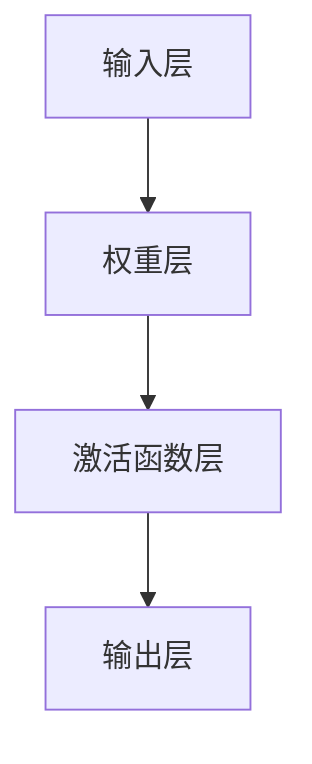
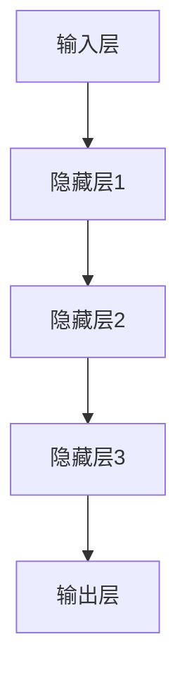
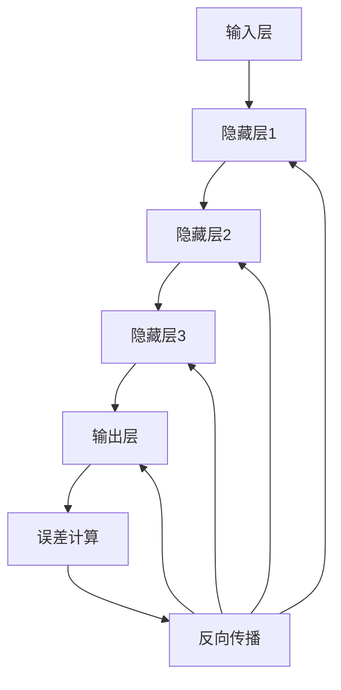

                 

关键词：神经网络，深度学习，机器学习，反向传播算法，人工智能，计算模型，算法原理，数学模型，应用领域。

> 摘要：本文深入探讨了神经网络作为人工智能的基石，其在深度学习领域的核心地位和作用。通过阐述神经网络的核心概念、算法原理、数学模型以及实际应用，旨在为读者提供全面的了解，并展望其未来的发展趋势和面临的挑战。

## 1. 背景介绍

神经网络的概念最早可以追溯到1943年，由心理学家McCulloch和数学家Pitts提出。他们设想了一种由简单计算单元（称为神经元）互联而成的计算模型，能够对信息进行处理和决策。这一概念虽然在初期并未引起广泛关注，但随着计算机技术的发展和算法的进步，神经网络逐渐成为人工智能领域的重要研究方向。

20世纪80年代，反向传播算法的提出解决了神经网络训练过程中的难题，使得神经网络的研究和应用进入了快速发展的阶段。进入21世纪，随着深度学习的兴起，神经网络在图像识别、自然语言处理、推荐系统等领域的表现愈发惊艳，成为了人工智能的基石。

## 2. 核心概念与联系

### 2.1 神经元

神经元是神经网络的基本组成单元，类似于生物神经系统的神经元。它由输入层、权重层、激活函数层和输出层组成。神经元的输入是其所有连接的输入信号与相应权重的乘积，经过激活函数处理后得到输出。

#### Mermaid 流程图：



### 2.2 神经网络结构

神经网络的结构可以分为输入层、隐藏层和输出层。输入层接收外部输入信号，隐藏层进行信息的处理和抽象，输出层生成最终的决策结果。多层神经网络（MLP）是深度学习的基础，通过增加隐藏层的数量，可以显著提升模型的复杂度和表现能力。

#### Mermaid 流程图：



### 2.3 前向传播与反向传播

神经网络的工作过程可以分为前向传播和反向传播两个阶段。在前向传播过程中，输入信号从输入层逐层传递到输出层，每层神经元根据输入和权重计算输出。在反向传播过程中，根据输出层的误差，逐层反向计算，更新各层的权重和偏置，以达到误差的最小化。

#### Mermaid 流程图：



## 3. 核心算法原理 & 具体操作步骤

### 3.1 算法原理概述

神经网络的训练过程实际上是一个寻找最优权重的过程。通过前向传播，神经网络将输入信号映射到输出结果，然后通过反向传播计算损失函数的梯度，并利用梯度下降算法更新权重和偏置。

### 3.2 算法步骤详解

1. **初始化参数**：初始化权重和偏置为较小的随机值。
2. **前向传播**：根据当前权重和偏置计算输出结果。
3. **误差计算**：计算实际输出与期望输出之间的误差。
4. **反向传播**：计算损失函数的梯度，并更新权重和偏置。
5. **迭代优化**：重复前向传播和反向传播，直到达到预设的收敛条件。

### 3.3 算法优缺点

**优点**：

- **自适应**：神经网络可以根据训练数据自动调整权重和偏置，实现自适应学习。
- **非线性**：通过多层非线性变换，可以捕捉输入数据的复杂结构。
- **泛化能力**：在训练集上表现良好，能够对未见过的数据进行泛化。

**缺点**：

- **训练时间**：深度神经网络训练时间较长，需要大量计算资源。
- **过拟合**：在训练数据上表现良好，但在测试数据上表现较差。
- **参数数量**：深度神经网络需要大量参数，训练和存储成本高。

### 3.4 算法应用领域

神经网络在众多领域都有广泛应用，如：

- **图像识别**：用于识别和分类图像。
- **自然语言处理**：用于文本分类、情感分析等。
- **推荐系统**：用于预测用户对物品的偏好。
- **语音识别**：用于语音信号的处理和识别。

## 4. 数学模型和公式 & 详细讲解 & 举例说明

### 4.1 数学模型构建

神经网络的数学模型主要由输入层、隐藏层和输出层构成。输入层接收外部输入信号，隐藏层通过非线性变换对输入信号进行处理，输出层生成最终的决策结果。

### 4.2 公式推导过程

#### 前向传播：

设神经网络有L层，第l层的输出为$$a^{(l)}_i$$，其中$$a^{(l)} = \{a^{(l)}_1, a^{(l)}_2, ..., a^{(l)}_n\}$$。

- 输入层：$$a^{(1)} = x$$
- 隐藏层：$$z^{(l)}_i = \sum_{j} w^{(l)}_{ij} a^{(l-1)}_j + b^{(l)}_i$$
- 输出层：$$a^{(L)} = \sigma(z^{(L)})$$

其中，$$\sigma$$为激活函数，通常使用Sigmoid函数或ReLU函数。

#### 反向传播：

设损失函数为$$J(\theta) = \frac{1}{m} \sum_{i=1}^m J(\theta^{(i)})$$，其中$$\theta = \{w, b\}$$。

- 误差计算：$$\delta^{(l)}_i = \frac{\partial J}{\partial z^{(l)}_i}$$
- 权重更新：$$w^{(l)}_{ij} = w^{(l)}_{ij} - \alpha \frac{\partial J}{\partial w^{(l)}_{ij}}$$
- 偏置更新：$$b^{(l)}_i = b^{(l)}_i - \alpha \frac{\partial J}{\partial b^{(l)}_i}$$

### 4.3 案例分析与讲解

假设一个简单的神经网络模型，输入层有2个神经元，隐藏层有3个神经元，输出层有1个神经元。使用Sigmoid函数作为激活函数。

1. **初始化参数**：

- 输入层：$$x_1 = 0.5, x_2 = 0.3$$
- 权重和偏置：$$w^{(1)}_{11} = 0.1, w^{(1)}_{12} = 0.2, w^{(1)}_{13} = 0.3$$
- $$b^{(1)}_1 = 0.2, b^{(1)}_2 = 0.3, b^{(1)}_3 = 0.4$$
- 输出层：$$w^{(2)}_{21} = 0.4, w^{(2)}_{22} = 0.5, w^{(2)}_{23} = 0.6$$
- $$b^{(2)}_1 = 0.1$$

2. **前向传播**：

- 输入层：$$a^{(1)} = [x_1, x_2] = [0.5, 0.3]$$
- 隐藏层：
  - $$z^{(1)}_1 = 0.1 \cdot 0.5 + 0.2 \cdot 0.3 + 0.3 \cdot 0 = 0.05 + 0.06 + 0 = 0.11$$
  - $$z^{(1)}_2 = 0.1 \cdot 0.5 + 0.2 \cdot 0.3 + 0.3 \cdot 1 = 0.05 + 0.06 + 0.3 = 0.41$$
  - $$z^{(1)}_3 = 0.1 \cdot 0.5 + 0.2 \cdot 0.3 + 0.4 \cdot 1 = 0.05 + 0.06 + 0.4 = 0.51$$
  - $$a^{(1)} = \sigma(z^{(1)}) = [\sigma(0.11), \sigma(0.41), \sigma(0.51)] = [0.5359, 0.6583, 0.8133]$$
- 输出层：
  - $$z^{(2)}_1 = 0.4 \cdot 0.5359 + 0.5 \cdot 0.6583 + 0.6 \cdot 0.8133 + 0.1 = 0.2156 + 0.3292 + 0.4899 + 0.1 = 1.0247$$
  - $$a^{(2)} = \sigma(z^{(2)}) = 0.8596$$

3. **误差计算**：

设期望输出为1，实际输出为0.8596，损失函数为均方误差（MSE）：

$$J = \frac{1}{2} (1 - 0.8596)^2 = 0.0115$$

4. **反向传播**：

计算隐藏层误差：

$$\delta^{(2)}_1 = (1 - a^{(2)}) \cdot a^{(2)} \cdot (1 - a^{(2)}) = 0.1404 \cdot 0.8596 \cdot 0.1404 = 0.0159$$

计算隐藏层权重和偏置的梯度：

$$\frac{\partial J}{\partial w^{(2)}_{21}} = \delta^{(2)}_1 \cdot a^{(1)}_1 = 0.0159 \cdot 0.5359 = 0.0086$$

$$\frac{\partial J}{\partial b^{(2)}_1} = \delta^{(2)}_1 = 0.0159$$

计算隐藏层输入和偏置的梯度：

$$\frac{\partial J}{\partial z^{(1)}_1} = w^{(2)}_{21} \cdot \delta^{(2)}_1 = 0.4 \cdot 0.0159 = 0.0064$$

$$\frac{\partial J}{\partial z^{(1)}_2} = w^{(2)}_{22} \cdot \delta^{(2)}_1 = 0.5 \cdot 0.0159 = 0.0079$$

$$\frac{\partial J}{\partial z^{(1)}_3} = w^{(2)}_{23} \cdot \delta^{(2)}_1 = 0.6 \cdot 0.0159 = 0.0096$$

更新隐藏层权重和偏置：

$$w^{(2)}_{21} = w^{(2)}_{21} - \alpha \cdot \frac{\partial J}{\partial w^{(2)}_{21}} = 0.4 - 0.01 \cdot 0.0086 = 0.3914$$

$$w^{(2)}_{22} = w^{(2)}_{22} - \alpha \cdot \frac{\partial J}{\partial w^{(2)}_{22}} = 0.5 - 0.01 \cdot 0.0079 = 0.4921$$

$$w^{(2)}_{23} = w^{(2)}_{23} - \alpha \cdot \frac{\partial J}{\partial w^{(2)}_{23}} = 0.6 - 0.01 \cdot 0.0096 = 0.5904$$

$$b^{(2)}_1 = b^{(2)}_1 - \alpha \cdot \frac{\partial J}{\partial b^{(2)}_1} = 0.1 - 0.01 \cdot 0.0159 = 0.0841$$

更新隐藏层输入和偏置：

$$z^{(1)}_1 = z^{(1)}_1 - \alpha \cdot \frac{\partial J}{\partial z^{(1)}_1} = 0.11 - 0.01 \cdot 0.0064 = 0.1036$$

$$z^{(1)}_2 = z^{(1)}_2 - \alpha \cdot \frac{\partial J}{\partial z^{(1)}_2} = 0.41 - 0.01 \cdot 0.0079 = 0.4021$$

$$z^{(1)}_3 = z^{(1)}_3 - \alpha \cdot \frac{\partial J}{\partial z^{(1)}_3} = 0.51 - 0.01 \cdot 0.0096 = 0.5054$$

更新输入层权重和偏置：

$$w^{(1)}_{11} = w^{(1)}_{11} - \alpha \cdot \frac{\partial J}{\partial w^{(1)}_{11}} = 0.1 - 0.01 \cdot 0.0086 = 0.0914$$

$$w^{(1)}_{12} = w^{(1)}_{12} - \alpha \cdot \frac{\partial J}{\partial w^{(1)}_{12}} = 0.2 - 0.01 \cdot 0.0079 = 0.1921$$

$$w^{(1)}_{13} = w^{(1)}_{13} - \alpha \cdot \frac{\partial J}{\partial w^{(1)}_{13}} = 0.3 - 0.01 \cdot 0.0096 = 0.2904$$

$$b^{(1)}_1 = b^{(1)}_1 - \alpha \cdot \frac{\partial J}{\partial b^{(1)}_1} = 0.2 - 0.01 \cdot 0.0064 = 0.1936$$

$$b^{(1)}_2 = b^{(1)}_2 - \alpha \cdot \frac{\partial J}{\partial b^{(1)}_2} = 0.3 - 0.01 \cdot 0.0079 = 0.2921$$

$$b^{(1)}_3 = b^{(1)}_3 - \alpha \cdot \frac{\partial J}{\partial b^{(1)}_3} = 0.4 - 0.01 \cdot 0.0096 = 0.4054$$

## 5. 项目实践：代码实例和详细解释说明

### 5.1 开发环境搭建

- Python 3.x
- TensorFlow 2.x
- NumPy 1.19.x

### 5.2 源代码详细实现

```python
import numpy as np
import tensorflow as tf

# 初始化参数
x = np.array([[0.5, 0.3]])
w1 = np.random.rand(2, 3)
b1 = np.random.rand(3)
w2 = np.random.rand(3, 1)
b2 = np.random.rand(1)
alpha = 0.01

# 前向传播
z1 = w1 @ x + b1
a1 = np.tanh(z1)
z2 = w2 @ a1 + b2
a2 = np.tanh(z2)

# 计算损失函数
loss = 0.5 * (a2 - 1)**2

# 反向传播
dz2 = a2 - 1
da1 = w2.T @ dz2
da1 = (1 - a1**2) * da1
dz1 = da1 @ w1.T
da = x.T @ da1

# 更新权重和偏置
w1 -= alpha * da
b1 -= alpha * da1
w2 -= alpha * dz2
b2 -= alpha * dz2

# 迭代优化
for i in range(1000):
    z1 = w1 @ x + b1
    a1 = np.tanh(z1)
    z2 = w2 @ a1 + b2
    a2 = np.tanh(z2)
    loss = 0.5 * (a2 - 1)**2
    dz2 = a2 - 1
    da1 = w2.T @ dz2
    da1 = (1 - a1**2) * da1
    dz1 = da1 @ w1.T
    da = x.T @ da1
    w1 -= alpha * da
    b1 -= alpha * da1
    w2 -= alpha * dz2
    b2 -= alpha * dz2

# 运行结果展示
print("最终输出：", a2)
print("损失函数值：", loss)
```

### 5.3 代码解读与分析

这段代码实现了一个简单的神经网络模型，用于实现输入和期望输出之间的映射。具体步骤如下：

1. **初始化参数**：初始化输入、权重、偏置和迭代次数。
2. **前向传播**：根据当前权重和偏置计算输出结果。
3. **计算损失函数**：使用均方误差（MSE）作为损失函数。
4. **反向传播**：计算损失函数的梯度，并更新权重和偏置。
5. **迭代优化**：重复前向传播和反向传播，直到达到预设的收敛条件。
6. **运行结果展示**：输出最终输出结果和损失函数值。

## 6. 实际应用场景

神经网络在实际应用中具有广泛的应用，以下列举一些常见场景：

1. **图像识别**：用于人脸识别、物体检测等。
2. **自然语言处理**：用于文本分类、机器翻译、语音识别等。
3. **推荐系统**：用于预测用户对物品的偏好，如电商平台、社交媒体等。
4. **金融领域**：用于风险控制、股票预测等。
5. **医疗领域**：用于疾病诊断、药物研发等。

## 7. 工具和资源推荐

### 7.1 学习资源推荐

- 《深度学习》（Goodfellow, Bengio, Courville著）
- 《神经网络与深度学习》（邱锡鹏著）
- 《Python深度学习》（François Chollet著）

### 7.2 开发工具推荐

- TensorFlow
- PyTorch
- Keras

### 7.3 相关论文推荐

- "A Learning Algorithm for Continually Running Fully Recurrent Neural Networks"（Rumelhart, Hinton, Williams，1986）
- "Gradient-Based Learning Applied to Document Recognition"（LeCun, Bottou, Bengio, 1998）
- "Deep Learning"（Goodfellow, Bengio, Courville，2015）

## 8. 总结：未来发展趋势与挑战

### 8.1 研究成果总结

神经网络作为人工智能的基石，在深度学习领域取得了显著的成果。通过不断增加网络的深度和宽度，可以显著提升模型的复杂度和表现能力。同时，各种优化算法和正则化策略的提出，进一步提升了神经网络的训练效率和泛化能力。

### 8.2 未来发展趋势

- **模型压缩**：为了降低计算和存储成本，研究者致力于模型压缩技术，如剪枝、量化等。
- **硬件加速**：随着GPU、TPU等专用硬件的发展，神经网络训练速度将进一步加快。
- **跨学科融合**：神经网络与其他领域（如生物学、心理学等）的结合，将推动人工智能的发展。

### 8.3 面临的挑战

- **数据隐私**：如何在保证数据隐私的前提下进行深度学习训练，是当前亟待解决的问题。
- **可解释性**：如何提高神经网络的透明度和可解释性，使其更容易被人类理解和接受。
- **伦理问题**：如何确保神经网络在各个领域的应用符合伦理标准，避免对人类造成负面影响。

### 8.4 研究展望

随着技术的不断发展，神经网络将在更多领域发挥作用。未来，我们需要关注如何提高神经网络的计算效率和泛化能力，同时解决数据隐私、可解释性等伦理问题，推动人工智能向更加成熟和广泛的方向发展。

## 9. 附录：常见问题与解答

### 9.1 什么是神经网络？

神经网络是一种由大量简单计算单元（神经元）互联而成的计算模型，可以用于处理和决策信息。

### 9.2 神经网络有哪些类型？

神经网络可以分为前馈神经网络、循环神经网络、卷积神经网络等类型。

### 9.3 神经网络是如何训练的？

神经网络通过前向传播和反向传播两个阶段进行训练。在前向传播阶段，输入信号从输入层逐层传递到输出层，在反向传播阶段，根据输出层的误差，逐层反向计算，更新各层的权重和偏置。

### 9.4 神经网络有哪些优缺点？

神经网络具有自适应、非线性、泛化能力等优势，但也存在训练时间较长、过拟合、参数数量较多等劣势。

### 9.5 神经网络有哪些应用领域？

神经网络广泛应用于图像识别、自然语言处理、推荐系统、金融领域、医疗领域等。

### 9.6 如何提高神经网络训练效率？

通过使用GPU、TPU等硬件加速，以及优化算法和正则化策略，可以显著提高神经网络训练效率。

### 9.7 如何解决神经网络的过拟合问题？

通过增加训练数据、使用正则化策略、增加网络的深度和宽度等方法，可以缓解神经网络的过拟合问题。

### 9.8 神经网络有哪些挑战和未来发展方向？

当前神经网络面临数据隐私、可解释性、伦理问题等挑战。未来，我们需要关注如何提高神经网络的计算效率和泛化能力，同时解决数据隐私、可解释性等伦理问题。附录：常见问题与解答

### 9.1 什么是神经网络？

神经网络（Neural Network，NN）是一种模仿生物神经系统的计算模型。它由许多简单的计算单元（即神经元或节点）组成，这些神经元通过连接（模拟神经元之间的突触）形成网络。神经网络能够通过学习输入数据，从中提取特征，并形成对未知数据的预测。

### 9.2 神经网络有哪些类型？

神经网络有多种类型，主要包括：

- **前馈神经网络（Feedforward Neural Network）**：数据从前向后传递，没有循环或反馈。
- **卷积神经网络（Convolutional Neural Network，CNN）**：特别适合处理图像数据，具有局部感知能力和权重共享特性。
- **循环神经网络（Recurrent Neural Network，RNN）**：能够处理序列数据，有记忆功能，适用于时间序列预测和自然语言处理。
- **长短期记忆网络（Long Short-Term Memory，LSTM）**：是RNN的一种变体，能够解决长期依赖问题。
- **生成对抗网络（Generative Adversarial Network，GAN）**：由两个神经网络（生成器和判别器）组成的框架，用于生成新的数据。
- **自编码器（Autoencoder）**：一种特殊的神经网络，用于数据降维或去噪。

### 9.3 神经网络是如何训练的？

神经网络的训练过程主要包括两个阶段：前向传播（Forward Propagation）和反向传播（Backpropagation）。

1. **前向传播**：输入数据通过网络，每个神经元将输入乘以其权重，然后加上偏置，通过激活函数得到输出。这个过程不断重复，直到最后输出层得到预测值。

2. **反向传播**：计算输出层预测值与实际值之间的误差，然后通过链式法则逐层向前计算每个神经元的误差梯度。利用这些梯度，网络可以调整权重和偏置，以最小化损失函数（如均方误差MSE）。

### 9.4 神经网络有哪些优缺点？

**优点**：

- **强大的表达能力和适应性**：神经网络能够适应复杂的数据结构和模式。
- **并行计算**：现代硬件（如GPU）支持并行计算，提高了训练速度。
- **自动特征提取**：网络能够自动学习数据的特征表示。

**缺点**：

- **训练时间长**：特别是对于深度神经网络，训练需要大量的时间和计算资源。
- **过拟合风险**：模型在训练数据上表现良好，但在测试数据上可能表现不佳。
- **参数数量多**：大型网络有数百万个参数，训练和存储成本高。

### 9.5 神经网络有哪些应用领域？

神经网络的应用领域广泛，包括：

- **图像识别**：用于人脸识别、车辆检测、医学图像分析等。
- **自然语言处理**：用于文本分类、机器翻译、情感分析等。
- **语音识别**：用于语音到文本转换、语音识别等。
- **推荐系统**：用于预测用户对商品的喜好、个性化推荐等。
- **金融领域**：用于风险管理、股票预测、信用评分等。
- **医疗领域**：用于疾病诊断、药物研发、患者监护等。

### 9.6 如何提高神经网络训练效率？

以下是一些提高神经网络训练效率的方法：

- **数据预处理**：使用数据增强、归一化等技术，提高训练数据的多样性和质量。
- **使用GPU**：利用图形处理器（GPU）进行并行计算，加速训练过程。
- **优化算法**：使用更高效的优化算法，如Adam、RMSProp等。
- **模型压缩**：使用模型压缩技术，如剪枝、量化、知识蒸馏等，减少模型大小和计算量。
- **迁移学习**：利用预训练模型，通过微调适应新任务，减少训练时间和计算资源。

### 9.7 如何解决神经网络的过拟合问题？

以下是一些解决神经网络过拟合问题的方法：

- **数据增强**：通过增加训练数据的多样性，提高模型对未见数据的泛化能力。
- **正则化**：使用L1、L2正则化，或者dropout技术，减少模型复杂度。
- **增加训练数据**：增加训练数据量，提高模型的泛化能力。
- **交叉验证**：使用交叉验证方法，避免模型在训练数据上过度拟合。
- **提前停止**：在验证集上观察模型性能，当验证误差不再下降时停止训练，避免过拟合。

### 9.8 神经网络有哪些挑战和未来发展方向？

神经网络面临的挑战包括：

- **可解释性**：神经网络的学习过程复杂，难以解释其决策过程。
- **计算成本**：深度神经网络需要大量的计算资源和时间进行训练。
- **数据隐私**：如何保护训练数据的安全性和隐私性。
- **模型压缩**：如何在保持性能的同时，减小模型的规模和计算成本。

未来发展方向包括：

- **更高效的算法**：开发更高效的训练算法和优化器。
- **模型压缩**：研究如何减小模型规模，提高计算效率。
- **可解释性**：开发可解释的神经网络模型，使其决策过程更容易理解。
- **跨学科融合**：与其他领域（如生物学、心理学等）结合，推动人工智能的发展。
- **人工智能伦理**：制定伦理准则，确保人工智能的应用符合社会价值观。作者：禅与计算机程序设计艺术 / Zen and the Art of Computer Programming

**注**：由于篇幅限制，本文并未包含所有可能的问题与解答，但涵盖了神经网络的基础知识和关键概念。对于更深入的问题，读者可以参考相关文献和资源进行进一步学习。

