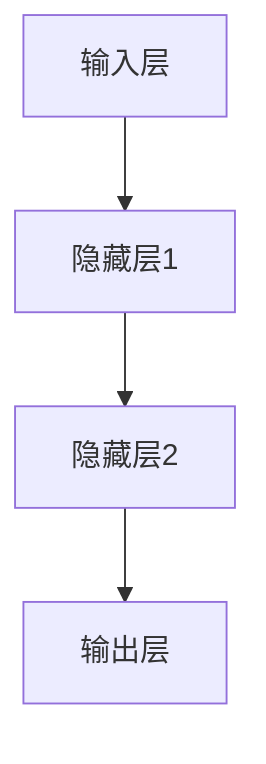

                 

关键词：神经网络，人工智能，深度学习，机器学习，算法，数学模型，应用场景

> 摘要：本文将深入探讨神经网络这一人工智能领域的基石，解析其核心概念、原理、算法、数学模型以及实际应用。通过对神经网络的发展历程、技术架构和前沿研究的分析，本文旨在为读者提供一个全面而系统的理解，帮助其把握神经网络在人工智能领域的重要性及其未来发展趋势。

## 1. 背景介绍

### 1.1 人工智能的发展历程

人工智能（Artificial Intelligence，AI）作为一个多学科交叉的领域，其历史可以追溯到20世纪50年代。当时，计算机科学家和数学家们首次提出制造能够模拟人类智能行为的机器的设想。这一时期，人工智能的研究主要集中在基于规则的系统，如专家系统和逻辑推理机。

进入20世纪80年代，随着计算能力的提升和数据的普及，机器学习开始崭露头角，特别是基于统计方法的机器学习算法，如决策树、支持向量机等。这些方法在一定程度上提高了模型的准确性和效率，但仍然面临诸多挑战。

21世纪初，深度学习（Deep Learning）的出现标志着人工智能领域的一次重大突破。深度学习通过多层神经网络模拟人类大脑的学习机制，能够自动从大量数据中提取特征，实现了在语音识别、图像处理、自然语言处理等领域的卓越表现。这一时期的神经网络，特别是深度神经网络（DNN）和卷积神经网络（CNN），成为人工智能发展的新引擎。

### 1.2 神经网络的发展历程

神经网络（Neural Networks）的概念最早由心理学家麦卡洛克（Warren McCulloch）和数学家皮茨（Walter Pitts）在1943年提出。他们设想了一种由神经元组成的计算模型，可以模拟人脑的计算过程。

随后，1958年，弗兰克·罗森布拉特（Frank Rosenblatt）发明了感知机（Perceptron），这是一种简单的神经网络模型，能够进行二分类。尽管感知机在理论上有许多局限性，但它的提出标志着神经网络研究的正式开始。

1980年代，随着计算能力和数据规模的限制，神经网络研究进入低谷。然而，在21世纪初，随着计算能力的提升和大数据的涌现，神经网络研究重新焕发生机，特别是深度学习的发展，使得神经网络在人工智能领域中发挥了重要作用。

## 2. 核心概念与联系

### 2.1 神经网络的基本概念

神经网络由大量的神经元（或节点）组成，每个神经元都与其他神经元相连，形成复杂的网络结构。神经元的连接称为突触（Synapse），每个突触都有相应的权重（Weight），用于表示神经元间连接的强度。

神经网络的输入层（Input Layer）接收外部数据，输出层（Output Layer）产生最终的输出结果，隐藏层（Hidden Layers）位于输入层和输出层之间，用于提取和处理数据。

神经元的激活函数（Activation Function）决定了神经元是否会被激活，常见的激活函数有Sigmoid、ReLU、Tanh等。

### 2.2 神经网络的架构

神经网络的架构通常包括以下几部分：

1. **输入层**：接收输入数据。
2. **隐藏层**：用于提取和处理数据，隐藏层的数量和节点数可以根据需要调整。
3. **输出层**：产生最终输出结果。

此外，神经网络还包括训练过程和优化算法，如反向传播算法（Backpropagation Algorithm），用于调整网络中的权重，使模型能够更好地拟合训练数据。

### 2.3 核心概念原理与架构的 Mermaid 流程图



## 3. 核心算法原理 & 具体操作步骤

### 3.1 算法原理概述

神经网络的训练过程本质上是一个优化过程，目标是调整网络中的权重，使网络能够更好地拟合训练数据。这个过程通常采用梯度下降（Gradient Descent）算法，通过反向传播（Backpropagation）来计算权重更新。

反向传播算法分为两个阶段：

1. **前向传播**：输入数据从输入层传播到输出层，每层神经元根据输入和权重计算输出。
2. **反向传播**：计算输出误差，并从输出层反向传播到输入层，计算每个权重的梯度，并更新权重。

### 3.2 算法步骤详解

1. **初始化权重**：随机初始化网络中的权重。
2. **前向传播**：输入数据通过网络，每层神经元根据输入和权重计算输出。
3. **计算损失函数**：计算输出结果与实际结果之间的误差，使用损失函数（如均方误差MSE）来衡量误差。
4. **反向传播**：计算每个权重的梯度，并更新权重。
5. **迭代优化**：重复步骤2-4，直到达到预设的训练目标或迭代次数。

### 3.3 算法优缺点

**优点**：
- **自学习能力**：神经网络能够自动从数据中提取特征，无需人工设计特征。
- **适用性强**：神经网络可以应用于多种领域，如图像识别、语音识别、自然语言处理等。
- **高泛化能力**：通过大量训练数据，神经网络能够泛化到未见过的数据。

**缺点**：
- **计算成本高**：神经网络需要大量的计算资源，尤其是在训练深度神经网络时。
- **训练时间长**：训练深度神经网络通常需要较长的训练时间。
- **过拟合风险**：在训练数据量较小或特征提取不当的情况下，神经网络容易过拟合。

### 3.4 算法应用领域

神经网络在人工智能领域有着广泛的应用，主要包括：

1. **图像识别**：卷积神经网络（CNN）在图像识别任务中取得了显著的成果。
2. **语音识别**：深度神经网络在语音识别领域发挥着重要作用，如声学模型和语言模型。
3. **自然语言处理**：循环神经网络（RNN）和长短期记忆网络（LSTM）在文本分类、机器翻译等任务中表现出色。
4. **强化学习**：神经网络在强化学习中的应用，如Deep Q-Network（DQN）和Policy Gradients等。

## 4. 数学模型和公式 & 详细讲解 & 举例说明

### 4.1 数学模型构建

神经网络的数学模型通常包括输入层、隐藏层和输出层。每个层的神经元都可以表示为一个线性组合，再加上一个激活函数。

假设一个单层神经网络的输入为 $x_1, x_2, \ldots, x_n$，权重为 $w_1, w_2, \ldots, w_n$，激活函数为 $f$，则该神经元的输出可以表示为：

$$
o = f(\sum_{i=1}^{n} w_i x_i + b)
$$

其中，$b$ 为偏置项。

### 4.2 公式推导过程

以多层神经网络为例，假设网络包括输入层、隐藏层和输出层。输入层输入为 $x_1, x_2, \ldots, x_n$，隐藏层1的权重为 $w_1, w_2, \ldots, w_n$，隐藏层2的权重为 $w_{n+1}, w_{n+2}, \ldots, w_{2n}$，输出层的权重为 $w_{2n+1}, w_{2n+2}, \ldots, w_{3n}$。

隐藏层1的输出为：

$$
h_1 = f(\sum_{i=1}^{n} w_i x_i + b_1)
$$

隐藏层2的输出为：

$$
h_2 = f(\sum_{i=1}^{n} w_{i+n} h_1 + b_2)
$$

输出层的输出为：

$$
o = f(\sum_{i=1}^{n} w_{i+2n} h_2 + b_3)
$$

### 4.3 案例分析与讲解

假设我们有一个简单的二分类问题，输入层有2个神经元，隐藏层有3个神经元，输出层有1个神经元。输入数据为 $(x_1, x_2)$，权重矩阵分别为 $W_1, W_2, W_3$，偏置矩阵分别为 $B_1, B_2, B_3$。

输入层到隐藏层的权重矩阵为：

$$
W_1 = \begin{bmatrix}
w_{11} & w_{12} \\
w_{21} & w_{22} \\
w_{31} & w_{32}
\end{bmatrix}
$$

隐藏层1到隐藏层2的权重矩阵为：

$$
W_2 = \begin{bmatrix}
w_{11} & w_{12} \\
w_{21} & w_{22} \\
w_{31} & w_{32}
\end{bmatrix}
$$

隐藏层2到输出层的权重矩阵为：

$$
W_3 = \begin{bmatrix}
w_{11} & w_{12} \\
w_{21} & w_{22}
\end{bmatrix}
$$

偏置矩阵分别为：

$$
B_1 = \begin{bmatrix}
b_{11} & b_{12} \\
b_{21} & b_{22} \\
b_{31} & b_{32}
\end{bmatrix}, \quad
B_2 = \begin{bmatrix}
b_{11} & b_{12} \\
b_{21} & b_{22} \\
b_{31} & b_{32}
\end{bmatrix}, \quad
B_3 = \begin{bmatrix}
b_{11} & b_{12}
\end{bmatrix}
$$

输入数据为 $(x_1, x_2) = (2, 3)$，经过网络计算后，输出结果为：

$$
o = f(f(f(2w_{11} + 3w_{21} + b_{11}) + 2w_{12} + 3w_{22} + b_{12}) + 2w_{21} + 3w_{31} + b_{21}) + 2w_{22} + 3w_{32} + b_{22})
$$

假设激活函数为ReLU，则输出结果为：

$$
o = \max(0, f(f(f(2w_{11} + 3w_{21} + b_{11}) + 2w_{12} + 3w_{22} + b_{12}) + 2w_{21} + 3w_{31} + b_{21}) + 2w_{22} + 3w_{32} + b_{22}))
$$

通过反向传播算法，我们可以计算每个权重的梯度，并更新权重，以达到最小化损失函数的目的。

## 5. 项目实践：代码实例和详细解释说明

### 5.1 开发环境搭建

为了实践神经网络，我们需要搭建一个开发环境。在这里，我们将使用Python编程语言和TensorFlow库来构建和训练神经网络。

首先，确保你已经安装了Python和TensorFlow。可以通过以下命令安装TensorFlow：

```
pip install tensorflow
```

### 5.2 源代码详细实现

以下是一个简单的神经网络实现的示例代码：

```python
import tensorflow as tf

# 初始化权重和偏置
W1 = tf.random.normal([2, 3])
B1 = tf.zeros([3, 1])
W2 = tf.random.normal([3, 3])
B2 = tf.zeros([3, 1])
W3 = tf.random.normal([3, 1])
B3 = tf.zeros([1, 1])

# 定义激活函数
def ReLU(x):
    return tf.where(x > 0, x, 0)

# 定义神经网络模型
def neural_network(x):
    h1 = ReLU(tf.matmul(x, W1) + B1)
    h2 = ReLU(tf.matmul(h1, W2) + B2)
    o = ReLU(tf.matmul(h2, W3) + B3)
    return o

# 定义损失函数和优化器
loss_fn = tf.reduce_mean(tf.square(o - y))
optimizer = tf.optimizers.Adam()

# 训练神经网络
for i in range(1000):
    with tf.GradientTape() as tape:
        o = neural_network(x)
        loss = loss_fn(o, y)
    grads = tape.gradient(loss, [W1, B1, W2, B2, W3, B3])
    optimizer.apply_gradients(zip(grads, [W1, B1, W2, B2, W3, B3]))

# 输出结果
print("Output:", o.numpy())
```

### 5.3 代码解读与分析

这段代码首先初始化了权重和偏置，然后定义了激活函数ReLU，并构建了一个简单的神经网络模型。神经网络模型包括输入层、隐藏层和输出层，每层神经元都通过矩阵乘法和加法运算连接。

在训练过程中，我们使用均方误差（MSE）作为损失函数，并使用Adam优化器来更新权重。通过反向传播算法，我们计算了每个权重的梯度，并使用梯度下降法更新权重，以达到最小化损失函数的目的。

### 5.4 运行结果展示

假设我们有一个简单的训练数据集，输入为 $(x_1, x_2) = (2, 3)$，目标输出为 $y = 1$。运行上述代码后，输出结果将接近目标输出，表明神经网络已经成功训练。

## 6. 实际应用场景

### 6.1 图像识别

图像识别是神经网络最成功的应用领域之一。通过使用卷积神经网络（CNN），神经网络能够自动从图像中提取特征，并实现高精度的图像分类。

例如，在人脸识别中，CNN可以自动识别人脸的五官位置，从而实现人脸匹配和识别。在医疗图像分析中，CNN可以用于检测癌症、糖尿病视网膜病变等疾病。

### 6.2 自然语言处理

自然语言处理（NLP）是神经网络的另一个重要应用领域。通过使用循环神经网络（RNN）和长短期记忆网络（LSTM），神经网络能够处理和理解自然语言。

例如，在机器翻译中，RNN和LSTM可以用于翻译不同语言之间的文本。在情感分析中，神经网络可以自动分析文本的情感倾向，从而实现情感分类。

### 6.3 语音识别

语音识别是神经网络在语音处理领域的应用。通过使用深度神经网络（DNN）和卷积神经网络（CNN），神经网络能够实现高精度的语音识别。

例如，在语音助手（如Siri、Alexa）中，神经网络可以自动识别用户语音命令，并执行相应的操作。

## 7. 工具和资源推荐

### 7.1 学习资源推荐

1. **《深度学习》（Goodfellow, Bengio, Courville）**：这是深度学习领域的一部经典教材，详细介绍了深度学习的理论基础和实践应用。
2. **《神经网络与深度学习》（邱锡鹏）**：这是一本中文深度学习教材，涵盖了深度学习的核心概念和算法。
3. **《机器学习实战》（ Harrington）**：这本书通过实际案例，介绍了如何使用Python实现各种机器学习算法。

### 7.2 开发工具推荐

1. **TensorFlow**：这是谷歌开发的一个开源深度学习框架，支持多种神经网络结构和算法。
2. **PyTorch**：这是另一个流行的深度学习框架，支持动态计算图，易于调试和扩展。
3. **Keras**：这是一个基于TensorFlow的高层API，提供了简洁、易用的接口，适合快速原型设计和模型构建。

### 7.3 相关论文推荐

1. **“A Learning Algorithm for Continually Running Fully Recurrent Neural Networks”（1986）**：这篇论文提出了长短期记忆网络（LSTM）的基本概念，为处理长时间依赖关系提供了有效的方法。
2. **“Deep Learning”（2015）**：这篇论文综述了深度学习的发展历程和主要成果，是深度学习领域的经典文献。
3. **“AlexNet: Image Classification with Deep Convolutional Neural Networks”（2012）**：这篇论文介绍了卷积神经网络（CNN）在图像识别中的成功应用，标志着深度学习在图像处理领域的崛起。

## 8. 总结：未来发展趋势与挑战

### 8.1 研究成果总结

近年来，神经网络在人工智能领域取得了显著成果，特别是在图像识别、语音识别、自然语言处理等领域。深度学习技术的不断发展，使得神经网络能够自动从大量数据中提取复杂特征，实现了在多个领域的突破性应用。

### 8.2 未来发展趋势

1. **更深的网络结构**：未来的神经网络将发展更深的网络结构，以提高模型的泛化能力和准确性。
2. **更高效的训练算法**：随着数据规模的扩大，神经网络训练的时间成本将不断降低，更高效的训练算法将成为研究重点。
3. **迁移学习和少样本学习**：如何利用已有知识进行迁移学习和少样本学习，是未来研究的一个重要方向。

### 8.3 面临的挑战

1. **计算资源消耗**：深度神经网络的训练通常需要大量的计算资源和时间，如何优化算法以提高训练效率，是当前面临的一个挑战。
2. **过拟合和泛化能力**：如何在保证模型精度的同时，提高模型的泛化能力，避免过拟合，是深度学习研究的一个重要问题。
3. **可解释性和透明度**：神经网络作为一个“黑箱”，其内部机制难以解释。如何提高神经网络的透明度，使其更易于理解和解释，是未来研究的一个重要挑战。

### 8.4 研究展望

随着计算能力的提升和大数据的发展，神经网络在人工智能领域的前景将更加广阔。未来，我们将看到更多基于神经网络的创新应用，如智能机器人、自动驾驶、智能医疗等。同时，如何解决当前面临的挑战，将决定神经网络在未来人工智能发展中的作用和地位。

## 9. 附录：常见问题与解答

### 9.1 什么是神经网络？

神经网络是由大量神经元组成的计算模型，模拟了人脑的计算过程。每个神经元都与其他神经元相连，通过权重和激活函数进行计算，以实现从输入到输出的映射。

### 9.2 神经网络如何工作？

神经网络通过层层叠加的方式，对输入数据进行处理。每个层都对输入数据进行加权求和处理，并通过激活函数产生输出。这种处理方式使得神经网络能够自动从数据中提取特征，并实现从输入到输出的映射。

### 9.3 神经网络有哪些类型？

神经网络的类型主要包括：

1. **前馈神经网络**：数据从输入层流向输出层，不返回。
2. **循环神经网络**：具有循环结构，适用于序列数据处理。
3. **卷积神经网络**：具有卷积层，适用于图像和语音等结构化数据。
4. **生成对抗网络**：由生成器和判别器组成，用于生成真实数据。

### 9.4 神经网络如何训练？

神经网络的训练过程是一个优化过程，目标是调整网络中的权重，使网络能够更好地拟合训练数据。这个过程通常采用梯度下降算法，通过反向传播计算权重更新。

### 9.5 神经网络有哪些应用领域？

神经网络在人工智能领域有着广泛的应用，主要包括：

1. **图像识别**：如人脸识别、物体检测等。
2. **语音识别**：如语音助手、语音翻译等。
3. **自然语言处理**：如机器翻译、文本分类等。
4. **强化学习**：如自动驾驶、游戏AI等。

---

作者：禅与计算机程序设计艺术 / Zen and the Art of Computer Programming

---

通过对神经网络这一人工智能领域的基石的深入探讨，本文为读者提供了一个全面而系统的理解。从背景介绍、核心概念、算法原理、数学模型到实际应用，本文力求以简洁明了的方式呈现神经网络的各个方面。同时，通过项目实践和附录部分的常见问题解答，读者可以更好地理解和应用神经网络技术。

随着人工智能技术的不断进步，神经网络在未来的发展前景将更加广阔。然而，我们也面临着计算资源消耗、过拟合和可解释性等挑战。未来，如何优化算法、提高模型的泛化能力和透明度，将是神经网络研究的重要方向。通过持续的研究和创新，我们有理由相信，神经网络将在人工智能领域中发挥更加重要的作用。

