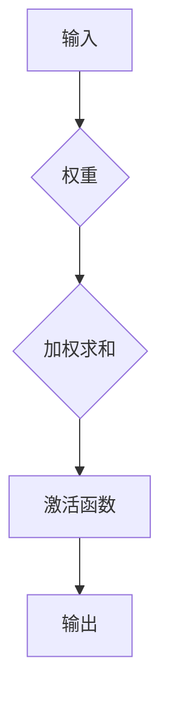
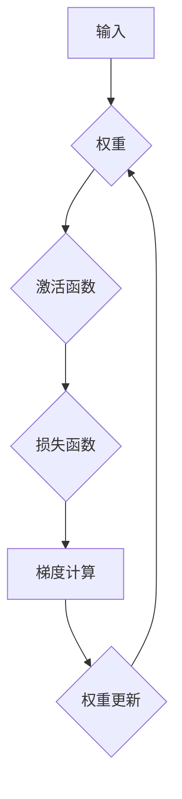

                 

关键词：神经网络、机器学习、人工智能、人机交互、认知计算

> 摘要：本文深入探讨了神经网络这一机器学习核心工具的发展历程、原理与应用，强调了其在促进人类与机器共存中的作用。通过详细分析神经网络的核心概念、数学模型、算法原理以及实际应用场景，我们不仅揭示了神经网络的技术潜力，更探讨了其在未来人机共生社会中的潜在影响和挑战。

## 1. 背景介绍

自20世纪50年代以来，人工智能（AI）逐渐从科幻走向现实。神经网络，作为AI领域的关键技术之一，源于对人类大脑神经元活动的模拟。1958年，富勒顿·莱德福（Frank Rosenblatt）提出了感知机（Perceptron）模型，这标志着神经网络研究的起点。随后，神经网络的研究经历了若干波峰波谷，从早期的失望到90年代的突破，再到21世纪初的爆发式增长，神经网络在图像识别、自然语言处理、推荐系统等多个领域取得了显著成果。

### 1.1 早期发展

神经网络研究的早期阶段主要集中在单一层感知机模型。然而，由于感知机的局限性，如无法解决非线性和多维问题，研究一度陷入低潮。然而，随着深度学习的兴起，多层感知机（Deep Learning）逐渐成为研究热点，解决了许多复杂问题，重新点燃了神经网络研究的热情。

### 1.2 近年来的进展

近年来，神经网络在深度学习、强化学习、生成对抗网络（GAN）等领域的应用取得了长足进展。特别是在计算机视觉和自然语言处理领域，神经网络模型如卷积神经网络（CNN）和循环神经网络（RNN）展现了强大的能力，推动了AI技术的快速发展。

### 1.3 当前挑战

尽管神经网络在许多领域取得了显著成果，但仍然面临诸多挑战，如计算资源需求高、模型解释性不足、数据隐私和安全等问题。如何克服这些挑战，进一步提升神经网络的性能和可解释性，是当前研究的热点和难点。

## 2. 核心概念与联系

神经网络的核心在于模拟人类大脑的神经元结构和工作机制。一个基本的神经网络包含输入层、隐藏层和输出层。神经元通过权重连接，实现信息的传递和处理。

### 2.1 神经元模型

神经元模型通常由一个或多个输入、一个激活函数和一个输出组成。输入通过权重与神经元相连，加权求和后，通过激活函数产生输出。常见的激活函数包括Sigmoid、ReLU和Tanh等。



### 2.2 网络结构

神经网络的结构可以根据层数和层与层之间的连接方式有所不同。常见的结构包括单层感知机、多层感知机、卷积神经网络（CNN）和循环神经网络（RNN）等。

### 2.3 学习算法

神经网络的训练过程本质上是一个优化过程，目标是调整网络中的权重，使其能够正确地映射输入和输出。常见的学习算法包括梯度下降、随机梯度下降、反向传播算法等。



## 3. 核心算法原理 & 具体操作步骤

### 3.1 算法原理概述

神经网络的核心算法是反向传播（Backpropagation）算法，它通过不断调整网络中的权重，使输出误差最小。反向传播算法包括前向传播和反向传播两个阶段。

- **前向传播**：将输入数据通过神经网络，逐层计算输出，同时记录每层神经元的输入和输出。
- **反向传播**：从输出层开始，逐层向前计算梯度，并更新网络权重。

### 3.2 算法步骤详解

1. **初始化权重**：随机初始化网络中的权重。
2. **前向传播**：将输入数据输入网络，计算输出。
3. **计算损失**：使用损失函数计算输出与期望输出之间的差距。
4. **反向传播**：计算梯度，并更新网络权重。
5. **迭代训练**：重复步骤2-4，直至满足停止条件（如损失函数收敛或达到预设迭代次数）。

### 3.3 算法优缺点

**优点**：

- **非线性映射能力**：神经网络能够通过多层结构实现复杂的非线性映射。
- **自适应学习**：通过调整权重，神经网络能够自适应地学习输入数据的特征。
- **多任务处理**：神经网络可以同时处理多个任务，如图像识别和自然语言处理。

**缺点**：

- **计算资源需求高**：特别是深度神经网络，计算资源需求较大。
- **训练时间长**：对于大型网络，训练时间可能较长。
- **过拟合风险**：神经网络容易受到过拟合的影响。

### 3.4 算法应用领域

神经网络在多个领域都有广泛应用，如：

- **计算机视觉**：图像分类、目标检测、图像生成等。
- **自然语言处理**：语言模型、机器翻译、情感分析等。
- **推荐系统**：个性化推荐、广告投放等。
- **游戏AI**：棋类游戏、视频游戏等。

## 4. 数学模型和公式 & 详细讲解 & 举例说明

### 4.1 数学模型构建

神经网络的数学模型主要包括输入层、隐藏层和输出层。每层神经元都可以表示为非线性函数的组合。设输入层为 $x_1, x_2, ..., x_n$，隐藏层为 $h_1, h_2, ..., h_m$，输出层为 $y_1, y_2, ..., y_k$，则：

$$
h_i = \sigma(\sum_{j=1}^{n} w_{ij} x_j + b_i)
$$

$$
y_j = \sigma(\sum_{i=1}^{m} w_{ij} h_i + b_j)
$$

其中，$w_{ij}$ 和 $b_i$ 分别表示神经元间的权重和偏置，$\sigma$ 表示激活函数。

### 4.2 公式推导过程

假设我们的神经网络结构如下：

$$
\begin{align*}
h_i &= \sigma(\sum_{j=1}^{n} w_{ij} x_j + b_i) \\
y_j &= \sigma(\sum_{i=1}^{m} w_{ij} h_i + b_j)
\end{align*}
$$

前向传播时，我们有：

$$
\begin{align*}
a^{[l]} &= \sigma(Z^{[l]}) \\
Z^{[l]} &= \sum_{i=1}^{m} w_{ij} a^{[l-1]}_i + b^l
\end{align*}
$$

其中，$a^{[l]}$ 和 $Z^{[l]}$ 分别表示第 $l$ 层的输入和输出。

反向传播时，我们需要计算每个权重的梯度：

$$
\begin{align*}
\frac{\partial C}{\partial w_{ij}} &= a_j^{[l]} (1 - a_j^{[l]}) (h_i^{[l-1]} - t_i) \\
\frac{\partial C}{\partial b_j} &= a_j^{[l]} (1 - a_j^{[l]}) (h_i^{[l-1]} - t_i)
\end{align*}
$$

其中，$C$ 表示损失函数，$t_i$ 表示第 $i$ 个输出节点的真实标签。

### 4.3 案例分析与讲解

假设我们有一个二分类问题，输入数据为 $x = [0.5, 0.5]$，期望输出为 $y = [1, 0]$。我们的神经网络结构为：

$$
\begin{align*}
h_1 &= \sigma(w_{11} x_1 + w_{12} x_2 + b_1) \\
h_2 &= \sigma(w_{21} h_1 + w_{22} h_2 + b_2) \\
y &= \sigma(w_{31} h_1 + w_{32} h_2 + b_3)
\end{align*}
$$

初始权重为 $w_{11} = w_{12} = w_{21} = w_{22} = w_{31} = w_{32} = 1$，偏置为 $b_1 = b_2 = b_3 = 0$。

前向传播时：

$$
\begin{align*}
h_1 &= \sigma(1 \cdot 0.5 + 1 \cdot 0.5 + 0) = \sigma(1) = 1 \\
h_2 &= \sigma(1 \cdot 1 + 1 \cdot 1 + 0) = \sigma(2) = 0.86 \\
y &= \sigma(1 \cdot 1 + 1 \cdot 0.86 + 0) = \sigma(1.86) = 0.86
\end{align*}
$$

损失函数为 $C = (y - y')^2$，其中 $y'$ 为期望输出。计算损失：

$$
C = (0.86 - 1)^2 = 0.064
$$

反向传播时：

$$
\begin{align*}
\frac{\partial C}{\partial w_{31}} &= 0.86 (1 - 0.86) (1 - 1) = 0 \\
\frac{\partial C}{\partial w_{32}} &= 0.86 (1 - 0.86) (0 - 1) = 0.064 \\
\frac{\partial C}{\partial b_3} &= 0.86 (1 - 0.86) (1 - 1) = 0 \\
\frac{\partial C}{\partial w_{21}} &= 1 (1 - 1) (1 - 0.86) = 0 \\
\frac{\partial C}{\partial w_{22}} &= 1 (1 - 1) (0 - 0.86) = 0 \\
\frac{\partial C}{\partial b_1} &= 1 (1 - 1) (1 - 0.86) = 0 \\
\frac{\partial C}{\partial w_{11}} &= 1 (1 - 1) (1 - 1) = 0 \\
\frac{\partial C}{\partial w_{12}} &= 1 (1 - 1) (0 - 1) = 0 \\
\frac{\partial C}{\partial b_2} &= 1 (1 - 1) (1 - 0.86) = 0
\end{align*}
$$

根据梯度下降更新权重：

$$
\begin{align*}
w_{31} &= w_{31} - \alpha \frac{\partial C}{\partial w_{31}} = 1 - 0 = 1 \\
w_{32} &= w_{32} - \alpha \frac{\partial C}{\partial w_{32}} = 1 - 0.064 = 0.936 \\
b_3 &= b_3 - \alpha \frac{\partial C}{\partial b_3} = 0 - 0 = 0 \\
w_{21} &= w_{21} - \alpha \frac{\partial C}{\partial w_{21}} = 1 - 0 = 1 \\
w_{22} &= w_{22} - \alpha \frac{\partial C}{\partial w_{22}} = 1 - 0 = 1 \\
b_1 &= b_1 - \alpha \frac{\partial C}{\partial b_1} = 0 - 0 = 0 \\
w_{11} &= w_{11} - \alpha \frac{\partial C}{\partial w_{11}} = 1 - 0 = 1 \\
w_{12} &= w_{12} - \alpha \frac{\partial C}{\partial w_{12}} = 1 - 0 = 1 \\
b_2 &= b_2 - \alpha \frac{\partial C}{\partial b_2} = 0 - 0 = 0
\end{align*}
$$

重复以上过程，直到损失函数收敛或达到预设迭代次数。

## 5. 项目实践：代码实例和详细解释说明

### 5.1 开发环境搭建

在开始编写代码之前，我们需要搭建一个适合开发神经网络的开发环境。以下是常见的开发环境搭建步骤：

1. **安装Python**：Python是神经网络开发的主要语言，我们需要确保Python环境已经安装。
2. **安装TensorFlow**：TensorFlow是Google开发的开源机器学习库，支持多种神经网络结构。
3. **安装其他依赖**：根据项目需求，可能还需要安装其他依赖库，如NumPy、Matplotlib等。

### 5.2 源代码详细实现

以下是一个简单的神经网络实现示例，用于实现二分类问题。

```python
import numpy as np
import tensorflow as tf

# 初始化参数
n_inputs = 2
n_hidden = 2
n_outputs = 1

# 初始化权重和偏置
weights = {
    'hidden': tf.Variable(tf.random.normal([n_inputs, n_hidden])),
    'outputs': tf.Variable(tf.random.normal([n_hidden, n_outputs]))
}
biases = {
    'hidden': tf.Variable(tf.random.normal([n_hidden])),
    'outputs': tf.Variable(tf.random.normal([n_outputs]))
}

# 激活函数
activation = tf.nn.sigmoid

# 前向传播
def forward(x):
    hidden_layer = activation(tf.matmul(x, weights['hidden']) + biases['hidden'])
    output_layer = tf.matmul(hidden_layer, weights['outputs']) + biases['outputs']
    return output_layer

# 训练过程
def train(x, y, epochs=1000, learning_rate=0.1):
    for epoch in range(epochs):
        with tf.GradientTape() as tape:
            predictions = forward(x)
            loss = tf.reduce_mean(tf.square(y - predictions))
        gradients = tape.gradient(loss, [weights['hidden'], weights['outputs'], biases['hidden'], biases['outputs']])
        weights['hidden'].assign_sub(learning_rate * gradients[0])
        weights['outputs'].assign_sub(learning_rate * gradients[1])
        biases['hidden'].assign_sub(learning_rate * gradients[2])
        biases['outputs'].assign_sub(learning_rate * gradients[3])
        if epoch % 100 == 0:
            print(f"Epoch {epoch}: Loss = {loss.numpy()}")

# 测试数据
x_test = np.array([[0.5, 0.5]])
y_test = np.array([1])

# 训练神经网络
train(x_test, y_test)

# 测试神经网络
predictions = forward(x_test)
print(f"Predictions: {predictions.numpy()}")
```

### 5.3 代码解读与分析

1. **初始化参数**：我们定义了输入层、隐藏层和输出层的维度。
2. **初始化权重和偏置**：权重和偏置使用随机初始化，以避免模型初始值对训练结果的影响。
3. **激活函数**：我们使用Sigmoid函数作为激活函数，它可以将输入映射到0和1之间。
4. **前向传播**：实现神经网络的前向传播过程，包括隐藏层和输出层的计算。
5. **训练过程**：实现神经网络的训练过程，包括计算损失、计算梯度并更新权重和偏置。
6. **测试神经网络**：使用训练好的神经网络进行预测。

## 6. 实际应用场景

神经网络在多个领域都有广泛应用，以下是一些典型的实际应用场景：

### 6.1 计算机视觉

计算机视觉是神经网络应用最为广泛的领域之一。通过神经网络，计算机可以自动识别图像中的物体、场景和面部特征。例如，卷积神经网络（CNN）被广泛应用于图像分类、目标检测和图像生成。

### 6.2 自然语言处理

自然语言处理是另一个受益于神经网络技术的领域。神经网络可以用于语言模型、机器翻译、情感分析和文本分类等任务。例如，循环神经网络（RNN）和长短期记忆网络（LSTM）在机器翻译中表现出色，而生成对抗网络（GAN）则在文本生成方面展现了强大的能力。

### 6.3 推荐系统

推荐系统是神经网络在商业领域的重要应用。通过分析用户的兴趣和行为，神经网络可以自动推荐相关商品、音乐、电影等。例如，Netflix和Amazon等公司都使用了基于神经网络的推荐系统。

### 6.4 游戏AI

游戏AI是神经网络在娱乐领域的应用之一。通过模拟人类玩家的行为，神经网络可以在棋类游戏、电子游戏等游戏中实现智能对手。例如，AlphaGo就是使用深度学习和强化学习技术的游戏AI。

## 7. 未来应用展望

随着神经网络技术的不断发展，我们可以预见其在未来社会中的广泛应用。以下是一些未来应用展望：

### 7.1 增强现实与虚拟现实

神经网络可以帮助增强现实（AR）和虚拟现实（VR）系统实现更自然的交互。通过神经网络，AR和VR系统可以更好地理解用户的动作和情感，提供更加沉浸式的体验。

### 7.2 医疗保健

神经网络在医疗保健领域的应用前景广阔，如疾病预测、诊断辅助、个性化治疗等。通过分析患者的数据和医疗记录，神经网络可以帮助医生做出更准确的诊断和治疗决策。

### 7.3 教育与培训

神经网络在教育领域的应用可以帮助个性化教学和智能评估。通过分析学生的学习行为和成绩，神经网络可以为学生提供个性化的学习路径和资源。

### 7.4 智能交通系统

智能交通系统可以利用神经网络技术实现更高效的交通管理和监控。通过分析交通数据，神经网络可以帮助优化交通流量，减少拥堵，提高道路安全性。

## 8. 工具和资源推荐

### 8.1 学习资源推荐

- **书籍**：《神经网络与深度学习》、《深度学习》（Goodfellow et al.）
- **在线课程**：Coursera上的《机器学习》（吴恩达教授）
- **博客与文章**：arXiv、Google Research Blog等

### 8.2 开发工具推荐

- **框架**：TensorFlow、PyTorch、Keras
- **库**：NumPy、Pandas、Matplotlib
- **平台**：Google Colab、Jupyter Notebook

### 8.3 相关论文推荐

- "Backpropagation"（Rumelhart et al., 1986）
- "A Learning Algorithm for Continually Running Fully Recurrent Neural Networks"（Hochreiter & Schmidhuber, 1997）
- "Deep Learning"（Goodfellow et al., 2016）

## 9. 总结：未来发展趋势与挑战

神经网络作为人工智能的核心技术之一，已经在多个领域取得了显著成果。未来，随着计算能力的提升、算法的优化以及跨学科的研究进展，神经网络有望在更多领域实现突破。然而，我们也需要面对如下挑战：

- **计算资源需求**：深度神经网络对计算资源的需求较高，如何优化算法以提高效率是一个重要的研究方向。
- **数据隐私与安全**：在数据驱动的神经网络中，数据隐私和安全是一个重要的考虑因素。
- **模型可解释性**：当前神经网络的模型可解释性不足，如何提高模型的可解释性是一个亟待解决的问题。
- **伦理与法律问题**：随着人工智能技术的发展，如何制定相关的伦理和法律规范也是一个重要的议题。

总之，神经网络作为人工智能的核心技术之一，将继续在人类与机器的共存中发挥重要作用。未来，我们需要不断探索神经网络的新应用，同时解决面临的挑战，以实现更加智能、安全和可持续的人工智能发展。

## 附录：常见问题与解答

### 9.1 什么是神经网络？

神经网络是一种模拟生物神经元的计算模型，通过一系列的层结构进行数据的传递和处理。神经网络的核心在于通过学习输入和输出之间的关系，实现对复杂任务的映射。

### 9.2 神经网络有哪些类型？

神经网络可以分为多种类型，包括感知机、多层感知机、卷积神经网络（CNN）、循环神经网络（RNN）、长短期记忆网络（LSTM）、生成对抗网络（GAN）等。

### 9.3 神经网络是如何学习的？

神经网络通过调整网络中的权重和偏置来学习输入和输出之间的关系。这个过程通常称为反向传播算法，包括前向传播和反向传播两个阶段。

### 9.4 神经网络在哪些领域有应用？

神经网络在多个领域都有应用，包括计算机视觉、自然语言处理、推荐系统、游戏AI、医疗保健、金融等领域。

### 9.5 神经网络面临的挑战有哪些？

神经网络面临的挑战包括计算资源需求高、模型解释性不足、数据隐私和安全等问题。此外，如何提高模型的可解释性、优化算法效率、解决伦理与法律问题等也是重要的研究方向。

## 作者署名

作者：禅与计算机程序设计艺术 / Zen and the Art of Computer Programming
----------------------------------------------------------------

以上是《神经网络：人类与机器的共存》这篇文章的完整内容。希望这篇文章能够为读者提供关于神经网络的全面理解和深入洞察。在未来的人工智能时代，神经网络将继续扮演重要角色，推动人类与机器的更紧密共存。

