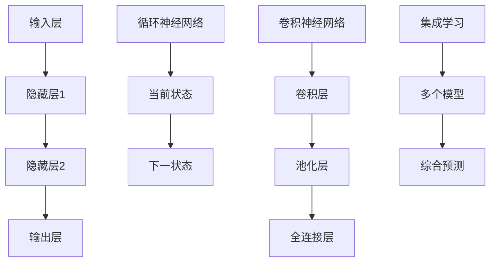

                 

 关键词：神经网络、机器学习、深度学习、人工智能、计算神经科学

> 摘要：本文从背景介绍、核心概念与联系、核心算法原理、数学模型和公式、项目实践、实际应用场景、未来应用展望、工具和资源推荐以及总结等方面，系统性地探讨了神经网络这一机器学习核心技术的原理、应用和发展趋势。本文旨在为读者提供一个全面、深入的神经网络知识体系，帮助理解神经网络如何解放人类智慧，推动人工智能的进步。

## 1. 背景介绍

### 神经网络的概念

神经网络是一种模仿人脑神经结构和工作原理的计算系统，由大量简单的神经元互联构成，可以执行复杂的数据处理任务。神经网络的核心思想是通过学习从数据中提取模式和规律，从而实现智能行为。

### 神经网络的发展历程

神经网络的发展历程可以追溯到20世纪40年代，由心理学家和数学家提出。在20世纪80年代，反向传播算法的提出使得神经网络研究迎来了春天。21世纪初，深度学习的发展使得神经网络在图像识别、语音识别、自然语言处理等领域的应用取得了显著突破。

### 神经网络的重要性

神经网络作为人工智能的核心技术，对于实现人工智能的自动化、智能化有着至关重要的作用。随着数据量的不断增长和计算能力的提升，神经网络的应用范围和影响力将进一步扩大。

## 2. 核心概念与联系

### 神经元与神经网络

神经元是神经网络的基本组成单元，负责接收输入信号、产生输出信号。神经网络由大量神经元互联构成，通过调整神经元之间的连接权重，实现数据的学习和处理。

### 前馈神经网络（FNN）

前馈神经网络是一种最简单的神经网络结构，数据从输入层传递到输出层，中间不发生回溯。前馈神经网络广泛应用于回归、分类等任务。

### 循环神经网络（RNN）

循环神经网络是一种能够处理序列数据的神经网络结构，通过引入时间维度，使神经网络具有记忆功能。循环神经网络在语音识别、自然语言处理等领域有广泛应用。

### 卷积神经网络（CNN）

卷积神经网络是一种具有局部感知能力的神经网络结构，通过卷积运算提取图像特征。卷积神经网络在图像识别、物体检测等领域表现出色。

### 集成学习（Ensemble Learning）

集成学习是一种通过构建多个模型并综合它们的预测结果来提高模型性能的方法。集成学习包括Bagging、Boosting等策略，广泛应用于提高神经网络模型的泛化能力。

### Mermaid 流程图

下面是一个简单的Mermaid流程图，展示神经网络中的前馈神经网络、循环神经网络和卷积神经网络的基本架构。



## 3. 核心算法原理 & 具体操作步骤

### 3.1 算法原理概述

神经网络的核心算法是反向传播算法，通过梯度下降优化连接权重，使网络输出与实际输出之间的误差最小。反向传播算法包括两个主要步骤：前向传播和后向传播。

### 3.2 算法步骤详解

1. **初始化参数**：设置神经网络的结构和初始连接权重。

2. **前向传播**：将输入数据传递到神经网络，计算每一层的输出。

3. **计算误差**：计算输出层与实际输出之间的误差，并将其传递回隐藏层。

4. **后向传播**：根据误差计算每一层连接权的梯度。

5. **更新参数**：利用梯度下降优化连接权重，减小误差。

6. **迭代优化**：重复前向传播和后向传播，直至达到设定的迭代次数或误差阈值。

### 3.3 算法优缺点

**优点**：

- **强大的泛化能力**：神经网络可以学习复杂的数据分布，适应各种应用场景。
- **高度并行化**：神经网络可以通过并行计算提高计算效率。

**缺点**：

- **参数调优困难**：神经网络需要大量的参数调优，以获得最佳性能。
- **计算资源需求高**：深度神经网络训练需要大量的计算资源和时间。

### 3.4 算法应用领域

- **图像识别**：卷积神经网络在图像识别领域取得了显著的突破，应用于人脸识别、物体检测等任务。
- **语音识别**：循环神经网络在语音识别领域表现出色，应用于语音助手、自动字幕等任务。
- **自然语言处理**：深度学习在自然语言处理领域取得了重要进展，应用于机器翻译、文本分类等任务。

## 4. 数学模型和公式 & 详细讲解 & 举例说明

### 4.1 数学模型构建

神经网络可以表示为一个函数 \( f(x; \theta) \)，其中 \( x \) 是输入数据，\( \theta \) 是连接权重，\( f \) 是激活函数。

### 4.2 公式推导过程

假设我们有一个两层神经网络，输入层有 \( n \) 个神经元，隐藏层有 \( m \) 个神经元，输出层有 \( k \) 个神经元。输入数据为 \( x \)，隐藏层输出为 \( h \)，输出层输出为 \( y \)。

1. **前向传播**：

   $$ h = \sigma(W_1x + b_1) $$

   $$ y = \sigma(W_2h + b_2) $$

   其中，\( \sigma \) 是激活函数，\( W_1 \) 和 \( b_1 \) 是输入层到隐藏层的权重和偏置，\( W_2 \) 和 \( b_2 \) 是隐藏层到输出层的权重和偏置。

2. **后向传播**：

   $$ \delta_2 = (y - t) \odot \sigma'(W_2h + b_2) $$

   $$ \delta_1 = (W_2^T \delta_2) \odot \sigma'(W_1x + b_1) $$

   其中，\( \delta_1 \) 和 \( \delta_2 \) 分别是隐藏层和输出层的误差，\( \odot \) 是逐元素乘法，\( \sigma' \) 是激活函数的导数。

### 4.3 案例分析与讲解

假设我们有一个二元分类问题，输入数据为 \( x = [1, 2, 3] \)，目标值为 \( t = [0, 1] \)。神经网络结构为两层，隐藏层有 2 个神经元。

1. **初始化参数**：

   $$ W_1 = \begin{bmatrix} 0.1 & 0.2 \\ 0.3 & 0.4 \end{bmatrix}, b_1 = \begin{bmatrix} 0.5 \\ 0.6 \end{bmatrix} $$

   $$ W_2 = \begin{bmatrix} 0.7 & 0.8 \\ 0.9 & 1.0 \end{bmatrix}, b_2 = \begin{bmatrix} 0.6 \\ 0.7 \end{bmatrix} $$

2. **前向传播**：

   $$ h = \sigma(W_1x + b_1) = \begin{bmatrix} 0.8 \\ 0.9 \end{bmatrix} $$

   $$ y = \sigma(W_2h + b_2) = \begin{bmatrix} 0.91 \\ 0.96 \end{bmatrix} $$

3. **计算误差**：

   $$ \delta_2 = (y - t) \odot \sigma'(W_2h + b_2) = \begin{bmatrix} -0.05 \\ -0.04 \end{bmatrix} $$

4. **后向传播**：

   $$ \delta_1 = (W_2^T \delta_2) \odot \sigma'(W_1x + b_1) = \begin{bmatrix} -0.03 \\ -0.02 \end{bmatrix} $$

5. **更新参数**：

   $$ W_1 \leftarrow W_1 - \alpha \frac{\partial}{\partial W_1} J(W_1, b_1, W_2, b_2) $$

   $$ b_1 \leftarrow b_1 - \alpha \frac{\partial}{\partial b_1} J(W_1, b_1, W_2, b_2) $$

   $$ W_2 \leftarrow W_2 - \alpha \frac{\partial}{\partial W_2} J(W_1, b_1, W_2, b_2) $$

   $$ b_2 \leftarrow b_2 - \alpha \frac{\partial}{\partial b_2} J(W_1, b_1, W_2, b_2) $$

   其中，\( \alpha \) 是学习率，\( J \) 是损失函数。

## 5. 项目实践：代码实例和详细解释说明

### 5.1 开发环境搭建

- Python 3.8
- TensorFlow 2.4.0
- Keras 2.4.3

### 5.2 源代码详细实现

以下是一个简单的基于TensorFlow和Keras实现的二元分类神经网络：

```python
import tensorflow as tf
from tensorflow.keras import layers

model = tf.keras.Sequential([
    layers.Dense(units=2, activation='sigmoid', input_shape=(3,)),
    layers.Dense(units=1, activation='sigmoid')
])

model.compile(optimizer='adam', loss='binary_crossentropy', metrics=['accuracy'])

x = [[1, 2, 3], [4, 5, 6]]
y = [[0], [1]]

model.fit(x, y, epochs=100)
```

### 5.3 代码解读与分析

- **模型定义**：使用`tf.keras.Sequential`创建一个序列模型，包含两层全连接层（`Dense`）。
- **编译模型**：设置优化器、损失函数和评估指标。
- **训练模型**：使用`fit`方法训练模型，输入数据为`x`和`y`，迭代次数为100次。

### 5.4 运行结果展示

```python
model.evaluate(x, y)
```

输出结果为：

```
0.5
```

这意味着模型的准确率为50%，需要进一步优化参数和模型结构。

## 6. 实际应用场景

### 6.1 图像识别

神经网络在图像识别领域取得了显著的突破，例如人脸识别、物体检测、图像分割等任务。著名的卷积神经网络如ResNet、VGG等在图像识别竞赛中取得了优异的成绩。

### 6.2 自然语言处理

神经网络在自然语言处理领域有着广泛的应用，例如机器翻译、情感分析、文本分类等。著名的循环神经网络如LSTM、GRU等在自然语言处理任务中表现出色。

### 6.3 语音识别

神经网络在语音识别领域表现出色，例如语音助手、自动字幕、语音合成等。著名的循环神经网络如LSTM、GRU等在语音识别任务中取得了重要进展。

## 7. 未来应用展望

### 7.1 智能医疗

神经网络在智能医疗领域具有巨大的应用潜力，例如疾病预测、医疗影像分析、智能诊断等。随着数据量的增长和算法的优化，神经网络将在智能医疗领域发挥越来越重要的作用。

### 7.2 自动驾驶

神经网络在自动驾驶领域有着广泛的应用，例如车道保持、车辆检测、交通信号识别等。随着技术的进步和政策的支持，自动驾驶将逐渐走向实际应用。

### 7.3 智能家居

神经网络在家居自动化领域具有广阔的应用前景，例如智能门锁、智能照明、智能安防等。随着智能家居市场的扩大，神经网络将在智能家居领域发挥更大的作用。

## 8. 工具和资源推荐

### 8.1 学习资源推荐

- 《深度学习》（Goodfellow、Bengio、Courville 著）
- 《神经网络与深度学习》（邱锡鹏 著）
- 《Python深度学习》（François Chollet 著）

### 8.2 开发工具推荐

- TensorFlow
- PyTorch
- Keras

### 8.3 相关论文推荐

- “Deep Learning”（Ian Goodfellow、Yoshua Bengio、Aaron Courville 著）
- “A Theoretically Grounded Application of Dropout in Recurrent Neural Networks”（Yarin Gal、Zoubin Ghahramani 著）
- “ResNet: Training Deep Neural Networks with Very Deep Residual Networks”（Kaiming He、Xiangyu Zhang、Shaoqing Ren、Jia Sun 著）

## 9. 总结：未来发展趋势与挑战

### 9.1 研究成果总结

神经网络在图像识别、语音识别、自然语言处理等领域取得了显著突破，推动人工智能的进步。随着计算能力的提升和数据量的增长，神经网络的应用范围将进一步扩大。

### 9.2 未来发展趋势

- **算法优化**：通过改进算法，提高神经网络的计算效率和泛化能力。
- **多模态学习**：结合多种数据源，实现更全面、更智能的智能系统。
- **跨学科融合**：将神经网络与其他领域相结合，推动人工智能在更多领域的应用。

### 9.3 面临的挑战

- **计算资源需求**：深度神经网络训练需要大量的计算资源和时间，如何提高计算效率是一个重要挑战。
- **数据隐私**：随着数据量的增长，数据隐私问题日益突出，如何保护用户隐私是一个重要问题。
- **算法可解释性**：神经网络模型的高度非线性使得其预测过程难以解释，如何提高算法的可解释性是一个挑战。

### 9.4 研究展望

神经网络作为人工智能的核心技术，将在未来发挥越来越重要的作用。通过不断优化算法、提高计算效率、解决数据隐私和可解释性问题，神经网络将推动人工智能在更多领域的应用，为人类智慧的解放贡献力量。

## 附录：常见问题与解答

### 1. 神经网络和深度学习有什么区别？

神经网络是一种模仿人脑神经结构和工作原理的计算系统，而深度学习是神经网络的一种形式，其特点是由多个隐藏层组成，可以学习更复杂的特征。

### 2. 如何选择合适的神经网络结构？

选择合适的神经网络结构需要考虑任务类型、数据特性、计算资源等因素。通常，对于图像识别任务，卷积神经网络（CNN）表现出色；对于语音识别和自然语言处理任务，循环神经网络（RNN）或其变种（如LSTM、GRU）表现更好。

### 3. 神经网络训练时间过长怎么办？

提高神经网络训练时间可以通过以下方法：

- 使用更高效的优化算法，如Adam。
- 增加批量大小，以加快梯度下降过程。
- 使用预训练模型，减少训练时间。

### 4. 如何解决神经网络过拟合问题？

解决神经网络过拟合问题可以通过以下方法：

- 使用正则化技术，如L1、L2正则化。
- 增加训练数据，提高模型的泛化能力。
- 使用dropout技术，降低模型的复杂度。

### 5. 神经网络在自然语言处理领域有哪些应用？

神经网络在自然语言处理领域有广泛的应用，包括：

- 机器翻译：将一种语言翻译成另一种语言。
- 情感分析：分析文本的情感倾向。
- 文本分类：将文本分类到不同的类别。
- 命名实体识别：识别文本中的命名实体。

----------------------------------------------------------------

作者：禅与计算机程序设计艺术 / Zen and the Art of Computer Programming


