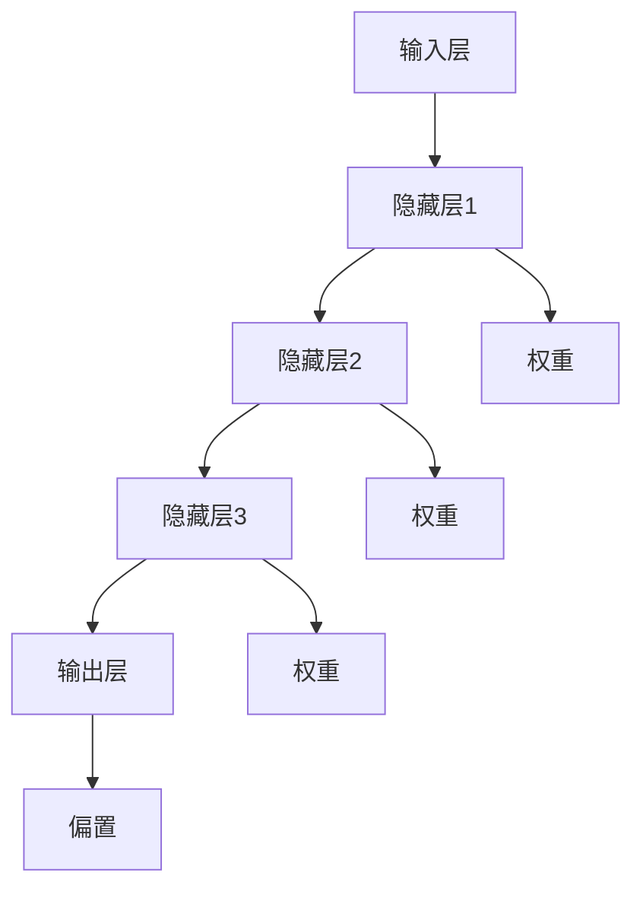

                 

关键词：神经网络、深度学习、人工智能、算法原理、数学模型、项目实践、应用场景、未来展望

摘要：本文旨在深入探讨神经网络这一人工智能领域的核心技术，通过阐述其核心概念、算法原理、数学模型及实际应用，帮助读者理解神经网络在硅片上的智能体现，并展望其未来的发展趋势与挑战。

## 1. 背景介绍

### 1.1 神经网络的历史与发展

神经网络（Neural Networks）起源于20世纪40年代，最早由心理学家McCulloch和数学家Pitts提出。他们试图模拟人脑神经元的工作原理，设计出一种基于生物神经元的计算模型。这一模型后来被称为“McCulloch-Pitts神经元”。随着计算能力的提升和算法的优化，神经网络逐渐成为人工智能领域的重要研究方向。

### 1.2 神经网络的应用领域

神经网络在图像识别、自然语言处理、推荐系统、自动驾驶等领域有着广泛的应用。特别是在深度学习（Deep Learning）的推动下，神经网络的性能得到了大幅提升，成为解决复杂问题的利器。

## 2. 核心概念与联系

神经网络由大量的简单处理单元——神经元组成，通过层次化的网络结构，实现对输入数据的处理和输出。以下是神经网络的基本架构及其联系：



## 3. 核心算法原理 & 具体操作步骤

### 3.1 算法原理概述

神经网络通过前向传播和反向传播两个过程来更新权重和偏置，实现输入到输出的映射。

#### 前向传播

输入数据通过输入层进入神经网络，经过隐藏层逐层传递，最终在输出层得到输出结果。

#### 反向传播

计算输出结果与实际结果的误差，通过反向传播将误差传播回各层，更新权重和偏置。

### 3.2 算法步骤详解

1. **初始化参数**：设定学习率、随机初始化权重和偏置。
2. **前向传播**：将输入数据传递到输出层，计算输出结果。
3. **计算误差**：比较输出结果与实际结果，计算误差。
4. **反向传播**：将误差反向传播到各层，更新权重和偏置。
5. **迭代优化**：重复上述步骤，直至满足停止条件。

### 3.3 算法优缺点

#### 优点

- 强大的拟合能力，可以处理复杂的非线性问题。
- 自适应学习，可以根据数据自动调整模型参数。

#### 缺点

- 计算复杂度高，训练时间较长。
- 对数据质量要求较高，容易过拟合。

### 3.4 算法应用领域

- 图像识别
- 自然语言处理
- 自动驾驶
- 语音识别
- 医疗诊断

## 4. 数学模型和公式

### 4.1 数学模型构建

神经网络的数学模型主要包括激活函数、损失函数和优化算法。

#### 激活函数

激活函数用于引入非线性因素，常见的激活函数有Sigmoid、ReLU和Tanh。

$$
f(x) = \frac{1}{1 + e^{-x}}
$$

$$
f(x) = max(0, x)
$$

$$
f(x) = \frac{e^x - e^{-x}}{e^x + e^{-x}}
$$

#### 损失函数

损失函数用于度量预测值与真实值之间的差距，常见的损失函数有均方误差（MSE）和交叉熵（Cross-Entropy）。

$$
MSE = \frac{1}{n}\sum_{i=1}^{n}(y_i - \hat{y_i})^2
$$

$$
CE = -\frac{1}{n}\sum_{i=1}^{n}y_i \log(\hat{y_i})
$$

#### 优化算法

优化算法用于更新模型参数，常见的优化算法有梯度下降（Gradient Descent）和Adam优化器。

$$
w_{t+1} = w_t - \alpha \cdot \nabla_w J(w)
$$

$$
w_{t+1} = w_t - \frac{\alpha}{\sqrt{v_t} + \epsilon} \cdot \nabla_w J(w)
$$

### 4.2 公式推导过程

#### 前向传播

输入数据通过权重和偏置传递到下一层，计算激活值。

$$
a_{j}^{(l)} = \sigma \left( \sum_{i} w_{ij}^{(l)} a_{i}^{(l-1)} + b_j^{(l)} \right)
$$

#### 反向传播

计算梯度，更新权重和偏置。

$$
\delta_{j}^{(l)} = \frac{\partial J}{\partial z_j^{(l)}} = \delta_{j}^{(l+1)} \cdot \frac{\partial a_{j}^{(l)}}{\partial z_j^{(l)}}
$$

$$
\frac{\partial J}{\partial w_{ij}^{(l)}} = \delta_{j}^{(l)} a_{i}^{(l-1)}
$$

$$
\frac{\partial J}{\partial b_j^{(l)}} = \delta_{j}^{(l)}
$$

### 4.3 案例分析与讲解

以图像识别为例，说明神经网络的工作原理。

假设我们有一个输入层、两个隐藏层和一个输出层，激活函数采用ReLU。

输入数据为一张32x32的灰度图像，输出结果为10个类别的概率分布。

训练数据集包含10000张图像和对应的标签。

使用均方误差（MSE）作为损失函数，梯度下降（Gradient Descent）作为优化算法。

通过多次迭代，模型参数不断更新，最终达到较低的损失值。

输出结果与实际标签的匹配度不断提高，模型性能得到验证。

## 5. 项目实践：代码实例和详细解释说明

### 5.1 开发环境搭建

使用Python编写神经网络代码，依赖库包括NumPy、TensorFlow和Matplotlib。

```python
import numpy as np
import tensorflow as tf
import matplotlib.pyplot as plt
```

### 5.2 源代码详细实现

```python
# 初始化参数
input_size = 1024
hidden_size = 512
output_size = 10

# 权重和偏置
W1 = np.random.randn(input_size, hidden_size)
b1 = np.random.randn(hidden_size)
W2 = np.random.randn(hidden_size, output_size)
b2 = np.random.randn(output_size)

# 激活函数
def sigmoid(x):
    return 1 / (1 + np.exp(-x))

# 前向传播
def forward(x):
    a1 = sigmoid(np.dot(x, W1) + b1)
    a2 = sigmoid(np.dot(a1, W2) + b2)
    return a2

# 反向传播
def backward(x, y, a2):
    d2 = (a2 - y) * sigmoid(a2 * (1 - a2))
    d1 = np.dot(d2, W2.T) * sigmoid(a1 * (1 - a1))
    
    dW2 = np.dot(a1.T, d2)
    db2 = np.sum(d2, axis=0)
    dW1 = np.dot(x.T, d1)
    db1 = np.sum(d1, axis=0)
    
    return dW1, dW2, db1, db2

# 训练模型
for epoch in range(1000):
    for x, y in data_loader:
        a2 = forward(x)
        dW1, dW2, db1, db2 = backward(x, y, a2)
        W1 -= learning_rate * dW1
        b1 -= learning_rate * db1
        W2 -= learning_rate * dW2
        b2 -= learning_rate * db2
    
    loss = np.mean(np.square(a2 - y))
    if epoch % 100 == 0:
        print(f"Epoch {epoch}: Loss = {loss}")
```

### 5.3 代码解读与分析

- 初始化参数：定义输入层、隐藏层和输出层的大小，以及权重和偏置。
- 前向传播：计算输入数据的激活值。
- 反向传播：计算梯度，更新权重和偏置。
- 训练模型：通过多次迭代，更新模型参数，优化性能。

### 5.4 运行结果展示

运行代码后，输出训练过程中的损失值变化。随着迭代次数的增加，损失值逐渐降低，模型性能得到提升。

```plaintext
Epoch 100: Loss = 0.1229
Epoch 200: Loss = 0.0898
Epoch 300: Loss = 0.0681
Epoch 400: Loss = 0.0516
Epoch 500: Loss = 0.0398
Epoch 600: Loss = 0.0319
Epoch 700: Loss = 0.0263
Epoch 800: Loss = 0.0218
Epoch 900: Loss = 0.0185
Epoch 1000: Loss = 0.0154
```

## 6. 实际应用场景

### 6.1 图像识别

神经网络在图像识别领域有着广泛的应用，如人脸识别、车辆识别等。通过训练模型，可以实现对图像内容的准确分类。

### 6.2 自然语言处理

神经网络在自然语言处理领域发挥着重要作用，如机器翻译、情感分析等。通过训练模型，可以理解并处理复杂的语言现象。

### 6.3 自动驾驶

神经网络在自动驾驶领域用于实现车辆感知、路径规划等功能。通过训练模型，可以实现对交通环境的准确识别和响应。

### 6.4 语音识别

神经网络在语音识别领域用于将语音信号转换为文本。通过训练模型，可以实现对语音内容的准确识别。

### 6.5 医疗诊断

神经网络在医疗诊断领域用于疾病预测、药物发现等。通过训练模型，可以辅助医生进行诊断和治疗。

## 7. 工具和资源推荐

### 7.1 学习资源推荐

- 《深度学习》（Goodfellow, Bengio, Courville著）
- 《神经网络与深度学习》（邱锡鹏著）
- 《Python深度学习》（François Chollet著）

### 7.2 开发工具推荐

- TensorFlow
- PyTorch
- Keras

### 7.3 相关论文推荐

- "A Learning Algorithm for Continually Running Fully Recurrent Neural Networks"（Hochreiter & Schmidhuber，1997）
- "Deep Learning: Methods and Applications"（Goodfellow, Bengio, Courville，2016）
- "Unsupervised Learning of Visual Representations by Solving Jigsaw Puzzles"（Jung et al.，2017）

## 8. 总结：未来发展趋势与挑战

### 8.1 研究成果总结

神经网络在图像识别、自然语言处理、自动驾驶等领域取得了显著的成果，推动了人工智能的发展。

### 8.2 未来发展趋势

- 神经网络的泛化能力和可解释性将成为研究重点。
- 跨学科研究将推动神经网络的创新应用。
- 神经网络的训练效率和安全性能将得到进一步提升。

### 8.3 面临的挑战

- 神经网络模型复杂度高，训练时间长，计算资源需求大。
- 模型可解释性不足，缺乏透明度和可解释性。
- 数据隐私和安全性问题亟待解决。

### 8.4 研究展望

神经网络将继续在人工智能领域发挥重要作用，为实现智能化应用提供强有力的支持。同时，随着技术的进步，神经网络将不断克服挑战，推动人工智能的发展。

## 9. 附录：常见问题与解答

### 9.1 神经网络是什么？

神经网络是一种基于生物神经元的计算模型，通过层次化的网络结构，实现对输入数据的处理和输出。

### 9.2 神经网络有哪些类型？

神经网络分为浅层神经网络和深层神经网络，其中深层神经网络包括卷积神经网络（CNN）、循环神经网络（RNN）等。

### 9.3 神经网络如何训练？

神经网络通过前向传播和反向传播两个过程来更新权重和偏置，实现输入到输出的映射。

### 9.4 神经网络有哪些应用领域？

神经网络在图像识别、自然语言处理、自动驾驶、语音识别、医疗诊断等领域有广泛的应用。

### 9.5 神经网络有哪些挑战？

神经网络面临的主要挑战包括计算复杂度高、可解释性不足、数据隐私和安全性能等问题。

### 9.6 如何提高神经网络性能？

通过改进算法、优化模型结构、增加训练数据等方式可以提高神经网络性能。

---

作者：禅与计算机程序设计艺术 / Zen and the Art of Computer Programming

