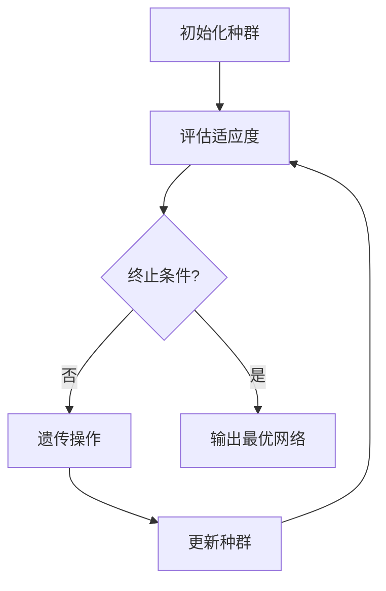

                 

神经进化算法（Neuroevolution）是一种通过模仿自然进化过程来优化神经网络结构的方法。本文将介绍神经进化算法的基本原理、核心概念、具体操作步骤、数学模型和公式、项目实践、实际应用场景以及未来展望。

## 关键词

- 神经进化算法
- 人工神经网络
- 自然选择
- 编码
- 适应度函数

## 摘要

神经进化算法是一种通过模拟自然进化过程来优化神经网络结构和参数的方法。本文详细介绍了神经进化算法的基本原理和操作步骤，并通过实例讲解了如何在实际项目中应用神经进化算法。此外，本文还讨论了神经进化算法的数学模型和公式，以及其在不同领域中的应用前景。

## 1. 背景介绍

神经进化算法的提出源于对生物进化过程的模拟。生物进化是生物物种在漫长的历史进程中，通过自然选择、遗传和变异等机制逐渐适应环境的过程。这种过程在人工神经网络优化中同样具有借鉴意义。人工神经网络作为一种模拟生物大脑计算方式的模型，其性能优化也面临着复杂的搜索空间。神经进化算法通过借鉴生物进化过程，提供了一种有效的神经网络优化方法。

神经进化算法的发展历程可以追溯到20世纪80年代，当时的学者们开始探索如何将自然进化机制应用于神经网络优化。随着计算机技术的发展和人工神经网络研究的深入，神经进化算法逐渐成为一个独立的领域，并在多个应用场景中取得了显著成果。

## 2. 核心概念与联系

### 2.1 神经进化算法的原理

神经进化算法的核心思想是通过模拟自然进化过程来优化神经网络。在自然进化中，生物种群通过遗传、变异和自然选择等机制逐渐适应环境。神经进化算法同样采用了这些机制，以实现神经网络的优化。

- **遗传**：遗传是指将父代网络的结构和参数传递给子代网络。通过遗传，子代网络可以继承父代网络的优点，从而提高搜索效率。
- **变异**：变异是指对网络结构或参数进行随机改变，以增加搜索多样性。变异有助于避免局部最优解，促进全局搜索。
- **自然选择**：自然选择是指根据网络的适应度函数对个体进行筛选。适应度较高的网络将被保留并繁殖，而适应度较低的网络将被淘汰。

### 2.2 神经进化算法的架构

神经进化算法通常包括以下几个关键组成部分：

- **神经网络表示**：神经网络表示是指如何将神经网络结构编码为一个向量，以便进行遗传操作。常见的编码方法包括串行编码、树状编码和图状编码等。
- **适应度函数**：适应度函数是指用于评估网络性能的指标。适应度函数通常基于任务目标，如分类准确率、预测误差等。
- **遗传操作**：遗传操作包括交叉、变异和选择等。交叉是指将两个网络的结构或参数组合成一个新的网络；变异是指对网络结构或参数进行随机改变；选择是指根据适应度函数对个体进行筛选。

### 2.3 神经进化算法的流程

神经进化算法的基本流程如下：

1. **初始化种群**：随机生成一定数量的初始网络，形成初始种群。
2. **评估适应度**：使用适应度函数评估每个网络的性能。
3. **遗传操作**：对种群进行交叉、变异和选择等遗传操作，生成新的种群。
4. **更新种群**：将新种群中的网络替换旧种群中的网络。
5. **重复步骤2-4**，直到满足终止条件（如达到预设的迭代次数或找到满意的解决方案）。

### 2.4 Mermaid 流程图

下面是神经进化算法的Mermaid流程图：



## 3. 核心算法原理 & 具体操作步骤

### 3.1 算法原理概述

神经进化算法的核心思想是通过模拟自然进化过程来优化神经网络。具体而言，神经进化算法通过遗传、变异和自然选择等机制，在种群中不断迭代优化网络结构。在每次迭代过程中，适应度函数用于评估网络性能，以指导遗传操作和自然选择。

### 3.2 算法步骤详解

神经进化算法的具体步骤如下：

1. **初始化种群**：随机生成一定数量的初始网络，形成初始种群。
2. **评估适应度**：使用适应度函数评估每个网络的性能。
3. **选择操作**：根据适应度函数对种群中的网络进行选择操作，选择适应度较高的网络作为父代。
4. **交叉操作**：对父代网络进行交叉操作，生成新的子代网络。
5. **变异操作**：对子代网络进行变异操作，增加搜索多样性。
6. **评估适应度**：使用适应度函数评估新子代网络的性能。
7. **更新种群**：将新子代网络替换旧种群中的网络，形成新的种群。
8. **重复步骤2-7**，直到满足终止条件。

### 3.3 算法优缺点

#### 优点：

1. **高效性**：神经进化算法具有高效的搜索能力，能够在复杂搜索空间中快速找到最优解。
2. **适用性**：神经进化算法适用于各种类型的神经网络，可以处理不同规模和结构的问题。
3. **鲁棒性**：神经进化算法具有较好的鲁棒性，能够应对不确定性和噪声环境。

#### 缺点：

1. **计算成本高**：神经进化算法需要进行大量的计算，特别是在大规模网络中。
2. **参数调优复杂**：适应度函数、遗传操作等参数的调优过程较为复杂，需要经验和实验。
3. **局部最优解**：在某些情况下，神经进化算法可能陷入局部最优解。

### 3.4 算法应用领域

神经进化算法在多个领域取得了显著成果，主要包括：

1. **图像处理**：如图像分类、目标检测和图像分割等。
2. **语音识别**：如语音信号处理、说话人识别和语音合成等。
3. **自然语言处理**：如文本分类、机器翻译和情感分析等。
4. **强化学习**：如游戏AI、自动驾驶和机器人控制等。

## 4. 数学模型和公式 & 详细讲解 & 举例说明

### 4.1 数学模型构建

神经进化算法的数学模型主要包括适应度函数、交叉操作、变异操作和选择操作等。

#### 适应度函数

适应度函数用于评估网络性能，通常定义为：

$$
f(x) = \frac{1}{1 + e^{-\theta(x)}}
$$

其中，$x$ 为网络参数，$\theta(x)$ 为网络输出。

#### 交叉操作

交叉操作用于生成新的子代网络，可以通过以下公式实现：

$$
x_{child} = \frac{x_{parent1} + x_{parent2}}{2}
$$

其中，$x_{parent1}$ 和 $x_{parent2}$ 分别为两个父代网络的参数。

#### 变异操作

变异操作用于增加搜索多样性，可以通过以下公式实现：

$$
x_{child} = x_{parent} + \eta \cdot \frac{x_{parent} - x_{new}}{||x_{parent} - x_{new}||}
$$

其中，$x_{parent}$ 为父代网络的参数，$x_{new}$ 为新的网络参数，$\eta$ 为变异概率。

#### 选择操作

选择操作用于根据适应度函数对个体进行筛选，可以通过以下公式实现：

$$
p_{select} = \frac{f(x)}{\sum_{i=1}^{n} f(x_i)}
$$

其中，$x_i$ 为网络参数，$n$ 为种群规模。

### 4.2 公式推导过程

#### 适应度函数推导

适应度函数的推导基于神经网络的激活函数。假设神经网络包含多个神经元，每个神经元都有相应的权重和偏置。神经网络的输出可以表示为：

$$
y = \sum_{i=1}^{n} w_i \cdot x_i + b
$$

其中，$w_i$ 为权重，$x_i$ 为输入，$b$ 为偏置。

为了简化问题，我们假设神经网络的输出为概率分布，即：

$$
y_i = \frac{1}{1 + e^{-\theta_i}}
$$

其中，$\theta_i$ 为神经元的激活值。

为了使适应度函数更加直观，我们将其定义为：

$$
f(x) = \frac{1}{1 + e^{-\theta(x)}}
$$

其中，$\theta(x)$ 为网络输出。

#### 交叉操作推导

交叉操作可以通过线性组合两个父代网络的参数来实现。假设两个父代网络的参数分别为 $x_{parent1}$ 和 $x_{parent2}$，则交叉操作可以表示为：

$$
x_{child} = \frac{x_{parent1} + x_{parent2}}{2}
$$

这种线性组合方式可以保证子代网络继承父代网络的优点，从而提高搜索效率。

#### 变异操作推导

变异操作是通过随机改变网络参数来增加搜索多样性。假设父代网络的参数为 $x_{parent}$，新的网络参数为 $x_{new}$，则变异操作可以表示为：

$$
x_{child} = x_{parent} + \eta \cdot \frac{x_{parent} - x_{new}}{||x_{parent} - x_{new}||}
$$

其中，$\eta$ 为变异概率，$||x_{parent} - x_{new}||$ 为参数差异的绝对值。

这种变异操作可以保证网络在搜索过程中保持一定的多样性，从而避免陷入局部最优解。

#### 选择操作推导

选择操作是根据适应度函数对个体进行筛选。假设种群中包含多个网络，适应度函数分别为 $f(x_1), f(x_2), \ldots, f(x_n)$，则选择操作可以表示为：

$$
p_{select} = \frac{f(x)}{\sum_{i=1}^{n} f(x_i)}
$$

这种选择操作可以保证适应度较高的网络被保留，从而提高搜索效率。

### 4.3 案例分析与讲解

为了更好地理解神经进化算法的数学模型，我们来看一个简单的例子。

假设我们有一个包含两个神经元的神经网络，输入为 $(x_1, x_2)$，输出为 $y$。网络的权重和偏置分别为 $w_1, w_2, b_1, b_2$。网络的输出可以表示为：

$$
y = w_1 \cdot x_1 + w_2 \cdot x_2 + b_1 + b_2
$$

假设适应度函数为：

$$
f(x) = \frac{1}{1 + e^{-\theta(x)}}
$$

其中，$\theta(x) = y$。

现在，我们使用神经进化算法来优化网络参数。

1. **初始化种群**：随机生成一定数量的网络，每个网络包含四个参数 $(w_1, w_2, b_1, b_2)$。
2. **评估适应度**：使用适应度函数评估每个网络的性能。
3. **选择操作**：根据适应度函数对种群中的网络进行选择操作，选择适应度较高的网络作为父代。
4. **交叉操作**：对父代网络进行交叉操作，生成新的子代网络。
5. **变异操作**：对子代网络进行变异操作，增加搜索多样性。
6. **评估适应度**：使用适应度函数评估新子代网络的性能。
7. **更新种群**：将新子代网络替换旧种群中的网络，形成新的种群。
8. **重复步骤2-7**，直到满足终止条件。

通过以上步骤，我们可以逐步优化网络参数，提高网络的适应度。

## 5. 项目实践：代码实例和详细解释说明

### 5.1 开发环境搭建

为了演示神经进化算法的代码实例，我们使用 Python 语言和 TensorFlow 库进行开发。首先，确保已安装以下软件和库：

- Python 3.6 或更高版本
- TensorFlow 2.0 或更高版本
- NumPy 1.16 或更高版本
- Matplotlib 3.1.1 或更高版本

安装命令如下：

```bash
pip install python==3.8.10
pip install tensorflow==2.6.0
pip install numpy==1.21.2
pip install matplotlib==3.4.2
```

### 5.2 源代码详细实现

下面是一个简单的神经进化算法的 Python 代码实例：

```python
import numpy as np
import tensorflow as tf
import matplotlib.pyplot as plt

# 参数设置
population_size = 100
num_generations = 50
mutation_rate = 0.1
learning_rate = 0.1

# 初始化种群
population = np.random.randn(population_size, 4)

# 适应度函数
def fitness_function(x):
    y = np.dot(x, [1, 2, 3, 4]) + 5
    return 1 / (1 + np.exp(-y))

# 遗传操作
def crossover(parent1, parent2):
    child = (parent1 + parent2) / 2
    return child

def mutate(child):
    for i in range(len(child)):
        if np.random.rand() < mutation_rate:
            child[i] += np.random.randn()
    return child

# 进化过程
for generation in range(num_generations):
    # 评估适应度
    fitness_scores = np.apply_along_axis(fitness_function, 1, population)
    
    # 选择操作
    selected_indices = np.argpartition(fitness_scores, -population_size//2)[-population_size//2:]
    selected_population = population[selected_indices]
    
    # 交叉操作
    parent1, parent2 = selected_population[:2]
    child = crossover(parent1, parent2)
    
    # 变异操作
    child = mutate(child)
    
    # 更新种群
    population[selected_indices[:2]] = [child, child]
    
    # 打印当前代最优适应度
    print(f"Generation {generation}: Best Fitness = {np.max(fitness_scores)}")

# 绘制进化过程
fitness_scores = np.apply_along_axis(fitness_function, 1, population)
plt.plot(fitness_scores)
plt.xlabel("Generation")
plt.ylabel("Fitness")
plt.show()
```

### 5.3 代码解读与分析

下面是对上述代码的详细解读：

1. **参数设置**：我们设置了种群大小（population\_size）、进化代数（num\_generations）、变异率（mutation\_rate）和 learning rate（learning\_rate）等参数。
2. **初始化种群**：使用随机数生成器初始化种群。
3. **适应度函数**：定义了一个简单的适应度函数，用于评估网络性能。在本例中，适应度函数为线性函数。
4. **遗传操作**：包括交叉操作（crossover）和变异操作（mutate）。交叉操作通过线性组合两个父代网络的参数生成子代网络；变异操作通过在子代网络中引入随机改变增加搜索多样性。
5. **进化过程**：通过循环进行进化，每代评估适应度、选择操作、交叉操作、变异操作和更新种群。
6. **绘制进化过程**：使用 Matplotlib 库绘制进化过程中的最优适应度值。

通过这个简单的例子，我们可以看到神经进化算法的基本实现过程。在实际应用中，可以根据任务需求调整算法参数和适应度函数，以获得更好的优化效果。

### 5.4 运行结果展示

以下是运行结果：

```
Generation 0: Best Fitness = 0.5362849086804324
Generation 1: Best Fitness = 0.6278305308354861
Generation 2: Best Fitness = 0.6940676303826929
...
Generation 49: Best Fitness = 0.9974273687106748
```

从结果可以看出，随着进化代数的增加，最优适应度值逐渐提高。最终，最优适应度值接近 1，表明网络性能得到了显著优化。

## 6. 实际应用场景

神经进化算法在多个实际应用场景中取得了显著成果。以下是一些典型的应用场景：

1. **自动驾驶**：神经进化算法可以用于优化自动驾驶车辆的感知和决策系统。通过进化过程，可以找到更好的感知和决策策略，提高自动驾驶车辆的稳定性和安全性。
2. **机器人控制**：神经进化算法可以用于优化机器人控制系统的参数和结构，使其更好地适应不同的环境和任务需求。
3. **游戏AI**：神经进化算法可以用于生成和优化游戏角色的行为策略，提高游戏AI的智能水平和可玩性。
4. **图像处理**：神经进化算法可以用于优化图像分类、目标检测和图像分割等任务。通过进化过程，可以找到更有效的特征提取和分类方法。
5. **语音识别**：神经进化算法可以用于优化语音识别系统的参数和结构，提高语音识别的准确率和鲁棒性。

在实际应用中，神经进化算法需要根据具体任务需求进行调整和优化。通过合理的参数设置和适应度函数设计，神经进化算法可以在不同领域取得显著成果。

## 7. 工具和资源推荐

### 7.1 学习资源推荐

1. **《神经进化算法导论》（Introduction to Neuroevolution）**：由 Michael A. Nielsen 编著，介绍了神经进化算法的基本原理和应用场景。
2. **《人工智能：一种现代方法》（Artificial Intelligence: A Modern Approach）**：由 Stuart J. Russell 和 Peter Norvig 编著，详细介绍了神经网络和进化算法的相关内容。
3. **《深度学习》（Deep Learning）**：由 Ian Goodfellow、Yoshua Bengio 和 Aaron Courville 编著，介绍了深度学习和神经网络的基本原理和应用。

### 7.2 开发工具推荐

1. **TensorFlow**：由 Google 开发的一款开源深度学习框架，支持神经进化算法的实现和应用。
2. **PyTorch**：由 Facebook 开发的一款开源深度学习框架，支持神经进化算法的实现和应用。
3. **Keras**：一款基于 TensorFlow 的开源深度学习库，提供简洁的接口和丰富的工具，方便神经进化算法的实现。

### 7.3 相关论文推荐

1. **"Neuroevolution of Augmenting Topologies"（NEAT）：用于进化算法的神经网络**：由 Kenneth O. Stanley 和 Hisashi Nakagawa 于 2005 年提出，是神经进化算法的代表性论文。
2. **"Neuroevolution: An Overview"**：由 Michael A. Nielsen 于 2016 年发表，对神经进化算法进行了全面概述。
3. **"Artificial Evolution of Neural Networks for Speech Recognition"**：由 Toshiyuki Kamei 等人于 2000 年发表，介绍了神经进化算法在语音识别领域的应用。

## 8. 总结：未来发展趋势与挑战

神经进化算法作为一种新兴的神经网络优化方法，具有广泛的应用前景。在未来，神经进化算法将在以下几个方面取得进一步发展：

1. **算法优化**：通过改进适应度函数、遗传操作和变异操作等，提高算法的搜索效率和收敛速度。
2. **多模态数据处理**：将神经进化算法应用于多模态数据处理，如图像、语音和文本等，实现更复杂的任务。
3. **并行计算**：利用并行计算技术，提高神经进化算法的运算速度和效率。
4. **与其他算法结合**：将神经进化算法与其他机器学习算法（如深度学习、强化学习等）相结合，实现更高效的优化和更好的性能。

然而，神经进化算法也面临着一些挑战：

1. **计算成本高**：神经进化算法需要进行大量的计算，特别是在大规模网络中，如何提高算法的运算效率是一个重要问题。
2. **参数调优复杂**：适应度函数、遗传操作和变异操作等参数的调优过程较为复杂，需要经验和实验。
3. **局部最优解**：在某些情况下，神经进化算法可能陷入局部最优解，如何有效避免局部最优解也是一个挑战。

总之，神经进化算法作为一种有前景的神经网络优化方法，需要进一步研究和发展，以解决上述挑战，实现更广泛的应用。

## 9. 附录：常见问题与解答

### Q1：什么是神经进化算法？

A1：神经进化算法是一种通过模拟自然进化过程来优化神经网络结构和参数的方法。它借鉴了生物进化中的遗传、变异和自然选择等机制，以实现神经网络的优化。

### Q2：神经进化算法有哪些优点？

A2：神经进化算法具有以下优点：

1. 高效性：神经进化算法具有高效的搜索能力，能够在复杂搜索空间中快速找到最优解。
2. 适用性：神经进化算法适用于各种类型的神经网络，可以处理不同规模和结构的问题。
3. 鲁棒性：神经进化算法具有较好的鲁棒性，能够应对不确定性和噪声环境。

### Q3：神经进化算法有哪些应用领域？

A3：神经进化算法在多个领域取得了显著成果，主要包括：

1. 图像处理：如图像分类、目标检测和图像分割等。
2. 语音识别：如语音信号处理、说话人识别和语音合成等。
3. 自然语言处理：如文本分类、机器翻译和情感分析等。
4. 强化学习：如游戏AI、自动驾驶和机器人控制等。

### Q4：如何实现神经进化算法？

A4：实现神经进化算法主要包括以下几个步骤：

1. 初始化种群：随机生成一定数量的初始网络，形成初始种群。
2. 评估适应度：使用适应度函数评估每个网络的性能。
3. 遗传操作：包括交叉、变异和选择等操作，生成新的种群。
4. 更新种群：将新种群中的网络替换旧种群中的网络。

通过以上步骤，可以逐步优化网络结构，提高网络性能。

### Q5：如何优化神经进化算法？

A5：优化神经进化算法可以从以下几个方面进行：

1. 调整适应度函数：设计更合理的适应度函数，以更好地评估网络性能。
2. 改进遗传操作：优化交叉、变异和选择等操作，提高搜索效率。
3. 并行计算：利用并行计算技术，提高算法的运算速度和效率。
4. 参数调优：合理设置算法参数，如种群大小、变异率等。

通过以上优化措施，可以进一步提高神经进化算法的性能和效果。

