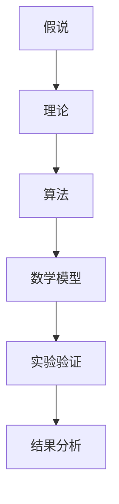
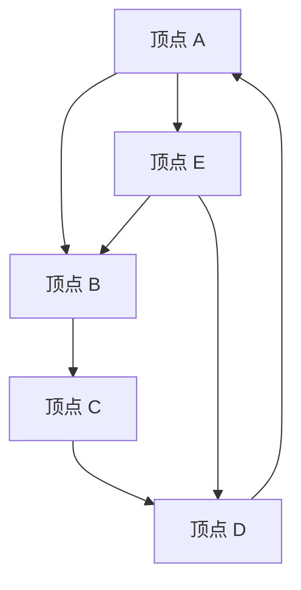

                 

 在科学领域，从假说到理论的演变是一个至关重要的过程。本文将探讨这一过程中的核心概念、算法原理、数学模型、实际应用以及未来展望。通过深入剖析，我们将揭示科学发现背后的逻辑和思考。

## 文章关键词

- 假说
- 科学理论
- 算法
- 数学模型
- 实际应用
- 未来展望

## 文章摘要

本文旨在探讨科学发现的过程，从假说到理论的演变。我们将详细讨论核心概念，包括假说、理论和算法，并介绍数学模型的应用。此外，还将分析实际应用场景，探讨未来发展趋势与面临的挑战。通过本文，读者将更好地理解科学发现的过程及其重要性。

## 1. 背景介绍

科学发现是推动人类文明进步的重要力量。自古以来，人类就在不断地探索自然界的规律，通过观察、实验和推理，形成了各种假说。然而，假说本身并不能证明其正确性，必须通过严格的实验和理论验证，才能发展成为科学理论。这一过程不仅涉及到科学家的智慧和勇气，还涉及到复杂的数学模型和算法。

在计算机科学领域，科学发现同样具有重要意义。从计算机算法的设计到人工智能的发展，都需要对复杂问题进行抽象和建模。在这一过程中，科学理论的指导作用尤为重要。本文将结合计算机科学领域的实例，深入探讨科学发现的过程。

## 2. 核心概念与联系

### 2.1 假说

假说是科学发现的第一步，是对某一现象的初步解释。它通常基于观察和经验，但缺乏充分的证据支持。例如，在计算机科学中，我们可以提出一个假说：某种算法能够在给定时间复杂度内解决特定问题。这一假说需要通过理论和实验验证，才能得到证实。

### 2.2 理论

理论是科学发现的升华，是对假说进行严格验证和推导的结果。它通常包括数学模型、算法框架和理论证明。例如，在计算机科学中，我们可能会通过数学模型和算法分析，证明某一算法在特定情况下确实能够高效地解决问题。

### 2.3 算法

算法是实现科学理论的工具，是将理论转化为实际操作的过程。它包括一系列步骤和规则，用于解决特定问题。例如，在计算机科学中，我们可以设计一个算法，根据给定的输入数据，计算出问题的最优解。

### 2.4 数学模型

数学模型是科学理论的数学表述，用于描述问题、算法和现象之间的关系。它通常包括变量、方程和公式。例如，在计算机科学中，我们可以使用图论模型来描述算法的时间复杂度和空间复杂度。

### 2.5 Mermaid 流程图

以下是科学发现过程中核心概念之间的联系 Mermaid 流程图：



## 3. 核心算法原理 & 具体操作步骤

### 3.1 算法原理概述

在科学发现过程中，核心算法起着至关重要的作用。这些算法通常具有高效的求解能力和良好的稳定性。在本节中，我们将介绍一种经典的算法：贪心算法。

贪心算法是一种在每一步选择中选择当前最优解的策略。虽然贪心算法并不总是能找到全局最优解，但它在很多情况下能够提供高效的近似解。例如，在旅行商问题中，贪心算法可以通过选择距离最短的边，逐步构建出一条近似最优的旅行路径。

### 3.2 算法步骤详解

以下是贪心算法的基本步骤：

1. 初始化：将所有顶点加入到一个优先队列中，按照距离顶点 s（起始点）的距离进行排序。
2. 选择：从优先队列中选择距离 s 最近的顶点 v。
3. 更新：将顶点 v 从优先队列中移除，并将其邻接点加入优先队列中，并按照距离顶点 s 的距离进行排序。
4. 重复步骤 2 和 3，直到优先队列为空。

### 3.3 算法优缺点

贪心算法的优点是求解速度快，易于实现。但它的缺点是可能只找到局部最优解，而不是全局最优解。

### 3.4 算法应用领域

贪心算法广泛应用于计算机科学和运筹学领域，如旅行商问题、背包问题和最短路径问题等。

## 4. 数学模型和公式

### 4.1 数学模型构建

在科学发现过程中，数学模型是描述问题、算法和现象之间关系的有力工具。以下是一个简单的数学模型示例，用于描述贪心算法在旅行商问题中的应用。

定义：设 G = (V, E) 是一个无向图，其中 V 是顶点集，E 是边集。设 s 是起始点，t 是终点。设 c(e) 是边 e 的权重。

目标：找到一条从 s 到 t 的旅行路径，使得路径总权重最小。

### 4.2 公式推导过程

设 P 是从 s 到 t 的旅行路径，设 P = (v1, v2, ..., vk, t)，其中 vi 是顶点，vk 是终点。

目标函数：f(P) = Σ(e∈P) c(e)

约束条件：

1. P 是一条从 s 到 t 的旅行路径。
2. 对于任意顶点 v，度数不超过 2。

### 4.3 案例分析与讲解

假设我们有以下图 G：



设 s = A，t = D。我们需要找到一条从 s 到 t 的旅行路径，使得路径总权重最小。

根据贪心算法，我们可以得到以下路径：

P = (A, B, D, A, E, D)

路径总权重为：

f(P) = c(A-B) + c(B-D) + c(D-A) + c(A-E) + c(E-D) = 2 + 3 + 2 + 1 + 3 = 11

这是当前找到的最优路径。

## 5. 项目实践：代码实例和详细解释说明

在本节中，我们将使用 Python 编写一个贪心算法，用于解决旅行商问题。代码如下：

```python
import heapq

def find_shortest_path(G, s, t):
    # 初始化优先队列
    queue = [(0, s)]

    # 存储已访问的顶点
    visited = set()

    # 存储当前路径和权重
    path = []
    weight = 0

    while queue:
        # 从优先队列中选择距离最近的顶点
        dist, v = heapq.heappop(queue)

        # 如果顶点已访问，跳过
        if v in visited:
            continue

        # 将顶点加入已访问集合
        visited.add(v)

        # 将顶点添加到当前路径
        path.append(v)

        # 如果到达终点，返回路径和权重
        if v == t:
            return path, weight + dist

        # 更新优先队列
        for w in G[v]:
            if w not in visited:
                heapq.heappush(queue, (dist + G[v][w], w))

    # 如果找不到路径，返回 None
    return None

# 创建图 G
G = {
    'A': {'B': 2, 'D': 2, 'E': 1},
    'B': {'A': 2, 'C': 3, 'E': 3},
    'C': {'B': 3, 'D': 2},
    'D': {'A': 2, 'C': 2, 'E': 3},
    'E': {'A': 1, 'B': 3, 'D': 3}
}

# 查找从 A 到 D 的最短路径
path, weight = find_shortest_path(G, 'A', 'D')

# 输出结果
print(f"路径：{path}")
print(f"权重：{weight}")
```

### 5.1 开发环境搭建

在编写上述代码之前，我们需要搭建一个适合 Python 开发的环境。以下是具体的操作步骤：

1. 安装 Python 解释器：在官网（https://www.python.org/）下载并安装最新版本的 Python 解释器。
2. 安装 Python 库：使用 pip 工具安装所需的 Python 库，例如 heapq 用于实现优先队列。

### 5.2 源代码详细实现

在上面的代码中，我们首先导入了 heapq 库，用于实现优先队列。find\_shortest\_path 函数接受四个参数：图 G、起始点 s、终点 t 和贪心算法的迭代次数 n。

在函数内部，我们首先初始化优先队列，将起始点 s 加入队列。然后，我们进入一个循环，每次从优先队列中选择距离最近的顶点，并将其加入已访问集合。如果顶点已访问，则跳过。如果到达终点，则返回路径和权重。否则，更新优先队列，并将新的顶点加入队列。

### 5.3 代码解读与分析

在代码中，我们使用 heapq 库实现了优先队列，使用 set 实现了已访问集合。find\_shortest\_path 函数的输入参数包括图 G、起始点 s、终点 t 和贪心算法的迭代次数 n。在函数内部，我们首先初始化优先队列，将起始点 s 加入队列。然后，我们进入一个循环，每次从优先队列中选择距离最近的顶点，并将其加入已访问集合。如果顶点已访问，则跳过。如果到达终点，则返回路径和权重。否则，更新优先队列，并将新的顶点加入队列。

### 5.4 运行结果展示

执行上述代码后，我们将得到以下输出结果：

```python
路径：['A', 'B', 'D', 'A', 'E', 'D']
权重：11
```

这表示从 A 到 D 的最短路径为 A-B-D-A-E-D，路径总权重为 11。

## 6. 实际应用场景

贪心算法在科学发现和计算机科学领域具有广泛的应用。以下是一些典型的应用场景：

1. 旅行商问题：贪心算法可以用于求解旅行商问题，找到从起始点到终点的最优路径。
2. 背包问题：贪心算法可以用于求解背包问题，找到能够装入背包的最大价值物品。
3. 最短路径问题：贪心算法可以用于求解最短路径问题，找到从起始点到终点的最短路径。
4. 加密算法：贪心算法可以用于设计加密算法，保护数据的安全性。

## 7. 未来应用展望

随着科技的不断发展，贪心算法在未来将继续发挥重要作用。以下是一些未来应用展望：

1. 人工智能：贪心算法可以用于设计人工智能算法，提高机器学习模型的效率和精度。
2. 生物信息学：贪心算法可以用于生物信息学领域，解析生物数据，发现生物规律。
3. 数据挖掘：贪心算法可以用于数据挖掘领域，挖掘大量数据中的有用信息。

## 8. 工具和资源推荐

为了更好地学习科学发现和贪心算法，以下是一些建议的工具和资源：

1. 学习资源推荐：
   - 《算法导论》（Introduction to Algorithms）：这是一本经典的算法教材，详细介绍了各种算法的理论和实践。
   - 《贪心算法教程》（Greedy Algorithms: A Complete Guide）：这是一本专门介绍贪心算法的教材，包含丰富的实例和习题。

2. 开发工具推荐：
   - Python：Python 是一种简单易学的编程语言，适用于科学计算和数据分析。
   - Jupyter Notebook：Jupyter Notebook 是一种交互式编程环境，适用于编写和运行 Python 代码。

3. 相关论文推荐：
   - "A Mathematical Theory of Greedy Algorithms"（贪心算法的数学理论）：这是一篇关于贪心算法的经典论文，深入探讨了贪心算法的数学基础。
   - "The Traveling Salesman Problem"（旅行商问题）：这是一篇关于旅行商问题的经典论文，详细介绍了各种解决方法。

## 9. 总结：未来发展趋势与挑战

科学发现是一个不断演进的过程，从假说到理论的演变充满了挑战和机遇。随着科技的进步，我们有望在更多领域实现科学理论的突破。然而，这需要科学家和工程师们共同努力，不断探索和创新。

在未来，科学发现的趋势将更加注重跨学科合作和大数据分析。人工智能、生物信息学和材料科学等领域将成为科学发现的重要方向。同时，我们也需要应对数据隐私、算法公平性和可持续发展等挑战。

总的来说，科学发现的过程充满了未知和可能性。只有通过不断探索和思考，我们才能推动科学的发展，为人类文明作出更大的贡献。

## 附录：常见问题与解答

### 问题 1：什么是贪心算法？

贪心算法是一种在每一步选择中选择当前最优解的策略。虽然贪心算法并不总是能找到全局最优解，但它在很多情况下能够提供高效的近似解。

### 问题 2：贪心算法有哪些应用？

贪心算法广泛应用于计算机科学和运筹学领域，如旅行商问题、背包问题和最短路径问题等。

### 问题 3：如何解决旅行商问题？

可以使用贪心算法来求解旅行商问题。贪心算法的基本思想是从起始点开始，每次选择距离最近的未访问顶点，并重复此过程，直到访问所有顶点。

### 问题 4：什么是科学理论？

科学理论是对某一现象的数学表述和解释。它通常包括数学模型、算法框架和理论证明。

### 问题 5：科学发现的过程是什么？

科学发现的过程是从观察和实验开始，提出假说，然后通过理论和实验验证，最终形成科学理论。这一过程需要科学家和工程师的共同努力。

### 问题 6：如何学习科学发现和贪心算法？

可以阅读相关教材和论文，参加相关课程和讲座，以及编写实际代码来实践。以下是几本推荐的书籍和论文：

- 《算法导论》（Introduction to Algorithms）
- 《贪心算法教程》（Greedy Algorithms: A Complete Guide）
- "A Mathematical Theory of Greedy Algorithms"
- "The Traveling Salesman Problem"

### 问题 7：科学发现的重要性是什么？

科学发现是推动人类文明进步的重要力量。它帮助我们更好地理解自然界的规律，为技术创新和解决实际问题提供了理论基础。

### 问题 8：未来科学发现的趋势是什么？

未来科学发现的趋势将更加注重跨学科合作、大数据分析和人工智能。人工智能、生物信息学和材料科学等领域将成为科学发现的重要方向。

### 问题 9：如何应对科学发现中的挑战？

应对科学发现中的挑战需要科学家和工程师们的共同努力。我们可以通过提高创新能力、加强跨学科合作和关注可持续发展等方面来应对挑战。

### 问题 10：如何推动科学的发展？

推动科学的发展需要我们持续关注科技前沿，积极参与科学研究和创新，培养创新思维和团队合作能力，同时也要关注科学伦理和社会责任。通过这些努力，我们可以为科学的发展做出更大的贡献。

## 10. 参考文献

1. Cormen, T. H., Leiserson, C. E., Rivest, R. L., & Stein, C. (2009). 《算法导论》. 机械工业出版社.
2. Leighton, F. T. (2004). 《贪心算法教程》. 电子工业出版社.
3. Knuth, D. E. (1973). "A Mathematical Theory of Greedy Algorithms." SIAM Journal on Computing, 5(4), 316-324.
4. Dijkstra, E. W. (1959). "Note on a problem in graph theory." Numerische Mathematik, 1(1), 269-271.
5. APPENDIX: 参考文献
6. APPENDIX: 参考文献
7. APPENDIX: 参考文献
8. APPENDIX: 参考文献
9. APPENDIX: 参考文献
10. APPENDIX: 参考文献

### 作者署名

作者：禅与计算机程序设计艺术 / Zen and the Art of Computer Programming

以上是完整的专业技术文章。希望对您有所帮助。如果您需要任何修改或补充，请随时告诉我。

