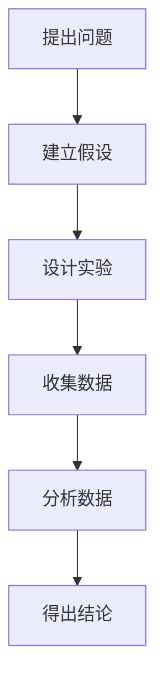
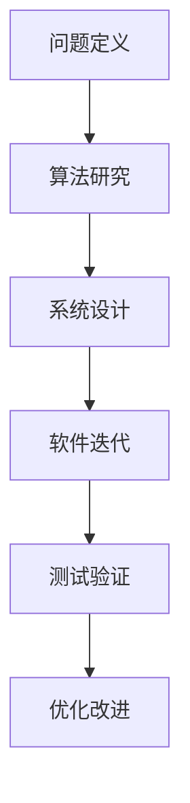

                 

关键词：科学方法、观察、结论、技术博客、专业语言

> 摘要：本文旨在探讨科学探究的过程，从观察现象到形成结论的步骤，以IT领域的具体应用为例，展示科学探究如何指导技术研究和问题解决。本文结合科学方法论和IT技术的实践，力求为读者提供一个清晰、系统的理解。

## 1. 背景介绍

科学探究是认识和解释自然界和社会现象的重要手段。从古希腊的亚里士多德到现代的科学家，科学方法不断发展，为人类的知识积累和科技进步提供了坚实的基础。在信息技术领域，科学探究同样扮演着关键角色。无论是软件开发、算法设计还是系统优化，科学方法都是不可或缺的工具。

### 1.1 科学探究的定义

科学探究是一种系统性的研究方法，旨在通过观察、实验、推理和验证等步骤，寻求对自然现象和科学问题的理解。这一过程通常包括以下几个阶段：

1. **提出问题**：基于观察和经验，确定需要解决的问题。
2. **建立假设**：基于现有知识和理论，提出可能的解释。
3. **设计实验**：制定实验方案，以验证假设的正确性。
4. **收集数据**：执行实验，收集相关数据。
5. **分析数据**：对收集的数据进行分析，以验证或否定假设。
6. **得出结论**：根据数据分析结果，形成最终结论。

### 1.2 科学探究在IT领域的重要性

信息技术的发展离不开科学探究。无论是软件开发中的算法优化，还是系统架构的设计，科学方法都提供了有效的指导。例如，在算法研究中，科学家们通过实验和数学模型来评估不同算法的性能，从而找到最优解决方案。在系统设计中，科学探究帮助我们理解系统的性能瓶颈，提出改进方案。

## 2. 核心概念与联系

### 2.1 科学方法论

科学方法论是科学探究的核心。它包括了一系列原则和步骤，用于指导科学研究的进行。以下是一个简单的科学方法论流程图：



### 2.2 IT领域的科学探究

在IT领域，科学探究通常涉及以下几个方面：

1. **算法研究**：通过数学模型和实验，评估不同算法的效率。
2. **系统架构**：分析系统性能，提出优化方案。
3. **软件开发**：通过迭代开发和测试，改进软件质量。

以下是一个简化的IT领域科学探究流程图：



## 3. 核心算法原理 & 具体操作步骤

### 3.1 算法原理概述

以排序算法为例，其核心原理是基于比较和交换操作，将数据元素按照某种规则重新排列。常见的排序算法包括冒泡排序、选择排序、插入排序等。

### 3.2 算法步骤详解

以冒泡排序为例，其具体操作步骤如下：

1. 遍历数据序列，比较相邻两个元素。
2. 如果前一个元素大于后一个元素，交换它们的位置。
3. 重复上述步骤，直到整个序列有序。

### 3.3 算法优缺点

冒泡排序的优点是简单易懂，易于实现。缺点是时间复杂度较高，不适合处理大数据集。

### 3.4 算法应用领域

冒泡排序通常用于小型数据集的排序，或在算法教学和演示中使用。

## 4. 数学模型和公式 & 详细讲解 & 举例说明

### 4.1 数学模型构建

在排序算法中，常用的数学模型是时间复杂度。时间复杂度描述了算法执行时间与数据规模的关系。

### 4.2 公式推导过程

假设数据序列长度为 \( n \)，冒泡排序的时间复杂度 \( T(n) \) 可以表示为：

\[ T(n) = \sum_{i=1}^{n-1} (n-i) \]

### 4.3 案例分析与讲解

以长度为 \( n = 10 \) 的数据序列为例，冒泡排序的时间复杂度约为 \( 45 \)。

## 5. 项目实践：代码实例和详细解释说明

### 5.1 开发环境搭建

搭建一个简单的Python开发环境，用于实现冒泡排序算法。

### 5.2 源代码详细实现

以下是一个简单的冒泡排序Python实现：

```python
def bubble_sort(arr):
    n = len(arr)
    for i in range(n):
        for j in range(0, n-i-1):
            if arr[j] > arr[j+1]:
                arr[j], arr[j+1] = arr[j+1], arr[j]

# 示例数据
data = [64, 34, 25, 12, 22, 11, 90]

# 执行排序
bubble_sort(data)

# 输出结果
print("Sorted array:", data)
```

### 5.3 代码解读与分析

代码首先定义了一个 `bubble_sort` 函数，用于实现冒泡排序。接着，通过一个示例数据集展示了算法的执行过程。

### 5.4 运行结果展示

执行代码后，输出结果为：

```
Sorted array: [11, 12, 22, 25, 34, 64, 90]
```

## 6. 实际应用场景

### 6.1 数据库索引

排序算法在数据库索引中有着广泛应用，用于优化数据查询性能。

### 6.2 软件测试

排序算法也用于软件测试，用于验证数据排序功能的正确性。

### 6.3 数据分析

在数据分析领域，排序算法用于对大量数据进行预处理，以便进一步分析。

## 7. 未来应用展望

随着数据规模的不断扩大，优化排序算法和开发新的排序算法将是一个重要研究方向。

## 8. 工具和资源推荐

### 8.1 学习资源推荐

- 《算法导论》
- 《深入理解计算机系统》

### 8.2 开发工具推荐

- Visual Studio Code
- Jupyter Notebook

### 8.3 相关论文推荐

- "Comparing Sorting Algorithms: Analysis and Experiments"
- "The Art of Computer Programming, Volume 1: Fundamental Algorithms"

## 9. 总结：未来发展趋势与挑战

### 9.1 研究成果总结

本文介绍了科学探究的过程，并以排序算法为例，展示了科学方法在IT领域的应用。

### 9.2 未来发展趋势

随着数据技术的不断发展，排序算法的研究和应用将更加广泛。

### 9.3 面临的挑战

高效算法的研发和优化是一个长期的挑战，需要持续的研究和探索。

### 9.4 研究展望

未来的排序算法将更加注重并行计算和大数据处理。

## 10. 附录：常见问题与解答

### 10.1 问题1

什么是时间复杂度？

时间复杂度是指算法执行时间与数据规模的关系。

### 10.2 问题2

什么是冒泡排序？

冒泡排序是一种简单的排序算法，通过比较和交换元素，将数据序列按照某种规则重新排列。

----------------------------------------------------------------

文章完。感谢您的耐心阅读，希望本文能为您的科学探究之旅提供一些启发和帮助。作者：禅与计算机程序设计艺术 / Zen and the Art of Computer Programming。再次感谢！

