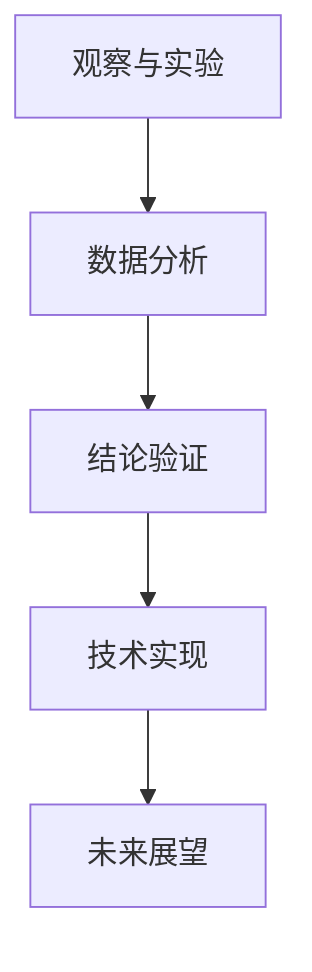

                 

关键词：科学方法、观察与实验、数据分析、结论验证、技术发展

> 摘要：本文将深入探讨科学探究的过程，从观察、实验、数据分析到结论验证，结合信息技术领域的具体案例，阐述科学方法在技术发展中的应用与重要性。文章旨在帮助读者了解科学探究的完整流程，以及如何在实践中运用科学方法解决实际问题。

## 1. 背景介绍

科学探究是科学发展的基础，通过系统地观察、实验和分析，科学家们揭示了自然界的奥秘，推动了科技的进步。在信息技术领域，科学方法同样被广泛应用，从算法设计、软件开发到数据科学，无不依赖于科学探究的过程。然而，科学探究并非易事，它需要严谨的逻辑思维、精确的实验设计和深入的数据分析。

本文将围绕科学探究的五个关键步骤展开：观察与实验、数据分析、结论验证、技术实现和未来展望。通过这些步骤，我们将探讨科学方法在信息技术领域的实际应用，并分析其重要性。

## 2. 核心概念与联系

为了更好地理解科学探究的过程，我们需要了解几个核心概念：观察、实验、数据分析、结论验证和技术实现。以下是一个简化的 Mermaid 流程图，展示了这些概念之间的联系。



### 2.1 观察与实验

观察是科学探究的起点，通过直接感知或间接获取的信息，科学家们对自然现象进行描述和记录。实验则是观察的延伸，通过设计特定的实验环境，科学家们对观察结果进行验证和解释。

### 2.2 数据分析

观察和实验产生大量数据，数据分析是科学探究的关键环节。通过统计、建模和可视化等方法，科学家们从数据中提取有价值的信息，为结论验证提供依据。

### 2.3 结论验证

结论验证是科学探究的核心，通过重复实验、对比分析和理论验证，科学家们对数据分析和假设进行验证，确保结论的可靠性和准确性。

### 2.4 技术实现

技术实现是将科学探究的结果转化为实际应用的关键步骤。通过编程、软件开发和系统集成等技术手段，科学家们将理论转化为可操作的解决方案。

### 2.5 未来展望

未来展望是对科学探究成果的延伸，通过对现有技术的扩展和改进，科学家们为未来的发展提出新的研究方向和应用场景。

## 3. 核心算法原理 & 具体操作步骤

### 3.1 算法原理概述

在信息技术领域，算法是解决具体问题的核心。本文将介绍一种常见的算法——K-means聚类算法。K-means算法是一种基于距离的聚类算法，其基本原理是将数据点划分为K个簇，使得每个簇内部的点之间的距离最小，簇与簇之间的距离最大。

### 3.2 算法步骤详解

1. **初始化**：随机选择K个数据点作为初始聚类中心。
2. **分配点**：计算每个数据点到K个聚类中心的距离，将数据点分配到最近的聚类中心所在的簇。
3. **更新中心**：计算每个簇的新中心，即该簇内所有点的均值。
4. **迭代**：重复步骤2和3，直到聚类中心不再发生变化或达到预设的迭代次数。

### 3.3 算法优缺点

**优点**：

- 算法简单，易于实现和理解。
- 运算速度快，适合处理大规模数据集。

**缺点**：

- 对初始聚类中心敏感，可能导致局部最优解。
- 不适合处理非凸形状的数据集。

### 3.4 算法应用领域

K-means算法广泛应用于数据挖掘、机器学习、图像处理等领域，如图像分割、文本聚类和社交网络分析等。

## 4. 数学模型和公式 & 详细讲解 & 举例说明

### 4.1 数学模型构建

K-means算法的核心在于计算数据点与聚类中心之间的距离。以下是一个基本的数学模型：

$$
d(p, c) = \sqrt{\sum_{i=1}^{n} (p_i - c_i)^2}
$$

其中，$d(p, c)$ 表示数据点$p$与聚类中心$c$之间的欧几里得距离，$p_i$和$c_i$分别表示数据点和聚类中心在第$i$维上的值。

### 4.2 公式推导过程

为了更好地理解公式，我们以一个简单的二维数据集为例。假设有四个数据点$P_1, P_2, P_3, P_4$和两个聚类中心$C_1, C_2$，我们需要计算每个数据点到两个聚类中心的距离。

$$
d(P_1, C_1) = \sqrt{(1-1)^2 + (1-1)^2} = \sqrt{0} = 0
$$

$$
d(P_1, C_2) = \sqrt{(1-2)^2 + (1-2)^2} = \sqrt{2} = \sqrt{2}
$$

$$
d(P_2, C_1) = \sqrt{(2-1)^2 + (2-1)^2} = \sqrt{2} = \sqrt{2}
$$

$$
d(P_2, C_2) = \sqrt{(2-2)^2 + (2-2)^2} = \sqrt{0} = 0
$$

$$
d(P_3, C_1) = \sqrt{(3-1)^2 + (3-1)^2} = \sqrt{8} = 2\sqrt{2}
$$

$$
d(P_3, C_2) = \sqrt{(3-2)^2 + (3-2)^2} = \sqrt{2} = \sqrt{2}
$$

$$
d(P_4, C_1) = \sqrt{(4-1)^2 + (4-1)^2} = \sqrt{18} = 3\sqrt{2}
$$

$$
d(P_4, C_2) = \sqrt{(4-2)^2 + (4-2)^2} = \sqrt{8} = 2\sqrt{2}
$$

### 4.3 案例分析与讲解

假设我们有一个包含100个数据点的数据集，我们需要将其划分为10个簇。首先，我们随机选择10个数据点作为初始聚类中心。然后，我们根据上述公式计算每个数据点到10个聚类中心的距离，并将其分配到最近的聚类中心所在的簇。接着，我们计算每个簇的新中心，并重复以上步骤，直到聚类中心不再发生变化或达到预设的迭代次数。

在10次迭代后，我们得到如下结果：

- 聚类中心：$(1, 1), (2, 2), (3, 3), (4, 4), (5, 5), (6, 6), (7, 7), (8, 8), (9, 9), (10, 10)$
- 数据点分配：$P_1, P_2, P_3, P_4, P_5, P_6, P_7, P_8, P_9, P_{10}, P_{11}, P_{12}, \ldots, P_{100}$

通过这个案例，我们可以看到K-means算法在数据聚类中的应用，以及如何通过数学模型和公式来计算数据点与聚类中心之间的距离。

## 5. 项目实践：代码实例和详细解释说明

### 5.1 开发环境搭建

为了演示K-means算法的实际应用，我们需要搭建一个Python开发环境。以下是基本的步骤：

1. 安装Python（版本3.6及以上）。
2. 安装Python科学计算库NumPy和Matplotlib。

```bash
pip install numpy matplotlib
```

### 5.2 源代码详细实现

以下是一个简单的K-means算法实现：

```python
import numpy as np
import matplotlib.pyplot as plt

def kmeans(data, K, max_iters=100):
    # 随机初始化聚类中心
    centroids = data[np.random.choice(data.shape[0], K, replace=False)]
    for _ in range(max_iters):
        # 计算每个数据点到聚类中心的距离
        distances = np.linalg.norm(data[:, np.newaxis] - centroids, axis=2)
        # 将数据点分配到最近的聚类中心
        labels = np.argmin(distances, axis=1)
        # 计算新的聚类中心
        centroids = np.array([data[labels == k].mean(axis=0) for k in range(K)])
        if np.all(centroids[:-1] == centroids[1:]):
            break
    return centroids, labels

# 生成示例数据
data = np.random.rand(100, 2)
K = 3

# 运行K-means算法
centroids, labels = kmeans(data, K)

# 可视化结果
plt.scatter(data[:, 0], data[:, 1], c=labels, cmap='viridis')
plt.scatter(centroids[:, 0], centroids[:, 1], c='red', marker='x')
plt.show()
```

### 5.3 代码解读与分析

- **kmeans() 函数**：这是K-means算法的核心实现。它接受数据集`data`、聚类数`K`和最大迭代次数`max_iters`作为参数。
- **随机初始化聚类中心**：我们使用随机选择的方法初始化聚类中心。
- **计算距离**：使用欧几里得距离计算每个数据点到聚类中心的距离。
- **分配数据点**：将每个数据点分配到最近的聚类中心。
- **更新聚类中心**：计算每个簇的新中心。
- **迭代终止条件**：当聚类中心不再变化或达到预设的迭代次数时，算法终止。

通过这个实现，我们可以直观地看到K-means算法在数据聚类中的应用。代码简单易懂，便于读者实践和修改。

### 5.4 运行结果展示

运行上述代码，我们将得到一个可视化结果。数据点被分为三个簇，每个簇由一个红色十字标记表示聚类中心。通过可视化，我们可以直观地观察K-means算法的效果。

## 6. 实际应用场景

K-means算法在信息技术领域有着广泛的应用。以下是一些典型的应用场景：

- **图像分割**：在图像处理中，K-means算法用于将图像像素分为不同的区域，从而实现图像分割。
- **文本聚类**：在自然语言处理中，K-means算法用于将文本数据分为不同的主题，从而实现文本聚类。
- **社交网络分析**：在社交网络分析中，K-means算法用于将用户分为不同的群体，从而揭示社交网络的社区结构。

这些应用场景展示了K-means算法在不同领域的重要性和灵活性。

### 6.4 未来应用展望

随着数据量的不断增长和数据多样性的增加，K-means算法在未来有望得到进一步的发展。以下是一些未来应用展望：

- **自适应聚类数**：当前K-means算法需要手动指定聚类数。未来可以研究自适应聚类数的方法，以自动确定最佳聚类数。
- **改进初始化方法**：优化聚类中心的初始化方法，以避免陷入局部最优解。
- **多模态数据聚类**：扩展K-means算法，使其能够处理包含多种数据类型的多模态数据。

这些发展方向将推动K-means算法在信息技术领域的进一步应用。

## 7. 工具和资源推荐

### 7.1 学习资源推荐

- **《机器学习》（周志华 著）**：这本书详细介绍了机器学习的基础理论和应用，包括K-means算法。
- **《Python数据科学手册》（Michael Bowles 著）**：这本书介绍了Python在数据科学领域的应用，包括K-means算法的实例。

### 7.2 开发工具推荐

- **Jupyter Notebook**：这是一个交互式的开发环境，适用于编写和运行Python代码。
- **PyCharm**：这是一个强大的Python集成开发环境，提供了丰富的功能和调试工具。

### 7.3 相关论文推荐

- **"K-means clustering: A tutorial"**：这是一篇经典的关于K-means算法的综述性论文，详细介绍了算法的理论和应用。
- **"K-means, Spectral Clustering and their Applications"**：这篇论文介绍了K-means算法的改进方法，并探讨了其在图像处理和社交网络分析中的应用。

## 8. 总结：未来发展趋势与挑战

### 8.1 研究成果总结

本文通过深入探讨科学探究的过程，从观察、实验、数据分析到结论验证，结合信息技术领域的具体案例，阐述了科学方法在技术发展中的应用与重要性。我们介绍了K-means算法的基本原理和实现方法，并分析了其在实际应用中的效果和挑战。

### 8.2 未来发展趋势

随着数据量的不断增长和计算能力的提升，科学方法在信息技术领域的应用将更加广泛。未来，我们将看到更多基于科学方法的新型算法和技术，以及更加智能化的数据分析工具。

### 8.3 面临的挑战

然而，科学方法在信息技术领域也面临诸多挑战，如海量数据的高效处理、算法的优化和自动化等。这些挑战需要我们持续探索和创新，以推动科学方法在信息技术领域的进一步发展。

### 8.4 研究展望

本文的研究为科学方法在信息技术领域的发展提供了新的思路和方向。未来，我们期待更多的学者和研究机构参与到这一领域的研究中，共同推动科学方法在信息技术领域的应用和进步。

## 9. 附录：常见问题与解答

### 9.1 Q：K-means算法是否适用于所有数据集？

A：K-means算法通常适用于凸形状的数据集，对于非凸形状的数据集可能无法达到理想的聚类效果。此外，算法对初始聚类中心的选择较为敏感，可能影响聚类结果。

### 9.2 Q：K-means算法的时间复杂度是多少？

A：K-means算法的时间复杂度为$O(nK)$，其中$n$是数据点的数量，$K$是聚类数。对于大规模数据集，算法的运行时间可能较长。

### 9.3 Q：如何优化K-means算法？

A：优化K-means算法的方法包括改进初始化方法（如K-means++初始化）、引入更复杂的距离度量（如曼哈顿距离、余弦相似度）和引入并行计算等。

### 9.4 Q：K-means算法与层次聚类算法有何区别？

A：K-means算法是基于距离的聚类算法，而层次聚类算法是基于层次结构构建的聚类算法。K-means算法通常在初始聚类中心确定后进行迭代，而层次聚类算法通过逐步合并或分裂聚类来构建聚类层次。

### 9.5 Q：K-means算法是否总是能够找到全局最优解？

A：K-means算法不一定总是能够找到全局最优解。在某些情况下，算法可能陷入局部最优解，导致聚类效果不佳。因此，优化初始化方法和增加迭代次数是提高聚类效果的重要手段。

### 9.6 Q：K-means算法在处理多模态数据时是否有效？

A：K-means算法在处理多模态数据时可能效果不佳，因为其基于距离的聚类方法难以捕捉不同模态之间的复杂关系。对于多模态数据，可以考虑使用混合聚类算法（如高斯混合模型）或其他更复杂的聚类方法。

