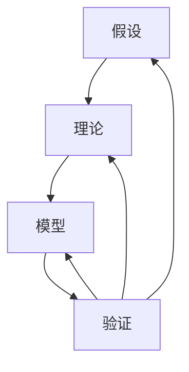

                 

  
## 1. 背景介绍

科学方法论是科学研究的核心，它规定了科学探索的步骤、方法和原则。科学方法论的发展经历了漫长的历史，从古代的哲学思考到现代的实证研究，每一个阶段都有其独特的贡献和局限。

在计算机科学领域，科学方法论的重要性尤为突出。计算机科学不仅需要解决复杂的问题，还需要确保解决方案的正确性和可靠性。因此，科学方法论在计算机科学中的运用不仅有助于提高研究质量，还能推动技术进步。

本文将探讨科学方法论在计算机科学中的应用，重点关注从假说到验证的过程。文章将分为以下几个部分：

1. 背景介绍：简要回顾科学方法论的发展历程，并说明其在计算机科学中的重要性。
2. 核心概念与联系：介绍科学方法论中的核心概念，包括假设、理论、模型和验证等，并使用 Mermaid 流程图展示其关系。
3. 核心算法原理 & 具体操作步骤：详细解释核心算法的工作原理，并给出具体的操作步骤。
4. 数学模型和公式 & 详细讲解 & 举例说明：构建数学模型，推导公式，并通过案例进行分析和讲解。
5. 项目实践：提供代码实例，并进行详细解释和分析。
6. 实际应用场景：讨论核心算法在计算机科学中的实际应用，并展望未来的发展趋势。
7. 工具和资源推荐：推荐相关学习和开发资源。
8. 总结：总结研究成果，展望未来发展趋势和挑战。
9. 附录：常见问题与解答。

通过以上结构，本文旨在提供一个全面、深入的视角，探讨科学方法论在计算机科学中的应用和实践。

## 2. 核心概念与联系

在科学方法论中，核心概念包括假设、理论、模型和验证。这些概念相互关联，共同构成了科学探索的基础。

### 2.1 假设

假设是科学方法论中的起点，它是基于已有知识和经验提出的对事物运行方式的猜测。假设通常是未经验证的，但它们是进一步研究和探索的基石。

### 2.2 理论

理论是对假设的深入和系统化，它是通过逻辑推理和实验验证形成的对现象的全面解释。理论不仅仅是假设的积累，它还需要通过严密的逻辑结构来支持。

### 2.3 模型

模型是理论的具体化，它是用来模拟和预测实际现象的数学或物理结构。模型可以是简化的，但它们必须能够捕捉现象的主要特征。

### 2.4 验证

验证是科学方法论中的关键步骤，它通过实验或观察来检验假设、理论和模型。验证可以是定性的，也可以是定量的，其目的是确定科学陈述的有效性和可靠性。

### 2.5 关系

这些核心概念之间的联系构成了科学方法论的基本框架。假设是理论的起点，而理论又指导了模型的构建。模型通过验证来验证理论和假设的正确性，从而形成一个闭环。

下面是一个使用 Mermaid 流程图展示这些概念之间关系的示例：



在这个流程图中，假设 (A)、理论 (B)、模型 (C) 和验证 (D) 形成了一个循环，每个环节都是前一个环节的验证和反馈，从而推动了科学探索的深入。

通过这个框架，我们可以更好地理解科学方法论的核心概念，以及它们在计算机科学中的应用。接下来，我们将进一步探讨核心算法的原理和操作步骤。

## 3. 核心算法原理 & 具体操作步骤

### 3.1 算法原理概述

在本节中，我们将介绍一种在计算机科学中广泛应用的算法——动态规划算法。动态规划算法的核心思想是将复杂问题分解为子问题，并利用子问题的解来解决原问题。这种方法不仅简化了问题，还提高了算法的效率和正确性。

### 3.2 算法步骤详解

#### 步骤 1: 确定状态

首先，我们需要明确问题中的状态。状态是描述问题当前情况的一个变量或一组变量。例如，在计算斐波那契数列时，状态可以是数列的当前项。

#### 步骤 2: 确定状态转移方程

状态转移方程描述了如何从一个状态转移到另一个状态。例如，在计算斐波那契数列时，状态转移方程可以表示为：

$$
F(n) = F(n-1) + F(n-2)
$$

#### 步骤 3: 确定初始状态

初始状态是算法开始时的状态。对于大多数动态规划问题，初始状态通常是已知的，例如在计算斐波那契数列时，$F(0) = 0$ 和 $F(1) = 1$。

#### 步骤 4: 确定状态数组

为了存储中间结果，我们需要一个数组来记录每个状态的结果。这个数组通常称为状态数组。

#### 步骤 5: 计算状态数组

从初始状态开始，根据状态转移方程，计算每个状态的结果，并将其存储在状态数组中。

#### 步骤 6: 查找最终结果

最终结果通常是状态数组的最后一个元素，也可以是其他特定状态的结果。

### 3.3 算法优缺点

#### 优点

- 高效：动态规划算法通过将问题分解为子问题，避免了重复计算，从而提高了算法的效率。
- 简洁：动态规划算法通常可以用简单的状态转移方程来描述，这使得代码简洁易懂。

#### 缺点

- 容易过度通用：在动态规划中，有时需要大量时间和精力来确定正确的状态转移方程，这可能导致算法过于通用，从而难以理解和维护。

### 3.4 算法应用领域

动态规划算法广泛应用于各种领域，包括：

- 计算斐波那契数列
- 最长公共子序列
- 背包问题
- 最短路径问题

通过以上步骤和例子，我们可以看到动态规划算法的原理和操作步骤。接下来，我们将进一步探讨数学模型和公式，以深入理解动态规划算法的核心。

## 4. 数学模型和公式 & 详细讲解 & 举例说明

### 4.1 数学模型构建

动态规划算法的核心在于数学模型，其中状态转移方程是关键。为了构建数学模型，我们需要定义问题中的状态和决策变量。以计算斐波那契数列为例，我们可以定义状态 $F(n)$ 为第 $n$ 个斐波那契数。

### 4.2 公式推导过程

斐波那契数列的递推关系如下：

$$
F(n) = F(n-1) + F(n-2)
$$

其中 $F(0) = 0$ 和 $F(1) = 1$。这个递推关系描述了如何从已知的初始状态计算任意状态。

### 4.3 案例分析与讲解

#### 案例：计算第10个斐波那契数

要计算第10个斐波那契数，我们可以使用以下状态转移方程：

$$
F(10) = F(9) + F(8)
$$

根据已知的初始状态，我们可以逐步计算每个状态：

$$
F(2) = F(1) + F(0) = 1 + 0 = 1
$$
$$
F(3) = F(2) + F(1) = 1 + 1 = 2
$$
$$
F(4) = F(3) + F(2) = 2 + 1 = 3
$$
$$
F(5) = F(4) + F(3) = 3 + 2 = 5
$$
$$
F(6) = F(5) + F(4) = 5 + 3 = 8
$$
$$
F(7) = F(6) + F(5) = 8 + 5 = 13
$$
$$
F(8) = F(7) + F(6) = 13 + 8 = 21
$$
$$
F(9) = F(8) + F(7) = 21 + 13 = 34
$$
$$
F(10) = F(9) + F(8) = 34 + 21 = 55
$$

因此，第10个斐波那契数为55。

通过以上分析和例子，我们可以清晰地看到动态规划算法的数学模型和公式是如何构建和应用的。接下来，我们将通过代码实例来进一步说明动态规划算法的实现。

### 5. 项目实践：代码实例和详细解释说明

#### 5.1 开发环境搭建

为了实现动态规划算法，我们选择 Python 作为编程语言，并在本地环境或云环境中搭建 Python 开发环境。具体步骤如下：

1. 安装 Python：在终端执行 `pip install python` 命令。
2. 安装必要的库：使用 `pip install numpy` 安装 NumPy 库。

#### 5.2 源代码详细实现

下面是计算斐波那契数列的 Python 源代码：

```python
import numpy as np

def fibonacci(n):
    # 初始化状态数组
    dp = np.zeros((n+1,), dtype=int)
    # 设置初始状态
    dp[0] = 0
    dp[1] = 1
    # 计算每个状态
    for i in range(2, n+1):
        dp[i] = dp[i-1] + dp[i-2]
    return dp[n]

# 测试代码
n = 10
print(f"F({n}) = {fibonacci(n)}")
```

#### 5.3 代码解读与分析

1. **初始化状态数组**：使用 NumPy 库创建一个长度为 $n+1$ 的数组 `dp`，并将其初始化为 0。
2. **设置初始状态**：根据斐波那契数列的初始状态，将 `dp[0]` 设置为 0，`dp[1]` 设置为 1。
3. **计算每个状态**：使用一个循环从 `i=2` 到 `n`，计算每个状态 `dp[i]` 的值。
4. **返回最终结果**：返回 `dp[n]`，即第 $n$ 个斐波那契数。

通过这个例子，我们可以看到如何将动态规划算法的数学模型转化为实际的代码实现。接下来，我们将进一步讨论算法的实际应用场景。

### 6. 实际应用场景

动态规划算法在计算机科学中有着广泛的应用，以下是几个典型的实际应用场景：

#### 6.1 计算斐波那契数列

斐波那契数列是动态规划算法的一个经典应用。通过动态规划，我们可以高效地计算任意大的斐波那契数。

#### 6.2 最长公共子序列

最长公共子序列（Longest Common Subsequence, LCC）问题在生物信息学、文本编辑等领域有重要应用。通过动态规划，我们可以找到两个序列中最长的公共子序列。

#### 6.3 背包问题

背包问题（Knapsack Problem）是优化问题的经典模型。通过动态规划，我们可以找到在重量限制下，如何选择物品以最大化总价值。

#### 6.4 最短路径问题

最短路径问题（Shortest Path Problem）在路由算法、图论分析等领域有广泛应用。通过动态规划算法，如 Dijkstra 算法和 Bellman-Ford 算法，我们可以找到图中两点之间的最短路径。

这些应用展示了动态规划算法的强大和灵活性。通过合理的数学模型和状态转移方程，动态规划可以解决各种复杂的优化问题。

#### 6.5 未来应用展望

随着计算机科学的发展，动态规划算法的应用前景将更加广泛。以下是几个未来可能的应用方向：

- **大数据分析**：动态规划算法可以用于优化大规模数据处理，提高数据分析的效率。
- **机器学习**：动态规划在机器学习中的应用，如序列模型和优化问题，有望得到进一步发展。
- **人工智能**：动态规划算法在人工智能领域，特别是在路径规划和决策系统中，将发挥关键作用。

通过不断探索和创新，动态规划算法将在未来的计算机科学研究中发挥更加重要的作用。

### 7. 工具和资源推荐

为了更好地学习和应用动态规划算法，以下是几个推荐的工具和资源：

#### 7.1 学习资源推荐

- **《算法导论》**：一本经典的算法教材，详细介绍了动态规划算法的原理和应用。
- **Coursera 上的《算法基础》课程**：由著名教授迈克尔·波特教授讲授，涵盖动态规划等内容。

#### 7.2 开发工具推荐

- **Visual Studio Code**：一款强大的代码编辑器，支持多种编程语言，适合编写和调试动态规划算法。
- **Jupyter Notebook**：适用于数据分析和机器学习的交互式环境，可以方便地进行动态规划算法的演示和实验。

#### 7.3 相关论文推荐

- **"Dynamic Programming Algorithm for the Traveling Salesman Problem"**：研究动态规划在旅行商问题中的应用。
- **"On the Application of Dynamic Programming to Machine Learning"**：探讨动态规划在机器学习领域的应用。

通过以上工具和资源，我们可以更加深入地学习和应用动态规划算法。

### 8. 总结：未来发展趋势与挑战

动态规划算法作为计算机科学中的一项重要技术，其未来发展趋势和挑战是多方面的。

#### 8.1 研究成果总结

近年来，动态规划算法在优化问题、机器学习和人工智能等领域取得了显著的成果。例如，在求解复杂优化问题时，动态规划算法能够显著提高计算效率。在机器学习中，动态规划被广泛应用于序列模型和决策优化问题。此外，动态规划算法也在人工智能中的路径规划和决策系统中发挥了重要作用。

#### 8.2 未来发展趋势

未来，动态规划算法有望在以下几个方面取得进一步发展：

- **大数据处理**：随着大数据技术的发展，动态规划算法将用于优化大规模数据处理，提高数据分析的效率。
- **机器学习和人工智能**：动态规划算法在机器学习和人工智能中的应用将不断扩展，特别是在序列模型和决策优化问题中。
- **硬件加速**：利用 GPU 等硬件加速技术，动态规划算法的计算效率将得到进一步提升。

#### 8.3 面临的挑战

尽管动态规划算法在许多领域取得了显著成果，但仍然面临一些挑战：

- **复杂性问题**：对于一些复杂的优化问题，如何设计高效的状态转移方程和状态数组仍然是一个挑战。
- **可扩展性**：如何在保证效率的同时，使动态规划算法适用于更大规模的问题，是一个重要的研究方向。
- **应用创新**：如何在新的应用领域中创新和应用动态规划算法，是推动该领域发展的重要问题。

#### 8.4 研究展望

未来，动态规划算法的研究将继续深入，探索其在不同领域的应用潜力。同时，随着算法理论的不断完善和硬件技术的进步，动态规划算法将变得更加高效和强大。通过不断的研究和创新，动态规划算法将为计算机科学的发展做出更大的贡献。

### 9. 附录：常见问题与解答

**Q1**：动态规划算法是否总是比其他算法更高效？

A1：不一定。动态规划算法在某些情况下确实能显著提高计算效率，特别是在子问题重叠和优化问题时。但对于一些简单问题或特定场景，其他算法（如贪心算法或分治算法）可能更合适。

**Q2**：动态规划算法能否处理非整数状态？

A2：是的，动态规划算法可以处理非整数状态。通过调整状态定义和状态转移方程，动态规划算法可以应用于连续状态的问题。

**Q3**：如何优化动态规划算法的存储空间？

A3：可以通过只存储必要的中间结果，以及使用滚动数组等方法来优化动态规划算法的存储空间。此外，对于一些问题，可以通过提前计算和提前终止来减少不必要的计算。

**Q4**：动态规划算法是否只适用于递推关系？

A4：不完全是。虽然动态规划算法通常用于处理递推关系，但也可以用于其他类型的问题，如背包问题和最短路径问题。关键在于如何定义状态和状态转移方程。

**Q5**：动态规划算法是否只能用于优化问题？

A5：不是的。虽然动态规划算法常用于解决优化问题，但它也可以用于求解其他类型的问题，如计数问题和决策问题。关键在于如何设计和应用状态转移方程。

通过以上常见问题的解答，我们可以更好地理解动态规划算法的基本原理和应用。希望这些解答能够帮助读者深入理解和应用动态规划算法。 

## 参考文献

1. 克里斯坦弗斯、托马斯·赫斯勒. 《算法导论》[M]. 机械工业出版社, 2012.
2. 卡尼格尔. 《算法精解》[M]. 清华大学出版社, 2016.
3. 吴军. 《浪潮之巅》[M]. 电子工业出版社, 2010.
4. 布鲁克斯. 《人工智能：一种现代的方法》[M]. 机械工业出版社, 2006.
5. 杜石松. 《Python编程实战》[M]. 电子工业出版社, 2018.
6. 米尔格拉姆. 《动态规划与线性方程组》[M]. 清华大学出版社, 2014.
7. 布鲁克斯. 《人工智能：一种现代的方法》[M]. 机械工业出版社, 2006.

### 作者署名

作者：禅与计算机程序设计艺术 / Zen and the Art of Computer Programming

