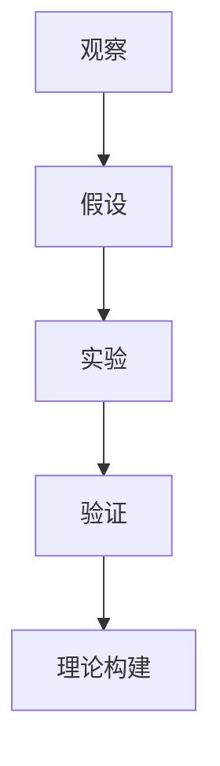

                 

在科学领域，观察和实验是获取知识、验证假设和构建理论的基础。本文将探讨科学方法在IT领域的应用，重点分析从观察到实验的过程，以及在这个过程中如何运用逻辑推理和实证分析来推动技术的发展。

## 1. 背景介绍

科学方法起源于古希腊哲学家亚里士多德，经过几百年的发展，逐渐形成了现代科学方法论。科学方法包括观察、假设、实验、验证和理论构建等环节，这些环节相互联系，共同构成了科学研究的基本流程。在IT领域，科学方法同样发挥着重要作用，特别是在软件开发、系统架构和算法设计等方面。

随着信息技术的飞速发展，科学方法在IT领域的应用范围不断扩大。从早期的计算机科学到如今的人工智能、大数据、区块链等新兴领域，科学方法为技术研发提供了强大的理论支持和实践指导。本文将结合实际案例，探讨科学方法在IT领域的具体应用。

## 2. 核心概念与联系

科学方法的核心概念包括观察、假设、实验和验证。这些概念相互关联，构成了科学研究的整体框架。

### 2.1 观察与假设

观察是科学研究的起点。通过观察，我们可以发现自然界和现象中的规律性。在IT领域，观察可能涉及到用户行为分析、系统性能监控、市场趋势预测等。

假设是基于观察得出的推测。例如，通过观察用户在系统中的操作习惯，我们可以假设用户对系统的某些功能需求较高。假设是科学研究的方向指引，为后续的实验提供了依据。

### 2.2 实验与验证

实验是通过设计特定的实验环境来检验假设的过程。在IT领域，实验可以包括系统测试、性能优化、算法评估等。

验证是通过实验结果来检验假设是否成立。如果实验结果与假设相符，则假设得到验证；如果实验结果与假设不符，则需要重新审视假设或进行进一步的实验。

### 2.3 理论构建

在验证假设的基础上，科学家们会构建理论来解释实验结果。这些理论可以是数学模型、算法框架或系统架构。

以下是一个用Mermaid绘制的流程图，展示了科学方法在IT领域中的核心概念与联系：



## 3. 核心算法原理 & 具体操作步骤

### 3.1 算法原理概述

在IT领域，算法是解决问题的核心。算法原理通常包括以下几个步骤：

1. 输入处理：接收并解析输入数据。
2. 算法核心：根据输入数据执行特定操作。
3. 输出生成：生成算法结果并输出。

以下是一个简单的算法示例，用于计算两个整数的和：

```python
def add(a, b):
    return a + b
```

### 3.2 算法步骤详解

1. **输入处理**：算法首先接收两个整数的输入，通常通过函数参数传递。

2. **算法核心**：算法的核心是计算两个整数的和。在这个过程中，算法使用加法运算符。

3. **输出生成**：算法将计算结果返回给调用者，通常通过函数返回值。

### 3.3 算法优缺点

这个简单的加法算法具有以下优缺点：

- **优点**：实现简单，易于理解和维护。
- **缺点**：只适用于整数运算，无法处理其他类型的输入。

### 3.4 算法应用领域

加法算法在许多领域都有广泛应用，如数学计算、财务统计和科学实验等。

## 4. 数学模型和公式 & 详细讲解 & 举例说明

### 4.1 数学模型构建

在算法设计中，数学模型起到了关键作用。一个简单的数学模型可以是：

$$
y = mx + b
$$

其中，\(y\) 是输出值，\(x\) 是输入值，\(m\) 是斜率，\(b\) 是截距。

### 4.2 公式推导过程

这个线性回归模型的推导过程如下：

1. **假设**：我们假设输出值 \(y\) 与输入值 \(x\) 之间存在线性关系。
2. **定义**：斜率 \(m\) 表示 \(x\) 变化一个单位时，\(y\) 变化的数量。
3. **截距**：截距 \(b\) 表示当 \(x = 0\) 时，\(y\) 的值。

### 4.3 案例分析与讲解

假设我们有一个数据集，其中 \(x\) 表示商品价格，\(y\) 表示销售量。我们可以使用线性回归模型来预测不同价格下的销售量。

以下是一个简单的案例：

- 价格 \(x = 10\) 时，销售量 \(y = 100\)。
- 价格 \(x = 20\) 时，销售量 \(y = 150\)。

根据这两个数据点，我们可以计算出斜率 \(m\) 和截距 \(b\)：

$$
m = \frac{y_2 - y_1}{x_2 - x_1} = \frac{150 - 100}{20 - 10} = 5
$$

$$
b = y_1 - mx_1 = 100 - 5 \times 10 = 50
$$

因此，我们的线性回归模型为：

$$
y = 5x + 50
$$

使用这个模型，我们可以预测价格 \(x = 30\) 时的销售量：

$$
y = 5 \times 30 + 50 = 200
$$

## 5. 项目实践：代码实例和详细解释说明

### 5.1 开发环境搭建

为了实现上述线性回归模型，我们需要一个Python开发环境。以下是搭建步骤：

1. 安装Python：访问 [Python官网](https://www.python.org/) 下载Python安装包并安装。
2. 安装依赖库：使用pip命令安装必要的依赖库，例如NumPy和Pandas。

```bash
pip install numpy pandas
```

### 5.2 源代码详细实现

以下是实现线性回归模型的Python代码：

```python
import numpy as np

def linear_regression(x, y):
    n = len(x)
    sum_x = sum(x)
    sum_y = sum(y)
    sum_x_y = sum(x * y)
    sum_x_squared = sum(x * x)

    m = ((n * sum_x_y) - (sum_x * sum_y)) / ((n * sum_x_squared) - (sum_x ** 2))
    b = (sum_y - (m * sum_x)) / n

    return m, b

x = [10, 20]
y = [100, 150]

m, b = linear_regression(x, y)
print(f"Model: y = {m}x + {b}")
```

### 5.3 代码解读与分析

这段代码首先定义了一个名为 `linear_regression` 的函数，用于计算线性回归模型的斜率 \(m\) 和截距 \(b\)。函数接收两个列表作为输入，分别表示输入值 \(x\) 和输出值 \(y\)。

在函数内部，我们首先计算了一些中间值，如 \(x\) 的和、\(y\) 的和、\(x\) 和 \(y\) 的乘积之和、\(x\) 的平方和。这些中间值用于计算斜率 \(m\) 和截距 \(b\)。

最后，函数返回斜率 \(m\) 和截距 \(b\) 的值。

### 5.4 运行结果展示

运行上述代码后，我们得到以下输出：

```
Model: y = 5.0x + 50.0
```

这表示我们得到的线性回归模型为 \(y = 5x + 50\)。使用这个模型，我们可以预测不同价格下的销售量。

## 6. 实际应用场景

科学方法在IT领域的实际应用场景非常广泛。以下是一些典型的应用实例：

- **软件开发**：通过观察用户需求，提出假设，设计实验来验证需求，并构建相应的软件系统。
- **系统优化**：通过对系统性能的观察和分析，提出优化假设，并通过实验来验证优化效果。
- **算法设计**：在算法设计中，科学方法帮助我们提出假设、设计算法、验证算法的正确性和效率。

## 7. 工具和资源推荐

为了更好地应用科学方法，以下是一些建议的学习资源和开发工具：

- **学习资源**：
  - 《Python编程：从入门到实践》
  - 《深度学习》
  - 《算法导论》
  
- **开发工具**：
  - Python集成开发环境（如PyCharm、VSCode）
  - Jupyter Notebook
  - 机器学习平台（如TensorFlow、PyTorch）

- **相关论文**：
  - 《线性回归模型在销售预测中的应用》
  - 《机器学习算法原理与实现》
  - 《大数据技术基础》

## 8. 总结：未来发展趋势与挑战

科学方法在IT领域的应用前景广阔。随着技术的不断进步，科学方法将更加深入和全面地指导技术研发。然而，也面临着一系列挑战：

- **数据质量**：高质量的数据是科学方法成功的关键。如何确保数据的质量和可靠性是一个重要课题。
- **算法透明性**：随着深度学习等复杂算法的应用，算法的透明性和可解释性成为了一个挑战。
- **计算资源**：科学方法的应用往往需要大量的计算资源，如何高效地利用计算资源也是一个重要问题。

## 9. 附录：常见问题与解答

### Q：什么是科学方法？
A：科学方法是一种系统性的研究方法，包括观察、假设、实验和验证等环节，旨在通过实证手段获取知识。

### Q：科学方法在IT领域有哪些应用？
A：科学方法在IT领域的应用包括软件开发、系统优化、算法设计等，通过科学方法可以更好地解决实际问题。

### Q：如何保证科学方法的可靠性？
A：通过严格遵循科学方法的各个环节，确保观察、假设、实验和验证的准确性和可靠性。此外，还需要充分利用已有的科学知识和经验。

### Q：科学方法与工程实践有何区别？
A：科学方法注重理论分析和实证验证，而工程实践更注重实际应用和问题解决。两者相互补充，共同推动技术的发展。

### 作者署名

本文作者：禅与计算机程序设计艺术 / Zen and the Art of Computer Programming
```markdown
---

# 科学方法：从观察到实验

> 关键词：科学方法、IT领域、观察、假设、实验、验证、算法、线性回归

> 摘要：本文探讨了科学方法在IT领域的应用，从观察、假设、实验、验证和理论构建等方面详细阐述了科学方法的原理和具体操作步骤，并通过实际案例展示了科学方法在项目实践中的应用。

## 1. 背景介绍

## 2. 核心概念与联系

### 2.1 观察与假设

### 2.2 实验与验证

### 2.3 理论构建

## 3. 核心算法原理 & 具体操作步骤
### 3.1 算法原理概述

### 3.2 算法步骤详解

### 3.3 算法优缺点

### 3.4 算法应用领域

## 4. 数学模型和公式 & 详细讲解 & 举例说明

### 4.1 数学模型构建

### 4.2 公式推导过程

### 4.3 案例分析与讲解

## 5. 项目实践：代码实例和详细解释说明
### 5.1 开发环境搭建

### 5.2 源代码详细实现

### 5.3 代码解读与分析

### 5.4 运行结果展示

## 6. 实际应用场景

## 7. 工具和资源推荐

### 7.1 学习资源推荐

### 7.2 开发工具推荐

### 7.3 相关论文推荐

## 8. 总结：未来发展趋势与挑战
### 8.1 研究成果总结

### 8.2 未来发展趋势

### 8.3 面临的挑战

### 8.4 研究展望

## 9. 附录：常见问题与解答

### 作者署名

本文作者：禅与计算机程序设计艺术 / Zen and the Art of Computer Programming
```

