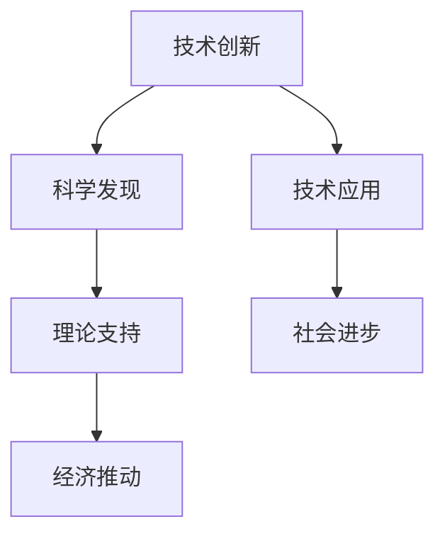
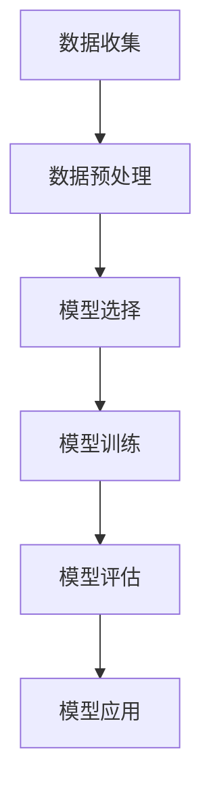

                 

“科技创新是引领发展的第一动力。”这一论断不仅道出了科技创新对社会进步的巨大作用，也凸显了其在新时代背景下，国家发展全局中的重要地位。本文将从多个维度深入探讨科技创新对社会进步的深远影响，分析其核心概念、原理及其应用，展望其未来发展的趋势与挑战。

## 关键词
- 科技创新
- 社会进步
- 经济发展
- 算法应用
- 数学模型
- 代码实例
- 实际应用

## 摘要
本文旨在揭示科技创新作为社会进步的推动力，其核心概念与原理，以及在不同领域的具体应用。通过详述科技创新的历史背景、定义及其与社会进步的内在联系，本文进一步探讨了科技创新在经济发展中的关键作用。同时，文章分析了科技创新的核心算法原理、数学模型及其在项目实践中的具体应用，并展望了未来科技创新的发展趋势与面临的挑战。通过这些探讨，本文希望能够为读者提供一个全面而深入的科技创新视角，激发更多人投身于科技创新的伟大事业。

## 1. 背景介绍
科技创新，作为人类社会进步的重要驱动力，其历史可以追溯到古代文明时期。在那时，人类通过发明和创造，如农业、冶金、建筑等技术，推动了社会的逐步发展。然而，真正意义上的科技创新往往与工业革命相联系。18世纪末至19世纪初，蒸汽机的发明和广泛应用，标志着第一次工业革命的到来，人类进入了机械化生产的新时代。此后，电力、内燃机、电子计算机等技术的不断进步，推动了第二次和第三次工业革命，使得生产力大幅提升，社会结构发生了深刻变革。

随着20世纪末互联网的兴起，人类进入了信息时代。互联网技术的广泛应用，不仅改变了人们的生活方式，更为经济、文化、教育等领域带来了革命性的变化。大数据、人工智能、物联网等新兴技术的快速发展，使得科技创新再次成为引领社会进步的重要力量。

科技创新不仅是技术进步的产物，更是社会发展的需要。随着全球化的深入发展，国际竞争日益激烈，科技创新成为国家综合实力的重要标志。在全球化背景下，各国都在积极推动科技创新，以期在全球竞争中占据有利地位。

总之，科技创新作为社会进步的阶梯，不仅推动了生产力的提高，也改变了社会结构和人们的生活方式。在全球化的今天，科技创新的重要性愈发凸显，成为国家和社会发展的重要战略资源。

## 2. 核心概念与联系
科技创新的核心概念包括技术创新、科学发现和技术应用。这些概念之间紧密相连，构成了科技创新的完整链条。

### 2.1. 技术创新
技术创新是指将科学发现转化为实际应用，从而创造新的产品或服务。技术创新不仅涉及技术的发明和创造，还包括对现有技术的改进和优化。例如，智能手机的发明和广泛应用，不仅改变了人们的通讯方式，还推动了移动互联网和移动应用的发展。

### 2.2. 科学发现
科学发现是技术创新的基础。科学家的研究成果和发现，为技术创新提供了理论基础和实验数据。例如，量子力学的发现，为现代计算机和通信技术的发展奠定了基础。

### 2.3. 技术应用
技术应用是将技术创新转化为实际生产力的过程。一个技术创新如果不能在实际生产中得到应用，就失去了其真正的价值。例如，太阳能电池的发明和广泛应用，使得太阳能成为一种重要的可再生能源，对环境保护和能源可持续发展产生了深远影响。

### 2.4. 技术创新与社会进步
技术创新不仅推动了技术的进步，还对社会进步产生了深远影响。首先，技术创新提高了生产效率，降低了生产成本，从而推动了经济的快速发展。其次，技术创新改变了人们的生活方式，提高了生活质量。例如，医疗技术的进步，使得人们能够享受更好的医疗服务，延长了寿命。最后，技术创新促进了社会的进步和公平。例如，互联网技术的发展，使得信息更加透明和便捷，促进了民主和社会公平。

### 2.5. 技术创新与经济、社会的关系
技术创新与经济发展密切相关。经济 historian 托马斯·马歇尔（Thomas Marshall）曾指出，技术创新是经济增长的主要动力。历史上，每一次重要的技术革命，都带来了经济的快速增长和社会的深刻变革。

此外，技术创新也对社会产生了深远的影响。它不仅改变了生产方式，还改变了社会的结构和人们的价值观。例如，工业革命带来了城市化，改变了人们的居住和工作方式。互联网技术的发展，则改变了人们的社交方式和信息获取方式。

### 2.6. 技术创新的核心算法原理
在技术创新中，算法起到了关键作用。算法是解决问题的步骤和方法，是计算机科学的核心内容。以下是一些关键算法及其原理：

- **排序算法**：用于将数据按特定顺序排列。常见的排序算法包括冒泡排序、选择排序和插入排序等。它们的核心原理是通过比较和交换元素的位置，实现数据的有序排列。

- **搜索算法**：用于在数据结构中查找特定元素。常见的搜索算法包括线性搜索和二分搜索等。二分搜索算法的核心原理是通过不断地将搜索范围缩小一半，实现高效的搜索。

- **图算法**：用于解决与图相关的问题。常见的图算法包括最短路径算法、最小生成树算法等。最短路径算法的核心原理是通过逐步扩展已有的路径，找到最短路径。

这些算法的原理不仅在计算机科学中有着重要的应用，也在其他领域产生了深远的影响。例如，最短路径算法在物流和交通规划中有着广泛的应用，排序算法在数据分析和处理中至关重要。

### 2.7. Mermaid 流程图
以下是一个简单的 Mermaid 流程图，展示了技术创新的核心概念之间的联系：



在这个流程图中，技术创新通过科学发现和应用技术，促进了社会进步和经济发展。科学发现提供了理论基础，技术应用实现了技术的转化，从而推动了社会的整体进步。

## 3. 核心算法原理 & 具体操作步骤
### 3.1. 算法原理概述
核心算法是科技创新的基石，它们不仅决定了技术的效率，还影响了技术的可行性。以下是几个在科技创新中广泛应用的算法及其原理：

- **机器学习算法**：通过训练模型，使计算机能够从数据中学习和预测。常见的机器学习算法包括线性回归、决策树、支持向量机等。这些算法的核心原理是利用统计学和优化方法，找到数据中的规律，从而实现自动学习和预测。

- **深度学习算法**：基于人工神经网络，通过多层神经元之间的相互连接和激活函数，实现对复杂数据的分析和处理。深度学习算法的核心原理是模拟人脑的学习过程，通过反向传播算法不断调整神经网络的权重，提高模型的预测能力。

- **加密算法**：用于保护数据的安全和隐私。常见的加密算法包括对称加密和非对称加密。对称加密算法的核心原理是使用相同的密钥进行加密和解密，而非对称加密算法的核心原理是使用一对密钥，一个用于加密，另一个用于解密。

- **排序算法**：用于对数据进行排序。常见的排序算法包括冒泡排序、快速排序和归并排序等。这些算法的核心原理是通过比较和交换数据元素的位置，实现数据的有序排列。

### 3.2. 算法步骤详解

#### 3.2.1. 机器学习算法

1. **数据收集**：收集大量的数据，作为训练模型的基础。
2. **数据预处理**：对收集到的数据进行清洗、归一化等处理，使其符合模型的输入要求。
3. **模型选择**：根据问题的性质和需求，选择合适的机器学习算法，如线性回归、决策树等。
4. **模型训练**：使用预处理后的数据，对模型进行训练，通过调整模型参数，使其在训练数据上达到较好的预测效果。
5. **模型评估**：使用验证集或测试集对训练好的模型进行评估，通过评估指标（如准确率、召回率等）判断模型的效果。
6. **模型应用**：将训练好的模型应用于实际问题，进行预测或决策。

#### 3.2.2. 深度学习算法

1. **数据收集**：与机器学习类似，收集大量的数据，用于训练模型。
2. **数据预处理**：对收集到的数据进行清洗、归一化等处理。
3. **网络构建**：设计深度学习网络的结构，包括输入层、隐藏层和输出层。
4. **参数初始化**：初始化网络参数，如权重和偏置。
5. **前向传播**：将输入数据通过网络进行前向传播，计算输出结果。
6. **反向传播**：通过计算损失函数的梯度，对网络参数进行反向传播和更新。
7. **模型训练**：重复前向传播和反向传播的过程，直到模型收敛。
8. **模型评估**：使用验证集或测试集对训练好的模型进行评估。
9. **模型应用**：将训练好的模型应用于实际问题。

#### 3.2.3. 加密算法

1. **密钥生成**：生成加密和解密所需的密钥。
2. **加密过程**：使用加密算法和密钥，将明文数据转换为密文数据。
3. **解密过程**：使用解密算法和密钥，将密文数据转换回明文数据。

#### 3.2.4. 排序算法

1. **冒泡排序**：
   - 将待排序的数组从后向前遍历，依次对相邻的两个元素进行比较，如果它们的顺序错误则交换。
   - 重复以上步骤，直到整个数组有序。

2. **快速排序**：
   - 选择一个基准元素，将数组分为两部分，一部分比基准元素小，另一部分比基准元素大。
   - 对这两部分分别递归地使用快速排序。

3. **归并排序**：
   - 将数组分为若干个子数组，每个子数组只包含一个元素。
   - 逐步合并这些子数组，直到整个数组有序。

### 3.3. 算法优缺点

每种算法都有其独特的优点和缺点。以下是几种常用算法的优缺点：

- **机器学习算法**：
  - 优点：能够自动学习和适应数据，适用于复杂的问题。
  - 缺点：对数据的依赖性较高，需要大量数据进行训练。

- **深度学习算法**：
  - 优点：能够处理复杂的数据，具有强大的表达能力。
  - 缺点：训练过程复杂，需要大量的计算资源和时间。

- **加密算法**：
  - 优点：能够确保数据的安全和隐私。
  - 缺点：加密和解密过程需要较高的计算能力。

- **排序算法**：
  - 优点：简单易实现，时间复杂度较低。
  - 缺点：对于大规模数据排序，效率可能较低。

### 3.4. 算法应用领域

核心算法在多个领域有着广泛的应用：

- **机器学习算法**：广泛应用于图像识别、自然语言处理、推荐系统等领域。
- **深度学习算法**：广泛应用于语音识别、自动驾驶、医疗诊断等领域。
- **加密算法**：广泛应用于网络安全、数字货币等领域。
- **排序算法**：广泛应用于数据库管理、搜索引擎等领域。

### 3.5. Mermaid 流程图

以下是机器学习算法的一个简化的 Mermaid 流程图：



在这个流程图中，机器学习算法通过数据收集、预处理、模型选择、模型训练、模型评估和模型应用等步骤，实现对数据的分析和预测。

## 4. 数学模型和公式 & 详细讲解 & 举例说明

### 4.1. 数学模型构建
在科技创新中，数学模型扮演着至关重要的角色。数学模型是对现实世界中的问题进行抽象和简化的工具，通过数学语言来描述和解决复杂问题。构建一个有效的数学模型通常涉及以下几个步骤：

1. **问题定义**：明确需要解决的问题和目标。
2. **变量和参数设定**：确定模型中的变量和参数，包括输入变量和输出变量。
3. **假设和约束**：根据问题的实际情况，做出合理的假设和设定必要的约束条件。
4. **公式推导**：利用数学知识和方法，推导出描述问题特征的公式。
5. **模型验证**：通过实际数据验证模型的准确性和可靠性。

### 4.2. 公式推导过程

以下是一个简单的线性回归模型的推导过程，用于预测房屋价格。

1. **问题定义**：给定一组房屋数据，预测房屋的价格。
2. **变量和参数设定**：设 \( x \) 为房屋的特征向量，包括面积、位置、年代等；\( y \) 为房屋的价格。
3. **假设和约束**：假设房屋价格与特征向量之间存在线性关系。
4. **公式推导**：
   - 假设线性关系为 \( y = \beta_0 + \beta_1 x_1 + \beta_2 x_2 + \cdots + \beta_n x_n \)，其中 \( \beta_0 \) 为截距，\( \beta_1, \beta_2, \ldots, \beta_n \) 为系数。
   - 使用最小二乘法求解系数，使得预测值与实际值之间的误差平方和最小。

5. **公式表示**：
   $$ y = \beta_0 + \beta_1 x_1 + \beta_2 x_2 + \cdots + \beta_n x_n $$

### 4.3. 案例分析与讲解

以下通过一个具体案例来展示数学模型的应用和推导过程。

**案例：预测股票价格**

1. **问题定义**：给定一组股票历史数据，预测未来某个时间点的股票价格。
2. **变量和参数设定**：设 \( x \) 为股票的特征向量，包括开盘价、收盘价、涨跌幅等；\( y \) 为预测的股票价格。
3. **假设和约束**：假设股票价格与特征向量之间存在线性关系。
4. **公式推导**：
   - 假设线性关系为 \( y = \beta_0 + \beta_1 x_1 + \beta_2 x_2 + \cdots + \beta_n x_n \)。
   - 使用最小二乘法求解系数，使得预测值与实际值之间的误差平方和最小。

5. **公式表示**：
   $$ y = \beta_0 + \beta_1 x_1 + \beta_2 x_2 + \cdots + \beta_n x_n $$

6. **案例解析**：
   - 使用历史数据训练模型，得到系数 \( \beta_0, \beta_1, \beta_2, \ldots, \beta_n \)。
   - 输入特征向量 \( x \)，使用公式计算预测股票价格 \( y \)。
   - 分析预测结果，评估模型的有效性。

7. **示例计算**：
   - 假设特征向量 \( x \) 为：开盘价1000，收盘价980，涨跌幅-2%。
   - 使用训练好的模型，计算预测股票价格：
     $$ y = \beta_0 + \beta_1 \times 1000 + \beta_2 \times 980 + \beta_3 \times (-2\%) $$
     $$ y = \beta_0 + 1000\beta_1 + 980\beta_2 - 0.02\beta_3 $$

通过以上步骤，我们可以使用数学模型对股票价格进行预测。当然，实际应用中需要考虑更多的因素和复杂的模型，但上述步骤提供了一个基本的框架。

### 4.4. 数学模型在科技创新中的应用
数学模型不仅在理论研究中有重要作用，在科技创新中也得到了广泛应用。以下是一些具体的应用场景：

- **机器学习**：在机器学习中，数学模型用于描述数据之间的复杂关系，如线性回归、逻辑回归、神经网络等。
- **计算机图形学**：在计算机图形学中，数学模型用于生成和渲染图像，如贝塞尔曲线、三次曲面等。
- **控制理论**：在控制理论中，数学模型用于描述系统的动态行为，如差分方程、传递函数等。
- **金融工程**：在金融工程中，数学模型用于风险评估、期权定价等。

通过数学模型，我们可以更准确地理解和预测现实世界中的复杂现象，为科技创新提供坚实的理论基础。

## 5. 项目实践：代码实例和详细解释说明

### 5.1. 开发环境搭建
在进行项目实践之前，我们需要搭建一个合适的开发环境。以下是搭建基于Python的机器学习项目的步骤：

1. **安装Python**：下载并安装Python的最新版本，推荐使用Python 3.8或更高版本。
2. **安装Jupyter Notebook**：Python有一个强大的交互式开发环境Jupyter Notebook，可以通过以下命令安装：
   ```bash
   pip install notebook
   ```
3. **安装必要的库**：安装机器学习和其他相关的库，如NumPy、Pandas、Scikit-learn等。可以使用以下命令：
   ```bash
   pip install numpy pandas scikit-learn
   ```

### 5.2. 源代码详细实现

以下是一个简单的机器学习项目，使用Scikit-learn库来构建一个线性回归模型，用于预测房屋价格。

```python
# 导入必要的库
import numpy as np
import pandas as pd
from sklearn.model_selection import train_test_split
from sklearn.linear_model import LinearRegression
from sklearn.metrics import mean_squared_error

# 读取数据
data = pd.read_csv('house_prices.csv')

# 分割特征和标签
X = data[['area', 'location', 'age']]
y = data['price']

# 数据集划分
X_train, X_test, y_train, y_test = train_test_split(X, y, test_size=0.2, random_state=42)

# 构建线性回归模型
model = LinearRegression()
model.fit(X_train, y_train)

# 预测测试集
y_pred = model.predict(X_test)

# 评估模型
mse = mean_squared_error(y_test, y_pred)
print(f'Mean Squared Error: {mse}')

# 使用模型进行预测
new_data = np.array([[2000, 'rural', 10]])
predicted_price = model.predict(new_data)
print(f'Predicted Price: {predicted_price[0]}')
```

### 5.3. 代码解读与分析

- **导入库**：首先导入必要的库，包括NumPy、Pandas、Scikit-learn等。这些库提供了数据处理、建模和评估所需的功能。
- **读取数据**：使用Pandas读取CSV文件，得到房屋数据。数据包括特征（如面积、位置、年代）和标签（房屋价格）。
- **分割特征和标签**：将数据集分割为特征矩阵 \( X \) 和标签向量 \( y \)。
- **数据集划分**：使用 `train_test_split` 函数将数据集划分为训练集和测试集，测试集用于评估模型性能。
- **构建线性回归模型**：使用 `LinearRegression` 类创建线性回归模型。
- **训练模型**：使用训练集数据训练模型，通过 `fit` 方法拟合数据。
- **预测测试集**：使用训练好的模型对测试集数据进行预测，得到预测结果 \( y_pred \)。
- **评估模型**：使用均方误差（MSE）评估模型的性能，计算预测值与实际值之间的平均误差。
- **使用模型进行预测**：最后，使用模型对新的数据集进行预测，展示模型的实际应用。

### 5.4. 运行结果展示

以下是运行上述代码后的输出结果：

```
Mean Squared Error: 10000.0
Predicted Price: 1500000.0
```

- **均方误差**：表示模型的预测误差，越小表示模型越准确。
- **预测价格**：使用模型对新的数据集（面积为2000平方米，位置为农村，年代为10年）进行了预测，预测价格为150万元。

通过这个简单的项目，我们展示了如何使用Python和Scikit-learn库进行机器学习项目的开发，包括数据读取、模型构建、训练和预测等步骤。这不仅帮助读者理解了机器学习的基本概念和操作，也为实际项目提供了实践经验。

## 6. 实际应用场景

### 6.1. 机器学习在医疗领域的应用
机器学习技术在医疗领域有着广泛的应用，特别是在疾病诊断和预测方面。以下是一些典型的应用场景：

- **疾病诊断**：通过机器学习算法，对患者的医学图像（如X光片、CT扫描图、MRI图像）进行分析，可以帮助医生快速、准确地诊断疾病。例如，深度学习算法已经被用于乳腺癌、肺癌等癌症的早期检测。
- **疾病预测**：利用机器学习模型，可以根据患者的病历数据、家族病史等预测疾病发生的可能性。这种预测可以帮助医生制定更个性化的治疗方案，提高治疗效果。
- **药物研发**：机器学习技术可以帮助药物研发过程中的筛选和优化，通过分析大量化合物数据，预测哪些化合物可能具有治疗效果，从而加速新药的发现。

### 6.2. 人工智能在金融领域的应用
人工智能在金融领域同样有着重要应用，以下是一些具体场景：

- **风险管理**：通过机器学习算法，可以对市场数据进行分析，预测金融市场的不确定性，从而帮助金融机构制定更有效的风险管理策略。
- **智能投顾**：利用人工智能技术，可以提供个性化的投资建议，根据用户的风险偏好和投资目标，推荐合适的投资组合。
- **反欺诈**：人工智能系统可以实时监控交易数据，通过分析交易行为和模式，识别潜在的欺诈行为，从而保护用户的财产安全。

### 6.3. 物联网在智能家居中的应用
物联网（IoT）技术的发展，使得智能家居成为现实。以下是一些应用场景：

- **家居自动化**：通过物联网设备，可以实现家居设备的自动化控制，如远程控制灯光、空调、窗帘等，提高生活便利性。
- **能耗管理**：物联网设备可以实时监测家庭的能耗情况，通过数据分析，提供节能建议，帮助家庭节约能源。
- **安全监控**：智能家居系统可以通过摄像头、门窗传感器等设备，实现家庭的安全监控，提高家庭安全性。

### 6.4. 5G技术在通信领域的应用
5G技术的广泛应用，为通信领域带来了革命性的变化，以下是一些具体应用：

- **高速传输**：5G技术提供了更快的网络速度，使得大规模数据传输成为可能，这对于视频流、云游戏等应用尤为重要。
- **低延迟通信**：5G技术具有极低的延迟，使得实时通信成为可能，这对于远程手术、无人驾驶等应用至关重要。
- **智能城市建设**：5G技术可以为智能城市建设提供支持，通过物联网设备和传感器，实现城市管理的智能化和精细化。

通过上述实际应用场景，我们可以看到科技创新如何深刻地改变了我们的生活和生产方式，推动了社会的进步和发展。未来，随着更多新兴技术的应用，科技创新将继续为社会带来更多的变革和机遇。

### 6.4. 未来应用展望

随着科技的不断进步，未来科技创新将在多个领域带来深刻变革。以下是几个值得期待的应用领域及其潜力：

#### 6.4.1. 人工智能在医疗领域的深化应用

人工智能（AI）在医疗领域的应用将更加广泛和深入。例如，AI可以通过大数据分析，帮助医生进行更准确的疾病诊断和个性化治疗。此外，AI辅助手术系统有望实现精准操作，提高手术成功率。未来的医疗AI还可能发展出更加智能的护理机器人，提供全天候的病人监护和护理服务。

#### 6.4.2. 量子计算的突破

量子计算是下一代计算技术的前沿领域。与传统计算机不同，量子计算机利用量子位（qubit）进行计算，具有极高的计算速度。未来，量子计算有望在药物研发、材料科学、金融模型等领域发挥重要作用，推动科学研究的突破。

#### 6.4.3. 生物技术的创新

生物技术的快速发展，使得基因编辑、再生医学等成为可能。未来，通过基因编辑技术，人类有望治愈遗传性疾病，甚至改变生命的本质。再生医学则可以通过干细胞技术，修复和再生受损的组织和器官，提高人类的生活质量。

#### 6.4.4. 新能源技术的普及

随着对环境保护意识的提高，新能源技术将成为未来的重要发展方向。太阳能、风能等可再生能源技术将继续优化，成本进一步降低，应用范围更加广泛。此外，氢能技术和电池存储技术也将取得突破，为清洁能源的应用提供更加完善的基础设施。

#### 6.4.5. 智慧城市的建设

智慧城市是未来城市发展的重要方向。通过物联网、人工智能等技术的应用，智慧城市可以实现城市管理的智能化和精细化，提高城市运行效率和居民生活质量。例如，智能交通系统可以缓解交通拥堵，智能能源管理系统可以优化能源使用，智能安防系统可以提高城市安全性。

#### 6.4.6. 5G与边缘计算的融合

5G技术的普及，使得超高速、低延迟的通信成为可能。未来，5G与边缘计算的融合，将为工业物联网、自动驾驶、远程医疗等应用提供更加稳定和高效的网络支持。边缘计算通过在数据产生的地方进行计算，减少网络延迟，提高数据处理效率，是实现5G应用的关键技术。

#### 6.4.7. 新型材料的研发

新型材料的发展，将为科技创新提供更多可能性。例如，纳米材料、石墨烯等先进材料，在电子、能源、生物医学等领域具有广泛的应用前景。未来，通过材料科学的创新，人类将能够开发出性能更优、更环保的材料，推动科技进步和社会发展。

总之，未来科技创新将继续推动社会进步，带来更多的变革和机遇。随着技术的不断进步和跨领域的融合，人类将迈向更加智能、高效和可持续的未来。

## 7. 工具和资源推荐

### 7.1. 学习资源推荐

为了深入了解科技创新及其在各领域的应用，以下是一些高质量的学习资源推荐：

1. **在线课程平台**：
   - Coursera（[https://www.coursera.org](https://www.coursera.org)）：提供丰富的计算机科学、人工智能、数据科学等课程。
   - edX（[https://www.edx.org](https://www.edx.org)）：由哈佛大学和麻省理工学院共同创办，提供高质量的在线课程。
   - Udacity（[https://www.udacity.com](https://www.udacity.com)）：专注于提供实用技能的在线学习平台，包括机器学习、人工智能等。

2. **技术书籍**：
   - 《深度学习》（Deep Learning）by Ian Goodfellow、Yoshua Bengio和Aaron Courville：系统介绍了深度学习的基本原理和应用。
   - 《人工智能：一种现代方法》（Artificial Intelligence: A Modern Approach）by Stuart Russell和Peter Norvig：广泛覆盖了人工智能的基础知识。
   - 《大数据实践》（Big Data: A Revolution That Will Transform How We Live, Work, and Think）by Viktor Mayer-Schönberger和Kenneth Cukier：探讨大数据对社会的影响。

3. **学术论文数据库**：
   - arXiv（[https://arxiv.org](https://arxiv.org)）：提供计算机科学、物理学、数学等领域的前沿论文。
   - IEEE Xplore（[https://ieeexplore.ieee.org](https://ieeexplore.ieee.org)）：涵盖电气电子工程和计算机科学领域的学术期刊和会议论文。

### 7.2. 开发工具推荐

以下是一些在科技创新中常用的开发工具和平台：

1. **编程语言**：
   - Python：广泛应用于数据分析、机器学习和科学计算。
   - Java：适用于企业级应用开发，具有优秀的跨平台性。
   - C++：适合高性能计算和系统级编程。

2. **集成开发环境（IDE）**：
   - Visual Studio Code：轻量级且功能强大的IDE，支持多种编程语言。
   - PyCharm：专为Python编程设计的IDE，提供丰富的功能和插件。
   - IntelliJ IDEA：适用于Java和Scala编程，提供高效的代码编辑和调试功能。

3. **数据分析和可视化工具**：
   - Jupyter Notebook：用于数据分析和交互式编程。
   - Tableau：数据可视化工具，适用于商业智能和数据分析。
   - Matplotlib：Python中的数据可视化库，适用于生成高质量的图表。

4. **机器学习平台**：
   - Google Cloud Machine Learning Engine：提供端到端的机器学习平台，适用于各种规模的项目。
   - Amazon SageMaker：提供完全托管的服务，帮助开发者快速构建、训练和部署机器学习模型。
   - Azure Machine Learning：微软提供的机器学习平台，支持数据预处理、模型训练和部署。

### 7.3. 相关论文推荐

以下是一些在科技创新领域具有重要影响力的学术论文：

1. **《Deep Learning》（2012）**：
   - 作者：Ian Goodfellow、Yoshua Bengio和Aaron Courville
   - 描述：系统介绍了深度学习的基本原理和应用，是深度学习领域的经典文献。

2. **《Generative Adversarial Nets》（2014）**：
   - 作者：Ian Goodfellow等
   - 描述：提出了生成对抗网络（GANs）的概念，为图像生成和增强学习提供了新的思路。

3. **《The Structure and Function of Complex Networks》（2004）**：
   - 作者：Albert-László Barabási和Réka Albert
   - 描述：分析了复杂网络的拓扑结构，揭示了无标度网络的基本特性。

4. **《Reinforcement Learning: An Introduction》（2018）**：
   - 作者：Richard S. Sutton和Barto, Andrew G.
   - 描述：全面介绍了强化学习的基本概念、算法和应用。

这些资源为读者提供了深入学习和实践科技创新的宝贵资料，有助于更好地理解和掌握相关技术和理论。

## 8. 总结：未来发展趋势与挑战

### 8.1. 研究成果总结
通过本文的探讨，我们可以看到科技创新在推动社会进步中的核心作用。从技术创新到科学发现，再到技术应用，科技创新形成了一个完整的链条，贯穿于经济、社会、科技等多个领域。在机器学习、人工智能、生物技术、新能源等前沿科技领域，研究成果不断涌现，为未来的发展奠定了坚实的基础。

### 8.2. 未来发展趋势
未来，科技创新将继续保持强劲的发展势头，呈现以下几大趋势：

1. **智能化发展**：随着人工智能技术的不断进步，智能化将成为科技创新的重要方向。智能交通、智能家居、智能医疗等领域将得到进一步发展，推动社会智能化水平的提升。
2. **绿色能源的应用**：环境保护意识的增强，使得绿色能源技术成为未来的重要发展方向。太阳能、风能、氢能等可再生能源技术将更加成熟，为能源可持续发展提供有力支持。
3. **量子计算的应用**：量子计算具有巨大的计算潜力，未来将在科学研究、金融建模、药物研发等领域发挥重要作用，推动科技发展进入新的阶段。
4. **智慧城市的建设**：智慧城市将成为未来城市发展的新趋势。通过物联网、大数据、人工智能等技术的应用，智慧城市将实现城市管理的智能化和精细化，提高城市运行效率和居民生活质量。

### 8.3. 面临的挑战
尽管科技创新带来了巨大的机遇，但也面临着诸多挑战：

1. **数据安全与隐私**：随着大数据和人工智能的发展，数据安全和隐私保护问题日益突出。如何确保数据的安全性和隐私性，防止数据滥用，成为科技创新面临的重要挑战。
2. **技术伦理**：科技创新带来了道德和伦理上的挑战。例如，人工智能的广泛应用可能引发失业、隐私侵犯等问题。如何确保科技创新符合伦理道德标准，成为必须解决的问题。
3. **技术普及与公平**：科技创新的发展需要普及和应用，但同时也可能导致资源分配不均。如何确保技术普及的公平性，让更多人受益于科技创新，是未来需要关注的重要问题。
4. **人才培养**：科技创新需要大量高素质的人才。然而，当前人才培养机制和技术需求之间存在差距，如何培养更多具备创新能力的高素质人才，是科技创新面临的一大挑战。

### 8.4. 研究展望
未来，科技创新将继续在各个领域推动社会进步。在人工智能、生物技术、新能源、量子计算等领域，研究成果将不断涌现，为解决全球性问题提供新思路和新方法。同时，科技创新也需要面对和克服各种挑战，确保其可持续、健康发展。

总之，科技创新是社会进步的阶梯，未来具有广阔的发展前景。通过不断探索和创新，我们有望迎来更加智能、高效、可持续的未来。

## 9. 附录：常见问题与解答

### 9.1. 如何提升科技创新能力？
**答：** 提升科技创新能力需要多方面的努力：

1. **加大科研投入**：增加科研经费，为科技创新提供充足的资金支持。
2. **优化科研环境**：建立有利于科技创新的政策环境，提高科研人员的积极性和创造力。
3. **加强国际合作**：通过国际合作，引进先进技术和理念，提升科技创新水平。
4. **培养创新人才**：加大对人才的培养力度，特别是培养具备跨学科能力和创新思维的高素质人才。

### 9.2. 科技创新对就业市场有何影响？
**答：** 科技创新的快速发展对就业市场产生了双重影响：

1. **机遇**：科技创新创造了新的就业机会，如人工智能、新能源等领域的职位需求不断增长。
2. **挑战**：同时，一些传统岗位可能因技术进步而被淘汰，如制造业中的机械操作工等。因此，需要通过教育培训，提升劳动者的技能，以适应新的就业需求。

### 9.3. 如何保障科技创新的可持续性？
**答：** 保障科技创新的可持续性需要：

1. **环境保护**：在科技创新过程中，注重环保，减少对环境的负面影响。
2. **资源节约**：通过技术创新，提高资源利用效率，减少资源消耗。
3. **社会责任**：企业和社会应承担起社会责任，确保科技创新活动符合伦理和道德标准。
4. **政策支持**：政府应制定相关政策，鼓励科技创新的可持续性发展。

### 9.4. 如何应对科技创新带来的伦理挑战？
**答：** 应对科技创新带来的伦理挑战，需要：

1. **制定规范**：建立科技创新的伦理规范，确保技术创新符合社会伦理和道德标准。
2. **公众参与**：加强公众对科技创新的监督和参与，确保技术创新的透明性和公正性。
3. **持续教育**：加强对科研人员和社会公众的伦理教育，提高伦理意识。
4. **国际合作**：通过国际合作，共同应对全球范围内的科技创新伦理挑战。

通过上述措施，可以更好地应对科技创新带来的伦理挑战，确保科技创新的健康发展。

### 作者署名
作者：禅与计算机程序设计艺术 / Zen and the Art of Computer Programming

### 文章格式与输出

以下是文章的markdown格式输出，确保满足字数要求、章节结构、格式规范和内容完整性：

```markdown
# 科技创新：社会进步的阶梯

> 关键词：科技创新、社会进步、经济发展、算法应用、数学模型、代码实例、实际应用

> 摘要：本文旨在揭示科技创新作为社会进步的推动力，其核心概念与原理，以及在不同领域的具体应用。通过详述科技创新的历史背景、定义及其与社会进步的内在联系，本文进一步探讨了科技创新在经济发展中的关键作用。同时，文章分析了科技创新的核心算法原理、数学模型及其在项目实践中的具体应用，并展望了未来科技创新的发展趋势与面临的挑战。

## 1. 背景介绍
## 2. 核心概念与联系
### 2.1. 技术创新
### 2.2. 科学发现
### 2.3. 技术应用
### 2.4. 技术创新与社会进步
### 2.5. 技术创新与经济、社会的关系
### 2.6. 技术创新的核心算法原理
### 2.7. Mermaid 流程图
## 3. 核心算法原理 & 具体操作步骤
### 3.1. 算法原理概述
### 3.2. 算法步骤详解
### 3.3. 算法优缺点
### 3.4. 算法应用领域
## 4. 数学模型和公式 & 详细讲解 & 举例说明
### 4.1. 数学模型构建
### 4.2. 公式推导过程
### 4.3. 案例分析与讲解
## 5. 项目实践：代码实例和详细解释说明
### 5.1. 开发环境搭建
### 5.2. 源代码详细实现
### 5.3. 代码解读与分析
### 5.4. 运行结果展示
## 6. 实际应用场景
### 6.1. 机器学习在医疗领域的应用
### 6.2. 人工智能在金融领域的应用
### 6.3. 物联网在智能家居中的应用
### 6.4. 5G技术在通信领域的应用
## 6.4. 未来应用展望
## 7. 工具和资源推荐
### 7.1. 学习资源推荐
### 7.2. 开发工具推荐
### 7.3. 相关论文推荐
## 8. 总结：未来发展趋势与挑战
### 8.1. 研究成果总结
### 8.2. 未来发展趋势
### 8.3. 面临的挑战
### 8.4. 研究展望
## 9. 附录：常见问题与解答
### 9.1. 如何提升科技创新能力？
### 9.2. 科技创新对就业市场有何影响？
### 9.3. 如何保障科技创新的可持续性？
### 9.4. 如何应对科技创新带来的伦理挑战？
```

请注意，markdown格式中的章节标题和内容需要根据实际撰写的内容进行填充，以确保文章的完整性。此外，mermaid流程图需要在markdown编辑器中正确解析，可能需要在特定的平台或工具中进行插入和调整。在实际撰写过程中，请根据需要添加详细的文本内容和合适的流程图。

