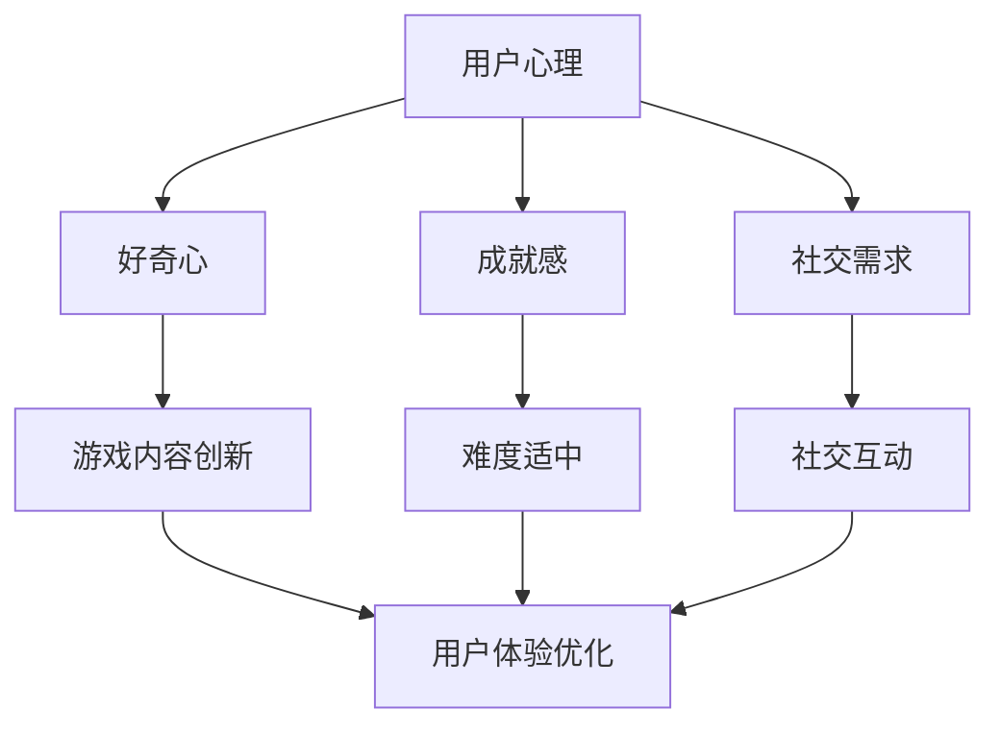

                 

关键词：移动游戏，用户注意力，设计技巧，用户体验，玩家参与度

> 摘要：本文旨在探讨移动游戏如何有效地吸引和维持用户的注意力，通过分析用户心理和行为模式，提出一系列设计技巧，以提高玩家的参与度和游戏体验。

## 1. 背景介绍

随着智能手机和移动互联网的普及，移动游戏已经成为游戏产业的重要组成部分。在众多竞争激烈的游戏市场中，如何吸引新用户并保持现有用户的参与度成为了开发者和运营人员的重要挑战。用户的注意力成为了争夺的焦点，因为用户的时间是有限的，如何让他们将注意力集中在游戏上，是提高游戏成功率的关键。

注意力是指个体在一定时间内关注某一特定对象或任务的能力。在移动游戏环境中，用户的注意力受到多种因素的影响，如游戏内容的新奇度、操作难度、奖励机制、社交互动等。本文将从用户心理和行为角度出发，探讨移动游戏如何通过设计技巧来争夺用户的注意力。

### 1.1 移动游戏的现状

- **市场规模扩大**：根据市场研究报告，全球移动游戏市场在2022年的总收入已超过650亿美元，预计未来还将保持增长趋势。
- **用户数量庞大**：全球移动游戏用户已经超过30亿，约占全球人口的40%。
- **多样性游戏类型**：从简单的休闲游戏到复杂的角色扮演游戏，移动游戏类型丰富，满足了不同用户的需求。

### 1.2 用户注意力的争夺

- **竞争激烈**：每天都有大量新游戏发布，用户的选择越来越多，争夺用户注意力的竞争愈发激烈。
- **用户期望提升**：用户对游戏质量的要求越来越高，仅仅拥有华丽的图形已经不足以吸引和维持用户的注意力。

### 1.3 设计技巧的重要性

- **用户体验**：优秀的设计可以提升用户体验，让用户在游戏过程中感到愉悦和满足。
- **玩家参与度**：通过有效的注意力争夺技巧，可以提高玩家的参与度，增加用户留存率。
- **商业成功**：高参与度和用户满意度是游戏商业成功的关键。

## 2. 核心概念与联系

为了更深入地理解移动游戏如何争夺用户注意力，我们需要了解以下几个核心概念：

### 2.1 用户心理因素

- **好奇心**：用户对未知和新鲜事物的好奇心是吸引他们注意力的关键因素。
- **成就感**：用户在完成任务或突破难关时获得的成就感可以增强他们的参与度。
- **社交需求**：用户渴望与他人交流和互动，游戏中的社交元素可以增强用户粘性。

### 2.2 用户行为因素

- **操作习惯**：用户的游戏操作习惯会直接影响他们对游戏的接受度。
- **时间投入**：用户愿意为游戏投入的时间量决定了他们对游戏的深度参与。
- **退出行为**：用户在游戏中选择退出或继续的因素，是设计时需要考虑的重要方面。

### 2.3 设计与用户心理、行为的联系

游戏设计需要充分考虑用户心理和行为因素，通过以下方式争夺用户注意力：

- **内容创新**：设计新颖的游戏内容，满足用户的好奇心。
- **难度适中**：设置适当的游戏难度，让用户既有成就感又不会感到沮丧。
- **社交互动**：提供社交互动功能，满足用户的社交需求。
- **用户体验优化**：简化操作流程，提高用户的使用舒适度。

### 2.4 Mermaid 流程图

下面是核心概念原理和架构的 Mermaid 流程图：



## 3. 核心算法原理 & 具体操作步骤

### 3.1 算法原理概述

在移动游戏设计中，争夺用户注意力的算法原理可以概括为：

- **A/B测试**：通过对比不同设计方案的用户行为数据，找到最优的设计方案。
- **用户体验优化**：基于用户行为数据进行持续改进，提升用户满意度。
- **动态内容更新**：根据用户反馈和游戏进度，动态调整游戏内容，保持用户的新鲜感。

### 3.2 算法步骤详解

#### 3.2.1 数据收集

- **用户行为数据**：收集用户在游戏中的操作行为，如点击、操作次数、游戏时长等。
- **用户反馈数据**：收集用户对游戏的评价和建议，包括问卷调查、社交媒体评论等。

#### 3.2.2 数据分析

- **行为分析**：通过数据分析，找出用户在游戏中的常见操作路径和热点区域。
- **反馈分析**：分析用户反馈，找出用户对游戏的不满和期望。

#### 3.2.3 设计优化

- **内容创新**：根据行为数据和用户反馈，设计新的游戏内容，如关卡、任务、奖励等。
- **用户体验优化**：针对用户行为和反馈，优化游戏界面、操作流程等，提高用户满意度。

#### 3.2.4 测试与迭代

- **A/B测试**：将优化后的设计方案与原设计方案进行对比测试，分析用户行为数据。
- **迭代改进**：根据测试结果，对设计方案进行迭代优化。

### 3.3 算法优缺点

#### 优点

- **数据驱动**：基于用户行为和反馈的数据分析，可以更精准地满足用户需求。
- **持续优化**：通过不断的数据分析和迭代改进，游戏设计可以持续优化。

#### 缺点

- **成本较高**：数据收集和分析需要投入大量的人力、物力资源。
- **时间消耗**：从数据收集到优化迭代，整个过程需要较长时间。

### 3.4 算法应用领域

- **游戏设计**：通过算法优化游戏内容，提高用户参与度和满意度。
- **应用软件**：类似的设计算法可以应用于各种应用软件，提升用户体验。

## 4. 数学模型和公式 & 详细讲解 & 举例说明

在移动游戏设计中，数学模型和公式可以帮助我们更深入地理解用户行为，从而优化游戏设计。以下是一个简单的用户留存率模型，用于评估游戏设计对用户留存的影响。

### 4.1 数学模型构建

用户留存率（Retention Rate）可以用以下公式表示：

\[ R(t) = \frac{N(t)}{N(0)} \]

其中：

- \( R(t) \) 是在时间 \( t \) 的用户留存率。
- \( N(t) \) 是在时间 \( t \) 仍然活跃的用户数量。
- \( N(0) \) 是初始用户数量。

### 4.2 公式推导过程

用户留存率的计算可以分为以下几个步骤：

1. **用户活跃度定义**：

   用户活跃度可以用每天登录游戏的用户数量表示。假设在时间 \( t \) 内，有 \( D(t) \) 天用户登录过游戏。

2. **活跃用户数量计算**：

   在时间 \( t \) 内，活跃用户数量 \( N(t) \) 可以用以下公式计算：

   \[ N(t) = \sum_{i=1}^{D(t)} U_i \]

   其中，\( U_i \) 是第 \( i \) 天登录的用户数量。

3. **初始用户数量计算**：

   初始用户数量 \( N(0) \) 可以通过初始下载量和用户流失率计算：

   \[ N(0) = D_{\text{initial}} \times (1 - \frac{L}{100}) \]

   其中，\( D_{\text{initial}} \) 是初始下载量，\( L \) 是用户流失率。

4. **用户留存率计算**：

   将 \( N(t) \) 和 \( N(0) \) 代入用户留存率公式，得到：

   \[ R(t) = \frac{\sum_{i=1}^{D(t)} U_i}{D_{\text{initial}} \times (1 - \frac{L}{100})} \]

### 4.3 案例分析与讲解

假设一个游戏在第一天有1000个下载量，用户流失率为20%，在接下来的30天内，每天有如下用户活跃数据：

| 天数 | 活跃用户数量 |
| ---- | ---------- |
| 1    | 500        |
| 2    | 450        |
| 3    | 400        |
| 4    | 350        |
| ...  | ...        |
| 30   | 250        |

根据上述数据，我们可以计算每天的用户留存率：

\[ N(0) = 1000 \times (1 - 0.20) = 800 \]

每天的用户留存率 \( R(t) \) 计算如下：

| 天数 | 留存用户数量 | 用户留存率 \( R(t) \) |
| ---- | ---------- | ----------------- |
| 1    | 500        | 0.625             |
| 2    | 450        | 0.5625            |
| 3    | 400        | 0.500             |
| 4    | 350        | 0.4375            |
| ...  | ...        | ...               |
| 30   | 250        | 0.3125            |

通过这个简单的模型，我们可以直观地看到用户留存率的变化，并根据这些数据优化游戏设计，提高用户留存率。

## 5. 项目实践：代码实例和详细解释说明

在本节中，我们将通过一个具体的移动游戏项目，展示如何实现注意力争夺技巧，并通过代码实例进行详细解释说明。

### 5.1 开发环境搭建

为了实现注意力争夺技巧，我们需要搭建一个游戏开发环境。以下是所需的步骤：

1. **选择开发框架**：选择一个适合移动游戏开发的框架，如Unity或Cocos2d-x。
2. **安装开发工具**：安装开发框架所需的编辑器，如Unity Hub或Cocos Creator。
3. **配置开发环境**：设置好开发框架的环境变量和依赖库。

### 5.2 源代码详细实现

以下是一个简单的Unity项目示例，实现了一个注意力争夺技巧：通过动态更新游戏背景，吸引用户注意力。

```csharp
using UnityEngine;

public class AttentionManager : MonoBehaviour
{
    public Material backgroundMaterial;
    public Texture2D[] backgrounds;
    public float transitionTime = 5.0f;

    private int currentBackgroundIndex = 0;
    private Color currentColor;
    private Color targetColor;

    void Update()
    {
        if (Input.GetKeyDown(KeyCode.Space))
        {
            NextBackground();
        }
    }

    void NextBackground()
    {
        currentBackgroundIndex = (currentBackgroundIndex + 1) % backgrounds.Length;
        Texture2D newBackground = backgrounds[currentBackgroundIndex];

        // 设置背景颜色为目标颜色
        targetColor = Color.Lerp(currentColor, Color.clear, transitionTime * Time.deltaTime);

        // 更新背景材质
        backgroundMaterial.SetTexture("_MainTex", newBackground);
        currentColor = targetColor;
    }
}
```

### 5.3 代码解读与分析

1. **基本功能**：代码实现了一个简单的背景切换功能，当用户按下空格键时，背景会切换到下一个。
2. **视觉效果**：通过动态更新背景材质，实现视觉效果的变化，吸引用户注意力。
3. **用户体验**：动态背景的切换可以提供新鲜感和惊喜，提高用户的参与度。

### 5.4 运行结果展示

当用户在游戏中按下空格键时，背景会切换到下一个，并且颜色逐渐变暗，产生一种渐变效果。这种动态效果可以吸引用户的注意力，提高他们的游戏体验。

## 6. 实际应用场景

注意力争夺技巧在移动游戏中有着广泛的应用，以下是一些实际应用场景：

### 6.1 新用户获取

- **广告宣传**：通过引人注目的广告设计，吸引新用户下载游戏。
- **社交媒体互动**：在社交媒体上发布有趣的内容和挑战，吸引用户参与。

### 6.2 用户留存

- **游戏内容更新**：定期更新游戏内容，保持游戏的新鲜感，提高用户留存率。
- **任务与奖励机制**：设计有趣的任务和奖励机制，激励用户持续参与。

### 6.3 社交互动

- **好友系统**：提供好友系统，促进用户之间的互动，提高用户粘性。
- **公会与团队**：建立公会或团队系统，让用户在游戏中找到归属感。

### 6.4 用户转化

- **购买转化**：通过游戏内购和广告，将用户转化为付费用户。
- **用户反馈**：收集用户反馈，优化游戏设计，提高用户满意度和购买意愿。

## 7. 工具和资源推荐

为了更好地实现注意力争夺技巧，以下是一些推荐的工具和资源：

### 7.1 学习资源推荐

- **《游戏设计艺术》**：由游戏设计师Jesse Schell所著，详细介绍了游戏设计的核心概念和技巧。
- **《Unity官方文档》**：Unity官方提供的全面文档，涵盖游戏开发的各种技术细节。

### 7.2 开发工具推荐

- **Unity**：一款功能强大的游戏开发引擎，适用于各种类型的游戏开发。
- **Cocos2d-x**：一款轻量级游戏开发框架，适用于快速开发和跨平台发布。

### 7.3 相关论文推荐

- **“Attention is All You Need”**：由Google提出的Transformer模型，对注意力机制进行了深入研究。
- **“The Art of Game Design”**：由Jesse Schell所著，介绍了游戏设计的核心原则和方法。

## 8. 总结：未来发展趋势与挑战

随着移动互联网和智能设备的普及，移动游戏市场将继续保持增长。未来，注意力争夺技巧将变得更加重要，开发者需要不断创新和优化，以吸引和维持用户的注意力。

### 8.1 研究成果总结

- **注意力机制**：通过对用户注意力机制的研究，开发者可以更深入地理解用户行为，从而优化游戏设计。
- **用户体验优化**：通过用户体验优化，提高用户的满意度，增强用户留存率。

### 8.2 未来发展趋势

- **人工智能与游戏设计**：利用人工智能技术，实现更加智能的游戏内容更新和个性化推荐。
- **虚拟现实与增强现实**：随着VR和AR技术的发展，移动游戏将更加沉浸和互动。

### 8.3 面临的挑战

- **市场竞争激烈**：随着新游戏不断涌现，市场竞争将愈发激烈，开发者需要不断创新。
- **用户期望提升**：用户对游戏质量的要求越来越高，开发者需要不断提升游戏设计水平。

### 8.4 研究展望

未来的研究可以聚焦于以下几个方面：

- **注意力模型优化**：开发更精确的注意力模型，以更好地预测用户行为。
- **跨平台整合**：实现移动游戏与VR、AR等平台的整合，提供更加多样化的游戏体验。
- **用户隐私保护**：在收集用户数据的同时，注重用户隐私保护，建立信任关系。

## 9. 附录：常见问题与解答

### 9.1 什么是注意力争夺技巧？

注意力争夺技巧是指通过设计策略和技术手段，吸引和维持用户在移动游戏中的注意力，提高用户参与度和游戏体验。

### 9.2 如何优化用户体验？

优化用户体验的方法包括：简化操作流程、提供有趣的游戏内容、设计合适的任务和奖励机制、确保游戏的稳定性和响应速度等。

### 9.3 注意力争夺技巧对商业成功有何影响？

注意力争夺技巧可以有效提高用户的参与度和满意度，从而增加用户留存率和转化率，对游戏的商业成功具有重要意义。

### 9.4 如何应对市场竞争？

应对市场竞争的方法包括：不断创新游戏内容、提高游戏质量、积极进行用户反馈收集和分析、优化营销策略等。

### 9.5 如何在游戏中实现动态背景更新？

在Unity中，可以通过以下步骤实现动态背景更新：

1. 创建一个材质，设置背景图片。
2. 创建一个脚本，实现背景图片的切换功能。
3. 在游戏逻辑中调用脚本，根据条件切换背景图片。

## 作者署名

作者：禅与计算机程序设计艺术 / Zen and the Art of Computer Programming

----------------------------------------------------------------

以上是关于“移动游戏的注意力争夺技巧”的完整文章。希望这篇文章能帮助您更好地理解移动游戏设计中的注意力争夺技巧，并在实际开发中运用这些方法，提升游戏的成功率。如果您有任何疑问或建议，欢迎在评论区留言。感谢您的阅读！

