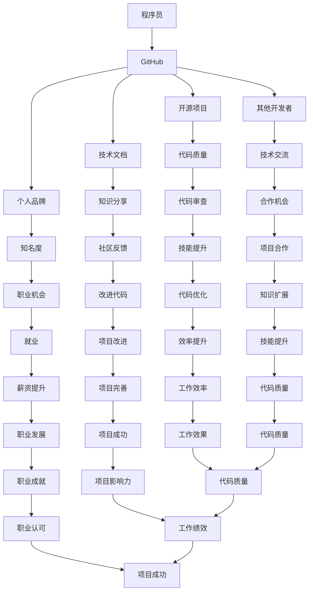
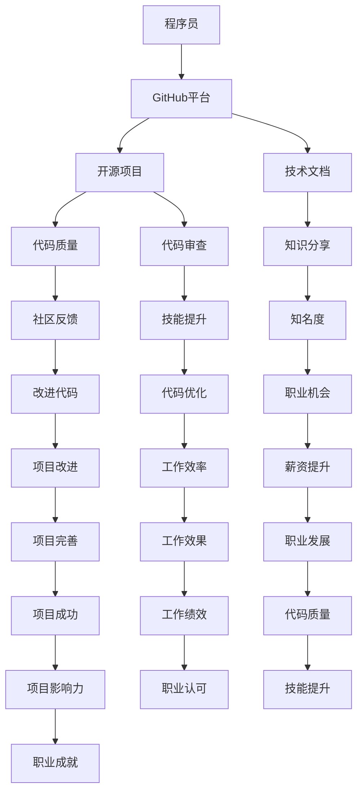

                 

 **关键词：** 程序员，GitHub，知识营销，技术分享，开源项目，个人品牌建设

**摘要：** 本文将探讨程序员如何利用GitHub平台进行知识营销，包括开源项目的选择与维护、技术文档的编写与分享、个人品牌建设以及如何通过GitHub与其他开发者建立联系。通过对这些策略的详细分析，本文旨在为程序员提供一个系统化的知识营销指南，帮助他们在技术领域中脱颖而出。

## 1. 背景介绍

在当今数字化时代，程序员的知识和技能成为其个人品牌的核心资产。而GitHub，作为全球最大的代码托管平台，已经成为程序员展示技能、分享知识和建立个人品牌的重要场所。通过GitHub，程序员可以展示他们的代码、技术文档和个人项目，吸引潜在雇主和同行的关注。然而，仅仅拥有代码并不足够，如何有效地利用GitHub进行知识营销，成为每一个技术人员的必修课。

本文将围绕以下几个方面展开：

- **开源项目的选择与维护**：如何挑选适合自己的开源项目，并进行有效的维护和推广。
- **技术文档的编写与分享**：如何撰写高质量的技术文档，并通过GitHub进行分享。
- **个人品牌建设**：如何在GitHub上建立和提升个人品牌。
- **与其他开发者的互动**：如何通过GitHub与其他开发者建立联系，拓展技术视野。
- **工具和资源推荐**：介绍一些有助于知识营销的工具和资源。

## 2. 核心概念与联系

在探讨如何利用GitHub进行知识营销之前，我们需要明确一些核心概念和它们之间的联系。以下是一个Mermaid流程图，用以展示这些概念和它们之间的相互作用：



### 2.1 核心概念原理

- **程序员**：具有编程能力和软件开发经验的专业人士。
- **GitHub**：一个基于Web的版本控制系统，用于托管、分享和协作代码。
- **开源项目**：由多个开发者共同维护的项目，其源代码公开可访问，允许任何人自由使用、修改和分享。
- **技术文档**：关于技术实现、使用方法和最佳实践的文档，用于帮助开发者理解和使用相关技术。
- **个人品牌**：个人在专业领域内的声誉和影响力。
- **其他开发者**：在GitHub上与其他程序员建立联系，共同学习和成长。

### 2.2 架构的 Mermaid 流程图

以下是一个简化的Mermaid流程图，展示程序员在GitHub上进行知识营销的流程：



## 3. 核心算法原理 & 具体操作步骤

### 3.1 算法原理概述

利用GitHub进行知识营销的核心算法，可以归纳为以下四个主要步骤：

1. **项目选择与定位**：挑选与个人技能和兴趣相关的开源项目，明确项目的目标和受众。
2. **代码编写与维护**：编写高质量的代码，遵循编程规范，确保代码的可读性和可维护性。
3. **文档编写与分享**：撰写详细的技术文档，分享使用经验和最佳实践。
4. **互动与反馈**：积极参与社区讨论，接受反馈，不断改进项目。

### 3.2 算法步骤详解

#### 步骤1：项目选择与定位

- **需求分析**：确定个人技术优势和兴趣领域，选择具有实际应用价值的项目。
- **项目评估**：评估项目的活跃度、贡献者数量和社区氛围，确保项目有足够的发展潜力。
- **定位明确**：明确项目的目标受众，如初学者、专业开发者或行业专家。

#### 步骤2：代码编写与维护

- **编码规范**：遵循编程规范，确保代码的可读性和一致性。
- **代码质量**：编写高质量的代码，减少bug，提高代码的可维护性。
- **版本控制**：使用Git进行版本控制，记录每次代码变更的详细描述。

#### 步骤3：文档编写与分享

- **文档结构**：建立清晰的文档结构，包括概述、安装指南、使用方法、API文档等。
- **内容质量**：确保文档内容的准确性、完整性和易于理解。
- **更新频率**：定期更新文档，反映最新的代码变化和用户反馈。

#### 步骤4：互动与反馈

- **社区参与**：积极参与项目的社区讨论，解答用户问题，收集反馈。
- **代码审查**：接受其他开发者的代码审查，改进代码质量。
- **持续改进**：根据反馈持续改进项目，提高用户满意度。

### 3.3 算法优缺点

**优点：**

- **提升知名度**：通过开源项目和文档分享，提高个人在技术领域的知名度。
- **积累经验**：参与开源项目，可以积累实际开发经验，提升技能水平。
- **建立联系**：与其他开发者互动，拓展人脉，获取合作机会。
- **知识传播**：通过分享技术知识和经验，为社区贡献力量。

**缺点：**

- **时间投入**：维护开源项目需要大量的时间和精力。
- **项目管理**：需要合理规划时间，确保项目进度和质量。
- **技术风险**：可能面临技术挑战和代码漏洞，需要不断学习和改进。

### 3.4 算法应用领域

- **软件开发**：通过开源项目，展示个人在软件开发领域的技能和经验。
- **技术文档编写**：分享技术文档，帮助其他开发者理解和使用相关技术。
- **个人品牌建设**：通过GitHub上的活动，建立和提升个人品牌。
- **社区贡献**：参与社区讨论，为开源项目贡献代码和文档。

## 4. 数学模型和公式 & 详细讲解 & 举例说明

### 4.1 数学模型构建

在GitHub上进行知识营销的数学模型可以简化为一个函数，该函数表示个人品牌知名度（\(B\)）与开源项目质量（\(Q\)）、技术文档质量（\(D\)）、社区参与度（\(C\)）之间的关系。具体公式如下：

\[ B = f(Q, D, C) \]

其中：

- \(B\)：个人品牌知名度。
- \(Q\)：开源项目质量。
- \(D\)：技术文档质量。
- \(C\)：社区参与度。

### 4.2 公式推导过程

该公式的推导基于以下假设：

1. **质量决定影响力**：高质量的开源项目和技术文档更容易受到社区的关注和认可，从而提高个人品牌知名度。
2. **参与度促进传播**：积极参与社区讨论和代码审查，有助于扩大个人品牌的影响力。

因此，我们可以将个人品牌知名度视为开源项目质量、技术文档质量和社区参与度的函数，即：

\[ B = f(Q, D, C) \]

### 4.3 案例分析与讲解

以下是一个具体案例，说明如何通过GitHub上的开源项目和技术文档提高个人品牌知名度：

**案例：** 小明是一名Java开发者，他在GitHub上创建了一个名为“JavaBestPractices”的开源项目，用于分享Java开发的最佳实践。

1. **项目质量**：小明在项目中使用了最新的Java技术，遵循了Java编码规范，确保了代码的质量和可读性。
2. **技术文档**：小明撰写了详细的技术文档，包括概述、安装指南、使用方法、API文档等，帮助其他开发者更好地理解和使用项目。
3. **社区参与**：小明积极参与项目的社区讨论，解答用户问题，并接受其他开发者的代码审查。

通过以上措施，小明的个人品牌知名度在Java开发者社区中迅速提升，吸引了更多的关注和合作机会。

### 4.4 模型应用与调整

在实际应用中，我们可以根据个人情况和项目特点调整公式中的权重。例如，对于一些初入行的开发者，可能更应注重社区参与度（\(C\)），以快速建立个人品牌。而对于有丰富经验的开发者，可能更应注重开源项目质量（\(Q\)）和技术文档质量（\(D\)），以提升专业影响力。

\[ B = w_1 \cdot Q + w_2 \cdot D + w_3 \cdot C \]

其中，\(w_1\)、\(w_2\)、\(w_3\) 分别为项目质量、技术文档质量和社区参与度的权重。

## 5. 项目实践：代码实例和详细解释说明

### 5.1 开发环境搭建

为了更好地展示如何利用GitHub进行知识营销，我们将以一个简单的Python项目为例。首先，我们需要搭建一个Python开发环境。

1. **安装Python**：在官方网站（[https://www.python.org/downloads/）下载并安装Python。建议选择最新版本，确保支持Python3。](https://www.python.org/downloads/%EF%BC%89%E4%B8%8B%E8%BD%BD%E5%B9%B6%E5%AE%89%E8%A3%85Python%E3%80%82%E5%BB%BA%E8%AE%A1%E8%AF%B7%E4%B8%80%E4%B8%AA%E6%9C%80%E6%96%B0%E7%89%88%E6%9C%AC%EF%BC%8C%E4%BE%9B%E7%BB%9D%E6%94%AF%E6%8C%81Python3%E3%80%82)
2. **安装必备库**：在终端中使用以下命令安装Python中常用的库：

   ```bash
   pip install requests
   pip install beautifulsoup4
   ```

### 5.2 源代码详细实现

以下是一个简单的Python代码实例，用于抓取一个网页中的所有链接。该代码使用了requests库和beautifulsoup4库。

```python
import requests
from bs4 import BeautifulSoup

def get_links(url):
    response = requests.get(url)
    if response.status_code == 200:
        soup = BeautifulSoup(response.text, 'html.parser')
        links = [link.get('href') for link in soup.find_all('a', href=True)]
        return links
    else:
        return []

if __name__ == '__main__':
    url = 'https://www.example.com'
    links = get_links(url)
    print(links)
```

**代码解读：**

- **第1行**：引入requests库，用于发送HTTP请求。
- **第2行**：引入beautifulsoup4库，用于解析HTML内容。
- **第3行**：定义一个函数get_links，接收一个URL参数。
- **第5行**：使用requests库的get方法发送GET请求，获取网页内容。
- **第7行**：检查响应状态码，确保请求成功。
- **第9行**：使用beautifulsoup4库的BeautifulSoup类创建一个BeautifulSoup对象，用于解析HTML内容。
- **第11行**：使用find_all方法查找所有带有href属性的a标签，获取链接列表。
- **第13行**：返回链接列表。

### 5.3 代码解读与分析

通过上述代码实例，我们可以看到如何利用Python进行网页链接抓取。以下是对代码的关键部分进行解读和分析：

1. **请求网页内容**：使用requests库的get方法发送HTTP请求，获取网页内容。该方法的返回值是一个Response对象，包含请求的响应状态码、响应头、响应体等信息。
2. **解析HTML内容**：使用beautifulsoup4库的BeautifulSoup类创建一个BeautifulSoup对象，用于解析HTML内容。BeautifulSoup提供了丰富的API，方便开发者提取和操作HTML元素。
3. **获取链接列表**：使用find_all方法查找所有带有href属性的a标签，获取链接列表。该方法返回一个列表，包含所有匹配到的HTML元素。

### 5.4 运行结果展示

假设我们将代码运行在https://www.example.com上，代码将输出该网页中的所有链接。以下是可能的输出结果：

```bash
['https://www.example.com/about', 'https://www.example.com/contact', 'https://www.example.com/products']
```

通过这个简单的实例，我们可以看到如何利用Python和GitHub进行知识营销。接下来，我们将进一步讲解如何在GitHub上分享这个项目，以及其他相关技术。

## 6. 实际应用场景

### 6.1 开源项目的选择与维护

选择一个合适的开源项目是进行知识营销的第一步。以下是一些实际应用场景和建议：

- **场景1**：初学者选择一个流行的开源项目，如Python的requests库。通过参与项目的代码审查和文档编写，提高编程技能。
- **场景2**：有一定经验的开发者选择一个具有挑战性的项目，如一个基于人工智能的应用程序。通过解决项目中的技术难题，提升个人技术能力。
- **场景3**：资深开发者选择一个具有广泛影响的项目，如Linux内核。通过贡献关键代码和文档，提升个人在技术社区的地位。

在维护开源项目时，以下建议有助于提高项目的质量和影响力：

- **定期更新**：确保项目代码和文档的时效性和准确性，定期进行更新。
- **代码规范**：遵循编程规范，提高代码的可读性和可维护性。
- **文档完善**：撰写详细的技术文档，包括安装指南、使用方法和API文档。
- **社区互动**：积极参与社区讨论，解答用户问题，收集反馈。

### 6.2 技术文档的编写与分享

编写高质量的技术文档是分享知识和提升个人品牌的重要途径。以下是一些实际应用场景和技巧：

- **场景1**：初学者编写学习笔记和教程，帮助他人快速入门某个技术领域。
- **场景2**：有经验的开发者编写项目文档，详细记录项目的实现细节和最佳实践。
- **场景3**：资深开发者编写技术博客，分享最新的技术动态和研究成果。

以下是一些编写和分享技术文档的技巧：

- **结构清晰**：确保文档结构清晰，层次分明，便于读者理解。
- **内容准确**：确保文档内容的准确性和完整性，避免错误和遗漏。
- **格式规范**：使用统一的格式和排版，提高文档的可读性。
- **易于搜索**：添加关键词和标签，方便读者通过搜索引擎查找文档。

### 6.3 个人品牌建设

个人品牌建设是程序员在技术领域中脱颖而出的重要策略。以下是一些实际应用场景和技巧：

- **场景1**：通过参与开源项目和编写技术文档，提高个人在社区中的知名度。
- **场景2**：在GitHub上创建个人主页，展示个人项目、技术博客和简历。
- **场景3**：通过社交媒体平台，如Twitter和LinkedIn，与同行业人士建立联系。

以下是一些个人品牌建设的技巧：

- **持续更新**：定期更新个人项目和博客，展示个人的技术进步和研究成果。
- **专业形象**：保持专业的形象和沟通方式，树立良好的个人品牌形象。
- **积极参与**：参与社区讨论和技术活动，扩大个人影响力。
- **拓展人脉**：与其他开发者建立联系，拓展人脉资源。

### 6.4 未来应用展望

随着技术的不断发展和普及，GitHub在程序员知识营销中的应用前景将更加广阔。以下是一些未来应用展望：

- **AI辅助**：利用人工智能技术，提高GitHub上代码审查和文档自动生成的能力。
- **区块链技术**：结合区块链技术，确保开源项目的版权和贡献者权益。
- **在线教育**：利用GitHub平台，提供在线编程课程和学习资源。
- **社交网络**：加强GitHub与其他社交媒体平台的整合，提高个人品牌的传播效果。

通过上述实际应用场景和未来展望，我们可以看到GitHub在程序员知识营销中的重要作用。程序员应充分利用GitHub平台，不断提升个人技能和品牌影响力。

## 7. 工具和资源推荐

### 7.1 学习资源推荐

1. **GitHub官方文档**：[https://docs.github.com/](https://docs.github.com/) 提供了详细的GitHub使用教程和最佳实践，是学习GitHub的基础资源。
2. **GitHub实战教程**：[《GitHub实战：从入门到精通》](https://book.douban.com/subject/26969214/) 一书，涵盖了GitHub的基本操作、项目管理和版本控制等内容，适合初学者和有一定基础的读者。
3. **编程语言教程**：根据个人兴趣和需求，选择适合自己的编程语言教程，如《Python教程》（[https://www.pythontutorial.net/）](https://www.pythontutorial.net/%EF%BC%89)、《Java核心技术教程》（[https://java-tutorial.cn/）](https://java-tutorial.cn/%EF%BC%89) 等。

### 7.2 开发工具推荐

1. **Visual Studio Code**：一款强大的代码编辑器，支持多种编程语言，具有丰富的插件生态系统，适合进行GitHub上的开发和文档编写。
2. **GitKraken**：一个图形化的Git客户端，界面友好，功能强大，适合进行版本控制和代码审查。
3. **Jenkins**：一个开源的持续集成工具，可用于自动化构建、测试和部署GitHub上的项目。

### 7.3 相关论文推荐

1. **《GitHub上的知识共享与协作：机制、影响与未来趋势》**：该论文分析了GitHub上的知识共享和协作机制，探讨了其对软件开发的影响和未来趋势。
2. **《GitHub与开源社区的发展：现状与挑战》**：该论文研究了GitHub在开源社区发展中的作用，分析了当前面临的挑战和机遇。
3. **《GitHub上的个人品牌建设：策略与实践》**：该论文探讨了程序员如何在GitHub上建立个人品牌，提供了具体的策略和实践案例。

通过以上工具和资源的推荐，程序员可以更好地利用GitHub进行知识营销，提升个人技能和职业发展。

## 8. 总结：未来发展趋势与挑战

### 8.1 研究成果总结

本文通过详细探讨程序员如何利用GitHub进行知识营销，总结了以下关键成果：

- **开源项目选择与维护**：明确项目目标和受众，确保代码质量，定期更新文档。
- **技术文档编写与分享**：构建清晰、准确的文档结构，提高文档的可读性，定期更新。
- **个人品牌建设**：积极参与社区讨论，建立专业的形象，拓展人脉资源。
- **与其他开发者的互动**：通过GitHub与其他开发者建立联系，共同学习和成长。
- **工具和资源推荐**：推荐GitHub官方文档、编程语言教程、开发工具和相关论文，助力知识营销。

### 8.2 未来发展趋势

随着技术的不断进步和开源生态的持续发展，GitHub在程序员知识营销中的应用前景将更加广阔。以下是一些未来发展趋势：

- **AI辅助**：利用人工智能技术，提高GitHub上代码审查和文档自动生成的能力。
- **区块链技术**：结合区块链技术，确保开源项目的版权和贡献者权益。
- **在线教育**：利用GitHub平台，提供在线编程课程和学习资源。
- **社交网络**：加强GitHub与其他社交媒体平台的整合，提高个人品牌的传播效果。

### 8.3 面临的挑战

尽管GitHub在程序员知识营销中具有巨大潜力，但同时也面临一些挑战：

- **时间投入**：维护开源项目和技术文档需要大量的时间和精力。
- **项目管理**：合理规划时间，确保项目进度和质量。
- **技术风险**：可能面临技术挑战和代码漏洞，需要不断学习和改进。
- **市场竞争**：随着越来越多程序员加入GitHub，个人品牌建设面临更激烈的竞争。

### 8.4 研究展望

未来，我们应关注以下几个方面：

- **自动化与智能化**：探索利用人工智能和自动化工具，提高GitHub上的知识营销效率。
- **社区参与度**：研究如何提高开发者对开源项目的参与度，促进知识共享和协作。
- **品牌影响力**：探讨如何衡量和提升个人品牌在GitHub上的影响力。
- **多平台整合**：研究如何将GitHub与其他社交媒体平台和在线教育平台整合，提高知识传播效果。

通过不断探索和实践，我们有理由相信，GitHub将成为程序员知识营销的重要工具，助力他们在技术领域中取得更大的成就。

## 9. 附录：常见问题与解答

### 9.1 GitHub的基本操作

**Q1：如何注册GitHub账号？**

A1：访问GitHub官网（[https://github.com/），点击“Sign up”按钮，按照提示填写相关信息即可。注册时需注意选择合适的用户名和密码，并确保邮箱地址真实有效，以便接收验证邮件。](https://github.com/）)）

**Q2：如何创建和克隆仓库（Repository）？**

A2：在GitHub个人主页，点击“New repository”按钮，填写仓库名、描述等信息，并选择公开或私有。创建成功后，可以点击“Code”或“Clone or download”按钮，复制仓库链接进行克隆。

### 9.2 GitHub在知识营销中的应用

**Q3：如何选择合适的开源项目进行知识营销？**

A3：选择开源项目时，可以从以下几个方面考虑：

- **项目活跃度**：查看项目的 commits、issues 和 pull requests 数量，了解项目是否处于活跃状态。
- **贡献者数量**：关注项目的贡献者数量和背景，确保项目有足够的发展潜力。
- **项目目标**：明确项目的目标和受众，确保项目与个人技能和兴趣相符。

**Q4：如何编写高质量的技术文档？**

A4：编写高质量的技术文档需要注意以下几点：

- **结构清晰**：确保文档结构清晰，层次分明，便于读者理解。
- **内容准确**：确保文档内容的准确性和完整性，避免错误和遗漏。
- **格式规范**：使用统一的格式和排版，提高文档的可读性。
- **易于搜索**：添加关键词和标签，方便读者通过搜索引擎查找文档。

### 9.3 个人品牌建设

**Q5：如何在GitHub上建立个人品牌？**

A5：建立个人品牌可以从以下几个方面入手：

- **积极参与开源项目**：通过贡献代码和文档，提高个人在社区中的知名度。
- **撰写技术博客**：在GitHub上创建个人博客，分享技术心得和研究成果。
- **维护个人主页**：在GitHub个人主页上展示项目、博客和简历，树立专业的形象。
- **拓展人脉资源**：通过GitHub与其他开发者建立联系，扩大个人影响力。

### 9.4 社区互动与反馈

**Q6：如何在GitHub上参与社区讨论？**

A6：在GitHub上参与社区讨论，可以关注以下几种方式：

- **关注项目**：关注感兴趣的项目，及时了解项目的动态和讨论。
- **创建和回复issue**：创建issue用于提出问题、报告bug或讨论项目功能。
- **提交pull request**：向项目贡献者提交代码更改，参与项目开发。
- **参与评论**：在项目的代码文件、issue和pull request中发表评论，进行讨论。

### 9.5 工具与资源使用

**Q7：如何使用Visual Studio Code进行GitHub开发？**

A7：使用Visual Studio Code进行GitHub开发，可以参考以下步骤：

- **安装VS Code**：访问Visual Studio Code官网（[https://code.visualstudio.com/），下载并安装。](https://code.visualstudio.com/%EF%BC%89%EF%BC%8B%E4%B8%8B%E8%BD%BD%E5%B9%B6%E5%AE%89%E8%A3%85%EF%BC%8B%EF%BC%89)）
- **安装Git插件**：在VS Code的扩展市场搜索并安装Git插件。
- **克隆仓库**：在VS Code中克隆GitHub上的项目仓库，选择“File” > “Open Folder”，然后输入仓库链接进行克隆。
- **编辑代码**：使用VS Code的编辑功能，编写和修改代码。
- **提交更改**：使用Git插件，将编辑后的代码提交到本地仓库，并推送至GitHub。

通过以上常见问题与解答，帮助程序员更好地利用GitHub进行知识营销，提升个人技能和职业发展。

