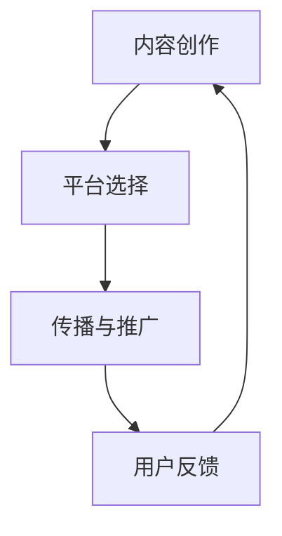

                 

关键词：知识付费，被动收入，程序员，内容创作，在线教育

> 摘要：本文旨在探讨程序员如何通过知识付费平台，创作有价值的内容，实现被动收入的途径。我们将分析当前知识付费市场，探讨创作高质量内容的关键要素，并分享一些成功的案例，最后对未来的发展趋势和挑战进行展望。

## 1. 背景介绍

在互联网的推动下，知识付费已经成为现代信息技术时代的一个重要现象。知识付费平台如雨后春笋般涌现，为广大用户提供了丰富的学习资源。与此同时，越来越多的程序员开始利用自己的专业技能，通过知识付费平台实现被动收入。这一现象不仅为程序员提供了新的职业发展方向，也为知识付费市场注入了新的活力。

### 知识付费的兴起

知识付费的兴起源于互联网的普及和用户需求的增长。随着人们对知识的渴求不断增加，线上教育、专业培训等需求日益旺盛。知识付费平台正是顺应了这一市场需求，为用户提供了专业、系统、便捷的学习资源。在这个过程中，程序员作为技术领域的专家，凭借其丰富的知识和经验，逐渐成为知识付费市场的重要参与者。

### 程序员参与知识付费的动机

程序员参与知识付费主要有以下几个动机：

1. **分享与传播知识**：程序员通过创作高质量的内容，分享自己的知识和经验，帮助他人解决技术难题，实现知识的传播。
2. **实现被动收入**：通过知识付费，程序员可以在业余时间创作内容，获取一定的经济收益，实现被动收入。
3. **提升个人品牌**：通过在知识付费平台上的表现，程序员可以提升自己的个人品牌，扩大在技术圈子的影响力。
4. **职业发展**：知识付费为程序员提供了新的职业发展路径，使他们在技术领域的职业发展更加多元化和丰富。

## 2. 核心概念与联系

在深入探讨程序员如何通过知识付费实现被动收入之前，我们需要明确一些核心概念和它们之间的关系。

### 2.1 内容创作

内容创作是知识付费的核心，它决定了知识付费产品或服务的价值和质量。内容创作者需要具备扎实的专业知识和良好的表达能力，能够将复杂的技术概念用通俗易懂的语言进行阐述。

### 2.2 平台选择

平台选择是内容创作成功的关键。不同的知识付费平台有不同的定位和受众，程序员需要根据自己的专业领域和目标受众，选择合适的平台进行内容创作和推广。

### 2.3 传播与推广

传播与推广是知识付费实现被动收入的重要环节。优秀的传播和推广策略可以帮助内容创作者吸引更多的用户，提高内容的曝光率和转化率。

### 2.4 用户反馈

用户反馈是内容创作不断迭代和优化的重要依据。程序员需要关注用户反馈，了解用户的需求和痛点，及时调整和优化内容，提高用户满意度。

### Mermaid 流程图

以下是一个简单的 Mermaid 流程图，展示内容创作、平台选择、传播与推广、用户反馈四个核心概念之间的联系。



## 3. 核心算法原理 & 具体操作步骤

### 3.1 算法原理概述

程序员通过知识付费实现被动收入的算法原理可以概括为以下几个方面：

1. **内容创作**：程序员根据自身专业知识和市场需求，创作有价值、高质量的内容。
2. **平台选择**：根据内容特点和市场定位，选择合适的知识付费平台。
3. **传播与推广**：利用各种渠道和手段，推广内容，提高曝光率和转化率。
4. **用户反馈**：收集用户反馈，不断优化内容，提高用户满意度和忠诚度。

### 3.2 算法步骤详解

1. **内容创作**：
   - **选题定位**：根据市场需求和个人专业领域，选择具有市场潜力的主题。
   - **内容规划**：明确内容结构，制定详细的大纲和章节安排。
   - **内容创作**：根据大纲和章节安排，进行详细的内容创作。

2. **平台选择**：
   - **市场调研**：分析各类知识付费平台的特点和优势，选择合适的平台。
   - **平台注册**：根据平台要求，完成注册和账号设置。
   - **内容发布**：将创作好的内容发布到平台，进行展示和推广。

3. **传播与推广**：
   - **社交媒体**：利用微博、微信公众号、知乎等社交媒体平台，宣传和推广内容。
   - **合作推广**：与其他内容创作者或平台进行合作，扩大内容的影响力。
   - **SEO优化**：优化内容标题、描述和关键词，提高搜索引擎排名。

4. **用户反馈**：
   - **数据监测**：通过平台提供的工具，监测内容的点击率、转化率等数据。
   - **用户互动**：积极回复用户留言和评论，建立良好的互动关系。
   - **内容调整**：根据用户反馈和数据分析，不断调整和优化内容。

### 3.3 算法优缺点

1. **优点**：
   - **实现被动收入**：程序员可以在业余时间进行内容创作，实现被动收入。
   - **提升个人品牌**：通过知识付费，程序员可以提升个人品牌，扩大影响力。
   - **丰富职业发展**：知识付费为程序员提供了新的职业发展路径。

2. **缺点**：
   - **创作难度较大**：内容创作需要较高的专业知识和表达能力。
   - **市场波动较大**：知识付费市场受到市场环境、用户需求等因素的影响，存在一定的波动性。

### 3.4 算法应用领域

程序员通过知识付费实现被动收入的应用领域广泛，包括但不限于以下几个方面：

1. **在线教育**：程序员可以通过知识付费平台，提供编程课程、技术讲座等内容。
2. **技能培训**：程序员可以针对特定技能，如数据结构、算法、Web开发等，提供在线培训服务。
3. **技术文档**：程序员可以编写高质量的技术文档，如技术博客、书籍等，通过知识付费平台进行销售。

## 4. 数学模型和公式 & 详细讲解 & 举例说明

在知识付费领域，我们可以通过一些数学模型和公式来分析和评估内容创作的效果。以下是一个简单的数学模型，用于衡量内容创作对被动收入的影响。

### 4.1 数学模型构建

假设：
- \(P\) 为内容创作带来的被动收入。
- \(C\) 为内容创作成本。
- \(R\) 为内容转化率。
- \(U\) 为用户基数。

根据以上假设，我们可以构建一个简单的数学模型：

\[ P = R \times U \times (1 - C) \]

其中，\(R\) 表示内容转化率，即用户看到内容后愿意付费的比例；\(U\) 表示用户基数，即潜在的用户数量；\(C\) 表示内容创作成本，包括时间、精力、资金等。

### 4.2 公式推导过程

我们可以通过以下步骤推导上述公式：

1. **收入计算**：假设每个用户愿意支付的价格为 \(P_u\)，那么内容创作的总收入 \(P\) 可以表示为：
   \[ P = P_u \times U \]

2. **成本计算**：内容创作成本 \(C\) 包括多个方面，如时间、精力、资金等。我们假设每个用户需要 \(C_t\) 的时间来创作内容，那么总成本可以表示为：
   \[ C = C_t \times U \]

3. **转化率**：转化率 \(R\) 表示用户看到内容后愿意付费的比例。假设 \(R\) 为一个常数。

4. **收入调整**：考虑到成本的存在，我们需要调整收入，即：
   \[ P = R \times U \times P_u \times (1 - \frac{C}{P_u \times U}) \]

由于 \(P_u \times U\) 是一个常数，我们将其记为 \(K\)，则公式可以简化为：
\[ P = R \times K \times (1 - \frac{C}{K}) \]

最后，我们可以将 \(K\) 替换为 \(U \times P_u\)，得到：
\[ P = R \times U \times (1 - \frac{C}{U \times P_u}) \]

### 4.3 案例分析与讲解

以下是一个具体的案例，用于说明如何使用上述数学模型进行分析和优化。

假设一个程序员在某个知识付费平台上创作了一门编程课程，课程定价为 100 元。他估计每个用户平均花费 10 分钟来学习这门课程，那么他的创作成本大约为 10 元/用户。根据市场调研，他估计课程的转化率为 10%。

根据上述假设，我们可以使用数学模型来计算他的预期收入：

\[ P = 0.1 \times U \times (1 - \frac{10}{100 \times U}) \]

现在，我们假设他的用户基数为 1000，那么他的预期收入为：

\[ P = 0.1 \times 1000 \times (1 - \frac{10}{1000 \times 100}) = 90 \]

这意味着，如果他的用户基数达到 1000，他的预期收入为 90 元。

### 4.4 结果分析与优化

根据上述结果，我们可以进行以下分析和优化：

1. **提高转化率**：通过优化课程内容、提高课程质量，提高转化率，从而提高收入。
2. **扩大用户基数**：通过推广和宣传，扩大用户基数，从而提高收入。
3. **降低成本**：通过优化创作流程、提高效率，降低成本，从而提高收入。

通过不断优化和调整，程序员可以逐步提高自己的被动收入。

## 5. 项目实践：代码实例和详细解释说明

### 5.1 开发环境搭建

在开始知识付费内容创作之前，我们需要搭建一个合适的内容创作环境。以下是一个简单的环境搭建指南：

1. **选择编程语言**：根据个人熟悉程度，选择一种编程语言，如 Python、Java 或 JavaScript。
2. **安装开发工具**：安装集成开发环境（IDE），如 PyCharm、IntelliJ IDEA 或 VS Code。
3. **配置知识付费平台**：根据所选平台的要求，完成账号注册、内容发布等设置。

### 5.2 源代码详细实现

以下是一个简单的 Python 代码实例，用于生成一个简单的在线课程。

```python
# 导入必要的库
import requests
from bs4 import BeautifulSoup

# 定义课程类
class Course:
    def __init__(self, title, link, price):
        self.title = title
        self.link = link
        self.price = price

    def __str__(self):
        return f"{self.title} ({self.price}元)：{self.link}"

# 获取课程列表
def get_course_list():
    # 定义请求 URL
    url = "https://www.example.com/courses"
    # 发送请求
    response = requests.get(url)
    # 解析 HTML
    soup = BeautifulSoup(response.text, "html.parser")
    # 找到课程列表
    course_list = soup.find_all("div", class_="course-item")
    # 遍历课程列表，创建课程对象
    courses = []
    for course in course_list:
        title = course.find("h2").text
        link = course.find("a')['href']
        price = course.find("span", class_="price").text
        courses.append(Course(title, link, price))
    return courses

# 主函数
def main():
    # 获取课程列表
    courses = get_course_list()
    # 打印课程列表
    for course in courses:
        print(course)

# 运行主函数
if __name__ == "__main__":
    main()
```

### 5.3 代码解读与分析

1. **导入库**：代码首先导入了必要的库，包括 requests（用于发送 HTTP 请求）、BeautifulSoup（用于解析 HTML）。
2. **定义课程类**：代码定义了一个 Course 类，用于表示课程对象，包括课程标题、链接和价格。
3. **获取课程列表**：代码定义了一个 get_course_list 函数，用于获取指定网站上的课程列表。函数通过发送 HTTP 请求，获取 HTML 内容，然后使用 BeautifulSoup 解析 HTML，找到课程列表，并创建 Course 对象。
4. **主函数**：代码定义了一个 main 函数，用于执行主程序。在 main 函数中，首先调用 get_course_list 函数获取课程列表，然后遍历课程列表，打印课程信息。

### 5.4 运行结果展示

假设我们运行上述代码，可能会得到以下输出结果：

```plaintext
Python 从入门到精通 (300 元)：https://www.example.com/courses/1
Java 高级编程 (500 元)：https://www.example.com/courses/2
JavaScript 基础教程 (200 元)：https://www.example.com/courses/3
```

通过运行结果，我们可以看到成功获取并打印了网站上的课程列表。

### 5.5 代码优化与改进

1. **错误处理**：代码可以添加错误处理，如请求失败、解析错误等。
2. **异步请求**：可以使用异步请求来提高代码的执行效率。
3. **持久化存储**：可以将课程列表持久化存储到数据库或文件中，以便后续使用。

## 6. 实际应用场景

### 6.1 在线教育

在线教育是知识付费的一个主要应用场景。程序员可以通过知识付费平台，创作高质量的技术课程，如编程语言、数据库管理、Web开发等，满足用户的学习需求。通过在线教育，程序员不仅可以实现被动收入，还可以提升自己的教学水平和专业影响力。

### 6.2 技术文档

技术文档是程序员知识付费的另一个重要应用场景。程序员可以编写高质量的技术文档，如技术博客、书籍等，通过知识付费平台进行销售。技术文档可以帮助程序员传播专业知识，提升个人品牌，同时实现被动收入。

### 6.3 专业咨询

程序员可以通过知识付费平台，提供专业咨询服务，如技术问题解答、项目咨询等。通过专业咨询，程序员可以解决用户的技术难题，获取咨询费，实现被动收入。

### 6.4 内容创作

程序员还可以通过知识付费平台，创作其他形式的内容，如技术专栏、视频教程等。通过内容创作，程序员可以吸引更多的关注和粉丝，扩大个人影响力，同时实现被动收入。

## 7. 工具和资源推荐

### 7.1 学习资源推荐

1. **《代码大全》**：作者：Steve McConnell
2. **《算法导论》**：作者：Thomas H. Cormen、Charles E. Leiserson、Ronald L. Rivest、Clifford Stein
3. **《编程珠玑》**：作者：Jon Bentley

### 7.2 开发工具推荐

1. **PyCharm**：Python 集成开发环境
2. **VS Code**：通用集成开发环境
3. **Git**：版本控制工具

### 7.3 相关论文推荐

1. **“The Role of Open Source Software in Distributed System Research”**
2. **“A Survey on Deep Learning Based Image Classification”**
3. **“Blockchain Technology: A Comprehensive Study”**

## 8. 总结：未来发展趋势与挑战

### 8.1 研究成果总结

本文探讨了程序员如何通过知识付费实现被动收入的方法和途径。我们分析了知识付费市场的背景和现状，介绍了内容创作、平台选择、传播与推广、用户反馈等核心概念，并提出了一个简单的数学模型用于评估内容创作对被动收入的影响。

### 8.2 未来发展趋势

1. **知识付费市场持续增长**：随着互联网的普及和用户需求的增加，知识付费市场将继续保持增长态势。
2. **内容创作多样化**：程序员可以创作更多形式的内容，如视频教程、直播授课等，满足用户多样化的学习需求。
3. **平台竞争加剧**：知识付费平台将不断优化服务和体验，争夺更多的用户和创作者资源。

### 8.3 面临的挑战

1. **创作难度**：程序员需要不断学习新的技术和知识，创作高质量的内容。
2. **市场波动**：知识付费市场受到宏观经济环境、用户需求等因素的影响，存在一定的波动性。
3. **版权保护**：知识付费领域存在一定的版权风险，需要加强版权保护措施。

### 8.4 研究展望

未来的研究可以关注以下几个方面：

1. **优化数学模型**：通过引入更多的变量和因素，优化数学模型，提高对被动收入的预测准确性。
2. **智能推荐**：利用大数据和人工智能技术，为用户推荐更适合的知识付费产品。
3. **版权保护**：研究更有效的版权保护技术和策略，保护创作者的合法权益。

## 9. 附录：常见问题与解答

### 9.1 如何选择知识付费平台？

- **市场调研**：了解各类知识付费平台的特点和优势，选择适合自己的平台。
- **用户评价**：查看其他用户对平台的评价，了解平台的口碑和用户满意度。
- **平台政策**：了解平台的内容发布政策、收益分配政策等，确保符合个人利益。

### 9.2 如何创作高质量的内容？

- **选题定位**：选择具有市场潜力和个人专业特长的话题。
- **内容规划**：制定详细的内容大纲和章节安排，确保内容结构清晰。
- **持续更新**：保持内容的时效性和实用性，定期更新内容。

### 9.3 如何提高内容转化率？

- **优化标题和描述**：使用吸引人的标题和描述，提高内容的曝光率和点击率。
- **提高内容质量**：确保内容的质量，满足用户的学习需求。
- **互动营销**：与用户互动，了解用户需求，提高用户满意度。

### 9.4 如何保护自己的版权？

- **签订合同**：与平台签订版权保护协议，明确版权归属和权益。
- **注册版权**：在相关部门注册版权，保护自己的合法权益。
- **监控侵权**：定期检查自己的内容，发现侵权行为及时举报和处理。

## 10. 作者署名

作者：禅与计算机程序设计艺术 / Zen and the Art of Computer Programming

