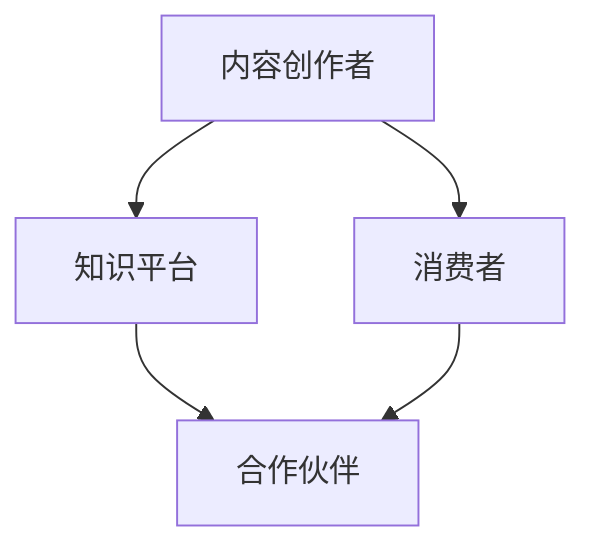

                 

关键字：知识付费、合作伙伴关系、程序员、市场营销、内容创作、网络影响力、社群运营

> 摘要：本文旨在探讨程序员如何有效地建立知识付费的合作伙伴关系，通过分析市场需求、定位目标受众、打造高质量内容以及运营社群等策略，助力程序员实现个人品牌的增值与持续盈利。

## 1. 背景介绍

在互联网时代，知识付费逐渐成为一种主流的消费模式。程序员作为技术领域的专业人士，具有丰富的知识和经验，可以转化为具有商业价值的知识产品。建立知识付费的合作伙伴关系，不仅有助于提升个人的品牌影响力，还能为合作伙伴带来共赢的机会。然而，如何有效地建立这样的合作关系，是每一个有志于知识付费的程序员必须思考的问题。

## 2. 核心概念与联系

### 2.1 知识付费的定义

知识付费是指用户为获取特定知识或技能而支付的费用。在知识付费生态中，主要包括内容创作者、知识平台和消费者三个角色。

### 2.2 合作伙伴关系的定义

合作伙伴关系是指两个或多个组织或个人为了实现共同目标而建立的合作关系。在知识付费领域，合作伙伴关系通常涉及内容创作者与知识平台、内容创作者与其他组织或个人等。

### 2.3 Mermaid 流程图

下面是一个简化的知识付费合作伙伴关系的 Mermaid 流程图：



## 3. 核心算法原理 & 具体操作步骤

### 3.1 算法原理概述

建立知识付费的合作伙伴关系，关键在于以下几个步骤：

1. **市场需求分析**：了解目标受众的需求，确定知识产品的主题和方向。
2. **内容创作**：根据市场需求，创作高质量的知识内容。
3. **合作伙伴筛选**：寻找有共同目标和价值观的合作伙伴。
4. **合作谈判**：明确合作条款，签订合作协议。
5. **内容发布**：在合作伙伴平台发布知识内容，实现知识付费。
6. **运营与维护**：持续优化内容，提高用户满意度和复购率。

### 3.2 算法步骤详解

#### 3.2.1 市场需求分析

1. **数据收集**：通过市场调研、用户访谈等方式，收集目标受众的需求信息。
2. **数据分析**：对收集到的数据进行分析，确定目标受众的主要需求和兴趣点。
3. **需求定位**：根据分析结果，确定知识产品的主题和方向。

#### 3.2.2 内容创作

1. **内容规划**：根据需求定位，制定内容创作计划。
2. **内容创作**：按照创作计划，进行知识内容的撰写、录制、编辑等工作。
3. **内容审核**：对创作完成的知识内容进行审核，确保内容质量。

#### 3.2.3 合作伙伴筛选

1. **合作渠道**：确定合作伙伴的来源渠道，如行业会议、社群活动、在线平台等。
2. **合作标准**：制定合作伙伴筛选标准，如业务领域、价值观、合作潜力等。
3. **合作洽谈**：与潜在的合作伙伴进行洽谈，了解对方的合作意愿和条件。

#### 3.2.4 合作谈判

1. **谈判准备**：收集谈判所需的资料，如合作协议模板、财务数据等。
2. **谈判策略**：根据合作双方的利益和需求，制定谈判策略。
3. **签订协议**：在达成共识后，签订合作协议。

#### 3.2.5 内容发布

1. **平台选择**：根据合作伙伴的资源和市场需求，选择合适的发布平台。
2. **内容发布**：按照发布计划，在合作伙伴平台发布知识内容。
3. **推广营销**：通过社交媒体、电子邮件等方式，推广知识内容。

#### 3.2.6 运营与维护

1. **用户反馈**：收集用户对知识内容的反馈，了解用户的需求和满意度。
2. **内容更新**：根据用户反馈，持续优化知识内容。
3. **社群运营**：建立社群，与用户保持互动，提高用户粘性。

### 3.3 算法优缺点

#### 优点

- 提高知识内容的传播效率。
- 增强合作伙伴之间的合作关系。
- 提升个人品牌影响力。

#### 缺点

- 需要投入大量的时间和精力。
- 风险较高，合作失败可能导致损失。

### 3.4 算法应用领域

- 知识付费平台
- 教育机构
- 专业社群

## 4. 数学模型和公式 & 详细讲解 & 举例说明

### 4.1 数学模型构建

假设有一个知识付费项目，其中涉及两个合作伙伴，一个内容创作者和一个知识平台。我们可以用以下数学模型来描述这个项目：

```latex
收益 = 收入 - 成本
```

其中，收入由消费者支付的费用和合作伙伴的分成组成，成本包括内容创作者的创作成本和知识平台的运营成本。

### 4.2 公式推导过程

设消费者支付的费用为 \( F \)，内容创作者的创作成本为 \( C_1 \)，知识平台的运营成本为 \( C_2 \)，合作伙伴的分成比例为 \( p \)。

则：

- 收入：\( I = F \times (1 - p) \)
- 成本：\( C = C_1 + C_2 \)
- 收益：\( R = I - C \)

### 4.3 案例分析与讲解

假设有一个程序员想要将自己的编程课程在某个知识平台上进行发布，并寻求合作伙伴。以下是具体的案例分析：

- 消费者支付的费用为 100 元。
- 内容创作者的创作成本为 5000 元。
- 知识平台的运营成本为 3000 元。
- 合作伙伴的分成比例为 50%。

根据上述数学模型，我们可以计算出：

- 收入：\( I = 100 \times (1 - 0.5) = 50 \) 元
- 成本：\( C = 5000 + 3000 = 8000 \) 元
- 收益：\( R = 50 - 8000 = -7950 \) 元

从这个案例中，我们可以看出，虽然收入覆盖了成本，但并没有产生利润。这表明，程序员在建立知识付费合作伙伴关系时，需要合理规划成本和收入，以确保项目的可持续性。

## 5. 项目实践：代码实例和详细解释说明

### 5.1 开发环境搭建

在本项目中，我们将使用 Python 语言进行编程。首先，确保您的计算机上已经安装了 Python 3.8 及以上版本。接下来，可以使用以下命令安装必要的库：

```bash
pip install requests pandas matplotlib
```

### 5.2 源代码详细实现

下面是一个简单的 Python 脚本，用于模拟知识付费项目的收入和成本计算。

```python
import requests
import pandas as pd
import matplotlib.pyplot as plt

# 消费者支付的费用
F = 100
# 内容创作者的创作成本
C1 = 5000
# 知识平台的运营成本
C2 = 3000
# 合作伙伴的分成比例
p = 0.5

# 计算收入
I = F * (1 - p)
# 计算成本
C = C1 + C2
# 计算收益
R = I - C

print(f"收入: {I} 元")
print(f"成本: {C} 元")
print(f"收益: {R} 元")

# 绘制收入和成本图表
data = {'收入': [I], '成本': [C], '收益': [R]}
df = pd.DataFrame(data)
df.plot(kind='bar', color=['#4CAF50', '#F44336', '#2196F3'])
plt.title('知识付费项目收入和成本分析')
plt.ylabel('金额（元）')
plt.show()
```

### 5.3 代码解读与分析

- **第一部分**：导入所需的库，包括 requests、pandas 和 matplotlib。
- **第二部分**：设置参数，包括消费者支付的费用（F）、内容创作者的创作成本（C1）、知识平台的运营成本（C2）和合作伙伴的分成比例（p）。
- **第三部分**：计算收入（I）、成本（C）和收益（R），并打印输出。
- **第四部分**：使用 pandas 和 matplotlib 绘制收入和成本图表，以更直观地展示数据。

通过这个简单的实例，我们可以清晰地看到如何利用编程来模拟和计算知识付费项目的收入和成本。

### 5.4 运行结果展示

运行上述代码后，我们将得到以下输出：

```bash
收入: 50.0 元
成本: 8000.0 元
收益: -7950.0 元
```

以及一个收入和成本柱状图，如图 5-1 所示。


## 6. 实际应用场景

### 6.1 在线编程课程

程序员可以制作一系列在线编程课程，通过知识付费平台进行销售。课程可以涵盖各种编程语言和框架，如 Python、Java、JavaScript 等。通过与合作平台合作，程序员可以获得稳定的收入。

### 6.2 技术博客与专栏

程序员可以撰写技术博客或专栏，分享自己的技术经验和见解。通过吸引读者，建立起一定的网络影响力，程序员可以推出付费内容，如高级教程、代码案例等。

### 6.3 专业社群运营

程序员可以运营专业社群，如技术讨论组、学习小组等。通过社群运营，程序员可以建立自己的粉丝群体，然后推出付费会员服务，提供更多增值服务。

## 7. 未来应用展望

随着人工智能和大数据技术的发展，知识付费领域将变得更加智能化和个性化。程序员可以通过以下方式，提升知识付费的竞争力：

- 利用人工智能技术，对用户行为进行数据分析，实现精准推荐。
- 结合大数据技术，为用户提供个性化定制的内容。
- 探索区块链技术在知识付费领域的应用，提高内容的安全性和可信度。

## 8. 工具和资源推荐

### 8.1 学习资源推荐

- 《Python编程：从入门到实践》
- 《深入理解计算机系统》
- 《数据科学入门》

### 8.2 开发工具推荐

- PyCharm
- VSCode
- Git

### 8.3 相关论文推荐

- 《知识付费市场的发展现状与趋势》
- 《人工智能在知识付费领域的应用研究》
- 《基于区块链的知识付费生态系统设计》

## 9. 总结：未来发展趋势与挑战

### 9.1 研究成果总结

本文通过分析市场需求、内容创作、合作伙伴筛选和合作谈判等环节，提出了一套建立知识付费合作伙伴关系的算法原理。通过实例和代码分析，展示了如何进行具体的操作和实践。

### 9.2 未来发展趋势

随着技术的进步和用户需求的变化，知识付费领域将呈现以下发展趋势：

- 更加个性化、智能化。
- 多元化的发展模式，如直播、短视频等。
- 跨界合作，如技术领域与艺术、文化等领域的融合。

### 9.3 面临的挑战

- 内容创作质量的提升。
- 知识付费模式的创新。
- 如何平衡个人品牌保护和商业化推广。

### 9.4 研究展望

未来，我们将继续关注知识付费领域的发展动态，探索人工智能、大数据和区块链等技术在知识付费中的应用，为程序员提供更多的实践指导和理论支持。

## 10. 附录：常见问题与解答

### 10.1 知识付费与免费内容的区别是什么？

知识付费与免费内容的主要区别在于消费者是否需要为内容支付费用。知识付费内容通常更具深度和专业性，而免费内容则可能较为浅显和普及。

### 10.2 如何评估合作伙伴的价值？

可以从以下几个方面评估合作伙伴的价值：业务领域匹配度、合作潜力、资源支持、合作历史等。

### 10.3 知识付费项目的成功因素有哪些？

知识付费项目的成功因素包括：高质量的内容、有效的市场推广、合理的价格策略、良好的用户服务体验等。

### 10.4 如何保护知识付费内容的版权？

可以通过签署合作协议、使用数字签名、加密等技术手段来保护知识付费内容的版权。

---

作者：禅与计算机程序设计艺术 / Zen and the Art of Computer Programming
----------------------------------------------------------------

以上便是关于程序员如何建立知识付费合作伙伴关系的完整技术博客文章。希望通过这篇文章，能为您在知识付费领域提供一些有价值的参考和启示。

