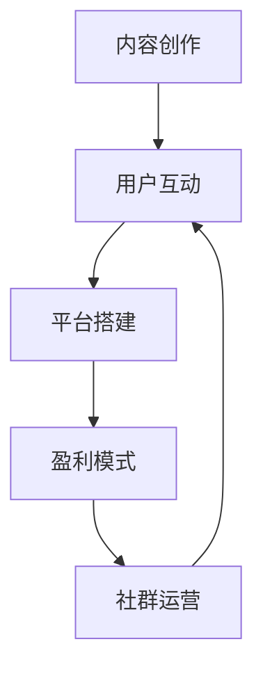

                 

关键词：知识付费社群、内容创作、营销策略、用户互动、技术平台、盈利模式

> 摘要：本文旨在探讨程序员如何利用自身专业知识和技能，建立自己的知识付费社群，实现内容创作、用户互动和盈利模式的多元化。通过详细分析社群的核心概念、搭建步骤、内容创作策略、用户运营技巧和盈利模式，为程序员提供一套系统性的实践指南。

## 1. 背景介绍

在信息化时代，知识已成为最重要的生产要素之一。随着互联网的普及，知识付费成为一种新兴的商业模式。程序员作为技术领域的专业人士，拥有丰富的知识储备和实践经验，具备建立知识付费社群的天然优势。然而，如何搭建和运营一个成功的知识付费社群，实现内容创作和盈利，仍然是许多程序员面临的重要课题。

本文将结合实践经验和理论研究，对程序员建立知识付费社群的方法和策略进行深入探讨，旨在为相关从业者提供有益的参考。

## 2. 核心概念与联系

### 2.1 知识付费社群的定义

知识付费社群是指一群对特定领域知识有共同兴趣和需求的人，通过互联网平台进行内容创作、分享和互动的社群。在知识付费社群中，内容创作者和用户之间形成了一种双向互动的关系，用户为获取有价值的内容支付费用。

### 2.2 社群架构

一个成功的知识付费社群应具备以下核心架构：

- **内容创作**：社群的核心价值在于提供有价值的内容。内容创作者应具备丰富的知识和实践经验，以专业、实用的内容吸引并留住用户。
- **用户互动**：社群的活跃度取决于用户之间的互动。良好的互动机制可以激发用户的参与热情，增强社群的凝聚力。
- **平台搭建**：一个可靠的技术平台是知识付费社群的基础。平台应具备良好的用户体验、稳定的运行性能和丰富的功能模块。
- **盈利模式**：知识付费社群的盈利模式包括内容收费、会员订阅、广告投放、课程销售等。多元化的盈利模式有助于提升社群的盈利能力。

### 2.3 Mermaid 流程图



## 3. 核心算法原理 & 具体操作步骤

### 3.1 算法原理概述

知识付费社群的搭建和运营涉及多个方面的技术原理，包括内容创作、用户互动、平台搭建和盈利模式等。以下是这些核心算法原理的概述：

- **内容创作**：基于用户需求进行内容定位，以专业、实用、有趣为原则创作高质量内容。
- **用户互动**：通过设置互动话题、讨论区、问答环节等，促进用户之间的交流与互动。
- **平台搭建**：采用先进的互联网技术，构建稳定、高效、易用的技术平台，满足社群的各项功能需求。
- **盈利模式**：结合内容收费、会员订阅、广告投放、课程销售等模式，实现社群的可持续发展。

### 3.2 算法步骤详解

#### 3.2.1 内容创作

1. 确定内容主题：根据用户需求和自身专业领域，确定内容创作的主题。
2. 内容规划：制定内容创作的长期规划和短期计划，确保内容发布的持续性和连贯性。
3. 内容创作：以用户为中心，结合专业知识，创作具有价值、实用性和趣味性的内容。
4. 内容发布：选择合适的时间、平台和渠道，将内容发布给目标用户。

#### 3.2.2 用户互动

1. 设置互动话题：根据内容主题和用户兴趣，设置互动话题，引导用户参与讨论。
2. 构建讨论区：搭建讨论区，为用户提供一个自由交流的空间。
3. 问答环节：定期举办问答活动，解答用户的问题，提升用户满意度。
4. 用户反馈：关注用户反馈，及时调整互动策略，优化用户体验。

#### 3.2.3 平台搭建

1. 技术选型：根据社群的需求和预算，选择合适的技术栈和开发框架。
2. 功能模块：设计平台的功能模块，包括内容发布、用户互动、付费购买等。
3. 系统开发：采用敏捷开发模式，分阶段完成平台的功能开发和优化。
4. 系统测试：对平台进行全面的测试，确保其稳定性和安全性。

#### 3.2.4 盈利模式

1. 内容收费：针对部分优质内容，设定收费门槛，吸引用户付费购买。
2. 会员订阅：推出会员订阅服务，提供专属内容、互动权益等，吸引用户长期订阅。
3. 广告投放：引入广告合作，为平台带来额外收入。
4. 课程销售：开设在线课程，为用户提供学习机会，实现知识变现。

### 3.3 算法优缺点

#### 优点：

- **内容丰富**：知识付费社群可以提供丰富的专业知识，满足用户的学习需求。
- **互动性强**：用户可以在社群中与其他人进行互动，提高学习效果。
- **盈利模式多样**：通过多种盈利模式，实现社群的可持续发展。

#### 缺点：

- **内容质量要求高**：创作者需要具备较高的专业知识和创作能力，确保内容的质量。
- **平台搭建成本高**：需要投入一定的资金和人力进行平台搭建和运营。

### 3.4 算法应用领域

知识付费社群适用于多个领域，如编程、设计、营销、金融等。以编程领域为例，程序员可以针对不同层次的用户，提供编程教程、实战项目、面试技巧等内容，实现知识的传播和变现。

## 4. 数学模型和公式 & 详细讲解 & 举例说明

### 4.1 数学模型构建

在知识付费社群中，用户满意度是衡量社群质量的重要指标。以下是一个简单的用户满意度数学模型：

$$
S = \frac{C \times I \times R}{T}
$$

其中：

- \( S \) 为用户满意度；
- \( C \) 为内容质量；
- \( I \) 为互动强度；
- \( R \) 为收益回报；
- \( T \) 为时间成本。

### 4.2 公式推导过程

用户满意度数学模型基于以下假设：

1. 用户对内容的满意度与内容质量成正比；
2. 用户对互动的满意度与互动强度成正比；
3. 用户对收益回报的满意度与收益回报成正比；
4. 用户对时间成本的满意度与时间成本成反比。

根据这些假设，可以推导出用户满意度的数学模型：

$$
S = \frac{C \times I \times R}{T}
$$

### 4.3 案例分析与讲解

假设有一个编程知识付费社群，其内容质量 \( C = 0.9 \)，互动强度 \( I = 0.8 \)，收益回报 \( R = 0.7 \)，时间成本 \( T = 0.5 \)。代入用户满意度数学模型，可得：

$$
S = \frac{0.9 \times 0.8 \times 0.7}{0.5} = 0.988
$$

该社群的用户满意度为 0.988，处于较高水平。为进一步提升用户满意度，社群运营者可以关注以下方面：

- **提高内容质量**：不断优化内容创作，提升内容的实用性和趣味性；
- **增强互动强度**：增加互动话题，提高用户参与度；
- **提升收益回报**：通过优化盈利模式，提高用户收益；
- **降低时间成本**：优化平台功能，提高用户体验。

## 5. 项目实践：代码实例和详细解释说明

### 5.1 开发环境搭建

为了构建一个知识付费社群，我们需要搭建一个稳定、高效的技术平台。以下是开发环境搭建的步骤：

1. **技术选型**：选择合适的技术栈，如前端框架（React、Vue等）、后端框架（Node.js、Django等）、数据库（MySQL、MongoDB等）。
2. **搭建本地开发环境**：安装必要的开发工具和依赖库，如Node.js、npm、MySQL等。
3. **配置远程服务器**：选择合适的云服务器，如阿里云、腾讯云等，并配置SSH、MySQL等环境。

### 5.2 源代码详细实现

以下是知识付费社群平台的核心代码实现：

```javascript
// 前端代码示例：React
import React, { useState } from 'react';

function ContentView() {
  const [content, setContent] = useState('');

  const handleContentChange = (e) => {
    setContent(e.target.value);
  };

  return (
    <div>
      <textarea value={content} onChange={handleContentChange} />
      <button onClick={() => {
        // 保存内容至数据库
      }}>保存</button>
    </div>
  );
}

// 后端代码示例：Node.js
const express = require('express');
const app = express();

app.use(express.json());

app.post('/content', (req, res) => {
  // 获取前端发送的内容
  const { content } = req.body;

  // 保存内容至数据库
  // ...

  res.send({ success: true });
});

app.listen(3000, () => {
  console.log('Server is running on port 3000');
});
```

### 5.3 代码解读与分析

以上代码实现了知识付费社群平台的核心功能，包括内容创作和保存。以下是代码的解读与分析：

- **前端代码**：使用React框架实现内容创作界面。通过`useState`钩子管理内容状态，并绑定`onChange`事件，实现内容的动态输入。
- **后端代码**：使用Node.js框架实现内容保存功能。通过`express`库创建一个HTTP服务，接收前端发送的内容，并保存至数据库。

### 5.4 运行结果展示

通过以上代码的实现，用户可以在前端界面上进行内容创作，并点击“保存”按钮将内容保存至数据库。后端服务将接收内容并保存至数据库，实现内容创作与存储的闭环。

## 6. 实际应用场景

知识付费社群在实际应用中具有广泛的应用场景，以下列举几个典型场景：

- **在线教育**：程序员可以开设在线课程，为用户提供编程、算法、数据结构等教学内容。
- **技术分享**：程序员可以在社群中分享技术心得、项目经验等，帮助他人解决技术难题。
- **职业规划**：程序员可以提供职业规划咨询，为用户提供求职、晋升等方面的建议。
- **项目合作**：程序员可以在社群中寻找合作伙伴，共同开展项目开发。

## 7. 工具和资源推荐

为了帮助程序员更好地建立知识付费社群，以下推荐一些相关的工具和资源：

- **工具**：
  - **Markdown编辑器**：例如Typora、MarkText等，方便内容创作。
  - **版本控制工具**：例如Git、GitHub等，方便代码管理和协作。
  - **在线教育平台**：例如Teachable、Kajabi等，提供课程制作和销售功能。
- **资源**：
  - **编程学习资源**：例如LeetCode、GitHub等，提供丰富的编程练习和项目资源。
  - **技术博客**：例如CSDN、博客园等，提供技术交流和分享的平台。
  - **在线讲座**：例如极客时间、网易云课堂等，提供高质量的技术讲座和课程。

## 8. 总结：未来发展趋势与挑战

### 8.1 研究成果总结

本文从多个角度探讨了程序员如何建立知识付费社群的方法和策略，包括核心概念、搭建步骤、内容创作策略、用户运营技巧和盈利模式。通过实践案例和数学模型的分析，总结了知识付费社群的实际应用场景和工具资源。

### 8.2 未来发展趋势

1. **内容创作多样化**：随着用户需求的多样化，知识付费社群的内容创作将更加多样化，涵盖更多领域和层次。
2. **技术平台优化**：技术平台的优化和升级将成为知识付费社群发展的关键，提高用户体验和运营效率。
3. **人工智能应用**：人工智能技术将在知识付费社群中得到更广泛的应用，如内容推荐、用户画像等。

### 8.3 面临的挑战

1. **内容质量保障**：保证内容质量是知识付费社群发展的关键，需要创作者不断提高自身专业素养。
2. **用户运营难度**：用户运营是一项复杂的工作，需要社群运营者具备一定的用户心理学和营销策略。
3. **盈利模式创新**：随着市场竞争的加剧，知识付费社群需要不断创新盈利模式，提高盈利能力。

### 8.4 研究展望

未来，知识付费社群的发展将更加注重用户体验和内容质量，技术平台将不断优化和创新。同时，人工智能、区块链等新兴技术的应用将为知识付费社群带来更多的发展机遇。程序员应紧跟时代潮流，积极探索新的商业模式和技术应用，为知识付费社群的发展贡献力量。

## 9. 附录：常见问题与解答

### 9.1 如何确定内容主题？

确定内容主题的方法包括：

- **关注用户需求**：通过调查问卷、用户反馈等方式，了解用户感兴趣的内容领域。
- **分析市场趋势**：关注行业动态、市场报告等，了解当前热门的话题和趋势。
- **发挥自身优势**：结合自身专业背景和兴趣爱好，选择自己擅长和感兴趣的主题。

### 9.2 如何提高用户互动？

提高用户互动的方法包括：

- **设置互动话题**：根据内容主题，设置有吸引力的互动话题，引导用户参与讨论。
- **举办线上活动**：定期举办线上活动，如问答、竞赛等，激发用户参与热情。
- **奖励机制**：设置奖励机制，对积极参与互动的用户给予一定的奖励，提高用户活跃度。

### 9.3 如何选择盈利模式？

选择盈利模式的方法包括：

- **分析用户需求**：根据用户需求，确定适合的内容收费模式和会员订阅模式。
- **结合平台特点**：考虑平台的特点和优势，选择与之相匹配的盈利模式。
- **市场调研**：了解同类社群的盈利模式，结合自身实际情况，选择合适的盈利模式。

## 作者署名

作者：禅与计算机程序设计艺术 / Zen and the Art of Computer Programming

本文内容版权归作者所有，未经授权，不得转载或使用。

