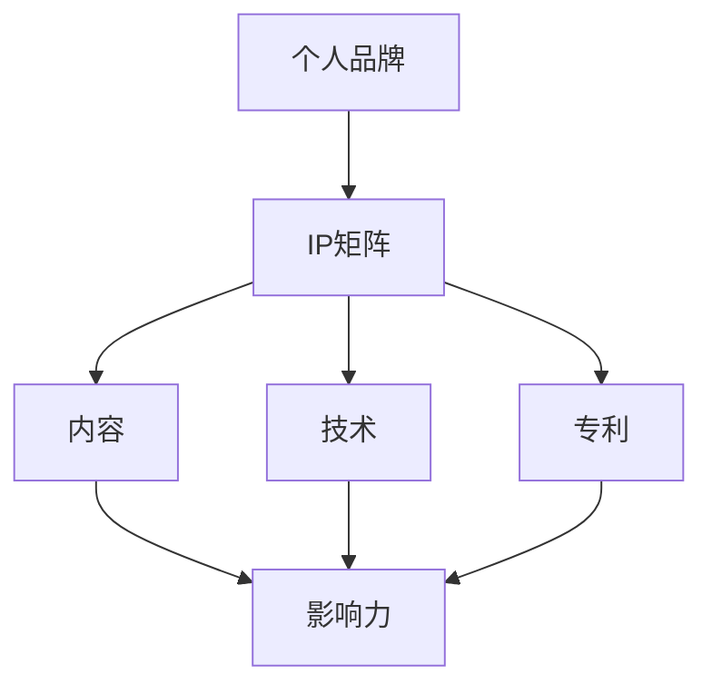

                 

关键词：个人品牌建设、IP矩阵、影响力拓展、内容创造、社交媒体、算法、技术演讲、技术写作

> 摘要：在数字化时代，个人品牌建设成为程序员职业发展的重要方向。本文将探讨如何通过构建个人IP矩阵，实现个人品牌的塑造与影响力拓展。内容将涵盖核心概念、算法原理、实践步骤、应用场景、数学模型、代码实例以及工具资源推荐，旨在为程序员提供一套系统的个人品牌建设指南。

## 1. 背景介绍

随着互联网的普及和信息爆炸，个人品牌建设成为个体在职场和生活中脱颖而出的关键。程序员作为技术领域的专业人才，同样需要通过个人IP矩阵来展示专业能力，提升个人影响力，从而实现职业价值的最大化。本文将围绕以下几个核心问题展开：

- 个人IP矩阵是什么？
- 程序员如何构建个人IP矩阵？
- 个人IP矩阵如何助力职业发展？

## 2. 核心概念与联系

为了构建个人IP矩阵，我们需要理解以下几个核心概念：

- **个人品牌**：个人品牌是个人在职场和社会中的形象代表，是专业能力、价值观和个性的综合体现。
- **IP矩阵**：IP矩阵是指围绕个人品牌的一系列知识产权，包括内容、技术、专利等。
- **影响力**：影响力是个人通过内容传播、社交互动等手段影响他人观念和行为的能力。

以下是一个简化的Mermaid流程图，展示了个人IP矩阵的核心概念与联系：



## 3. 核心算法原理 & 具体操作步骤

### 3.1 算法原理概述

构建个人IP矩阵的算法可以概括为以下几个步骤：

1. **定位**：明确个人品牌的核心价值定位。
2. **内容创造**：围绕定位创作有价值的内容。
3. **渠道拓展**：选择合适的渠道进行内容传播。
4. **互动反馈**：通过用户互动获取反馈，持续优化内容。

### 3.2 算法步骤详解

#### 3.2.1 定位

定位是构建个人IP矩阵的第一步。定位需要回答以下问题：

- 你是谁？
- 你擅长什么？
- 你的目标受众是谁？
- 你的独特价值是什么？

#### 3.2.2 内容创造

内容创造是个人IP矩阵的核心。内容可以包括技术博客、技术演讲、开源项目等。以下是一些内容创造的建议：

- **技术博客**：分享技术见解、实战经验和学习笔记。
- **技术演讲**：在技术会议、在线讲座中展示专业能力。
- **开源项目**：参与或创建开源项目，提升项目知名度。

#### 3.2.3 渠道拓展

选择合适的渠道进行内容传播至关重要。以下是一些常见的渠道：

- **社交媒体**：如微博、微信公众号、Twitter等。
- **技术社区**：如GitHub、Stack Overflow等。
- **博客平台**：如简书、CSDN等。
- **直播平台**：如B站、斗鱼等。

#### 3.2.4 互动反馈

通过用户互动获取反馈是持续优化内容的关键。以下是一些互动反馈的建议：

- **评论互动**：积极回复读者评论，建立良好互动关系。
- **问卷调查**：通过问卷调查了解用户需求，调整内容方向。
- **社区活动**：举办技术沙龙、线上讨论会等，促进用户参与。

### 3.3 算法优缺点

**优点**：

- 提升个人品牌知名度。
- 增强职业竞争力。
- 拓展职业发展机会。

**缺点**：

- 需要时间和精力投入。
- 初始阶段可能面临挑战。

### 3.4 算法应用领域

算法可以广泛应用于程序员个人品牌建设，如：

- **技术写作**：通过技术博客分享知识。
- **技术演讲**：在技术会议上展示专业能力。
- **开源项目**：通过开源代码提升项目影响力。
- **社交媒体**：通过互动增强个人影响力。

## 4. 数学模型和公式

### 4.1 数学模型构建

构建个人IP矩阵的数学模型可以表示为：

$$
IP_{matrix} = f(branding, content, channels, feedback)
$$

其中：

- $IP_{matrix}$：个人IP矩阵。
- $branding$：个人品牌。
- $content$：内容。
- $channels$：渠道。
- $feedback$：反馈。

### 4.2 公式推导过程

$$
f(branding, content, channels, feedback) = \frac{branding \times content \times channels \times feedback}{time}
$$

其中：

- $time$：构建IP矩阵的时间投入。

### 4.3 案例分析与讲解

以下是一个简单的案例：

假设程序员A想要构建个人IP矩阵，他确定了以下定位：

- **品牌**：擅长Web开发。
- **内容**：技术博客、技术演讲、开源项目。
- **渠道**：社交媒体、技术社区、博客平台。
- **反馈**：积极回复读者评论。

根据上述公式，我们可以计算出A的个人IP矩阵：

$$
IP_{matrix} = \frac{Web\ Development \times (Blog + Presentation + Open\ Source) \times (Social\ Media + Tech\ Community + Blog\ Platform) \times Feedback}{time}
$$

## 5. 项目实践：代码实例和详细解释说明

### 5.1 开发环境搭建

本案例使用Markdown语言编写技术博客，开发环境为Git Bash或Visual Studio Code。

### 5.2 源代码详细实现

以下是一个简单的Markdown文件，用于编写技术博客：

```markdown
# 程序员如何打造个人IP矩阵

## 1. 背景介绍

随着互联网的普及和信息爆炸，个人品牌建设成为程序员职业发展的重要方向。

## 2. 核心概念与联系

个人IP矩阵是指围绕个人品牌的一系列知识产权，包括内容、技术、专利等。

## 3. 核心算法原理

构建个人IP矩阵的算法包括定位、内容创造、渠道拓展和互动反馈。

## 4. 数学模型和公式

构建个人IP矩阵的数学模型为：

$$
IP_{matrix} = f(branding, content, channels, feedback)
$$

## 5. 项目实践

以下是一个简单的Markdown文件，用于编写技术博客：

```bash
git init
git add .
git commit -m "Initial commit"
git remote add origin https://github.com/username/your-ip-matrix.git
git push -u origin master
```

### 5.3 代码解读与分析

以上代码实现了Git版本控制和Markdown文件的编写，具体步骤如下：

1. 初始化Git仓库。
2. 添加Markdown文件。
3. 提交更改。
4. 将文件推送到GitHub仓库。

### 5.4 运行结果展示

运行以上代码后，Markdown文件将存储在GitHub仓库中，可供他人查看和下载。

## 6. 实际应用场景

### 6.1 技术博客

通过技术博客分享专业知识和经验，吸引关注者，建立个人品牌。

### 6.2 技术演讲

在技术会议上展示专业能力，拓展人脉，提升影响力。

### 6.3 开源项目

参与或创建开源项目，提升项目知名度，吸引更多开发者。

## 7. 未来应用展望

随着数字化时代的到来，个人品牌建设将成为程序员职业发展的重要方向。通过构建个人IP矩阵，程序员可以实现：

- 提升个人品牌知名度。
- 增强职业竞争力。
- 拓展职业发展机会。

## 8. 总结：未来发展趋势与挑战

### 8.1 研究成果总结

本文介绍了个人IP矩阵的概念、算法原理、构建步骤以及实际应用场景，为程序员提供了个人品牌建设的系统指南。

### 8.2 未来发展趋势

- 个人品牌建设将成为程序员职业发展的重点。
- 开源项目和社交媒体将成为个人IP矩阵的核心。
- 技术演讲和直播将成为拓展影响力的有效手段。

### 8.3 面临的挑战

- 需要持续投入时间和精力。
- 需要不断提升专业能力和影响力。
- 需要应对竞争激烈的市场环境。

### 8.4 研究展望

未来研究可以关注以下几个方面：

- 个人IP矩阵在职业规划中的应用。
- 个人品牌建设对职业发展的影响。
- 新技术对个人IP矩阵的影响。

## 9. 附录：常见问题与解答

### 9.1 如何确定个人品牌定位？

- 分析个人兴趣和优势。
- 调研市场需求和趋势。
- 确定个人独特的价值主张。

### 9.2 如何创作高质量内容？

- 确定内容主题和受众。
- 保持内容的专业性和原创性。
- 定期更新内容，保持活跃度。

### 9.3 如何拓展影响力？

- 通过社交媒体和社区互动。
- 参与技术演讲和研讨会。
- 创造优质内容，吸引粉丝和读者。

----------------------------------------------------------------

作者：禅与计算机程序设计艺术 / Zen and the Art of Computer Programming

