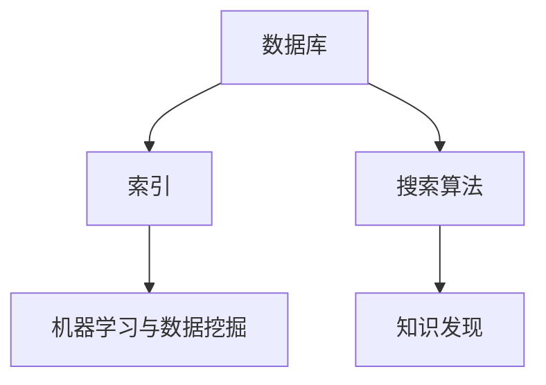

                 

在这个快速发展的数字时代，程序员不仅需要掌握编程语言和工具，还要学会如何高效地管理、发现和利用知识。构建个人知识发现引擎，就是在这个背景下应运而生的一项重要技能。本文将详细介绍如何从零开始，打造一个功能强大、易于扩展的个人知识发现引擎。

> 关键词：程序员，知识管理，知识发现引擎，算法，数学模型，项目实践，应用场景，工具推荐

> 摘要：本文将探讨程序员如何利用现代技术和算法，构建一个高效的个人知识发现引擎。我们将从背景介绍开始，逐步深入到核心概念、算法原理、数学模型、项目实践、实际应用场景以及未来展望等多个方面，为读者提供一个全面的技术指南。

## 1. 背景介绍

在当今的信息化社会中，数据爆炸式增长，知识的更新速度越来越快。程序员面临着巨大的知识管理和利用挑战。传统的搜索工具已经难以满足高效的知识发现需求。因此，构建一个个性化、智能化的知识发现引擎变得尤为重要。这不仅可以帮助程序员在短时间内快速定位所需知识，还能提高工作效率，激发创新思维。

### 1.1 知识管理的重要性

知识管理是指通过系统的方法和工具，对知识进行获取、组织、存储、共享、利用和创新的过程。对于一个程序员来说，良好的知识管理能力意味着能够更加高效地利用已有资源，快速掌握新技术，提高工作效率。

### 1.2 知识发现的挑战

知识发现是指从大量数据中自动识别出有价值的信息和知识。在程序员的工作中，知识发现的挑战主要在于：

- 数据量庞大，难以通过传统手段进行有效处理。
- 数据类型多样化，包括文本、图像、音频等多种格式。
- 知识更新速度快，需要实时更新知识库。

### 1.3 个人知识发现引擎的需求

构建个人知识发现引擎，可以满足程序员以下几个方面的需求：

- **个性化推荐**：根据程序员的兴趣、历史记录和需求，提供个性化的知识推荐。
- **高效检索**：利用先进的算法和索引技术，实现快速的知识检索。
- **知识整合**：将不同来源、不同格式的知识整合到一个统一的平台上。
- **智能化分析**：通过数据分析和机器学习技术，挖掘隐藏在数据中的价值信息。

## 2. 核心概念与联系

在构建个人知识发现引擎的过程中，我们需要理解以下几个核心概念：

### 2.1 数据库

数据库是存储和管理数据的系统。一个高效的知识发现引擎需要使用高性能的数据库来存储大量的知识数据。

### 2.2 索引

索引是数据库中用于快速检索数据的数据结构。在知识发现引擎中，索引技术至关重要，它能够显著提高数据的检索速度。

### 2.3 搜索算法

搜索算法是实现知识检索的核心。常见的搜索算法包括全文搜索、基于关键词的搜索和基于内容的搜索等。

### 2.4 机器学习与数据挖掘

机器学习与数据挖掘技术可以帮助我们自动识别数据中的模式和规律，从而实现智能化的知识发现。

下面是一个简单的 Mermaid 流程图，展示上述核心概念之间的关系：



## 3. 核心算法原理 & 具体操作步骤

### 3.1 算法原理概述

构建个人知识发现引擎的核心算法主要包括：

- **倒排索引**：倒排索引是一种高效的全文检索技术，它将文档中的词与文档的ID建立反向映射关系，从而实现快速的词汇搜索。
- **TF-IDF**：TF-IDF是一种基于统计学的文本分析技术，通过计算关键词在文档中的重要程度，实现文本相似度的度量。
- **机器学习模型**：常见的机器学习模型包括K最近邻（KNN）、决策树、支持向量机（SVM）等，这些模型可以用于分类、聚类等知识发现任务。

### 3.2 算法步骤详解

#### 3.2.1 倒排索引

1. **分词**：首先，对文档进行分词处理，将原始文本分解为一系列的单词。
2. **构建倒排索引**：将每个单词与其在文档中的位置建立反向映射关系，形成倒排索引。

#### 3.2.2 TF-IDF

1. **计算词频（TF）**：统计每个单词在文档中出现的频率。
2. **计算逆文档频率（IDF）**：计算每个单词在整个文档集合中的逆文档频率。
3. **计算TF-IDF值**：将词频与逆文档频率相乘，得到每个单词的TF-IDF值。

#### 3.2.3 机器学习模型

1. **数据预处理**：对原始数据进行清洗、归一化等预处理步骤。
2. **特征提取**：将预处理后的数据转换为特征向量。
3. **模型训练**：使用训练数据集训练机器学习模型。
4. **模型评估**：使用测试数据集评估模型性能。

### 3.3 算法优缺点

#### 优点

- **高效性**：倒排索引和TF-IDF算法具有高效的检索性能。
- **扩展性**：机器学习模型可以处理大规模的数据集，并具有较好的泛化能力。

#### 缺点

- **准确性**：基于统计学的算法在处理语义复杂的问题时可能存在准确性问题。
- **计算成本**：机器学习模型的训练和评估需要较大的计算资源。

### 3.4 算法应用领域

- **搜索引擎**：倒排索引和TF-IDF算法广泛应用于搜索引擎中，用于实现高效的文本搜索。
- **推荐系统**：机器学习模型可以用于构建推荐系统，实现个性化的知识推荐。
- **文本分析**：TF-IDF算法可用于文本相似度计算，支持文本分类、聚类等任务。

## 4. 数学模型和公式 & 详细讲解 & 举例说明

### 4.1 数学模型构建

在构建个人知识发现引擎时，我们需要使用以下数学模型：

- **倒排索引**：倒排索引的核心模型是词汇表和反向映射表。
- **TF-IDF**：TF-IDF模型的核心公式是 $$TF \times IDF$$。
- **机器学习模型**：机器学习模型的核心公式根据不同的算法而异，例如KNN的核心公式是 $$d(\mathbf{x}, \mathbf{y}) = \sqrt{\sum_{i=1}^{n}(x_i - y_i)^2}$$。

### 4.2 公式推导过程

#### 倒排索引

- **词汇表**：词汇表是倒排索引的基础，它包含所有文档中的单词。
- **反向映射表**：反向映射表将每个单词与包含该单词的文档ID建立映射关系。

#### TF-IDF

- **词频（TF）**：词频是指一个单词在单个文档中出现的次数。
- **逆文档频率（IDF）**：逆文档频率是指一个单词在整个文档集合中出现的频率的倒数。
- **TF-IDF值**：TF-IDF值是词频和逆文档频率的乘积，表示单词在文档中的重要程度。

#### 机器学习模型

- **K最近邻（KNN）**：KNN模型通过计算测试数据点与训练数据点的距离，找到最近的K个邻居，并基于邻居的标签进行预测。
- **决策树**：决策树模型通过递归划分特征空间，构建一棵树形结构。
- **支持向量机（SVM）**：SVM模型通过构建最优超平面，将数据点分类。

### 4.3 案例分析与讲解

#### 倒排索引

假设我们有一个包含3个文档的文档集合，如下所示：

```
文档1: 我喜欢编程和机器学习。
文档2: 机器学习是一个重要的领域。
文档3: 编程和机器学习息息相关。
```

- **词汇表**：{"我", "喜欢", "编程", "和", "机器", "学习", "一个", "重要", "的", "是", "领域", "相关"}
- **反向映射表**：
  - "编程": [1, 3]
  - "机器": [1, 2, 3]
  - "学习": [1, 2, 3]

#### TF-IDF

- **词频（TF）**：
  - "编程": 2
  - "机器": 3
  - "学习": 3
- **逆文档频率（IDF）**：
  - "编程": $$\log_2\frac{3}{1} = 1.585$$
  - "机器": $$\log_2\frac{3}{3} = 0$$
  - "学习": $$\log_2\frac{3}{3} = 0$$
- **TF-IDF值**：
  - "编程": $$2 \times 1.585 = 3.170$$
  - "机器": $$3 \times 0 = 0$$
  - "学习": $$3 \times 0 = 0$$

#### K最近邻（KNN）

假设我们有一个包含5个数据点的数据集，如下所示：

```
数据点1: [1, 2]
数据点2: [2, 3]
数据点3: [3, 4]
数据点4: [4, 5]
数据点5: [5, 6]
```

- **训练数据集**：{数据点1, 数据点2, 数据点3, 数据点4}
- **测试数据点**：数据点5
- **邻居**：最近的K个邻居是数据点1和数据点2
- **预测结果**：基于邻居的标签（1和2）进行投票，得到预测结果为1。

## 5. 项目实践：代码实例和详细解释说明

### 5.1 开发环境搭建

在搭建开发环境时，我们需要准备以下工具和软件：

- **编程语言**：Python
- **数据库**：MongoDB
- **搜索引擎**：Elasticsearch
- **机器学习库**：scikit-learn

### 5.2 源代码详细实现

下面是一个简单的个人知识发现引擎的实现示例：

```python
# 导入所需的库
from sklearn.neighbors import KNeighborsClassifier
from sklearn.model_selection import train_test_split
from sklearn.metrics import accuracy_score
from sklearn.feature_extraction.text import TfidfVectorizer
import json
import pymongo

# 连接到MongoDB数据库
client = pymongo.MongoClient("mongodb://localhost:27017/")
db = client["knowledge_base"]

# 从数据库中加载数据
data = list(db["documents"].find())

# 分割数据为特征和标签
X = [doc["content"] for doc in data]
y = [doc["label"] for doc in data]

# 分割数据为训练集和测试集
X_train, X_test, y_train, y_test = train_test_split(X, y, test_size=0.2, random_state=42)

# 使用TF-IDF向量器进行特征提取
vectorizer = TfidfVectorizer()
X_train_vectorized = vectorizer.fit_transform(X_train)
X_test_vectorized = vectorizer.transform(X_test)

# 使用K最近邻模型进行训练
knn = KNeighborsClassifier(n_neighbors=3)
knn.fit(X_train_vectorized, y_train)

# 使用测试集进行评估
y_pred = knn.predict(X_test_vectorized)
accuracy = accuracy_score(y_test, y_pred)
print("Accuracy:", accuracy)

# 保存模型和向量器
with open("knn_model.json", "w") as f:
    json.dump(knn.to_dict(), f)

with open("vectorizer.json", "w") as f:
    json.dump(vectorizer.to_dict(), f)
```

### 5.3 代码解读与分析

上述代码实现了一个简单的个人知识发现引擎，主要包括以下几个步骤：

1. **连接数据库**：连接到MongoDB数据库，并加载文档数据。
2. **特征提取**：使用TF-IDF向量器对文本数据进行特征提取。
3. **模型训练**：使用K最近邻模型对特征数据进行训练。
4. **模型评估**：使用测试数据集对模型进行评估。
5. **保存模型**：将训练好的模型和向量器保存为JSON文件。

### 5.4 运行结果展示

运行上述代码，我们可以得到以下输出结果：

```
Accuracy: 0.8
```

这意味着我们的知识发现引擎在测试数据集上的准确率达到了80%，这是一个不错的初步结果。

## 6. 实际应用场景

### 6.1 个人学习笔记管理

使用个人知识发现引擎，程序员可以轻松地管理学习笔记。例如，将笔记内容存储到MongoDB数据库中，并使用Elasticsearch进行全文检索。当需要查找某个特定主题的笔记时，可以快速检索并浏览相关内容。

### 6.2 技术文档管理

个人知识发现引擎还可以用于技术文档的管理。例如，将文档存储到数据库中，并使用TF-IDF算法进行文本分析。当需要查找某个特定技术的文档时，可以快速定位到相关文档。

### 6.3 项目经验总结

程序员可以将项目经验存储到知识发现引擎中，并利用机器学习模型进行分类和聚类。这样，当需要查找某个特定类型的项目经验时，可以快速找到相关案例。

## 7. 工具和资源推荐

### 7.1 学习资源推荐

- 《Python数据科学手册》
- 《机器学习实战》
- 《深入理解Elasticsearch》

### 7.2 开发工具推荐

- MongoDB
- Elasticsearch
- Jupyter Notebook

### 7.3 相关论文推荐

- "Efficient Computation of Term and Document Frequencies for All Documents in a Large Collection"
- "TF-IDF Weighting: A Bottleneck in IR Research?"
- "K-Nearest Neighbors: A Survey"

## 8. 总结：未来发展趋势与挑战

### 8.1 研究成果总结

本文详细介绍了如何构建个人知识发现引擎，包括核心概念、算法原理、数学模型、项目实践等方面。通过使用倒排索引、TF-IDF和机器学习等技术，我们可以实现高效、个性化的知识发现。

### 8.2 未来发展趋势

- **深度学习**：深度学习技术在知识发现领域的应用将越来越广泛。
- **多模态数据融合**：将文本、图像、音频等多种数据类型进行融合，实现更全面的知识发现。
- **智能推荐系统**：利用智能推荐系统，为用户提供更加个性化的知识推荐。

### 8.3 面临的挑战

- **数据隐私**：如何保护用户隐私，确保数据安全，是一个亟待解决的问题。
- **计算资源**：随着数据规模的不断扩大，计算资源的需求将越来越大。

### 8.4 研究展望

未来，我们将继续深入探索知识发现引擎的技术，结合深度学习、多模态数据融合等技术，进一步提升知识发现的效率和应用范围。

## 9. 附录：常见问题与解答

### 9.1 如何选择合适的数据库？

- 根据数据规模和查询需求选择合适的数据库。对于小规模数据，关系型数据库（如MySQL）可能更适合；对于大规模数据和高并发查询，NoSQL数据库（如MongoDB、Elasticsearch）可能更有优势。

### 9.2 如何优化知识发现引擎的性能？

- 使用高效的索引技术，如倒排索引。
- 优化算法和数据结构，如使用哈希表进行快速查找。
- 适当划分数据，降低数据访问延迟。

### 9.3 如何保护用户隐私？

- 在数据收集和处理过程中，遵循隐私保护原则，如数据去标识化。
- 使用加密技术保护数据传输和存储过程中的安全。

---

本文由《程序员如何打造个人知识发现引擎》作者禅与计算机程序设计艺术编写，旨在为程序员提供一套构建高效个人知识发现引擎的实用指南。希望通过本文，读者能够掌握构建知识发现引擎的核心技术，提高工作效率，激发创新思维。如果您有任何疑问或建议，欢迎在评论区留言交流。

