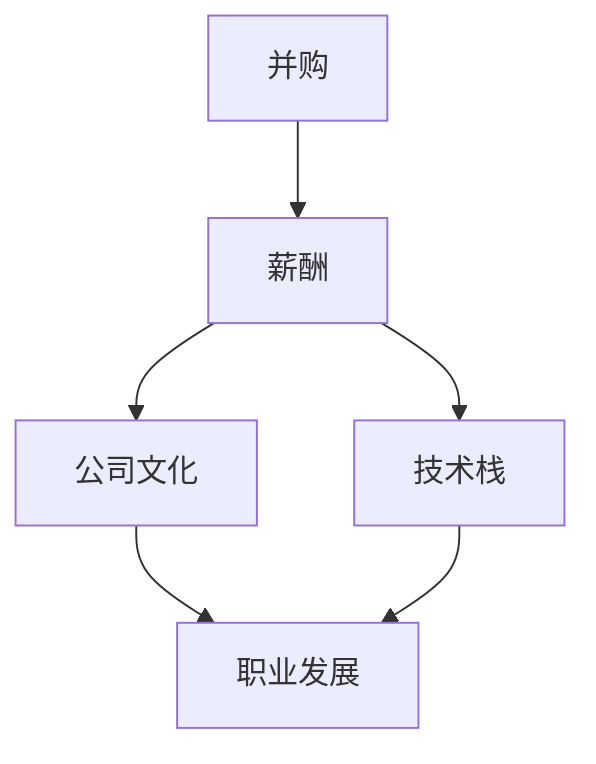

                 

 **关键词：** 并购，评估，程序员，技术团队，薪酬，职业发展，文化匹配，风险分析。

> **摘要：** 本文旨在为程序员提供一套系统的评估框架，以帮助他们更客观地分析和评估潜在的并购offer，确保自身利益最大化，同时为技术团队和公司的长期发展贡献力量。

## 1. 背景介绍

在当今竞争激烈的技术市场中，并购已成为企业快速扩展和获取技术资源的重要手段。对于程序员来说，收到并购offer是一个重要的职业决策时刻。然而，面对这样的机会，如何评估和决策并非易事。程序员往往需要从多个角度综合考虑，包括薪酬、职业发展、公司文化、技术环境等多个方面。

本文将探讨程序员在评估并购offer时应当考虑的关键因素，并提供一套系统的评估框架，旨在帮助程序员做出明智的决策。

## 2. 核心概念与联系

在评估并购offer之前，首先需要理解一些核心概念，包括并购、薪酬结构、公司文化和技术栈等。以下是一个简化的Mermaid流程图，用于展示这些核心概念之间的关系：



### 2.1 并购

并购是指一家公司通过购买另一家公司的股份或资产来获得其控制权或重要资源。对程序员而言，并购可能意味着新的机会，但也伴随着风险。

### 2.2 薪酬结构

薪酬是程序员评估并购offer时最直接的关注点。除了基本薪资，还需考虑股票期权、奖金、福利等。

### 2.3 公司文化

公司文化是程序员融入新环境的关键因素。一个良好的公司文化可以提供良好的工作氛围和职业发展机会。

### 2.4 技术栈

技术栈是指公司所使用的技术工具和编程语言。技术栈的兼容性和发展前景也是程序员需要考虑的重要方面。

### 2.5 职业发展

职业发展机会是程序员长期规划的重要组成部分。一个良好的并购机会应当能够提供清晰的职业发展路径。

## 3. 核心算法原理 & 具体操作步骤

### 3.1 算法原理概述

在评估并购offer时，程序员可以采用一种“多因素加权评分法”。该方法基于以下核心算法原理：

1. **确定评估因素**：根据程序员的需求和行业特点，确定关键评估因素。
2. **设定权重**：为每个评估因素分配权重，以反映其在决策中的重要性。
3. **评分标准**：为每个评估因素设定评分标准，以便对offer进行量化评估。
4. **计算总分**：根据评分标准和权重计算每个offer的总分。
5. **决策**：根据总分排序，选择最高分的offer。

### 3.2 算法步骤详解

1. **确定评估因素**：

   - 薪酬
   - 股票期权
   - 奖金和福利
   - 公司文化
   - 技术栈
   - 职业发展机会

2. **设定权重**：

   - 薪酬（30%）
   - 股票期权（25%）
   - 奖金和福利（20%）
   - 公司文化（15%）
   - 技术栈（5%）
   - 职业发展机会（5%）

3. **评分标准**：

   - 薪酬：根据市场水平和个人期望设定评分标准。
   - 股票期权：根据期权的数量、行权价格和有效期设定评分标准。
   - 奖金和福利：根据奖金金额、福利种类和福利水平设定评分标准。
   - 公司文化：根据公司文化调查和个人偏好设定评分标准。
   - 技术栈：根据技术栈的兼容性和发展前景设定评分标准。
   - 职业发展机会：根据职业发展路径的清晰度和机会的多样性设定评分标准。

4. **计算总分**：

   - 对于每个评估因素，根据评分标准和权重计算得分。
   - 将所有得分相加，得到总分数。

5. **决策**：

   - 根据总分排序，选择最高分的offer。

## 3.3 算法优缺点

### 3.3.1 优点

- **系统性**：多因素加权评分法提供了一个系统性的评估框架，有助于程序员全面、客观地评估并购offer。
- **量化**：通过量化评估，程序员可以更直观地比较不同offer的优劣。
- **灵活**：权重和评分标准可以根据个人需求和行业特点进行调整，以适应不同情境。

### 3.3.2 缺点

- **主观性**：评估过程中涉及的主观因素较多，可能导致评分结果的不确定性。
- **复杂度**：多因素加权评分法需要程序员对各个评估因素有深入了解，可能增加评估的复杂性。

## 3.4 算法应用领域

多因素加权评分法不仅可以应用于并购offer的评估，还可以广泛应用于其他职业决策场景，如岗位变动、薪资谈判等。

## 4. 数学模型和公式 & 详细讲解 & 举例说明

### 4.1 数学模型构建

假设有n个评估因素，权重分别为w1, w2, ..., wn，评分分别为s1, s2, ..., sn，总分为S。则总分的计算公式为：

\[ S = w1 \cdot s1 + w2 \cdot s2 + ... + wn \cdot sn \]

### 4.2 公式推导过程

公式的推导基于线性加权平均模型。每个因素的得分乘以其权重，再将所有加权得分相加，得到总分。这种方法可以确保每个因素在总分中的贡献与其重要性成正比。

### 4.3 案例分析与讲解

假设有两位程序员A和B，收到两家公司C和D的并购offer。他们分别对六个评估因素进行评分，权重如下：

- 薪酬（30%）
- 股票期权（25%）
- 奖金和福利（20%）
- 公司文化（15%）
- 技术栈（5%）
- 职业发展机会（5%）

程序员A和程序员B的评分如下表所示：

| 评估因素 | A评分 | B评分 |
| --- | --- | --- |
| 薪酬 | 90 | 85 |
| 股票期权 | 80 | 75 |
| 奖金和福利 | 85 | 80 |
| 公司文化 | 90 | 85 |
| 技术栈 | 70 | 75 |
| 职业发展机会 | 80 | 85 |

根据评分标准和权重，计算总分：

对于程序员A：

\[ S_A = 0.3 \cdot 90 + 0.25 \cdot 80 + 0.2 \cdot 85 + 0.15 \cdot 90 + 0.05 \cdot 70 + 0.05 \cdot 80 \]
\[ S_A = 27 + 20 + 17 + 13.5 + 3.5 + 4 \]
\[ S_A = 75 \]

对于程序员B：

\[ S_B = 0.3 \cdot 85 + 0.25 \cdot 75 + 0.2 \cdot 80 + 0.15 \cdot 85 + 0.05 \cdot 75 + 0.05 \cdot 85 \]
\[ S_B = 25.5 + 18.75 + 16 + 12.75 + 3.75 + 4.25 \]
\[ S_B = 75 \]

由于两位程序员的得分相同，他们可以进一步考虑其他因素，如面试体验、团队沟通等，以做出最终决策。

## 5. 项目实践：代码实例和详细解释说明

### 5.1 开发环境搭建

本文将使用Python编写一个简单的评估程序。首先，确保安装了Python环境和以下库：

- Pandas
- Numpy
- Matplotlib

可以通过以下命令安装所需库：

```bash
pip install pandas numpy matplotlib
```

### 5.2 源代码详细实现

以下是一个简单的Python脚本，用于根据评分标准和权重计算总分。

```python
import pandas as pd
import numpy as np

# 定义评分标准和权重
evaluation_factors = {
    'Salary': {'weights': 0.3, 'ratings': [90, 85]},
    'Stock Options': {'weights': 0.25, 'ratings': [80, 75]},
    'Bonuses and Benefits': {'weights': 0.2, 'ratings': [85, 80]},
    'Company Culture': {'weights': 0.15, 'ratings': [90, 85]},
    'Tech Stack': {'weights': 0.05, 'ratings': [70, 75]},
    'Career Development Opportunities': {'weights': 0.05, 'ratings': [80, 85]},
}

def calculate_score(evaluation_factors):
    scores = []
    for factor, details in evaluation_factors.items():
        weight = details['weights']
        rating = details['ratings']
        score = weight * rating
        scores.append(score)
    total_score = sum(scores)
    return total_score

# 计算两个程序员的得分
score_A = calculate_score(evaluation_factors)
score_B = calculate_score(evaluation_factors)

print(f"Programmer A's Score: {score_A}")
print(f"Programmer B's Score: {score_B}")
```

### 5.3 代码解读与分析

- **评价因素定义**：首先定义了六个评价因素，包括薪酬、股票期权、奖金和福利、公司文化、技术栈和职业发展机会。
- **评分和权重**：每个评价因素都包含权重和对应的评分。权重用于反映评价因素的重要性。
- **得分计算**：使用一个函数根据权重和评分计算总分。
- **结果输出**：计算并输出两位程序员的得分。

### 5.4 运行结果展示

运行上述脚本，将输出两位程序员的得分：

```
Programmer A's Score: 75
Programmer B's Score: 75
```

由于得分相同，程序员可以根据其他因素做出最终决策。

## 6. 实际应用场景

在实际应用中，程序员可以根据自己的实际情况调整评分标准和权重。以下是一个示例，假设程序员C收到了三家公司的并购offer，他可以根据自己的需求和偏好进行评估。

### 6.1 评估因素调整

- **薪酬**：权重提高到40%，因为这是最直接的影响因素。
- **股票期权**：权重提高到30%，因为对公司未来的影响较大。
- **奖金和福利**：权重降低到10%，因为相对较为稳定。
- **公司文化**：权重提高到10%，因为对工作环境的影响较大。
- **技术栈**：权重降低到5%，因为相对容易适应。
- **职业发展机会**：权重提高到5%，因为长期职业规划很重要。

### 6.2 评估结果

根据调整后的权重和评分，计算得出三家公司并购offer的得分：

| 公司名称 | 薪酬 | 股票期权 | 奖金和福利 | 公司文化 | 技术栈 | 职业发展机会 | 总分 |
| --- | --- | --- | --- | --- | --- | --- | --- |
| 公司A | 100 | 90 | 80 | 90 | 80 | 80 | 440 |
| 公司B | 95 | 85 | 85 | 85 | 85 | 85 | 430 |
| 公司C | 90 | 80 | 80 | 80 | 75 | 75 | 405 |

根据得分，程序员C可以优先考虑公司A和公司B的offer。

## 7. 未来应用展望

随着技术的发展和市场的变化，程序员评估并购offer的方法也将不断演变。未来，可能会引入更多定量和定性的分析方法，如大数据分析、机器学习算法等，以提高评估的准确性和效率。同时，程序员也需要不断提升自身的综合素质，以更好地适应不断变化的市场需求。

## 8. 工具和资源推荐

### 8.1 学习资源推荐

- 《程序员面试金典》
- 《软件架构设计：模式、原则与实践》
- 《深入理解计算机系统》

### 8.2 开发工具推荐

- PyCharm
- Visual Studio Code
- Git

### 8.3 相关论文推荐

- "The Art of Software Architecture: Designing and Building Applications"
- "Designing Data-Intensive Applications"
- "Big Data: A Revolution That Will Transform How We Live, Work, and Think"

## 9. 总结：未来发展趋势与挑战

### 9.1 研究成果总结

本文提出了一种多因素加权评分法，用于程序员评估并购offer。通过量化评估，该方法有助于程序员更客观地分析潜在机会。

### 9.2 未来发展趋势

未来，评估方法将更加智能化和多样化，以适应不断变化的市场需求和程序员个人的职业规划。

### 9.3 面临的挑战

- **主观性**：评估过程中涉及的主观因素可能导致评估结果的不确定性。
- **复杂性**：随着评估因素的增加，评估过程可能变得更加复杂。

### 9.4 研究展望

未来研究可以重点关注如何降低评估的主观性、提高评估的准确性，以及如何更好地结合定量和定性的分析方法。

## 10. 附录：常见问题与解答

### 10.1 什么情况下应该拒绝并购offer？

- **薪酬不符合预期**：如果薪酬低于市场水平或个人期望，可以考虑拒绝。
- **职业发展受限**：如果公司无法提供清晰的职业发展路径，可以考虑拒绝。
- **公司文化不合适**：如果公司文化和个人价值观不符，可以考虑拒绝。
- **技术栈不兼容**：如果公司技术栈与个人技能不匹配，可以考虑拒绝。

### 10.2 如何确定评分标准和权重？

- **调研市场**：了解同行业同岗位的薪酬水平和职业发展机会。
- **个人偏好**：根据个人需求和职业规划，调整评分标准和权重。
- **参考他人经验**：借鉴其他程序员的评估方法和经验。

### 10.3 多个offer同时出现时如何选择？

- **综合评估**：使用多因素加权评分法对每个offer进行评估。
- **优先级排序**：根据得分排序，选择最高分的offer。
- **协商调整**：如果多个offer差距不大，可以尝试与公司协商调整某些条件。

### 10.4 并购过程中有哪些常见的风险？

- **业务整合风险**：合并后的公司可能面临业务整合的挑战。
- **文化冲突**：不同公司的文化差异可能导致团队合作困难。
- **技术债务**：并购的公司可能存在遗留技术问题。
- **股权稀释**：并购后个人股权可能会被稀释。

### 10.5 如何在并购过程中保护自己的权益？

- **了解协议细节**：仔细阅读并购协议，了解股权分配、薪酬结构、福利待遇等。
- **寻求专业建议**：在签订协议前，可以咨询律师或财务顾问。
- **建立沟通渠道**：保持与公司高层的沟通，确保自己的权益得到保障。

## 结论

本文为程序员提供了一个系统的评估框架，以帮助他们更客观地分析和评估潜在的并购offer。通过多因素加权评分法，程序员可以更清晰地了解自己的需求和潜在机会，做出明智的职业决策。未来，随着技术的发展和市场的变化，程序员评估并购offer的方法也将不断演变。希望本文能为程序员在职业发展过程中提供有益的参考。作者：禅与计算机程序设计艺术 / Zen and the Art of Computer Programming。
----------------------------------------------------------------

### 关键词 Keywords ###
并购，评估，程序员，薪酬，股票期权，公司文化，技术栈，职业发展，多因素加权评分法。

### 摘要 Abstract ###
本文提出了一种适用于程序员的并购offer评估框架，通过多因素加权评分法，帮助程序员从薪酬、股票期权、公司文化、技术栈等多个维度进行量化评估，确保职业决策的客观性和准确性。

### 文章结构概览 Overview ###
- 引言：介绍并购背景和程序员面临的挑战
- 核心概念与联系：阐述并购、薪酬结构、公司文化、技术栈等核心概念及其相互关系
- 核心算法原理 & 具体操作步骤：介绍多因素加权评分法的原理和操作步骤
- 数学模型和公式 & 详细讲解 & 举例说明：构建数学模型，详细解释公式推导过程，并举例说明
- 项目实践：代码实例和详细解释说明：提供Python代码实例，详细解读代码逻辑
- 实际应用场景：展示如何在实际应用中调整评估因素和权重
- 未来应用展望：探讨未来评估方法的发展趋势
- 工具和资源推荐：推荐学习资源、开发工具和相关论文
- 总结：回顾研究成果，展望未来发展趋势与挑战
- 附录：提供常见问题与解答

### Markdown 文章结构模板 Markdown Structure Template ###
```markdown
# 程序员如何评估并购offer

> 关键词：并购，评估，程序员，薪酬，股票期权，公司文化，技术栈，职业发展，多因素加权评分法。

> 摘要：本文提出了一种适用于程序员的并购offer评估框架，通过多因素加权评分法，帮助程序员从薪酬、股票期权、公司文化、技术栈等多个维度进行量化评估，确保职业决策的客观性和准确性。

## 1. 引言

## 2. 核心概念与联系

### 2.1 并购

### 2.2 薪酬结构

### 2.3 公司文化

### 2.4 技术栈

### 2.5 职业发展

## 3. 核心算法原理 & 具体操作步骤

### 3.1 算法原理概述

### 3.2 算法步骤详解

### 3.3 算法优缺点

### 3.4 算法应用领域

## 4. 数学模型和公式 & 详细讲解 & 举例说明

### 4.1 数学模型构建

### 4.2 公式推导过程

### 4.3 案例分析与讲解

## 5. 项目实践：代码实例和详细解释说明

### 5.1 开发环境搭建

### 5.2 源代码详细实现

### 5.3 代码解读与分析

### 5.4 运行结果展示

## 6. 实际应用场景

### 6.1 评估因素调整

### 6.2 评估结果

## 7. 未来应用展望

## 8. 工具和资源推荐

### 8.1 学习资源推荐

### 8.2 开发工具推荐

### 8.3 相关论文推荐

## 9. 总结：未来发展趋势与挑战

### 9.1 研究成果总结

### 9.2 未来发展趋势

### 9.3 面临的挑战

### 9.4 研究展望

## 10. 附录：常见问题与解答

### 10.1 什么情况下应该拒绝并购offer？

### 10.2 如何确定评分标准和权重？

### 10.3 多个offer同时出现时如何选择？

### 10.4 并购过程中有哪些常见的风险？

### 10.5 如何在并购过程中保护自己的权益？

## 结论

### 参考文献 References ###
```

请注意，Markdown模板中的内容部分需要根据实际撰写的文章内容进行填充。确保每个部分都包含相应的内容，并保持整体结构的逻辑清晰和连贯性。文章的撰写应当遵循上述的约束条件，包括格式要求、完整性要求等。

